# Data Flow Architecture -- DreamLab AI

**Last Updated**: 2026-02-28
**Status**: Production

## Overview

This document describes how data flows through the DreamLab AI system across five primary categories: authentication, HTTP requests, Nostr events, data storage, and the build pipeline.

---

## System Data Flow (High Level)

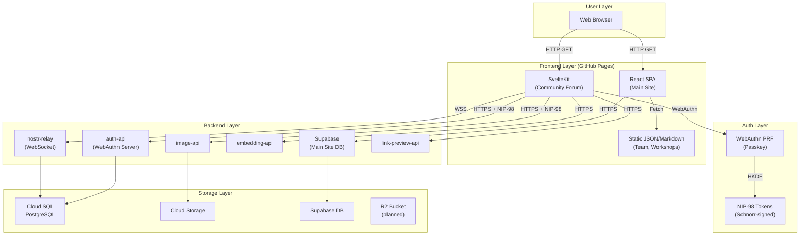
```mermaid
flowchart TB
    subgraph User["User Layer"]
        Browser["Web Browser"]
    end

    subgraph Frontend["Frontend Layer (GitHub Pages)"]
        React["React SPA<br/>(Main Site)"]
        Svelte["SvelteKit<br/>(Community Forum)"]
        StaticData["Static JSON/Markdown<br/>(Team, Workshops)"]
    end

    subgraph Auth["Auth Layer"]
        WebAuthn["WebAuthn PRF<br/>(Passkey)"]
        NIP98["NIP-98 Tokens<br/>(Schnorr-signed)"]
    end

    subgraph Backend["Backend Layer"]
        Supabase["Supabase<br/>(Main Site DB)"]
        AuthAPI["auth-api<br/>(WebAuthn Server)"]
        Relay["nostr-relay<br/>(WebSocket)"]
        EmbedAPI["embedding-api"]
        ImageAPI["image-api"]
        LinkAPI["link-preview-api"]
    end

    subgraph Storage["Storage Layer"]
        CloudSQL["Cloud SQL<br/>PostgreSQL"]
        GCS["Cloud Storage"]
        SupabaseDB["Supabase DB"]
        R2["R2 Bucket<br/>(planned)"]
    end

    Browser -->|HTTP GET| React
    Browser -->|HTTP GET| Svelte
    React -->|Fetch| StaticData
    React -->|HTTPS| Supabase
    Svelte -->|WebAuthn| WebAuthn
    WebAuthn -->|HKDF| NIP98
    Svelte -->|HTTPS + NIP-98| AuthAPI
    Svelte -->|WSS| Relay
    Svelte -->|HTTPS + NIP-98| ImageAPI
    Svelte -->|HTTPS| EmbedAPI
    Svelte -->|HTTPS| LinkAPI

    Supabase --> SupabaseDB
    AuthAPI --> CloudSQL
    Relay --> CloudSQL
    ImageAPI --> GCS
```

---

## 1. Authentication Flow

### WebAuthn PRF Key Derivation

The core authentication mechanism derives a deterministic secp256k1 private key from a WebAuthn PRF (Pseudo-Random Function) extension output. The private key is never stored -- it exists only in a JavaScript closure and is re-derived on each login.

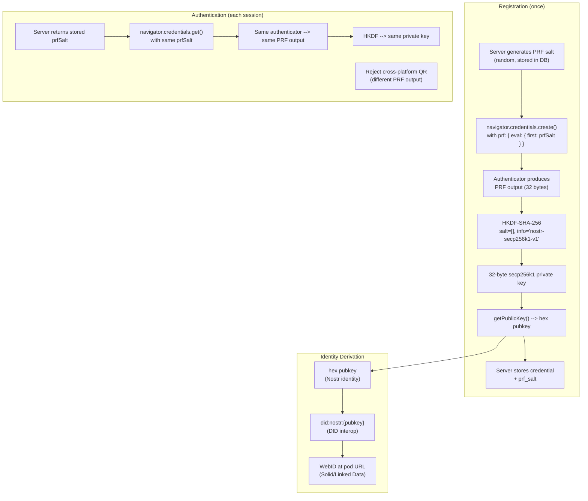
```mermaid
flowchart TB
    subgraph Registration["Registration (once)"]
        R1["Server generates PRF salt<br/>(random, stored in DB)"]
        R2["navigator.credentials.create()<br/>with prf: { eval: { first: prfSalt } }"]
        R3["Authenticator produces<br/>PRF output (32 bytes)"]
        R4["HKDF-SHA-256<br/>salt=[], info='nostr-secp256k1-v1'"]
        R5["32-byte secp256k1 private key"]
        R6["getPublicKey() --> hex pubkey"]
        R7["Server stores credential<br/>+ prf_salt"]
    end

    subgraph Login["Authentication (each session)"]
        L1["Server returns stored prfSalt"]
        L2["navigator.credentials.get()<br/>with same prfSalt"]
        L3["Same authenticator --> same PRF output"]
        L4["HKDF --> same private key"]
        L5["Reject cross-platform QR<br/>(different PRF output)"]
    end

    subgraph Identity["Identity Derivation"]
        I1["hex pubkey<br/>(Nostr identity)"]
        I2["did:nostr:{pubkey}<br/>(DID interop)"]
        I3["WebID at pod URL<br/>(Solid/Linked Data)"]
    end

    R1 --> R2 --> R3 --> R4 --> R5 --> R6 --> R7
    L1 --> L2 --> L3 --> L4
    R6 --> I1 --> I2 --> I3
```

### Complete Registration Sequence

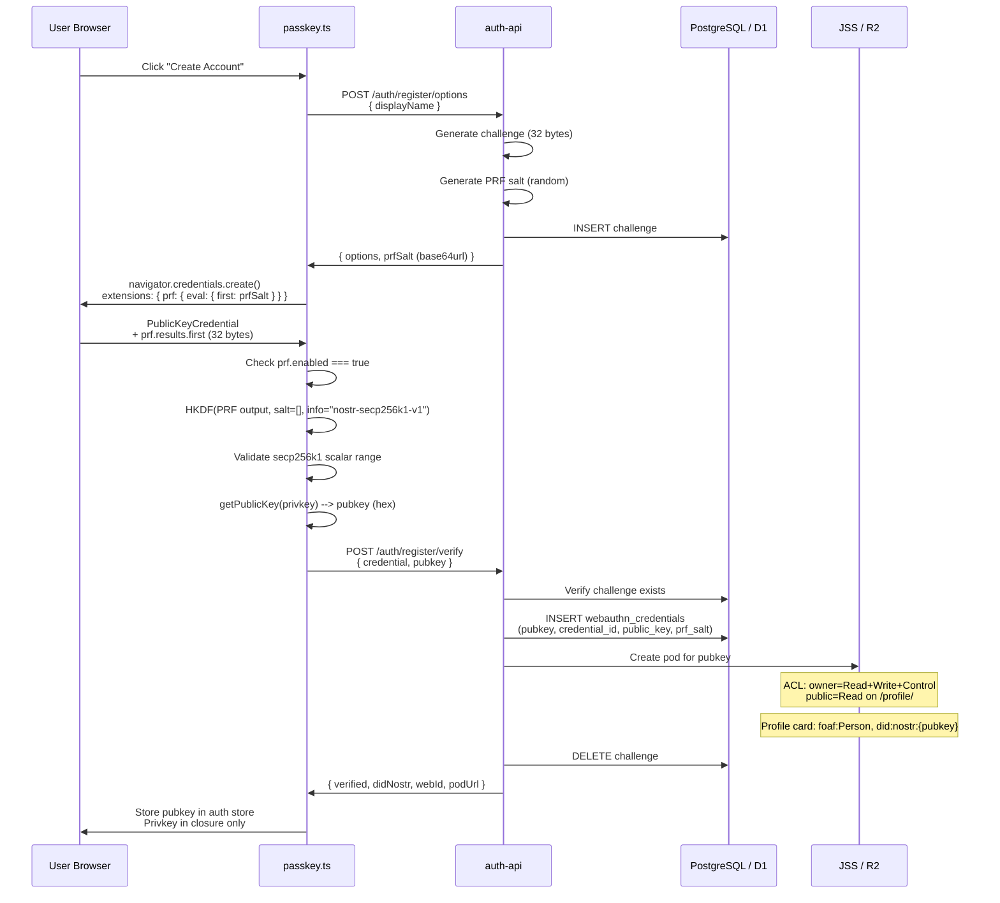
```mermaid
sequenceDiagram
    participant U as User Browser
    participant P as passkey.ts
    participant A as auth-api
    participant DB as PostgreSQL / D1
    participant Pod as JSS / R2

    U->>P: Click "Create Account"
    P->>A: POST /auth/register/options<br/>{ displayName }
    A->>A: Generate challenge (32 bytes)
    A->>A: Generate PRF salt (random)
    A->>DB: INSERT challenge
    A->>P: { options, prfSalt (base64url) }

    P->>U: navigator.credentials.create()<br/>extensions: { prf: { eval: { first: prfSalt } } }
    U->>P: PublicKeyCredential<br/>+ prf.results.first (32 bytes)

    P->>P: Check prf.enabled === true
    P->>P: HKDF(PRF output, salt=[], info="nostr-secp256k1-v1")
    P->>P: Validate secp256k1 scalar range
    P->>P: getPublicKey(privkey) --> pubkey (hex)

    P->>A: POST /auth/register/verify<br/>{ credential, pubkey }
    A->>DB: Verify challenge exists
    A->>DB: INSERT webauthn_credentials<br/>(pubkey, credential_id, public_key, prf_salt)

    A->>Pod: Create pod for pubkey
    Note over Pod: ACL: owner=Read+Write+Control<br/>public=Read on /profile/
    Note over Pod: Profile card: foaf:Person, did:nostr:{pubkey}

    A->>DB: DELETE challenge
    A->>P: { verified, didNostr, webId, podUrl }
    P->>U: Store pubkey in auth store<br/>Privkey in closure only
```

### Complete Authentication Sequence

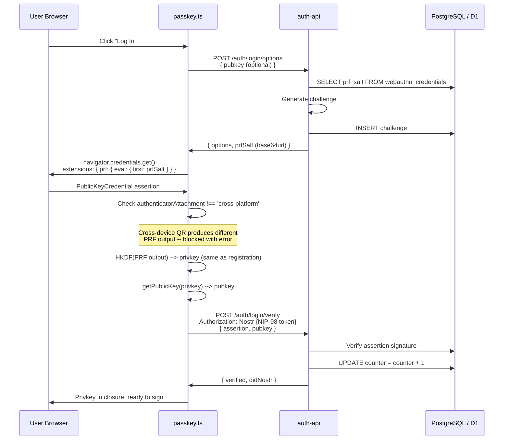
```mermaid
sequenceDiagram
    participant U as User Browser
    participant P as passkey.ts
    participant A as auth-api
    participant DB as PostgreSQL / D1

    U->>P: Click "Log In"
    P->>A: POST /auth/login/options<br/>{ pubkey (optional) }
    A->>DB: SELECT prf_salt FROM webauthn_credentials
    A->>A: Generate challenge
    A->>DB: INSERT challenge
    A->>P: { options, prfSalt (base64url) }

    P->>U: navigator.credentials.get()<br/>extensions: { prf: { eval: { first: prfSalt } } }
    U->>P: PublicKeyCredential assertion

    P->>P: Check authenticatorAttachment !== 'cross-platform'
    Note over P: Cross-device QR produces different<br/>PRF output -- blocked with error

    P->>P: HKDF(PRF output) --> privkey (same as registration)
    P->>P: getPublicKey(privkey) --> pubkey

    P->>A: POST /auth/login/verify<br/>Authorization: Nostr {NIP-98 token}<br/>{ assertion, pubkey }
    A->>DB: Verify assertion signature
    A->>DB: UPDATE counter = counter + 1
    A->>P: { verified, didNostr }
    P->>U: Privkey in closure, ready to sign
```

### NIP-98 HTTP Authentication

Every state-mutating API call from the forum uses NIP-98 `Authorization: Nostr <base64(event)>`:

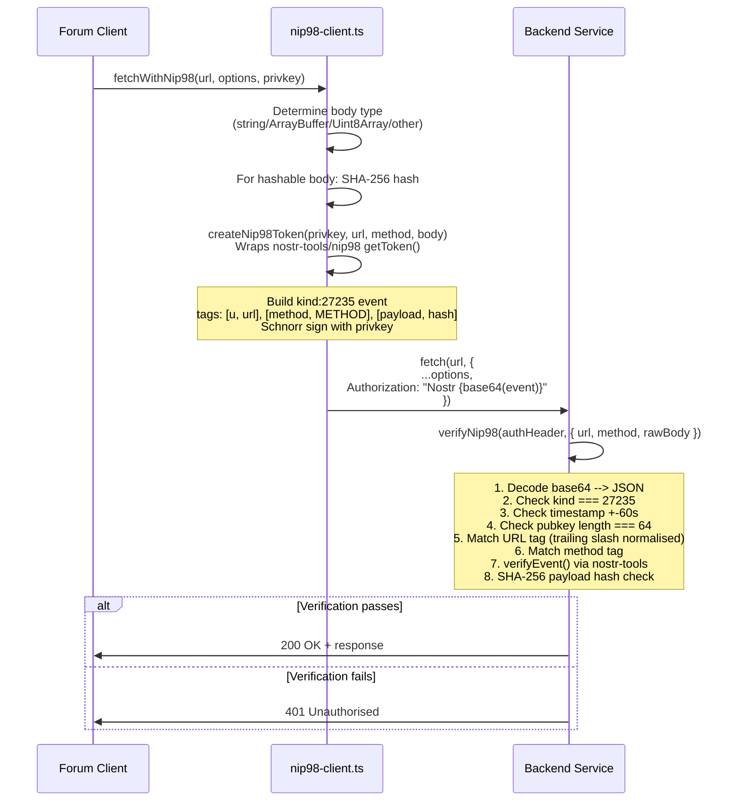
```mermaid
sequenceDiagram
    participant C as Forum Client
    participant N as nip98-client.ts
    participant S as Backend Service

    C->>N: fetchWithNip98(url, options, privkey)

    N->>N: Determine body type<br/>(string/ArrayBuffer/Uint8Array/other)
    N->>N: For hashable body: SHA-256 hash

    N->>N: createNip98Token(privkey, url, method, body)<br/>Wraps nostr-tools/nip98 getToken()

    Note over N: Build kind:27235 event<br/>tags: [u, url], [method, METHOD], [payload, hash]<br/>Schnorr sign with privkey

    N->>S: fetch(url, {<br/>  ...options,<br/>  Authorization: "Nostr {base64(event)}"<br/>})

    S->>S: verifyNip98(authHeader, { url, method, rawBody })
    Note over S: 1. Decode base64 --> JSON<br/>2. Check kind === 27235<br/>3. Check timestamp +-60s<br/>4. Check pubkey length === 64<br/>5. Match URL tag (trailing slash normalised)<br/>6. Match method tag<br/>7. verifyEvent() via nostr-tools<br/>8. SHA-256 payload hash check

    alt Verification passes
        S->>C: 200 OK + response
    else Verification fails
        S->>C: 401 Unauthorised
    end
```

### Identity Model

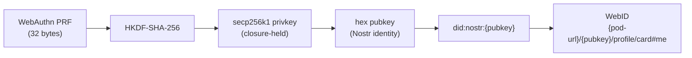
```mermaid
flowchart LR
    PRF["WebAuthn PRF<br/>(32 bytes)"] --> HKDF["HKDF-SHA-256"]
    HKDF --> Privkey["secp256k1 privkey<br/>(closure-held)"]
    Privkey --> Pubkey["hex pubkey<br/>(Nostr identity)"]
    Pubkey --> DID["did:nostr:{pubkey}"]
    DID --> WebID["WebID<br/>{pod-url}/{pubkey}/profile/card#me"]
```

---

## 2. Request Flow

### Main Site Page Load

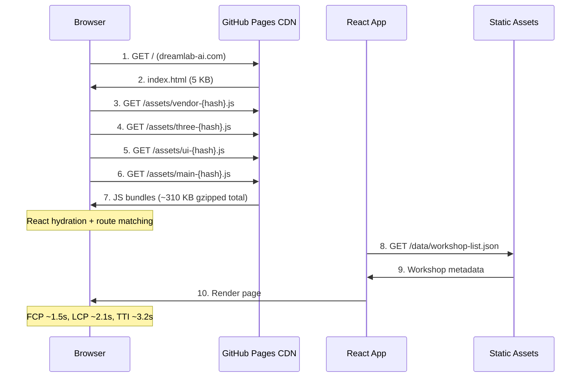
```mermaid
sequenceDiagram
    participant B as Browser
    participant CDN as GitHub Pages CDN
    participant React as React App
    participant Static as Static Assets

    B->>CDN: 1. GET / (dreamlab-ai.com)
    CDN->>B: 2. index.html (5 KB)

    B->>CDN: 3. GET /assets/vendor-{hash}.js
    B->>CDN: 4. GET /assets/three-{hash}.js
    B->>CDN: 5. GET /assets/ui-{hash}.js
    B->>CDN: 6. GET /assets/main-{hash}.js
    CDN->>B: 7. JS bundles (~310 KB gzipped total)

    Note over B: React hydration + route matching
    React->>Static: 8. GET /data/workshop-list.json
    Static->>React: 9. Workshop metadata
    React->>B: 10. Render page

    Note over B: FCP ~1.5s, LCP ~2.1s, TTI ~3.2s
```

### Workshop Page Navigation

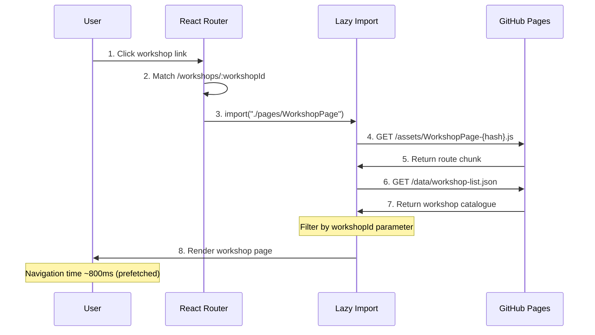
```mermaid
sequenceDiagram
    participant U as User
    participant Router as React Router
    participant Lazy as Lazy Import
    participant CDN as GitHub Pages

    U->>Router: 1. Click workshop link
    Router->>Router: 2. Match /workshops/:workshopId
    Router->>Lazy: 3. import("./pages/WorkshopPage")

    Lazy->>CDN: 4. GET /assets/WorkshopPage-{hash}.js
    CDN->>Lazy: 5. Return route chunk

    Lazy->>CDN: 6. GET /data/workshop-list.json
    CDN->>Lazy: 7. Return workshop catalogue

    Note over Lazy: Filter by workshopId parameter
    Lazy->>U: 8. Render workshop page

    Note over U: Navigation time ~800ms (prefetched)
```

### Team Page Data Loading

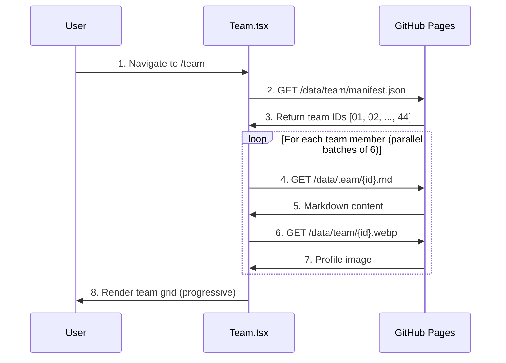
```mermaid
sequenceDiagram
    participant U as User
    participant Team as Team.tsx
    participant CDN as GitHub Pages

    U->>Team: 1. Navigate to /team
    Team->>CDN: 2. GET /data/team/manifest.json
    CDN->>Team: 3. Return team IDs [01, 02, ..., 44]

    loop For each team member (parallel batches of 6)
        Team->>CDN: 4. GET /data/team/{id}.md
        CDN->>Team: 5. Markdown content
        Team->>CDN: 6. GET /data/team/{id}.webp
        CDN->>Team: 7. Profile image
    end

    Team->>U: 8. Render team grid (progressive)
```

### Contact Form Submission

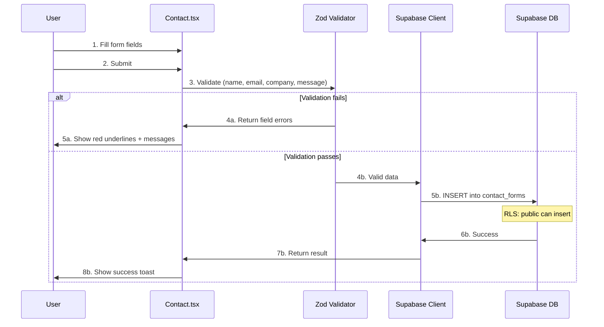
```mermaid
sequenceDiagram
    participant U as User
    participant Form as Contact.tsx
    participant Zod as Zod Validator
    participant Supa as Supabase Client
    participant DB as Supabase DB

    U->>Form: 1. Fill form fields
    U->>Form: 2. Submit

    Form->>Zod: 3. Validate (name, email, company, message)
    alt Validation fails
        Zod->>Form: 4a. Return field errors
        Form->>U: 5a. Show red underlines + messages
    else Validation passes
        Zod->>Supa: 4b. Valid data
        Supa->>DB: 5b. INSERT into contact_forms
        Note over DB: RLS: public can insert
        DB->>Supa: 6b. Success
        Supa->>Form: 7b. Return result
        Form->>U: 8b. Show success toast
    end
```

---

## 3. Nostr Event Flow

### Channel Message Publishing

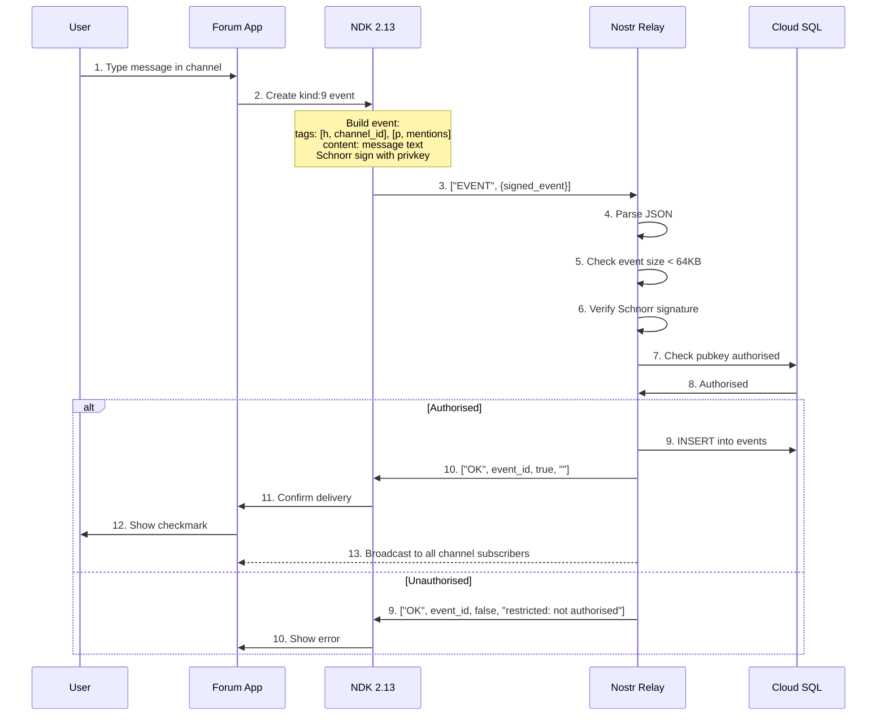
```mermaid
sequenceDiagram
    participant U as User
    participant App as Forum App
    participant NDK as NDK 2.13
    participant Relay as Nostr Relay
    participant DB as Cloud SQL

    U->>App: 1. Type message in channel
    App->>NDK: 2. Create kind:9 event
    Note over NDK: Build event:<br/>tags: [h, channel_id], [p, mentions]<br/>content: message text<br/>Schnorr sign with privkey

    NDK->>Relay: 3. ["EVENT", {signed_event}]

    Relay->>Relay: 4. Parse JSON
    Relay->>Relay: 5. Check event size < 64KB
    Relay->>Relay: 6. Verify Schnorr signature
    Relay->>DB: 7. Check pubkey authorised
    DB->>Relay: 8. Authorised

    alt Authorised
        Relay->>DB: 9. INSERT into events
        Relay->>NDK: 10. ["OK", event_id, true, ""]
        NDK->>App: 11. Confirm delivery
        App->>U: 12. Show checkmark
        Relay-->>App: 13. Broadcast to all channel subscribers
    else Unauthorised
        Relay->>NDK: 9. ["OK", event_id, false, "restricted: not authorised"]
        NDK->>App: 10. Show error
    end
```

### Supported NIPs

| NIP | Kind(s) | Purpose |
|-----|---------|---------|
| NIP-01 | 0, 1, 3 | Basic protocol: metadata, text notes, contacts |
| NIP-17 | 14 | Private direct messages (sealed sender) |
| NIP-28 | 40, 41, 42 | Public channels: create, metadata, messages |
| NIP-44 | - | Encryption standard (for NIP-17 DMs) |
| NIP-52 | 31922, 31923 | Calendar events |
| NIP-98 | 27235 | HTTP authentication |

### Direct Message Flow (NIP-17 + NIP-44)

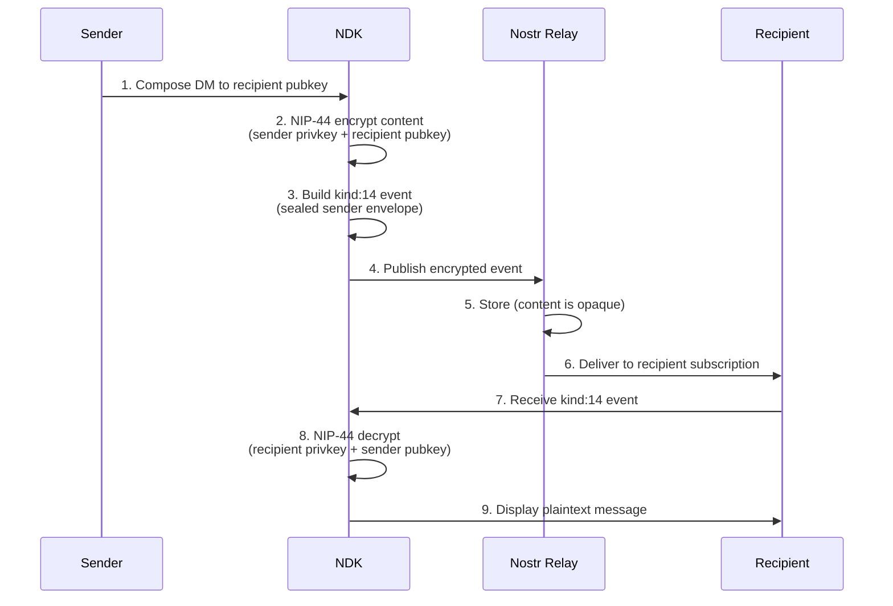
```mermaid
sequenceDiagram
    participant A as Sender
    participant NDK as NDK
    participant Relay as Nostr Relay
    participant B as Recipient

    A->>NDK: 1. Compose DM to recipient pubkey
    NDK->>NDK: 2. NIP-44 encrypt content<br/>(sender privkey + recipient pubkey)
    NDK->>NDK: 3. Build kind:14 event<br/>(sealed sender envelope)
    NDK->>Relay: 4. Publish encrypted event
    Relay->>Relay: 5. Store (content is opaque)
    Relay->>B: 6. Deliver to recipient subscription
    B->>NDK: 7. Receive kind:14 event
    NDK->>NDK: 8. NIP-44 decrypt<br/>(recipient privkey + sender pubkey)
    NDK->>B: 9. Display plaintext message
```

### Event Processing Pipeline

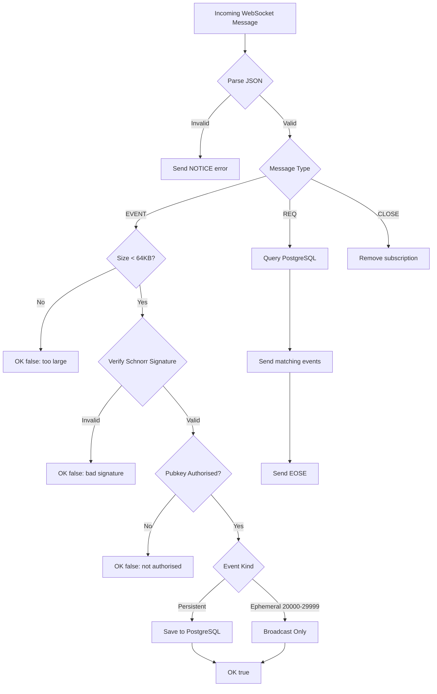
```mermaid
flowchart TD
    MSG["Incoming WebSocket Message"] --> PARSE{Parse JSON}
    PARSE -->|Invalid| NOTICE["Send NOTICE error"]
    PARSE -->|Valid| TYPE{Message Type}

    TYPE -->|EVENT| SIZE{Size < 64KB?}
    SIZE -->|No| REJECT["OK false: too large"]
    SIZE -->|Yes| SIG{Verify Schnorr Signature}
    SIG -->|Invalid| SIGFAIL["OK false: bad signature"]
    SIG -->|Valid| AUTH{Pubkey Authorised?}
    AUTH -->|No| AUTHFAIL["OK false: not authorised"]
    AUTH -->|Yes| KIND{Event Kind}
    KIND -->|Ephemeral 20000-29999| BROADCAST["Broadcast Only"]
    KIND -->|Persistent| SAVE["Save to PostgreSQL"]
    SAVE --> OK["OK true"]
    BROADCAST --> OK

    TYPE -->|REQ| QUERY["Query PostgreSQL"]
    QUERY --> EVENTS["Send matching events"]
    EVENTS --> EOSE["Send EOSE"]

    TYPE -->|CLOSE| REMOVE["Remove subscription"]
```

---

## 4. Data Storage Flow

### Storage Architecture

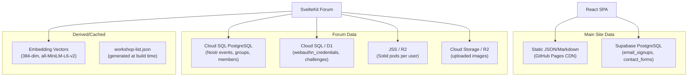
```mermaid
flowchart TB
    subgraph MainSite["Main Site Data"]
        StaticJSON["Static JSON/Markdown<br/>(GitHub Pages CDN)"]
        SupaDB["Supabase PostgreSQL<br/>(email_signups, contact_forms)"]
    end

    subgraph Forum["Forum Data"]
        Events["Cloud SQL PostgreSQL<br/>(Nostr events, groups, members)"]
        Credentials["Cloud SQL / D1<br/>(webauthn_credentials, challenges)"]
        Pods["JSS / R2<br/>(Solid pods per user)"]
        Images["Cloud Storage / R2<br/>(uploaded images)"]
    end

    subgraph Derived["Derived/Cached"]
        Embeddings["Embedding Vectors<br/>(384-dim, all-MiniLM-L6-v2)"]
        WorkshopJSON["workshop-list.json<br/>(generated at build time)"]
    end

    ReactApp["React SPA"] --> StaticJSON
    ReactApp --> SupaDB
    ForumApp["SvelteKit Forum"] --> Events
    ForumApp --> Credentials
    ForumApp --> Pods
    ForumApp --> Images
    ForumApp --> Embeddings
```

### Data Lifecycle

| Data Type | Source | Storage | TTL | Access Pattern |
|-----------|--------|---------|-----|----------------|
| Team profiles | Markdown in `public/data/team/` | GitHub Pages CDN | Indefinite | Read-only, progressive load |
| Workshop content | Markdown in `public/data/workshops/` | CDN via workshop-list.json | Build-time | Read-only, route-based |
| Email signups | Contact form | Supabase | Indefinite | Insert (public), read (admin) |
| Contact forms | Contact page | Supabase | Indefinite | Insert (public), read (admin) |
| WebAuthn credentials | Registration | Cloud SQL / D1 | Indefinite | Write once, read on login |
| Challenges | Auth flow | Cloud SQL / D1 | Short-lived | Write, read once, delete |
| Nostr events | Forum messages | Cloud SQL | Indefinite | Write (publish), read (subscribe) |
| Solid pods | Registration | JSS / R2 | Indefinite | CRUD (owner), read (public profile) |
| Uploaded images | Forum posts | Cloud Storage / R2 | Indefinite | Write (upload), read (display) |
| Embeddings | Nostr events | In-memory / cached | Session | Compute on demand |

### Pod Storage Flow (Current JSS vs Planned R2)

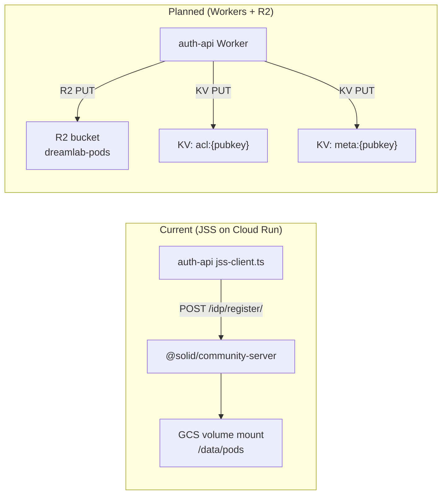
```mermaid
flowchart LR
    subgraph Current["Current (JSS on Cloud Run)"]
        JSSClient["auth-api jss-client.ts"]
        CSS["@solid/community-server"]
        GCSMount["GCS volume mount<br/>/data/pods"]

        JSSClient -->|POST /idp/register/| CSS
        CSS --> GCSMount
    end

    subgraph Planned["Planned (Workers + R2)"]
        AuthWorker["auth-api Worker"]
        R2Bucket["R2 bucket<br/>dreamlab-pods"]
        KVACL["KV: acl:{pubkey}"]
        KVMeta["KV: meta:{pubkey}"]

        AuthWorker -->|R2 PUT| R2Bucket
        AuthWorker -->|KV PUT| KVACL
        AuthWorker -->|KV PUT| KVMeta
    end
```

---

## 5. Build Pipeline Data Flow

### CI/CD Pipeline

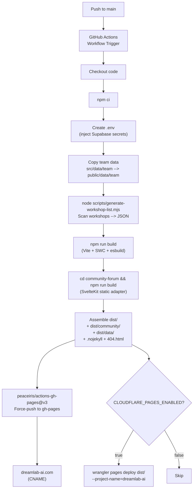
```mermaid
flowchart TB
    Push["Push to main"] --> GHA["GitHub Actions<br/>Workflow Trigger"]

    GHA --> Checkout["Checkout code"]
    Checkout --> Install["npm ci"]

    Install --> Env["Create .env<br/>(inject Supabase secrets)"]
    Env --> TeamData["Copy team data<br/>src/data/team --> public/data/team"]
    TeamData --> GenWorkshops["node scripts/generate-workshop-list.mjs<br/>Scan workshops --> JSON"]

    GenWorkshops --> BuildMain["npm run build<br/>(Vite + SWC + esbuild)"]
    BuildMain --> BuildForum["cd community-forum && npm run build<br/>(SvelteKit static adapter)"]

    BuildForum --> Assemble["Assemble dist/<br/>+ dist/community/<br/>+ dist/data/<br/>+ .nojekyll + 404.html"]

    Assemble --> Deploy["peaceiris/actions-gh-pages@v3<br/>Force-push to gh-pages"]
    Deploy --> Live["dreamlab-ai.com<br/>(CNAME)"]

    Assemble --> CFDeploy{CLOUDFLARE_PAGES_ENABLED?}
    CFDeploy -->|true| Wrangler["wrangler pages deploy dist/<br/>--project-name=dreamlab-ai"]
    CFDeploy -->|false| Skip["Skip"]
```

### Build Output Structure

```
dist/
+-- index.html                    # Main site entry
+-- 404.html                      # SPA fallback
+-- .nojekyll                     # Disable Jekyll processing
+-- assets/
|   +-- vendor-{hash}.js          # React, React DOM, Router (~120 KB gz)
|   +-- three-{hash}.js           # Three.js, R3F, drei (~80 KB gz)
|   +-- ui-{hash}.js              # 15 Radix UI components (~60 KB gz)
|   +-- main-{hash}.js            # Application code (~40 KB gz)
|   +-- main-{hash}.css           # Tailwind styles (~10 KB gz)
|   +-- WorkshopPage-{hash}.js    # Route chunk (lazy)
|   +-- Team-{hash}.js            # Route chunk (lazy)
|   +-- ...                       # Other route chunks
+-- data/
|   +-- team/
|   |   +-- manifest.json
|   |   +-- 01.md, 01.png, ...    # 44 team members
|   +-- workshops/                # Workshop content
|   +-- media/
|       +-- videos/
|       +-- *-thumb.jpg
+-- community/                    # SvelteKit forum app
    +-- index.html
    +-- _app/                     # SvelteKit assets
```

---

## 6. Caching Strategy

### Multi-Layer Cache

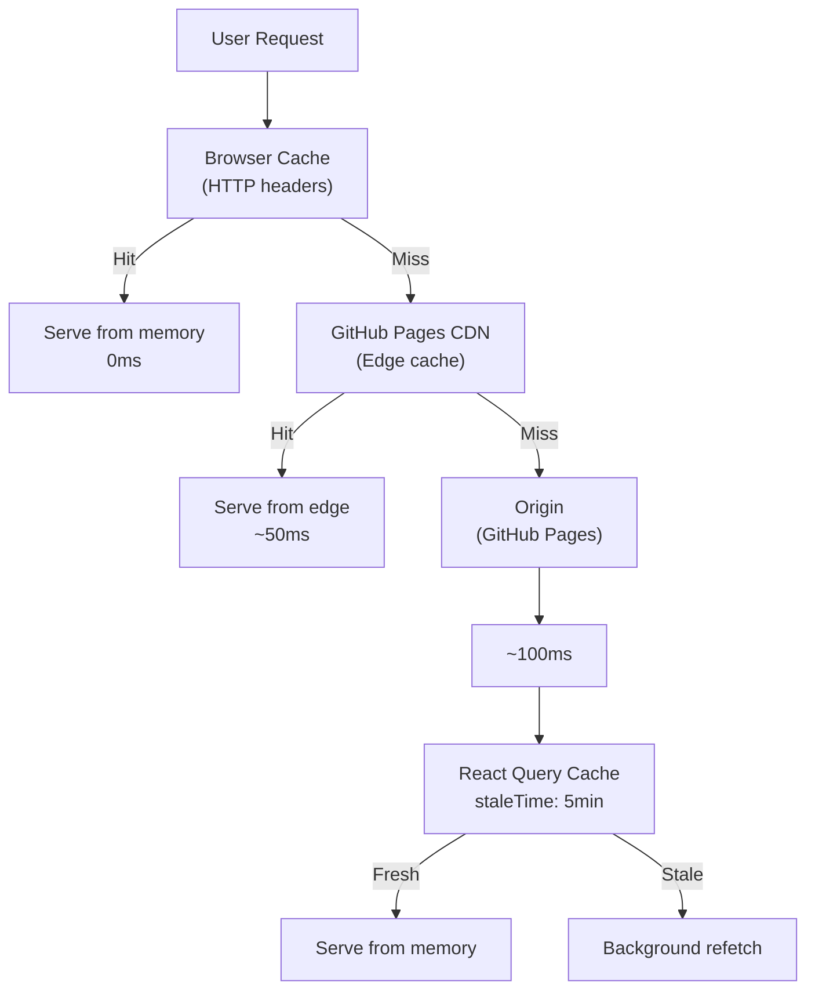
```mermaid
graph TB
    Request["User Request"] --> BrowserCache["Browser Cache<br/>(HTTP headers)"]

    BrowserCache -->|Hit| BrowserServe["Serve from memory<br/>0ms"]
    BrowserCache -->|Miss| CDNCache["GitHub Pages CDN<br/>(Edge cache)"]

    CDNCache -->|Hit| CDNServe["Serve from edge<br/>~50ms"]
    CDNCache -->|Miss| Origin["Origin<br/>(GitHub Pages)"]

    Origin --> OriginServe["~100ms"]

    OriginServe --> RQCache["React Query Cache<br/>staleTime: 5min"]
    RQCache -->|Fresh| RQServe["Serve from memory"]
    RQCache -->|Stale| Background["Background refetch"]
```

### Cache Configuration

| Layer | TTL | Controlled By |
|-------|-----|---------------|
| Browser HTTP cache | `Cache-Control: public, max-age=3600` | GitHub Pages |
| CDN edge cache | Automatic | GitHub Pages CDN |
| React Query (main site) | staleTime: 5 min, cacheTime: 10 min | QueryClient config |
| NDK relay cache (forum) | In-memory, session-scoped | NDK instance |
| Static assets (hashed) | Immutable (filename contains content hash) | Vite build |

---

## 7. Error Handling Flow

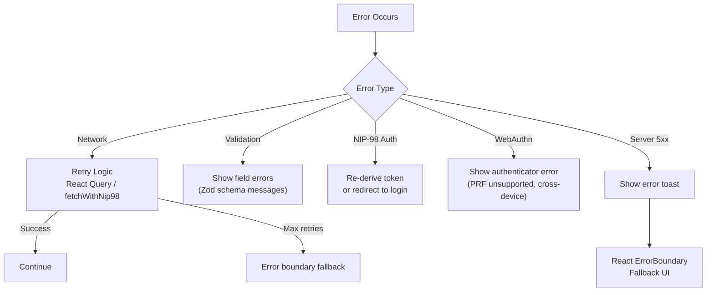
```mermaid
flowchart TB
    Error["Error Occurs"] --> Type{Error Type}

    Type -->|Network| Retry["Retry Logic<br/>React Query / fetchWithNip98"]
    Type -->|Validation| Form["Show field errors<br/>(Zod schema messages)"]
    Type -->|NIP-98 Auth| Reauth["Re-derive token<br/>or redirect to login"]
    Type -->|WebAuthn| WAError["Show authenticator error<br/>(PRF unsupported, cross-device)"]
    Type -->|Server 5xx| Toast["Show error toast"]

    Retry -->|Success| Continue["Continue"]
    Retry -->|Max retries| Fallback["Error boundary fallback"]

    Toast --> ErrorBoundary["React ErrorBoundary<br/>Fallback UI"]
```

---

## Data Flow Summary

| Flow | Latency | Protocol | Auth |
|------|---------|----------|------|
| Page load (main site) | 1.5--3.2s | HTTP/2 | None |
| Workshop navigation | ~800ms | HTTP/2 (lazy chunk) | None |
| Team profile load | 2--5s (44 members) | HTTP/2 (parallel) | None |
| Contact form submission | 200--500ms | HTTPS | None (public RLS) |
| WebAuthn registration | 2--5s (user interaction) | HTTPS | WebAuthn |
| WebAuthn authentication | 1--3s (user interaction) | HTTPS + NIP-98 | WebAuthn + NIP-98 |
| Channel message publish | 50--150ms | WSS | NIP-98 |
| Direct message (NIP-17) | 50--200ms | WSS | NIP-98 + NIP-44 encryption |
| Image upload | 800--2000ms | HTTPS + NIP-98 | NIP-98 |
| Semantic search | 300--500ms | HTTPS | None |
| Pod read (public profile) | 50--200ms | HTTPS | None (WAC public) |
| Pod write | 100--300ms | HTTPS + NIP-98 | NIP-98 + WAC owner |

---

## Related Documentation

- [System Overview](SYSTEM_OVERVIEW.md) -- High-level architecture
- [Frontend Architecture](FRONTEND_ARCHITECTURE.md) -- React and SvelteKit patterns
- [Backend Services](BACKEND_SERVICES.md) -- API and database architecture
- [Deployment Guide](DEPLOYMENT.md) -- CI/CD pipeline details

---

**Document Owner**: Architecture Team
**Review Cycle**: Quarterly
**Last Review**: 2026-02-28
