# Data Flow Architecture - DreamLab AI

**Last Updated**: 2026-01-25
**Status**: Production

## Overview

This document describes how data flows through the DreamLab AI system, from user interactions to backend services and back to the user interface.

---

## System Data Flow

### High-Level Data Movement

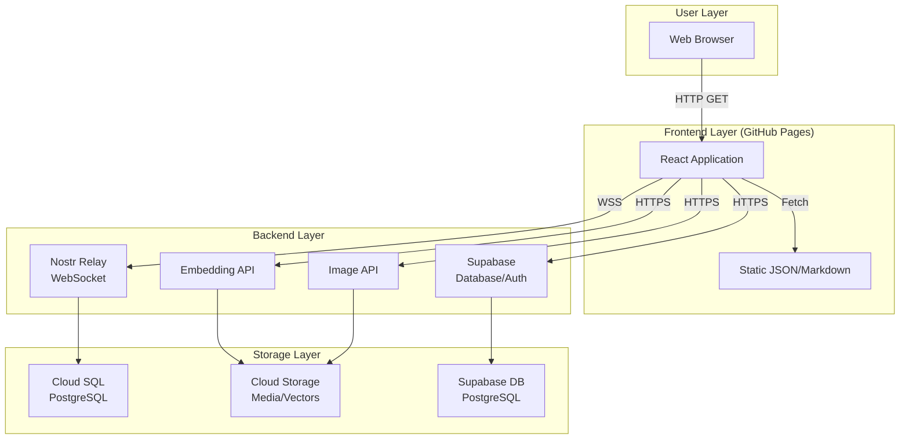

---

## 1. Page Load Flow (Main Site)

### Initial Page Request

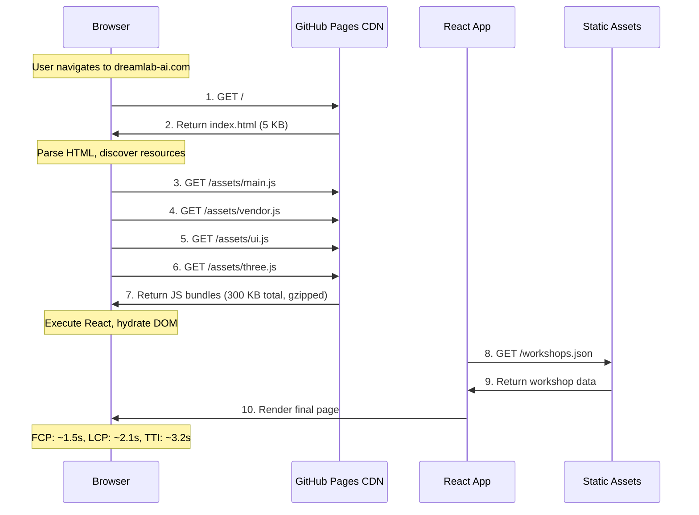

**Performance Characteristics**:

| Metric | Time | Description |
|--------|------|-------------|
| **TTFB** | ~100ms | GitHub Pages CDN response |
| **FCP** | ~1.5s | First Contentful Paint |
| **LCP** | ~2.1s | Largest Contentful Paint (hero image) |
| **TTI** | ~3.2s | Time to Interactive (React hydrated) |

---

## 2. Workshop Page Data Flow

### Dynamic Route Loading

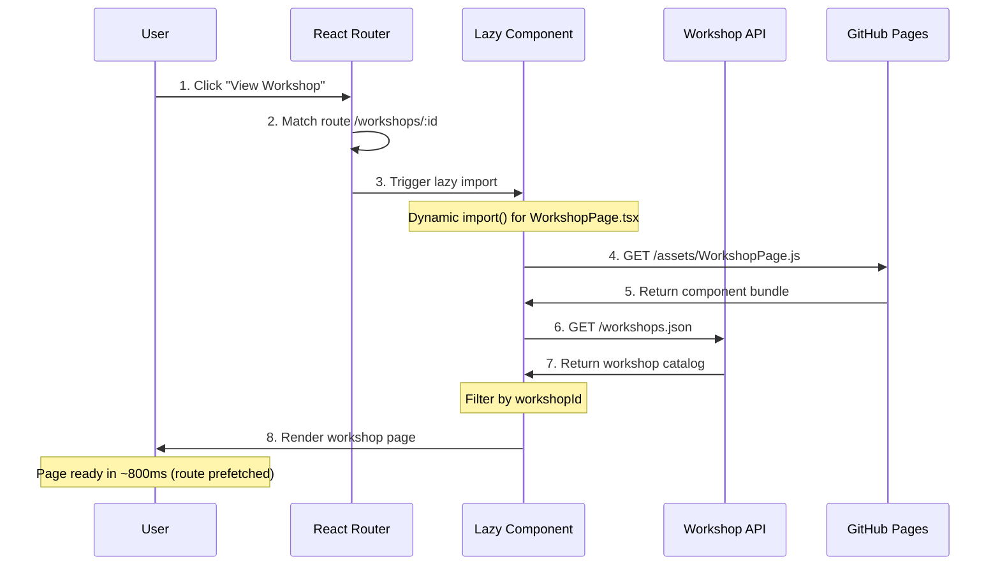

**Data Structure**:

```json
// /workshops.json
[
  {
    "id": "ai-agent-masterclass",
    "title": "AI Agent Masterclass",
    "description": "2-day residential training...",
    "duration": "2 days",
    "price": "£4,500",
    "pages": [
      {
        "slug": "overview",
        "title": "Course Overview",
        "content": "..."
      },
      {
        "slug": "curriculum",
        "title": "Curriculum",
        "content": "..."
      }
    ]
  }
]
```

---

## 3. Team Page Data Flow

### Team Member Loading

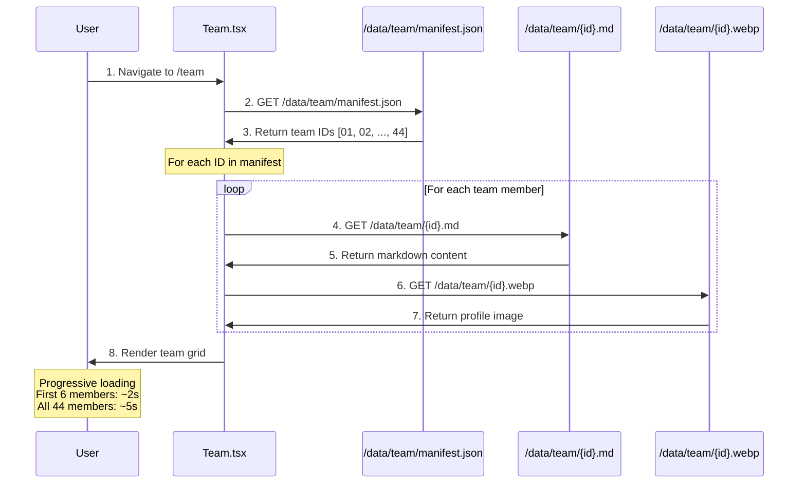

**Optimization Strategy**:

1. **Virtual scrolling**: Only render visible members
2. **Lazy loading**: Load images on scroll
3. **Batch requests**: Request 6 profiles at a time
4. **Image optimization**: WebP format (30% smaller)

**Data Flow**:

```
manifest.json (5 KB)
  → team IDs [01, 02, 03, ...]
  → Parallel fetch:
     - 01.md (2 KB) + 01.webp (20 KB)
     - 02.md (3 KB) + 02.webp (18 KB)
     - ...
```

---

## 4. Contact Form Submission Flow

### Form Data to Supabase

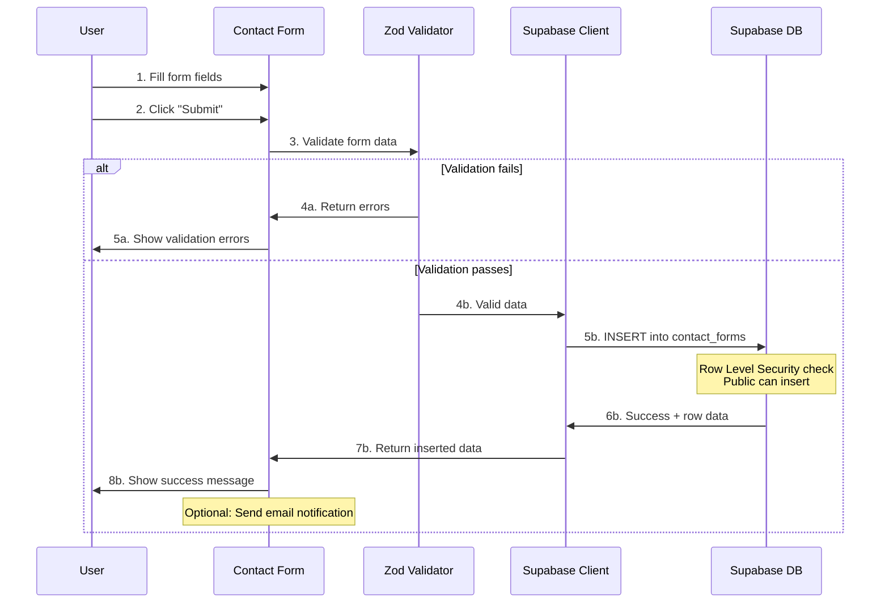

**Form Validation (Zod Schema)**:

```typescript
import { z } from "zod";

const contactFormSchema = z.object({
  name: z.string().min(2, "Name must be at least 2 characters"),
  email: z.string().email("Invalid email address"),
  company: z.string().optional(),
  message: z.string().min(10, "Message must be at least 10 characters"),
  selected_team_members: z.array(z.string()).optional(),
});

type ContactFormData = z.infer<typeof contactFormSchema>;
```

**Supabase Insertion**:

```typescript
async function submitContactForm(data: ContactFormData) {
  const validated = contactFormSchema.parse(data);

  const { data: result, error } = await supabase
    .from('contact_forms')
    .insert({
      name: validated.name,
      email: validated.email,
      company: validated.company,
      message: validated.message,
      selected_team_members: validated.selected_team_members,
      status: 'pending',
    })
    .select();

  if (error) throw error;
  return result;
}
```

---

## 5. Community Forum Message Flow (Nostr)

### Real-Time Messaging

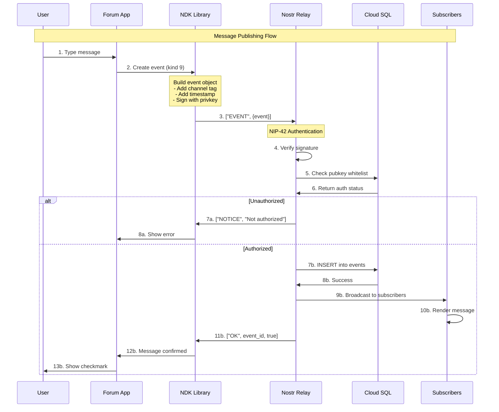

**Event Structure**:

```json
{
  "id": "abc123...",
  "pubkey": "user_pubkey_hex",
  "created_at": 1706112000,
  "kind": 9,
  "tags": [
    ["h", "channel_id"],
    ["p", "mentioned_pubkey"]
  ],
  "content": "Hello, world!",
  "sig": "signature_hex"
}
```

---

## 6. Semantic Search Flow (Embedding API)

### Vector-Based Search

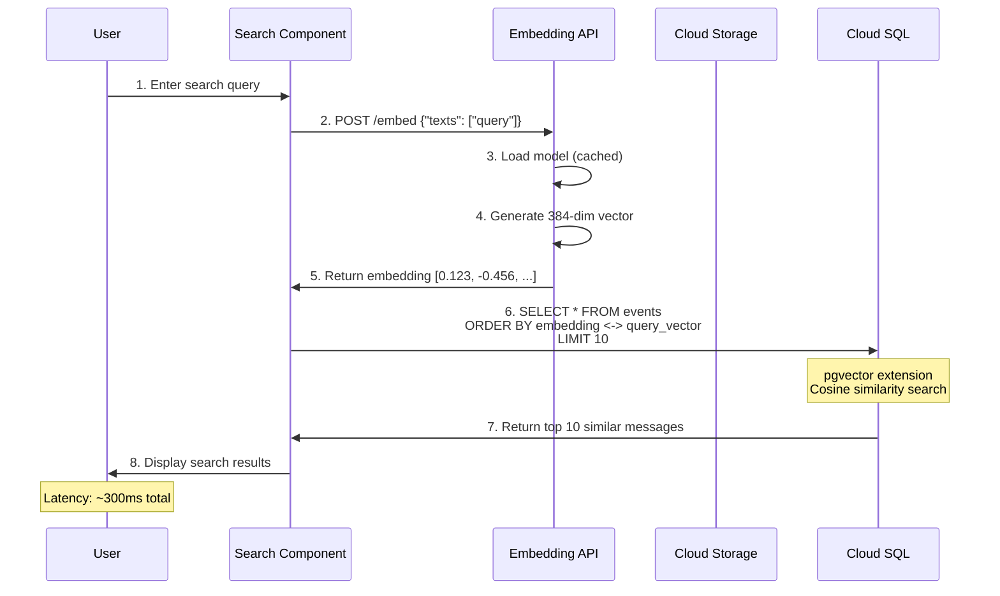

**Implementation**:

```typescript
async function semanticSearch(query: string) {
  // 1. Generate embedding for query
  const response = await fetch('https://embed.dreamlab-ai.com/embed', {
    method: 'POST',
    headers: { 'Content-Type': 'application/json' },
    body: JSON.stringify({ texts: [query] }),
  });
  const { embeddings } = await response.json();
  const queryVector = embeddings[0];

  // 2. Search database with pgvector
  const { data } = await supabase.rpc('search_messages', {
    query_embedding: queryVector,
    similarity_threshold: 0.7,
    limit: 10,
  });

  return data;
}
```

**PostgreSQL Function**:

```sql
CREATE FUNCTION search_messages(
  query_embedding vector(384),
  similarity_threshold float,
  limit int
)
RETURNS TABLE (
  id text,
  content text,
  similarity float
)
AS $$
  SELECT
    id,
    content,
    1 - (embedding <=> query_embedding) AS similarity
  FROM events
  WHERE 1 - (embedding <=> query_embedding) > similarity_threshold
  ORDER BY embedding <=> query_embedding
  LIMIT limit;
$$ LANGUAGE SQL;
```

---

## 7. Image Upload Flow (Image API)

### Media Processing Pipeline

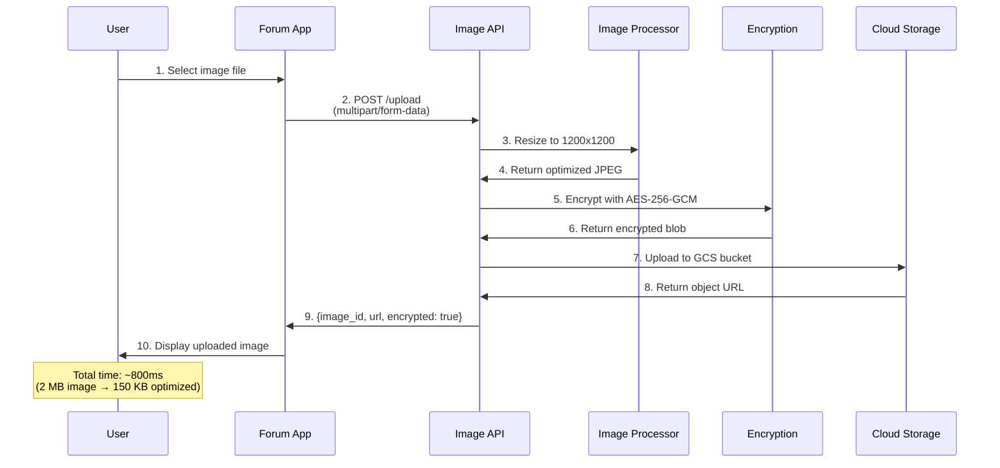

**Size Optimization**:

| Original | Resized | Encrypted | Final Size |
|----------|---------|-----------|------------|
| 2 MB PNG | 1200x1200 | AES-256-GCM | 150 KB |
| 5 MB JPG | 1200x1200 | AES-256-GCM | 180 KB |
| 10 MB HEIC | 1200x1200 | AES-256-GCM | 200 KB |

**Encryption Process**:

```javascript
function encryptImage(buffer, channelKey) {
  const iv = crypto.randomBytes(16);
  const cipher = crypto.createCipheriv('aes-256-gcm', channelKey, iv);

  const encrypted = Buffer.concat([
    cipher.update(buffer),
    cipher.final()
  ]);

  const authTag = cipher.getAuthTag();

  // Format: [IV (16) | AuthTag (16) | Encrypted Data]
  return Buffer.concat([iv, authTag, encrypted]);
}
```

---

## 8. Deployment Data Flow

### CI/CD Pipeline

```mermaid
flowchart TB
    Push["Push to main branch"] --> GHA["GitHub Actions<br/>Workflow Trigger"]

    GHA --> Checkout["Checkout code"]
    Checkout --> Install["npm install"]

    Install --> GenWorkshops["Generate workshops.json<br/>from /workshops-builder"]
    GenWorkshops --> BuildMain["Build main site<br/>npm run build"]
    BuildMain --> BuildCommunity["Build community app<br/>BASE_PATH=/community"]

    BuildCommunity --> Copy["Copy builds to dist/<br/>├── main site<br/>└── community/"]
    Copy --> Assets["Copy static assets<br/>├── team data<br/>└── media files"]

    Assets --> Deploy["Deploy to gh-pages<br/>peaceiris/actions-gh-pages"]
    Deploy --> CDN["GitHub Pages CDN<br/>Propagate globally"]

    CDN --> DNS["dreamlab-ai.com<br/>CNAME resolution"]
    DNS --> Live["Live site available"]

    Note over Push,Live: Total time: ~5 minutes
```

**Build Output Structure**:

```
dist/
├── index.html                  # Main site entry
├── assets/
│   ├── main-abc123.js         # App code (40 KB gzip)
│   ├── vendor-def456.js       # React, Router (120 KB gzip)
│   ├── three-ghi789.js        # Three.js (80 KB gzip)
│   ├── ui-jkl012.js           # Radix UI (60 KB gzip)
│   └── main-mno345.css        # Styles (10 KB gzip)
├── data/
│   ├── team/
│   │   ├── manifest.json
│   │   ├── 01.md
│   │   ├── 01.webp
│   │   └── ... (44 members)
│   ├── workshops.json
│   └── media/
│       └── videos/
└── community/                  # Fairfield forum app
    ├── index.html
    └── assets/
```

---

## 9. Error Handling Data Flow

### Error Propagation

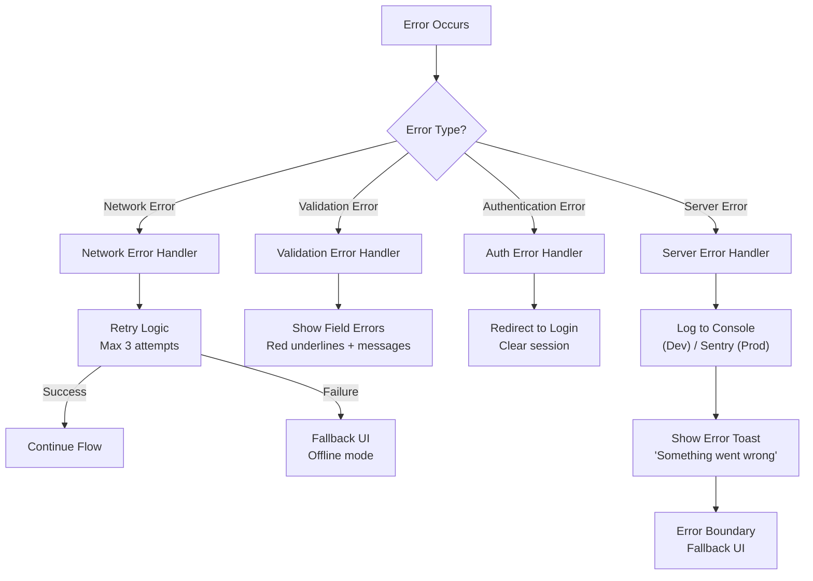

**Error Handling Example**:

```typescript
async function fetchWithRetry(url: string, options: RequestInit, retries = 3) {
  for (let i = 0; i < retries; i++) {
    try {
      const response = await fetch(url, options);

      if (!response.ok) {
        if (response.status >= 500 && i < retries - 1) {
          // Server error, retry
          await new Promise(resolve => setTimeout(resolve, 1000 * (i + 1)));
          continue;
        }
        throw new Error(`HTTP ${response.status}: ${response.statusText}`);
      }

      return await response.json();
    } catch (error) {
      if (i === retries - 1) throw error;
      await new Promise(resolve => setTimeout(resolve, 1000 * (i + 1)));
    }
  }
}
```

---

## 10. Caching Strategy

### Multi-Layer Caching

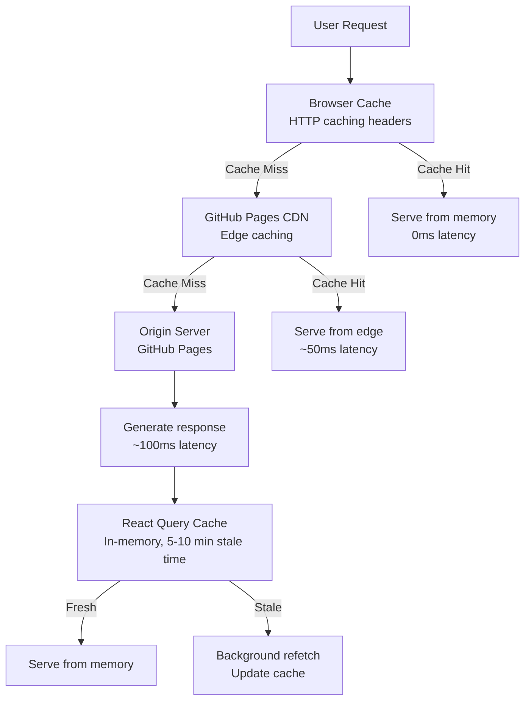

**Cache Headers** (set by GitHub Pages):

```
Cache-Control: public, max-age=3600        # 1 hour
ETag: "abc123"
Last-Modified: Thu, 25 Jan 2026 10:00:00 GMT
```

**React Query Configuration**:

```typescript
const queryClient = new QueryClient({
  defaultOptions: {
    queries: {
      staleTime: 5 * 60 * 1000,      // 5 minutes
      cacheTime: 10 * 60 * 1000,     // 10 minutes
      refetchOnWindowFocus: false,
      refetchOnMount: false,
      retry: 1,
    },
  },
});
```

---

## 11. Performance Monitoring Data Flow

### Metrics Collection

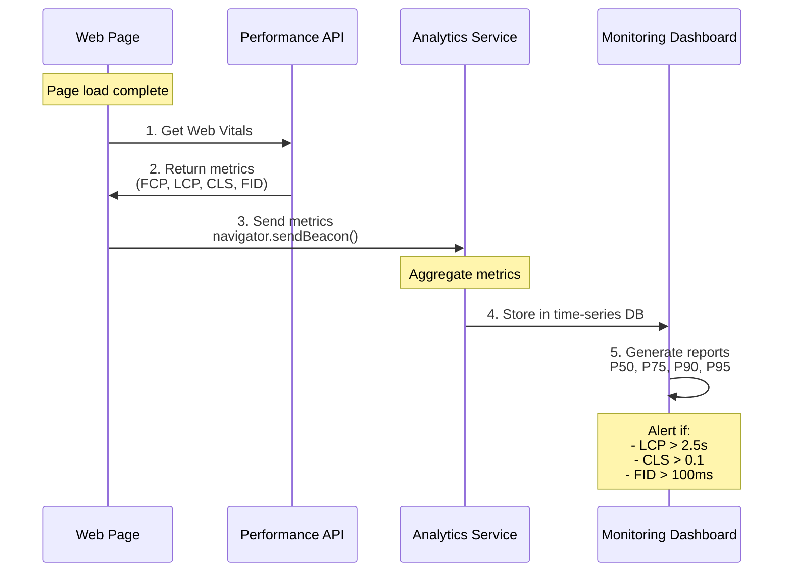

**Web Vitals Collection**:

```typescript
import { onLCP, onFID, onCLS } from 'web-vitals';

onLCP((metric) => {
  sendToAnalytics({
    name: 'LCP',
    value: metric.value,
    rating: metric.rating, // 'good' | 'needs-improvement' | 'poor'
    page: window.location.pathname,
  });
});

onFID((metric) => {
  sendToAnalytics({
    name: 'FID',
    value: metric.value,
    rating: metric.rating,
    page: window.location.pathname,
  });
});

onCLS((metric) => {
  sendToAnalytics({
    name: 'CLS',
    value: metric.value,
    rating: metric.rating,
    page: window.location.pathname,
  });
});
```

---

## Data Flow Summary

### Key Characteristics

| Flow Type | Latency | Caching | Optimization |
|-----------|---------|---------|--------------|
| **Page Load** | 1.5-3.2s | CDN + Browser | Code splitting, lazy loading |
| **Workshop Data** | 100-300ms | React Query 5min | Static JSON, prefetching |
| **Team Profiles** | 2-5s (44 members) | Browser cache | Virtual scrolling, lazy images |
| **Form Submission** | 200-500ms | None | Optimistic updates |
| **Real-Time Messages** | 50-150ms | None (real-time) | WebSocket, binary protocol |
| **Semantic Search** | 300-500ms | Vector index | Pre-computed embeddings |
| **Image Upload** | 800-2000ms | None | Progressive compression |

---

## Related Documentation

- [System Overview](SYSTEM_OVERVIEW.md) - High-level architecture
- [Frontend Architecture](FRONTEND_ARCHITECTURE.md) - React component patterns
- [Backend Services](BACKEND_SERVICES.md) - API and database architecture
- [Deployment Guide](DEPLOYMENT.md) - CI/CD pipeline details

---

**Document Owner**: Architecture Team
**Review Cycle**: Quarterly
**Last Review**: 2026-01-25
