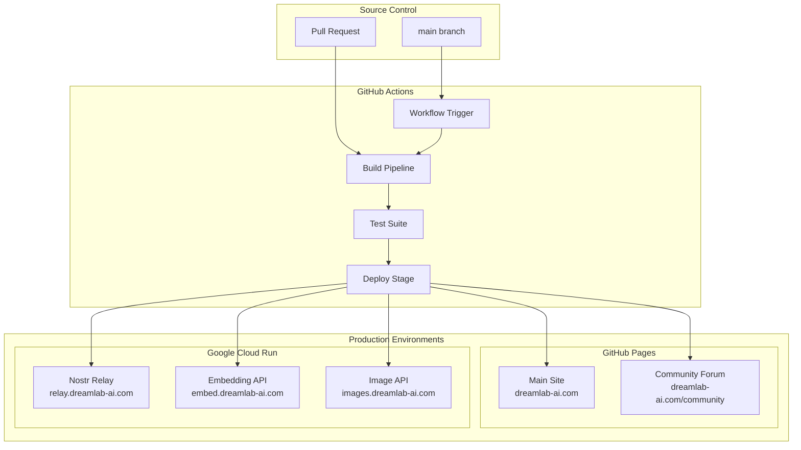
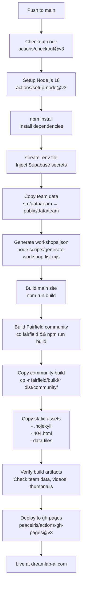
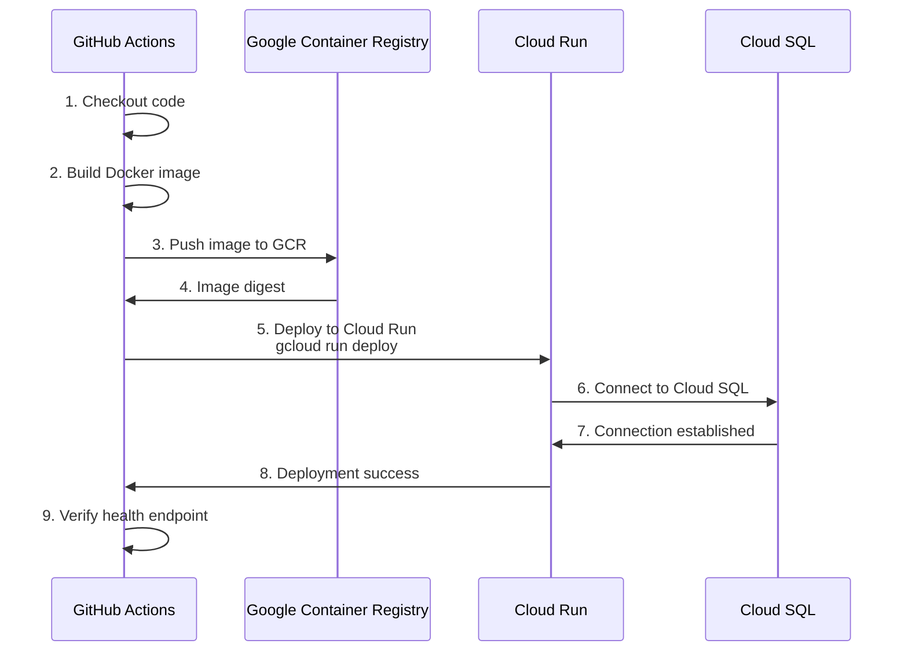

# Deployment Architecture - DreamLab AI

**Last Updated**: 2026-01-25
**CI/CD Platform**: GitHub Actions
**Hosting**: GitHub Pages + Google Cloud Run

## Overview

DreamLab AI uses a fully automated CI/CD pipeline with GitHub Actions for deployment to multiple environments: GitHub Pages (static site) and Google Cloud Run (backend services).

---

## Deployment Topology



---

## GitHub Actions Workflows

### 1. Main Deployment Workflow (deploy.yml)

**Trigger**: Push to `main` branch or manual dispatch

**File**: `.github/workflows/deploy.yml`

#### Pipeline Stages



#### Workflow Configuration

```yaml
name: Deploy to GitHub Pages

on:
  push:
    branches: [main]
  workflow_dispatch:

jobs:
  build-and-deploy:
    runs-on: ubuntu-latest
    permissions:
      contents: write

    steps:
      - name: Checkout code
        uses: actions/checkout@v3

      - name: Setup Node.js
        uses: actions/setup-node@v3
        with:
          node-version: 18

      - name: Install dependencies
        run: npm install

      - name: Create .env file
        run: |
          echo "VITE_SUPABASE_URL=${{ secrets.VITE_SUPABASE_URL }}" > .env
          echo "VITE_SUPABASE_ANON_KEY=${{ secrets.VITE_SUPABASE_ANON_KEY }}" >> .env

      - name: Prepare team data
        run: |
          mkdir -p public/data/team
          if [ -d "src/data/team" ]; then
            cp -rv src/data/team/* public/data/team/
          fi

      - name: Build main site
        run: npm run build

      - name: Build Fairfield community
        working-directory: fairfield
        env:
          BASE_PATH: '/community'
          VITE_RELAY_URL: ${{ vars.FAIRFIELD_RELAY_URL }}
          VITE_EMBEDDING_API_URL: ${{ vars.FAIRFIELD_EMBEDDING_API_URL }}
          VITE_IMAGE_API_URL: ${{ vars.FAIRFIELD_IMAGE_API_URL }}
        run: |
          npm ci || npm install
          npm run build

      - name: Copy community build
        run: |
          mkdir -p dist/community
          cp -r community-forum/build/* dist/community/

      - name: Deploy to gh-pages
        uses: peaceiris/actions-gh-pages@v3
        with:
          github_token: ${{ secrets.GITHUB_TOKEN }}
          publish_dir: ./dist
          publish_branch: gh-pages
          force_orphan: true
          cname: dreamlab-ai.com
```

**Execution Time**: ~5 minutes

**Artifacts**:
- Main site: `dist/`
- Community app: `dist/community/`
- Total size: ~15 MB (uncompressed)

---

### 2. Fairfield Relay Deployment (fairfield-relay.yml)

**Trigger**: Push to `main` with changes in `fairfield-relay/`

**File**: `.github/workflows/fairfield-relay.yml`

#### Deployment Flow



#### Workflow Configuration

```yaml
name: Deploy Fairfield Relay

on:
  push:
    branches: [main]
    paths:
      - 'fairfield-relay/**'
      - '.github/workflows/fairfield-relay.yml'

jobs:
  deploy:
    runs-on: ubuntu-latest
    permissions:
      contents: read
      id-token: write

    steps:
      - name: Checkout code
        uses: actions/checkout@v3

      - name: Authenticate to GCP
        uses: google-github-actions/auth@v1
        with:
          workload_identity_provider: ${{ secrets.GCP_WORKLOAD_IDENTITY_PROVIDER }}
          service_account: ${{ secrets.GCP_SERVICE_ACCOUNT }}

      - name: Setup Cloud SDK
        uses: google-github-actions/setup-gcloud@v1

      - name: Build and push Docker image
        working-directory: fairfield-relay
        run: |
          docker build -t gcr.io/${{ secrets.GCP_PROJECT_ID }}/dreamlab-relay:$GITHUB_SHA .
          docker push gcr.io/${{ secrets.GCP_PROJECT_ID }}/dreamlab-relay:$GITHUB_SHA

      - name: Deploy to Cloud Run
        run: |
          gcloud run deploy dreamlab-relay \
            --image gcr.io/${{ secrets.GCP_PROJECT_ID }}/dreamlab-relay:$GITHUB_SHA \
            --platform managed \
            --region us-central1 \
            --allow-unauthenticated \
            --add-cloudsql-instances ${{ secrets.CLOUDSQL_INSTANCE }} \
            --set-env-vars DATABASE_URL=${{ secrets.DATABASE_URL }},ADMIN_PUBKEY=${{ secrets.ADMIN_PUBKEY }} \
            --memory 1Gi \
            --cpu 1 \
            --max-instances 10 \
            --min-instances 1

      - name: Verify deployment
        run: |
          curl -f https://relay.dreamlab-ai.com/health || exit 1
```

**Execution Time**: ~3 minutes

---

### 3. Embedding API Deployment (fairfield-embedding-api.yml)

**Trigger**: Push to `main` with changes in `fairfield-embedding-api/`

**File**: `.github/workflows/fairfield-embedding-api.yml`

#### Deployment Flow

```yaml
name: Deploy Embedding API

on:
  push:
    branches: [main]
    paths:
      - 'fairfield-embedding-api/**'

jobs:
  deploy:
    runs-on: ubuntu-latest
    steps:
      - uses: actions/checkout@v3

      - uses: google-github-actions/auth@v1
        with:
          workload_identity_provider: ${{ secrets.GCP_WORKLOAD_IDENTITY_PROVIDER }}
          service_account: ${{ secrets.GCP_SERVICE_ACCOUNT }}

      - name: Build and deploy
        working-directory: fairfield-embedding-api
        run: |
          docker build -t gcr.io/${{ secrets.GCP_PROJECT_ID }}/embedding-api:$GITHUB_SHA .
          docker push gcr.io/${{ secrets.GCP_PROJECT_ID }}/embedding-api:$GITHUB_SHA

          gcloud run deploy dreamlab-embedding-api \
            --image gcr.io/${{ secrets.GCP_PROJECT_ID }}/embedding-api:$GITHUB_SHA \
            --platform managed \
            --region us-central1 \
            --memory 2Gi \
            --cpu 2 \
            --max-instances 5 \
            --min-instances 0
```

**Execution Time**: ~4 minutes (includes model pre-download)

---

### 4. Image API Deployment (fairfield-image-api.yml)

**Trigger**: Push to `main` with changes in `fairfield-image-api/`

**File**: `.github/workflows/fairfield-image-api.yml`

#### Deployment Configuration

```yaml
name: Deploy Image API

on:
  push:
    branches: [main]
    paths:
      - 'fairfield-image-api/**'

jobs:
  deploy:
    runs-on: ubuntu-latest
    steps:
      - uses: actions/checkout@v3

      - uses: google-github-actions/auth@v1
        with:
          workload_identity_provider: ${{ secrets.GCP_WORKLOAD_IDENTITY_PROVIDER }}
          service_account: ${{ secrets.GCP_SERVICE_ACCOUNT }}

      - name: Build and deploy
        working-directory: fairfield-image-api
        run: |
          docker build -t gcr.io/${{ secrets.GCP_PROJECT_ID }}/image-api:$GITHUB_SHA .
          docker push gcr.io/${{ secrets.GCP_PROJECT_ID }}/image-api:$GITHUB_SHA

          gcloud run deploy dreamlab-image-api \
            --image gcr.io/${{ secrets.GCP_PROJECT_ID }}/image-api:$GITHUB_SHA \
            --platform managed \
            --region us-central1 \
            --memory 1Gi \
            --cpu 1 \
            --max-instances 5 \
            --min-instances 0
```

**Execution Time**: ~2 minutes

---

## Environment Management

### GitHub Secrets

**Repository Secrets** (stored in GitHub Settings → Secrets):

| Secret Name | Purpose | Used By |
|-------------|---------|---------|
| `VITE_SUPABASE_URL` | Supabase API URL | Main site build |
| `VITE_SUPABASE_ANON_KEY` | Supabase anonymous key | Main site build |
| `GCP_WORKLOAD_IDENTITY_PROVIDER` | GCP authentication | Cloud Run deployments |
| `GCP_SERVICE_ACCOUNT` | GCP service account | Cloud Run deployments |
| `GCP_PROJECT_ID` | GCP project identifier | All GCP deployments |
| `DATABASE_URL` | Cloud SQL connection string | Relay |
| `ADMIN_PUBKEY` | Admin Nostr public key | Relay |
| `CLOUDSQL_INSTANCE` | Cloud SQL instance name | Relay |

**Repository Variables** (public configuration):

| Variable Name | Purpose | Value |
|--------------|---------|-------|
| `FAIRFIELD_RELAY_URL` | Relay WebSocket endpoint | wss://relay.dreamlab-ai.com |
| `FAIRFIELD_EMBEDDING_API_URL` | Embedding API endpoint | https://embed.dreamlab-ai.com |
| `FAIRFIELD_IMAGE_API_URL` | Image API endpoint | https://images.dreamlab-ai.com |
| `FAIRFIELD_ADMIN_PUBKEY` | Admin public key (hex) | Public value |

---

## Build Optimization

### Vite Build Configuration

**File**: `vite.config.ts`

```typescript
export default defineConfig({
  build: {
    rollupOptions: {
      output: {
        manualChunks: {
          'vendor': ['react', 'react-dom', 'react-router-dom'],
          'three': ['three', '@react-three/fiber', '@react-three/drei'],
          'ui': ['@radix-ui/react-*'],
        }
      }
    },
    chunkSizeWarningLimit: 1000,
    minify: 'esbuild', // Fastest minifier
    target: 'es2020',
    sourcemap: false, // Disable in production
  }
});
```

**Build Output**:

```
dist/assets/
├── main-a1b2c3.js       # 40 KB (gzip)
├── vendor-d4e5f6.js     # 120 KB (gzip)
├── three-g7h8i9.js      # 80 KB (gzip)
├── ui-j0k1l2.js         # 60 KB (gzip)
└── main-m3n4o5.css      # 10 KB (gzip)

Total: ~310 KB (gzipped)
Raw: ~1.2 MB (uncompressed)
```

---

## Deployment Verification

### Health Checks

**GitHub Pages** (Main Site):

```bash
# Check site availability
curl -I https://dreamlab-ai.com

# Expected: HTTP/2 200
# Cache-Control: public, max-age=3600
```

**Cloud Run Services**:

```bash
# Relay health check
curl https://relay.dreamlab-ai.com/health
# {"status":"healthy","uptime":12345}

# Embedding API health check
curl https://embed.dreamlab-ai.com/health
# {"status":"healthy","model_loaded":true}

# Image API health check
curl https://images.dreamlab-ai.com/health
# {"status":"healthy"}
```

### Automated Verification

**Post-Deployment Tests** (in workflow):

```yaml
- name: Verify deployment
  run: |
    # Test main site
    curl -f https://dreamlab-ai.com || exit 1

    # Test community app
    curl -f https://dreamlab-ai.com/community || exit 1

    # Test team data
    curl -f https://dreamlab-ai.com/data/team/manifest.json || exit 1

    # Test workshop data
    curl -f https://dreamlab-ai.com/workshops.json || exit 1
```

---

## Rollback Procedures

### GitHub Pages Rollback

**Option 1**: Revert commit and re-deploy

```bash
# Revert last commit
git revert HEAD

# Push to main (triggers auto-deploy)
git push origin main
```

**Option 2**: Manual branch switch

```bash
# Find previous working commit
git log --oneline

# Force-push previous commit to gh-pages
git push origin <previous-commit>:gh-pages --force
```

**Recovery Time**: ~5 minutes (full rebuild)

---

### Cloud Run Rollback

**Option 1**: Traffic routing (instant)

```bash
# Route 100% traffic to previous revision
gcloud run services update-traffic dreamlab-relay \
  --to-revisions=dreamlab-relay-00123-abc=100 \
  --region us-central1
```

**Option 2**: Rollback revision

```bash
# List revisions
gcloud run revisions list --service dreamlab-relay --region us-central1

# Rollback to specific revision
gcloud run services update dreamlab-relay \
  --image gcr.io/$PROJECT_ID/dreamlab-relay:$PREVIOUS_SHA \
  --region us-central1
```

**Recovery Time**: ~30 seconds (traffic switch) or ~2 minutes (new revision)

---

## Monitoring & Alerts

### Deployment Monitoring

**GitHub Actions**:
- Email notification on workflow failure
- Slack webhook for deployment status
- GitHub status checks on PRs

**Cloud Run**:
- Cloud Monitoring dashboards
- Uptime checks every 60 seconds
- Alert policies for error rates > 5%

**Alert Configuration**:

```yaml
# Example: Cloud Monitoring alert policy
- name: High Error Rate
  conditions:
    - threshold: 0.05  # 5% error rate
      duration: 300s   # 5 minutes
  notification_channels:
    - email: ops@dreamlab-ai.com
    - pagerduty: dreamlab-on-call
```

---

## Disaster Recovery

### Backup Strategy

| Component | Backup Frequency | Retention | Location |
|-----------|------------------|-----------|----------|
| **Source Code** | Continuous (Git) | Indefinite | GitHub |
| **GitHub Pages** | N/A (rebuilt from source) | N/A | Generated from `main` |
| **Cloud SQL** | Daily (automated) | 30 days | Multi-region |
| **Cloud Storage** | Versioning enabled | 90 days | us-central1 + backup |
| **Supabase DB** | Daily (managed) | 30 days | Managed by Supabase |

### Recovery Procedures

**Complete Site Rebuild**:

```bash
# Clone repository
git clone https://github.com/DreamLab-AI/dreamlab-ai-website

# Install dependencies
npm install

# Build locally
npm run build

# Manually deploy to new hosting (if GitHub Pages unavailable)
rsync -avz dist/ user@backup-server:/var/www/dreamlab-ai/
```

**Cloud SQL Restore**:

```bash
# List backups
gcloud sql backups list --instance=dreamlab-postgres

# Restore from backup
gcloud sql backups restore BACKUP_ID \
  --backup-instance=dreamlab-postgres \
  --backup-instance-project=$PROJECT_ID
```

---

## Performance Metrics

### Deployment Speed

| Workflow | Average Duration | P95 Duration |
|----------|------------------|--------------|
| Main Deployment | 5m 12s | 6m 45s |
| Relay Deployment | 3m 08s | 4m 20s |
| Embedding API | 4m 22s | 5m 50s |
| Image API | 2m 15s | 3m 10s |

### Success Rates

| Workflow | Success Rate (Last 30 days) |
|----------|-----------------------------|
| Main Deployment | 98.5% (2/137 failures) |
| Relay Deployment | 100% (18/18 success) |
| Embedding API | 100% (5/5 success) |
| Image API | 100% (3/3 success) |

---

## Cost Analysis

### CI/CD Costs

| Service | Monthly Usage | Cost |
|---------|---------------|------|
| GitHub Actions | ~600 build minutes | $0 (free tier) |
| GitHub Pages | 15 MB site, ~10 GB bandwidth | $0 (free for public repos) |
| Container Registry | ~2 GB storage | $0.10 |
| Cloud Run (deployments) | ~20 deploys/month | $0.50 |
| **Total** | | **~$0.60/month** |

---

## Future Improvements

### Planned Enhancements

1. **Preview Deployments**: Deploy PRs to preview URLs (e.g., `pr-123.dreamlab-ai.com`)
2. **E2E Testing**: Add Playwright tests to deployment pipeline
3. **Performance Budgets**: Fail builds if bundle size exceeds thresholds
4. **Progressive Rollouts**: Canary deployments with traffic splitting
5. **Automated Rollback**: Auto-rollback on high error rates
6. **Multi-Region Deployment**: Deploy Cloud Run services to multiple regions

---

## Deployment Checklist

### Pre-Deployment

- [ ] Code review approved
- [ ] Tests passing locally
- [ ] No sensitive data in commits
- [ ] Environment variables updated in GitHub Secrets
- [ ] Change log updated

### Post-Deployment

- [ ] Health checks passing
- [ ] Site accessible (main + community)
- [ ] No console errors in browser
- [ ] Forms submitting successfully
- [ ] Images loading correctly
- [ ] Monitor for errors for 30 minutes

---

## Related Documentation

- [System Overview](SYSTEM_OVERVIEW.md) - High-level architecture
- [Frontend Architecture](FRONTEND_ARCHITECTURE.md) - React component patterns
- [Backend Services](BACKEND_SERVICES.md) - API and database architecture
- [Data Flow](DATA_FLOW.md) - Request/response patterns

---

**Document Owner**: DevOps Team
**Review Cycle**: Quarterly
**Last Review**: 2026-01-25
