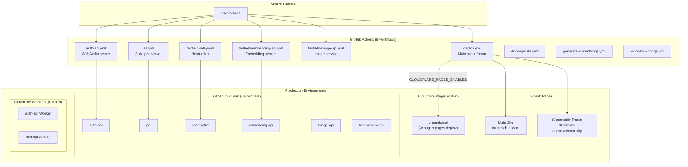
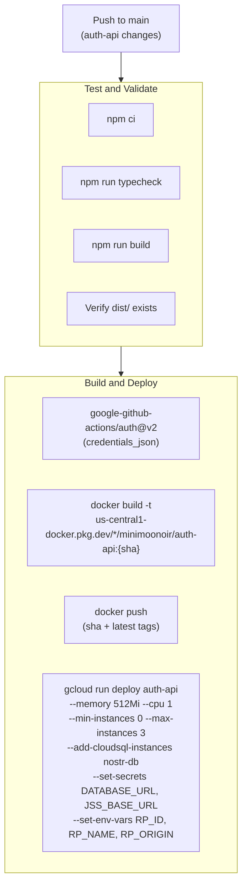
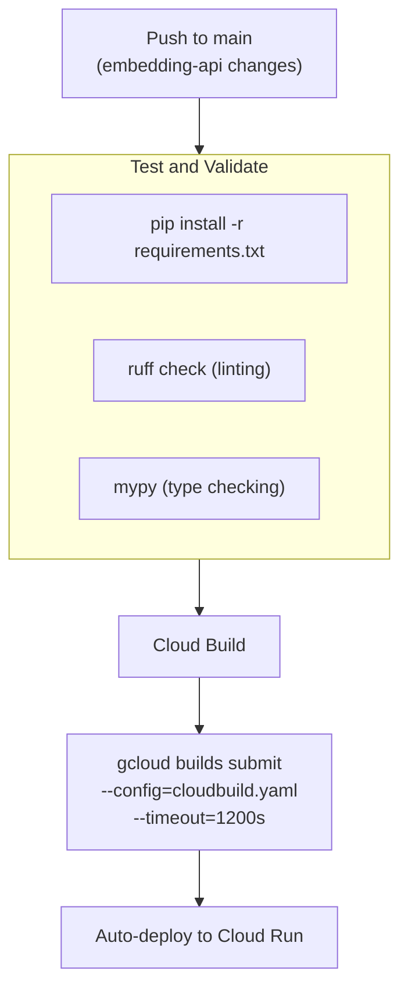
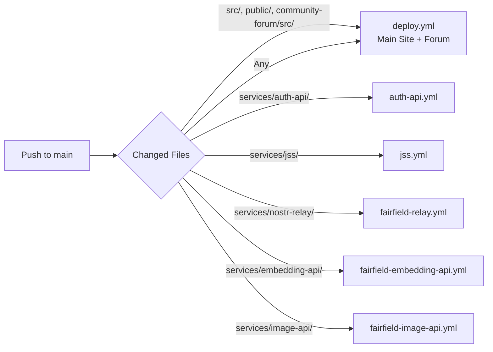

# Deployment Architecture -- DreamLab AI

**Last Updated**: 2026-02-28
**CI/CD Platform**: GitHub Actions
**Hosting**: GitHub Pages + GCP Cloud Run + Cloudflare Pages (opt-in) + Cloudflare Workers (planned)

## Overview

DreamLab AI uses a fully automated CI/CD pipeline with 9 GitHub Actions workflows deploying to multiple targets: GitHub Pages (static site), GCP Cloud Run (6 backend services), and optionally Cloudflare Pages (frontend) with planned Cloudflare Workers (backend).

---

## Deployment Topology



---

## 1. Main Deployment Workflow (`deploy.yml`)

**Trigger**: Push to `main` or manual dispatch
**Deploys**: Main site + community forum to GitHub Pages (and optionally Cloudflare Pages)
**Runtime**: Node.js 20

### Pipeline Stages

```mermaid
flowchart TB
    Start["Push to main"] --> Checkout["Checkout code<br/>actions/checkout@v4"]
    Checkout --> NodeSetup["Setup Node.js 20<br/>actions/setup-node@v4"]
    NodeSetup --> Install["npm ci"]

    Install --> Env["Create .env<br/>VITE_SUPABASE_URL<br/>VITE_SUPABASE_ANON_KEY"]
    Env --> TeamData["Copy team data<br/>src/data/team --> public/data/team"]
    TeamData --> BuildMain["npm run build<br/>(Vite + SWC)"]

    BuildMain --> BuildForum["Build community forum<br/>cd community-forum && npm ci && npm run build"]
    Note over BuildForum: Env: BASE_PATH=/community<br/>VITE_RELAY_URL, VITE_EMBEDDING_API_URL<br/>VITE_IMAGE_API_URL, VITE_AUTH_API_URL<br/>VITE_ADMIN_PUBKEY, VITE_APP_NAME

    BuildForum --> CopyForum["cp -r community-forum/build/* dist/community/"]
    CopyForum --> CopyAssets["Copy .nojekyll, 404.html, data/*"]
    CopyAssets --> Verify["Verify build artifacts<br/>(team data, videos, thumbnails)"]

    Verify --> DeployGH["peaceiris/actions-gh-pages@v3<br/>publish_dir: ./dist<br/>force_orphan: true<br/>cname: dreamlab-ai.com"]

    Verify --> CFCheck{CLOUDFLARE_PAGES_ENABLED?}
    CFCheck -->|true| DeployCF["cloudflare/wrangler-action@v3<br/>pages deploy dist/<br/>--project-name=dreamlab-ai"]
    CFCheck -->|false| Skip["Skip"]
```

### GitHub Secrets Used

| Secret | Purpose |
|--------|---------|
| `VITE_SUPABASE_URL` | Supabase API URL (injected into .env) |
| `VITE_SUPABASE_ANON_KEY` | Supabase anonymous key (injected into .env) |
| `VITE_AUTH_API_URL` | Auth API URL for community forum |
| `GITHUB_TOKEN` | GitHub Pages deployment (automatic) |
| `CLOUDFLARE_API_TOKEN` | Cloudflare Pages deployment (optional) |
| `CLOUDFLARE_ACCOUNT_ID` | Cloudflare account (optional) |

### GitHub Variables Used

| Variable | Purpose |
|----------|---------|
| `FAIRFIELD_RELAY_URL` | WebSocket relay URL for forum |
| `FAIRFIELD_EMBEDDING_API_URL` | Embedding API URL for forum |
| `FAIRFIELD_IMAGE_API_URL` | Image API URL for forum |
| `FAIRFIELD_LINK_PREVIEW_API_URL` | Link preview API URL for forum |
| `FAIRFIELD_IMAGE_BUCKET` | Image storage bucket name |
| `FAIRFIELD_ADMIN_PUBKEY` | Admin Nostr public key (hex) |
| `CLOUDFLARE_PAGES_ENABLED` | `'true'` to enable Cloudflare Pages deployment |

---

## 2. auth-api Deployment (`auth-api.yml`)

**Trigger**: Push to `main` with changes in `community-forum/services/auth-api/**`
**Target**: GCP Cloud Run
**Runtime**: Node.js 20

### Pipeline



### Cloud Run Configuration

| Setting | Value |
|---------|-------|
| Memory | 512Mi |
| CPU | 1 |
| Min instances | 0 (scale to zero) |
| Max instances | 3 |
| Port | 8080 |
| Service account | `fairfield-applications@cumbriadreamlab.iam.gserviceaccount.com` |
| Cloud SQL | `cumbriadreamlab:us-central1:nostr-db` |

---

## 3. JSS Deployment (`jss.yml`)

**Trigger**: Push to `main` with changes in `community-forum/services/jss/**`
**Target**: GCP Cloud Run
**Runtime**: node:20-slim + @solid/community-server 7.1.8

### Bootstrap Guard

The workflow includes a guard step that checks for the `jss-base-url` secret in GCP Secret Manager before deploying. This addresses the chicken-and-egg problem where JSS needs its own URL as a config value.

**First-deploy resolution**:
1. Run `gcloud run deploy jss --no-traffic` to get the service URL
2. Create the secret: `echo -n "https://{URL}/" | gcloud secrets create jss-base-url --data-file=-`
3. Re-run the workflow

### Cloud Run Configuration

| Setting | Value |
|---------|-------|
| Memory | 1Gi |
| CPU | 1 |
| Min instances | 0 |
| Max instances | 2 |
| Port | 8080 |
| Volume | Cloud Storage `dreamlab-pods` mounted at `/data/pods` |

---

## 4. Nostr Relay Deployment (`fairfield-relay.yml`)

**Trigger**: Push to `main` with changes in `community-forum/services/nostr-relay/**`
**Target**: GCP Cloud Run

### Cloud Run Configuration

| Setting | Value | Rationale |
|---------|-------|-----------|
| Memory | 512Mi | Moderate for WebSocket connections |
| CPU | 1 | Single vCPU |
| Min instances | **1** | Always-on for reliability |
| Max instances | 1 | Single instance for consistency |
| Timeout | **3600s** | 1 hour for long-lived WebSocket connections |
| CPU throttling | **Disabled** | Consistent performance for real-time messaging |
| Port | 8080 | Standard |

### Secrets

| Secret | Source |
|--------|--------|
| `DATABASE_URL` | Secret Manager: `nostr-db-url` |
| `ADMIN_PUBKEYS` | Secret Manager: `admin-pubkey` |

---

## 5. Embedding API Deployment (`fairfield-embedding-api.yml`)

**Trigger**: Push to `main` with changes in `community-forum/services/embedding-api/**`
**Target**: GCP Cloud Run via Cloud Build

### Pipeline

Unlike other services that use Docker builds in GitHub Actions, the embedding API uses **GCP Cloud Build** (`cloudbuild.yaml`) for building. This avoids transferring the large ML model over the network from GitHub Actions runners.



---

## 6. Image API Deployment (`fairfield-image-api.yml`)

**Trigger**: Push to `main` with changes in `community-forum/services/image-api/**`
**Target**: GCP Cloud Run

### Cloud Run Configuration

| Setting | Value |
|---------|-------|
| Memory | 512Mi |
| CPU | 1 |
| Max instances | 10 |
| Environment | `GCS_BUCKET=minimoonoir-images` |

---

## 7. Planned Cloudflare Workers Deployment

### Wrangler Configuration (`wrangler.toml`)

```toml
name = "dreamlab-ai"
compatibility_date = "2024-12-01"
main = "workers/auth-api/index.ts"

[[d1_databases]]
binding = "DB"
database_name = "dreamlab-auth"

[[kv_namespaces]]
binding = "SESSIONS"
binding = "POD_META"
binding = "CONFIG"

[[r2_buckets]]
binding = "PODS"
bucket_name = "dreamlab-pods"

[vars]
RP_ID = "dreamlab-ai.com"
RP_NAME = "DreamLab Community"
EXPECTED_ORIGIN = "https://dreamlab-ai.com"
RELAY_URL = "wss://relay.dreamlab-ai.com"

[env.staging]
name = "dreamlab-ai-staging"
vars = { RP_ID = "staging.dreamlab-ai.com", EXPECTED_ORIGIN = "https://staging.dreamlab-ai.com" }

[env.production]
routes = [
  { pattern = "api.dreamlab-ai.com/*", zone_name = "dreamlab-ai.com" },
  { pattern = "pods.dreamlab-ai.com/*", zone_name = "dreamlab-ai.com" }
]
```

### Deployment Commands (Manual, Pre-Workflow)

```bash
# Deploy auth-api Worker
npx wrangler deploy --env production

# Deploy D1 schema
npx wrangler d1 execute dreamlab-auth --file=schema.sql

# Create KV namespaces
npx wrangler kv namespace create SESSIONS
npx wrangler kv namespace create POD_META
npx wrangler kv namespace create CONFIG

# Create R2 bucket
npx wrangler r2 bucket create dreamlab-pods
```

### Planned Workflow

A `workers-deploy.yml` workflow will automate Workers deployment:
1. Run TypeScript type checking
2. Run tests (if any)
3. `wrangler deploy --env production`
4. Run D1 migrations
5. Verify health endpoints

---

## CI/CD Pipeline Overview

### All Workflows

| Workflow | File | Trigger | Target | Runtime |
|----------|------|---------|--------|---------|
| **Main deploy** | `deploy.yml` | Push to `main` or manual | GitHub Pages + Cloudflare Pages | ~5 min |
| **auth-api** | `auth-api.yml` | Changes in `services/auth-api/` | Cloud Run | ~4 min |
| **jss** | `jss.yml` | Changes in `services/jss/` | Cloud Run | ~3 min |
| **nostr-relay** | `fairfield-relay.yml` | Changes in `services/nostr-relay/` | Cloud Run | ~4 min |
| **embedding-api** | `fairfield-embedding-api.yml` | Changes in `services/embedding-api/` | Cloud Run (via Cloud Build) | ~6 min |
| **image-api** | `fairfield-image-api.yml` | Changes in `services/image-api/` | Cloud Run | ~3 min |
| **docs-update** | `docs-update.yml` | Various | Documentation | ~1 min |
| **embeddings** | `generate-embeddings.yml` | Various | Embedding generation | ~5 min |
| **visionflow** | `visionflow-bridge.yml` | Various | Bridge service | ~2 min |

### Workflow Dependency Graph



---

## Environment Configuration

### GCP Infrastructure

| Resource | Value |
|----------|-------|
| Project ID | `cumbriadreamlab` |
| Region | `us-central1` |
| Artifact Registry | `minimoonoir` |
| Cloud SQL Instance | `nostr-db` (PostgreSQL) |
| Service Account | `fairfield-applications@cumbriadreamlab.iam.gserviceaccount.com` |
| Cloud Storage Bucket | `dreamlab-pods` (JSS), `minimoonoir-images` (image-api) |

### GCP Secret Manager

| Secret | Used By | Purpose |
|--------|---------|---------|
| `nostr-db-url` | auth-api, nostr-relay | PostgreSQL connection URL |
| `admin-pubkey` | nostr-relay | Admin Nostr public key |
| `jss-base-url` | auth-api, jss | JSS service URL |

### GitHub Repository Secrets

| Secret | Purpose |
|--------|---------|
| `VITE_SUPABASE_URL` | Supabase API endpoint |
| `VITE_SUPABASE_ANON_KEY` | Supabase anonymous key |
| `VITE_AUTH_API_URL` | Auth API Cloud Run URL |
| `GCP_PROJECT_ID` | GCP project identifier |
| `GCP_SA_KEY` | GCP service account JSON key |
| `CLOUDFLARE_API_TOKEN` | Cloudflare API token (optional) |
| `CLOUDFLARE_ACCOUNT_ID` | Cloudflare account (optional) |

### DNS Configuration

| Record | Value | Purpose |
|--------|-------|---------|
| `dreamlab-ai.com` | CNAME to GitHub Pages | Main site |
| `api.dreamlab-ai.com` | Cloudflare Workers route (planned) | Auth API |
| `pods.dreamlab-ai.com` | Cloudflare Workers route (planned) | Pod API |
| `relay.dreamlab-ai.com` | Cloud Run service URL | Nostr relay |

---

## Deployment Verification

### Health Checks

```bash
# Main site
curl -I https://dreamlab-ai.com
# Expected: HTTP/2 200

# Community forum
curl -I https://dreamlab-ai.com/community
# Expected: HTTP/2 200

# Auth API
curl https://{auth-api-url}/health
# Expected: {"status":"ok"}

# Nostr relay
curl https://{relay-url}/health
# Expected: {"status":"ok"}

# Embedding API
curl https://{embedding-api-url}/health
# Expected: {"status":"healthy","model_loaded":true}

# Image API
curl https://{image-api-url}/health
# Expected: {"status":"ok"}
```

### Post-Deployment Verification (deploy.yml)

The main workflow verifies build artifacts before deployment:
- Team data existence (`dist/data/team/06.md`, `06.png`)
- Video files (`dist/data/media/videos/`)
- Thumbnail files (`dist/data/media/*-thumb.jpg`)

---

## Rollback Procedures

### GitHub Pages Rollback

**Option 1**: Revert commit and re-deploy (automatic)

```bash
git revert HEAD
git push origin main
```

**Option 2**: Force-push previous gh-pages state

```bash
git log gh-pages --oneline
git push origin {previous-sha}:gh-pages --force
```

**Recovery time**: ~5 minutes (full rebuild)

### Cloud Run Rollback

**Option 1**: Traffic routing (instant, ~30 seconds)

```bash
gcloud run services update-traffic auth-api \
  --to-revisions={previous-revision}=100 \
  --region us-central1
```

**Option 2**: Re-deploy previous image

```bash
gcloud run services update auth-api \
  --image us-central1-docker.pkg.dev/cumbriadreamlab/minimoonoir/auth-api:{previous-sha} \
  --region us-central1
```

**Recovery time**: ~30 seconds (traffic switch) or ~2 minutes (new revision)

### Cloudflare Workers Rollback (Planned)

```bash
npx wrangler rollback --env production
```

**Recovery time**: ~10 seconds

---

## Disaster Recovery

### Backup Strategy

| Component | Backup Frequency | Retention | Location |
|-----------|------------------|-----------|----------|
| Source code | Continuous (Git) | Indefinite | GitHub |
| GitHub Pages | Rebuilt from source | N/A | Generated |
| Cloud SQL | Daily (automated) | 30 days | Multi-region GCP |
| Supabase DB | Daily (managed) | 30 days | Managed |
| Cloud Storage | Versioning enabled | 90 days | us-central1 |
| R2 (planned) | 99.999999999% durability | Indefinite | Cloudflare global |

### Complete Site Rebuild

```bash
git clone https://github.com/DreamLab-AI/dreamlab-ai-website
cd dreamlab-ai-website
npm ci
echo "VITE_SUPABASE_URL=..." > .env
echo "VITE_SUPABASE_ANON_KEY=..." >> .env
npm run build
# Deploy dist/ to any static host
```

---

## Cost Analysis

### CI/CD Costs (Monthly)

| Service | Usage | Cost |
|---------|-------|------|
| GitHub Actions | ~600 build minutes | $0 (free for public repos) |
| GitHub Pages | 15 MB site, ~10 GB bandwidth | $0 |
| Artifact Registry | ~2 GB storage | ~$0.10 |
| Cloud Build (embedding-api) | ~5 builds/month | ~$0.50 |
| Cloudflare Pages (optional) | Unlimited bandwidth | $0 |
| **Total CI/CD** | | **~$0.60/month** |

---

## Related Documentation

- [System Overview](SYSTEM_OVERVIEW.md) -- High-level architecture
- [Frontend Architecture](FRONTEND_ARCHITECTURE.md) -- React and SvelteKit patterns
- [Backend Services](BACKEND_SERVICES.md) -- API and database architecture
- [Data Flow](DATA_FLOW.md) -- Auth, request, event, and storage flows
- [GCP Bootstrap Guide](../../.github/workflows/SECRETS_SETUP.md) -- 8-step GCP setup
- [ADR-010](../adr/010-return-to-cloudflare.md) -- Return to Cloudflare decision

---

**Document Owner**: DevOps Team
**Review Cycle**: Quarterly
**Last Review**: 2026-02-28
