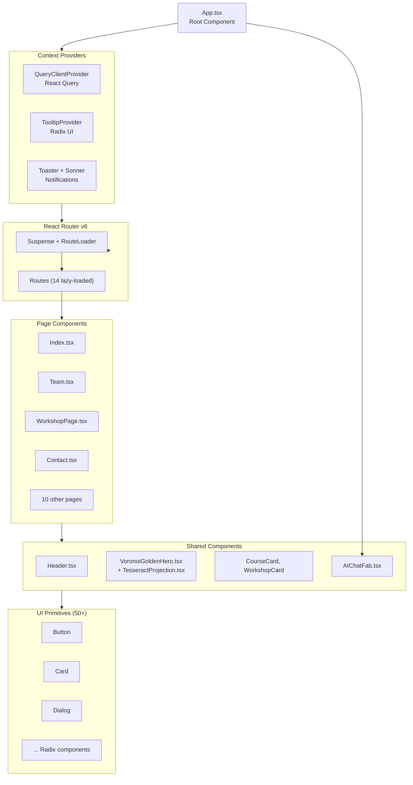
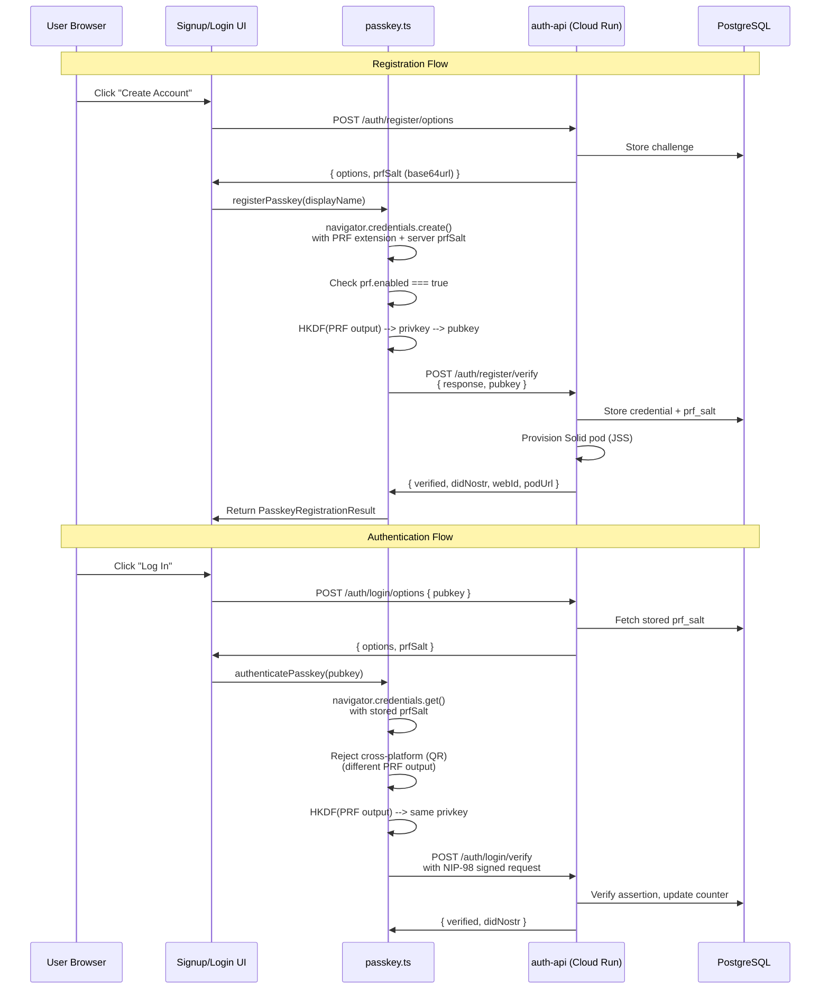
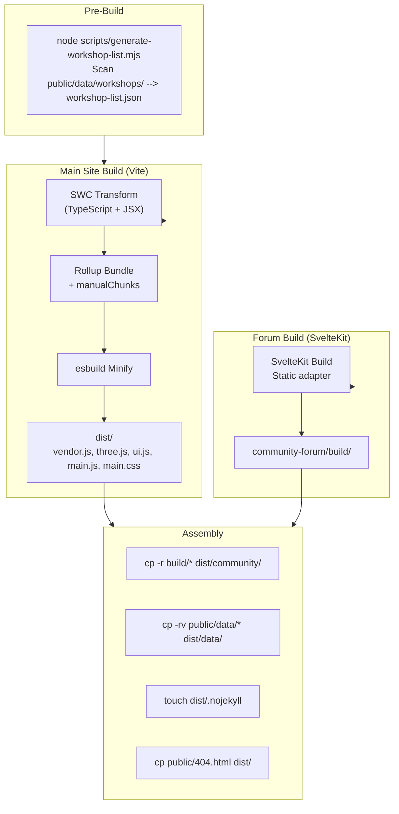
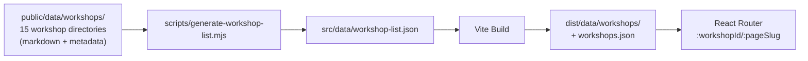

# Frontend Architecture -- DreamLab AI

**Last Updated**: 2026-02-28
**Main Site**: React 18.3.1 + TypeScript 5.5.3 + Vite 5.4.21
**Community Forum**: SvelteKit 2.49 + NDK 2.13 + WebAuthn PRF

## Overview

DreamLab AI comprises two frontend applications sharing a single GitHub Pages deployment:

1. **Main marketing site** -- React SPA at the root path (`/`)
2. **Community forum** -- SvelteKit app at `/community`

Both are statically built at CI time and served from the same `dist/` directory.

---

## React SPA Architecture (Main Site)

### Directory Structure

```
src/
+-- components/           # Reusable UI components
|   +-- ui/              # 50+ shadcn/ui primitives (Radix-based)
|   |   +-- accordion.tsx
|   |   +-- button.tsx
|   |   +-- dialog.tsx
|   |   +-- toaster.tsx
|   |   +-- sonner.tsx
|   |   +-- tooltip.tsx
|   |   +-- ...
|   +-- AIChatFab.tsx          # Floating AI chat assistant
|   +-- VoronoiGoldenHero.tsx  # 3D golden ratio Voronoi (Three.js)
|   +-- TesseractProjection.tsx # 4D hyperdimensional visualisation
|   +-- Header.tsx              # Site navigation
|   +-- CourseCard.tsx          # Training card component
|   +-- WorkshopCard.tsx        # Workshop listing card
|   +-- WorkshopHeader.tsx      # Workshop page header
|   +-- EmailSignupForm.tsx     # Newsletter subscription
|   +-- ErrorBoundary.tsx       # Error boundary wrapper
|   +-- RouteLoader.tsx         # Suspense fallback
+-- pages/                # Route page components (14 pages)
|   +-- Index.tsx          # Landing page (hero, featured, CTAs)
|   +-- Team.tsx           # Team directory (44+ profiles)
|   +-- Work.tsx           # Portfolio / case studies
|   +-- Contact.tsx        # Contact form (React Hook Form + Zod)
|   +-- WorkshopIndex.tsx  # Workshop catalogue
|   +-- WorkshopPage.tsx   # Individual workshop (:workshopId/:pageSlug)
|   +-- ResidentialTraining.tsx  # 2-day masterclass details
|   +-- SystemDesign.tsx         # Architecture documentation
|   +-- ResearchPaper.tsx        # Research content
|   +-- Testimonials.tsx         # Customer reviews
|   +-- Privacy.tsx              # Privacy policy
|   +-- NotFound.tsx             # 404 page
+-- hooks/
|   +-- use-mobile.tsx           # Mobile breakpoint detection (768px)
|   +-- use-toast.ts             # Toast notification hook
|   +-- use-optimized-images.ts  # Image optimisation (lazy load, srcset, WebP)
|   +-- useOGMeta.ts             # Open Graph metadata hook
+-- lib/
|   +-- supabase.ts        # Supabase client (VITE_SUPABASE_URL, VITE_SUPABASE_ANON_KEY)
|   +-- utils.ts            # cn() utility (clsx + tailwind-merge)
|   +-- og-meta.ts          # OG metadata generation
|   +-- image-utils.ts      # Image optimisation helpers
|   +-- markdown.ts          # Markdown processing
+-- data/
|   +-- skills.json          # Skills taxonomy
|   +-- workshop-list.json   # Generated at build time
+-- App.tsx                  # Root: providers, router, lazy routes
+-- main.tsx                 # Vite entry point
+-- index.css                # Global Tailwind styles
```

### Component Hierarchy



### Routing Configuration

All routes are defined in `src/App.tsx` with lazy-loaded components:

| Route | Component | Description |
|-------|-----------|-------------|
| `/` | Index | Landing page |
| `/team` | Team | Team directory (44+ profiles) |
| `/work` | Work | Portfolio / case studies |
| `/workshops` | WorkshopIndex | Workshop catalogue |
| `/workshops/:workshopId` | WorkshopPage | Workshop detail |
| `/workshops/:workshopId/:pageSlug` | WorkshopPage | Workshop sub-page |
| `/residential-training` | ResidentialTraining | 2-day masterclass |
| `/masterclass` | Navigate --> `/#training-options` | Legacy redirect |
| `/contact` | Contact | Contact/enquiry form |
| `/privacy` | Privacy | Privacy policy |
| `/system-design` | SystemDesign | Architecture docs |
| `/research-paper` | ResearchPaper | Research content |
| `/testimonials` | Testimonials | Customer reviews |
| `*` | NotFound | 404 page |

### State Management Strategy

| State Type | Mechanism | Use Cases |
|------------|-----------|-----------|
| **Local** | `useState` | UI toggles, form inputs, modals |
| **Server** | TanStack React Query | Workshop data, team profiles, Supabase queries |
| **URL** | React Router `useParams` | Workshop IDs, page slugs |
| **Global** | QueryClientProvider, TooltipProvider | Query cache, tooltip context |

### Styling Architecture

- **Tailwind CSS 3.4** with CSS custom properties (HSL-based theming)
- **shadcn/ui** component library: 50+ Radix UI primitives with Tailwind + CVA variants
- **Dark mode** via `dark:` class prefix
- **Utility function**: `cn()` from `lib/utils.ts` merges classes via `clsx` + `tailwind-merge`
- **Typography plugin**: `@tailwindcss/typography` for markdown rendering
- **Animations**: `tailwindcss-animate` plugin for transitions

### 3D Visualisations

| Component | Technology | Purpose |
|-----------|-----------|---------|
| `VoronoiGoldenHero.tsx` | Three.js + @react-three/fiber + Rust WASM | Golden ratio Voronoi tessellation hero |
| `TesseractProjection.tsx` | Three.js + @react-three/fiber + @react-three/drei | 4D hyperdimensional projection |

The Rust WASM module (`wasm-voronoi/`) provides high-performance Voronoi tessellation computations. Three.js scenes are wrapped in `<Canvas>` components from @react-three/fiber and load lazily to avoid blocking the critical rendering path.

---

## SvelteKit Forum Architecture (Community Forum)

### Directory Structure

```
community-forum/
+-- src/
|   +-- routes/                    # 21 Svelte route pages
|   |   +-- +page.svelte          # Home / landing
|   |   +-- login/+page.svelte    # Passkey login
|   |   +-- signup/+page.svelte   # Passkey registration
|   |   +-- setup/+page.svelte    # Profile setup (nickname)
|   |   +-- pending/+page.svelte  # Pending approval
|   |   +-- chat/+page.svelte     # Channel list
|   |   +-- chat/[channelId]/     # Channel view
|   |   +-- dm/+page.svelte       # DM list
|   |   +-- dm/[pubkey]/          # DM conversation (NIP-44 encrypted)
|   |   +-- forums/+page.svelte   # Forum categories
|   |   +-- events/+page.svelte   # Event calendar
|   |   +-- admin/+page.svelte    # Admin panel
|   |   +-- admin/calendar/       # Admin calendar management
|   |   +-- admin/stats/          # Admin statistics
|   |   +-- settings/muted/       # Muted users
|   |   +-- view/[noteId]/        # Single note view
|   |   +-- [category]/           # Category view
|   |   +-- [category]/[section]/ # Section view
|   |   +-- [category]/[section]/calendar/    # Section calendar
|   |   +-- [category]/[section]/[forumId]/   # Forum thread
|   |   +-- [section]/calendar/               # Section calendar (alt)
|   +-- lib/
|   |   +-- auth/
|   |   |   +-- passkey.ts        # WebAuthn PRF ceremony + HKDF derivation
|   |   |   +-- nip98-client.ts   # NIP-98 token creation + fetchWithNip98()
|   |   +-- stores/
|   |   |   +-- auth.ts           # Auth store: _privkeyMem closure, login/register
|   |   +-- components/auth/
|   |       +-- AuthFlow.svelte   # Signup --> nickname --> pending-approval
|   |       +-- Signup.svelte     # Passkey registration UI
|   |       +-- Login.svelte      # Passkey / NIP-07 / nsec login
|   |       +-- NicknameSetup.svelte  # Profile setup after registration
|   |       +-- NsecBackup.svelte     # One-time privkey download
+-- packages/
|   +-- nip98/                    # Shared NIP-98 module
|       +-- sign.ts               # createNip98Token() wrapping nostr-tools/nip98
|       +-- verify.ts             # Server-side verification with hardening
|       +-- types.ts              # VerifyOptions, VerifyResult, Nip98Event
|       +-- index.ts              # Barrel re-exports
+-- services/
|   +-- auth-api/                 # Express WebAuthn server (Cloud Run)
|   +-- jss/                      # Solid pod server (Cloud Run)
|   +-- nostr-relay/              # Nostr relay (Cloud Run)
|   +-- embedding-api/            # Embedding service (Cloud Run)
|   +-- image-api/                # Image service (Cloud Run)
|   +-- link-preview-api/         # Link preview (Cloud Run)
+-- tests/                        # Vitest unit + Playwright e2e
```

### Forum Authentication Flow



### Forum Route Structure

| Route | Purpose | Auth Required |
|-------|---------|---------------|
| `/` | Landing / home | No |
| `/signup` | Passkey registration | No |
| `/login` | Passkey authentication | No |
| `/setup` | Nickname setup after registration | Yes |
| `/pending` | Waiting for admin approval | Yes |
| `/chat` | Channel list | Yes |
| `/chat/[channelId]` | Channel messages | Yes |
| `/dm` | Direct message list | Yes |
| `/dm/[pubkey]` | DM conversation (NIP-44 encrypted) | Yes |
| `/forums` | Forum category list | Yes |
| `/events` | Community events / calendar | Yes |
| `/admin` | Admin panel | Admin only |
| `/admin/calendar` | Admin calendar management | Admin only |
| `/admin/stats` | Admin statistics | Admin only |
| `/settings/muted` | Muted users management | Yes |
| `/view/[noteId]` | Single note/post view | Yes |

### Forum State Management

| Store | Location | Purpose |
|-------|----------|---------|
| `auth` | `stores/auth.ts` | Privkey closure, pubkey, login state, WebID |
| NDK instance | Component-level | Nostr relay connection + event subscriptions |
| Channel state | Svelte stores | Active channel, message list, scroll position |
| DM state | Svelte stores | NIP-44 encrypted conversations |

---

## Build Pipeline

### Vite Configuration (`vite.config.ts`)

```typescript
// Key configuration from the actual file
export default defineConfig({
  base: '/',
  plugins: [
    react(),  // @vitejs/plugin-react-swc (SWC-based transforms)
    {
      name: 'configure-server',
      configureServer(server) {
        // Path traversal protection for /data/team endpoint
        server.middlewares.use('/data/team', (req, res, next) => {
          if (!req.url || req.url.includes('..') || req.url.includes('%2e')) {
            res.statusCode = 400;
            res.end('Invalid request');
            return;
          }
          // ... directory listing for .md files only
        });
      }
    }
  ],
  resolve: {
    alias: { "@": path.resolve(__dirname, "./src") }
  },
  build: {
    rollupOptions: {
      output: {
        manualChunks: {
          'vendor': ['react', 'react-dom', 'react-router-dom'],
          'three': ['three', '@react-three/fiber', '@react-three/drei'],
          'ui': [
            '@radix-ui/react-accordion', '@radix-ui/react-alert-dialog',
            '@radix-ui/react-avatar', '@radix-ui/react-checkbox',
            '@radix-ui/react-dialog', '@radix-ui/react-dropdown-menu',
            '@radix-ui/react-popover', '@radix-ui/react-scroll-area',
            '@radix-ui/react-select', '@radix-ui/react-separator',
            '@radix-ui/react-slider', '@radix-ui/react-switch',
            '@radix-ui/react-tabs', '@radix-ui/react-toast',
            '@radix-ui/react-tooltip'
          ]
        }
      }
    },
    chunkSizeWarningLimit: 1000,
    minify: 'esbuild'
  }
});
```

### Build Steps



### Path Aliases

- `@/*` maps to `./src/*` (configured in both `tsconfig.json` and `vite.config.ts`)

---

## Workshop Data Pipeline

Workshop content is stored as markdown files in `public/data/workshops/` and compiled into a JSON index at build time.



---

## Error Handling

### Error Boundary Pattern

The main site uses `ErrorBoundary.tsx` wrapping the `<Suspense>` + `<Routes>` tree. On uncaught render errors, a fallback UI is displayed with a retry action.

### Network Error Handling

- React Query retries failed requests (configurable)
- Supabase client errors surfaced via toast notifications
- WebSocket reconnection handled by NDK (forum)

---

## Accessibility

| Criterion | Implementation |
|-----------|----------------|
| **Keyboard Navigation** | All interactive elements focusable via Radix UI |
| **Screen Reader Support** | ARIA labels, roles, live regions (Radix built-in) |
| **Colour Contrast** | 4.5:1 minimum ratio (HSL theming) |
| **Focus Indicators** | Visible focus rings on all interactive elements |
| **Alt Text** | All images have descriptive alt attributes |
| **Skip Links** | "Skip to main content" link for keyboard users |

---

## Testing Strategy

| Application | Test Type | Tool | Status |
|-------------|-----------|------|--------|
| Main site | Unit | Vitest (planned) | Not yet configured |
| Main site | Linting | ESLint 9 (flat config) | Active |
| Forum | Unit | Vitest | Active |
| Forum | E2E | Playwright | Active |
| Forum | Type checking | TypeScript strict | Active |

---

## Related Documentation

- [System Overview](SYSTEM_OVERVIEW.md) -- High-level architecture
- [Backend Services](BACKEND_SERVICES.md) -- API and database architecture
- [Data Flow](DATA_FLOW.md) -- Request/response patterns
- [Deployment Guide](DEPLOYMENT.md) -- CI/CD and hosting

---

**Document Owner**: Frontend Team
**Review Cycle**: Quarterly
**Last Review**: 2026-02-28
