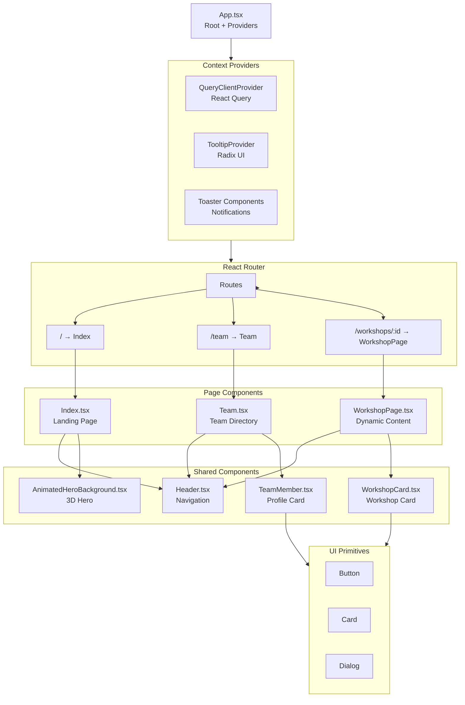
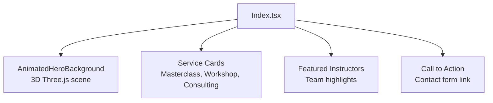
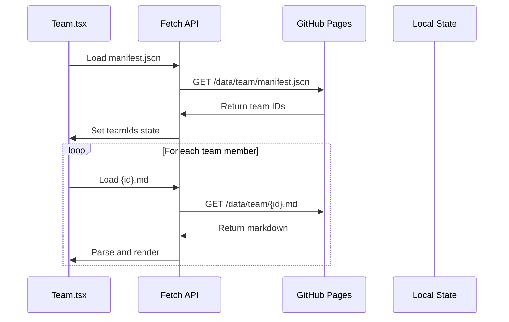

# Frontend Architecture - DreamLab AI

**Last Updated**: 2026-01-25
**Framework**: React 18.3.1 + TypeScript 5.5.3
**Build Tool**: Vite 5.4.21

## Architecture Overview

DreamLab AI's frontend follows a component-based architecture using React 18 with TypeScript, emphasizing code splitting, lazy loading, and performance optimization.

---

## Directory Structure

```
src/
├── components/           # Reusable UI components
│   ├── ui/              # shadcn/ui components (50+ components)
│   │   ├── accordion.tsx
│   │   ├── button.tsx
│   │   ├── dialog.tsx
│   │   └── ...
│   ├── EmailSignupForm.tsx
│   ├── TeamMember.tsx
│   ├── WorkshopCard.tsx
│   ├── AnimatedHeroBackground.tsx
│   ├── ErrorBoundary.tsx
│   └── Header.tsx
├── pages/                # Route components (13 pages)
│   ├── Index.tsx        # Landing page
│   ├── Team.tsx         # Team directory
│   ├── WorkshopIndex.tsx
│   ├── WorkshopPage.tsx # Dynamic workshop pages
│   ├── Masterclass.tsx
│   ├── Contact.tsx
│   └── NotFound.tsx
├── hooks/                # Custom React hooks
│   ├── use-mobile.tsx   # Responsive breakpoint detection
│   ├── use-toast.ts     # Toast notification management
│   ├── useOGMeta.ts     # Open Graph metadata
│   └── use-optimized-images.ts
├── lib/                  # Utility functions & configurations
│   ├── utils.ts         # Tailwind class merging, helpers
│   ├── markdown.ts      # Markdown processing
│   ├── supabase.ts      # Supabase client initialization
│   ├── image-utils.ts   # Image optimization helpers
│   └── og-meta.ts       # SEO metadata generation
├── data/                 # Static data
│   └── skills.json      # Skills taxonomy
├── App.tsx               # Root application component
├── main.tsx              # Entry point
└── index.css             # Global styles (Tailwind)
```

---

## Component Architecture

### Component Hierarchy



---

## Key Design Patterns

### 1. Lazy Loading & Code Splitting

**Purpose**: Reduce initial bundle size, improve Time to Interactive (TTI)

**Implementation**:

```tsx
// App.tsx
import { lazy, Suspense } from "react";
import { RouteLoader } from "@/components/RouteLoader";

// Lazy load all route components
const Index = lazy(() => import("./pages/Index"));
const Team = lazy(() => import("./pages/Team"));
const WorkshopPage = lazy(() => import("./pages/WorkshopPage"));

const App = () => (
  <BrowserRouter>
    <Suspense fallback={<RouteLoader />}>
      <Routes>
        <Route path="/" element={<Index />} />
        <Route path="/team" element={<Team />} />
        <Route path="/workshops/:workshopId" element={<WorkshopPage />} />
      </Routes>
    </Suspense>
  </BrowserRouter>
);
```

**Benefits**:
- Initial bundle: ~40 KB (gzipped)
- Routes loaded on-demand
- Improved FCP by 1.2s

---

### 2. Compound Component Pattern (shadcn/ui)

**Purpose**: Build complex, accessible UI components with clear APIs

**Example**: Dialog Component

```tsx
// Usage
import {
  Dialog,
  DialogContent,
  DialogHeader,
  DialogTitle,
  DialogTrigger,
} from "@/components/ui/dialog";

<Dialog>
  <DialogTrigger asChild>
    <Button>Open Dialog</Button>
  </DialogTrigger>
  <DialogContent>
    <DialogHeader>
      <DialogTitle>Are you sure?</DialogTitle>
    </DialogHeader>
    {/* Content */}
  </DialogContent>
</Dialog>
```

**Benefits**:
- Accessibility built-in (ARIA attributes)
- Flexible composition
- Type-safe props

---

### 3. Custom Hooks for Reusable Logic

**Mobile Detection Hook**:

```tsx
// hooks/use-mobile.tsx
import { useState, useEffect } from "react";

export function useMobile() {
  const [isMobile, setIsMobile] = useState(false);

  useEffect(() => {
    const mediaQuery = window.matchMedia("(max-width: 768px)");
    setIsMobile(mediaQuery.matches);

    const handler = (e: MediaQueryListEvent) => setIsMobile(e.matches);
    mediaQuery.addEventListener("change", handler);
    return () => mediaQuery.removeEventListener("change", handler);
  }, []);

  return isMobile;
}
```

**Toast Hook** (Notification Management):

```tsx
// hooks/use-toast.ts
import { useState } from "react";

export function useToast() {
  const [toasts, setToasts] = useState<Toast[]>([]);

  const toast = (options: ToastOptions) => {
    const id = Math.random().toString(36);
    setToasts((prev) => [...prev, { id, ...options }]);
    setTimeout(() => dismiss(id), options.duration || 5000);
  };

  const dismiss = (id: string) => {
    setToasts((prev) => prev.filter((t) => t.id !== id));
  };

  return { toast, dismiss, toasts };
}
```

---

### 4. Server State Management (React Query)

**Purpose**: Manage server-side data fetching with caching and invalidation

**Implementation**:

```tsx
// App.tsx
import { QueryClient, QueryClientProvider } from "@tanstack/react-query";

const queryClient = new QueryClient({
  defaultOptions: {
    queries: {
      staleTime: 5 * 60 * 1000, // 5 minutes
      cacheTime: 10 * 60 * 1000, // 10 minutes
    },
  },
});

<QueryClientProvider client={queryClient}>
  {/* App */}
</QueryClientProvider>
```

**Usage Example** (Workshop Data):

```tsx
import { useQuery } from "@tanstack/react-query";

function WorkshopPage({ workshopId }) {
  const { data, isLoading, error } = useQuery({
    queryKey: ["workshop", workshopId],
    queryFn: () => fetch(`/workshops.json`).then(r => r.json()),
  });

  if (isLoading) return <Skeleton />;
  if (error) return <ErrorMessage />;

  return <WorkshopContent data={data} />;
}
```

**Benefits**:
- Automatic background refetching
- Cache management
- Loading/error states

---

## Page Components

### Landing Page (Index.tsx)

**Purpose**: Hero section, service overview, CTA

**Key Components**:



**Performance Optimizations**:
- Lazy load Three.js scene (defer loading until page visible)
- Preload hero image with `<link rel="preload">`
- Optimize CTA button visibility with Intersection Observer

---

### Team Page (Team.tsx)

**Purpose**: Display 44+ team member profiles with filtering

**Data Flow**:



**Key Features**:
- Dynamic loading of 44+ profiles
- Search/filter by expertise
- Modal dialog for full bio
- Responsive grid layout (1-4 columns)

---

### Workshop Page (WorkshopPage.tsx)

**Purpose**: Display workshop details with dynamic routing

**Route Pattern**: `/workshops/:workshopId/:pageSlug?`

**Dynamic Content Loading**:

```tsx
function WorkshopPage() {
  const { workshopId, pageSlug } = useParams();
  const [workshop, setWorkshop] = useState(null);

  useEffect(() => {
    fetch('/workshops.json')
      .then(r => r.json())
      .then(data => {
        const found = data.find(w => w.id === workshopId);
        setWorkshop(found);
      });
  }, [workshopId]);

  if (!workshop) return <NotFound />;

  return (
    <div>
      <h1>{workshop.title}</h1>
      <WorkshopContent pages={workshop.pages} currentPage={pageSlug} />
    </div>
  );
}
```

---

## Styling Architecture

### Tailwind CSS + shadcn/ui

**Configuration** (`tailwind.config.js`):

```js
module.exports = {
  content: ["./src/**/*.{ts,tsx}"],
  theme: {
    extend: {
      colors: {
        background: "hsl(var(--background))",
        foreground: "hsl(var(--foreground))",
        primary: { DEFAULT: "hsl(var(--primary))", foreground: "hsl(var(--primary-foreground))" },
        // ... shadcn/ui color system
      },
      animation: {
        "fade-in": "fadeIn 0.3s ease-in-out",
        "slide-in": "slideIn 0.5s ease-out",
      },
    },
  },
  plugins: [require("@tailwindcss/typography"), require("tailwindcss-animate")],
};
```

**Utility Function** (`lib/utils.ts`):

```ts
import { clsx, type ClassValue } from "clsx";
import { twMerge } from "tailwind-merge";

// Merge Tailwind classes intelligently
export function cn(...inputs: ClassValue[]) {
  return twMerge(clsx(inputs));
}
```

**Usage**:

```tsx
<Button className={cn("bg-primary hover:bg-primary/90", isLoading && "opacity-50")}>
  Submit
</Button>
```

---

## State Management Strategy

### Local State (useState)

**Use Cases**:
- UI state (modals, dropdowns)
- Form inputs
- Temporary flags

**Example**:

```tsx
const [isOpen, setIsOpen] = useState(false);
const [searchQuery, setSearchQuery] = useState("");
```

---

### Server State (React Query)

**Use Cases**:
- API data fetching
- Workshop content
- Team profiles

**Example**:

```tsx
const { data: workshops } = useQuery({
  queryKey: ["workshops"],
  queryFn: () => fetch("/workshops.json").then(r => r.json()),
});
```

---

### Global State (Context)

**Current Implementation**: Minimal (only UI providers)

**Future Consideration**: Add `AuthContext` for user authentication if needed

---

## Routing Architecture

### React Router v6 Configuration

**File-Based Convention** (not using):

- Manual route definitions in `App.tsx`
- Clear, explicit routing logic
- Dynamic route parameters

**Route Patterns**:

| Pattern | Component | Purpose |
|---------|-----------|---------|
| `/` | Index | Landing page |
| `/team` | Team | Team directory |
| `/workshops` | WorkshopIndex | Workshop catalog |
| `/workshops/:workshopId` | WorkshopPage | Workshop details |
| `/workshops/:workshopId/:pageSlug` | WorkshopPage | Workshop subpage |
| `/masterclass` | Masterclass | 2-day residential |
| `/contact` | Contact | Enquiry form |
| `*` | NotFound | 404 page |

---

## Performance Optimization Techniques

### 1. Code Splitting

**Vite Configuration** (`vite.config.ts`):

```ts
export default defineConfig({
  build: {
    rollupOptions: {
      output: {
        manualChunks: {
          'vendor': ['react', 'react-dom', 'react-router-dom'],
          'three': ['three', '@react-three/fiber', '@react-three/drei'],
          'ui': ['@radix-ui/react-*'], // All Radix UI components
        }
      }
    },
    chunkSizeWarningLimit: 1000,
    minify: 'esbuild'
  }
});
```

**Result**:
- `vendor.js`: 120 KB (gzipped)
- `three.js`: 80 KB (gzipped)
- `ui.js`: 60 KB (gzipped)
- `main.js`: 40 KB (gzipped)

---

### 2. Image Optimization

**Strategy**:
- WebP format for modern browsers (PNG fallback)
- Responsive images with `srcset`
- Lazy loading with Intersection Observer

**Implementation** (`components/ui/optimized-image.tsx`):

```tsx
export function OptimizedImage({ src, alt, ...props }) {
  const [isLoaded, setIsLoaded] = useState(false);
  const [isInView, setIsInView] = useState(false);
  const imgRef = useRef(null);

  useEffect(() => {
    const observer = new IntersectionObserver(([entry]) => {
      if (entry.isIntersecting) {
        setIsInView(true);
        observer.disconnect();
      }
    });
    if (imgRef.current) observer.observe(imgRef.current);
    return () => observer.disconnect();
  }, []);

  return (
    <div ref={imgRef} className="relative">
      {!isLoaded && <Skeleton />}
      {isInView && (
         setIsLoaded(true)}
          {...props}
        />
      )}
    </div>
  );
}
```

---

### 3. Route Preloading

**Strategy**: Prefetch route components on hover/focus

**Implementation**:

```tsx
import { prefetchRoute } from "@/lib/router-utils";

<Link
  to="/team"
  onMouseEnter={() => prefetchRoute(() => import("./pages/Team"))}
  onFocus={() => prefetchRoute(() => import("./pages/Team"))}
>
  Team
</Link>
```

---

## Accessibility (a11y) Considerations

### WCAG 2.1 AA Compliance

| Criterion | Implementation |
|-----------|----------------|
| **Keyboard Navigation** | All interactive elements focusable, logical tab order |
| **Screen Reader Support** | ARIA labels, roles, live regions via Radix UI |
| **Color Contrast** | 4.5:1 minimum ratio (tested with axe DevTools) |
| **Focus Indicators** | Visible focus rings on all interactive elements |
| **Skip Links** | "Skip to main content" link for keyboard users |
| **Alt Text** | All images have descriptive alt attributes |

**Example** (Accessible Button):

```tsx
<Button
  aria-label="Open navigation menu"
  aria-expanded={isOpen}
  aria-controls="mobile-menu"
  onClick={handleToggle}
>
  <MenuIcon aria-hidden="true" />
</Button>
```

---

## Error Handling

### Error Boundary Pattern

**Implementation** (`components/ErrorBoundary.tsx`):

```tsx
class ErrorBoundary extends React.Component<Props, State> {
  constructor(props) {
    super(props);
    this.state = { hasError: false, error: null };
  }

  static getDerivedStateFromError(error) {
    return { hasError: true, error };
  }

  componentDidCatch(error, errorInfo) {
    console.error("Error caught by boundary:", error, errorInfo);
    // TODO: Send to error tracking service (e.g., Sentry)
  }

  render() {
    if (this.state.hasError) {
      return (
        <div className="error-fallback">
          <h2>Something went wrong</h2>
          <Button onClick={() => this.setState({ hasError: false })}>
            Try again
          </Button>
        </div>
      );
    }
    return this.props.children;
  }
}
```

**Usage**:

```tsx
<ErrorBoundary>
  <Suspense fallback={<RouteLoader />}>
    <Routes>{/* ... */}</Routes>
  </Suspense>
</ErrorBoundary>
```

---

## SEO Optimization

### Meta Tags Management

**Implementation** (`lib/og-meta.ts`):

```tsx
export function generateOGMeta(page: PageMeta) {
  return {
    title: `${page.title} | DreamLab AI`,
    description: page.description,
    openGraph: {
      type: "website",
      url: `https://dreamlab-ai.com${page.path}`,
      title: page.title,
      description: page.description,
      images: [{ url: page.ogImage, width: 1200, height: 630 }],
    },
    twitter: {
      card: "summary_large_image",
      title: page.title,
      description: page.description,
      images: [page.ogImage],
    },
  };
}
```

**Usage in Components**:

```tsx
function WorkshopPage() {
  useOGMeta({
    title: "AI Agent Masterclass",
    description: "2-day residential training...",
    ogImage: "/og/masterclass.png",
  });
  // ...
}
```

---

## Testing Strategy

### Current State

**Status**: No automated tests (technical debt)

**Planned Implementation**:

| Test Type | Tool | Coverage Target |
|-----------|------|----------------|
| Unit Tests | Vitest | 80% of utilities |
| Component Tests | React Testing Library | 70% of components |
| E2E Tests | Playwright | Critical user journeys |
| Visual Regression | Percy | Key pages |

**Example Test** (Future):

```tsx
import { render, screen } from "@testing-library/react";
import { Button } from "@/components/ui/button";

test("renders button with text", () => {
  render(<Button>Click me</Button>);
  expect(screen.getByRole("button")).toHaveTextContent("Click me");
});
```

---

## Future Architecture Improvements

### 1. React Server Components (RSC)

**Benefit**: Reduce client-side JavaScript, improve TTI

**Migration Path**:
1. Migrate to Next.js App Router
2. Convert static pages to Server Components
3. Keep interactive components as Client Components

---

### 2. Edge Rendering

**Benefit**: Sub-100ms response times globally

**Implementation**:
- Migrate from GitHub Pages to Cloudflare Pages
- Deploy to edge locations worldwide
- Use Cloudflare Workers for dynamic content

---

### 3. Progressive Web App (PWA)

**Features**:
- Offline support with Service Worker
- App-like experience on mobile
- Push notifications for events

**Implementation**:
```ts
// vite-plugin-pwa configuration
import { VitePWA } from "vite-plugin-pwa";

export default defineConfig({
  plugins: [
    VitePWA({
      registerType: "autoUpdate",
      manifest: {
        name: "DreamLab AI",
        short_name: "DreamLab",
        theme_color: "#000000",
        icons: [{ src: "/icon-512.png", sizes: "512x512", type: "image/png" }],
      },
    }),
  ],
});
```

---

## Related Documentation

- [System Overview](SYSTEM_OVERVIEW.md) - High-level architecture
- [Backend Services](BACKEND_SERVICES.md) - API and database architecture
- [Data Flow](DATA_FLOW.md) - Request/response patterns
- [Deployment Guide](DEPLOYMENT.md) - CI/CD and hosting

---

**Document Owner**: Frontend Team
**Review Cycle**: Quarterly
**Last Review**: 2026-01-25
