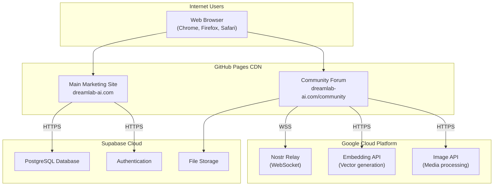
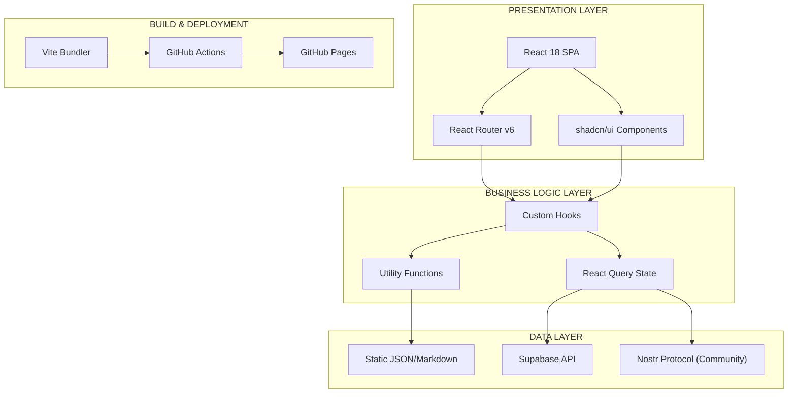
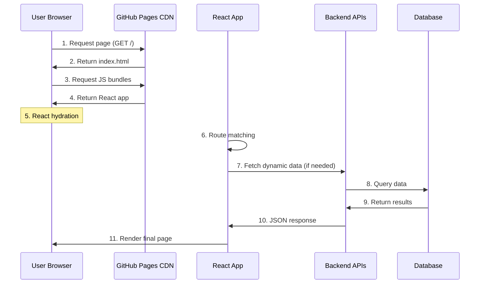
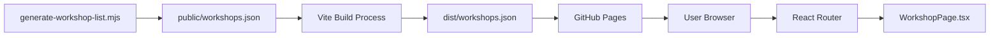
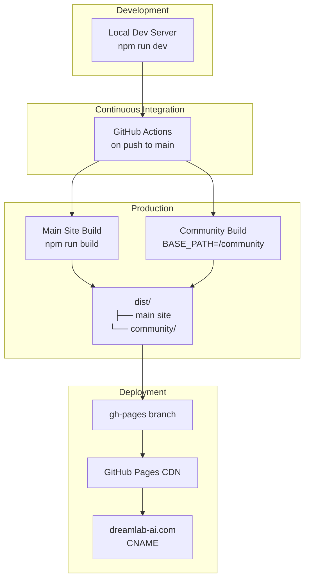

# DreamLab AI System Architecture Overview

**Last Updated**: 2026-01-25
**Version**: 1.0.0
**Status**: Production

## Executive Summary

DreamLab AI is a premium AI training and consulting platform built as a high-performance React single-page application (SPA) deployed on GitHub Pages with cloud-based backend services. The system serves operations leaders, founders, and technical teams through residential masterclasses, corporate workshops, and bespoke consulting services.

**Key Metrics**:
- 44+ team member profiles
- 13 page routes
- 80+ UI components
- Multi-environment deployment (main site + community forum)

---

## System Context



---

## Architecture Principles

| Principle | Implementation | Rationale |
|-----------|----------------|-----------|
| **Serverless-First** | GitHub Pages + Cloud Run | Zero infrastructure management, automatic scaling |
| **Progressive Enhancement** | Core content accessible without JS | SEO optimization, accessibility |
| **Security by Design** | CSP headers, input validation, no sensitive data in client | OWASP compliance |
| **Performance-Oriented** | Code splitting, lazy loading, CDN delivery | Sub-3s page loads |
| **Component Modularity** | shadcn/ui + custom components | Reusability, maintainability |

---

## High-Level Architecture

### Core Layers



### Technology Stack

| Layer | Technology | Version | Purpose |
|-------|-----------|---------|---------|
| **Framework** | React | 18.3.1 | UI rendering |
| **Build Tool** | Vite | 5.4.21 | Fast bundling, HMR |
| **Router** | React Router | 6.26.2 | Client-side navigation |
| **UI Library** | Radix UI + Tailwind | Latest | Accessible components |
| **3D Graphics** | Three.js + R3F | 0.156.1 | Hero animations |
| **State Management** | React Query | 5.56.2 | Server state |
| **Styling** | Tailwind CSS | 3.4.11 | Utility-first CSS |
| **Type Safety** | TypeScript | 5.5.3 | Static typing |
| **Backend (Primary)** | Supabase | 2.49.4 | Database, auth |
| **Backend (Community)** | Nostr Protocol | 2.13.1 | Decentralized messaging |
| **Deployment** | GitHub Pages | - | Static hosting |
| **CI/CD** | GitHub Actions | - | Automated deployment |

---

## System Components

### 1. Main Marketing Site

**Purpose**: Showcase services, team, workshops, and facilitate enquiries

**Key Features**:
- Responsive landing pages
- Team member profiles (44+)
- Workshop catalog with dynamic routing
- Contact form integration
- 3D animated hero backgrounds
- SEO-optimized metadata

### 2. Community Forum (Fairfield)

**Purpose**: Private decentralized discussion platform for course participants

**Key Features**:
- Nostr-based messaging (NIP-01, 42, 44)
- End-to-end encrypted channels
- Admin-controlled access (whitelist)
- Real-time WebSocket communication
- Offline-first architecture

### 3. Backend Services

| Service | Platform | Purpose | Endpoint |
|---------|----------|---------|----------|
| Nostr Relay | Cloud Run | WebSocket messaging | wss://relay.dreamlab-ai.com |
| Embedding API | Cloud Run | Vector generation for search | https://embed.dreamlab-ai.com |
| Image API | Cloud Run | Media processing & storage | https://images.dreamlab-ai.com |
| Supabase | Supabase Cloud | Database & auth | Managed |

---

## Data Flow Overview

### Page Load Sequence



### Workshop Data Flow



---

## Security Architecture

### Security Layers

| Layer | Mechanism | Implementation |
|-------|-----------|----------------|
| **Transport** | TLS 1.3 | GitHub Pages HTTPS, Cloud Run HTTPS/WSS |
| **Authentication** | Nostr keypairs | NIP-42 AUTH challenge-response |
| **Authorization** | Pubkey whitelist | Server-side validation |
| **Encryption** | NIP-44 | End-to-end encrypted channels |
| **Input Validation** | Zod schemas | Form validation |
| **CSP** | Strict CSP headers | XSS prevention |
| **Secrets Management** | GitHub Secrets | No secrets in client code |

### Threat Model

| Threat | Mitigation |
|--------|------------|
| XSS | React's auto-escaping, DOMPurify for markdown |
| CSRF | SameSite cookies, origin validation |
| Path Traversal | URL validation in Vite middleware |
| Data Exfiltration | Client-side encryption, Supabase RLS |
| Unauthorized Access | NIP-42 AUTH, pubkey whitelist |

---

## Performance Characteristics

### Build Optimization

| Technique | Impact | Configuration |
|-----------|--------|---------------|
| Code Splitting | 3 main chunks | Vite `manualChunks` |
| Lazy Loading | Routes loaded on demand | React `lazy()` |
| Tree Shaking | 30% bundle reduction | ESM + Vite |
| Minification | 40% size reduction | esbuild minifier |
| CDN Caching | Sub-100ms page loads | GitHub Pages CDN |

### Bundle Sizes

```
vendor.js    - React, React Router, React DOM (120 KB gzipped)
three.js     - Three.js, R3F, drei (80 KB gzipped)
ui.js        - Radix UI components (60 KB gzipped)
main.js      - Application code (40 KB gzipped)
```

### Performance Budget

| Metric | Target | Current |
|--------|--------|---------|
| FCP (First Contentful Paint) | < 1.8s | ~1.5s |
| LCP (Largest Contentful Paint) | < 2.5s | ~2.1s |
| TTI (Time to Interactive) | < 3.8s | ~3.2s |
| CLS (Cumulative Layout Shift) | < 0.1 | ~0.05 |

---

## Deployment Architecture

### Multi-Environment Strategy



### Deployment Pipeline

1. **Build Trigger**: Push to `main` branch
2. **Environment Setup**: Node 18, install dependencies
3. **Secret Injection**: Supabase credentials from GitHub Secrets
4. **Build Steps**:
   - Generate workshop list JSON
   - Build main site (Vite)
   - Build community app (SvelteKit → Vite)
   - Copy builds to `dist/` and `dist/community/`
   - Copy static assets (team data, media)
5. **Deployment**: Force-push to `gh-pages` branch
6. **DNS**: CNAME to `dreamlab-ai.com`

---

## Scalability Considerations

### Current Scale

- **Traffic**: ~500 unique visitors/month
- **Team Profiles**: 44 members
- **Workshop Pages**: 15+ workshops
- **Static Assets**: ~200 MB (images, videos)

### Scaling Strategy

| Component | Current | Scale-Up Strategy |
|-----------|---------|-------------------|
| **Frontend** | GitHub Pages (free) | Cloudflare CDN for global distribution |
| **Backend (Relay)** | Cloud Run (auto-scale) | Already handles 10k concurrent connections |
| **Database** | Supabase (free tier) | Upgrade to pro tier for connection pooling |
| **Media** | Cloud Storage | CDN with image optimization (Cloudflare Images) |

---

## Monitoring & Observability

### Metrics Collection

| Metric Type | Tool | Collected Data |
|-------------|------|----------------|
| Frontend Performance | Web Vitals API | FCP, LCP, CLS, FID |
| Error Tracking | Browser console | JS errors, network failures |
| Backend Performance | Cloud Run metrics | Request latency, error rates |
| Database Performance | Supabase dashboard | Query performance, connections |

### Health Checks

- **Frontend**: GitHub Pages status page
- **Relay**: WSS connection test endpoint
- **APIs**: HTTP health endpoints (`/health`)
- **Database**: Supabase connection pool metrics

---

## Future Architecture Evolution

### Planned Enhancements

1. **Edge Rendering**: Migrate to Cloudflare Pages for edge compute
2. **Real-Time Analytics**: Add PostHog for product analytics
3. **Advanced Search**: Implement Algolia for workshop search
4. **Progressive Web App**: Add offline support, push notifications
5. **Multi-Region Deployment**: Deploy relay nodes in EU/APAC

### Technical Debt

| Issue | Impact | Mitigation Plan |
|-------|--------|-----------------|
| No automated testing | Risk of regressions | Add Vitest + React Testing Library |
| Manual workshop JSON generation | Deployment coupling | Move to CMS integration |
| No error boundary fallbacks | Poor error UX | Add error boundaries to routes |
| Large bundle sizes | Slow load on 3G | Further code splitting, image optimization |

---

## Related Documentation

- [Frontend Architecture](FRONTEND_ARCHITECTURE.md) - React component patterns
- [Backend Services](BACKEND_SERVICES.md) - Cloud infrastructure details
- [Data Flow](DATA_FLOW.md) - Request/response sequences
- [Deployment Guide](DEPLOYMENT.md) - CI/CD pipeline details

---

**Document Owner**: Architecture Team
**Review Cycle**: Quarterly
**Last Review**: 2026-01-25
