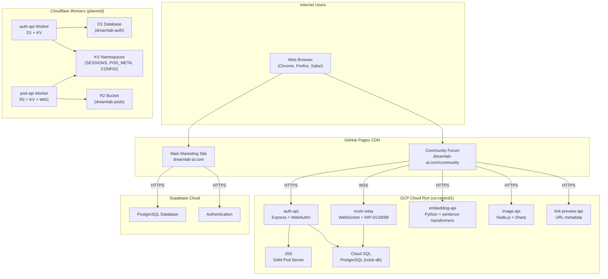
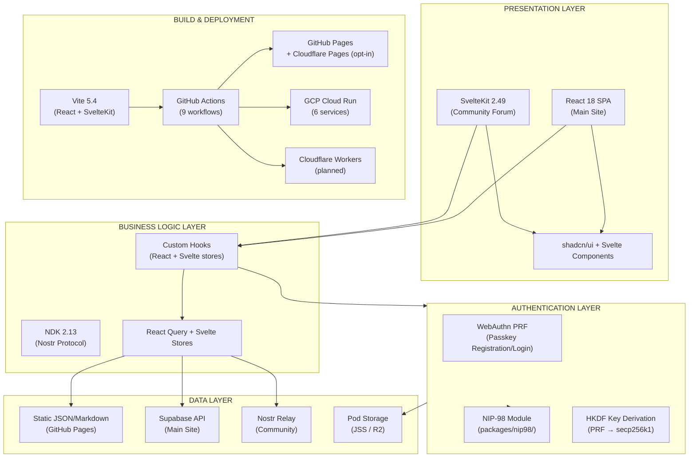
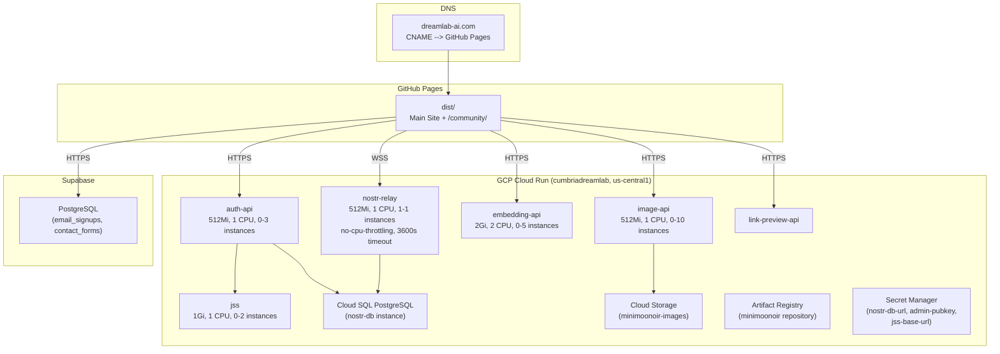

# DreamLab AI System Architecture Overview

**Last Updated**: 2026-02-28
**Version**: 2.0.0
**Status**: Production (GCP Cloud Run) + Migration In Progress (Cloudflare Workers)

## Executive Summary

DreamLab AI is a premium AI training and consulting platform comprising two frontend applications (React SPA and SvelteKit community forum) deployed on GitHub Pages, six backend services on GCP Cloud Run, and a planned migration of four of those services to Cloudflare Workers (ADR-010). The platform serves operations leaders, founders, and technical teams through residential masterclasses, corporate workshops, and bespoke consulting services.

**Key Metrics**:
- 44+ team member profiles
- 14 route pages (main site) + 21 route pages (community forum)
- 50+ shadcn/ui primitives
- 6 GCP Cloud Run backend services (current)
- 2 planned Cloudflare Workers (auth-api, pod-api) with code in `workers/`
- Consolidated NIP-98 module shared across 4 consumers

---

## System Context



---

## Architecture Principles

| Principle | Implementation | Rationale |
|-----------|----------------|-----------|
| **Serverless-First** | GitHub Pages + Cloud Run + Workers | Zero infrastructure management, automatic scaling |
| **Edge-Optimised** | Cloudflare Workers (planned) at 300+ PoPs | Sub-5ms cold starts, global low latency |
| **Security by Design** | WebAuthn PRF + NIP-98 + WAC | Passwordless auth, cryptographic HTTP auth, access control |
| **Decentralised Identity** | Nostr pubkey + did:nostr + WebID | User-owned keys, no centralised identity provider |
| **Performance-Oriented** | Code splitting, lazy loading, CDN delivery | Sub-3s page loads |
| **Component Modularity** | shadcn/ui + shared NIP-98 package | Reusability, maintainability |

---

## High-Level Architecture

### Core Layers



### Technology Stack

| Layer | Technology | Version | Purpose |
|-------|-----------|---------|---------|
| **Framework (Main)** | React | 18.3.1 | UI rendering |
| **Framework (Forum)** | SvelteKit | 2.49 | Community forum |
| **Build Tool** | Vite | 5.4.21 | Fast bundling, HMR, SWC plugin |
| **Router** | React Router DOM | 6.26.2 | Client-side navigation |
| **UI Library** | Radix UI + Tailwind CSS | 3.4.11 | Accessible components, utility CSS |
| **3D Graphics** | Three.js + @react-three/fiber | 0.156.1 | Hero animations, visualisations |
| **WASM** | Rust (wasm-voronoi/) | - | Voronoi tessellation |
| **Server State** | TanStack React Query | 5.56.2 | Data fetching + caching |
| **Forms** | React Hook Form + Zod | 7.53 / 3.23 | Validation |
| **Nostr Protocol** | NDK | 2.13.1 | Decentralised messaging |
| **Nostr Crypto** | nostr-tools | 2.19.3 | Event signing/verification |
| **Type Safety** | TypeScript | 5.5.3 | Static typing |
| **Backend (Main)** | Supabase | 2.49.4 | Database, auth |
| **Backend (Forum)** | GCP Cloud Run | - | 6 containerised services |
| **Backend (Planned)** | Cloudflare Workers | - | Edge compute (D1/KV/R2) |
| **Deployment** | GitHub Pages | - | Static hosting |
| **CI/CD** | GitHub Actions | - | Automated deployment |

---

## System Components

### 1. Main Marketing Site (React SPA)

**Purpose**: Showcase services, team, workshops, and facilitate enquiries.

**Key Features**:
- 14 lazy-loaded route pages
- 44+ team member profiles loaded from markdown
- Workshop catalogue with multi-level dynamic routing
- Contact form with Zod validation and Supabase storage
- 3D hero backgrounds (VoronoiGoldenHero, TesseractProjection) via Three.js + Rust WASM
- AIChatFab floating assistant component
- SEO-optimised Open Graph metadata

### 2. Community Forum (SvelteKit)

**Purpose**: Private decentralised discussion platform for course participants.

**Key Features**:
- 21 Svelte route pages: chat, DMs, forums, calendar, admin, settings
- Nostr-based messaging (NIP-01, NIP-17, NIP-28, NIP-44, NIP-52)
- WebAuthn PRF passkey authentication (no passwords)
- NIP-98 HTTP auth for all state-mutating API calls
- End-to-end encrypted direct messages (NIP-44)
- Solid pod storage per user (WebID + Linked Data)
- Admin approval flow for new registrations

### 3. Backend Services

| Service | Platform | Technology | Purpose | Endpoint |
|---------|----------|-----------|---------|----------|
| **auth-api** | Cloud Run | Express 4.19 + @simplewebauthn/server 10.0 | WebAuthn + NIP-98 + pod provisioning | HTTPS |
| **jss** | Cloud Run | @solid/community-server 7.1.8 | Solid pod storage (WebID) | HTTPS |
| **nostr-relay** | Cloud Run | Node.js + ws + pg 8.12 | WebSocket Nostr relay | WSS |
| **embedding-api** | Cloud Run | Python 3.11 + FastAPI + sentence-transformers | Vector embeddings (384-dim) | HTTPS |
| **image-api** | Cloud Run | Node.js + Sharp | Image upload/resize with NIP-98 | HTTPS |
| **link-preview-api** | Cloud Run | Node.js | URL metadata extraction | HTTPS |
| **Supabase** | Managed | PostgreSQL + Auth | Main site database | Managed |

### 4. Planned Cloudflare Workers (ADR-010)

| Worker | Storage | Replaces | Status |
|--------|---------|----------|--------|
| **auth-api** | D1 + KV (SESSIONS) | Cloud Run auth-api | Code in `workers/auth-api/` |
| **pod-api** | R2 (PODS) + KV (POD_META) | Cloud Run JSS | Code in `workers/pod-api/` |

---

## Security Architecture

### Identity Model

```
WebAuthn PRF output (32 bytes, HMAC-SHA-256 from authenticator)
  --> HKDF(SHA-256, salt=[], info="nostr-secp256k1-v1")
  --> 32-byte secp256k1 private key (closure-held, never stored, zeroed on pagehide)
  --> getPublicKey() --> hex pubkey (Nostr identity)
  --> did:nostr:{pubkey} (DID interop)
  --> WebID at {pod-url}/{pubkey}/profile/card#me (Solid/Linked Data)
```

### Security Layers

| Layer | Mechanism | Implementation |
|-------|-----------|----------------|
| **Transport** | TLS 1.3 | GitHub Pages HTTPS, Cloud Run HTTPS/WSS |
| **Authentication** | WebAuthn PRF | Passwordless passkey with key derivation |
| **HTTP Auth** | NIP-98 (kind 27235) | Schnorr-signed events per request |
| **Access Control** | WAC (Web Access Control) | JSON-LD ACL evaluator on pod resources |
| **Encryption** | NIP-44 | End-to-end encrypted DMs |
| **Input Validation** | Zod schemas | Form + API boundary validation |
| **Sanitisation** | DOMPurify 3.3 | HTML/markdown rendering |
| **Secrets Management** | GitHub Secrets + GCP Secret Manager | No secrets in client code |

### Threat Model

| Threat | Mitigation |
|--------|------------|
| XSS | React auto-escaping, DOMPurify for markdown |
| CSRF | SameSite cookies, NIP-98 signed requests |
| Path Traversal | URL validation in Vite middleware, R2 key sanitisation |
| Replay Attack | NIP-98 timestamp tolerance (+-60s) |
| Payload Tampering | SHA-256 body hash in NIP-98 payload tag |
| SSRF | RP_ORIGIN anti-SSRF validation in auth-api |
| Unauthorised Access | WebAuthn + NIP-98 + WAC ACLs |
| Key Extraction | Privkey in closure only, zeroed on pagehide |

---

## Performance Characteristics

### Build Optimisation

| Technique | Impact | Configuration |
|-----------|--------|---------------|
| Code Splitting | 3 manual chunks + route chunks | Vite `manualChunks` (vendor, three, ui) |
| Lazy Loading | All 14 routes loaded on demand | React `lazy()` + Suspense |
| Tree Shaking | ESM + Vite dead code elimination | Default Vite behaviour |
| Minification | esbuild minifier | `minify: 'esbuild'` in vite.config.ts |
| CDN Caching | GitHub Pages global CDN | Automatic |
| WASM | Rust Voronoi tessellation | wasm-voronoi/ compiled at build time |

### Bundle Sizes (approximate, gzipped)

```
vendor.js    - React, React DOM, React Router (120 KB)
three.js     - Three.js, R3F, drei (80 KB)
ui.js        - 15 Radix UI components (60 KB)
main.js      - Application code (40 KB)
main.css     - Tailwind styles (10 KB)
```

### Performance Budget

| Metric | Target | Current |
|--------|--------|---------|
| FCP (First Contentful Paint) | < 1.8s | ~1.5s |
| LCP (Largest Contentful Paint) | < 2.5s | ~2.1s |
| TTI (Time to Interactive) | < 3.8s | ~3.2s |
| CLS (Cumulative Layout Shift) | < 0.1 | ~0.05 |

---

## Infrastructure Topology

### Current Production (February 2026)



### Planned Cloudflare Migration (ADR-010)

| Service | Current | Target | Storage |
|---------|---------|--------|---------|
| auth-api | Cloud Run (Express) | Cloudflare Workers | D1 + KV |
| jss (pod-api) | Cloud Run (CSS 7.x) | Cloudflare Workers | R2 + KV |
| image-api | Cloud Run (Node.js) | Cloudflare Workers | R2 |
| link-preview-api | Cloud Run | Cloudflare Workers | Stateless |
| nostr-relay | Cloud Run | **Retained on Cloud Run** | Cloud SQL |
| embedding-api | Cloud Run | **Retained on Cloud Run** | Cloud Build |

---

## Monitoring and Observability

| Metric Type | Tool | Collected Data |
|-------------|------|----------------|
| Frontend Performance | Web Vitals API | FCP, LCP, CLS, FID |
| Error Tracking | Browser console | JS errors, network failures |
| Backend Performance | Cloud Run metrics | Request latency, error rates, CPU, memory |
| Database Performance | Supabase dashboard | Query performance, connections |
| Deployment Status | GitHub Actions | Workflow success/failure, build times |

---

## Related Documentation

- [Frontend Architecture](FRONTEND_ARCHITECTURE.md) -- React and SvelteKit component patterns
- [Backend Services](BACKEND_SERVICES.md) -- Cloud Run services and Cloudflare Workers
- [Data Flow](DATA_FLOW.md) -- Auth, request, event, and storage flows
- [Deployment Guide](DEPLOYMENT.md) -- CI/CD pipelines and environment configuration
- [ADR-003](../adr/003-gcp-cloud-run-infrastructure.md) -- Original GCP decision (superseded)
- [ADR-010](../adr/010-return-to-cloudflare.md) -- Return to Cloudflare decision

---

**Document Owner**: Architecture Team
**Review Cycle**: Quarterly
**Last Review**: 2026-02-28
