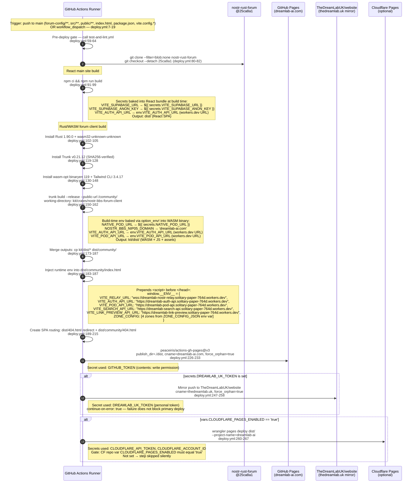

# Forum Deployment Sequence — Code-Derived Cartography

**Date:** 2026-06-11
**Method:** Static trace of actual CI files, wrangler manifests, and Rust source.
No secrets reproduced; CI secret names are referenced by name only.
**Pinned kit ref:** `nostr-rust-forum@25ca8a11e199ced9b1be4a4fb0601239e31aff54`
(both `deploy.yml:56` and `workers-deploy.yml:31`; see Finding F-1 for the divergence).

---

## Diagram A — `workers-deploy.yml` pipeline sequence

This sequence covers the five Rust Cloudflare Workers.
Source: `.github/workflows/workers-deploy.yml`.

```mermaid
sequenceDiagram
    autonumber
    participant GH as GitHub Actions Runner
    participant CF_API as Cloudflare API
    participant KIT as nostr-rust-forum<br/>@25ca8a1

    Note over GH: Trigger: push to main (forum-config/deploy/**)<br/>OR workflow_dispatch<br/>workers-deploy.yml:7-12

    GH->>GH: Pre-deploy gate — call test-and-lint.yml<br/>(workers-deploy.yml:36-40)<br/>npm lint+build, cargo fmt/clippy/test on forum-config/

    Note over GH: Matrix: 5 workers in parallel (fail-fast: false)<br/>workers-deploy.yml:50-68
    Note right of GH: nostr-bbs-auth-worker   → dreamlab-auth-api<br/>nostr-bbs-pod-worker    → dreamlab-pod-api<br/>nostr-bbs-preview-worker→ dreamlab-link-preview<br/>nostr-bbs-relay-worker  → dreamlab-nostr-relay<br/>nostr-bbs-search-worker → dreamlab-search-api

    GH->>KIT: git clone --filter=blob:none nostr-rust-forum<br/>git checkout --detach 25ca8a1<br/>workers-deploy.yml:75-77

    GH->>GH: cp forum-config/deploy/<config>.wrangler.toml<br/>    kit/crates/<kit_crate>/wrangler.toml<br/>workers-deploy.yml:80
    Note right of GH: Overwrites kit defaults with DreamLab resource IDs<br/>(D1 database IDs, KV namespace IDs, R2 buckets, [vars])

    GH->>GH: Install Rust 1.90.0 + wasm32-unknown-unknown target<br/>workers-deploy.yml:82-85

    GH->>GH: Restore Cargo cache keyed on kit/Cargo.lock<br/>workers-deploy.yml:87-97

    GH->>GH: Install worker-build (if not cached)<br/>workers-deploy.yml:101-105

    GH->>GH: Install Node 20 + wrangler 3.114.17<br/>workers-deploy.yml:107-113

    GH->>CF_API: Provision KV namespaces (idempotent)<br/>workers-deploy.yml:115-163
    Note right of GH: Secrets used: CLOUDFLARE_API_TOKEN, CLOUDFLARE_ACCOUNT_ID<br/>Looks up existing KV by title; creates if absent<br/>Substitutes REPLACE_WITH_NEW_ADMIN_KV_ID in wrangler.toml<br/>Affects: auth-worker (ADMIN_KV), pod-worker (ADMIN_KV_RO)

    alt matrix.config == 'auth-worker'
        GH->>CF_API: wrangler secret list → check PRF_SERVER_SECRET,<br/>ADMIN_PUBKEYS, NATIVE_POD_ADMIN_KEY are present<br/>workers-deploy.yml:166-198
        Note right of GH: Secrets consumed: CLOUDFLARE_API_TOKEN, CLOUDFLARE_ACCOUNT_ID<br/>Fail-fast: exits 1 if any required secret is absent
    end

    GH->>CF_API: wrangler deploy (from kit/crates/<kit_crate>/)<br/>workers-deploy.yml:200-205
    Note right of GH: Secrets used: CLOUDFLARE_API_TOKEN, CLOUDFLARE_ACCOUNT_ID<br/>Deploys WASM worker binary compiled from kit source<br/>with DreamLab wrangler.toml overlaid

    Note over GH: After all 5 workers deploy: health-check job
    GH->>CF_API: GET https://<worker>.solitary-paper-764d.workers.dev/health<br/>for each of the 5 workers — expects HTTP 200<br/>workers-deploy.yml:222-244
```

---

## Diagram B — `deploy.yml` pipeline (Pages + forum client)

This covers the React marketing site and the Leptos/WASM forum client.
Source: `.github/workflows/deploy.yml`.



---

## Diagram C — Configuration layering

How an operator-tunable setting travels from authored source to runtime.

```mermaid
flowchart TD
    DT["forum-config/dreamlab.toml\n(authored source of truth)\nforum-config/dreamlab.toml:1-294"]

    subgraph RELAY_WORKER["relay-worker — runtime [vars]"]
        RW_ZONE["ZONE_CONFIG JSON\nforum-config/deploy/relay-worker.wrangler.toml:19-20\n(deny-by-default if absent)"]
        RW_MESH["MESH_MODE / MESH_PEER_RELAYS\nrelay-worker.wrangler.toml:23-26"]
        RW_CORS["ALLOWED_ORIGINS\nrelay-worker.wrangler.toml:15-16"]
    end

    subgraph AUTH_WORKER["auth-worker — runtime [vars]"]
        AW_RP["RP_ID / RP_NAME / EXPECTED_ORIGIN\nauth-worker.wrangler.toml:58-60"]
        AW_NIP05["NIP05_RESOLVER_MODE / POD_BASE_URL\nauth-worker.wrangler.toml:64-66"]
        AW_NATPOD["NATIVE_POD_URL\nauth-worker.wrangler.toml:81\nNOTE: also pushed as CF secret — secret wins"]
    end

    subgraph AUTH_SECRETS["auth-worker — CF secrets (never in [vars])"]
        AS_PRF["PRF_SERVER_SECRET\n(WebAuthn PRF salt derivation)"]
        AS_ADM["ADMIN_PUBKEYS\n(comma-sep 64-hex pubkeys)"]
        AS_NAT["NATIVE_POD_ADMIN_KEY\n(PSK for native pod provisioning)"]
    end

    subgraph POD_WORKER["pod-worker — runtime [vars]"]
        PW_PAY["PAY_ENABLED / PAY_COST_SATS / PAY_TOKEN_*\npod-worker.wrangler.toml:43-49"]
        PW_CORS["EXPECTED_ORIGIN\npod-worker.wrangler.toml:41"]
    end

    subgraph SEARCH_WORKER["search-worker — runtime [vars]"]
        SW_ADM["ADMIN_PUBKEYS (2 pubkeys)\nsearch-worker.wrangler.toml:34\nNOTE: duplicates auth-worker CF secret — two sources"]
        SW_RVF["RVF_STORE_KEY\nsearch-worker.wrangler.toml:33"]
        SW_CORS["ALLOWED_ORIGINS\nsearch-worker.wrangler.toml:31-32"]
    end

    subgraph CLIENT["Forum WASM client — window.__ENV__ (runtime injection)"]
        CE_RELAY["VITE_RELAY_URL\ndeploy.yml:42 → deploy.yml:185"]
        CE_AUTH["VITE_AUTH_API_URL\ndeploy.yml:43 → deploy.yml:185"]
        CE_POD["VITE_POD_API_URL\ndeploy.yml:44 → deploy.yml:185"]
        CE_SEARCH["VITE_SEARCH_API_URL\ndeploy.yml:45 → deploy.yml:185"]
        CE_PREVIEW["VITE_LINK_PREVIEW_API_URL\ndeploy.yml:46 → deploy.yml:185"]
        CE_ZONE["ZONE_CONFIG (JSON array)\ndeploy.yml:49 → deploy.yml:185"]
    end

    subgraph CLIENT_BUILD["Forum WASM client — option_env! (baked at trunk build time)"]
        CB_AUTH["VITE_AUTH_API_URL\ndeploy.yml:161 (signup.rs fallback)"]
        CB_POD["VITE_POD_API_URL\ndeploy.yml:162 (signup.rs fallback)"]
        CB_NIP05["NOSTR_BBS_NIP05_DOMAIN = 'dreamlab-ai.com'\ndeploy.yml:157"]
        CB_NATPOD["NATIVE_POD_URL → secrets.NATIVE_POD_URL\ndeploy.yml:154"]
    end

    DT -->|"[relay] url, ingress_policy\n→ ZONE_CONFIG mirrors [[zones]]"| RW_ZONE
    DT -->|"[mesh] mode, peer_relays, federated_kinds"| RW_MESH
    DT -->|"[webauthn] rp_id, expected_origin"| AW_RP
    DT -->|"[nip05] resolver_mode, pod_base_url"| AW_NIP05
    DT -->|"[native_pod] base_url"| AW_NATPOD
    DT -->|"[payments] enabled, cost_sats, token.*"| PW_PAY
    DT -->|"[[zones]] — also expressed as\nZONE_CONFIG_JSON in deploy.yml:49"| CE_ZONE

    DT -.->|"[admin] static_pubkeys documented\nbut NOT auto-propagated to workers"| AS_ADM
    Note1["Operator must keep dreamlab.toml [admin].static_pubkeys\nand auth-worker ADMIN_PUBKEYS CF secret in sync manually.\nsearch-worker.wrangler.toml:34 carries a 2-pubkey subset\n(only operator-jjohare + power-user, not full 5-pubkey set)"]

    AS_PRF --> AUTH_SECRETS
    AS_ADM --> AUTH_SECRETS
    AS_NAT --> AUTH_SECRETS

    RW_ZONE -->|"Deny-by-default enforced\nat relay event handler"| RELAY_WORKER
    CE_ZONE -->|"Client renders zone tiles\nfrom window.__ENV__.ZONE_CONFIG"| CLIENT
```



---

## Diagram D — User request through the worker chain

Source: wrangler manifests, workers.rs, phase1.rs, set-worker-secrets.yml.

```mermaid
sequenceDiagram
    autonumber
    participant B as Browser
    participant GHP as GitHub Pages<br/>dreamlab-ai.com
    participant W as Forum WASM<br/>(Leptos @ /community/)
    participant AUTH as Auth Worker<br/>dreamlab-auth-api.*.workers.dev
    participant D1A as D1 dreamlab-auth<br/>(e3981999-e8f0-4c07-9e4b-2e50859b8524)
    participant RELAY as Relay Worker + NostrRelayDO<br/>dreamlab-nostr-relay.*.workers.dev
    participant D1R as D1 dreamlab-relay<br/>(97c77d23-0e24-4325-ada7-1747eab4095b)
    participant POD as Pod Worker<br/>dreamlab-pod-api.*.workers.dev
    participant SEARCH as Search Worker<br/>dreamlab-search-api.*.workers.dev
    participant PREVIEW as Preview Worker<br/>dreamlab-link-preview.*.workers.dev
    participant R2 as R2 dreamlab-pods<br/>(shared by auth+pod workers)
    participant AI as Workers AI<br/>(@cf/baai/bge-small-en-v1.5)

    Note over B,GHP: Static site load
    B->>GHP: GET /community/
    GHP-->>B: index.html (with injected window.__ENV__ block)<br/>deploy.yml:183-187
    B->>GHP: GET /community/assets/*.wasm, *.js
    GHP-->>B: WASM bundle + JS glue (trunk build output)

    Note over W: Client initialises from window.__ENV__<br/>Relay URL, auth URL, zone config all read here.<br/>VITE_LINK_PREVIEW_API_URL injected but client reads<br/>it from __ENV__ — no declaration in vite-env.d.ts (see F-5)

    Note over B,AUTH: WebAuthn registration / login
    B->>AUTH: POST /auth/register/options (NIP-98 signed)<br/>AUTH validates: RP_ID [vars], PRF_SERVER_SECRET [secret]<br/>auth-worker.wrangler.toml:58, deploy_config.rs:57
    AUTH->>D1A: INSERT challenge (nip98_replay check via INSERT OR IGNORE)
    AUTH-->>B: {publicKeyOptions, prfSalt}
    B->>B: navigator.credentials.create() → PRF output<br/>→ HKDF → secp256k1 keypair (on-device; no key escrow)
    B->>AUTH: POST /auth/register/verify {credential, pubkey}<br/>AUTH checks ADMIN_PUBKEYS [secret] for admin flag
    AUTH->>D1A: INSERT members, pod_meta
    AUTH->>R2: PUT /{pubkey}/profile WebID document (pod provisioning)<br/>phase1.rs:13 — enabled=true, keys_at_signup=false
    AUTH-->>B: {token, pod_url}

    Note over B,RELAY: Nostr relay (WebSocket)
    B->>RELAY: WebSocket upgrade wss://dreamlab-nostr-relay.*<br/>RELAY enforces ZONE_CONFIG [vars] deny-by-default<br/>relay-worker.wrangler.toml:19-20
    RELAY->>D1R: SELECT whitelist WHERE pubkey=?
    Note right of RELAY: Cross-D1 read: auth-worker's D1 (REPLAY_DB)<br/>bound in relay-worker for NIP-98 replay check<br/>relay-worker.wrangler.toml:48-51
    RELAY->>D1R: Event persisted to NostrRelayDO (Durable Object)<br/>relay-worker.wrangler.toml:35-38

    Note over B,POD: Solid pod CRUD
    B->>POD: GET /pods/{pubkey}/profile<br/>POD validates NIP-98 via REPLAY_DB (D1 dreamlab-auth)<br/>pod-worker.wrangler.toml:30-37
    POD->>R2: GET dreamlab-pods/{pubkey}/profile
    Note right of POD: PAY_ENABLED=true — quota enforced<br/>pod-worker.wrangler.toml:43-49
    POD-->>B: WebID document (Turtle / JSON-LD)

    Note over B,SEARCH: Full-text + vector search
    B->>SEARCH: GET /search?q=... (NIP-98 signed)
    SEARCH->>AI: Workers AI embedding (@cf/baai/bge-small-en-v1.5)<br/>search-worker.wrangler.toml:11-12
    SEARCH->>R2: GET/PUT dreamlab-vectors (VECTORS binding)<br/>search-worker.wrangler.toml:14-16
    SEARCH-->>B: {results:[...]}

    Note over B,PREVIEW: Link preview / OG unfurl
    B->>PREVIEW: GET /preview?url=... (rate-limited via RATE_LIMIT KV)<br/>preview-worker.wrangler.toml:11-14
    PREVIEW-->>B: {title, description, image, ...}

    Note over B,AUTH: Native pod provisioning (cohort-gated)
    B->>AUTH: POST /api/native-pod/provision<br/>AUTH sends X-Pod-Admin-Key (NATIVE_POD_ADMIN_KEY [secret])<br/>to NATIVE_POD_URL [vars] = https://pods-native.dreamlab-ai.com<br/>auth-worker.wrangler.toml:69-81
    Note right of AUTH: AGPL Source-Code header: NOT emitted by any worker.<br/>Workers are self-authored (DreamLab copyright holder per ADR-028);<br/>no third-party AGPL dependency is shipped in the worker binaries.<br/>The obligation is therefore moot — but no header is emitted as<br/>affirmative compliance evidence either (see Finding F-6).
```

---

## Findings

### F-1 — KIT_REF divergence between rust-ci.yml and deploy pipelines
**Severity:** MEDIUM
**File:line:** `.github/workflows/rust-ci.yml:18`
**Description:** `rust-ci.yml` sets `KIT_REF: 'main'` and clones with `--depth 1 --branch main`. Both `deploy.yml:56` and `workers-deploy.yml:31` pin `KIT_REF: '25ca8a11e199ced9b1be4a4fb0601239e31aff54'`. This means the CI that validates fmt/clippy/test runs against whatever HEAD of `main` is at execution time — potentially a different commit from the one that ships. A breaking upstream push to `nostr-rust-forum:main` will pass `rust-ci.yml` (which floats) and fail the actual deploy pipelines (which are pinned), or vice versa if the kit introduces a regression after the pinned SHA but before the next pin bump.
**Classification:** Config divergence / test-vs-deploy gap.

### F-2 — ADMIN_KV placeholder survives into production without ops action
**Severity:** HIGH
**File:line:** `forum-config/deploy/auth-worker.wrangler.toml:40`, `forum-config/deploy/pod-worker.wrangler.toml:22`
**Description:** Both manifests ship with `id = "REPLACE_WITH_NEW_ADMIN_KV_ID"`. The CI test `deploy_config.rs:263-286` deliberately asserts this placeholder is *present* (not that it is resolved), so the test suite passes with an unresolved binding. The `workers-deploy.yml:115-163` KV provisioning step resolves it at deploy time via `sed -i`, but the substitution happens in the runner's working copy and is never committed. If the KV provisioning step fails silently, `wrangler deploy` proceeds with the placeholder and any `ADMIN_KV` write will 500 at request time.
**Classification:** Operational / placeholder not fail-closed at build time.

### F-3 — NATIVE_POD_URL appears as both a [vars] value and a CF secret
**Severity:** LOW-MEDIUM
**File:line:** `forum-config/deploy/auth-worker.wrangler.toml:81`, `.github/workflows/set-worker-secrets.yml:23-34`
**Description:** `auth-worker.wrangler.toml` sets `NATIVE_POD_URL = "https://pods-native.dreamlab-ai.com"` as a `[vars]` entry (plaintext, visible in wrangler dashboard). `set-worker-secrets.yml:27-33` also pushes `secrets.NATIVE_POD_URL` as a CF secret with `type: secret_text`. In Cloudflare Workers, a secret binding of the same name overrides the `[vars]` value. The comment in `workers-deploy.yml:183` acknowledges this: `NATIVE_POD_URL is a [vars] value`. The `[vars]` copy is therefore dead once the secret is set. This creates two sources of truth for the same value and confusion about which one the worker reads.
**Classification:** Config ambiguity / dead [vars] entry.

### F-4 — ADMIN_PUBKEYS has two separate, non-synchronized sources
**Severity:** MEDIUM
**File:line:** `forum-config/deploy/search-worker.wrangler.toml:34`, `forum-config/src/deploy_config.rs:68-69`
**Description:** `search-worker.wrangler.toml` carries `ADMIN_PUBKEYS` as a plaintext `[vars]` value containing 2 pubkeys (operator-jjohare + power-user). The auth-worker requires `ADMIN_PUBKEYS` as a CF secret (validated in `workers-deploy.yml:186`), which according to `deploy_config.rs:62-63` is the mirror of `dreamlab.toml [admin].static_pubkeys` (5 pubkeys). These two sources are not kept in sync by any pipeline step. The search worker's admin check operates on a subset of the admin set that the auth worker knows about. `dreamlab.toml:34-46` is the authored source but is not auto-propagated to either worker.
**Classification:** Config divergence / admin resolution split.

### F-5 — VITE_LINK_PREVIEW_API_URL injected into window.__ENV__ but absent from vite-env.d.ts and .env.example
**Severity:** LOW
**File:line:** `.github/workflows/deploy.yml:46,185`, `src/vite-env.d.ts:1-29`, `.env.example:1-20`
**Description:** `deploy.yml:185` injects `VITE_LINK_PREVIEW_API_URL` into `window.__ENV__`, and the value is declared in the `deploy.yml` env block at line 46. However it does not appear in `src/vite-env.d.ts` (which lists `VITE_RELAY_URL`, `VITE_AUTH_API_URL`, `VITE_POD_API_URL`, `VITE_SEARCH_API_URL` but not `VITE_LINK_PREVIEW_API_URL`), and it is absent from `.env.example`. Local development environments will not know to set this variable. The React main site also declares `VITE_EMBEDDING_API_URL`, `VITE_IMAGE_API_URL`, `VITE_IMAGE_BUCKET`, `VITE_IMAGE_ENCRYPTION_ENABLED`, `VITE_NDK_DEBUG`, `VITE_ADMIN_PUBKEY`, `VITE_APP_NAME`, `VITE_APP_VERSION`, `VITE_AI_CHAT_URL` in `vite-env.d.ts` but none of these are set in any CI workflow or in `.env.example`, indicating they are either unused dead declarations or undocumented local-only vars.
**Classification:** Documentation gap / env var inventory mismatch.

### F-6 — No AGPL §13 Source-Code offer header emitted anywhere
**Severity:** INFORMATIONAL
**File:line:** (no file: the emission point does not exist)
**Description:** Per `agentbox/CLAUDE.md`, AGPL §13 compliance for viewer-slot surfaces requires a `Source-Code` response header. No such header is emitted by any of the five Cloudflare Workers (`workers.rs` documents only rate-limit and dispatch logic; no response-header middleware exists in the overlay). The worker binaries are self-authored DreamLab code (not a covered AGPL dependency per `docs/adr/028-solid-pod-rs-agpl-boundary.md:28-30`), so the obligation is moot for the deployed workers themselves. However, the `agentbox` CLAUDE.md rule applies to the viewer slot in the agentbox deployment, not to these Cloudflare Workers, so the classification is informational. The task prompt named AGPL §13 explicitly, so this absence is noted as the emission point does not exist in any worker response path.
**Classification:** Informational / compliance architecture note; obligation is moot for CF Workers tier.

### F-7 — rust-ci.yml is workflow_dispatch only; kit CI runs are entirely manual
**Severity:** LOW
**File:line:** `.github/workflows/rust-ci.yml:9`
**Description:** `rust-ci.yml` only triggers on `workflow_dispatch`. There is no automatic trigger on `push` or `pull_request`. Combined with Finding F-1 (float on `main`), this means the kit-level fmt/clippy/test gates never run automatically. The `test-and-lint.yml` reusable workflow gates `forum-config/` (the overlay crate only) automatically, but the kit worker crates themselves have no automated CI in this repo except at the point of `wrangler deploy`.
**Classification:** CI gap / no automatic kit-level quality gate.

### F-8 — CLOUDFLARE_PAGES_ENABLED and DREAMLAB_UK_TOKEN are undocumented optional deploy paths
**Severity:** LOW
**File:line:** `.github/workflows/deploy.yml:261`, `deploy.yml:238-258`
**Description:** `deploy.yml` has two optional deploy targets: a mirror push to `TheDreamLabUK/website` (gated on `secrets.DREAMLAB_UK_TOKEN` being non-empty) and a Cloudflare Pages deploy (gated on `vars.CLOUDFLARE_PAGES_ENABLED == 'true'`). Neither variable appears in any documentation, `README.md`, or `.env.example`. The Cloudflare Pages target is configured with `--commit-dirty=true` which bypasses dirty-working-tree rejection. The CF Pages deploy would produce a second, potentially inconsistent copy of the site alongside GitHub Pages with no documented operator intent.
**Classification:** Undocumented optional surface / potential dual-origin inconsistency.

### F-9 — Zone config has three non-synchronized copies
**Severity:** MEDIUM
**File:line:** `forum-config/dreamlab.toml:57-94`, `forum-config/deploy/relay-worker.wrangler.toml:19-20`, `.github/workflows/deploy.yml:49`
**Description:** The zone/section model is expressed in three places: (1) `dreamlab.toml [[zones]]` is the authored source; (2) `relay-worker.wrangler.toml [vars].ZONE_CONFIG` is a JSON copy the relay uses to enforce access at event ingestion time; (3) `deploy.yml:49 ZONE_CONFIG_JSON` is a third JSON copy injected into `window.__ENV__.ZONE_CONFIG` for the forum client to render zone tiles. No build step generates (2) or (3) from (1). An operator editing `dreamlab.toml` must manually update both wrangler files and both the `deploy.yml` env block to keep access control and UI in sync. A divergence between (2) and (3) would show the wrong zones in the UI while the relay enforces a different set.
**Classification:** Config synchronization risk / three-way manual consistency.
