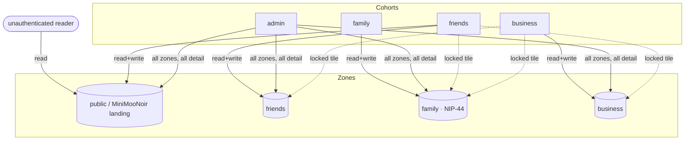
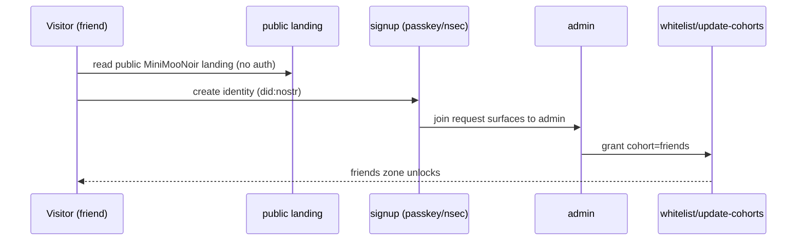

# DreamLab Forum — Organisational Redesign

> Status: **DESIGN — pending operator sign-off on the access matrix.**
> Decisions locked (2026-06-10): privacy = **hybrid** (relay-ACL + NIP-44 for family & calendar detail);
> calendar = **both** (native NIP-52 + external venue mirror); minimoonoir = **public face of the friends
> forum**; business view of other sections = **visible but locked**.

## 1. The lever

The kit already routes every section access decision through **one function** —
`nostr-bbs-relay-worker/src/trust.rs::has_zone_access` — which today hardcodes
`home / members / private`. Wiring it to `Zone.required_cohorts` from config makes
arbitrary private sections pure data. The whole redesign lands in three existing
crates (`nostr-bbs-relay-worker`, `nostr-bbs-config`, `nostr-bbs-core`) + config +
the Leptos client. **No new crates.**

- Section primitive = **NIP-28 channel** (kind 40 def / kind 42 message), grouped into a **zone**.
- Membership = **cohort** tags on `whitelist.cohorts` (admin-assigned via `whitelist/update-cohorts`).
- Identity = `did:nostr` + kind-0 metadata, resolved `display_name › name › NIP-05 › short pubkey`.

## 2. Cohorts

Orthogonal tags; a person may hold several (you = `admin`; a relative who also visits = `family,friends`).

| Cohort | Who |
|---|---|
| `admin` | You (`11ed…663c`) and co-admins — bypass all zones, see all detail |
| `family` | Family members — read access to **all** calendars |
| `friends` | The MiniMooNoir circle — music/photos/events/staying over |
| `business` | In-house training visitors at DreamLab |

## 3. Zones (sections) & visibility

| Zone | Slug | Read | Write | Seen by non-members | Encryption | Hero |
|---|---|---|---|---|---|---|
| **MiniMooNoir landing** | `public` | everyone incl. unauth | `friends`,`admin` | — (public) | none | `lake-district-dawn` |
| **Friends (MiniMooNoir)** | `friends` | `friends`,`admin` | `friends`,`admin` | listed (public face) | relay-ACL | _tbd_ |
| **Family** | `family` | `family`,`admin` | `family`,`admin` | locked tile | **NIP-44** | _tbd_ |
| **Business** | `business` | `business`,`admin` | `business`,`admin` | locked tile | relay-ACL | `ai-commander-week` |

"Locked tile" = the section name renders greyed/locked with no content (your *visible-but-locked* choice).
`business` users see `family`/`friends` as locked tiles only; never content, never calendar.

## 4. Calendar visibility matrix (the privacy-critical spec)

Native NIP-52 events carry a zone tag; the relay projects per viewer-tier on read.
"Free/busy" = start/end + a `busy` flag at **fairfield**/**dreamlab** venues, **detail redacted**.

| Viewer ↓ / Event → | Family events | Business events | Friends events | Their own |
|---|---|---|---|---|
| **admin** | full detail | full detail | full detail | full |
| **family** | full detail | full detail | full detail | full |
| **friends** | **free/busy only** | **free/busy only** | full detail | full |
| **business** | none (unaware) | full detail | none (unaware) | full |

> ⚠️ Review these cells. The high-risk ones: *friends must see family/business as free/busy only*
> (never titles/notes), and *business must see neither family nor friends at all*.

## 5. Diagrams

### 5.1 Access model



### 5.2 Read path — relay REQ zone + calendar-tier projection (the debug seam)

```mermaid
sequenceDiagram
  participant C as Client (Leptos)
  participant R as relay-worker
  participant T as trust.rs::has_zone_access
  participant K as calendar tier projector
  C->>R: REQ {kinds:[40,42,31922,31923], #zone}
  R->>R: resolve session_pubkey (NIP-42 AUTH)
  R->>T: zone(channel) ∩ cohorts(pubkey)?
  alt member or admin
    T-->>R: allow
    R->>K: if kind∈{31922,31923}: project by viewer tier
    K-->>R: full detail | free/busy redacted | drop
    R-->>C: events
  else non-member
    T-->>R: deny
    R-->>C: (kind-40 def → locked-tile stub; kind-42/cal → omitted)
  end
```

### 5.3 MiniMooNoir onboarding



## 6. Work breakdown

| Phase | Scope | Crates / paths | Risk |
|---|---|---|---|
| **A** Config-driven zones | `has_zone_access` → `Zone.required_cohorts`; close unauth-read gap; kind-40 locked-tile filter; `channel_zones` admin write path | relay-worker, config | auth-critical → Opus |
| **B** Cohorts & sections | define public/friends/family/business zones + cohorts + banners in `dreamlab.toml` | forum-config | low |
| **C** Tiered calendar | kind-31922 + zone tag + free/busy projector; relay REQ calendar branch; external venue mirror | core, relay-worker | auth-critical → Opus |
| **D** Identity polish | fix 6 raw-pubkey leak sites → display-name resolution | forum-client | low |
| **E** Per-section heroes | `Zone.banner_image_url` → Leptos banner; assign heroes | forum-config, forum-client, website | low |
| **F** Website reorg | delete dead/debt (4GB target, wasm-voronoi, embeddings/nostr-relay scripts, .agentic-qe, content, workers) | website | low |
| **G** Ecosystem convergence | unify solid-pod-rs→alpha.17; single NIP-98 front door (solid-pod-rs-nostr via pods adapter) | VisionClaw, agentbox, website | auth-adjacent → Opus |
| **H** Crate bump + push + browser test | tag/publish kit + bumps; sidecar E2E per tier | all | gated |

## 7. Open inputs

- **External calendar source** for the "both" mirror (fairfield/dreamlab bookings): Google / CalDAV / iCal / other? Native NIP-52 proceeds without it; the mirror waits on this.
- **Friends & family hero images**: only `lake-district-dawn` and the workshop heroes exist today; `friends`/`family` need art (reuse `lake-district-dawn`, or new images to drop in `public/images/heroes/`).
