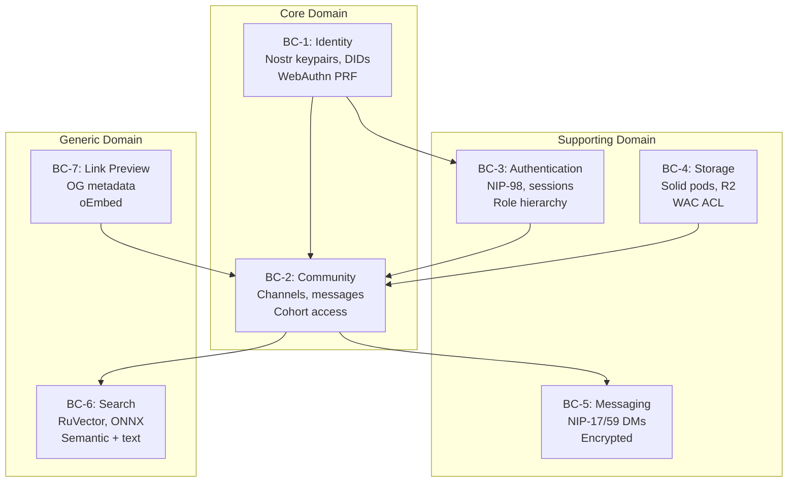

# DDD Bounded Contexts — DreamLab Community Forum

## Context Map

```
┌─────────────────────────────────────────────────────────┐
│                    Anti-Corruption Layer                  │
│              (NIP-98 + Relay API boundary)                │
├──────────┬──────────┬──────────┬──────────┬──────────────┤
│ Auth &   │ Channel &│ Admin &  │ Zones &  │ Direct       │
│ Identity │ Messaging│ Moderat. │ Perms    │ Messages     │
│          │          │          │          │              │
│ UserSess │ Channel  │ Whitelist│ ZoneConf │ DMConvers.   │
│          │          │ Entry    │          │              │
├──────────┼──────────┴──────────┼──────────┼──────────────┤
│ Search & │ Calendar │ PWA &    │                         │
│ Discovery│ & Events │ Offline  │                         │
│          │          │          │                         │
│ SearchIdx│ CalEvent │ SvcWorker│                         │
└──────────┴──────────┴──────────┘                         │
                                                           │
                        Nostr Relay (CF Worker + D1 + DO)  │
                        ──── Source of Truth ────           │
```



## BC-1: Auth & Identity

**Aggregate Root**: `UserSession`

| Attribute | Type | Invariant |
|-----------|------|-----------|
| pubkey | hex string (64 chars) | Primary identity, immutable per session |
| authMode | passkey \| local-key \| nip07 | Determines signing path |
| privkeyMem | Uint8Array \| null | In-memory only, zero-filled on logout/pagehide |
| sessionState | unauthenticated \| authenticating \| authenticated | State machine |

**Key Files**:
- `stores/auth.ts` — Auth store, session lifecycle, privkey closure
- `auth/passkey.ts` — WebAuthn PRF ceremony, HKDF key derivation
- `auth/nip98-client.ts` — NIP-98 token creation (raw key + NIP-07 paths)
- `nostr/keys.ts` — Key generation, nsec/hex conversion
- `workers/auth-api/` — Server-side WebAuthn verification, pod provisioning

**Invariants**:
1. Private keys never written to `localStorage`/`sessionStorage` in plaintext
2. Local-key mode encrypts at rest with user passphrase
3. Passkey sessions: privkey re-derived on each login via PRF+HKDF
4. NIP-07 sessions: privkey is `null`, signing delegated to extension
5. `_privkeyMem` zero-filled on page unload (not bfcache)
6. `privateKey` in `AuthState` is hex for relay connection, sourced from closure

**Domain Events**:
- `SessionStarted(pubkey, authMode)`
- `SessionRestored(pubkey, authMode)`
- `SessionEnded(pubkey, reason)`
- `KeyDerived(pubkey)` — passkey PRF output processed

## BC-2: Channel & Messaging

**Aggregate Root**: `Channel`

| Attribute | Type | Invariant |
|-----------|------|-----------|
| id | string | NIP-29 group ID (`d` tag) |
| section | SectionId | Maps to config section |
| cohorts | string[] | Access cohort tags |
| visibility | public \| cohort \| invite | Determines listing |
| accessType | open \| gated | Post permission model |

**Key Files**:
- `stores/channelStore.ts` — Single canonical channel store (post-consolidation)
- `types/channel.ts` — Channel, Message, JoinRequest types
- `nostr/channels.ts` — Relay channel operations, message fetching
- `components/chat/` — Chat UI components

**Invariants**:
1. Single channel store — no duplicate `channels.ts` store
2. Channel visibility filtered client-side (UX) AND enforced relay-side (security)
3. `section` tag on NIP-29 metadata determines which config section applies
4. Cohort filtering: user sees channels matching their cohort membership

**Domain Events**:
- `ChannelCreated(id, section, cohorts)`
- `ChannelJoined(channelId, pubkey)`
- `MessagePublished(channelId, eventId)`

## BC-3: Admin & Moderation

**Aggregate Root**: `WhitelistEntry`

| Attribute | Type | Invariant |
|-----------|------|-----------|
| pubkey | hex string | Target user |
| cohorts | string[] | Assigned cohorts |
| addedBy | hex string | Admin who approved |
| addedAt | timestamp | Audit trail |

**Key Files**:
- `nostr/whitelist.ts` — Whitelist API client (NIP-98 authenticated)
- `components/admin/UserManagement.svelte` — Admin UI
- `routes/admin/+page.svelte` — Admin dashboard
- `nostr/admin-security.ts` — Admin action verification

**Invariants**:
1. All whitelist mutations go through relay API with NIP-98 auth
2. Relay verifies signer pubkey is in admin list before processing
3. Client-side `VITE_ADMIN_PUBKEY` is UX-only, never security boundary
4. NIP-07 admin users sign via extension (no raw privkey required)

**Domain Events**:
- `UserApproved(pubkey, cohorts, adminPubkey)`
- `UserCohortsUpdated(pubkey, oldCohorts, newCohorts)`
- `RegistrationRequested(pubkey, displayName)`

## BC-4: Zones & Permissions

**Aggregate Root**: `ZoneConfig`

| Attribute | Type | Invariant |
|-----------|------|-----------|
| categories | CategoryConfig[] | Tier-1 zones |
| sections | SectionConfig[] | Tier-2 areas within zones |
| roles | RoleConfig[] | Role hierarchy with capabilities |
| cohorts | CohortConfig[] | Cohort definitions |

**Key Files**:
- `config/loader.ts` — YAML config loading, reactive store (post-fix)
- `config/permissions.ts` — Permission checking functions
- `config/types.ts` — Type definitions for config schema
- `config/sections.yaml` — Source YAML configuration
- `stores/sections.ts` — Section state store

**Invariants**:
1. Config access is store-based (Svelte writable/derived)
2. `SECTION_CONFIG` map is a derived store, recomputed on config change
3. No module-scope frozen config singleton
4. Role hierarchy: guest(0) < member(1) < moderator(2) < section-admin(3) < admin(4)

**Domain Events**:
- `ConfigLoaded(version)`
- `ConfigUpdated(changes)`
- `PermissionsRecomputed(pubkey)`

## BC-5: Direct Messages

**Aggregate Root**: `DMConversation`

| Attribute | Type | Invariant |
|-----------|------|-----------|
| pubkey | hex string | Conversation partner |
| messages | DMMessage[] | NIP-04 encrypted messages |
| lastRead | timestamp | Read cursor |

**Key Files**:
- `nostr/dm.ts` — NIP-04 encrypt/decrypt, DM event handling
- `stores/dm.ts` — DM conversation store
- `components/dm/` — DM UI components

**Invariants**:
1. NIP-04 encryption uses local privkey only (never sent to server)
2. NIP-07 users: DM encryption delegated to extension's `nip04.encrypt()`
3. Decrypted content never persisted to storage

## BC-6: Search & Discovery

**Aggregate Root**: `SearchIndex`

| Attribute | Type | Invariant |
|-----------|------|-----------|
| vectorIndex | RVF container | Stored in R2 via search-api |
| idMapping | Map<id, label> | KV store on search-api |
| queryEmbedding | Float32Array | Generated per search |

**Key Files**:
- `semantic/SemanticSearch.svelte` — Search UI
- `utils/search.ts` — Search utilities
- `init/searchInit.ts` — Search initialization
- `workers/search-api/` — RuVector WASM, /embed endpoint

**Invariants**:
1. Search results filtered by user's auth/cohort before display
2. Authorization checks batched (not per-result N+1)
3. Embeddings generated via search-api Worker (/embed endpoint)

## BC-7: Calendar & Events

**Aggregate Root**: `CalendarEvent`

| Attribute | Type | Invariant |
|-----------|------|-----------|
| id | string | Nostr event ID |
| section | SectionId | Scoping section |
| access | CalendarAccessLevel | full \| availability \| cohort \| none |

**Key Files**:
- `nostr/calendar.ts` — Calendar event CRUD
- `stores/calendar.ts` — Calendar state store
- `components/calendar/` — Calendar UI

**Invariants**:
1. Calendar visibility scoped by section's `calendar.access` config
2. Cohort-restricted events check cohort membership
3. `canCreate` permission checked before showing create UI

## BC-8: PWA & Offline

**Aggregate Root**: `ServiceWorker`

| Attribute | Type | Invariant |
|-----------|------|-----------|
| cacheVersion | string | Cache-busting version |
| offlineQueue | PendingEvent[] | Events queued during offline |
| syncState | idle \| syncing | Background sync status |

**Key Files**:
- `service-worker.ts` — SW registration, cache strategies
- `stores/pwa.ts` — PWA state (install prompt, online status)
- `utils/pwa-init.ts` — PWA initialization

**Invariants**:
1. Offline queue replays events on reconnect
2. Background sync respects NIP-98 token freshness
3. Cache invalidation on config version change

## Relationship Map

| From | To | Relationship | Mechanism |
|------|----|-------------|-----------|
| Auth & Identity | Channel & Messaging | Auth provides signing context | `authStore.getPrivkey()` for relay auth |
| Auth & Identity | Admin & Moderation | Auth provides admin identity | NIP-98 tokens signed with admin key |
| Auth & Identity | Direct Messages | Auth provides encryption key | `_privkeyMem` for NIP-04 |
| Zones & Permissions | Channel & Messaging | Config defines channel sections | `section` tag maps to `SectionConfig` |
| Zones & Permissions | Calendar & Events | Config defines calendar access | `calendar.access` per section |
| Admin & Moderation | Auth & Identity | Admin approves users | Whitelist entry → cohort assignment |
| Channel & Messaging | Search & Discovery | Messages indexed for search | Events → embeddings via search-api |
| PWA & Offline | Channel & Messaging | Offline queue for messages | Pending events replayed on reconnect |

## Anti-Corruption Layer

The **Nostr Relay** (CF Worker) sits at the boundary between client-side bounded contexts and the authoritative data store. All mutations flow through NIP-98 authenticated HTTP endpoints on the relay. The relay is the source of truth for:

- Whitelist / cohort membership
- Channel metadata (NIP-29 kind 39000)
- Member lists (NIP-29 kind 39002)
- Message events (kind 1, kind 42)
- Admin pubkey verification

Client-side code treats relay responses as authoritative. Local state (stores) is a projection optimized for UI responsiveness, not a source of truth.
