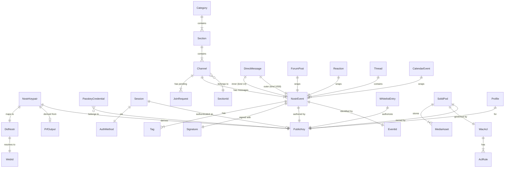
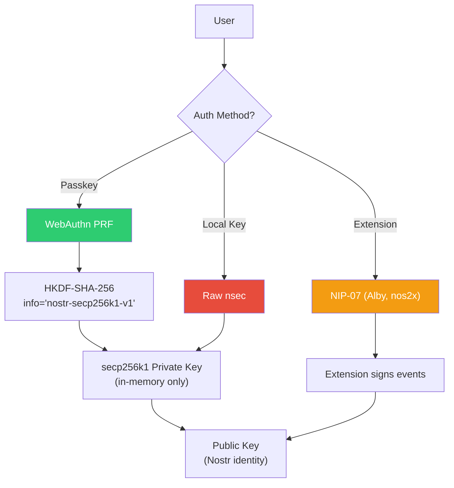
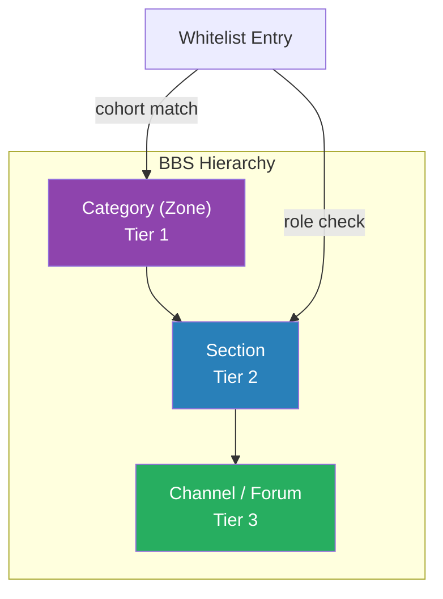

# Domain Model

**Last updated:** 2026-03-08 | [Back to DDD Index](README.md) | [Back to Documentation Index](../README.md)

This document defines the core domain entities for the DreamLab community forum Rust port. Each entity maps to a Rust struct in the `nostr-core` or `forum-client` crate, compiled to both native and `wasm32-unknown-unknown`.

## Entity Relationship Diagram



## Identity

Identity is anchored on secp256k1 keypairs. A user's Nostr public key is the primary identifier across the entire system.

```rust
use k256::schnorr::SigningKey;

/// A secp256k1 keypair used for Nostr event signing and NIP-44 encryption.
/// The private key is held in memory only (never persisted) for passkey users.
pub struct NostrKeypair {
    signing_key: SigningKey,
    public_key: PublicKey,
}

/// 32-byte compressed x-only public key, displayed as 64-char lowercase hex.
#[derive(Clone, Copy, PartialEq, Eq, Hash)]
pub struct PublicKey([u8; 32]);

/// Decentralized identifier: `did:nostr:{hex_pubkey}`.
/// Used for WAC ACL agent references and Solid pod ownership.
pub struct DidNostr(PublicKey);

/// Solid-compatible WebID URL: `https://pods.dreamlab-ai.com/{pubkey}/profile/card#me`.
pub struct WebId(String);

/// PRF-derived key material from a WebAuthn ceremony.
/// Input to HKDF-SHA-256 with info="nostr-secp256k1-v1" to produce a secp256k1 scalar.
pub struct PrfOutput([u8; 32]);
```

## Authentication

Three auth paths exist: passkey PRF (primary), NIP-07 extension, and local key. The passkey path derives the private key deterministically from a WebAuthn PRF ceremony, so the key is never stored.



```rust
/// A registered WebAuthn credential stored server-side in D1.
pub struct PasskeyCredential {
    pub pubkey: PublicKey,
    pub credential_id: String,
    pub public_key_der: Vec<u8>,
    pub counter: u32,
    /// Server-generated PRF salt (base64url). Same salt + same authenticator = same PRF output.
    pub prf_salt: String,
    pub created_at: u64,
}

/// NIP-98 HTTP authentication token (kind 27235).
/// Schnorr-signed event with `u` (URL), `method`, and optional `payload` (SHA-256 of body) tags.
pub struct Nip98Token {
    pub event: NostrEvent,
}

/// Client-side auth state, equivalent to the Svelte `AuthState` store.
pub struct Session {
    pub state: AuthFlowState,
    pub pubkey: Option<PublicKey>,
    pub private_key: Option<[u8; 32]>,
    pub nickname: Option<String>,
    pub avatar: Option<String>,
    pub account_status: AccountStatus,
    pub auth_method: AuthMethod,
}

pub enum AuthFlowState { Unauthenticated, Authenticating, Authenticated }
pub enum AccountStatus { Incomplete, Complete }
pub enum AuthMethod { Passkey, Nip07, LocalKey, None }
```

## Community

The forum is organized as a 3-tier BBS: Category (zone) > Section > Forum (NIP-28 channel). Access is governed by cohort membership and role level.



```rust
/// NIP-28/NIP-29 channel. Maps to a kind 40 create event + kind 39000 metadata.
pub struct Channel {
    pub id: String,
    pub name: String,
    pub description: String,
    pub picture: Option<String>,
    pub cohorts: Vec<String>,
    pub section: SectionId,
    pub visibility: ChannelVisibility,
    pub access_type: ChannelAccessType,
    pub is_encrypted: bool,
    pub member_count: u32,
    pub created_at: Timestamp,
}

pub enum ChannelVisibility { Public, Cohort, Invite }
pub enum ChannelAccessType { Open, Gated }

/// Section (Tier 2) -- a grouping of channels within a category.
pub struct Section {
    pub id: SectionId,
    pub name: String,
    pub description: String,
    pub icon: String,
    pub order: u32,
    pub access: AccessConfig,
    pub allow_forum_creation: bool,
}

/// Category (Tier 1 / Zone) -- top-level container with cohort-based isolation.
pub struct Category {
    pub id: CategoryId,
    pub name: String,
    pub description: String,
    pub icon: String,
    pub order: u32,
    pub sections: Vec<Section>,
    pub access: Option<CategoryAccessConfig>,
}

/// Whitelist entry from the relay, the source of truth for permissions.
pub struct WhitelistEntry {
    pub pubkey: PublicKey,
    pub cohorts: Vec<String>,
    pub added_at: u64,
    pub added_by: PublicKey,
    pub expires_at: Option<u64>,
    pub notes: Option<String>,
}
```

## Messaging

All messages are Nostr events. DMs use NIP-17/59 gift wrapping with NIP-44 encryption.

```rust
/// A signed Nostr event (NIP-01). Kind determines semantics.
pub struct NostrEvent {
    pub id: EventId,
    pub pubkey: PublicKey,
    pub created_at: Timestamp,
    pub kind: EventKind,
    pub tags: Vec<Tag>,
    pub content: String,
    pub sig: Signature,
}

/// NIP-17 gift-wrapped direct message.
pub struct DirectMessage {
    pub outer_event: NostrEvent,     // kind 1059 gift wrap
    pub inner_event: NostrEvent,     // kind 14 sealed message
    pub plaintext: String,           // decrypted content
    pub recipient: PublicKey,
    pub sender: PublicKey,
}

/// Kind 7 reaction to any event.
pub struct Reaction {
    pub event: NostrEvent,
    pub target_event_id: EventId,
    pub content: String,             // "+", "-", or emoji
}

/// A threaded conversation anchored to a root event.
pub struct Thread {
    pub root_event_id: EventId,
    pub replies: Vec<NostrEvent>,
    pub reaction_counts: HashMap<String, u32>,
}
```

## Content

```rust
/// A forum post within a channel (kind 1 or kind 9024 for threads).
pub struct ForumPost {
    pub event: NostrEvent,
    pub channel_id: String,
    pub is_pinned: bool,
    pub reply_count: u32,
}

/// Nostr profile metadata (kind 0).
pub struct Profile {
    pub pubkey: PublicKey,
    pub name: Option<String>,
    pub display_name: Option<String>,
    pub about: Option<String>,
    pub picture: Option<String>,
    pub nip05: Option<String>,
    pub banner: Option<String>,
}

/// Calendar event (NIP-52, kind 31922/31923).
pub struct CalendarEvent {
    pub event: NostrEvent,
    pub title: String,
    pub start: Timestamp,
    pub end: Option<Timestamp>,
    pub location: Option<String>,
}
```

## Storage

```rust
/// A per-user Solid pod backed by Cloudflare R2.
pub struct SolidPod {
    pub owner: PublicKey,
    pub pod_url: String,
    pub web_id: WebId,
    pub acl: WacAcl,
    pub storage_used: u64,
}

/// A media asset stored in a user's pod.
pub struct MediaAsset {
    pub r2_key: String,
    pub content_type: String,
    pub size: u64,
    pub etag: String,
}

/// WAC (Web Access Control) ACL document stored in KV.
pub struct WacAcl {
    pub owner_agent: DidNostr,
    pub rules: Vec<AclRule>,
}

pub struct AclRule {
    pub agent: Option<DidNostr>,
    pub agent_class: Option<String>,
    pub access_to: String,
    pub modes: Vec<AccessMode>,
}

pub enum AccessMode { Read, Write, Append, Control }
```
