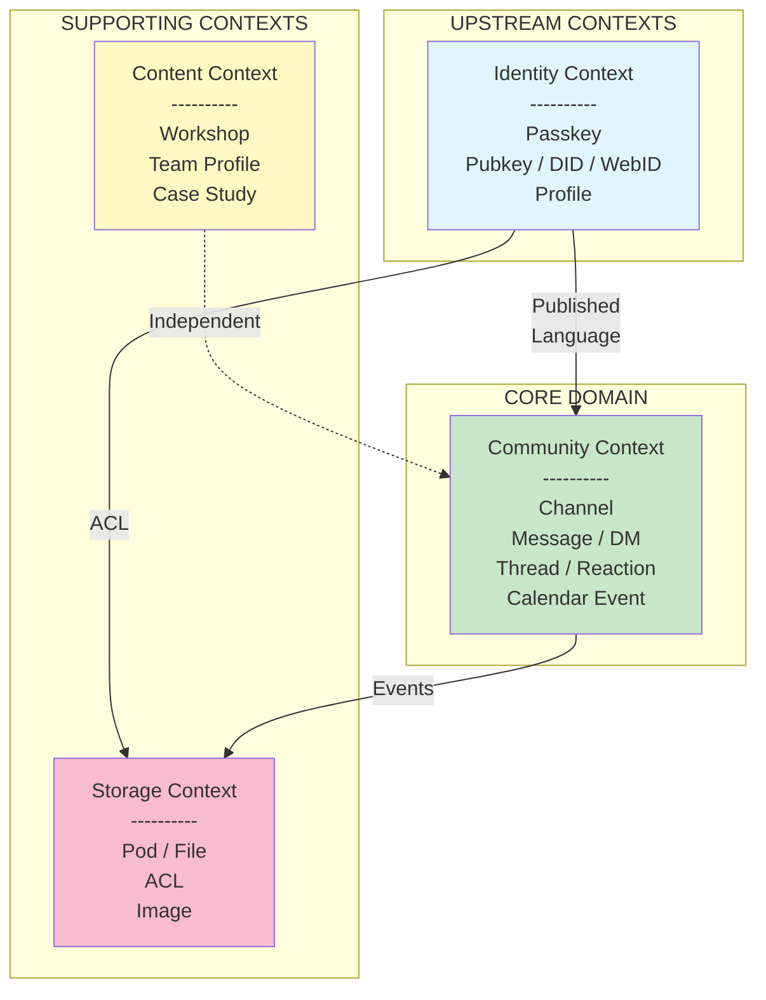

# Bounded Contexts

## Context Map



*Domain-driven design context map showing upstream identity, core community domain, and supporting contexts.*

## Context Definitions

### 1. Identity Context

**Purpose**: Manage cryptographic identity, authentication, and user profiles.

**Responsibilities**:
- WebAuthn PRF passkey registration and authentication
- HKDF key derivation (PRF output to secp256k1 private key)
- In-memory private key lifecycle (closure-held, zero-filled on page hide)
- NIP-98 HTTP auth token creation and verification
- Profile metadata (kind:0 events)
- DID and WebID identity resolution
- NIP-07 browser extension integration

**Language**:

| Term | Definition |
|------|------------|
| Passkey | WebAuthn credential with PRF extension support |
| Pubkey | 64-char hex secp256k1 public key (primary identity) |
| DID | `did:nostr:{pubkey}` -- W3C decentralised identifier |
| WebID | `{pod-url}/profile/card#me` -- Solid Linked Data profile |
| PRF | Pseudo-Random Function extension for deterministic key derivation |
| NIP-98 Token | Schnorr-signed kind:27235 event for HTTP authentication |

**Integrations**:
- **Outbound**: publishes pubkey and DID to Community and Storage contexts
- **Technology**: WebAuthn API, Web Crypto (HKDF), nostr-tools, @noble/hashes

```typescript
// Identity Context Public API
interface IdentityService {
  registerPasskey(displayName: string): Promise<PasskeyRegistrationResult>;
  authenticatePasskey(pubkey?: string): Promise<PasskeyAuthResult>;
  loginWithExtension(): Promise<{ publicKey: string }>;
  loginWithLocalKey(privkeyHex: string, rememberMe: boolean): Promise<{ publicKey: string }>;
  getPrivkey(): Uint8Array | null;
  createNip98Token(privkey: Uint8Array, url: string, method: string, body?: Uint8Array): Promise<string>;
  verifyNip98(authHeader: string, opts: VerifyOptions): Promise<VerifyResult | null>;
}
```

---

### 2. Community Context

**Purpose**: Handle all community interactions -- messaging, channels, events, and moderation.

**Responsibilities**:
- Channel (NIP-28) message posting and retrieval
- Thread management (replies)
- Direct messages (NIP-17, encrypted with NIP-44)
- Reactions (NIP-25)
- Calendar events (NIP-52) and RSVPs
- Zone/section/forum hierarchy navigation
- Cohort-based access control (whitelist membership)
- Admin approval workflows (kind:9024 registration, kind:9023 approval)

**Language**:

| Term | Definition |
|------|------------|
| Zone (Category) | Top-level context boundary (e.g., DreamLab) |
| Section | Topical grouping within a zone, access-controlled by cohort |
| Forum (Channel) | NIP-28 channel for discussions within a section |
| Message | Nostr event posted to a forum channel |
| Thread | Chain of reply messages |
| DM | Encrypted direct message (NIP-17 + NIP-44 + NIP-59 gift wrap) |
| Reaction | Emoji response to a message (NIP-25) |
| Cohort | Named group of members controlling section access |
| Calendar Event | Scheduled happening (NIP-52 kind:31922 or kind:31923) |

**Integrations**:
- **Inbound**: receives pubkey and auth tokens from Identity Context
- **Outbound**: sends message content to Storage Context (images, attachments)
- **Technology**: NDK, SvelteKit, NIP-01/17/25/28/42/44/52/59

```typescript
// Community Context Public API
interface CommunityService {
  postMessage(content: string, channelId: string): Promise<Message>;
  replyTo(content: string, parentId: string): Promise<Message>;
  sendDM(content: string, recipient: string): Promise<DirectMessage>;
  react(messageId: string, emoji: string): Promise<Reaction>;
  getChannels(sectionId: string): Promise<Channel[]>;
  createCalendarEvent(event: CalendarEventInput): Promise<CalendarEvent>;
  rsvp(eventId: string, status: RSVPStatus): Promise<void>;
}
```

---

### 3. Content Context

**Purpose**: Manage marketing site content -- workshops, team profiles, and case studies.

**Responsibilities**:
- Workshop content loading and rendering (Markdown from `public/data/workshops/`)
- Workshop list generation (`scripts/generate-workshop-list.mjs`)
- Team profile management (44 expert profiles in `public/data/team/`)
- Case study / portfolio content (`src/data/work/`)
- Residential training and masterclass page content

**Language**:

| Term | Definition |
|------|------------|
| Workshop | Multi-page training programme with Markdown content |
| Workshop Manifest | Auto-generated JSON listing pages within a workshop |
| Team Profile | Expert biography loaded from Markdown at runtime |
| Case Study | Portfolio project with description and outcomes |

**Integrations**:
- **Independent**: does not depend on Identity or Community contexts
- **Technology**: React, Vite, Markdown processing, workshop generation script

```typescript
// Content Context Public API
interface ContentService {
  getWorkshopList(): WorkshopSummary[];
  getWorkshopManifest(workshopId: string): Promise<WorkshopManifest>;
  getWorkshopPage(workshopId: string, pageSlug: string): Promise<string>;
  getTeamProfiles(): Promise<TeamProfile[]>;
  getCaseStudies(): Promise<CaseStudy[]>;
}
```

---

### 4. Storage Context

**Purpose**: Manage per-user pod storage, file uploads, and access control.

**Responsibilities**:
- Solid pod provisioning per pubkey (via JSS / pod-api)
- File storage and retrieval (R2 on Cloudflare, filesystem on Cloud Run)
- Web Access Control (WAC) document evaluation
- Image upload, resizing, and serving
- ACL management (owner-restricted by default)
- Link preview metadata extraction

**Language**:

| Term | Definition |
|------|------------|
| Pod | Per-user Solid storage container identified by pubkey |
| ACL | Access Control List document (WAC / JSON-LD) |
| WebID | Solid profile URI used for ACL agent matching |
| Resource | File or directory within a pod |
| Container | Directory within a pod |

**Integrations**:
- **Inbound**: receives pubkey and auth tokens from Identity Context; receives file uploads from Community Context
- **Technology**: Cloudflare R2 + KV (target), JSS/CSS (current), NIP-98 gating

```typescript
// Storage Context Public API
interface StorageService {
  provisionPod(pubkey: string): Promise<{ podUrl: string; webId: string }>;
  putResource(podUrl: string, path: string, body: Blob, contentType: string): Promise<void>;
  getResource(podUrl: string, path: string): Promise<Response>;
  evaluateACL(aclDoc: ACLDocument, agent: string, mode: AccessMode): boolean;
  uploadImage(file: File, privkey: Uint8Array): Promise<string>;
}
```

## Integration Patterns

### Anticorruption Layer (ACL)

Used between Identity and Community contexts to translate NIP-98 auth tokens into community permissions.

```typescript
// ACL: Translate NIP-98 verification result to community permissions
class CommunityPermissionAdapter {
  constructor(private identityService: IdentityService) {}

  async canPost(authHeader: string, channelId: string): Promise<boolean> {
    const result = await this.identityService.verifyNip98(authHeader, { url, method: 'POST' });
    if (!result) return false;
    return this.checkWhitelist(result.pubkey, channelId);
  }
}
```

### Published Language

Identity Context publishes standard types consumed by all other contexts.

```typescript
// Published Language: Standard identity types
export type Pubkey = string;          // 64-char hex
export type DidNostr = string;        // did:nostr:{pubkey}
export type WebId = string;           // {pod-url}/profile/card#me
export type Nip98Token = string;      // base64-encoded signed event
```

### Context Independence

The Content Context is deliberately independent of Identity and Community. Workshop content, team profiles, and case studies are publicly accessible and do not require authentication. This separation allows the marketing site to function without backend services.
