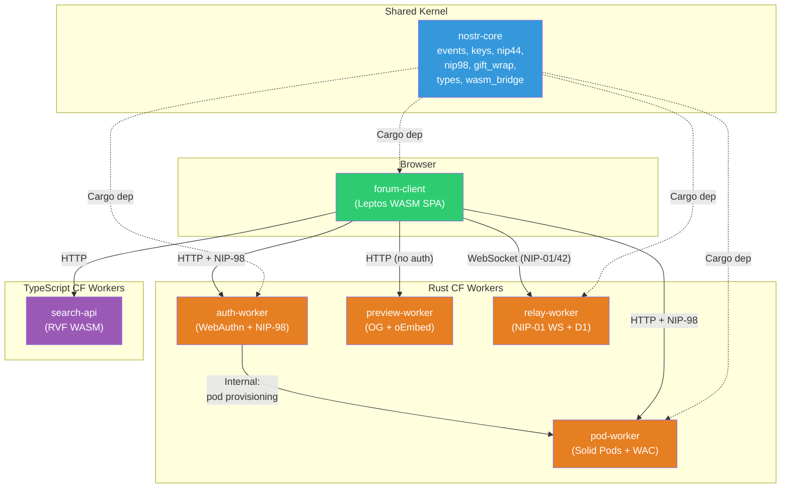
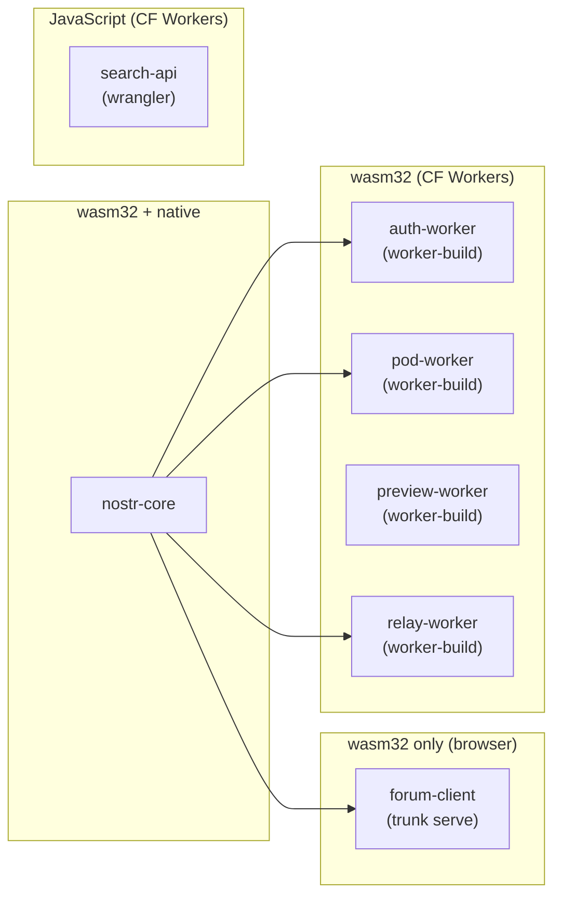
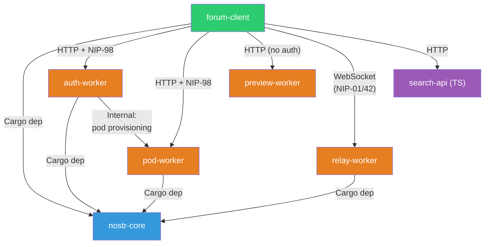

# Bounded Contexts

**Last updated:** 2026-03-08 | [Back to DDD Index](README.md) | [Back to Documentation Index](../README.md)

This document maps each bounded context to a Rust crate (or existing TypeScript Worker) and defines the responsibilities, public interfaces, and dependencies between contexts.

## Context Map


```mermaid
graph TB
    subgraph "Shared Kernel"
        NC["nostr-core<br/>events, keys, nip44,<br/>nip98, gift_wrap,<br/>types, wasm_bridge"]
    end

    subgraph "Browser"
        FC["forum-client<br/>(Leptos WASM SPA)"]
    end

    subgraph "Rust CF Workers"
        AW["auth-worker<br/>(WebAuthn + NIP-98)"]
        PW["pod-worker<br/>(Solid Pods + WAC)"]
        PV["preview-worker<br/>(OG + oEmbed)"]
        RW["relay-worker<br/>(NIP-01 WS + D1)"]
    end

    subgraph "TypeScript CF Workers"
        SA["search-api<br/>(RVF WASM)"]
    end

    NC -.->|Cargo dep| FC
    NC -.->|Cargo dep| AW
    NC -.->|Cargo dep| PW
    NC -.->|Cargo dep| RW

    FC -->|"HTTP + NIP-98"| AW
    FC -->|"HTTP + NIP-98"| PW
    FC -->|"HTTP (no auth)"| PV
    FC -->|"WebSocket (NIP-01/42)"| RW
    FC -->|"HTTP"| SA
    AW -->|"Internal:<br/>pod provisioning"| PW

    style NC fill:#3498db,color:#fff
    style FC fill:#2ecc71,color:#fff
    style AW fill:#e67e22,color:#fff
    style PW fill:#e67e22,color:#fff
    style PV fill:#e67e22,color:#fff
    style RW fill:#e67e22,color:#fff
    style SA fill:#9b59b6,color:#fff
```

## Crate Boundary Diagram


```mermaid
graph LR
    subgraph "wasm32 + native"
        NC["nostr-core"]
    end

    subgraph "wasm32 only (browser)"
        FC["forum-client<br/>(trunk serve)"]
    end

    subgraph "wasm32 (CF Workers)"
        AW["auth-worker<br/>(worker-build)"]
        PW["pod-worker<br/>(worker-build)"]
        PV["preview-worker<br/>(worker-build)"]
        RW["relay-worker<br/>(worker-build)"]
    end

    subgraph "JavaScript (CF Workers)"
        SA["search-api<br/>(wrangler)"]
    end

    NC --> FC
    NC --> AW
    NC --> PW
    NC --> RW
```

## 1. Nostr Core Context -- `nostr-core` crate

**Responsibility**: Protocol primitives shared between client and Workers. Zero browser or Worker runtime dependencies.

**Compilation targets**: `wasm32-unknown-unknown` + native (for tests/CI).

```rust
// Public modules
pub mod event;       // NostrEvent, EventId, Tag, canonical JSON, signing, verification
pub mod keys;        // Keypair, PublicKey, SecretKey, derive_from_prf(), HKDF
pub mod nip44;       // ChaCha20-Poly1305 encrypt/decrypt, ECDH key derivation
pub mod nip98;       // Token creation and verification (kind 27235)
pub mod gift_wrap;   // NIP-59 gift_wrap(), unwrap_gift(), GiftWrapError
pub mod types;       // EventId, Timestamp, Tag value objects
pub mod wasm_bridge; // #[cfg(wasm32)] wasm-bindgen entry points
```

**Key dependencies**: `k256`, `chacha20poly1305`, `hkdf`, `sha2`, `serde`, `serde_json`, `getrandom` (with `js` feature).

**Anti-corruption layer**: Wraps `nostr-sdk` types where the 0.44.x alpha API is unstable, exposing stable DreamLab-specific types to downstream crates. Functions like `verify_event_strict()` and `sign_event_deterministic()` enforce DreamLab invariants (event ID recomputation, strict timestamp validation) that raw `nostr-sdk` does not guarantee.

## 2. Forum Client Context -- `forum-client` crate

**Responsibility**: The browser-side Leptos CSR application. Owns UI components, reactive stores, routing, relay connections, and IndexedDB persistence.

**Compilation target**: `wasm32-unknown-unknown` only (via `trunk`).

**Trunk.toml location**: `community-forum-rs/crates/forum-client/Trunk.toml` (moved from workspace root per trunk-rs#909 workaround).

```rust
// Modules
pub mod app;        // Root Leptos component + router
pub mod pages;      // Route page components
pub mod components; // UI components (Tailwind + DaisyUI)
pub mod auth;       // Passkey ceremony (web-sys), NIP-98, session management
pub mod admin;      // Admin panel components and stores
pub mod dm;         // Direct message UI and gift wrap integration
pub mod relay;      // Relay pool management, subscription lifecycle
pub mod utils;      // Helpers, formatters, config
```

**Key dependencies**: `nostr-core`, `leptos 0.7`, `leptos_router`, `web-sys`, `gloo`.

**Upstream communication**: Connects to the relay-worker via WebSocket. Calls auth-worker, pod-worker, preview-worker, and search-api via HTTP with NIP-98 auth where required.

## 3. Identity and Auth Context -- `auth-worker` crate

**Responsibility**: WebAuthn registration/authentication with PRF extension, NIP-98 token verification, Solid pod provisioning, credential storage.

**Runtime**: Cloudflare Worker (compiled via `worker-build`).

```rust
// Modules
pub mod auth;       // NIP-98 verification, route handlers
pub mod webauthn;   // passkey-rs ceremony handling, PRF salt management
pub mod pod;        // Pod provisioning: R2 profile card + KV ACL + KV metadata
```

**Storage**: D1 (challenges, webauthn_credentials), KV (SESSIONS, POD_META), R2 (PODS -- profile card seed).

**Key dependencies**: `nostr-core`, `worker`, `passkey`, `serde`.

**Invariants**:
- PRF salt is generated server-side and stored with the credential.
- The Nostr pubkey is derived client-side from the PRF output; the server never sees the private key.
- Login verification requires both a valid WebAuthn assertion AND a valid NIP-98 token proving private key control.

## 4. Storage Context -- `pod-worker` crate

**Responsibility**: Per-user Solid pod CRUD backed by R2, with WAC (Web Access Control) ACL enforcement. Media upload/download, content-type handling.

**Runtime**: Cloudflare Worker.

```rust
// Modules
pub mod acl;     // WAC ACL evaluation: agent matching, mode checking, path scoping
pub mod auth;    // NIP-98 verification for authenticated requests (reuses nostr-core)
```

**Storage**: R2 (PODS), KV (POD_META for ACL documents and metadata).

**Access rules**:
- Owner (`did:nostr:{pubkey}`) has Read + Write + Control on `./`.
- Public agents (`foaf:Agent`) have Read on `./profile/` and `./media/public/`.
- All write operations require NIP-98 auth with matching pubkey.

## 5. Preview Context -- `preview-worker` crate

**Responsibility**: Fetch OpenGraph metadata and Twitter oEmbed data for link previews, with SSRF protection and CF Cache API caching.

**Runtime**: Cloudflare Worker.

**Storage**: CF Cache API only (no D1/KV/R2).

**Key dependencies**: `worker`, `scraper`, `serde`.

## 6. Relay Context -- `relay-worker` crate

**Responsibility**: WebSocket-based Nostr relay with NIP-01 event protocol, D1-backed event storage, whitelist/cohort management, NIP-11 relay information, and NIP-98 admin authentication.

**Runtime**: Cloudflare Worker with Durable Objects.

```rust
// Modules
pub mod relay_do;   // Durable Object: WebSocket relay, NIP-01 message handling
pub mod nip11;      // NIP-11 relay information document
pub mod whitelist;  // Whitelist management HTTP handlers
pub mod auth;       // NIP-98 admin verification wrapper
```

**Storage**: D1 (events, whitelist), Durable Objects (WebSocket state).

**Key dependencies**: `nostr-core`, `worker`, `serde`, `serde_json`.

**Interfaces**:
- WebSocket: NIP-01 REQ/CLOSE/EVENT, NIP-42 AUTH
- HTTP: `/health`, `/api/check-whitelist`, `/api/whitelist/list`, `/api/whitelist/add`, `/api/whitelist/update-cohorts`
- NIP-11: Relay information document at `/` with `Accept: application/nostr+json`

**Why it was ported to Rust**: The `worker` crate now supports Durable Objects sufficiently for the DreamLab relay's needs. Porting to Rust aligns the relay with the rest of the Rust workspace, enables shared `nostr-core` types for NIP-98 verification, and eliminates the TypeScript/Rust boundary for whitelist management.

## 7. Search Context -- stays TypeScript

**Location**: `workers/search-api/` (unchanged).

**Why not ported**: The RVF (RuVector Format) core is already Rust compiled to WASM. The TypeScript wrapper is 430 lines of R2/KV orchestration with 0.47ms p50 latency. Porting the thin wrapper gains nothing; eliminating WASM-in-WASM would require restructuring `rvf_wasm` as a library crate -- disproportionate effort.

**Interfaces consumed by other contexts**:
- HTTP: `/search?q=`, `/embed` (vector embedding endpoint)

## Context Dependencies


```mermaid
graph TD
    FC["forum-client"] -->|"Cargo dep"| NC["nostr-core"]
    AW["auth-worker"] -->|"Cargo dep"| NC
    PW["pod-worker"] -->|"Cargo dep"| NC
    RW["relay-worker"] -->|"Cargo dep"| NC

    FC -->|"HTTP + NIP-98"| AW
    FC -->|"HTTP + NIP-98"| PW
    FC -->|"HTTP (no auth)"| PV["preview-worker"]
    FC -->|"WebSocket<br/>(NIP-01/42)"| RW
    FC -->|"HTTP"| SA["search-api (TS)"]
    AW -->|"Internal:<br/>pod provisioning"| PW

    style NC fill:#3498db,color:#fff
    style FC fill:#2ecc71,color:#fff
    style AW fill:#e67e22,color:#fff
    style PW fill:#e67e22,color:#fff
    style PV fill:#e67e22,color:#fff
    style RW fill:#e67e22,color:#fff
    style SA fill:#9b59b6,color:#fff
```

| Consumer | Provider | Mechanism |
|----------|----------|-----------|
| forum-client | nostr-core | Cargo dependency (same WASM binary) |
| auth-worker | nostr-core | Cargo dependency (compiled into Worker) |
| pod-worker | nostr-core | Cargo dependency (NIP-98 verification) |
| relay-worker | nostr-core | Cargo dependency (NIP-98 verification, event types) |
| forum-client | auth-worker | HTTP + NIP-98 |
| forum-client | pod-worker | HTTP + NIP-98 |
| forum-client | preview-worker | HTTP (no auth) |
| forum-client | relay-worker | WebSocket (NIP-01/42) |
| forum-client | search-api (TS) | HTTP |
| auth-worker | pod-worker | Internal (pod provisioning at registration) |
