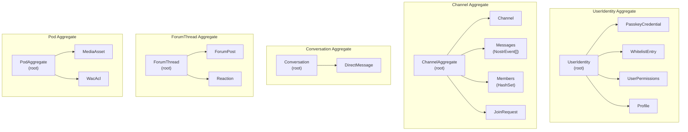
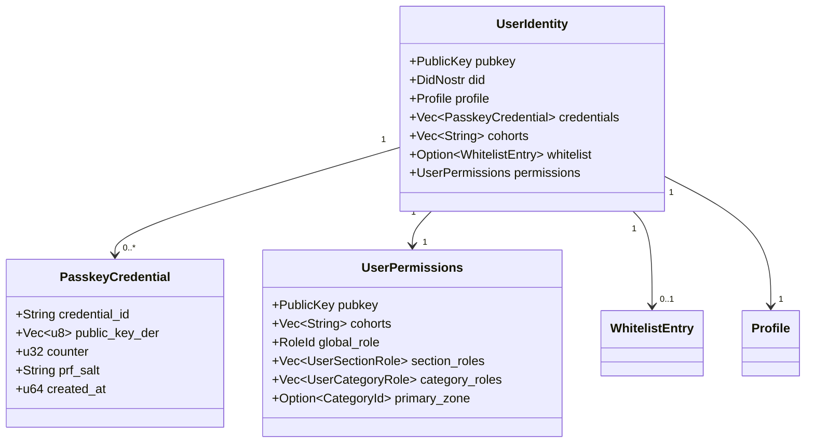
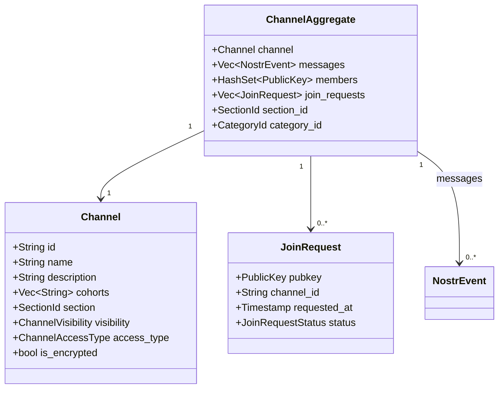
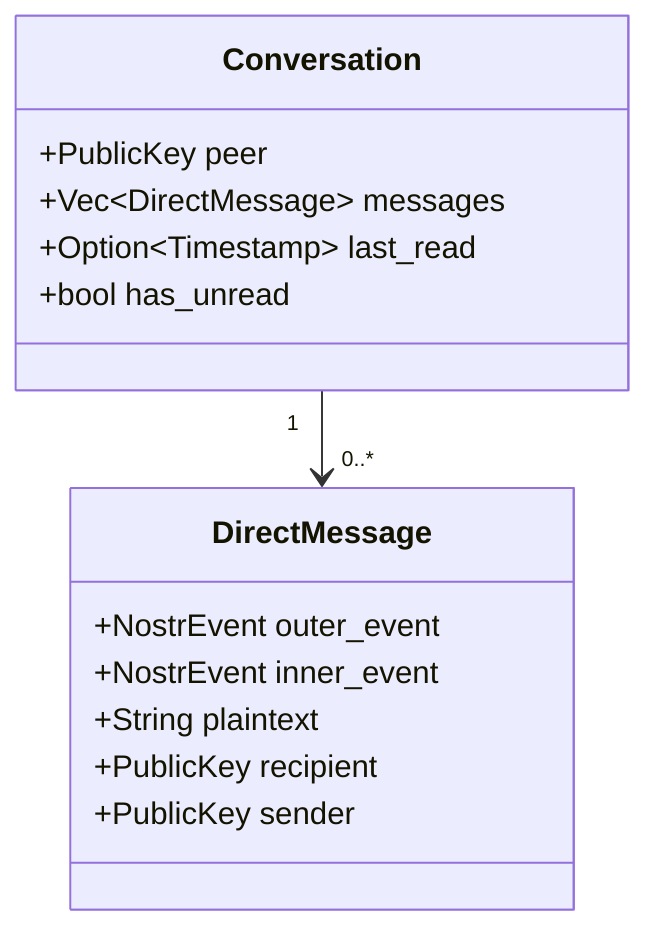
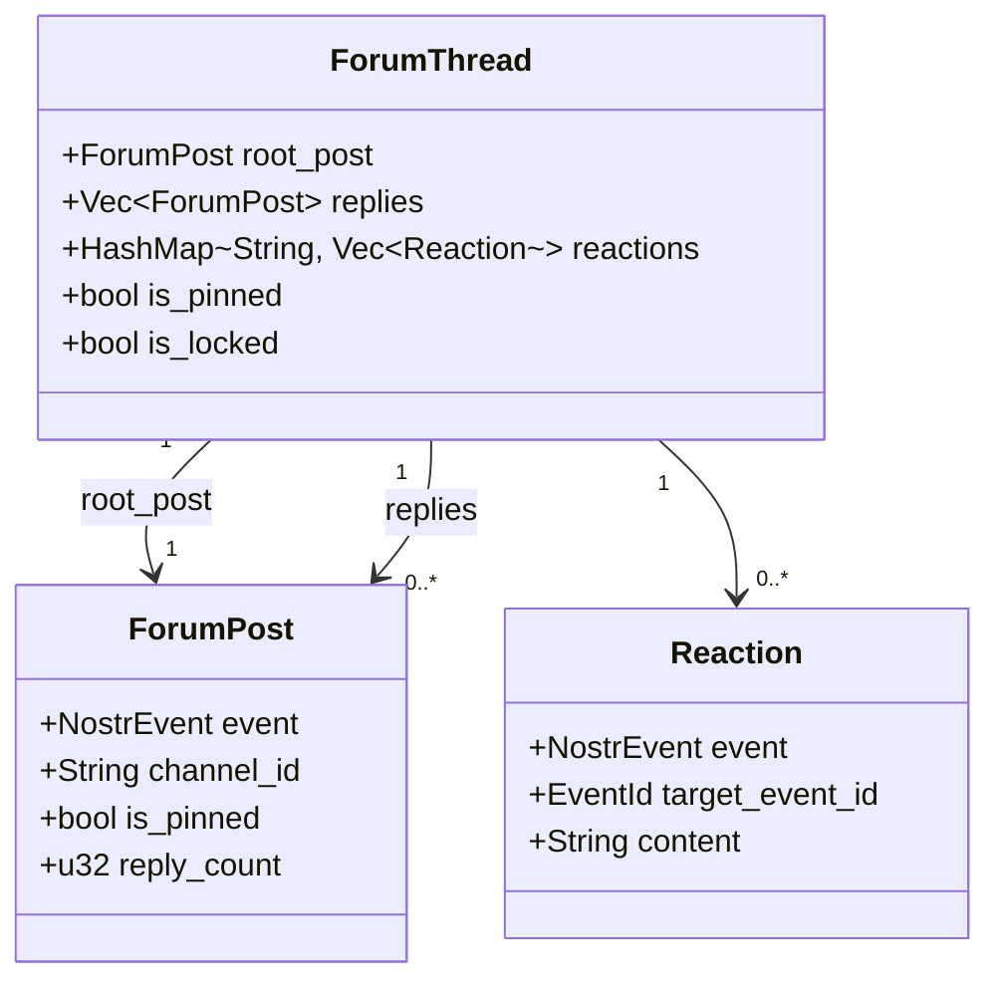
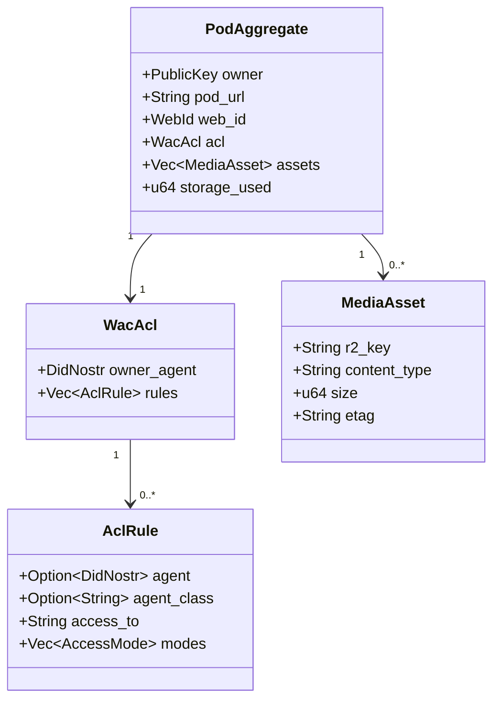
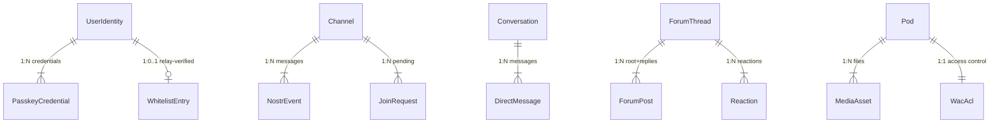

# Aggregates

**Last updated:** 2026-03-08 | [Back to DDD Index](README.md) | [Back to Documentation Index](../README.md)

Each aggregate root enforces consistency boundaries. External references use only the aggregate root's identity (a value object). Modifications go through the aggregate root's methods.

## Aggregate Overview



## 1. UserIdentity Aggregate

**Root**: `UserIdentity`
**Crate**: `nostr-core` (types), `forum-client` (store), `auth-worker` (persistence)

The UserIdentity aggregate owns everything about a user's identity, credentials, and access rights. It is the single source of truth for "who is this user and what can they do."



```rust
/// Aggregate root: a user's complete identity and access state.
pub struct UserIdentity {
    /// Primary identifier -- the Nostr public key.
    pub pubkey: PublicKey,
    /// DID representation for Solid/WAC interop.
    pub did: DidNostr,
    /// Nostr profile metadata (kind 0).
    pub profile: Profile,
    /// Registered WebAuthn credentials (may have multiple per user).
    pub credentials: Vec<PasskeyCredential>,
    /// Cohort memberships from the relay whitelist.
    pub cohorts: Vec<String>,
    /// Whitelist status (relay-verified, cached client-side for 5 minutes).
    pub whitelist: Option<WhitelistEntry>,
    /// Effective permissions computed from cohorts + roles.
    pub permissions: UserPermissions,
}

/// Computed permission state. Derived from whitelist + config, not stored directly.
pub struct UserPermissions {
    pub pubkey: PublicKey,
    pub cohorts: Vec<String>,
    pub global_role: RoleId,
    pub section_roles: Vec<UserSectionRole>,
    pub category_roles: Vec<UserCategoryRole>,
    pub primary_zone: Option<CategoryId>,
}
```

**Invariants**:
- A user has exactly one pubkey for their lifetime.
- Cohort membership is authoritative only from the relay whitelist API; the client caches it but must re-verify within 5 minutes.
- Credentials are append-only (a user may register additional passkeys but cannot delete old ones without admin intervention).
- `permissions` is always recomputed from `cohorts` + BBS config; it is never stored as a persistent field.

**Commands**: RegisterPasskey, AuthenticatePasskey, LoginWithExtension, LoginWithLocalKey, UpdateProfile, Logout.

## 2. Channel Aggregate

**Root**: `Channel`
**Crate**: `nostr-core` (types), `forum-client` (store)

A Channel represents a NIP-28/NIP-29 group with its messages, participants, and structural position in the BBS hierarchy.



```rust
/// Aggregate root: a forum channel with its messages and membership.
pub struct ChannelAggregate {
    /// The channel metadata (kind 40 create + kind 39000 NIP-29 metadata).
    pub channel: Channel,
    /// Ordered messages within this channel (kind 42 / kind 1).
    pub messages: Vec<NostrEvent>,
    /// Set of member pubkeys (from kind 39002 member list).
    pub members: HashSet<PublicKey>,
    /// Pending join requests (kind 9021).
    pub join_requests: Vec<JoinRequest>,
    /// Parent section in the BBS hierarchy.
    pub section_id: SectionId,
    /// Parent category (zone).
    pub category_id: CategoryId,
}

pub struct JoinRequest {
    pub pubkey: PublicKey,
    pub channel_id: String,
    pub requested_at: Timestamp,
    pub status: JoinRequestStatus,
}

pub enum JoinRequestStatus { Pending, Approved, Rejected }
```

**Invariants**:
- A channel belongs to exactly one section and one category.
- Messages are ordered by `created_at` timestamp.
- A user can only post to a channel if their cohorts grant access to the channel's section (enforced by the relay, checked client-side for UX).
- Gated channels require membership; open channels allow any whitelisted user.

**Commands**: CreateChannel, PostMessage, EditMessage, DeleteMessage, RequestJoin, ApproveJoin, RejectJoin, PinMessage.

## 3. Conversation Aggregate

**Root**: `Conversation`
**Crate**: `forum-client` (store), `nostr-core` (NIP-44/NIP-59 gift wrap)

A Conversation is a private DM thread between two users, using NIP-17 gift wrapping and NIP-44 encryption.



```rust
/// Aggregate root: a private conversation between two parties.
pub struct Conversation {
    /// The other participant's pubkey (self is implicit from auth state).
    pub peer: PublicKey,
    /// Gift-wrapped messages in chronological order.
    pub messages: Vec<DirectMessage>,
    /// Timestamp of the last read message (for unread indicators).
    pub last_read: Option<Timestamp>,
    /// Whether any unread messages exist.
    pub has_unread: bool,
}
```

**Invariants**:
- All message content is NIP-44 encrypted; plaintext never leaves the `forum-client` WASM boundary.
- Gift wrapping (kind 1059) hides sender metadata from relays; the relay sees only the outer wrapper addressed to the recipient.
- Decryption requires the private key in memory; NIP-07 users cannot decrypt DMs (known blind spot).

**Commands**: SendDirectMessage, DecryptMessage, MarkAsRead.

## 4. ForumThread Aggregate

**Root**: `ForumThread`
**Crate**: `forum-client` (store)

A ForumThread is a top-level post with its reply chain and reactions, displayed in the forum view.



```rust
/// Aggregate root: a forum thread with replies and reactions.
pub struct ForumThread {
    /// The root post (kind 1 or kind 9024).
    pub root_post: ForumPost,
    /// Replies sorted by created_at (kind 1 with `e` tag referencing root).
    pub replies: Vec<ForumPost>,
    /// Aggregated reactions keyed by content ("+", emoji, etc.).
    pub reactions: HashMap<String, Vec<Reaction>>,
    /// Whether the thread is pinned in its channel.
    pub is_pinned: bool,
    /// Whether the thread is locked (no new replies).
    pub is_locked: bool,
}
```

**Invariants**:
- A thread has exactly one root post.
- Replies reference the root via an `e` tag (NIP-10 threading).
- Reactions reference a specific event (root or reply) via an `e` tag.
- Only moderators or the thread author can pin/lock.

**Commands**: CreateThread, Reply, React, PinThread, LockThread.

## 5. Pod Aggregate

**Root**: `Pod`
**Crate**: `pod-worker`

A Pod is a user's personal storage space in R2, governed by WAC ACL rules.



```rust
/// Aggregate root: a user's Solid pod with its assets and access rules.
pub struct PodAggregate {
    /// Pod owner's pubkey.
    pub owner: PublicKey,
    /// Base URL: https://pods.dreamlab-ai.com/{pubkey}/
    pub pod_url: String,
    /// WebID: {pod_url}profile/card#me
    pub web_id: WebId,
    /// WAC ACL document (stored in KV).
    pub acl: WacAcl,
    /// Media assets stored in this pod.
    pub assets: Vec<MediaAsset>,
    /// Storage usage metadata.
    pub storage_used: u64,
}
```

**Invariants**:
- Every pod is created at registration time with a default ACL granting owner full access and public read on `/profile/` and `/media/public/`.
- Write operations require NIP-98 auth where the token's pubkey matches the pod owner (or the ACL grants write to the requester's DID).
- Maximum upload size is 50MB per request.
- The ACL is the sole authority for access decisions; the pod-worker never hardcodes access rules beyond the default provisioning.

**Commands**: UploadMedia, DeleteMedia, GetMedia, UpdateAcl.

## Aggregate Relationships


