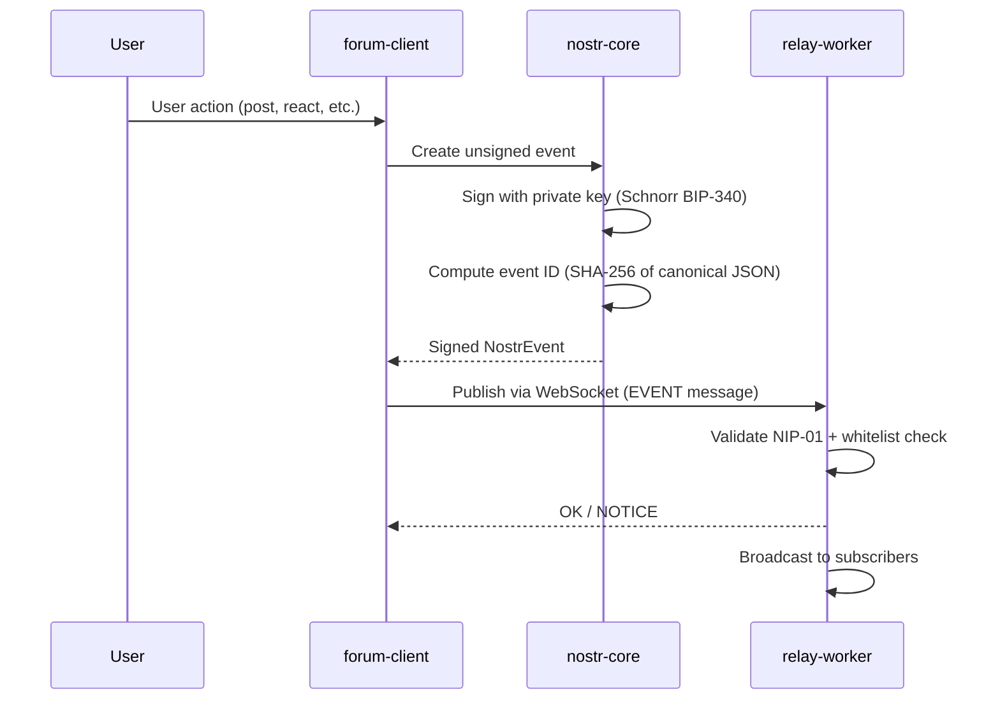
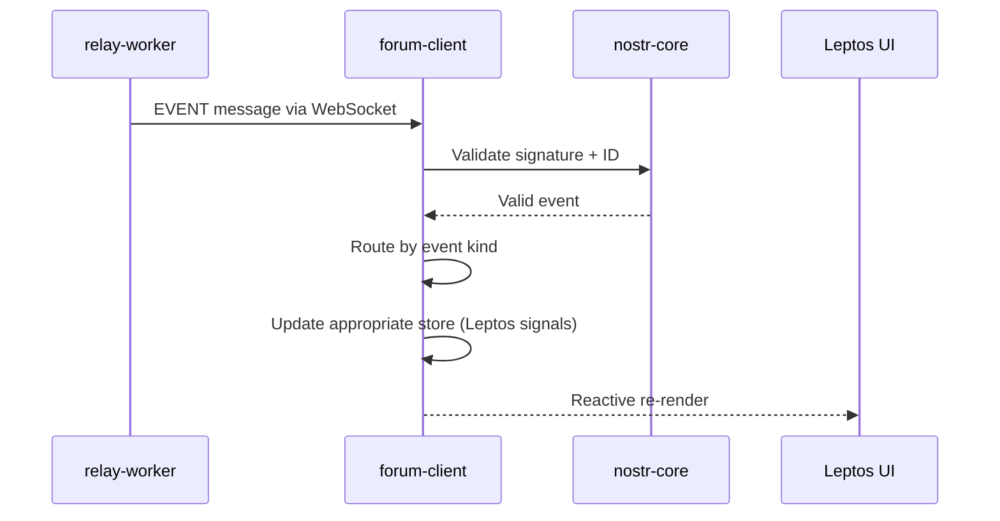
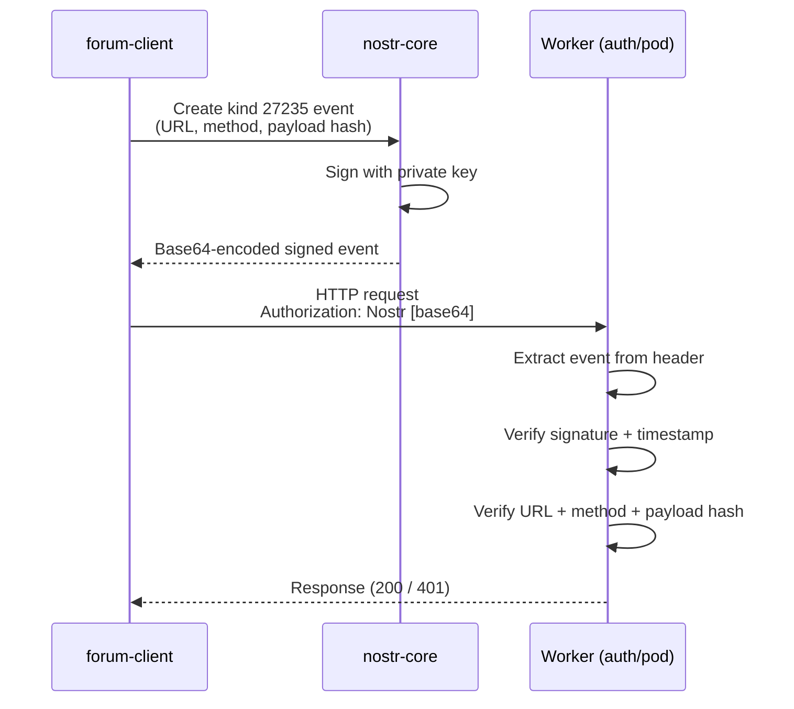
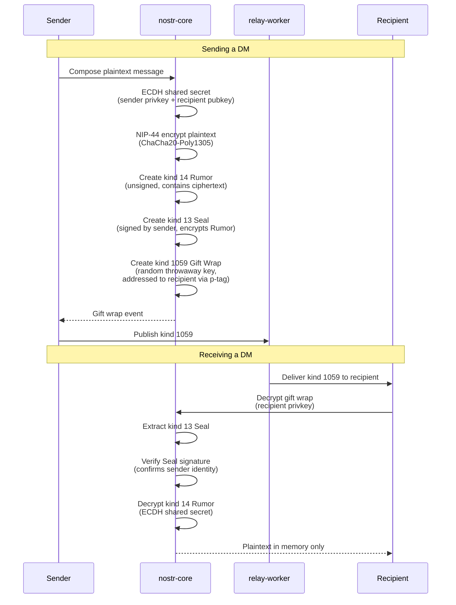
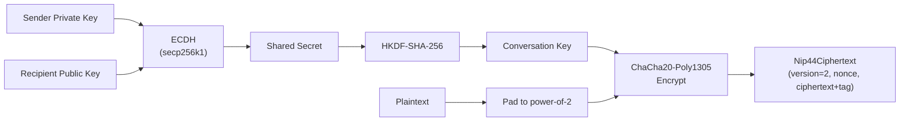

# Domain Events

**Last updated:** 2026-03-08 | [Back to DDD Index](README.md) | [Back to Documentation Index](../README.md)

This document distinguishes between **Nostr protocol events** (signed data structures transmitted via relays) and **application-level domain events** (state transitions within the DreamLab forum).

## Nostr Protocol Events (NIP-01)

Every Nostr event has a `kind` that determines its semantics. The DreamLab forum uses the following kinds.

### Event Kind Registry

| Kind | Name | NIP | Description |
|------|------|-----|-------------|
| 0 | ProfileMetadata | NIP-01 | User profile metadata |
| 1 | TextNote | NIP-01 | Short text note / forum post |
| 7 | Reaction | NIP-25 | Reaction to another event (`+`, `-`, emoji) |
| 13 | Seal | NIP-17 | Encrypted direct message seal |
| 14 | DirectMessage | NIP-17 | Encrypted direct message content |
| 1059 | GiftWrap | NIP-59 | Gift wrap envelope, hides sender metadata |
| 9021 | JoinRequest | Custom | Join request for a gated channel |
| 9024 | Thread | Custom | Thread / long-form post |
| 40 | ChannelCreation | NIP-28 | Channel creation |
| 41 | ChannelMetadata | NIP-28 | Channel metadata update |
| 42 | ChannelMessage | NIP-28 | Channel message |
| 43 | ChannelHideMessage | NIP-28 | Channel hide message |
| 44 | ChannelMuteUser | NIP-28 | Channel mute user |
| 10002 | RelayList | NIP-65 | Relay list metadata |
| 27235 | HttpAuth | NIP-98 | HTTP authentication token |
| 31922 | CalendarEvent | NIP-52 | Time-based calendar event |
| 31923 | CalendarDateEvent | NIP-52 | Date-based calendar event |
| 39000 | GroupMetadata | NIP-29 | Group metadata |
| 39002 | GroupMembers | NIP-29 | Group member list |

```rust
/// All Nostr event kinds used by the DreamLab forum.
#[derive(Debug, Clone, Copy, PartialEq, Eq, Hash)]
#[repr(u32)]
pub enum EventKind {
    ProfileMetadata       = 0,
    TextNote              = 1,
    Reaction              = 7,
    Seal                  = 13,
    DirectMessage         = 14,
    GiftWrap              = 1059,
    JoinRequest           = 9021,
    Thread                = 9024,
    ChannelCreation       = 40,
    ChannelMetadata       = 41,
    ChannelMessage        = 42,
    ChannelHideMessage    = 43,
    ChannelMuteUser       = 44,
    RelayList             = 10002,
    HttpAuth              = 27235,
    CalendarEvent         = 31922,
    CalendarDateEvent     = 31923,
    GroupMetadata         = 39000,
    GroupMembers          = 39002,
}
```

### Event Structure

Every Nostr event follows the NIP-01 canonical form. The `id` field is the SHA-256 hash of the serialized array `[0, pubkey, created_at, kind, tags, content]`.

```rust
/// Wire format of a Nostr event (NIP-01 canonical).
#[derive(Serialize, Deserialize)]
pub struct NostrEventWire {
    pub id: String,          // 64-char hex SHA-256
    pub pubkey: String,      // 64-char hex
    pub created_at: u64,     // Unix seconds
    pub kind: u32,
    pub tags: Vec<Vec<String>>,
    pub content: String,
    pub sig: String,         // 128-char hex Schnorr BIP-340
}
```

## Application-Level Domain Events

These are state transitions within the DreamLab application, triggered by receiving or sending Nostr events. They drive reactive updates in the Leptos signal graph.

### Identity Domain Events

| Event | Trigger | Effect |
|-------|---------|--------|
| `UserRegistered` | Passkey registration + server verify | Creates UserIdentity, provisions Pod |
| `UserAuthenticated` | Passkey login or NIP-07 connect | Populates Session, starts relay connection |
| `UserLoggedOut` | Explicit logout or page discard | Zeros private key, clears stores |
| `ProfileUpdated` | Kind 0 event received/published | Updates Profile in UserIdentity |
| `WhitelistVerified` | Relay API response | Updates cohorts and permissions |

### Channel Domain Events

| Event | Trigger | Effect |
|-------|---------|--------|
| `ChannelCreated` | Kind 40 event | Adds channel to store |
| `ChannelMetadataUpdated` | Kind 41 or 39000 event | Updates channel name/description |
| `MessageReceived` | Kind 42 event from relay | Appends to channel message list |
| `MessageDeleted` | Kind 5 deletion event | Removes from channel message list |
| `JoinRequested` | Kind 9021 event | Adds pending request |
| `JoinApproved` | Kind 39002 member list update | Grants membership |
| `ReactionAdded` | Kind 7 event | Increments reaction count |

### DM Domain Events

| Event | Trigger | Effect |
|-------|---------|--------|
| `DirectMessageReceived` | Kind 1059 gift wrap | Decrypt, add to Conversation |
| `DirectMessageSent` | User sends DM | Encrypt, gift-wrap, publish |
| `ConversationRead` | User views conversation | Updates last_read timestamp |

### Storage Domain Events

| Event | Trigger | Effect |
|-------|---------|--------|
| `MediaUploaded` | PUT to pod-worker | Adds MediaAsset to Pod |
| `MediaDeleted` | DELETE to pod-worker | Removes MediaAsset from Pod |
| `AclUpdated` | Admin modifies ACL | Updates WacAcl rules |

## Event Flow Diagrams

### Publishing (Outbound)



### Receiving (Inbound)



### NIP-98 Auth Flow (HTTP)



### NIP-59 Gift Wrap Flow (DMs)



### NIP-44 Encryption Detail


