# Value Objects

**Last updated:** 2026-03-08 | [Back to DDD Index](README.md) | [Back to Documentation Index](../README.md)

Value objects are immutable, compared by value (not identity), and have no lifecycle. They are the building blocks of entities and aggregates.

## Value Object Hierarchy

```mermaid
classDiagram
    class EventId {
        -[u8; 32] bytes
        +from_canonical() EventId
        +as_hex() String
    }

    class PublicKey {
        -[u8; 32] bytes
        +from_hex(str) Result~PublicKey~
        +as_hex() String
        +as_bytes() [u8; 32]
    }

    class Signature {
        -[u8; 64] bytes
        +from_hex(str) Result~Signature~
        +as_hex() String
    }

    class Timestamp {
        +u64 secs
        +now() Timestamp
        +as_secs() u64
    }

    class Tag {
        +Vec~String~ parts
        +name() str
        +value() Option~str~
        +event_ref(EventId) Tag
        +pubkey_ref(PublicKey) Tag
        +url(str) Tag
        +method(str) Tag
    }

    class RoleId {
        <<enumeration>>
        Guest
        Member
        Moderator
        SectionAdmin
        Admin
        +level() u8
        +is_at_least(RoleId) bool
    }

    class ChannelVisibility {
        <<enumeration>>
        Public
        Cohort
        Invite
    }

    class ChannelAccessType {
        <<enumeration>>
        Open
        Gated
    }

    class CalendarAccessLevel {
        <<enumeration>>
        Full
        Availability
        Cohort
        None
    }

    class Nip44Ciphertext {
        +u8 version
        +[u8; 24] nonce
        +Vec~u8~ ciphertext
    }

    class GiftWrap {
        +NostrEventWire outer_event
        +PublicKey recipient
    }

    class RelayUrl {
        -String url
        +new(str) Result~RelayUrl~
        +as_str() str
        +to_http() String
    }

    class SectionId {
        +String id
    }

    class CategoryId {
        +String id
    }

    class ForumId {
        +String id
    }
```



## Core Nostr Value Objects

```rust
use serde::{Serialize, Deserialize};
use std::fmt;

/// SHA-256 hash of the canonical JSON serialization of a Nostr event.
/// Computed as: SHA-256([0, pubkey, created_at, kind, tags, content]).
/// 32 bytes, displayed as 64-char lowercase hex.
#[derive(Clone, Copy, PartialEq, Eq, Hash, Serialize, Deserialize)]
pub struct EventId([u8; 32]);

impl EventId {
    pub fn from_canonical(
        pubkey: &PublicKey,
        created_at: Timestamp,
        kind: u32,
        tags: &[Vec<String>],
        content: &str,
    ) -> Self {
        use sha2::{Sha256, Digest};
        let canonical = serde_json::to_string(
            &(0u8, pubkey.as_hex(), created_at.0, kind, tags, content)
        ).expect("canonical serialization");
        let hash = Sha256::digest(canonical.as_bytes());
        Self(hash.into())
    }

    pub fn as_hex(&self) -> String {
        hex::encode(self.0)
    }
}

/// 32-byte x-only secp256k1 public key (BIP-340).
/// Displayed as 64-char lowercase hex. This is the primary user identifier
/// across the entire Nostr protocol.
#[derive(Clone, Copy, PartialEq, Eq, Hash, Serialize, Deserialize)]
pub struct PublicKey([u8; 32]);

impl PublicKey {
    pub fn from_hex(hex: &str) -> Result<Self, KeyError> {
        if hex.len() != 64 {
            return Err(KeyError::InvalidLength);
        }
        let mut bytes = [0u8; 32];
        hex::decode_to_slice(hex, &mut bytes)
            .map_err(|_| KeyError::InvalidHex)?;
        Ok(Self(bytes))
    }

    pub fn as_hex(&self) -> String {
        hex::encode(self.0)
    }

    pub fn as_bytes(&self) -> &[u8; 32] {
        &self.0
    }
}

/// Schnorr signature (BIP-340). 64 bytes, displayed as 128-char lowercase hex.
/// Produced by signing the EventId with the sender's private key.
#[derive(Clone, Copy, PartialEq, Eq)]
pub struct Signature([u8; 64]);

impl Signature {
    pub fn from_hex(hex: &str) -> Result<Self, KeyError> {
        if hex.len() != 128 {
            return Err(KeyError::InvalidLength);
        }
        let mut bytes = [0u8; 64];
        hex::decode_to_slice(hex, &mut bytes)
            .map_err(|_| KeyError::InvalidHex)?;
        Ok(Self(bytes))
    }

    pub fn as_hex(&self) -> String {
        hex::encode(self.0)
    }
}

/// Unix timestamp in seconds. All Nostr events use second-precision timestamps.
#[derive(Clone, Copy, PartialEq, Eq, PartialOrd, Ord, Hash, Serialize, Deserialize)]
pub struct Timestamp(pub u64);

impl Timestamp {
    pub fn now() -> Self {
        // In WASM: js_sys::Date::now() / 1000.0
        // In native: std::time::SystemTime
        Self(0) // actual impl uses target-specific code
    }

    pub fn as_secs(&self) -> u64 {
        self.0
    }
}
```

## Access Control Value Objects

```rust
/// Role within the BBS hierarchy. Ordered by privilege level.
#[derive(Clone, Copy, PartialEq, Eq, Hash, Serialize, Deserialize)]
pub enum RoleId {
    Guest,        // level 0 -- unauthenticated or unverified
    Member,       // level 1 -- whitelisted user
    Moderator,    // level 2 -- can moderate channels
    SectionAdmin, // level 3 -- can manage a section
    Admin,        // level 4 -- global admin
}

impl RoleId {
    pub fn level(&self) -> u8 {
        match self {
            Self::Guest => 0,
            Self::Member => 1,
            Self::Moderator => 2,
            Self::SectionAdmin => 3,
            Self::Admin => 4,
        }
    }

    pub fn is_at_least(&self, other: &Self) -> bool {
        self.level() >= other.level()
    }
}

/// Channel visibility determines who can see the channel in listings.
#[derive(Clone, Copy, PartialEq, Eq, Hash, Serialize, Deserialize)]
pub enum ChannelVisibility {
    /// Visible to all authenticated users.
    Public,
    /// Visible only to users in matching cohorts.
    Cohort,
    /// Visible only to explicitly invited users.
    Invite,
}

/// Channel access type determines who can post.
#[derive(Clone, Copy, PartialEq, Eq, Hash, Serialize, Deserialize)]
pub enum ChannelAccessType {
    /// Any user who can see the channel can post.
    Open,
    /// Only members (approved via join request) can post.
    Gated,
}

/// Calendar access level for a section.
#[derive(Clone, Copy, PartialEq, Eq, Hash, Serialize, Deserialize)]
pub enum CalendarAccessLevel {
    /// Full access to event details.
    Full,
    /// Can see busy/free blocks but not event details.
    Availability,
    /// Can see details only for events in matching cohorts.
    Cohort,
    /// No calendar access.
    None,
}
```

## Cryptographic Value Objects

```rust
/// NIP-44 ciphertext: the encrypted payload of a direct message.
/// Produced by ChaCha20-Poly1305 with a key derived from ECDH shared secret.
#[derive(Clone, PartialEq, Eq)]
pub struct Nip44Ciphertext {
    pub version: u8,           // always 2 for NIP-44
    pub nonce: [u8; 24],       // random nonce
    pub ciphertext: Vec<u8>,   // encrypted content + 16-byte Poly1305 tag
}

/// NIP-59 gift wrap: an outer event (kind 1059) that hides the real sender.
/// The outer event is signed by a random throwaway key.
#[derive(Clone)]
pub struct GiftWrap {
    pub outer_event: NostrEventWire,  // kind 1059, random pubkey
    pub recipient: PublicKey,         // p-tag on outer event
}

/// A relay URL. Always a WebSocket URL (wss:// or ws://).
#[derive(Clone, PartialEq, Eq, Hash, Serialize, Deserialize)]
pub struct RelayUrl(String);

impl RelayUrl {
    pub fn new(url: &str) -> Result<Self, RelayUrlError> {
        if !url.starts_with("wss://") && !url.starts_with("ws://") {
            return Err(RelayUrlError::InvalidScheme);
        }
        Ok(Self(url.to_string()))
    }

    pub fn as_str(&self) -> &str {
        &self.0
    }

    /// Convert to HTTP URL for API calls (wss:// -> https://).
    pub fn to_http(&self) -> String {
        self.0
            .replace("wss://", "https://")
            .replace("ws://", "http://")
    }
}
```

## Identity Value Objects

```rust
/// Nostr event tag: a string array where the first element is the tag name.
/// Common tags: "e" (event ref), "p" (pubkey ref), "t" (hashtag),
/// "u" (URL, NIP-98), "method" (NIP-98), "payload" (NIP-98).
#[derive(Clone, PartialEq, Eq, Serialize, Deserialize)]
pub struct Tag(pub Vec<String>);

impl Tag {
    pub fn name(&self) -> &str {
        self.0.first().map(|s| s.as_str()).unwrap_or("")
    }

    pub fn value(&self) -> Option<&str> {
        self.0.get(1).map(|s| s.as_str())
    }

    pub fn event_ref(id: &EventId) -> Self {
        Self(vec!["e".to_string(), id.as_hex()])
    }

    pub fn pubkey_ref(pk: &PublicKey) -> Self {
        Self(vec!["p".to_string(), pk.as_hex()])
    }

    pub fn url(url: &str) -> Self {
        Self(vec!["u".to_string(), url.to_string()])
    }

    pub fn method(method: &str) -> Self {
        Self(vec!["method".to_string(), method.to_string()])
    }
}

/// Section identifier (string, config-driven).
#[derive(Clone, PartialEq, Eq, Hash, Serialize, Deserialize)]
pub struct SectionId(pub String);

/// Category identifier (string, config-driven).
#[derive(Clone, PartialEq, Eq, Hash, Serialize, Deserialize)]
pub struct CategoryId(pub String);

/// Forum identifier (NIP-28 channel ID or NIP-29 group ID).
#[derive(Clone, PartialEq, Eq, Hash, Serialize, Deserialize)]
pub struct ForumId(pub String);
```

## Error Types

```rust
#[derive(Debug)]
pub enum KeyError {
    InvalidLength,
    InvalidHex,
    InvalidScalar,
}

#[derive(Debug)]
pub enum RelayUrlError {
    InvalidScheme,
}
```

## Properties

All value objects in this module satisfy:

1. **Immutability**: No `&mut self` methods. New values are created via constructors or `From`/`Into` conversions.
2. **Structural equality**: `PartialEq` and `Eq` are derived from field values.
3. **Self-validation**: Constructors reject invalid inputs (wrong hex length, invalid URL scheme, etc.).
4. **Serialization**: All types implement `Serialize`/`Deserialize` for JSON wire format and IndexedDB persistence.
