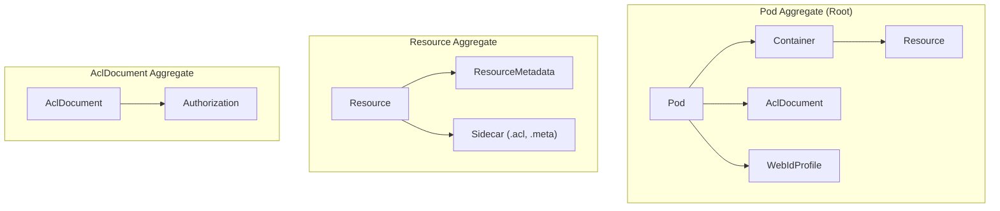
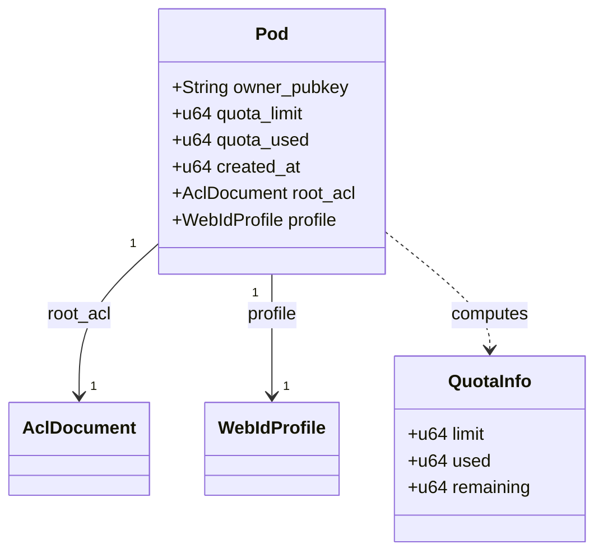
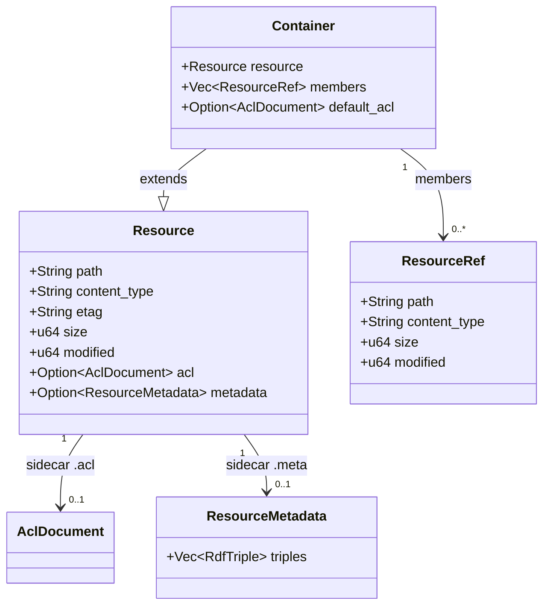
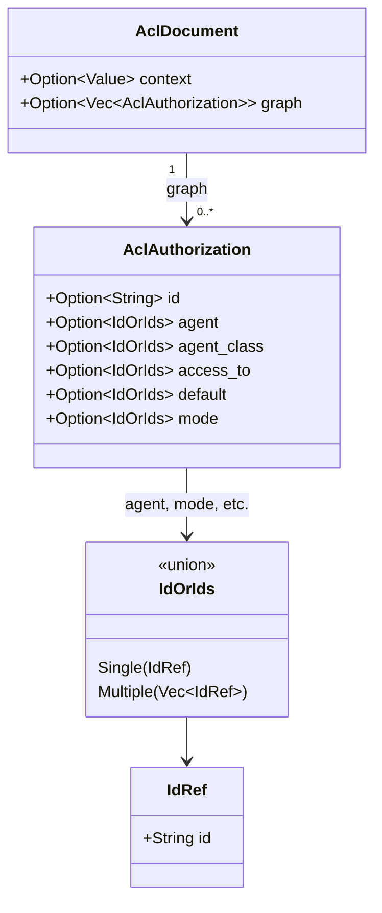
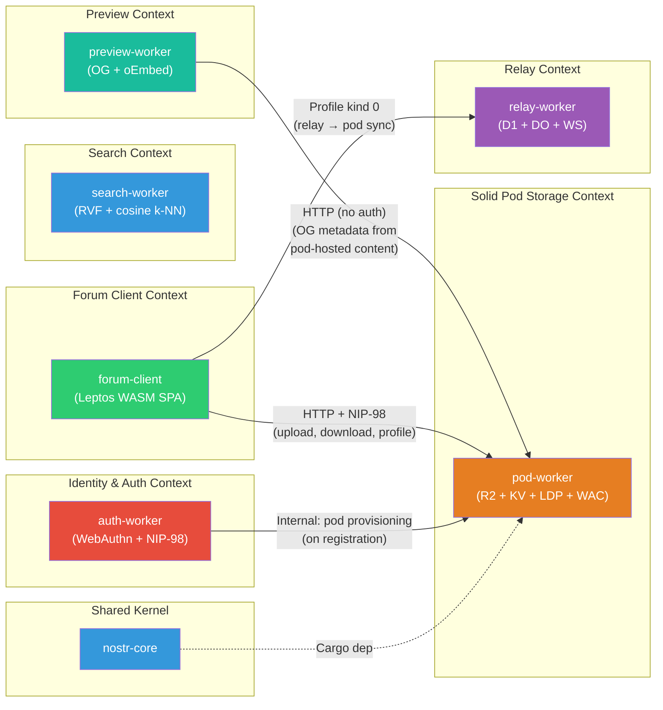
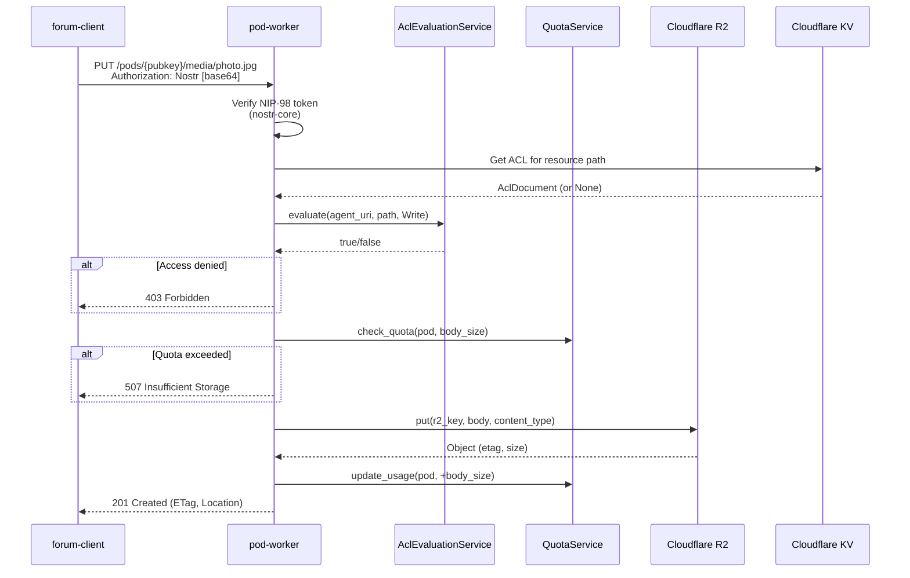
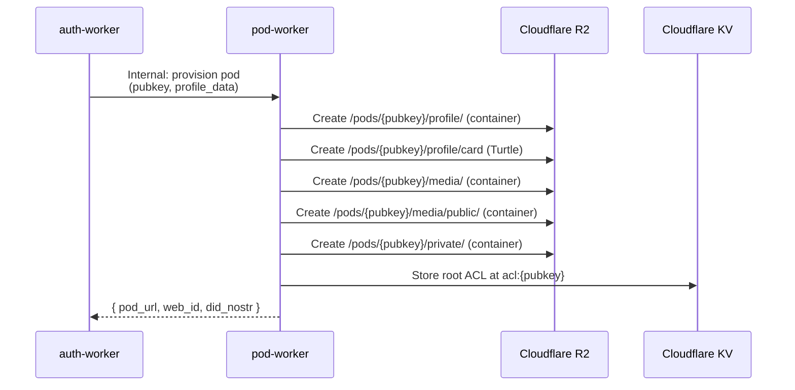

# Solid Pod Storage Bounded Context

**Last updated:** 2026-03-16 | [Back to DDD Index](README.md) | [Back to Documentation Index](../README.md)

This document defines the bounded context for the Solid Pod Storage domain within the DreamLab community platform. It describes the upgrade path from the current minimal R2+KV storage layer to full Solid Protocol compliance, including aggregates, domain services, domain events, value objects, the anti-corruption layer, and the target module structure.

## Current State

The `pod-worker` crate (`community-forum-rs/crates/pod-worker/`) is 898 LOC across 3 files:

| File | LOC | Responsibility |
|------|-----|----------------|
| `lib.rs` | 334 | HTTP routing, CORS, R2 CRUD operations, route parsing |
| `acl.rs` | 519 | WAC evaluator with JSON-LD ACL parsing (15 unit tests) |
| `auth.rs` | 47 | NIP-98 verification wrapper via `nostr-core` |

**Storage**: Cloudflare R2 (`PODS` bucket) for objects, KV (`POD_META` namespace) for ACL documents.

**Auth**: NIP-98 via `nostr-core::nip98`.

**Identity**: `did:nostr:{pubkey}` maps to `/pods/{pubkey}/`.

## Context Overview

```mermaid
graph TB
    subgraph "Solid Pod Storage Context"
        direction TB
        LIB["lib.rs<br/>(HTTP routing, CORS)"]
        AUTH["auth.rs<br/>(NIP-98 verification)"]

        subgraph "ACL Subdomain"
            ACL_MOD["acl/mod.rs<br/>(AclDocument types, evaluate_access)"]
            ACL_INH["acl/inheritance.rs<br/>(Container tree walk)"]
            ACL_HDR["acl/headers.rs<br/>(WAC-Allow, Link headers)"]
        end

        subgraph "LDP Subdomain"
            LDP_MOD["ldp/mod.rs<br/>(LDP types, resource/container)"]
            LDP_CON["ldp/container.rs<br/>(Container CRUD, containment triples)"]
            LDP_RES["ldp/resource.rs<br/>(Resource CRUD, metadata, sidecars)"]
            LDP_PAT["ldp/patch.rs<br/>(N3 Patch parsing + application)"]
        end

        subgraph "Storage Subdomain"
            STG_MOD["storage/mod.rs<br/>(PodRepository trait)"]
            STG_R2["storage/r2.rs<br/>(R2 + KV implementation)"]
        end

        QUOTA["quota.rs<br/>(Quota management)"]
        WEBID["webid.rs<br/>(WebID profile generation)"]
        PROV["provision.rs<br/>(Pod provisioning)"]
        COND["conditional.rs<br/>(ETag, If-Match, Range)"]
    end

    LIB --> AUTH
    LIB --> ACL_MOD
    LIB --> LDP_MOD
    LIB --> STG_MOD
    LIB --> QUOTA
    LIB --> WEBID
    LIB --> PROV
    LIB --> COND
    ACL_MOD --> ACL_INH
    ACL_MOD --> ACL_HDR
    LDP_MOD --> LDP_CON
    LDP_MOD --> LDP_RES
    LDP_MOD --> LDP_PAT

    style LIB fill:#e67e22,color:#fff
    style AUTH fill:#e74c3c,color:#fff
    style ACL_MOD fill:#9b59b6,color:#fff
    style ACL_INH fill:#9b59b6,color:#fff
    style ACL_HDR fill:#9b59b6,color:#fff
    style LDP_MOD fill:#2ecc71,color:#fff
    style LDP_CON fill:#2ecc71,color:#fff
    style LDP_RES fill:#2ecc71,color:#fff
    style LDP_PAT fill:#2ecc71,color:#fff
    style STG_MOD fill:#3498db,color:#fff
    style STG_R2 fill:#3498db,color:#fff
    style QUOTA fill:#f39c12,color:#fff
    style WEBID fill:#1abc9c,color:#fff
    style PROV fill:#1abc9c,color:#fff
    style COND fill:#f39c12,color:#fff
```



## Ubiquitous Language

| Term | Definition |
|------|-----------|
| **Pod** | A personal data store owned by a single Nostr pubkey, rooted at `/pods/{pubkey}/`. Each user has exactly one pod, provisioned at registration. |
| **Resource** | Any stored object (file, document, image) identified by a URL path within a pod. Resources have a content type, ETag, size, and optional sidecar metadata. |
| **Container** | A special resource that contains other resources (analogous to a directory). Identified by a trailing `/` in its URL path. Exposes `ldp:contains` triples for its members. |
| **ACL** | Access Control List. A JSON-LD document defining who can read, write, append to, or control a resource. Stored as a `.acl` sidecar alongside the resource it governs. |
| **WAC** | Web Access Control. The Solid specification for access control using ACL documents. Defines agent matching, mode evaluation, and path scoping rules. |
| **WebID** | A dereferenceable URI that identifies an agent. In DreamLab, the WebID is `https://pods.dreamlab-ai.com/{pubkey}/profile/card#me`, backed by a Turtle profile document. |
| **LDP** | Linked Data Platform. The W3C specification for CRUD operations on linked data resources and containers. Governs how containers report membership and how resources are created. |
| **Agent** | An entity making requests against a pod. May be an authenticated user (`did:nostr:{pubkey}`), the anonymous public (`foaf:Agent`), or any authenticated user (`acl:AuthenticatedAgent`). |
| **Mode** | An access permission defined by WAC: `acl:Read`, `acl:Write`, `acl:Append`, `acl:Control`. `Write` implies `Append`. `Control` allows editing the ACL itself. |
| **ETag** | Entity tag. A hash of a resource's content returned by R2, used for conditional requests (`If-Match`, `If-None-Match`) to prevent lost updates and enable caching. |
| **Quota** | Per-pod storage limit in bytes, enforced on every write operation. Default: 50 MB. Exceeding the quota returns HTTP 507 (Insufficient Storage). |
| **Sidecar** | A metadata file stored alongside a resource. `.acl` sidecars hold access control rules; `.meta` sidecars hold RDF descriptions. Sidecars are not listed as container members. |
| **N3 Patch** | A patch format for modifying RDF graphs by adding and deleting triples. Used for partial updates to ACL documents and profile cards without replacing the entire resource. |
| **Containment Triple** | An `ldp:contains` relationship linking a container to its direct members. Generated dynamically from R2 prefix listing, not stored explicitly. |
| **Effective ACL** | The ACL document that governs a resource. If the resource has its own `.acl` sidecar, that is the effective ACL. Otherwise, the evaluator walks up the container tree until it finds a `.acl` with an `acl:default` rule. |

## Aggregates

### Aggregate Overview



### 1. Pod Aggregate (Root)

**Root entity**: `Pod`
**Crate**: `pod-worker`

The Pod aggregate is the consistency boundary for a user's entire storage space. All operations on resources, containers, and ACLs within a pod go through the Pod root to enforce quota limits and ownership invariants.



```rust
/// Aggregate root: a user's Solid pod.
pub struct Pod {
    /// Owner's Nostr public key (64 hex chars).
    pub owner_pubkey: String,
    /// Maximum allowed storage in bytes. Default: 50 MB.
    pub quota_limit: u64,
    /// Current storage usage in bytes. Computed from R2 object sizes.
    pub quota_used: u64,
    /// Pod creation timestamp (Unix seconds).
    pub created_at: u64,
    /// Root ACL document governing the pod's top-level access rules.
    pub root_acl: AclDocument,
    /// Owner's WebID profile card.
    pub profile: WebIdProfile,
}
```

**Invariants**:
- Every pod is owned by exactly one pubkey for its lifetime.
- `quota_used` must never exceed `quota_limit`. Write operations that would exceed the limit are rejected with HTTP 507.
- The root ACL is created at provisioning time and grants the owner `Read + Write + Control` on `./`, plus public `Read` on `./profile/` and `./media/public/`.
- The pod URL is deterministic: `https://pods.dreamlab-ai.com/{owner_pubkey}/`.

**Commands**: ProvisionPod, UpdateQuotaLimit, GetQuotaUsage.

### 2. Resource Aggregate

**Root entity**: `Resource`
**Crate**: `pod-worker`

A Resource represents any stored object within a pod. Resources are identified by their path relative to the pod root. A Container is a specialized Resource that contains other resources.



```rust
/// A stored object within a pod.
pub struct Resource {
    /// Path relative to pod root (e.g., "/profile/card", "/media/photo.jpg").
    pub path: String,
    /// MIME content type (e.g., "text/turtle", "image/jpeg").
    pub content_type: String,
    /// ETag from R2 (content hash). Used for conditional requests.
    pub etag: String,
    /// Size in bytes.
    pub size: u64,
    /// Last modification timestamp (Unix seconds, from R2 metadata).
    pub modified: u64,
    /// Optional sidecar ACL document. If None, access is determined by
    /// walking up the container tree to find an inherited ACL.
    pub acl: Option<AclDocument>,
    /// Optional sidecar metadata (RDF description of the resource).
    pub metadata: Option<ResourceMetadata>,
}

/// A container (directory-like resource) that holds other resources.
pub struct Container {
    /// The container's own resource metadata.
    pub resource: Resource,
    /// Direct members (derived from R2 prefix listing, not stored).
    pub members: Vec<ResourceRef>,
    /// Optional default ACL that applies to children without their own ACL.
    pub default_acl: Option<AclDocument>,
}

/// Lightweight reference to a resource within a container listing.
pub struct ResourceRef {
    pub path: String,
    pub content_type: String,
    pub size: u64,
    pub modified: u64,
}
```

**Invariants**:
- Container paths always end with `/`. Resource paths never end with `/` (except the pod root `/`).
- Containment triples (`ldp:contains`) are derived from R2 prefix listing, never stored explicitly.
- Sidecar files (`.acl`, `.meta`) are not listed as container members.
- Deleting a non-empty container is forbidden. The client must delete all members first.

**Commands**: CreateResource, GetResource, UpdateResource, DeleteResource, PatchResource, CreateContainer, ListContainer.

### 3. AclDocument Aggregate

**Root entity**: `AclDocument`
**Crate**: `pod-worker` (`acl` module)

An AclDocument is a JSON-LD graph of authorization entries. It is the sole authority for access decisions.



```rust
/// A JSON-LD ACL document with an @graph array of authorizations.
/// Existing type in acl.rs -- shown here for aggregate completeness.
#[derive(Debug, Deserialize)]
pub struct AclDocument {
    #[serde(rename = "@context")]
    pub context: Option<serde_json::Value>,
    #[serde(rename = "@graph")]
    pub graph: Option<Vec<AclAuthorization>>,
}

/// A single authorization entry within the @graph array.
#[derive(Debug, Deserialize)]
pub struct AclAuthorization {
    #[serde(rename = "@id")]
    pub id: Option<String>,
    #[serde(rename = "acl:agent")]
    pub agent: Option<IdOrIds>,
    #[serde(rename = "acl:agentClass")]
    pub agent_class: Option<IdOrIds>,
    #[serde(rename = "acl:accessTo")]
    pub access_to: Option<IdOrIds>,
    #[serde(rename = "acl:default")]
    pub default: Option<IdOrIds>,
    #[serde(rename = "acl:mode")]
    pub mode: Option<IdOrIds>,
}
```

**Invariants**:
- No ACL document means deny all (secure by default).
- `acl:Write` grants both `Write` and `Append` per the WAC specification.
- `foaf:Agent` matches all requests, including anonymous. `acl:AuthenticatedAgent` matches only requests with a valid NIP-98 token.
- Only agents with `acl:Control` mode can modify an ACL document.

**Commands**: GetAcl, SetAcl, PatchAcl.

## Value Objects

```rust
/// Access mode required for an operation.
/// Maps directly to WAC mode URIs.
#[derive(Debug, Clone, Copy, PartialEq, Eq)]
pub enum AccessMode {
    Read,    // acl:Read   -- GET, HEAD
    Write,   // acl:Write  -- PUT, DELETE (also grants Append)
    Append,  // acl:Append -- POST
    Control, // acl:Control -- PUT/DELETE on .acl sidecars
}

/// WebID profile card. Stored as Turtle (text/turtle) at
/// /pods/{pubkey}/profile/card and dereferenceable at
/// /pods/{pubkey}/profile/card#me.
pub struct WebIdProfile {
    /// Owner's Nostr pubkey (64 hex chars).
    pub pubkey: String,
    /// Display name (from Nostr kind 0 profile, optional).
    pub name: Option<String>,
    /// Avatar image URL (optional, may point to pod media).
    pub image: Option<String>,
    /// Bio / about text (optional).
    pub bio: Option<String>,
    /// Canonical pod URL: https://pods.dreamlab-ai.com/{pubkey}/
    pub pod_url: String,
    /// OIDC issuer for third-party auth (reserved for future use).
    pub oidc_issuer: Option<String>,
}

/// Quota information for a pod.
pub struct QuotaInfo {
    /// Maximum allowed bytes.
    pub limit: u64,
    /// Currently used bytes.
    pub used: u64,
    /// Remaining bytes (limit - used).
    pub remaining: u64,
}

/// Result of evaluating conditional request headers.
pub enum PreconditionResult {
    /// Preconditions satisfied, proceed with the operation.
    Satisfied,
    /// If-Match failed: resource has been modified. Return 412.
    PreconditionFailed,
    /// If-None-Match matched: resource has not been modified. Return 304.
    NotModified,
}

/// Result of parsing a Range header.
pub enum RangeResult {
    /// No Range header present; serve the full resource.
    Full,
    /// Valid byte range. Return 206 with the specified slice.
    Partial { start: u64, end: u64 },
    /// Range not satisfiable. Return 416.
    NotSatisfiable,
}

/// A JSON-LD @id reference -- may be a single object or an array.
/// Existing type in acl.rs.
#[derive(Debug, Deserialize)]
#[serde(untagged)]
pub enum IdOrIds {
    Single(IdRef),
    Multiple(Vec<IdRef>),
}

/// A JSON-LD @id reference object.
/// Existing type in acl.rs.
#[derive(Debug, Deserialize)]
pub struct IdRef {
    #[serde(rename = "@id")]
    pub id: String,
}
```

## Domain Services

### 1. ContainerService

Manages LDP container lifecycle and membership.

```rust
/// Container operations within a pod.
pub trait ContainerService {
    /// Create a new container at the given path.
    /// Creates an empty resource with content-type text/turtle
    /// and adds a containment triple to the parent container.
    async fn create_container(&self, pod: &str, path: &str) -> Result<Container, PodError>;

    /// List direct members of a container.
    /// Derives membership from R2 prefix listing, filtering out
    /// sidecar files (.acl, .meta).
    async fn list_members(&self, pod: &str, container_path: &str) -> Result<Vec<ResourceRef>, PodError>;

    /// Add a member to a container.
    /// Called internally when a resource is created; not exposed as HTTP.
    async fn add_member(&self, pod: &str, container_path: &str, resource: &Resource) -> Result<(), PodError>;

    /// Remove a member from a container.
    /// Called internally when a resource is deleted.
    async fn remove_member(&self, pod: &str, container_path: &str, resource_path: &str) -> Result<(), PodError>;

    /// Check whether a container has any members.
    /// Used to enforce the non-empty-delete invariant.
    async fn is_empty(&self, pod: &str, container_path: &str) -> Result<bool, PodError>;
}
```

### 2. AclEvaluationService

Evaluates access decisions by resolving the effective ACL for a resource and checking agent permissions.

```rust
/// ACL evaluation and management.
pub trait AclEvaluationService {
    /// Evaluate whether an agent has the requested mode on a resource.
    /// This is the primary access control entry point, called on every request.
    fn evaluate(&self, agent_uri: Option<&str>, resource_path: &str, mode: AccessMode) -> bool;

    /// Find the effective ACL for a resource.
    /// If the resource has a sidecar .acl, returns it.
    /// Otherwise, walks up the container tree checking for
    /// .acl files with acl:default rules until one is found or
    /// the pod root is reached.
    async fn find_effective_acl(&self, pod: &str, resource_path: &str) -> Result<Option<AclDocument>, PodError>;

    /// Set the ACL for a resource (write the .acl sidecar).
    /// Requires acl:Control mode on the resource.
    async fn set_acl(&self, pod: &str, resource_path: &str, acl_doc: &AclDocument) -> Result<(), PodError>;

    /// Get the inherited ACL for a resource (from the nearest
    /// ancestor container with a default ACL).
    async fn get_inherited_acl(&self, pod: &str, resource_path: &str) -> Result<Option<AclDocument>, PodError>;
}
```

### 3. QuotaService

Enforces per-pod storage limits.

```rust
/// Per-pod quota enforcement.
pub trait QuotaService {
    /// Check whether a write of additional_bytes would exceed the quota.
    /// Returns Ok(()) if within limits, Err(QuotaExceeded) otherwise.
    async fn check_quota(&self, pod: &str, additional_bytes: u64) -> Result<(), PodError>;

    /// Update the quota usage counter after a write or delete.
    /// delta_bytes is positive for writes, negative for deletes.
    async fn update_usage(&self, pod: &str, delta_bytes: i64) -> Result<(), PodError>;

    /// Get the current quota information for a pod.
    async fn get_usage(&self, pod: &str) -> Result<QuotaInfo, PodError>;

    /// Set a new quota limit for a pod. Admin-only operation.
    async fn set_limit(&self, pod: &str, new_limit: u64) -> Result<(), PodError>;
}
```

### 4. ConditionalRequestService

Handles HTTP conditional requests and range requests per RFC 7232 and RFC 7233.

```rust
/// HTTP conditional request handling.
pub trait ConditionalRequestService {
    /// Evaluate If-Match, If-None-Match, If-Modified-Since headers
    /// against the resource's current ETag.
    fn check_preconditions(
        &self,
        if_match: Option<&str>,
        if_none_match: Option<&str>,
        resource_etag: &str,
    ) -> PreconditionResult;

    /// Generate an ETag from an R2 object's metadata.
    fn generate_etag(&self, r2_etag: &str) -> String;

    /// Parse a Range header and validate against the resource size.
    fn apply_range(&self, range_header: Option<&str>, resource_size: u64) -> RangeResult;
}
```

### 5. PatchService

Parses and applies N3 Patch operations for partial RDF graph updates.

```rust
/// N3 Patch operations for RDF resources.
pub trait PatchService {
    /// Apply an N3 patch to a resource's RDF content.
    /// The patch specifies triples to add and triples to delete.
    async fn apply_n3_patch(
        &self,
        pod: &str,
        resource_path: &str,
        patch_body: &str,
    ) -> Result<Resource, PodError>;

    /// Parse an N3 patch body into discrete operations.
    fn parse_n3_operations(&self, body: &str) -> Result<Vec<PatchOperation>, PodError>;
}

/// A single N3 Patch operation.
pub enum PatchOperation {
    /// Add these triples to the graph.
    Insert(Vec<RdfTriple>),
    /// Remove these triples from the graph.
    Delete(Vec<RdfTriple>),
}

/// A single RDF triple (subject, predicate, object).
pub struct RdfTriple {
    pub subject: String,
    pub predicate: String,
    pub object: String,
}
```

### 6. ProvisioningService

Creates new pods with default structure and ACLs. Called by `auth-worker` during registration.

```rust
/// Pod provisioning at registration time.
pub trait ProvisioningService {
    /// Provision a new pod for a pubkey.
    /// Creates the default container structure:
    ///   /profile/          (public read)
    ///   /profile/card      (WebID profile, text/turtle)
    ///   /media/            (owner-only)
    ///   /media/public/     (public read)
    ///   /private/          (owner-only)
    /// Writes the root .acl with default permissions.
    async fn provision_pod(&self, pubkey: &str) -> Result<Pod, PodError>;

    /// Create the default container tree for a new pod.
    async fn create_default_containers(&self, pod: &Pod) -> Result<(), PodError>;

    /// Create the initial WebID profile card from registration data.
    async fn create_webid_profile(
        &self,
        pod: &Pod,
        profile_data: &WebIdProfile,
    ) -> Result<(), PodError>;
}
```

## Context Map

### Integration with Other Bounded Contexts



### Dependency Table

| Consumer | Provider | Mechanism | Direction |
|----------|----------|-----------|-----------|
| pod-worker | nostr-core | Cargo dependency (NIP-98 verification) | Upstream |
| auth-worker | pod-worker | Internal HTTP call (pod provisioning at registration) | Upstream |
| forum-client | pod-worker | HTTP + NIP-98 (image upload, profile card, media download) | Downstream |
| preview-worker | pod-worker | HTTP, no auth (OG metadata from public pod resources) | Downstream |

### Context Mapping Patterns

| Pattern | Application |
|---------|-------------|
| **Anti-Corruption Layer** | Translates between Nostr identity (`did:nostr:{pubkey}`, NIP-98 auth) and Solid semantics (WebID, WAC agent matching, LDP resource URLs). |
| **Customer-Supplier** | `auth-worker` (customer) defines the pod provisioning contract; `pod-worker` (supplier) fulfills it. |
| **Conformist** | `pod-worker` conforms to the Solid Protocol (LDP + WAC) specification, adapting its internal R2+KV storage to match the Solid contract. |
| **Published Language** | JSON-LD ACL documents and Turtle profile cards are the published language shared with any Solid-compatible client. |

## Anti-Corruption Layer

The pod-worker bridges two conceptual worlds:

1. **Solid / Linked Data world**: Containers, RDF triples, WAC authorization entries, WebID profiles, content negotiation, LDP interaction model headers.
2. **Nostr / DreamLab world**: NIP-98 HTTP authentication, `did:nostr:{pubkey}` identities, hex pubkeys, Nostr kind 0 profile metadata, relay-based event propagation.

The anti-corruption layer translates between them at the boundary:

| Nostr/DreamLab Concept | Solid/LDP Concept | Translation |
|------------------------|-------------------|-------------|
| Nostr pubkey (64 hex chars) | WebID URI | `did:nostr:{pubkey}` used as WAC agent identifier |
| NIP-98 `Authorization: Nostr <base64>` header | Solid-OIDC DPoP token | NIP-98 token verified by `nostr-core`, mapped to `did:nostr:{pubkey}` for WAC evaluation |
| R2 object key `pods/{pubkey}/path` | LDP resource URL `https://pods.dreamlab-ai.com/{pubkey}/path` | `parse_pod_route()` extracts pubkey and resource path; R2 key is the canonical storage address |
| KV entry `acl:{pubkey}` | `.acl` sidecar resource | KV stores the serialized JSON-LD ACL; the ACL module deserializes it for evaluation |
| Nostr kind 0 profile metadata (JSON) | WebID profile card (Turtle) | `webid.rs` converts kind 0 fields (name, picture, about) to Turtle triples under the `foaf:` and `vcard:` vocabularies |
| `foaf:Agent` (public access) | Anonymous HTTP request | Requests without an `Authorization` header have `agent_uri = None`; `foaf:Agent` in ACL matches them |

This layer ensures that Solid-compatible clients can interact with DreamLab pods using standard Solid semantics, while DreamLab's forum client uses NIP-98 authentication natively. No Solid client needs to understand Nostr, and no Nostr client needs to understand Solid -- the pod-worker mediates.

## Domain Events

| Event | Trigger | Payload | Consumers |
|-------|---------|---------|-----------|
| `PodProvisioned` | `auth-worker` calls provisioning endpoint after first registration | `{ owner_pubkey, pod_url, web_id }` | Forum client (redirect to profile setup) |
| `ResourceCreated` | PUT or POST creates a new resource | `{ pod, path, content_type, size }` | ContainerService (update membership), QuotaService (increment usage) |
| `ResourceModified` | PUT or PATCH updates an existing resource | `{ pod, path, old_size, new_size, new_etag }` | QuotaService (adjust usage delta), cache invalidation |
| `ResourceDeleted` | DELETE removes a resource | `{ pod, path, freed_bytes }` | ContainerService (remove membership), QuotaService (decrement usage) |
| `ContainerCreated` | PUT with trailing `/` or POST to parent | `{ pod, container_path }` | Parent ContainerService (add containment triple) |
| `AclChanged` | PUT on a `.acl` sidecar resource | `{ pod, resource_path }` | KV cache invalidation, ACL inheritance recalculation |
| `QuotaExceeded` | Write attempt where `quota_used + body_size > quota_limit` | `{ pod, quota_limit, quota_used, requested_bytes }` | HTTP 507 response to client |
| `ProfileUpdated` | PUT or PATCH on `/profile/card` | `{ pod, profile_data }` | WebID resolution cache invalidation |

### Event Flow: Resource Upload



### Event Flow: Pod Provisioning



## Repository Pattern

```rust
/// Repository trait for pod storage operations.
/// The implementation is backed by Cloudflare R2 (objects) and KV (metadata/ACLs).
#[async_trait]
pub trait PodRepository {
    /// Get a resource by pod and path. Returns None if the resource does not exist.
    async fn get_resource(&self, pod: &str, path: &str) -> Result<Option<Resource>, PodError>;

    /// Put a resource (create or overwrite). Returns the created/updated resource
    /// with its new ETag and size.
    async fn put_resource(
        &self,
        pod: &str,
        path: &str,
        body: &[u8],
        content_type: &str,
    ) -> Result<Resource, PodError>;

    /// Delete a resource. Returns an error if the resource does not exist.
    async fn delete_resource(&self, pod: &str, path: &str) -> Result<(), PodError>;

    /// List the direct children of a container (R2 prefix listing).
    /// Excludes sidecar files (.acl, .meta).
    async fn list_container(&self, pod: &str, prefix: &str) -> Result<Vec<ResourceRef>, PodError>;

    /// Get the ACL document for a specific resource path.
    /// Reads from KV at key "acl:{pod}:{path}" or the .acl sidecar in R2.
    async fn get_acl(&self, pod: &str, path: &str) -> Result<Option<AclDocument>, PodError>;

    /// Write an ACL document for a specific resource path.
    async fn put_acl(&self, pod: &str, path: &str, acl: &AclDocument) -> Result<(), PodError>;

    /// Get the current quota information for a pod.
    /// Reads usage from KV at key "quota:{pod}".
    async fn get_quota(&self, pod: &str) -> Result<QuotaInfo, PodError>;

    /// Update the quota usage counter by a signed delta (positive = write, negative = delete).
    async fn update_quota_usage(&self, pod: &str, delta: i64) -> Result<(), PodError>;
}
```

**Implementation**: `R2KvPodRepository` backed by Cloudflare R2 (`PODS` bucket) and KV (`POD_META` namespace).

```rust
/// Concrete repository backed by Cloudflare R2 + KV.
pub struct R2KvPodRepository {
    /// R2 bucket binding.
    bucket: worker::Bucket,
    /// KV namespace binding for ACLs, quota, and metadata.
    kv: worker::kv::KvStore,
}
```

## Error Types

```rust
/// Domain errors for the Solid Pod Storage context.
#[derive(Debug)]
pub enum PodError {
    /// Resource not found at the specified path.
    NotFound { pod: String, path: String },
    /// Access denied -- the agent lacks the required mode.
    Forbidden { agent: Option<String>, path: String, mode: AccessMode },
    /// Authentication required -- no valid NIP-98 token provided.
    Unauthorized,
    /// Request body exceeds the per-request size limit (50 MB).
    PayloadTooLarge { size: u64, limit: u64 },
    /// Write would exceed the pod's storage quota.
    QuotaExceeded { limit: u64, used: u64, requested: u64 },
    /// Conditional request precondition failed (ETag mismatch).
    PreconditionFailed { expected_etag: String, actual_etag: String },
    /// Attempted to delete a non-empty container.
    ContainerNotEmpty { path: String },
    /// Invalid N3 Patch body.
    InvalidPatch { reason: String },
    /// Invalid resource path (traversal attempt, invalid characters).
    InvalidPath { path: String, reason: String },
    /// Underlying R2 or KV storage error.
    StorageError(String),
}
```

## HTTP Interface

The pod-worker exposes a REST API conforming to the Solid Protocol:

| Method | Path | Mode Required | Description |
|--------|------|---------------|-------------|
| `GET` | `/pods/{pubkey}/{path}` | `Read` | Retrieve a resource or container listing |
| `HEAD` | `/pods/{pubkey}/{path}` | `Read` | Resource metadata (Content-Type, ETag, size) |
| `PUT` | `/pods/{pubkey}/{path}` | `Write` | Create or replace a resource |
| `POST` | `/pods/{pubkey}/{path}/` | `Append` | Create a resource in a container (slug negotiation) |
| `DELETE` | `/pods/{pubkey}/{path}` | `Write` | Delete a resource or empty container |
| `PATCH` | `/pods/{pubkey}/{path}` | `Write` | Apply an N3 Patch to an RDF resource |
| `OPTIONS` | `*` | None | CORS preflight |
| `GET` | `/health` | None | Health check |

**Response headers** (per Solid Protocol):

| Header | Example Value | When |
|--------|---------------|------|
| `Content-Type` | `text/turtle; charset=utf-8` | All GET responses |
| `ETag` | `"a1b2c3d4"` | All GET/HEAD/PUT responses |
| `Link` | `<.acl>; rel="acl"` | All responses (sidecar link) |
| `Link` | `<http://www.w3.org/ns/ldp#Resource>; rel="type"` | Resource responses |
| `Link` | `<http://www.w3.org/ns/ldp#Container>; rel="type"` | Container responses |
| `WAC-Allow` | `user="read write", public="read"` | All responses |
| `Accept-Patch` | `text/n3` | PATCH-capable resources |
| `Allow` | `GET, HEAD, PUT, DELETE, PATCH` | All responses |
| `Location` | `/pods/{pk}/media/photo.jpg` | 201 Created responses |

## Target Module Structure

```
pod-worker/src/
  lib.rs              HTTP routing, CORS, response headers, Solid Protocol
                      headers (Link, WAC-Allow, Accept-Patch, Allow)
  auth.rs             NIP-98 verification -- existing, unchanged
  acl/
    mod.rs            AclDocument types, evaluate_access() -- refactored from
                      existing acl.rs with no behavioral changes
    inheritance.rs    Container tree walk for effective ACL resolution
    headers.rs        WAC-Allow header generation, Link header construction
  ldp/
    mod.rs            LDP types (Resource, Container, ResourceRef),
                      content negotiation (Turtle, JSON-LD)
    container.rs      Container CRUD, R2 prefix listing, containment
                      triple generation, non-empty-delete guard
    resource.rs       Resource CRUD, metadata extraction, sidecar
                      file handling (.acl, .meta)
    patch.rs          N3 Patch parsing and application (add/delete triples)
  storage/
    mod.rs            PodRepository trait definition
    r2.rs             R2KvPodRepository: R2 bucket + KV namespace
                      implementation of PodRepository
  quota.rs            QuotaService implementation, KV-backed usage counters,
                      quota limit enforcement
  webid.rs            WebID profile card generation (Turtle serialization),
                      kind 0 field mapping (name, picture, about) to
                      foaf:/vcard: vocabularies
  provision.rs        Pod provisioning: default container tree creation,
                      root ACL seeding, WebID profile card creation
  conditional.rs      ETag comparison, If-Match/If-None-Match evaluation,
                      Range header parsing, 206/304/412/416 responses
```

**Estimated size**: ~2,900 LOC across 12 files (up from 898 LOC across 3 files). The increase reflects LDP container semantics, ACL inheritance, N3 Patch support, quota management, conditional requests, and WebID profile generation -- all required for Solid Protocol compliance.

## Migration Path

The upgrade from the current 898-LOC implementation to full Solid compliance is structured in four phases:

### Phase 1: Repository Extraction (non-breaking)

Extract the inline R2+KV operations from `lib.rs` into `storage/mod.rs` and `storage/r2.rs` behind the `PodRepository` trait. All existing behavior is preserved. The `acl.rs` module moves to `acl/mod.rs` with no code changes.

### Phase 2: LDP Container Semantics

Add `ldp/container.rs` with container listing (derived from R2 prefix listing), `ldp:contains` triple generation, and the non-empty-delete guard. Add `ldp/resource.rs` with sidecar file handling. Add Solid Protocol headers (`Link`, `WAC-Allow`, `Accept-Patch`) to all responses in `lib.rs`.

### Phase 3: ACL Inheritance + Quota + Conditional Requests

Add `acl/inheritance.rs` for container tree walk. Add `quota.rs` with KV-backed usage counters. Add `conditional.rs` for ETag precondition checks and Range requests. Add `acl/headers.rs` for `WAC-Allow` header computation.

### Phase 4: N3 Patch + WebID + Provisioning

Add `ldp/patch.rs` for N3 Patch parsing and application. Add `webid.rs` for Turtle profile card generation from Nostr kind 0 data. Add `provision.rs` for structured pod provisioning with default containers and ACLs.

Each phase is independently deployable and backward-compatible with the existing HTTP interface.

## Related Documents

- [02 - Bounded Contexts](02-bounded-contexts.md) -- Context 4 (Storage) defines the current pod-worker
- [03 - Aggregates](03-aggregates.md) -- Aggregate 5 (Pod) defines the current Pod aggregate
- [04 - Domain Events](04-domain-events.md) -- Storage domain events (MediaUploaded, MediaDeleted, AclUpdated)
- [06 - Ubiquitous Language](06-ubiquitous-language.md) -- Pod, WAC, Whitelist Status definitions
- [ADR-011: Images to Solid Pods](../adr/011-images-to-solid-pods.md)
- [Security Overview](../security/SECURITY_OVERVIEW.md)
- [Cloudflare Workers Deployment](../deployment/CLOUDFLARE_WORKERS.md)
- [Solid Protocol Specification](https://solidproject.org/TR/protocol)
- [Web Access Control Specification](https://solid.github.io/web-access-control-spec/)
