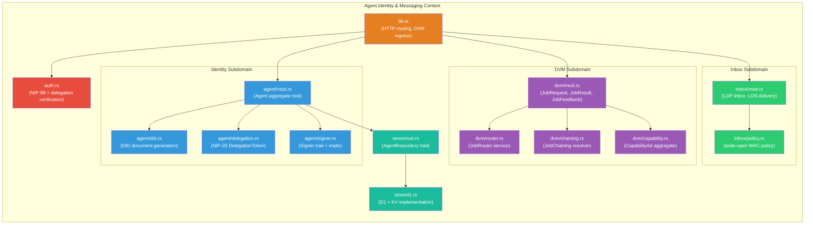
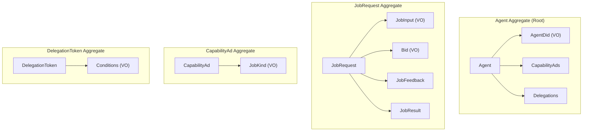
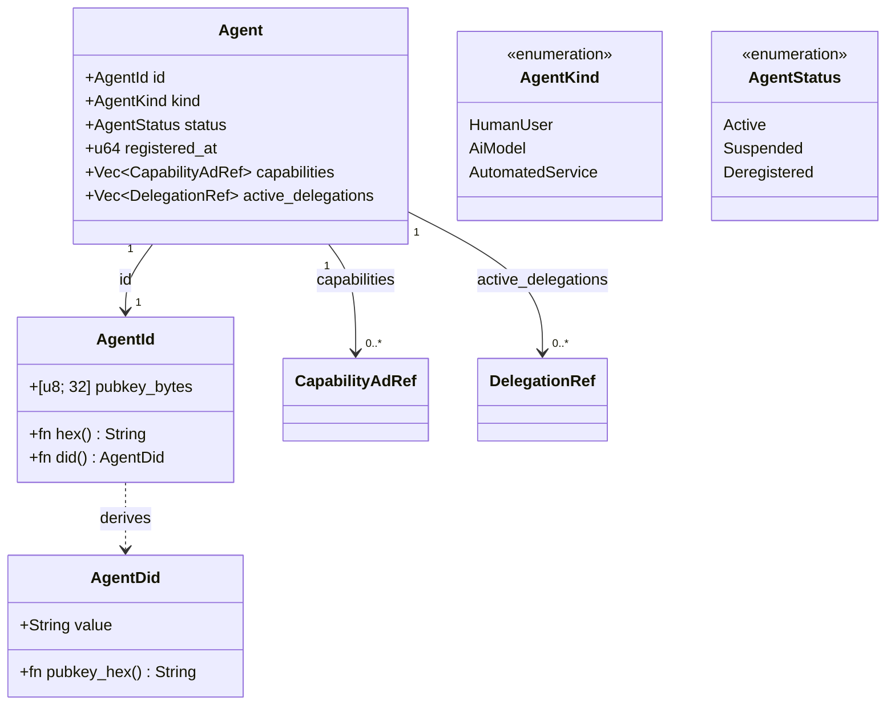
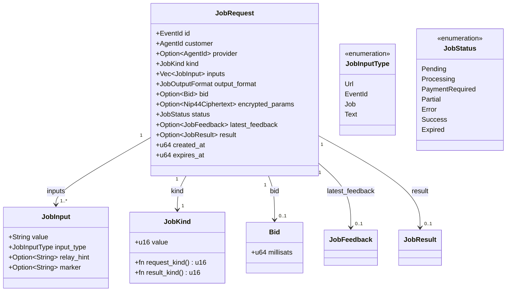
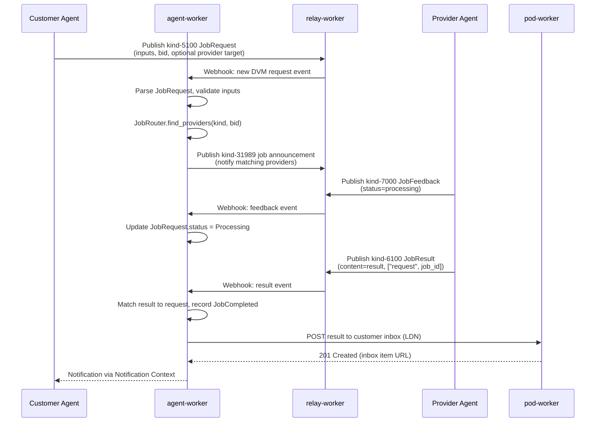
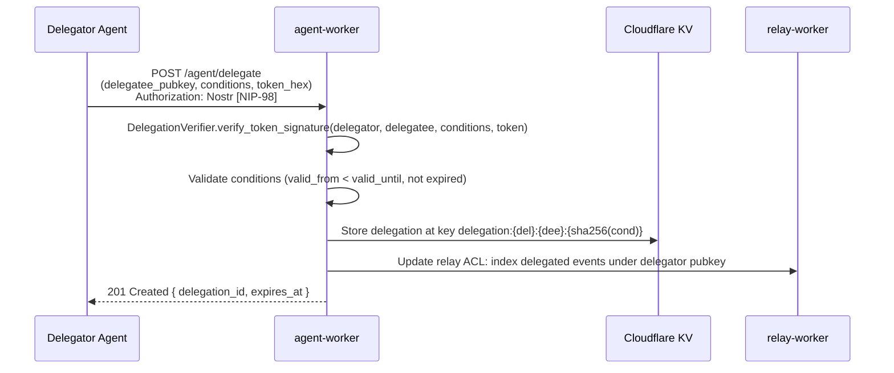
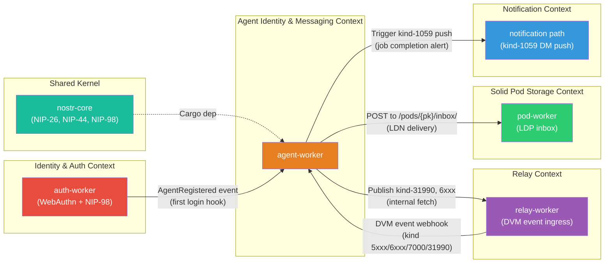

# Agent Identity & Messaging Bounded Context

**Last updated:** 2026-05-06 | [Back to DDD Index](README.md) | [Back to Documentation Index](../README.md)

This document defines the Agent Identity & Messaging bounded context for the DreamLab community platform. It covers AI agent identity via `did:nostr:<pubkey>`, capability advertisement (NIP-89/90), job-based messaging (NIP-90 Data Vending Machines), Schnorr delegation (NIP-26), and the Solid LDP inbox as a structured task delivery channel. The context lives primarily in a new `agent-worker` crate, with shared types contributed back to `nostr-core`.

> **Status:** aspirational design — not implemented as of 2026-06-12. No `agent-worker` crate exists in the deployed kit (`nostr-rust-forum@25ca8a1`); the DVM job lifecycle (kinds 5xxx/6xxx/7000, NIP-89 kind-31989/31990 handler ads) and NIP-26 delegation endpoints described below are implemented by no worker. The only shipped DVM surface is a client-side marketplace skeleton with placeholder listings (`nostr-bbs-forum-client/src/pages/marketplace.rs`). Agent governance that DOES exist today uses the separate kinds 31400-31405 control surface plus `agent_registry` in the relay D1 and `/api/governance/*` on the auth-worker.

## Context Overview



## Bounded Context

### Scope

The Agent Identity & Messaging context owns:

- Canonical agent identity: `did:nostr:<hex-pubkey>` document creation and resolution
- Agent registration with capability advertisement (kind-31990 events)
- NIP-90 Data Vending Machine protocol: job requests (kinds 5000-5999), job feedback (kind 7000), job results (kinds 6000-6999)
- NIP-26 delegation token issuance, storage, verification, and revocation
- Solid LDP inbox (`/pods/{pubkey}/inbox/`) as a structured task delivery endpoint
- The `Signer` trait abstraction unifying three signing backends

### Responsibilities

| Responsibility | Owner | Notes |
|----------------|-------|-------|
| `did:nostr:` document creation and caching | `agent/did.rs` | Tier 1 (offline) and Tier 3 (relay-enriched) |
| Agent registration into D1 | `agent/mod.rs` | On first NIP-98-authenticated call |
| Capability ad publication (kind-31990) | `dvm/capability.rs` | Written to relay-worker via internal fetch |
| Job request validation and routing | `dvm/router.rs` | Checks provider pubkey, kind range, bid |
| Job chaining resolution | `dvm/chaining.rs` | Resolves `["i", event-id, "job"]` references |
| Delegation token creation, storage, verification | `agent/delegation.rs` | Persisted to KV; NIP-26 Schnorr verify |
| LDP inbox delivery and listing | `inbox/mod.rs` | Solid LDP BasicContainer at `/inbox/` |
| Inbox WAC policy enforcement | `inbox/policy.rs` | Write-open, read-restricted to owner |

### External Dependencies

| Dependency | Direction | Mechanism |
|------------|-----------|-----------|
| `nostr-core` | Upstream | Cargo — event signing, NIP-98 verify, NIP-44 encrypt, secp256k1 |
| `relay-worker` | Downstream | Internal HTTP `fetch` — publish kind-31990 + job result events |
| `pod-worker` | Downstream | Internal HTTP — read/write `/pods/{pubkey}/inbox/` container |
| `auth-worker` | Upstream | Called on registration — triggers `AgentRegistered` domain event |
| Cloudflare D1 | Infrastructure | `AGENT_DB` binding — agent records, capability ads, job history |
| Cloudflare KV | Infrastructure | `AGENT_KV` binding — delegation tokens, DID document cache |

## Aggregates

### Aggregate Overview



### 1. Agent Aggregate (Root)

**Root entity**: `Agent`
**Crate**: `agent-worker`

The Agent aggregate is the consistency boundary for an autonomous participant in the DreamLab network. An Agent can be a human user, an AI model instance, or an automated service. Identity is always a secp256k1 keypair; the `AgentDid` value object is the canonical public identifier.



```rust
/// Aggregate root: an autonomous participant in the DreamLab network.
/// Stored in D1 table `agents` (columns: pubkey_hex, kind, status, registered_at).
pub struct Agent {
    /// Canonical identity -- 32-byte secp256k1 public key.
    pub id: AgentId,
    /// Whether this agent is a human user, AI model, or automated service.
    pub kind: AgentKind,
    /// Current lifecycle state.
    pub status: AgentStatus,
    /// Unix timestamp of first registration.
    pub registered_at: u64,
    /// References to capability advertisements published by this agent.
    /// Full CapabilityAd aggregates loaded lazily from D1.
    pub capabilities: Vec<CapabilityAdRef>,
    /// Active delegation tokens where this agent is the delegatee.
    /// Expired or revoked tokens are not included.
    pub active_delegations: Vec<DelegationRef>,
}

/// Strongly-typed agent identity (32-byte pubkey).
#[derive(Clone, PartialEq, Eq, Hash)]
pub struct AgentId([u8; 32]);

impl AgentId {
    /// Hex-encoded pubkey string (64 chars, lowercase).
    pub fn hex(&self) -> String { hex::encode(&self.0) }
    /// Derive the canonical DID for this agent.
    pub fn did(&self) -> AgentDid { AgentDid(format!("did:nostr:{}", self.hex())) }
    /// Parse from 64-char hex string. Returns Err if malformed.
    pub fn from_hex(s: &str) -> Result<Self, AgentError> { ... }
}

#[derive(Debug, Clone, Copy, PartialEq, Eq)]
pub enum AgentKind { HumanUser, AiModel, AutomatedService }

#[derive(Debug, Clone, Copy, PartialEq, Eq)]
pub enum AgentStatus { Active, Suspended, Deregistered }
```

**Invariants**:
- An Agent's `id` is immutable for the lifetime of the aggregate.
- `AgentStatus::Deregistered` is terminal; transitions back to `Active` are forbidden.
- An Agent may hold delegations from multiple principals, but each `(delegator, delegatee, conditions)` triple must be unique.
- `capabilities` contains only the latest superseding kind-31990 event per job kind advertised. Older ads for the same kind are tombstoned in D1 but excluded from the aggregate.

**Commands**: RegisterAgent, AdvertiseCapability, RevokeCapability, SuspendAgent, DeregisterAgent.

### 2. JobRequest Aggregate

**Root entity**: `JobRequest`
**Crate**: `agent-worker` (`dvm` module)

A JobRequest is the unit of work in the NIP-90 Data Vending Machine protocol. It is created by a Customer Agent and consumed by one or more Provider Agents. Feedback and results are attached to the JobRequest as it progresses through its lifecycle.



```rust
/// Aggregate root: a NIP-90 Data Vending Machine job request.
/// Created by publishing a Nostr event of kind 5000-5999 to relay-worker.
/// Indexed in D1 table `job_requests`.
pub struct JobRequest {
    /// Nostr event ID of the kind-5xxx request event.
    pub id: EventId,
    /// Agent that submitted the job.
    pub customer: AgentId,
    /// Specific provider targeted by this request (optional; None = open market).
    pub provider: Option<AgentId>,
    /// Job kind (5000-5999 for requests, 6000-6999 for results).
    pub kind: JobKind,
    /// Input parameters extracted from `["i", ...]` tags.
    pub inputs: Vec<JobInput>,
    /// Desired output format (e.g., "text/plain", "application/json").
    pub output_format: String,
    /// Bid in millisatoshis (from `["bid", amount]` tag). None = no bid.
    pub bid: Option<Bid>,
    /// NIP-44 encrypted parameter block for private jobs.
    pub encrypted_params: Option<nostr_core::nip44::Nip44Ciphertext>,
    /// Current lifecycle status, derived from the latest kind-7000 feedback event.
    pub status: JobStatus,
    /// Most recent feedback event from the provider (kind 7000).
    pub latest_feedback: Option<JobFeedback>,
    /// Result event (kind 6xxx) once the job is complete.
    pub result: Option<JobResult>,
    /// Unix timestamp of the request event.
    pub created_at: u64,
    /// Unix timestamp after which the job is considered expired.
    pub expires_at: u64,
}

/// A single input to a job, parsed from a `["i", value, type, relay?, marker?]` tag.
pub struct JobInput {
    /// The input value: URL, event ID (hex), or literal text.
    pub value: String,
    /// How to interpret the value.
    pub input_type: JobInputType,
    /// Optional relay hint for fetching event-type inputs.
    pub relay_hint: Option<String>,
    /// Optional free-form marker for multi-input jobs.
    pub marker: Option<String>,
}

#[derive(Debug, Clone, Copy, PartialEq, Eq)]
pub enum JobInputType { Url, EventId, Job, Text }

/// A strongly-typed NIP-90 job kind.
/// Request kinds are 5000-5999; result kinds are the request kind + 1000.
#[derive(Clone, Copy, PartialEq, Eq, Hash)]
pub struct JobKind(u16);

impl JobKind {
    /// The request event kind (5000-5999).
    pub fn request_kind(&self) -> u16 { self.0 }
    /// The corresponding result event kind (6000-6999).
    pub fn result_kind(&self) -> u16 { self.0 + 1000 }
    /// Parse from a u16, rejecting values outside 5000-5999.
    pub fn from_u16(n: u16) -> Result<Self, AgentError> {
        if (5000..=5999).contains(&n) { Ok(Self(n)) }
        else { Err(AgentError::InvalidJobKind(n)) }
    }
}

/// A bid for a job, denominated in millisatoshis.
#[derive(Clone, Copy, PartialEq, Eq, PartialOrd, Ord)]
pub struct Bid(pub u64);
```

**Invariants**:
- `kind.request_kind()` must be in the range 5000-5999. Values outside this range are rejected at parse time.
- A JobRequest must have at least one `JobInput`.
- `expires_at > created_at`. The default expiry window is 24 hours.
- Once `status` transitions to `Success` or `Error`, no further feedback or results are accepted.
- An encrypted job (`encrypted_params.is_some()`) requires `provider.is_some()` — broadcast encrypted jobs to the open market are forbidden.
- `result.kind` must equal `request.kind.result_kind()`. Mismatched result kinds are rejected.

**Commands**: SubmitJobRequest, RecordJobFeedback, RecordJobResult, ExpireJob, CancelJob.

### 3. CapabilityAd Aggregate

**Root entity**: `CapabilityAd`
**Crate**: `agent-worker` (`dvm/capability.rs`)

A CapabilityAd is a provider agent's permanent advertisement of its supported job kinds. It is published as a kind-31990 replaceable event and indexed in D1 for efficient lookup by job kind.

```rust
/// Aggregate: a provider's capability advertisement (kind-31990 event).
/// Stored in D1 table `capability_ads` with a compound index on (pubkey_hex, job_kind).
pub struct CapabilityAd {
    /// The provider's identity.
    pub provider: AgentId,
    /// d-tag value (provider's hex pubkey -- makes the event uniquely replaceable).
    pub d_tag: String,
    /// Human-readable name of the service.
    pub name: Option<String>,
    /// Supported job kinds (`["k", kind_num]` tags).
    pub supported_kinds: Vec<JobKind>,
    /// Optional endpoint URL for out-of-band requests.
    pub endpoint: Option<String>,
    /// Minimum bid the provider will accept in millisatoshis.
    pub min_bid: Option<Bid>,
    /// Nostr event ID of the kind-31990 event (for reference queries).
    pub event_id: EventId,
    /// When this capability ad was last updated (Unix seconds).
    pub updated_at: u64,
}
```

**Invariants**:
- `supported_kinds` must not be empty.
- The `d_tag` always equals the provider's hex pubkey (NIP-89 convention for agent ads).
- A CapabilityAd is replaced (not appended) whenever the provider publishes a new kind-31990 with the same d-tag.
- `min_bid.is_some()` implies the provider will reject job requests whose bid is below that threshold.

**Commands**: PublishCapabilityAd, RetractCapabilityAd.

### 4. DelegationToken Aggregate

**Root entity**: `DelegationToken`
**Crate**: `agent-worker` (`agent/delegation.rs`)

A DelegationToken is a scoped, time-bounded Schnorr signature by a Delegator over a conditions string, authorising a Delegatee to publish events on the Delegator's behalf. This is the NIP-26 delegation mechanism.

```rust
/// Aggregate: a NIP-26 delegation token.
/// Stored in KV at key `delegation:{delegator_hex}:{delegatee_hex}:{sha256(conditions)}`.
pub struct DelegationToken {
    /// The authorising agent (signer of the token).
    pub delegator: AgentId,
    /// The agent receiving the authorisation.
    pub delegatee: AgentId,
    /// Scope conditions (kind filter + timestamp bounds).
    pub conditions: Conditions,
    /// 64-byte Schnorr signature over `SHA256("nostr:delegation:{delegatee_hex}:{conditions_str}")`.
    pub token: [u8; 64],
    /// When this delegation was issued.
    pub issued_at: u64,
    /// Whether it has been explicitly revoked before `conditions.valid_until`.
    pub revoked: bool,
}

/// Conditions governing what a delegatee may publish.
/// Serialised as `kind=N&created_at>T1&created_at<T2` for token signing.
pub struct Conditions {
    /// Permitted event kinds (None = all kinds permitted within scope).
    pub allowed_kinds: Option<Vec<u16>>,
    /// POSIX timestamp lower bound (created_at must be >= this value).
    pub valid_from: u64,
    /// POSIX timestamp upper bound (created_at must be <= this value).
    pub valid_until: u64,
}

impl Conditions {
    /// Serialise to the canonical conditions string for NIP-26 token signing.
    /// Format: `kind=N&created_at>T1&created_at<T2`
    pub fn to_conditions_str(&self) -> String { ... }

    /// Check whether the conditions permit publishing an event of the given
    /// kind at the given Unix timestamp.
    pub fn permits(&self, kind: u16, created_at: u64) -> bool {
        let kind_ok = self.allowed_kinds.as_ref()
            .map(|ks| ks.contains(&kind))
            .unwrap_or(true);
        let time_ok = created_at >= self.valid_from && created_at <= self.valid_until;
        kind_ok && time_ok
    }
}
```

**Invariants**:
- `valid_from < valid_until`. Zero-length or inverted time windows are rejected.
- `valid_until` may not be in the past at issuance time.
- The `token` field is a valid secp256k1 Schnorr signature verifiable with `delegator.id`.
- A revoked token has `revoked = true` in KV; the revocation is permanent.
- `delegator != delegatee`. Self-delegation is semantically meaningless and rejected.

**Commands**: IssueDelegation, VerifyDelegation, RevokeDelegation.

## Domain Services

### 1. JobRouter

Routes incoming job request events to matching provider agents based on capability ads and bid thresholds.

```rust
/// Routes job requests to capable provider agents.
pub trait JobRouter {
    /// Find providers capable of handling this job kind,
    /// ordered by last-seen updated_at descending (most recent first).
    /// Filters out providers whose min_bid exceeds the job's bid.
    async fn find_providers(
        &self,
        kind: JobKind,
        bid: Option<Bid>,
    ) -> Result<Vec<AgentId>, AgentError>;

    /// Forward a job request to a specific provider by publishing
    /// an NIP-44-encrypted copy to relay-worker (if the provider
    /// pubkey is known), or to the open market (unencrypted).
    async fn route_job(
        &self,
        job: &JobRequest,
        provider: &AgentId,
    ) -> Result<(), AgentError>;

    /// Check whether an incoming kind-6xxx result event matches a
    /// pending job request and, if so, record it as the job result.
    async fn match_result(
        &self,
        result_event_id: &EventId,
        request_ref_tag: &str,
    ) -> Result<Option<JobRequest>, AgentError>;
}
```

### 2. DelegationVerifier

Verifies the NIP-26 delegation tag on incoming events and resolves the effective author identity for relay indexing.

```rust
/// Verifies NIP-26 delegation tags on Nostr events.
pub trait DelegationVerifier {
    /// Given an event with a `["delegation", delegator_pubkey, conditions, token_hex]` tag,
    /// verify that:
    ///   1. The token is a valid Schnorr signature by delegator over
    ///      SHA256("nostr:delegation:{delegatee_pubkey}:{conditions}").
    ///   2. The conditions string permits the event's kind and created_at.
    ///   3. The delegation has not been explicitly revoked in KV.
    /// Returns the resolved delegator AgentId on success.
    async fn verify_delegation_tag(
        &self,
        event_pubkey: &AgentId,
        delegation_tag: &[String],
    ) -> Result<AgentId, AgentError>;

    /// Check the revocation KV store for a token.
    /// Key: `delegation:{delegator_hex}:{delegatee_hex}:{sha256(conditions)}`.
    async fn is_revoked(
        &self,
        delegator: &AgentId,
        delegatee: &AgentId,
        conditions: &Conditions,
    ) -> Result<bool, AgentError>;
}
```

### 3. InboxDelivery

Delivers Linked Data Notifications to an agent's Solid LDP inbox container.

```rust
/// Delivers structured task notifications to agent inboxes via Solid LDN.
pub trait InboxDelivery {
    /// POST a JSON-LD notification body to the agent's inbox container.
    /// The inbox WAC policy allows any authenticated agent to write.
    /// Returns the URL of the created LDN resource.
    async fn deliver(
        &self,
        recipient: &AgentId,
        notification: &serde_json::Value,
    ) -> Result<String, AgentError>;

    /// List inbox items for the owner agent (NIP-98 authenticated).
    /// Returns a JSON-LD container document with `ldp:contains` members.
    async fn list_inbox(
        &self,
        owner: &AgentId,
    ) -> Result<serde_json::Value, AgentError>;

    /// Delete a specific inbox item after the owner has processed it.
    async fn delete_item(
        &self,
        owner: &AgentId,
        item_url: &str,
    ) -> Result<(), AgentError>;
}
```

### 4. DidDocumentService

Generates and caches `did:nostr:` DID documents at two tiers of completeness.

```rust
/// DID document generation for did:nostr: identifiers.
pub trait DidDocumentService {
    /// Tier 1 (offline): generate a minimal DID document from the pubkey alone.
    /// Contains only a `verificationMethod` with the compressed secp256k1 key.
    /// Served from KV cache; no relay lookup required.
    fn tier1_document(&self, id: &AgentId) -> DidNostrDocument;

    /// Tier 3 (relay-enriched): augment the Tier 1 document with data from
    /// the relay-worker (kind-0 profile, NIP-05 identifier, alsoKnownAs WebID URI).
    /// Fetches the kind-0 event from relay-worker and merges fields.
    /// Cached in KV at `did:{pubkey_hex}` with a 1-hour TTL.
    async fn tier3_document(
        &self,
        id: &AgentId,
    ) -> Result<DidNostrDocument, AgentError>;

    /// Serve the DID document at `/.well-known/did/nostr/{pubkey}.json`.
    async fn serve(
        &self,
        pubkey_hex: &str,
        request: &worker::Request,
    ) -> Result<worker::Response, AgentError>;
}

/// A did:nostr: DID document.
/// Serialised as JSON-LD per the W3C Nostr CG DID Method draft.
pub struct DidNostrDocument {
    pub id: AgentDid,
    pub also_known_as: Vec<String>,
    pub verification_method: Vec<VerificationMethod>,
    pub authentication: Vec<String>,
    pub assertion_method: Vec<String>,
    pub service: Vec<DidService>,
}

pub struct VerificationMethod {
    pub id: String,
    pub controller: String,
    pub r#type: String,                  // "Multikey" (per ADR-125)
    pub public_key_multibase: String,    // "fe70102" + x-only hex; fixed 71 chars
}

pub struct DidService {
    pub id: String,
    pub r#type: String,          // canonical form is service:[]; extensions: "SolidStorage", "Relay", "SolidWebID"
    pub service_endpoint: String,
}
```

### 5. SignerService

The `Signer` trait provides a unified signing abstraction over three backend implementations.

```rust
/// Unified signing abstraction for all NIP-98, NIP-17, and NIP-44 operations.
/// All event signing and encryption routes through this trait.
pub trait Signer {
    /// Sign a Nostr event. Returns the 64-byte Schnorr signature.
    async fn sign_event(&self, event_hash: &[u8; 32]) -> Result<[u8; 64], SignerError>;

    /// Get the signer's compressed public key (33 bytes).
    fn public_key(&self) -> [u8; 33];

    /// Derive the NIP-44 shared secret with a counterpart pubkey.
    async fn nip44_shared_secret(&self, counterpart: &[u8; 33]) -> Result<[u8; 32], SignerError>;
}

/// PRF-backed signer: derives the secp256k1 private key from a WebAuthn PRF output.
/// The PRF output is fed into HKDF-SHA256 with domain `"nostr-key-v1"`.
/// The derived scalar is the Nostr private key; it never leaves WASM memory.
pub struct PrfSigner { ... }

/// NIP-07 browser extension signer: delegates all operations to `window.nostr`
/// via JavaScript interop. Used in forum-client (Leptos WASM).
pub struct Nip07Signer { ... }

/// NIP-46 remote bunker signer: sends signing requests as NIP-04-encrypted
/// Nostr events to a bunker relay URL. Used when the key lives on a separate device.
pub struct Nip46BunkerSigner {
    pub bunker_url: String,
    pub relay_url: String,
    pub local_keypair: [u8; 32],  // ephemeral key for the session
}
```

## Domain Events

| Event | Trigger | Payload | Consumers |
|-------|---------|---------|-----------|
| `AgentRegistered` | First NIP-98-authenticated request by a new pubkey | `{ agent_id, kind, registered_at }` | pod-worker (provision inbox container), relay-worker (subscribe to DVM kinds) |
| `CapabilityAdvertised` | Provider publishes kind-31990 via DVM endpoint | `{ provider, supported_kinds, updated_at }` | D1 capability_ads table upsert, JobRouter cache invalidation |
| `CapabilityRetracted` | Provider publishes kind-31990 with empty `k` tags | `{ provider, retracted_at }` | D1 tombstone, JobRouter removes from routing table |
| `JobRequested` | Customer publishes kind-5xxx to relay-worker | `{ job_id, customer, kind, bid, expires_at }` | JobRouter (find + notify providers), D1 index |
| `JobFeedbackReceived` | Provider publishes kind-7000 | `{ job_id, provider, status, partial_result? }` | JobRequest status update, forum-client notification via Notification Context |
| `JobCompleted` | Provider publishes kind-6xxx with success status | `{ job_id, provider, result_event_id }` | JobRequest result attachment, forum-client refresh |
| `JobFailed` | Provider publishes kind-7000 with `status=error` | `{ job_id, provider, error_message }` | Forum-client error display, D1 status update |
| `DelegationIssued` | Delegator calls `/agent/delegate` endpoint | `{ delegator, delegatee, conditions, token_hex }` | KV store write, relay-worker ACL update |
| `DelegationRevoked` | Delegator calls `/agent/delegate/{id}` DELETE | `{ delegator, delegatee, revoked_at }` | KV revocation flag, relay-worker ACL invalidation |
| `InboxItemDelivered` | Any authenticated agent POSTs to `/pods/{pubkey}/inbox/` | `{ recipient, notification_url, sender? }` | Notification Context (kind-1059 push to recipient) |

### Event Flow: Job Lifecycle

> **Status:** aspirational design — not implemented as of 2026-06-12. No worker implements the kind-5100/31989/7000/6100 job lifecycle; `agent-worker` does not exist in the kit.



### Event Flow: Delegation Issuance

> **Status:** aspirational design — not implemented as of 2026-06-12. No `/agent/delegate` endpoint or NIP-26 `DelegationToken` issuance exists in any deployed worker. (Pod delegation via container ACLs, ADR-096, is a different, shipped mechanism.)



## Value Objects

```rust
/// Canonical DID for a Nostr agent.
/// Format: `did:nostr:{64-char-hex-pubkey}`
#[derive(Debug, Clone, PartialEq, Eq, Hash)]
pub struct AgentDid(String);

impl AgentDid {
    pub fn new(pubkey_hex: &str) -> Result<Self, AgentError> {
        if pubkey_hex.len() == 64 && pubkey_hex.chars().all(|c| c.is_ascii_hexdigit()) {
            Ok(Self(format!("did:nostr:{pubkey_hex}")))
        } else {
            Err(AgentError::InvalidPubkey(pubkey_hex.to_string()))
        }
    }
    pub fn pubkey_hex(&self) -> &str { &self.0[10..] } // strip "did:nostr:"
}

/// A NIP-90 job kind (5000-5999 for requests, 6000-6999 for results).
#[derive(Debug, Clone, Copy, PartialEq, Eq, Hash)]
pub struct JobKind(u16);

/// Bid for a job in millisatoshis.
#[derive(Debug, Clone, Copy, PartialEq, Eq, PartialOrd, Ord)]
pub struct Bid(pub u64);

/// Scope conditions for a NIP-26 delegation.
pub struct Conditions {
    pub allowed_kinds: Option<Vec<u16>>,
    pub valid_from: u64,
    pub valid_until: u64,
}

/// NIP-90 output format specifier (from `["output", mime_type]` tag).
#[derive(Debug, Clone, PartialEq, Eq)]
pub enum JobOutputFormat {
    Text,
    Json,
    Markdown,
    Image,
    Audio,
    Video,
    Custom(String),
}

/// Lifecycle status of a JobRequest, derived from kind-7000 feedback events.
#[derive(Debug, Clone, Copy, PartialEq, Eq)]
pub enum JobStatus {
    Pending,
    Processing,
    PaymentRequired,
    Partial,
    Error,
    Success,
    Expired,
}
```

## Ubiquitous Language

| Term | Definition |
|------|------------|
| **Agent** | Any autonomous participant with a secp256k1 keypair: a human user, an AI model instance, or an automated service. Identity is the keypair; behaviour determines the `AgentKind`. |
| **AgentDid** | The canonical identifier for an agent. Format: `did:nostr:{hex-pubkey}`. A W3C DID compliant with the Nostr CG DID Method draft. |
| **Data Vending Machine (DVM)** | The NIP-90 protocol for marketplace-style job execution. Customers publish job requests; providers publish capability ads and results. |
| **JobRequest** | A Nostr event of kind 5000-5999 that describes a unit of work. Contains inputs, output format, optional bid, and optional target provider. |
| **JobFeedback** | A Nostr event of kind 7000 published by a provider to indicate progress: `processing`, `payment-required`, `partial`, `error`, or `success`. |
| **JobResult** | A Nostr event of kind 6000-6999 published by a provider containing the completed work output. Back-references the originating JobRequest via `["request", event-id]` tag. |
| **JobChaining** | Piping the output of one job as input to the next via `["i", "<prior-result-event-id>", "job"]`. Enables composable multi-step pipelines. |
| **CapabilityAd** | A kind-31990 replaceable event published by a provider advertising its supported job kinds, endpoint, and minimum bid. Indexed in D1 for routing lookups. |
| **Bid** | The maximum amount in millisatoshis a customer offers to pay for a job result. Providers may ignore jobs with bids below their minimum. |
| **DelegationToken** | A 64-byte Schnorr signature by the Delegator authorising the Delegatee to publish Nostr events on the Delegator's behalf, scoped by kind and time window. NIP-26. |
| **Delegator** | The agent whose identity is being lent. Signs the delegation token with their private key. |
| **Delegatee** | The agent receiving the authorisation. Includes the `["delegation", ...]` tag in events it publishes under the delegator's identity. |
| **Conditions** | The scope string for a NIP-26 delegation: `kind=N&created_at>T1&created_at<T2`. Parsed into the `Conditions` value object. |
| **LDP Inbox** | An LDP BasicContainer at `/pods/{pubkey}/inbox/`. Write-open to any authenticated agent (Linked Data Notifications target); read-restricted to the inbox owner. |
| **LDN** | Linked Data Notification (W3C spec). A JSON-LD document POSTed to an LDP inbox to deliver a structured notification or task. |
| **Signer** | The Rust trait abstracting key operations: event signing and NIP-44 shared secret derivation. Three implementations: `PrfSigner` (WebAuthn PRF), `Nip07Signer` (browser extension), `Nip46BunkerSigner` (remote bunker). |
| **Provider** | An agent that advertises capabilities and fulfils job requests. May be an AI model service, a code-execution sandbox, or any other compute resource. |
| **Customer** | An agent that submits job requests and consumes job results. May be a human user or an automated pipeline step. |

## Anti-Corruption Layer

### Incoming Translations (NIP-90 Wire Format to Domain Types)

| NIP-90 Wire Concept | Domain Type | Translation |
|---------------------|-------------|-------------|
| `["i", value, type, relay?, marker?]` tag array | `JobInput` | `dvm/mod.rs::parse_input_tag()` — maps type string `"url"/"event"/"job"/"text"` to `JobInputType` enum |
| `["k", kind_num]` tag in kind-31990 | `JobKind` | `JobKind::from_u16()` — validates range 5000-5999, returns `AgentError::InvalidJobKind` for out-of-range |
| `["bid", amount_msat_str]` tag | `Bid` | Parse string to `u64`; `Bid(0)` for missing tag |
| `["output", mime_type]` tag | `JobOutputFormat` | Match against known MIME types; `Custom(s)` for unknown |
| kind-7000 `content` field + status tag | `JobStatus` | `dvm/mod.rs::parse_feedback_status()` maps `"processing"/"payment-required"/"error"/"success"/"partial"` |
| `["request", event_id]` in kind-6xxx result | back-reference | `JobRouter::match_result()` looks up `job_requests` D1 table by event_id |
| NIP-44 ciphertext payload | `Nip44Ciphertext` | `nostr_core::nip44::decrypt()` with provider private key |

### Outgoing Translations (Domain Types to NIP-26 Wire Format)

| Domain Type | NIP-26 Wire Concept | Translation |
|-------------|---------------------|-------------|
| `Conditions` | conditions string | `Conditions::to_conditions_str()` — canonical serialisation for token signing |
| `DelegationToken` | `["delegation", delegator_hex, conditions_str, token_hex]` tag | `agent/delegation.rs::to_tag()` — appended to every delegated event |
| `AgentId` | 64-char hex pubkey | `AgentId::hex()` |
| `AgentDid` | `alsoKnownAs` array entry in DID document | Stripped of `did:nostr:` prefix when used as relay-local identifier |

### Anti-Corruption Boundary: relay-worker

The `relay-worker` operates in the Nostr event domain (raw JSON, kind numbers, hex strings). The `agent-worker` ACL translates:

- Inbound: raw Nostr event JSON → strongly-typed `JobRequest` / `JobFeedback` / `JobResult` / `CapabilityAd` aggregates.
- Outbound: domain aggregates → raw Nostr event JSON published via `relay-worker`'s internal publish API.

This boundary means relay-worker never needs to understand DVM semantics, and agent-worker never deals with raw WebSocket frames.

## Target Module Structure

```
agent-worker/src/
  lib.rs                 HTTP routing (CORS, DVM ingress webhook, DID resolution,
                         delegation management, inbox endpoints)
  auth.rs                NIP-98 verification (re-exported from nostr-core::nip98)
                         + delegation tag verification middleware
  agent/
    mod.rs               Agent aggregate root, AgentId, AgentKind, AgentStatus,
                         RegisterAgent command handler
    did.rs               DidDocumentService: Tier 1 (offline) and Tier 3 (relay-enriched)
                         DID document generation; KV caching at `did:{pubkey_hex}`
    delegation.rs        DelegationToken aggregate, Conditions value object,
                         DelegationVerifier trait + implementation,
                         KV storage layout `delegation:{del}:{dee}:{sha256(cond)}`
    signer.rs            Signer trait, PrfSigner, Nip07Signer, Nip46BunkerSigner impls
  dvm/
    mod.rs               JobRequest, JobFeedback, JobResult types; parse_input_tag(),
                         parse_feedback_status(), JobStatus FSM
    router.rs            JobRouter trait + D1-backed implementation;
                         find_providers() SQL: SELECT FROM capability_ads WHERE
                         job_kind = ? AND (min_bid IS NULL OR min_bid <= ?)
    chaining.rs          JobChaining: resolves `["i", event_id, "job"]` by querying
                         D1 job_results table for the prior result event content
    capability.rs        CapabilityAd aggregate, PublishCapabilityAd command handler,
                         D1 upsert on (pubkey_hex, job_kind) compound key
  inbox/
    mod.rs               LDP inbox: deliver() via pod-worker fetch,
                         list_inbox() container GET, delete_item() DELETE
    policy.rs            WAC policy for inbox container:
                         write-open (acl:AuthenticatedAgent + acl:Append),
                         read/control restricted to owner pubkey only
  store/
    mod.rs               AgentRepository trait:
                         get_agent(), upsert_agent(), list_capabilities(),
                         get_job(), upsert_job(), get_delegation(), store_delegation()
    d1.rs                D1KvAgentRepository: Cloudflare D1 (`AGENT_DB` binding) for
                         agents, capability_ads, job_requests, job_results tables;
                         KV (`AGENT_KV` binding) for delegation tokens and DID cache
```

**D1 schema additions** (new tables in `AGENT_DB`):

```sql
CREATE TABLE agents (
    pubkey_hex TEXT PRIMARY KEY,
    kind       TEXT NOT NULL DEFAULT 'human_user',
    status     TEXT NOT NULL DEFAULT 'active',
    registered_at INTEGER NOT NULL
);

CREATE TABLE capability_ads (
    pubkey_hex  TEXT NOT NULL,
    job_kind    INTEGER NOT NULL,
    event_id    TEXT NOT NULL,
    name        TEXT,
    endpoint    TEXT,
    min_bid     INTEGER,
    updated_at  INTEGER NOT NULL,
    PRIMARY KEY (pubkey_hex, job_kind)
);

CREATE TABLE job_requests (
    event_id    TEXT PRIMARY KEY,
    customer    TEXT NOT NULL,
    provider    TEXT,
    job_kind    INTEGER NOT NULL,
    status      TEXT NOT NULL DEFAULT 'pending',
    bid         INTEGER,
    created_at  INTEGER NOT NULL,
    expires_at  INTEGER NOT NULL
);

CREATE TABLE job_results (
    result_event_id  TEXT PRIMARY KEY,
    request_event_id TEXT NOT NULL REFERENCES job_requests(event_id),
    provider         TEXT NOT NULL,
    content          TEXT NOT NULL,
    recorded_at      INTEGER NOT NULL
);
```

## Integration Points



| Consumer | Provider | Mechanism | Notes |
|----------|----------|-----------|-------|
| agent-worker | nostr-core | Cargo dep | NIP-26 verify, NIP-44 encrypt/decrypt, NIP-98 auth |
| auth-worker | agent-worker | Internal HTTP call | On first registration, triggers `AgentRegistered` |
| relay-worker | agent-worker | Webhook HTTP POST | Forwards DVM kind events (5xxx, 6xxx, 7000, 31990) |
| agent-worker | relay-worker | Internal fetch | Publishes capability ads and job results as Nostr events |
| agent-worker | pod-worker | Internal fetch | Delivers LDN to `/pods/{pubkey}/inbox/` container |
| forum-client | agent-worker | HTTP + NIP-98 | Browse capability ads, submit job requests, view job history |

## Related Documents

- [01 - Domain Model](01-domain-model.md) -- Core identity entity (UserIdentity aggregate)
- [02 - Bounded Contexts](02-bounded-contexts.md) -- Context 1 (Identity) and Context 5 (Relay)
- [03 - Aggregates](03-aggregates.md) -- UserIdentity aggregate root
- [04 - Domain Events](04-domain-events.md) -- NIP-59 gift wrap flow, DM routing
- [07 - Solid Pod Storage Context](07-solid-pod-bounded-context.md) -- LDP inbox container, WAC policy
- [09 - Nostr-Solid Bridge Context](09-nostr-solid-bridge-context.md) -- DID document serving, WebID linkage
- [NIP-26: Delegated Event Signing](https://github.com/nostr-protocol/nips/blob/master/26.md)
- [NIP-89: Recommended Application Handlers](https://github.com/nostr-protocol/nips/blob/master/89.md)
- [NIP-90: Data Vending Machines](https://github.com/nostr-protocol/nips/blob/master/90.md)
