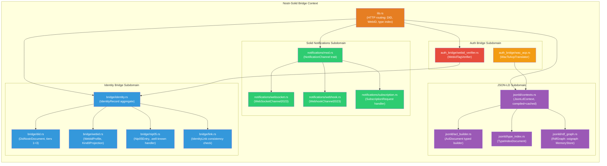
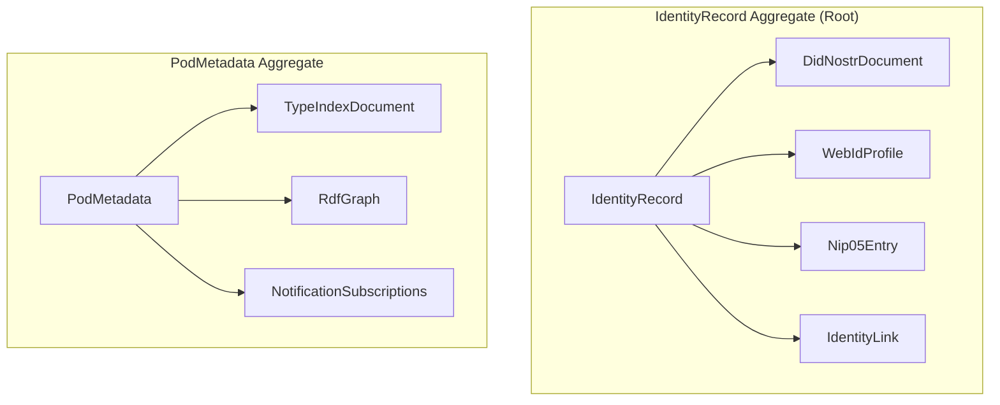
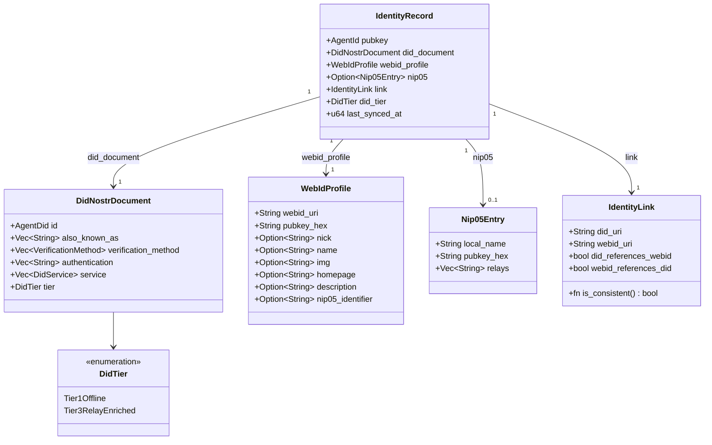
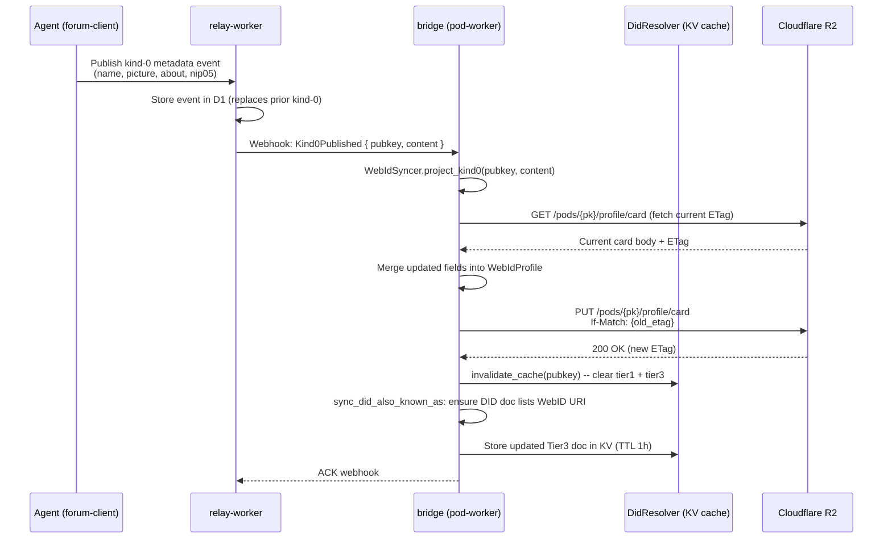
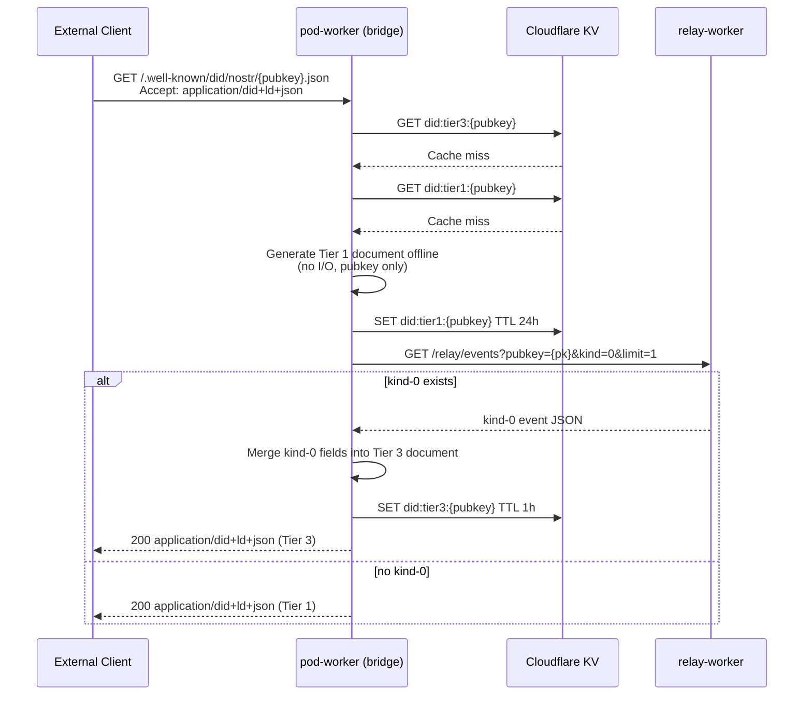
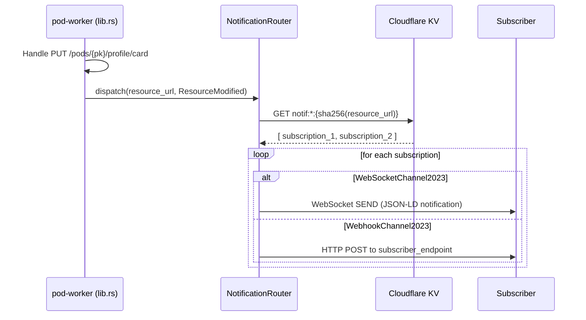
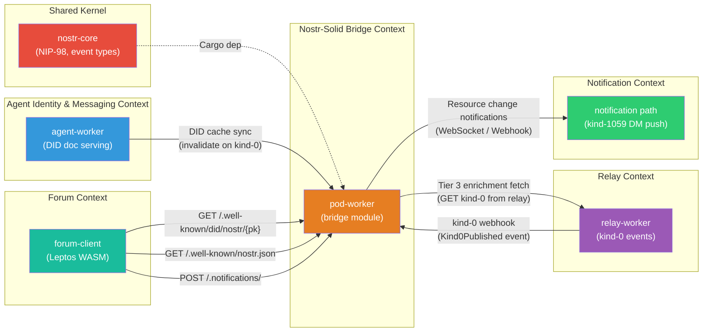

# Nostr-Solid Bridge Bounded Context

**Last updated:** 2026-05-06 | [Back to DDD Index](README.md) | [Back to Documentation Index](../README.md)

This document defines the Nostr-Solid Bridge bounded context for the DreamLab community platform. It manages the translation, synchronisation, and conformance layer between the Nostr event graph and the Solid Linked Data world. Responsibilities include bidirectional identity resolution (`did:nostr:` ↔ WebID), kind-0 event projection to RDF WebID profiles, JSON-LD context compilation, Solid notification channels, the `WebIdTagVerifier` NIP-98 extension, and the long-term WAC-to-ACP migration path. This context lives primarily in `pod-worker`, with DID document serving shared with `agent-worker`.

> **Status (2026-06-12):** partially delivered. The kit's `nostr-bbs-pod-worker` ships the identity/JSON-LD/notification pieces in a flat layout (`did.rs`, `webid.rs`, `nip05_endpoint.rs`, `contexts.rs`, `notifications.rs`, TypeIndex provisioning in `provision.rs`) rather than the `bridge/` / `jsonld/` / `notifications/` / `auth_bridge/` module tree diagrammed below. The `WebIdTagVerifier` NIP-98 extension and the WAC→ACP translator are **aspirational — not implemented**, and `agent-worker` does not exist (see [08-agent-identity-messaging-context.md](08-agent-identity-messaging-context.md)).

> **DID-doc shape superseded (2026-06-15) by ADR-125.** The DID-document model
> in this context (the `DidTier` Tier-1/Tier-3 split, the
> `SchnorrSecp256k1VerificationKey2019` + `publicKeyHex` verification method, and
> the `https://www.w3.org/ns/did/v1` / `secp256k1-2019` `@context`) is replaced by
> the converged did:nostr CG / `create-agent` single canonical form:
> `@context` `["https://w3id.org/did","https://w3id.org/nostr/context"]`,
> top-level `"type": "DIDNostr"`, one `"type": "Multikey"` verification method with
> `publicKeyMultibase` = `fe70102` + the same 64-char x-only hex, fragment `#key1`,
> and `authentication`/`assertionMethod` `["#key1"]`. There is **no Tier-1/Tier-3
> dual-publish** — a single document is served. The `did:nostr:<hex>` identifier
> string, the hex pubkey identity, and the NIP-98 Schnorr auth path (which verifies
> against the raw event pubkey and **never reads** the DID-doc verification method)
> are **unchanged**. The `DidTier`/`Tier3RelayEnriched` and
> `VerificationMethod { public_key_hex }` shapes below are retained as historical
> design notes only; see [ADR-027](../adr/027-canonical-identity-stack.md) and the
> backend `ADR-125-did-nostr-multikey-convergence.md` for the binding spec.

## Context Overview



## Bounded Context

### Scope

The Nostr-Solid Bridge context owns:

- `did:nostr:` DID document creation, caching, and resolution (two completeness tiers)
- WebID profile document creation and synchronisation from Nostr kind-0 events
- `IdentityLink` consistency: `alsoKnownAs` in DID ↔ `nostr:pubkey` in WebID
- NIP-05 `.well-known/nostr.json` entries as bridge to human-readable identifiers
- Compilation and caching of JSON-LD context documents for ACL and profile resources
- Typed `AclDocument` builder (replacing string-template ACL generation)
- `TypeIndexDocument` creation at pod provisioning time
- Solid Notification channel subscription handling (WebSocket and Webhook)
- `WebIdTagVerifier`: NIP-98 extension allowing Solid servers to accept Nostr auth without pre-registration
- `WacToAcpTranslator`: future migration path from WAC to ACP

### Responsibilities

| Responsibility | Owner | Notes |
|----------------|-------|-------|
| DID document serving at `/.well-known/did/nostr/{pubkey}.json` | `bridge/did.rs` | Tier 1 offline, Tier 3 relay-enriched; KV TTL 1 hour |
| WebID profile sync on kind-0 publication | `bridge/webid.rs` | `Kind0Projection` maps kind-0 JSON fields to RDF triples |
| NIP-05 `.well-known/nostr.json` | `bridge/nip05.rs` | Serves name→pubkey map from D1 |
| `IdentityLink` bidirectionality check | `bridge/link.rs` | Validates DID `alsoKnownAs` contains WebID URI and vice versa |
| JSON-LD context compilation | `jsonld/contexts.rs` | Four contexts pre-compiled via `include_str!()` |
| Typed ACL document construction | `jsonld/acl_builder.rs` | Replaces string-template ACL generation in pod-worker |
| TypeIndex document creation | `jsonld/type_index.rs` | Created at pod provisioning (currently missing) |
| SPARQL queries over pod metadata | `jsonld/rdf_graph.rs` | oxigraph MemoryStore, in-worker only |
| Notification channel subscriptions | `notifications/` | WebSocket and Webhook channel types per Solid Notifications Protocol 0.2 |
| WebID-tag NIP-98 verification | `auth_bridge/webid_verifier.rs` | Fetches DID/WebID to resolve pubkey before verifying signature |
| WAC→ACP policy translation | `auth_bridge/wac_acp.rs` | Migration utility; not on hot path |

### External Dependencies

| Dependency | Direction | Mechanism |
|------------|-----------|-----------|
| `nostr-core` | Upstream | Cargo — NIP-98 verification, event types, hex pubkey handling |
| `relay-worker` | Downstream | Internal fetch — fetch kind-0 event for Tier 3 DID enrichment |
| `pod-worker` | Self (same crate) | Direct module call — read/write WebID profile card and type index |
| `agent-worker` | Peer | HTTP — DID document cache coordination |
| Cloudflare KV | Infrastructure | `POD_META` binding — DID document cache, NIP-05 name map |
| Cloudflare D1 | Infrastructure | `POD_DB` binding — NIP-05 name registrations |
| `json-ld` 0.21.4 | Cargo | JSON-LD context compilation, expansion, and compaction |
| `oxigraph` (MemoryStore) | Cargo | In-memory RDF graph for SPARQL queries over pod metadata |

## Aggregates

### Aggregate Overview



### 1. IdentityRecord Aggregate (Root)

**Root entity**: `IdentityRecord`
**Crate**: `pod-worker` (`bridge` module)

The IdentityRecord aggregate maintains the consistent state of all identity representations for a single Nostr pubkey. It is the root through which DID documents, WebID profiles, NIP-05 entries, and the bidirectional link between them are managed. Consistency is enforced here: the DID and WebID must always agree on the agent's pubkey.



```rust
/// Aggregate root: all identity representations for one Nostr pubkey.
/// Consistency boundary: DID doc, WebID profile, and NIP-05 entry must
/// agree on the agent's pubkey at all times.
pub struct IdentityRecord {
    /// The canonical agent identity.
    pub pubkey: AgentId,
    /// The current DID document (Tier 1 or Tier 3).
    pub did_document: DidNostrDocument,
    /// The Solid WebID profile at `/pods/{pubkey}/profile/card`.
    pub webid_profile: WebIdProfile,
    /// The NIP-05 human-readable identifier entry, if registered.
    pub nip05: Option<Nip05Entry>,
    /// Bidirectional link state between DID and WebID.
    pub link: IdentityLink,
    /// Completeness tier of the DID document.
    pub did_tier: DidTier,
    /// When this record was last synchronised with live data sources.
    pub last_synced_at: u64,
}

/// Tier of completeness for a did:nostr: document.
#[derive(Debug, Clone, Copy, PartialEq, Eq)]
pub enum DidTier {
    /// Tier 1: generated from the pubkey alone, no relay data required.
    /// Contains only `verificationMethod` + minimal `service` entries.
    Tier1Offline,
    /// Tier 3: augmented with kind-0 profile data from relay-worker.
    /// Contains `alsoKnownAs`, `service` endpoints, and NIP-05 identifier.
    Tier3RelayEnriched,
}

/// The did:nostr: DID document per the W3C Nostr CG DID Method draft.
pub struct DidNostrDocument {
    /// The DID: `did:nostr:{hex-pubkey}`.
    pub id: AgentDid,
    /// Other URIs for this identity (e.g. the WebID URI, NIP-05 identifier URI).
    pub also_known_as: Vec<String>,
    /// Cryptographic verification methods.
    pub verification_method: Vec<VerificationMethod>,
    /// Keys permitted for authentication (DID fragment references).
    pub authentication: Vec<String>,
    /// Service endpoints (Solid pod, Nostr relay, NIP-05 provider).
    pub service: Vec<DidService>,
    /// Tier of completeness.
    pub tier: DidTier,
}

/// A Solid WebID profile card.
/// Stored as JSON-LD at `/pods/{pubkey}/profile/card`.
/// `foaf:` and `schema:` vocabularies; `nostr:pubkey` custom property.
pub struct WebIdProfile {
    /// The WebID URI: `https://pods.dreamlab-ai.com/{pubkey}/profile/card#me`.
    pub webid_uri: String,
    /// 64-char hex Nostr pubkey.
    pub pubkey_hex: String,
    /// `foaf:nick` — Nostr kind-0 `name` field.
    pub nick: Option<String>,
    /// `foaf:name` — Nostr kind-0 `display_name` field.
    pub name: Option<String>,
    /// `foaf:img` — Nostr kind-0 `picture` field (URL).
    pub img: Option<String>,
    /// `foaf:homepage` — Nostr kind-0 `website` field.
    pub homepage: Option<String>,
    /// `schema:description` — Nostr kind-0 `about` field.
    pub description: Option<String>,
    /// `schema:identifier` — Nostr kind-0 `nip05` field.
    pub nip05_identifier: Option<String>,
}

/// A NIP-05 `.well-known/nostr.json` name entry.
pub struct Nip05Entry {
    /// The local part of the NIP-05 identifier (before the `@`).
    pub local_name: String,
    /// 64-char hex pubkey.
    pub pubkey_hex: String,
    /// Preferred relay URLs for this pubkey (the `relays` key in the JSON).
    pub relays: Vec<String>,
}

/// Bidirectional link state between the DID document and the WebID profile.
pub struct IdentityLink {
    /// The DID URI: `did:nostr:{pubkey_hex}`.
    pub did_uri: String,
    /// The WebID URI: `https://pods.dreamlab-ai.com/{pubkey}/profile/card#me`.
    pub webid_uri: String,
    /// Whether the DID document's `alsoKnownAs` contains the WebID URI.
    pub did_references_webid: bool,
    /// Whether the WebID profile's `nostr:pubkey` resolves to the same DID.
    pub webid_references_did: bool,
}

impl IdentityLink {
    /// An `IdentityLink` is consistent only when both references are present.
    /// This invariant is enforced by `IdentityRecord` after every update.
    pub fn is_consistent(&self) -> bool {
        self.did_references_webid && self.webid_references_did
    }
}
```

**Invariants**:
- `did_document.id.pubkey_hex() == webid_profile.pubkey_hex`. The pubkey can never differ between representations.
- `link.is_consistent()` must be true after any mutation to either the DID document or the WebID profile.
- `nip05.pubkey_hex == pubkey.hex()` when `nip05.is_some()`.
- The `webid_uri` in `link` must be the canonical URI: `https://pods.dreamlab-ai.com/{pubkey_hex}/profile/card#me`. No other forms are accepted.
- A Tier 1 document must be generatable offline (no I/O). Upgrading to Tier 3 requires a relay-worker fetch; the Tier 1 document remains valid as a fallback.

**Commands**: CreateIdentityRecord, UpdateWebIdFromKind0, RegisterNip05, UpgradeDidToTier3, InvalidateDidCache.

### 2. PodMetadata Aggregate

**Root entity**: `PodMetadata`
**Crate**: `pod-worker` (`bridge` module)

The PodMetadata aggregate groups the structural metadata of a pod: its type index documents (for Solid app interoperability), the in-memory RDF graph for SPARQL queries, and the set of active Solid Notification subscriptions.

```rust
/// Aggregate: structural metadata for a Solid pod.
/// Complements the Pod aggregate (which owns storage resources and ACLs).
pub struct PodMetadata {
    /// Owner's pubkey.
    pub owner: AgentId,
    /// Public type index (`solid:publicTypeIndex`), created at pod provisioning.
    /// Points to publicly accessible resources grouped by RDF type.
    pub public_type_index: TypeIndexDocument,
    /// Private type index (`solid:privateTypeIndex`), created at pod provisioning.
    /// Points to owner-only resources grouped by RDF type.
    pub private_type_index: TypeIndexDocument,
    /// In-memory RDF graph loaded from pod metadata resources.
    /// Populated on first SPARQL query; evicted after request ends.
    pub rdf_graph: RdfGraph,
    /// Active Solid Notification channel subscriptions for this pod.
    pub subscriptions: Vec<NotificationSubscription>,
}

/// A Solid type index document (public or private).
/// Lists pod resources grouped by their RDF type.
pub struct TypeIndexDocument {
    /// The resource URL: `https://pods.dreamlab-ai.com/{pk}/profile/publicTypeIndex`.
    pub url: String,
    /// Whether this index is publicly readable.
    pub is_public: bool,
    /// Registered type entries.
    pub entries: Vec<TypeIndexEntry>,
}

/// A single entry in a type index document.
pub struct TypeIndexEntry {
    /// The RDF type URI (e.g. `http://schema.org/Person`).
    pub rdf_type: String,
    /// URL of the pod resource containing instances of this type.
    pub instance_container: String,
}

/// An in-memory oxigraph MemoryStore wrapping pod metadata for SPARQL.
/// Not persisted; reconstructed from R2 resources on demand.
pub struct RdfGraph(oxigraph::MemoryStore);

impl RdfGraph {
    /// Load RDF triples from a Turtle resource body.
    pub fn load_turtle(&mut self, turtle_body: &str) -> Result<(), BridgeError> { ... }
    /// Execute a SPARQL SELECT query and return bindings as JSON.
    pub fn query(&self, sparql: &str) -> Result<serde_json::Value, BridgeError> { ... }
}
```

**Invariants**:
- Both `public_type_index` and `private_type_index` must be created during pod provisioning. Missing type indexes are a pod integrity error.
- `rdf_graph` is ephemeral — it must never be persisted to R2 or KV. It is reconstructed per-request.
- A `NotificationSubscription` for a resource URL that no longer exists in R2 is stale and must be pruned on the next subscription listing.

**Commands**: CreateTypeIndexes, AddTypeIndexEntry, CreateNotificationSubscription, DeleteNotificationSubscription, QueryPodRdf.

## Domain Services

### 1. DidResolver

Resolves `did:nostr:` URIs to DID documents at the appropriate completeness tier.

```rust
/// Resolves did:nostr: identifiers to DID documents.
pub trait DidResolver {
    /// Resolve a did:nostr: URI to a Tier 1 (offline) document.
    /// Checks KV cache first (`did:tier1:{pubkey_hex}`); generates if absent.
    /// Never performs I/O beyond KV.
    async fn resolve_tier1(
        &self,
        did: &AgentDid,
    ) -> Result<DidNostrDocument, BridgeError>;

    /// Resolve a did:nostr: URI to a Tier 3 (relay-enriched) document.
    /// 1. Check KV cache (`did:tier3:{pubkey_hex}`, TTL 1 hour).
    /// 2. On miss: fetch kind-0 event from relay-worker.
    /// 3. Merge kind-0 fields into the Tier 1 base document.
    /// 4. Store result in KV with 1-hour TTL.
    async fn resolve_tier3(
        &self,
        did: &AgentDid,
    ) -> Result<DidNostrDocument, BridgeError>;

    /// Invalidate both tier caches for a pubkey.
    /// Called when a kind-0 event is published by the agent.
    async fn invalidate_cache(&self, pubkey: &AgentId) -> Result<(), BridgeError>;
}
```

### 2. WebIdSyncer

Synchronises a WebID profile card from a Nostr kind-0 metadata event.

```rust
/// Synchronises WebID profiles from Nostr kind-0 events.
pub trait WebIdSyncer {
    /// Project a Nostr kind-0 event's content JSON onto a WebIdProfile.
    /// Field mapping (kind-0 JSON key → RDF predicate):
    ///   `name`         → `foaf:nick`
    ///   `display_name` → `foaf:name`
    ///   `picture`      → `foaf:img`
    ///   `website`      → `foaf:homepage`
    ///   `about`        → `schema:description`
    ///   `nip05`        → `schema:identifier`
    fn project_kind0(
        &self,
        pubkey_hex: &str,
        kind0_content: &str,
    ) -> Result<WebIdProfile, BridgeError>;

    /// Write the updated WebID profile to R2 at `/pods/{pubkey}/profile/card`.
    /// Serialises the WebIdProfile as JSON-LD using the `foaf:`, `schema:`, and
    /// custom `nostr:` contexts. Uses ETag precondition to prevent lost updates.
    async fn write_webid_to_pod(
        &self,
        profile: &WebIdProfile,
        if_match: Option<&str>,
    ) -> Result<String, BridgeError>; // returns new ETag

    /// Ensure the DID document's `alsoKnownAs` array contains the WebID URI.
    /// Called after `write_webid_to_pod` to maintain IdentityLink consistency.
    async fn sync_did_also_known_as(
        &self,
        identity: &mut IdentityRecord,
    ) -> Result<(), BridgeError>;
}
```

### 3. JsonLdCompiler

Compiles and caches JSON-LD context documents. Contexts are embedded at compile time via `include_str!()` macros and never fetched over the network during request handling (no context dereferencing at runtime).

```rust
/// Compiles and provides cached JSON-LD context documents.
pub trait JsonLdCompiler {
    /// Return the pre-compiled WAC context (acl: prefix).
    fn wac_context(&self) -> &JsonLdContext;
    /// Return the pre-compiled FOAF context (foaf: prefix).
    fn foaf_context(&self) -> &JsonLdContext;
    /// Return the pre-compiled Solid context (solid: prefix).
    fn solid_context(&self) -> &JsonLdContext;
    /// Return the pre-compiled did:nostr: context (nostr: prefix).
    fn nostr_did_context(&self) -> &JsonLdContext;
    /// Compact a JSON-LD document against a context.
    fn compact(
        &self,
        document: &serde_json::Value,
        context: &JsonLdContext,
    ) -> Result<serde_json::Value, BridgeError>;
    /// Expand a JSON-LD document to flattened triples.
    fn expand(
        &self,
        document: &serde_json::Value,
    ) -> Result<Vec<RdfTriple>, BridgeError>;
}

/// A compiled, immutable JSON-LD context document.
pub struct JsonLdContext {
    /// The URL this context is authoritative for.
    pub url: JsonLdContextUrl,
    /// The compiled context object.
    pub document: serde_json::Value,
}
```

**Embedded contexts** (in `jsonld/contexts.rs`):

```rust
static WAC_CONTEXT: &str = include_str!("../../contexts/wac.jsonld");
static FOAF_CONTEXT: &str = include_str!("../../contexts/foaf.jsonld");
static SOLID_CONTEXT: &str = include_str!("../../contexts/solid.jsonld");
static NOSTR_DID_CONTEXT: &str = include_str!("../../contexts/nostr-did.jsonld");
```

### 4. AclBuilder

Constructs `AclDocument` instances through a typed builder rather than string templating. Eliminates the class of bugs where malformed JSON-LD ACL strings are written to KV.

```rust
/// Typed builder for WAC AclDocument instances.
/// Replaces the string-template approach in pod-worker's provision.rs.
pub struct AclBuilder {
    authorizations: Vec<AclAuthorization>,
}

impl AclBuilder {
    pub fn new() -> Self { Self { authorizations: vec![] } }

    /// Grant the given agent (did:nostr: URI or foaf:Agent) the specified modes
    /// on the given resource path. `default: true` makes the rule heritable by
    /// child resources within a container.
    pub fn grant(
        mut self,
        agent: AgentOrClass,
        modes: &[AccessMode],
        access_to: &str,
        default: bool,
    ) -> Self { ... }

    /// Build the final AclDocument. Returns Err if no authorizations were added.
    pub fn build(self) -> Result<AclDocument, BridgeError> { ... }
}

/// The target of an ACL authorization entry.
pub enum AgentOrClass {
    /// A specific agent by DID URI (e.g. `did:nostr:{pubkey_hex}`).
    Agent(String),
    /// All agents (`foaf:Agent`).
    Public,
    /// All authenticated agents (`acl:AuthenticatedAgent`).
    Authenticated,
}
```

### 5. NotificationRouter

Handles Solid Notification channel subscriptions and dispatches notifications when subscribed resources change.

```rust
/// Manages Solid Notification channel subscriptions and dispatches.
pub trait NotificationRouter {
    /// Handle a subscription request (POST to the subscription service endpoint).
    /// Validates the `topic` URI is within a pod the requester owns or has Read access to.
    /// Stores the subscription in KV at `notif:{channel_type}:{sha256(topic)}`.
    async fn create_subscription(
        &self,
        requester: &AgentId,
        request: &SubscriptionRequest,
    ) -> Result<NotificationSubscription, BridgeError>;

    /// Dispatch a notification for a changed resource to all active subscribers.
    /// Called from pod-worker after any write (ResourceCreated, ResourceModified, ResourceDeleted).
    async fn dispatch(
        &self,
        resource_url: &str,
        event_type: NotificationEventType,
    ) -> Result<(), BridgeError>;

    /// List active subscriptions for a pod owner.
    async fn list_subscriptions(
        &self,
        owner: &AgentId,
    ) -> Result<Vec<NotificationSubscription>, BridgeError>;

    /// Delete a subscription.
    async fn delete_subscription(
        &self,
        owner: &AgentId,
        subscription_id: &str,
    ) -> Result<(), BridgeError>;
}

/// A Solid Notification channel subscription.
pub struct NotificationSubscription {
    pub id: String,
    pub channel_type: NotificationChannelType,
    pub topic: String,
    pub subscriber_endpoint: Option<String>, // only for WebhookChannel2023
    pub created_at: u64,
    pub expires_at: Option<u64>,
}

#[derive(Debug, Clone, PartialEq, Eq)]
pub enum NotificationChannelType {
    WebSocketChannel2023,
    WebhookChannel2023,
}

#[derive(Debug, Clone, PartialEq, Eq)]
pub enum NotificationEventType {
    ResourceCreated,
    ResourceModified,
    ResourceDeleted,
    ContainerMemberAdded,
    ContainerMemberRemoved,
}

/// A Solid Notification subscription request body.
/// POST to `https://pods.dreamlab-ai.com/.notifications/` (discovery via Link header).
pub struct SubscriptionRequest {
    pub channel_type: NotificationChannelType,
    pub topic: String,
    /// Required for WebhookChannel2023. Optional for WebSocketChannel2023
    /// (the response provides the WebSocket URL instead).
    pub subscriber: Option<String>,
}
```

### 6. WebIdTagVerifier

Extends NIP-98 token verification to support Solid servers accepting Nostr auth without pre-registering the agent. When an event has a `["webid", uri]` tag, the verifier fetches the WebID/DID document, extracts the `nostr:pubkey` property, and checks it matches the event's pubkey.

```rust
/// NIP-98 verifier extension for WebID-tagged authentication.
/// Enables Solid servers to accept NIP-98 auth for any agent whose
/// WebID document links to a Nostr pubkey -- no pre-registration required.
pub struct WebIdTagVerifier {
    /// The standard NIP-98 verifier (from nostr-core::nip98).
    inner: nostr_core::nip98::Nip98Verifier,
    /// Did resolver for fetching and caching DID documents.
    did_resolver: Box<dyn DidResolver>,
}

impl WebIdTagVerifier {
    /// Verify a NIP-98 token that includes a `["webid", uri]` tag.
    ///
    /// Algorithm:
    /// 1. Perform standard NIP-98 verification (signature, URL match, timestamp).
    /// 2. Extract the `["webid", uri]` tag from the inner event.
    /// 3. Fetch the WebID/DID document at `uri` (cache-first via KV).
    /// 4. Extract `nostr:pubkey` (or `did:nostr:` alsoKnownAs) from the document.
    /// 5. Assert extracted pubkey == event.pubkey.
    /// 6. Return the verified subject as `VerifiedSubject::WebId { did, webid_uri }`.
    pub async fn verify_webid_tagged(
        &self,
        authorization_header: &str,
        request_url: &str,
        request_method: &str,
    ) -> Result<VerifiedSubject, BridgeError> { ... }
}

/// The verified identity of a request sender after NIP-98 authentication.
#[derive(Debug, Clone)]
pub enum VerifiedSubject {
    /// Standard NIP-98 verification: only the pubkey is known.
    Pubkey(AgentId),
    /// WebID-tag verification: both DID and WebID URI are confirmed consistent.
    WebId {
        did: AgentDid,
        webid_uri: String,
    },
}
```

### 7. WacToAcpTranslator

Translates existing WAC ACL documents to ACP policies. This is the future migration path — not on the hot path today.

```rust
/// Translates WAC 1.x ACL documents to ACP policies.
/// WAC: `acl:Authorization` entries with `acl:agent`, `acl:mode`, `acl:accessTo`.
/// ACP: `acp:Policy` with separate `acp:Matcher` blocks; supports did:nostr: as agent IRI.
pub trait WacToAcpTranslator {
    /// Convert a WAC AclDocument to an ACP Policy document.
    /// Mapping:
    ///   `acl:Authorization` → `acp:Policy`
    ///   `acl:agent {did}` → `acp:Matcher` { `acp:agent {did}` }
    ///   `acl:agentClass foaf:Agent` → `acp:Matcher` { `acp:agent acp:PublicAgent` }
    ///   `acl:mode acl:Read` → `acp:allow acl:Read`
    ///   `acl:default` → `acp:context` with `acp:target acp:AllResources`
    fn translate(
        &self,
        wac_doc: &AclDocument,
        resource_url: &str,
    ) -> Result<serde_json::Value, BridgeError>;

    /// Validate that the translated ACP policy grants equivalent access
    /// to the original WAC document for a set of test cases.
    fn validate_equivalence(
        &self,
        wac_doc: &AclDocument,
        acp_doc: &serde_json::Value,
        test_cases: &[AclTestCase],
    ) -> bool;
}

/// A test case for ACL/ACP equivalence validation.
pub struct AclTestCase {
    pub agent: Option<String>,
    pub mode: AccessMode,
    pub resource_path: String,
    pub expected_result: bool,
}
```

## Domain Events

| Event | Trigger | Payload | Consumers |
|-------|---------|---------|-----------|
| `DidDocumentRequested` | GET `/.well-known/did/nostr/{pubkey}.json` | `{ pubkey, tier_requested, cache_hit }` | KV cache metrics |
| `WebIdProfileUpdated` | kind-0 event published by agent | `{ pubkey, updated_fields, new_etag }` | DidResolver cache invalidation, IdentityLink consistency check |
| `Kind0Published` | relay-worker forwards kind-0 event to bridge | `{ event_id, pubkey, content_json }` | WebIdSyncer (project to WebID), DidResolver (upgrade to Tier 3) |
| `SubscriptionCreated` | POST to `/.notifications/` | `{ subscription_id, channel_type, topic, created_at }` | KV storage write |
| `SubscriptionDeleted` | DELETE to `/.notifications/{id}` | `{ subscription_id, deleted_at }` | KV deletion, WebSocket close (if applicable) |
| `TypeIndexCreated` | Pod provisioning | `{ pubkey, public_index_url, private_index_url }` | pod-worker provisioning completion event |
| `ResourceNotificationDispatched` | Any pod resource write | `{ resource_url, event_type, subscriber_count }` | Notification Context, forum-client (WebSocket push) |
| `IdentityLinkInconsistency` | IdentityLink.is_consistent() returns false | `{ pubkey, did_has_webid, webid_has_did }` | Admin alert, automatic repair attempt |

### Event Flow: kind-0 Published → WebID Updated



### Event Flow: DID Resolution (Cache Miss)



### Event Flow: Solid Notification Dispatch



## Value Objects

```rust
/// A canonical did:nostr: URI. Immutable once constructed.
#[derive(Debug, Clone, PartialEq, Eq, Hash)]
pub struct AgentDid(String); // "did:nostr:{64-char-hex}"

/// A WebID URI. Must be an HTTPS URL with a fragment (#me by convention).
#[derive(Debug, Clone, PartialEq, Eq)]
pub struct WebIdUri(String);

impl WebIdUri {
    pub fn new(uri: &str) -> Result<Self, BridgeError> {
        if uri.starts_with("https://") && uri.contains('#') {
            Ok(Self(uri.to_string()))
        } else {
            Err(BridgeError::InvalidWebIdUri(uri.to_string()))
        }
    }
    pub fn document_url(&self) -> &str {
        // The URL without the fragment.
        self.0.split('#').next().unwrap()
    }
}

/// The URL of a JSON-LD context document. Used to key the compile cache.
#[derive(Debug, Clone, PartialEq, Eq, Hash)]
pub struct JsonLdContextUrl(String);

/// A stable identifier for an ACL sidecar document.
/// Format: `{pod_pubkey_hex}:{resource_path}/.acl`
#[derive(Debug, Clone, PartialEq, Eq, Hash)]
pub struct AclDocumentId(String);

/// A single RDF triple (subject IRI, predicate IRI, object IRI or literal).
#[derive(Debug, Clone, PartialEq, Eq)]
pub struct RdfTriple {
    pub subject: String,
    pub predicate: String,
    pub object: RdfObject,
}

/// The object component of an RDF triple.
#[derive(Debug, Clone, PartialEq, Eq)]
pub enum RdfObject {
    Iri(String),
    Literal { value: String, datatype: Option<String>, language: Option<String> },
}
```

## Ubiquitous Language

| Term | Definition |
|------|------------|
| **did:nostr:** | The W3C DID method for Nostr public keys. Format: `did:nostr:{hex-pubkey}`. Resolves to a DID document containing the secp256k1 verification key and optional service endpoints. |
| **DID Document** | A JSON-LD document that describes an agent's cryptographic keys and service endpoints. Served at `/.well-known/did/nostr/{pubkey}.json`. |
| **Tier 1 DID** | A minimal DID document generated from the pubkey alone, with no relay data. Always generatable offline. Contains only `verificationMethod` and a Solid pod service endpoint. |
| **Tier 3 DID** | A relay-enriched DID document that additionally includes `alsoKnownAs` (WebID URI), `service` endpoints from kind-0 data, and the NIP-05 identifier. Cached with a 1-hour TTL. |
| **WebID** | A dereferenceable HTTPS URI identifying an agent. In DreamLab: `https://pods.dreamlab-ai.com/{pubkey}/profile/card#me`. Contains `nostr:pubkey` linking back to the DID. |
| **IdentityLink** | The bidirectional mapping between a DID document and a WebID profile. Consistent when the DID's `alsoKnownAs` contains the WebID URI AND the WebID's `nostr:pubkey` resolves to the DID. |
| **NIP-05 Entry** | A record in `.well-known/nostr.json` mapping a human-readable local name to a pubkey. Bridges between Nostr protocol identity and DNS-based human-readable names. |
| **Kind0Projection** | The process of mapping a Nostr kind-0 metadata event's JSON content onto RDF triples in the WebID profile. Field mapping: `name` → `foaf:nick`, `display_name` → `foaf:name`, `picture` → `foaf:img`, `website` → `foaf:homepage`, `about` → `schema:description`, `nip05` → `schema:identifier`. |
| **JSON-LD Context** | A document that maps compact terms (e.g. `acl:`, `foaf:`) to full IRI namespaces. In DreamLab, contexts are embedded at compile time via `include_str!()` macros; no context is fetched at runtime. |
| **AclDocument (typed)** | An `AclDocument` value built via `AclBuilder`, not assembled from string templates. Guarantees the resulting JSON-LD is structurally valid before it is stored in KV. |
| **TypeIndexDocument** | A Solid resource listing a pod's data by RDF type. `solid:publicTypeIndex` is world-readable; `solid:privateTypeIndex` is owner-only. Created at pod provisioning; currently missing. |
| **RdfGraph** | An in-memory oxigraph `MemoryStore` containing RDF triples from pod metadata resources, usable for SPARQL SELECT queries within a single request. Never persisted. |
| **NotificationChannel** | An abstract delivery mechanism for Solid resource change notifications. Two implementations: `WebSocketChannel2023` (push via relay WebSocket) and `WebhookChannel2023` (HTTP POST to subscriber URL). |
| **SubscriptionRequest** | A JSON-LD POST body to the subscription service endpoint declaring interest in change notifications for a specific resource URL. |
| **WebIdTagVerifier** | An extension to NIP-98 token verification. When the event includes a `["webid", uri]` tag, the verifier fetches the WebID/DID document, extracts the linked `nostr:pubkey`, and asserts it matches the event pubkey. Enables registration-free Solid auth. |
| **WAC** | Web Access Control. The current access control mechanism in pod-worker. Uses `acl:Authorization` entries in JSON-LD sidecar documents. |
| **ACP** | Access Control Policy. The successor to WAC. Uses separate `acp:Policy` and `acp:Matcher` resources; supports `did:nostr:` directly as an agent IRI. Target of the future migration. |
| **WacToAcpTranslator** | A domain service that converts existing WAC ACL documents to semantically equivalent ACP policy documents, enabling incremental pod migration. |
| **alsoKnownAs** | A DID document property listing other URIs that identify the same agent. The WebID URI is always present in the `alsoKnownAs` array of a Tier 3 DID document. |

## Anti-Corruption Layer

### Incoming Translations

| External Concept | Domain Type | Translation Location |
|-----------------|-------------|---------------------|
| NIP-98 `Authorization: Nostr <base64>` | `VerifiedSubject::Pubkey(AgentId)` or `VerifiedSubject::WebId { did, webid_uri }` | `auth_bridge/webid_verifier.rs::WebIdTagVerifier::verify_webid_tagged()` |
| kind-0 JSON content string | `WebIdProfile` | `bridge/webid.rs::Kind0Projection::project()` — parses `serde_json::Value`, maps field names to typed `WebIdProfile` struct fields |
| WAC JSON-LD string (from KV) | `AclDocument` (typed) | `jsonld/acl_builder.rs` — `serde_json::from_str::<AclDocument>()` then validate required fields; builder used for new writes |
| Solid SubscriptionRequest JSON-LD | `SubscriptionRequest` | `notifications/subscription.rs::parse_subscription_request()` — type-safe deserialization with `channel_type` enum mapping |
| `text/turtle` resource body | `Vec<RdfTriple>` | `jsonld/rdf_graph.rs::RdfGraph::load_turtle()` via oxigraph Turtle parser |
| SPARQL query string | `serde_json::Value` (bindings) | `jsonld/rdf_graph.rs::RdfGraph::query()` via oxigraph query engine |

### Outgoing Translations

| Domain Type | External Wire Format | Translation Location |
|-------------|---------------------|---------------------|
| `DidNostrDocument` | `application/did+ld+json` JSON-LD | `bridge/did.rs::serialize_did_document()` — uses `serde_json` with the embedded `nostr-did` context |
| `WebIdProfile` | JSON-LD at `/pods/{pk}/profile/card` | `bridge/webid.rs::serialize_webid_profile()` — serialises with `foaf:`, `schema:`, `nostr:` contexts |
| `Nip05Entry` | `{"names": {"localname": "hex"}, "relays": {...}}` | `bridge/nip05.rs::serialize_nostr_json()` |
| `AclDocument` (typed) | JSON-LD string for KV storage | `jsonld/acl_builder.rs::AclBuilder::build()::to_json_ld_string()` |
| `NotificationSubscription` | JSON-LD notification body | `notifications/mod.rs::build_notification_body()` — constructs AS2 `Update`/`Create`/`Delete` activity |
| `TypeIndexDocument` | Turtle resource at `/pods/{pk}/profile/publicTypeIndex` | `jsonld/type_index.rs::serialize_type_index()` — serialises as Turtle with `solid:` and `rdf:type` predicates |

### Anti-Corruption Boundary: relay-worker

The relay-worker delivers raw Nostr event JSON. The bridge context consumes it through a narrow translation interface:

```rust
/// The only interface through which the bridge context receives Nostr events.
/// Keeps relay-worker's raw JSON format from leaking into domain types.
pub struct NostrEventAdapter;

impl NostrEventAdapter {
    /// Extract kind-0 content and publish a Kind0Published domain event.
    pub fn adapt_kind0(raw_event: &serde_json::Value) -> Result<Kind0Published, BridgeError> {
        let pubkey = raw_event["pubkey"].as_str()
            .ok_or(BridgeError::MissingField("pubkey"))?;
        let content = raw_event["content"].as_str()
            .ok_or(BridgeError::MissingField("content"))?;
        Ok(Kind0Published {
            event_id: raw_event["id"].as_str().unwrap_or("").to_string(),
            pubkey: AgentId::from_hex(pubkey)?,
            content_json: content.to_string(),
        })
    }
}
```

## Target Module Structure

The Nostr-Solid Bridge context is implemented as a set of new modules within the existing `pod-worker` crate. No new crate is required; this avoids duplicating the R2/KV bindings and keeps the HTTP routing surface unified.

```
pod-worker/src/
  lib.rs                   HTTP routing additions:
                             GET /.well-known/did/nostr/{pubkey}.json
                             GET /.well-known/nostr.json
                             POST /.notifications/
                             DELETE /.notifications/{id}
                             GET /.notifications/{id}
  auth.rs                  Unchanged NIP-98 verifier; extended in auth_bridge/

  bridge/
    mod.rs                 IdentityRecord aggregate root; module pub re-exports
    identity.rs            IdentityRecord: CreateIdentityRecord, InvalidateDidCache
                           commands; ensures IdentityLink.is_consistent() after mutations
    did.rs                 DidNostrDocument struct; DidResolver trait;
                           Tier1/Tier3 generation and KV caching logic
                           (KV keys: `did:tier1:{pubkey_hex}`, `did:tier3:{pubkey_hex}`)
    webid.rs               WebIdProfile struct; Kind0Projection;
                           WebIdSyncer trait + implementation;
                           serialize_webid_profile() → JSON-LD with foaf:/schema:/nostr: contexts
    nip05.rs               Nip05Entry struct; D1 lookup by local name;
                           serialize_nostr_json() for .well-known/nostr.json response
    link.rs                IdentityLink struct; is_consistent(); repair_link()
                           (called when IdentityLinkInconsistency event is raised)

  jsonld/
    mod.rs                 JsonLdCompiler trait; pub re-exports
    contexts.rs            Static context files via include_str!():
                             static WAC_CONTEXT: &str = include_str!("../../contexts/wac.jsonld");
                             static FOAF_CONTEXT: &str = include_str!("../../contexts/foaf.jsonld");
                             static SOLID_CONTEXT: &str = include_str!("../../contexts/solid.jsonld");
                             static NOSTR_DID_CONTEXT: &str = include_str!("../../contexts/nostr-did.jsonld");
    acl_builder.rs         AclBuilder typed builder; AclDocument::to_json_ld_string();
                           replaces string-template ACL generation in provision.rs
    type_index.rs          TypeIndexDocument struct; TypeIndexEntry;
                           create_type_indexes() called from provision.rs (currently missing)
                           serialize_type_index() → Turtle with solid:/rdf:type predicates
    rdf_graph.rs           RdfGraph(oxigraph::MemoryStore); load_turtle(); query(sparql);
                           ephemeral per-request, never persisted

  notifications/
    mod.rs                 NotificationRouter trait; NotificationSubscription;
                           NotificationChannelType; dispatch() with KV fan-out
    websocket.rs           WebSocketChannel2023: Cloudflare Durable Object WebSocket
                           upgrade; notification push via DO send()
    webhook.rs             WebhookChannel2023: outbound HTTP POST to subscriber_endpoint;
                           retry on 5xx (max 3 attempts with exponential backoff)
    subscription.rs        SubscriptionRequest deserialization and validation;
                           KV storage layout: `notif:{channel_type}:{sha256(topic)}`

  auth_bridge/
    mod.rs                 pub re-exports
    webid_verifier.rs      WebIdTagVerifier struct; verify_webid_tagged();
                           VerifiedSubject enum (Pubkey | WebId)
                           Integrates into pod-worker auth.rs middleware chain
    wac_acp.rs             WacToAcpTranslator trait + implementation;
                           AclTestCase; validate_equivalence();
                           Not on hot path -- offline migration utility only

contexts/                  (new top-level directory in pod-worker crate root)
  wac.jsonld               WAC context: acl: → http://www.w3.org/ns/auth/acl#
  foaf.jsonld              FOAF context: foaf: → http://xmlns.com/foaf/0.1/
  solid.jsonld             Solid context: solid: → http://www.w3.org/ns/solid/terms#
  nostr-did.jsonld         Nostr DID context: nostr: → https://nostr.com/ns#
```

**Estimated size**: ~1,600 LOC across 16 new files. Major additions are `bridge/` (~450 LOC), `jsonld/` (~400 LOC), `notifications/` (~450 LOC), and `auth_bridge/` (~300 LOC).

## Integration Points



| Consumer | Provider | Mechanism | Notes |
|----------|----------|-----------|-------|
| pod-worker (bridge) | nostr-core | Cargo dep | NIP-98 verification, secp256k1 types |
| relay-worker | pod-worker (bridge) | HTTP POST webhook | Forwards kind-0 events for WebID sync |
| pod-worker (bridge) | relay-worker | Internal fetch | Fetches kind-0 for Tier 3 DID enrichment |
| agent-worker | pod-worker (bridge) | HTTP | DID document cache coordination; agent-worker may also serve DID docs and must agree on cache keys |
| forum-client | pod-worker (bridge) | HTTP (no auth required) | DID resolution, NIP-05 lookup, notification subscription management |
| pod-worker (bridge) | Notification Context | Internal event | Dispatches resource change notifications to subscribers |

## WAC-to-ACP Migration Path

The current `pod-worker` implements WAC 1.x. ACP introduces `acp:Policy`/`acp:Matcher` separation and can match `did:nostr:{pubkey}` directly as an agent IRI, eliminating the mapping layer.

Migration is not breaking: WAC and ACP can coexist in the same pod during transition.

| Stage | When | Action |
|-------|------|--------|
| **0 (now)** | Current | WAC 1.x; string-template ACL generation; no type indexes |
| **1** | Sprint +1 | Typed `AclBuilder` replaces all string-template writes; existing ACL docs unchanged |
| **2** | Sprint +2 | Type indexes created at pod provisioning; `WebIdTagVerifier` deployed in auth.rs |
| **3** | Sprint +3 | `WacToAcpTranslator` runs offline against existing pods; opt-in per-pod ACP flag in KV |
| **4** | Sprint +4 | New pods provisioned with ACP policies; WAC reader kept for backward compatibility |
| **5** | Future | WAC reader removed once all pods migrated |

## Related Documents

- [02 - Bounded Contexts](02-bounded-contexts.md) -- Context 4 (Storage) definition
- [03 - Aggregates](03-aggregates.md) -- Pod aggregate (root of storage hierarchy)
- [05 - Value Objects](05-value-objects.md) -- EventId, PublicKey, Tag value objects
- [06 - Ubiquitous Language](06-ubiquitous-language.md) -- Pod, WebID, WAC, DID definitions
- [07 - Solid Pod Storage Context](07-solid-pod-bounded-context.md) -- Parent context; ACL evaluation, provisioning, quota
- [08 - Agent Identity & Messaging Context](08-agent-identity-messaging-context.md) -- Agent DID, Signer, inbox
- [W3C DID Core Specification](https://www.w3.org/TR/did-core/)
- [Nostr CG DID Method Draft](https://github.com/nostr-protocol/nips/discussions/1095)
- [Solid Notifications Protocol 0.2](https://solid.github.io/notifications/protocol)
- [Web Access Control Specification](https://solid.github.io/web-access-control-spec/)
- [nostr-ld: Nostr Linked Data](https://github.com/nostrapps/nostr-ld)
