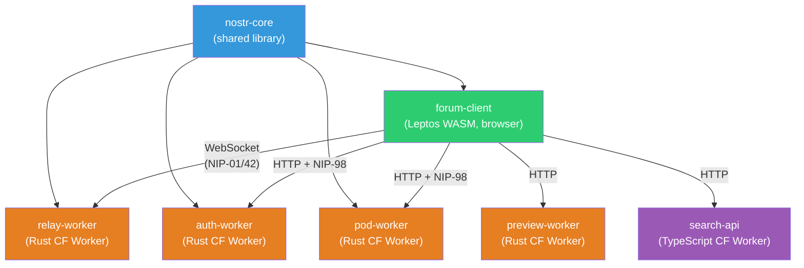
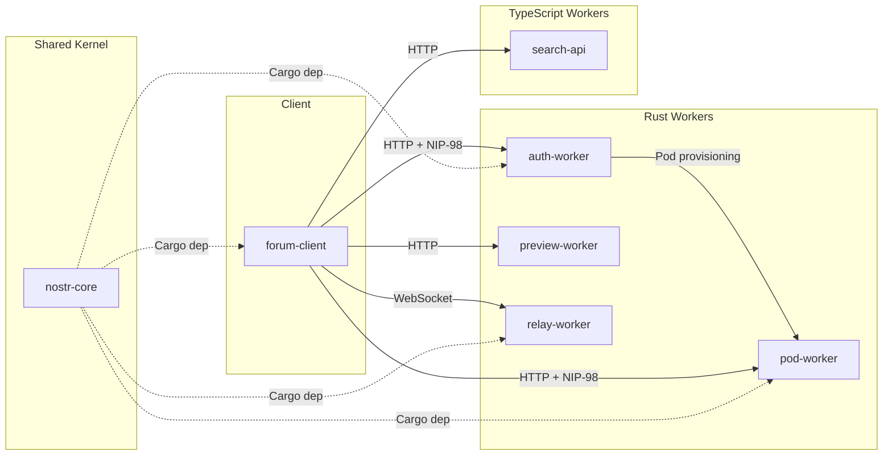

# DreamLab Community Forum -- Domain-Driven Design

**Last updated:** 2026-03-08 | [Back to Documentation Index](../README.md)

Domain-Driven Design documentation for the Rust port of the DreamLab community forum. These documents define the domain model, bounded contexts, aggregates, events, value objects, and shared vocabulary used across the 6-crate Rust workspace (`nostr-core`, `forum-client`, `auth-worker`, `pod-worker`, `preview-worker`, `relay-worker`) plus the two retained TypeScript Workers (`search-api`).

## Documents

| Document | Description |
|----------|-------------|
| [01 - Domain Model](01-domain-model.md) | Core entities: identity, authentication, community, messaging, content, storage. Rust type definitions for each. |
| [02 - Bounded Contexts](02-bounded-contexts.md) | Maps 7 bounded contexts to crates/Workers. Defines responsibilities, public modules, dependencies, and the anti-corruption layer. |
| [03 - Aggregates](03-aggregates.md) | Five aggregate roots: UserIdentity, Channel, Conversation, ForumThread, Pod. Invariants and commands for each. |
| [04 - Domain Events](04-domain-events.md) | Nostr protocol events (kind-typed signed data) and application-level domain events (state transitions). Event flow diagrams and NIP-59 gift wrap flow. |
| [05 - Value Objects](05-value-objects.md) | Immutable types: EventId, PublicKey, Signature, Timestamp, RoleId, ChannelVisibility, Nip44Ciphertext, GiftWrap, RelayUrl, Tag, SectionId, CategoryId. |
| [06 - Ubiquitous Language](06-ubiquitous-language.md) | Glossary of 60+ terms organized by domain area: Nostr protocol, DreamLab forum, authentication, Rust/Leptos. |

## Architecture Overview

## Bounded Context Map

## Crate-to-Context Mapping

| Crate | Bounded Context | Target | Language |
|-------|----------------|--------|----------|
| `nostr-core` | Nostr Core | wasm32 + native | Rust |
| `forum-client` | Forum Client | wasm32 only | Rust |
| `auth-worker` | Identity and Auth | CF Worker (wasm32) | Rust |
| `pod-worker` | Storage | CF Worker (wasm32) | Rust |
| `preview-worker` | Preview | CF Worker (wasm32) | Rust |
| `relay-worker` | Relay | CF Worker (wasm32) | Rust |
| `workers/search-api/` | Search | CF Worker (JS) | TypeScript |

## Related Documents

- [Documentation Index](../README.md)
- [ADR Index](../adr/README.md)
- [PRD: Rust Port v2.0.0](../prd-rust-port.md)
- [Getting Started](../developer/GETTING_STARTED.md)
