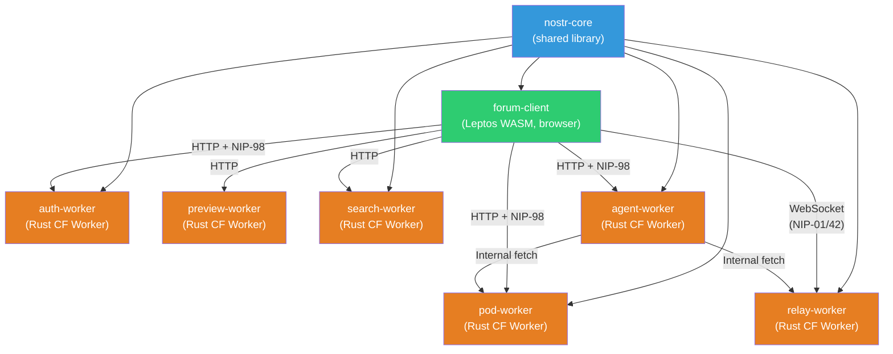
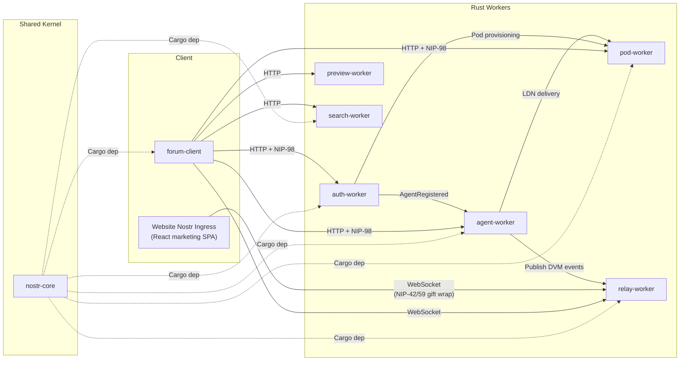

# DreamLab Community Forum -- Domain-Driven Design

**Last updated:** 2026-07-14 | [Back to Documentation Index](../README.md)

Domain-Driven Design documentation for the Rust port of the DreamLab community forum. These documents define the domain model, bounded contexts, aggregates, events, value objects, and shared vocabulary used across the 8-crate Rust workspace (`nostr-core`, `forum-client`, `auth-worker`, `pod-worker`, `preview-worker`, `relay-worker`, `search-worker`, `admin-cli`).

The 2026-04 Obelisk-Polish sprint added moderation (kinds 30910-30914), WoT gating, invite credits, welcome bot, and the `admin-cli` crate. See the [sprint spec](../sprint/2026-04-obelisk-polish-sprint.md).

The 2026-05-12 Governance sprint added the Agent Control Surface: a `/governance` route with kinds 31400-31405 for agent control panels, action requests, human approve/reject responses, governance policies, and audit logging. See [04-domain-events.md](04-domain-events.md#governance-domain-events-agent-control-surface) and the `[governance]` section in [forum-config/dreamlab.toml](../../forum-config/README.md#governance-configuration).

## Documents

| Document | Description |
|----------|-------------|
| [01 - Domain Model](01-domain-model.md) | Core entities: identity, authentication, community, messaging, content, storage. Rust type definitions for each. |
| [02 - Bounded Contexts](02-bounded-contexts.md) | Maps 7 bounded contexts to crates/Workers. Defines responsibilities, public modules, dependencies, and the anti-corruption layer. |
| [03 - Aggregates](03-aggregates.md) | Five aggregate roots: UserIdentity, Channel, Conversation, ForumThread, Pod. Invariants and commands for each. |
| [04 - Domain Events](04-domain-events.md) | Nostr protocol events (kind-typed signed data) and application-level domain events (state transitions). Event flow diagrams and NIP-59 gift wrap flow. |
| [05 - Value Objects](05-value-objects.md) | Immutable types: EventId, PublicKey, Signature, Timestamp, RoleId, ChannelVisibility, Nip44Ciphertext, GiftWrap, RelayUrl, Tag, SectionId, CategoryId. |
| [06 - Ubiquitous Language](06-ubiquitous-language.md) | Glossary of 60+ terms organized by domain area: Nostr protocol, DreamLab forum, authentication, Rust/Leptos. |
| [07 - Solid Pod Storage Context](07-solid-pod-bounded-context.md) | Full Solid Protocol bounded context: LDP containers, WAC ACL inheritance, quota enforcement, N3 Patch, WebID profile generation, pod provisioning. Target module structure for pod-worker upgrade from 898 to ~2,900 LOC. |
| [08 - Agent Identity & Messaging Context](08-agent-identity-messaging-context.md) | AI agent identity (`did:nostr:`), NIP-90 Data Vending Machine job protocol (kinds 5000-6999/7000), NIP-26 delegation tokens, Solid LDP inbox delivery, and the `Signer` trait abstraction. New `agent-worker` crate. |
| [09 - Nostr-Solid Bridge Context](09-nostr-solid-bridge-context.md) | Translation layer between Nostr events and Solid Linked Data: the converged single-form did:nostr DID document (`DIDNostr` / `Multikey` / `fe70102`, per ADR-125 — the Tier-1/Tier-3 split is superseded), kind-0 → WebID projection, typed AclBuilder, JSON-LD context compilation, Solid Notification channels, WebIdTagVerifier NIP-98 extension, and WAC→ACP migration path. |
| [10 - Gap-Close Edge Context](10-gap-close-edge-context.md) | DreamLab Edge's slice of the cross-repository gap-close sprint: kit cutover (REC-12), disclosure-badge/Agents-tab overlay posture, `dreamlab.toml` roster legibility, and the kit compatibility record. Governed by ADR-040. |
| [11 - Website Nostr Ingress Context](11-website-nostr-ingress-context.md) | The anonymous, website-originated write path onto the relay: contact-signup DMs to the human admin (operator-jjohare) and the serialised visitor chat session with junkiejarvis. Browser-side gift-wrap construction, chat session lifecycle, env plumbing. Governed by ADR-041/ADR-042. |

## Architecture Overview

> **Note:** crate names below are the logical DDD names; in the deployed kit (`nostr-rust-forum@25ca8a1`) they ship as `nostr-bbs-core`, `nostr-bbs-forum-client`, `nostr-bbs-{auth,pod,preview,relay,search}-worker`. The `agent-worker` node is **aspirational design — not implemented as of 2026-06-12** (no such crate exists; see [08-agent-identity-messaging-context.md](08-agent-identity-messaging-context.md)).

## Bounded Context Map

> **Note:** `agent-worker` (and its `AgentRegistered` / DVM / LDN edges) is aspirational design — not implemented as of 2026-06-12.

## Crate-to-Context Mapping

| Crate | Bounded Context | Target | Language |
|-------|----------------|--------|----------|
| `nostr-core` | Nostr Core (+ moderation event kinds 30910-30914) | wasm32 + native | Rust |
| `forum-client` | Forum Client | wasm32 only | Rust |
| `auth-worker` | Identity, Auth, Moderation, WoT, Invites, Welcome Bot | CF Worker (wasm32) | Rust |
| `pod-worker` | Storage | CF Worker (wasm32) | Rust |
| `preview-worker` | Preview | CF Worker (wasm32) | Rust |
| `relay-worker` | Relay (+ ingress mute/ban enforcement) | CF Worker (wasm32) | Rust |
| `search-worker` | Search | CF Worker (wasm32) | Rust |
| `admin-cli` | Operator Tooling (headless NIP-98 client) | native binary | Rust |
| `agent-worker` | Agent Identity, DVM Job Protocol, NIP-26 Delegation, LDP Inbox | CF Worker (wasm32) | Rust |

## Related Documents

- [Documentation Index](../README.md)
- [ADR Index](../adr/README.md)
- [PRD: Rust Port v2.0.0](../prd/prd-rust-port.md)
- [Getting Started](../developer/GETTING_STARTED.md)
