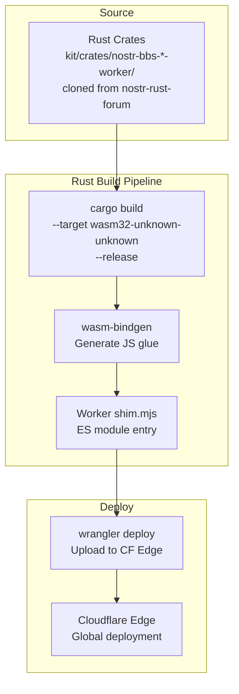
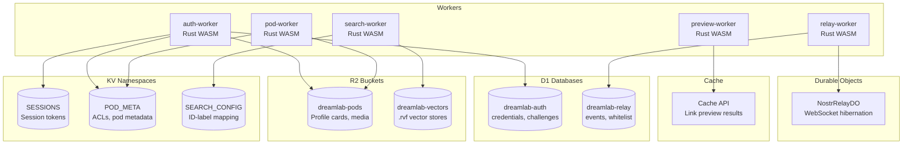

# Cloudflare Workers Deployment

**Last updated:** 2026-03-16 | [Back to Documentation Index](../README.md)

---

## Table of Contents

- [Build Pipeline](#build-pipeline)
- [Resource Relationships](#resource-relationships)
- [Rust Workers Build](#rust-workers-build)
- [Wrangler Configuration](#wrangler-configuration)
- [Cloudflare Resources](#cloudflare-resources)
- [Secrets Management](#secrets-management)
- [DNS Routes](#dns-routes)
- [Cron Keep-Warm](#cron-keep-warm)
- [WASM Size Limits](#wasm-size-limits)
- [GitHub Actions Secrets](#github-actions-secrets)
- [Related Documents](#related-documents)

---

## Build Pipeline



---

## Resource Relationships



---

## Rust Workers Build

All 5 workers are Rust crates from the `nostr-rust-forum` kit. The deploy
workflow clones the kit into `kit/` (pinned to the SHA in
`forum-config/Cargo.lock`), copies the DreamLab `wrangler.toml` overrides from
`forum-config/deploy/`, then compiles each crate to `wasm32-unknown-unknown`
via `worker-build`:

```bash
# Kit is cloned to ./kit by the deploy workflow (see .github/workflows/workers-deploy.yml)
cd kit/crates/nostr-bbs-auth-worker && worker-build --release
cd kit/crates/nostr-bbs-pod-worker && worker-build --release
cd kit/crates/nostr-bbs-preview-worker && worker-build --release
cd kit/crates/nostr-bbs-relay-worker && worker-build --release
cd kit/crates/nostr-bbs-search-worker && worker-build --release
```

Output lands in `build/worker/`. Wrangler deploys from the generated `shim.mjs`.

---

## Wrangler Configuration

### Example: auth-worker

```toml
name = "dreamlab-auth-api"
main = "build/worker/shim.mjs"
compatibility_date = "2024-09-23"

[build]
command = "worker-build --release"
```

### Example: relay-worker (with Durable Objects)

```toml
name = "dreamlab-nostr-relay"
main = "build/worker/shim.mjs"
compatibility_date = "2024-09-23"

[build]
command = "worker-build --release"

[durable_objects]
bindings = [{ name = "RELAY", class_name = "NostrRelayDO" }]

[[migrations]]
tag = "v1"
new_classes = ["NostrRelayDO"]
```

---

## Cloudflare Resources

### D1 Databases

| Database | Worker | Tables |
|----------|--------|--------|
| `dreamlab-auth` | auth-worker | `webauthn_credentials`, `challenges` |
| `dreamlab-relay` | relay-worker | `events`, `whitelist` |

### KV Namespaces

| Namespace | Worker(s) | Purpose |
|-----------|-----------|---------|
| `SESSIONS` | auth-worker | Session tokens (7-day TTL) |
| `POD_META` | auth-worker, pod-worker | Pod ACLs + metadata |
| `SEARCH_CONFIG` | search-worker | Vector ID-label mapping |
| `CONFIG` | auth-worker | General configuration |

### R2 Buckets

| Bucket | Worker(s) | Content |
|--------|-----------|---------|
| `dreamlab-pods` | auth-worker, pod-worker | User pod files (profiles, media, data) |
| `dreamlab-vectors` | search-worker | .rvf binary vector stores |

### Durable Objects

| Class | Worker | Instance | Purpose |
|-------|--------|----------|---------|
| `NostrRelayDO` | relay-worker | `"main"` (singleton) | WebSocket connection management with Hibernation API |

---

## Secrets Management

Set Worker secrets via `wrangler secret put`:

```bash
# auth-worker
echo "dreamlab-ai.com" | wrangler secret put RP_ID --name dreamlab-auth-api
echo "DreamLab AI" | wrangler secret put RP_NAME --name dreamlab-auth-api
echo "https://dreamlab-ai.com" | wrangler secret put EXPECTED_ORIGIN --name dreamlab-auth-api
echo "<admin-pubkey>" | wrangler secret put ADMIN_PUBKEYS --name dreamlab-auth-api

# REQUIRED — operator-generated, never committed. The auth-worker mixes this
# server-held secret into the WebAuthn PRF → HKDF derivation. If it is unset,
# register/login return HTTP 500 at request time. Generate a fresh 32-byte
# value and set it before the first deploy:
#   openssl rand -hex 32 | wrangler secret put PRF_SERVER_SECRET --name dreamlab-auth-api
echo "<generate-with: openssl rand -hex 32>" | wrangler secret put PRF_SERVER_SECRET --name dreamlab-auth-api

# pod-worker
echo "https://dreamlab-ai.com" | wrangler secret put EXPECTED_ORIGIN --name dreamlab-pod-api
echo "https://pods.dreamlab-ai.com" | wrangler secret put POD_BASE_URL --name dreamlab-pod-api

# relay-worker
echo "<admin-pubkey>" | wrangler secret put ADMIN_PUBKEYS --name dreamlab-nostr-relay
echo "https://dreamlab-ai.com" | wrangler secret put ALLOWED_ORIGIN --name dreamlab-nostr-relay

# search-worker
echo "https://dreamlab-ai.com" | wrangler secret put ALLOWED_ORIGIN --name dreamlab-search-api
```

---

## Operator-Provided Values

These values are **operator data**. They are deliberately NOT committed to this
repo and NOT generated by the deploy pipeline — the pipeline only *validates*
that they are present, and fails fast if they are missing or still hold a
`REPLACE_WITH_*` placeholder.

| Value | Where | How to provision | Failure if missing |
|-------|-------|------------------|--------------------|
| `ADMIN_KV` namespace id | `forum-config/deploy/auth-worker.wrangler.toml` (`ADMIN_KV`), `pod-worker.wrangler.toml` (`ADMIN_KV_RO`) — shipped as `REPLACE_WITH_NEW_ADMIN_KV_ID` | `wrangler kv:namespace create dreamlab-admin-kv`, paste the returned id (the `workers-deploy.yml` pipeline also auto-provisions and substitutes it). | Admin-flag writes/reads 500 at request time. |
| `PRF_SERVER_SECRET` | auth-worker secret | `openssl rand -hex 32 \| wrangler secret put PRF_SERVER_SECRET --name dreamlab-auth-api` | WebAuthn register/login 500 at request time. |

**Fail-fast enforcement (R-09).** Two checks now surface these as *deploy-time*
errors instead of request-time 500s:

1. `forum-config::deploy_config::validate_deploy_dir()` scans every shipped
   `deploy/*.wrangler.toml` for unresolved `REPLACE_WITH_*` ids. A CI test
   (`cargo test -p dreamlab-forum-config`) runs it against the checked-in
   manifests.
2. The `workers-deploy.yml` "Validate required auth-worker secrets are set"
   step runs `wrangler secret list` before `wrangler deploy` and blocks the
   deploy if `PRF_SERVER_SECRET` or `ADMIN_PUBKEYS` is absent. Deploy pipelines
   can also call `deploy_config::validate_required_secrets()` directly.

---

## Operator Actions (cannot be done by repo automation)

These require operator access to live infrastructure or to secret material and
**must be performed by an operator**, not by any agent or CI job:

- **Rotate the `operator-jjohare` admin keypair (R-01).** A previous revision of
  the test fixtures embedded a private key that derived to the live admin pubkey
  in `forum-config/dreamlab.toml`. The test fixtures have since been decoupled
  to a throwaway keypair, but **the live key must still be rotated** because the
  old key remains in git history. Generate a fresh admin keypair, update the
  `operator-jjohare` entry in `dreamlab.toml`, re-set `ADMIN_PUBKEYS` on the
  auth-worker and relay-worker, and update the relay D1 whitelist. (Agents must
  not touch `dreamlab.toml` or live secrets.)
- **Provision the real `ADMIN_KV` namespace id** and **set `PRF_SERVER_SECRET`**
  — see [Operator-Provided Values](#operator-provided-values) above.

---

## DNS Routes

| Subdomain | Worker Name | Protocol |
|-----------|------------|----------|
| `api.dreamlab-ai.com` | `dreamlab-auth-api` | HTTPS |
| `pods.dreamlab-ai.com` | `dreamlab-pod-api` | HTTPS |
| `search.dreamlab-ai.com` | `dreamlab-search-api` | HTTPS |
| `preview.dreamlab-ai.com` | `dreamlab-link-preview` | HTTPS |
| `relay.dreamlab-ai.com` | `dreamlab-nostr-relay` | WSS |

---

## Cron Keep-Warm

All Workers run a `*/5 * * * *` cron trigger to prevent cold starts:

| Worker | Cron Action |
|--------|-------------|
| auth-worker | Ping D1 (`SELECT 1`) |
| pod-worker | No-op (trigger itself warms isolate) |
| preview-worker | No-op (trigger itself warms isolate) |
| relay-worker | Ping D1 (`SELECT 1`) |
| search-worker | Load WASM store from R2 |

---

## WASM Size Limits

Cloudflare paid plan allows 10 MB compressed WASM per Worker. Monitor binary sizes and apply `wasm-opt -Oz` if any Worker exceeds 5 MB.

| Worker | Expected Size | Optimization |
|--------|--------------|-------------|
| auth-worker | ~2 MB | `wasm-opt -Oz` in CI |
| pod-worker | ~1 MB | `wasm-opt -Oz` in CI |
| preview-worker | ~1 MB | `wasm-opt -Oz` in CI |
| relay-worker | ~2 MB | `wasm-opt -Oz` in CI |
| search-worker | ~1 MB | `wasm-opt -Oz` in CI |

---

## GitHub Actions Secrets

| Secret | Purpose |
|--------|---------|
| `CLOUDFLARE_API_TOKEN` | Workers deploy (Scripts:Edit, D1:Edit, KV:Edit, R2:Edit) |
| `CLOUDFLARE_ACCOUNT_ID` | Cloudflare account identifier |

---

## Related Documents

| Document | Description |
|----------|-------------|
| [Deployment Overview](README.md) | Architecture, CI/CD pipeline, environments, DNS |
| [Native Pod Mesh](NATIVE_POD_MESH.md) | Native pod tier (git support): CF Tunnel, agentbox sidecar, wrangler secrets, build env |
| [Auth API](../api/AUTH_API.md) | auth-worker endpoints and D1 schema |
| [Pod API](../api/POD_API.md) | pod-worker endpoints and R2 layout |
| [Nostr Relay](../api/NOSTR_RELAY.md) | relay-worker endpoints and DO config |
| [Search API](../api/SEARCH_API.md) | search-worker endpoints and RVF WASM |
| [Security Overview](../security/SECURITY_OVERVIEW.md) | CORS, input validation, SSRF protection |
