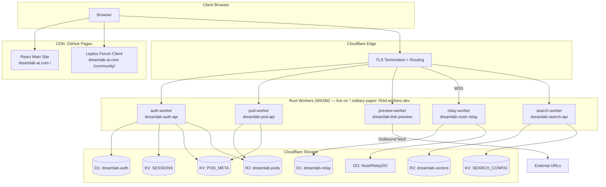
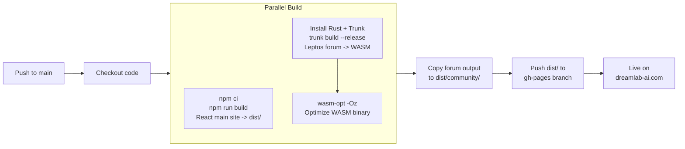

# Deployment Overview -- DreamLab AI

**Last updated:** 2026-05-29 | [Back to Documentation Index](../README.md)

---

## Table of Contents

- [Architecture](#architecture)
- [CI/CD Pipeline](#cicd-pipeline)
- [Static Sites](#static-sites)
- [Cloudflare Workers](#cloudflare-workers)
- [Environments](#environments)
- [Required Secrets](#required-secrets)
- [DNS Records](#dns-records)
- [Related Documents](#related-documents)

---

## Architecture

> Workers serve live traffic on `*.solitary-paper-764d.workers.dev`. The branded subdomains (`api.`/`pods.`/`preview.`/`relay.`/`search.dreamlab-ai.com`) are the documented end-state but are **not provisioned in DNS** (verified 2026-06-09; see `.github/workflows/deploy.yml` env comments).

---

## CI/CD Pipeline

### deploy.yml -- Static Sites

Triggers on push to `main`. Guard: `if: github.repository == 'DreamLab-AI/dreamlab-ai-website'`

### workers-deploy.yml -- Cloudflare Workers

Triggers on push to `main` when files under `forum-config/deploy/**` change. The workflow clones the `nostr-rust-forum` kit at the pinned `KIT_REF` (currently `25ca8a11e199ced9b1be4a4fb0601239e31aff54`, kept in lockstep with `deploy.yml`, `rust-ci.yml`, and `forum-config/Cargo.toml`), overlays each `forum-config/deploy/*.wrangler.toml` onto the matching kit crate, then builds and deploys. Guard: `if: github.repository == 'DreamLab-AI/dreamlab-ai-website'`

```mermaid
flowchart LR
    PUSH[Push to main<br/>forum-config/deploy/** changed] --> CLONE[Clone kit at pinned KIT_REF<br/>overlay forum-config/deploy/*.wrangler.toml]
    CLONE --> SETUP[Install Rust toolchain<br/>+ wasm32-unknown-unknown<br/>+ worker-build + wrangler 3.114.17]

    SETUP --> RUST_BUILD

    subgraph RUST_BUILD [Parallel Rust Builds]
        direction TB
        AUTH_BUILD[worker-build --release<br/>auth-worker]
        POD_BUILD[worker-build --release<br/>pod-worker]
        PREVIEW_BUILD[worker-build --release<br/>preview-worker]
        RELAY_BUILD[worker-build --release<br/>relay-worker]
        SEARCH_BUILD[worker-build --release<br/>search-worker]
    end

    RUST_BUILD --> DEPLOY_ALL

    subgraph DEPLOY_ALL [Deploy All Workers]
        direction TB
        DEPLOY_AUTH[wrangler deploy<br/>dreamlab-auth-api]
        DEPLOY_POD[wrangler deploy<br/>dreamlab-pod-api]
        DEPLOY_PREVIEW[wrangler deploy<br/>dreamlab-link-preview]
        DEPLOY_RELAY[wrangler deploy<br/>dreamlab-nostr-relay]
        DEPLOY_SEARCH[wrangler deploy<br/>dreamlab-search-api]
    end
```

---

## Static Sites

### React Main Site

| Property | Value |
|----------|-------|
| Source | `src/` (React 18 + Vite + TypeScript) |
| Build command | `npm run build` |
| Output | `dist/` |
| Deploy target | `gh-pages` branch |
| Domain | `dreamlab-ai.com` |
| CNAME | `public/CNAME` |

### Leptos Forum Client

| Property | Value |
|----------|-------|
| Source | `nostr-rust-forum` kit (cloned at build time), overlaid with `forum-config/` |
| Build command | `trunk build --release` |
| Optimization | `wasm-opt -Oz` (target: <2 MB gzipped) |
| Output | Copied to `dist/community/` |
| Route | All `/community/*` paths serve the Leptos SPA |

---

## Cloudflare Workers

### Rust Workers (5 services)

All workers are Rust, compiled to `wasm32-unknown-unknown` via `worker-build --release` and packaged as Workers-compatible ES modules. Source lives upstream in the `nostr-rust-forum` kit; this repo overlays per-worker `wrangler.toml` from `forum-config/deploy/`.

| Worker | Kit crate | Storage | Live host (workers.dev) | Planned subdomain |
|--------|-----------|---------|-----------|-----------|
| auth-worker | `nostr-bbs-auth-worker` | D1 + KV + R2 | `dreamlab-auth-api` | `api.dreamlab-ai.com` |
| pod-worker | `nostr-bbs-pod-worker` | R2 + KV + D1 | `dreamlab-pod-api` | `pods.dreamlab-ai.com` |
| preview-worker | `nostr-bbs-preview-worker` | KV (rate limit) + Cache API | `dreamlab-link-preview` | `preview.dreamlab-ai.com` |
| relay-worker | `nostr-bbs-relay-worker` | D1 + Durable Objects | `dreamlab-nostr-relay` | `relay.dreamlab-ai.com` |
| search-worker | `nostr-bbs-search-worker` | R2 + KV + D1 + Workers AI | `dreamlab-search-api` | `search.dreamlab-ai.com` |

---

## Environments

### Production

| Property | Value |
|----------|-------|
| Domain | `dreamlab-ai.com` |
| Workers hosts | `dreamlab-{auth-api,pod-api,search-api,nostr-relay,link-preview}.solitary-paper-764d.workers.dev` (branded `api.`/`pods.`/`search.`/`preview.`/`relay.` subdomains are planned, not provisioned) |
| GitHub Pages branch | `gh-pages` |
| TLS | Cloudflare-managed (edge + origin) |

### Development

| Service | Command | URL |
|---------|---------|-----|
| React main site | `npm run dev` | `http://localhost:5173` |
| Leptos forum | `trunk serve` | `http://localhost:8080` |
| Any Worker (local) | `wrangler dev` | `http://localhost:8787` (default) |
| Relay (local) | `wrangler dev --local --persist` | Local with persisted D1 state |

Local Workers use `wrangler dev` which simulates D1, KV, R2, and Durable Objects locally.

---

## Required Secrets

### GitHub Actions Secrets

| Secret | Purpose |
|--------|---------|
| `CLOUDFLARE_API_TOKEN` | Workers deploy (Scripts:Edit, D1:Edit, KV:Edit, R2:Edit) |
| `CLOUDFLARE_ACCOUNT_ID` | Cloudflare account identifier |

### Worker Secrets (set via `wrangler secret put`)

| Secret | Workers | Value |
|--------|---------|-------|
| `PRF_SERVER_SECRET` | auth-worker | **Operator-generated** — `openssl rand -hex 32`. Server-side salt for WebAuthn PRF→HKDF. Unset ⇒ register/login 500. Deploy is blocked if absent (see [Cloudflare Workers › Operator-Provided Values](CLOUDFLARE_WORKERS.md#operator-provided-values)). |
| `ADMIN_PUBKEYS` | auth-worker | Comma-separated admin hex pubkeys (static admin set; deploy-gated). The relay's admin authority is D1 `whitelist.is_admin`; the search-worker carries its own `ADMIN_PUBKEYS` as a plaintext `[vars]` value. |
| `NATIVE_POD_URL` | auth-worker | `https://pods-native.dreamlab-ai.com` (native pod tier; also present as a `[vars]` value — the secret wins when both are set) |
| `NATIVE_POD_ADMIN_KEY` | auth-worker | PSK matching the native server's `SOLID_ADMIN_KEY` for `/_admin/provision` (deploy-gated) |

Non-secret configuration (`RP_ID`, `RP_NAME`, `EXPECTED_ORIGIN`, `POD_BASE_URL`, `ALLOWED_ORIGIN`/`ALLOWED_ORIGINS`, `ZONE_CONFIG`) ships as plaintext `[vars]` in `forum-config/deploy/*.wrangler.toml`, not as CF secrets.

`NATIVE_POD_URL` is also consumed at WASM compile time (`option_env!`) so the native pod UI compiles out when absent. The [`set-worker-secrets.yml`](../../.github/workflows/set-worker-secrets.yml) workflow pushes both values to the CF Worker in one shot. Full runbook: [Native Pod Mesh](NATIVE_POD_MESH.md).

---

## DNS Records

The apex record is live; the worker subdomains below are the **planned end-state** and are not currently provisioned (clients use the `workers.dev` hosts injected via `window.__ENV__`).

| Subdomain | Type | Target | Proxied |
|-----------|------|--------|---------|
| `dreamlab-ai.com` | CNAME | `dreamlab-ai.github.io` | No (GitHub Pages) |
| `api.dreamlab-ai.com` | CNAME | auth-worker route | Yes |
| `pods.dreamlab-ai.com` | CNAME | pod-worker route | Yes |
| `search.dreamlab-ai.com` | CNAME | search-worker route | Yes |
| `preview.dreamlab-ai.com` | CNAME | preview-worker route | Yes |
| `relay.dreamlab-ai.com` | CNAME | relay-worker route | Yes |

---

## Feature Flags

Operator feature flags in `forum-config/dreamlab.toml` under `[features]` control which capabilities are active. The relay and forum client respect these flags at startup.

| Flag | Purpose | Default |
|------|---------|---------|
| `marketplace` | NIP-90 agent job marketplace | `true` |
| `calendar` | NIP-52 calendar events | `true` |
| `dms` | NIP-59 encrypted direct messages | `true` |
| `governance` | Agent Control Surface dashboard (`/governance`, kinds 31400-31405) | `true` |

The `governance` flag additionally requires configuration in the `[governance]` section of `dreamlab.toml` -- see [forum-config/README.md](../../forum-config/README.md#governance-configuration) for the full schema (route, relay URL, agent pubkey allowlist).

---

## Related Documents

| Document | Description |
|----------|-------------|
| [Cloudflare Workers](CLOUDFLARE_WORKERS.md) | Build pipeline, resource bindings, secrets |
| [Native Pod Mesh](NATIVE_POD_MESH.md) | CF Tunnel to agentbox `solid-pod-rs`, native pod provisioning |
| [Forum Config](../../forum-config/README.md) | Operator overlay, feature flags, governance config |
| [Auth API](../api/AUTH_API.md) | WebAuthn + NIP-98 endpoints |
| [Pod API](../api/POD_API.md) | Solid pod storage |
| [Nostr Relay](../api/NOSTR_RELAY.md) | WebSocket relay |
| [Search API](../api/SEARCH_API.md) | RVF WASM vector search |
| [Security Overview](../security/SECURITY_OVERVIEW.md) | Threat model, CORS, input validation |
