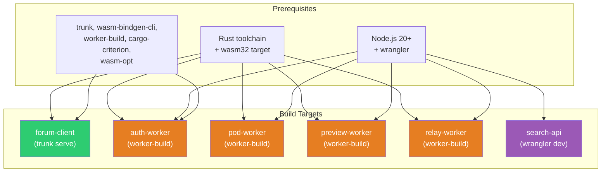
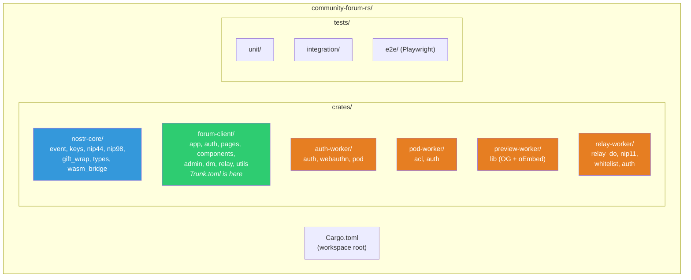

# Getting Started -- DreamLab Community Forum (Rust Port)

**Last updated:** 2026-03-08 | [Back to Documentation Index](../README.md)

## Dev Environment Setup



## Prerequisites

```bash
# Rust toolchain
rustup target add wasm32-unknown-unknown
cargo install trunk wasm-bindgen-cli worker-build cargo-criterion
cargo install wasm-opt --locked

# Node.js 20+ (Tailwind, Playwright, TS Workers)
npm install -g wrangler
```

## Clone and Setup

```bash
git clone https://github.com/DreamLab-AI/dreamlab-ai-website.git
cd dreamlab-ai-website && git checkout rust-version
npm install
cargo check --workspace
cargo check --workspace --target wasm32-unknown-unknown
```

## Running the Leptos Dev Server

The `Trunk.toml` is located in `crates/forum-client/` (not the workspace root) due to the trunk-rs#909 workaround.

```bash
# From community-forum-rs/crates/forum-client/
trunk serve
# Opens at http://localhost:8080, hot-reloads on .rs changes
```

`tailwind.config.js` scans `crates/**/*.rs` for Tailwind utility classes.

## Running Workers Locally

```bash
# Rust Workers (build first)
cd community-forum-rs/crates/auth-worker && worker-build --dev && wrangler dev
cd community-forum-rs/crates/pod-worker && worker-build --dev && wrangler dev
cd community-forum-rs/crates/preview-worker && worker-build --dev && wrangler dev
cd community-forum-rs/crates/relay-worker && worker-build --dev && wrangler dev

# TypeScript Worker
cd workers/search-api && wrangler dev
```

Add `--persist` to `wrangler dev` to keep D1/KV data between restarts.

## Running Tests

146 tests pass across the workspace with 0 warnings.

```bash
# All native tests (146 passing)
cargo test --workspace

# WASM tests
cargo test --workspace --target wasm32-unknown-unknown

# Property-based (increase cases for CI)
PROPTEST_CASES=10000 cargo test -p nostr-core

# Benchmarks
cargo criterion -p nostr-core

# Playwright E2E
npx playwright install chromium && npx playwright test

# Linting
cargo clippy --workspace -- -D warnings
cargo fmt --workspace --check
```

## Environment Variables

Main site `.env` (never commit):
```
VITE_SUPABASE_URL=https://your-project.supabase.co
VITE_SUPABASE_ANON_KEY=your-anon-key
VITE_AUTH_API_URL=http://localhost:8787
```

Workers use `wrangler.toml` vars for local dev:
```toml
[vars]
RP_ID = "localhost"
EXPECTED_ORIGIN = "http://localhost:8080"
ADMIN_PUBKEYS = "<your-test-pubkey>"
```

## Project Structure



### Crate Summary

| Crate | Purpose | Modules | Target |
|-------|---------|---------|--------|
| `nostr-core` | Shared protocol primitives | `event`, `keys`, `nip44`, `nip98`, `gift_wrap`, `types`, `wasm_bridge` | wasm32 + native |
| `forum-client` | Leptos CSR browser app | `app`, `auth`, `pages`, `components`, `admin`, `dm`, `relay`, `utils` | wasm32 (trunk) |
| `auth-worker` | WebAuthn + NIP-98 + pod provisioning | `auth`, `webauthn`, `pod` | CF Worker |
| `pod-worker` | Solid pod storage + WAC ACL | `acl`, `auth` | CF Worker |
| `preview-worker` | OG metadata + oEmbed | `lib` | CF Worker |
| `relay-worker` | NIP-01 WebSocket relay + D1 storage | `relay_do`, `nip11`, `whitelist`, `auth` | CF Worker |

### Key Dependencies

| Dependency | Version | Purpose |
|------------|---------|---------|
| `leptos` | 0.7 | Reactive UI framework |
| `nostr` / `nostr-sdk` | 0.44 | Nostr protocol types and relay client |
| `worker` | 0.7 | Cloudflare Workers Rust bindings |
| `k256` | 0.13 | secp256k1 elliptic curve operations |
| `chacha20poly1305` | 0.10 | NIP-44 AEAD encryption |
| `passkey` | latest | WebAuthn/FIDO2 ceremony handling |

## Common Tasks

**Add a page**: Create `crates/forum-client/src/pages/my_page.rs`, add route in `app.rs`.

**Add event kind**: Add variant to `nostr_core::event::EventKind`, add tests, run `cargo test -p nostr-core`.

**Test crypto**: `PROPTEST_CASES=10000 cargo test -p nostr-core nip44 && cargo criterion -p nostr-core --bench crypto`.

**Add a relay endpoint**: Add handler in `crates/relay-worker/src/whitelist.rs` or create a new module, wire route in `lib.rs`.

## Related Documents

- [Documentation Index](../README.md)
- [Rust Style Guide](RUST_STYLE_GUIDE.md)
- [DDD Overview](../ddd/README.md)
- [ADR Index](../adr/README.md)
