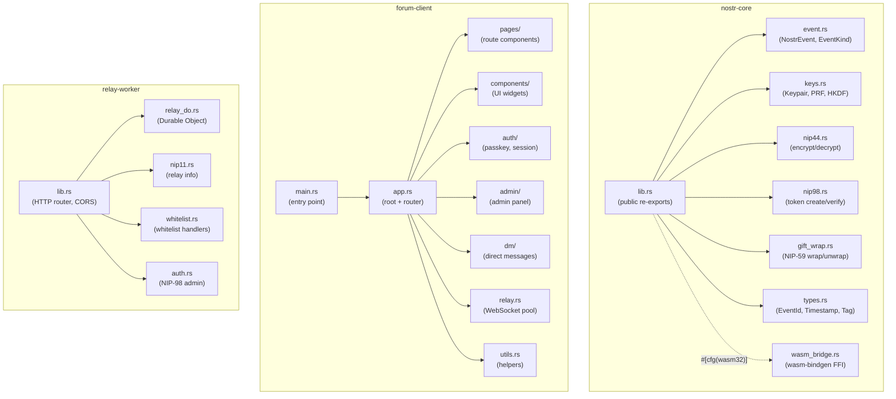
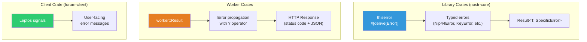

# Rust Style Guide -- DreamLab Community Forum

**Last updated:** 2026-03-08 | [Back to Documentation Index](../README.md)

## Mandatory Compiler Settings

Every crate must include at the top of `lib.rs` or `main.rs`:

```rust
#![deny(unsafe_code)]
#![warn(missing_docs)]
#![warn(clippy::all)]
```

CI enforces: `cargo clippy -- -D warnings`, `cargo fmt --check`, `cargo test`, `cargo test --target wasm32-unknown-unknown`.

## Module Organization



One file per domain concept. Maximum 500 lines per file. Split into submodules if exceeded.

## Naming Conventions

| Item | Convention | Example |
|------|-----------|---------|
| Functions, methods | `snake_case` | `verify_signature()` |
| Types, traits, enums | `PascalCase` | `NostrEvent`, `EventKind` |
| Constants | `SCREAMING_SNAKE_CASE` | `MAX_CONTENT_SIZE` |
| Modules, files | `snake_case` | `nip44.rs`, `gift_wrap.rs` |

## Error Handling



`thiserror` for library crates (typed errors), `anyhow`/`worker::Result` for Workers.

```rust
// Library (nostr-core)
#[derive(Debug, Error)]
pub enum Nip44Error {
    #[error("invalid ciphertext length: {0}")]
    InvalidLength(usize),
    #[error("AEAD decryption failed")]
    DecryptionFailed,
}

// Worker
async fn handle(req: Request, env: Env) -> worker::Result<Response> {
    let body: RegisterRequest = req.json().await?;
    Ok(Response::from_json(&result)?)
}
```

Never use `.unwrap()` in library code. Workers may use `.expect()` only for genuinely impossible invariants with an explaining comment.

## Struct Design

Always derive standard traits. Use `#[serde(rename_all = "camelCase")]` for JS interop.

```rust
#[derive(Debug, Clone, Serialize, Deserialize, PartialEq, Eq)]
pub struct NostrEvent {
    pub id: String,
    pub pubkey: String,
    pub created_at: u64,
    pub kind: EventKind,
    pub tags: Vec<Vec<String>>,
    pub content: String,
    pub sig: String,
}
```

## Async Code

All Workers use `wasm-bindgen-futures`. Never import `tokio`.

## Testing

Property-based testing with `proptest` for crypto and serialization. WASM tests with `wasm-bindgen-test`:

```rust
proptest! {
    #[test]
    fn nip44_roundtrip(plaintext in any::<Vec<u8>>()) {
        let ct = encrypt(&key, &plaintext).unwrap();
        prop_assert_eq!(plaintext, decrypt(&key, &ct).unwrap());
    }
}
```

## Dependencies

- Prefer RustCrypto crates for crypto operations
- Pin exact versions for `nostr-sdk` (alpha instability)
- Always enable `getrandom` `js` feature for WASM
- Avoid `std`-only crates in `nostr-core` (must compile for native + WASM)
- Never add `tokio`

## Documentation

All public items must have `///` doc comments including `# Errors` section where applicable. Run `cargo doc --no-deps` to verify.

## Related Documents

- [Documentation Index](../README.md)
- [Getting Started](GETTING_STARTED.md)
- [DDD Overview](../ddd/README.md)
