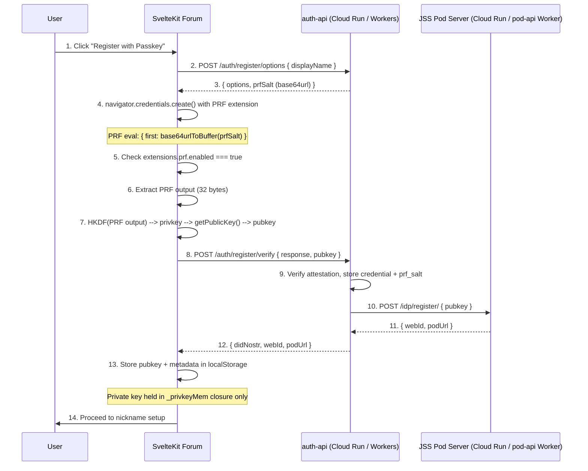
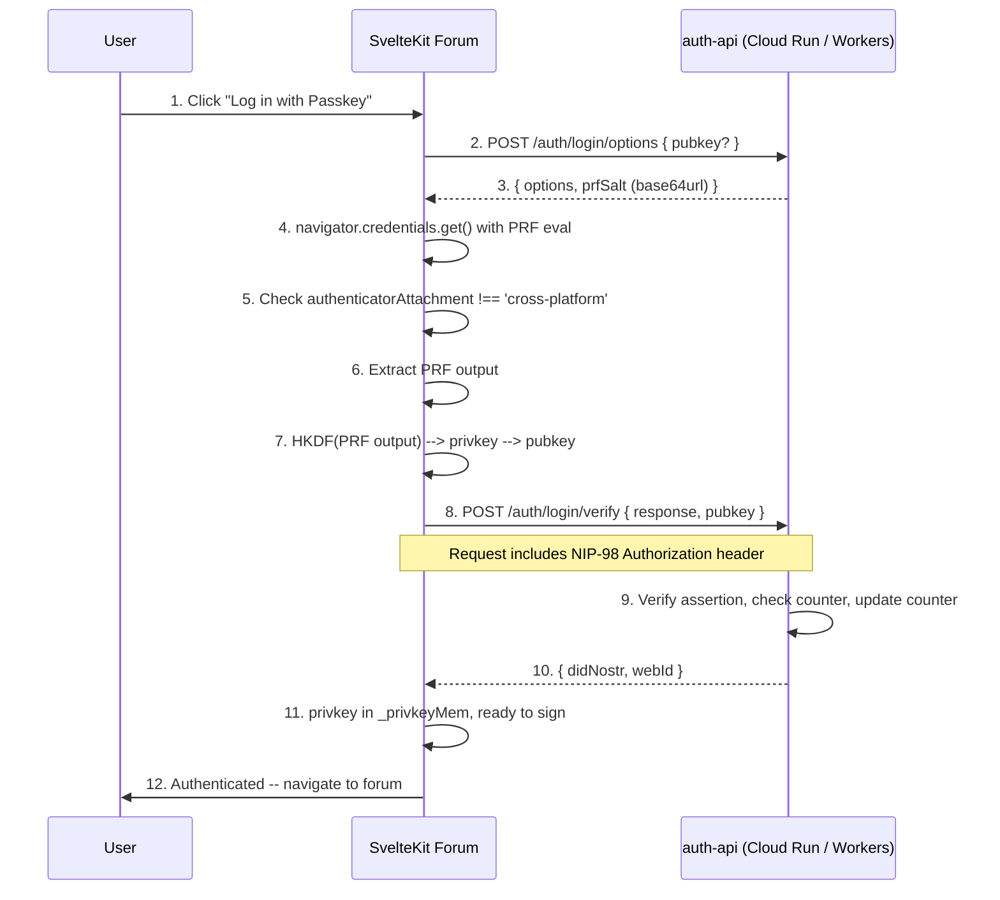

# Authentication System

The DreamLab AI community forum uses a passwordless authentication system built on WebAuthn with the PRF (Pseudo-Random Function) extension. A user's Nostr secp256k1 private key is derived deterministically from hardware-backed biometric authentication and is never stored -- it exists only in a volatile in-memory closure during an active session.

## Overview

The authentication system provides:

- **WebAuthn PRF passkey registration** -- hardware-backed biometric login (FaceID, TouchID, YubiKey)
- **Deterministic key derivation** -- HKDF-SHA-256 transforms PRF output into a secp256k1 private key
- **NIP-98 HTTP auth** -- every state-mutating API call is Schnorr-signed with kind:27235 events
- **In-memory key security** -- private key held only in a closure (`_privkeyMem`), zero-filled on `pagehide`
- **Multiple login methods** -- passkey (primary), NIP-07 browser extension, manual nsec/hex key entry
- **Solid pod provisioning** -- server-side pod creation via JSS on successful registration (Cloudflare Workers pod-api is code complete, deployment pending)

## Identity Model

Each user's identity spans three layers:

```
secp256k1 pubkey (hex)
  --> did:nostr:{pubkey}           (W3C DID for interop)
  --> {jss-url}/{pubkey}/profile/card#me  (WebID for Solid/Linked Data)
```

| Layer | Format | Purpose |
|-------|--------|---------|
| **Nostr pubkey** | 64-char hex string | Primary identity, message signing |
| **DID** | `did:nostr:{pubkey}` | Decentralised identifier |
| **WebID** | `{pod-url}/profile/card#me` | Linked Data profile (Solid) |

## Key Derivation

```
WebAuthn PRF output (32 bytes, HMAC-SHA-256 from authenticator)
  --> HKDF(SHA-256, salt=[], info="nostr-secp256k1-v1")
  --> 32-byte candidate key
  --> secp256k1.isValidPrivateKey(key)?
      YES --> private key
      NO  --> SHA-256(key) --> recurse (probability ~2^-128)
  --> getPublicKey(privkey) --> hex pubkey
```

The PRF salt is generated at registration time and stored server-side in the `webauthn_credentials.prf_salt` column. The same credential with the same PRF salt always produces the same private key.

### Critical Constraints

- **Same device required**: cross-device QR authentication produces a different PRF output and cannot derive the original key. The client checks `authenticatorAttachment !== 'cross-platform'` and rejects cross-device attempts.
- **Windows Hello unsupported**: no PRF extension support. The client reports a clear error message.
- **Device loss = key loss**: if a user loses the authenticator and did not back up their nsec, recovery is impossible. The UI warns during registration.

## Registration Flow



### Key Files

| File | Role |
|------|------|
| `community-forum/src/lib/auth/passkey.ts` | `registerPasskey()` -- WebAuthn ceremony, HKDF derivation |
| `community-forum/src/lib/stores/auth.ts` | `registerWithPasskey()` -- auth store integration |
| `community-forum/services/auth-api/src/routes/register.ts` | Server-side attestation verification |
| `community-forum/services/auth-api/src/jss-client.ts` | Solid pod provisioning |

## Authentication Flow



## Alternative Login Methods

### NIP-07 Browser Extension

Users with Alby, nos2x, or another Nostr signer extension can authenticate without a passkey. The extension provides the pubkey and handles event signing. No private key is exposed to the application.

### Local Key (nsec / hex)

Advanced users can paste an nsec or hex private key directly. The key is stored in `sessionStorage` (default) or `localStorage` (if "remember me" is selected). This path skips the WebAuthn ceremony entirely.

## Session Management

### In-Memory Key Storage

When authenticated via passkey, the private key is held only in a volatile variable:

```typescript
// In auth.ts createAuthStore()
let _privkeyMem: Uint8Array | null = null;
```

- **Never written** to localStorage, sessionStorage, IndexedDB, or any persistent store
- **Zero-filled** on logout (`_privkeyMem.fill(0); _privkeyMem = null`)
- **Zero-filled** on `pagehide` event (tab close, navigation away)
- **Not restored** on page reload -- passkey users must re-authenticate

### localStorage Schema

Only non-secret profile metadata is persisted:

| Key | Type | Contents |
|-----|------|----------|
| `nostr_bbs_keys` | JSON | `{ publicKey, isPasskey, isNip07, isLocalKey, nickname, avatar, accountStatus, nsecBackedUp }` |

### Session Restoration

On page load, the auth store restores profile metadata from localStorage but does **not** restore the private key for passkey sessions. The user sees their profile but must re-authenticate to sign events.

## NIP-98 HTTP Auth

Every state-mutating API call uses NIP-98 `Authorization: Nostr <base64(event)>`:

- Event kind: `27235`
- Tags: `['u', url]`, `['method', method]`, optionally `['payload', sha256(body)]`
- Schnorr-signed with the in-memory private key
- Timestamp window: +/-60 seconds
- Event size limit: 64KB

See [NIP-98 Auth](./nip98-auth.md) for the shared module architecture and server-side verification.

## Security Properties

### What is Protected

| Threat | Mitigation |
|--------|------------|
| Key theft from storage | Private key never written to any persistent store (passkey path) |
| Key theft from memory | Zero-filled on logout and pagehide |
| Cross-device PRF mismatch | `authenticatorAttachment` check rejects cross-platform assertions |
| Replay attacks | NIP-98 timestamp window of +/-60s |
| Body tampering | NIP-98 payload tag contains SHA-256 of raw request body |
| SSRF via URL tag | RP_ORIGIN validation on server side |
| Oversized events | 64KB hard limit on event size |
| Brute-force registration | Rate limiting on auth-api endpoints |

### What is Not Protected

- **Device loss without backup**: if the authenticator is lost and the nsec was not backed up, the key is unrecoverable
- **Authenticator compromise**: if the hardware authenticator is compromised, the derived key is compromised
- **Extension compromise**: NIP-07 extensions manage their own key security; a compromised extension exposes the key

## Auth Store API

```typescript
import { authStore, isAuthenticated, isReady, isReadOnly } from '$lib/stores/auth';

// Derived stores
$isAuthenticated  // boolean: user has a pubkey and is signed in
$isReady          // boolean: session restoration complete
$isReadOnly       // boolean: account status is 'incomplete'

// Actions
authStore.registerWithPasskey(displayName)   // Full passkey registration
authStore.loginWithPasskey(pubkey?)           // Re-derive key from passkey
authStore.loginWithExtension()               // NIP-07 extension login
authStore.loginWithLocalKey(privkeyHex, rememberMe)  // nsec/hex login
authStore.getPrivkey()                       // Get in-memory Uint8Array | null
authStore.logout()                           // Zero-fill and clear
authStore.waitForReady()                     // Await session restoration
```

## Related Documentation

- [NIP-98 Auth](./nip98-auth.md) -- shared NIP-98 module and server-side verification
- [Community Forum](./community-forum.md) -- forum architecture and auth integration
- [ADR-009](../adr/009-user-registration-flow.md) -- user registration flow decision
