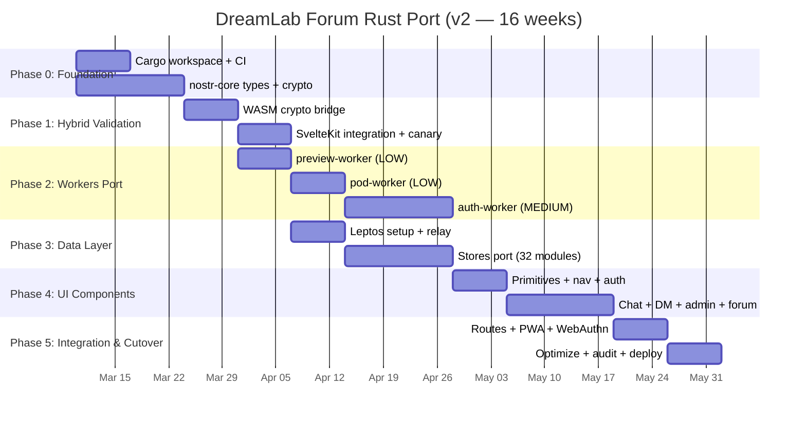

> **STATUS: SUPERSEDED** — This document is superseded by `prd-rust-port-v4.0.md`. The TS→Rust migration completed on 2026-03-12. All 5 workers (auth, pod, preview, relay, search) and the forum client are now Rust. This document is retained for historical reference only.

# PRD: DreamLab Community Forum — Production Rust Port

[Back to Documentation Index](README.md)

## 1. Executive Summary

Port the DreamLab community forum from TypeScript/SvelteKit to Rust/Leptos with
WebAssembly, and port **3 of 5** Cloudflare Workers to Rust. Two Workers
(nostr-relay, search-api) remain TypeScript due to confirmed technical blockers.

This PRD supersedes v1.0.0. Changes are informed by a 4-agent parallel crate
ecosystem survey (2026-03-08) that identified critical blockers, validated
production-ready crates, and confirmed no production Rust/WASM Nostr client UI
exists anywhere — this will be first-of-kind.

**Scope**: `community-forum/` (68,037 lines across 257 files) + `workers/` (3 of 5
services, ~1,150 lines). The React main site (`src/`) is excluded.

### 1.1 Key Changes from v1.0.0

| Area | v1.0.0 (Draft) | v2.0.0 (Production) | Reason |
|------|----------------|---------------------|--------|
| nostr-relay Worker | Port to Rust | **Stay TypeScript** | WebSocket Hibernation API not exposed in workers-rs |
| search-api Worker | Port to Rust | **Stay TypeScript** | RVF core already Rust WASM; TS wrapper is 430 lines |
| WebAuthn crate | webauthn-rs | **passkey-rs** (1Password) | Only crate with PRF extension support |
| nostr-sdk version | 0.37.x | **0.44.x** | Latest; 50+ NIPs, WASM-native, alpha state |
| worker crate version | 0.4.x | **0.7.5** | Latest; D1/KV/R2/DO/WebSocket/Cache/Cron |
| IndexedDB crate | rexie | **indexed-db** | rexie minimally maintained (92 stars); indexed-db is multi-threaded WASM safe |
| Build tool | wasm-pack | **trunk** / **cargo-leptos** | wasm-pack archived July 2025 |
| Markdown renderer | (unspecified) | **comrak** | 1,548 stars, GFM-complete, WASM compatible |
| Hybrid phase | Implicit | **Explicit Phase 1** | De-risk with immediate perf win before full rewrite |
| Timeline | 22 weeks | **16 weeks** | 2 Workers stay TS, hybrid validates approach early |

## 2. Problem Statement

### 2.1 Performance Bottlenecks (Measured)

1. **NIP-44 Encryption**: JS `crypto.subtle` ECDH + AES-256-GCM blocks main thread.
   Current mitigation: Web Worker (`crypto.worker.ts`). Cost: message serialization
   overhead, 2-5ms per encrypt/decrypt cycle, GC pressure from Uint8Array copies.

2. **Event Processing**: Parsing thousands of Nostr JSON events causes V8 GC spikes
   (50-200ms pauses). Each `NDKEvent` object carries hidden class overhead (~400 bytes
   per event beyond payload). At 10K cached events = ~4MB wasted on object headers.

3. **Relay Connection Management**: `relay.ts` implements custom reconnect, timeout,
   NIP-42 AUTH — 800+ lines of fragile state machine logic that `nostr-sdk` handles
   natively with proper backoff and connection pooling.

4. **Semantic Search**: ONNX WASM embedder (7.4MB) loaded via JS bridge. Each
   `embedOne()` call crosses JS-WASM boundary with Float32Array copy overhead.

5. **Store Complexity**: 32 Svelte stores with circular reactive dependencies. The
   `channels.ts` store alone has cyclomatic complexity >50.

### 2.2 Architectural Debt

- 3 NDK singletons (`ndk.ts`, `relay.ts`, inline) with divergent relay sets
- `as ChannelSection` casts throughout (type safety theater)
- Hardcoded section/cohort IDs across 15+ files
- Mixed auth paradigms: passkey PRF + NIP-07 + nsec with 7 blind spots
- No compile-time query verification (D1/KV operations are stringly typed)

## 3. Goals and Non-Goals

### Goals
- G1: Port community forum UI to Rust/Leptos + WASM (first production Nostr client in Rust)
- G2: Port 3 Workers (link-preview, pod-api, auth-api) to Rust
- G3: Achieve <0.5ms NIP-44 encrypt/decrypt (vs current 2-5ms)
- G4: Eliminate GC pauses entirely (zero-cost abstractions)
- G5: Reduce client memory footprint by 70% for 10K cached events
- G6: Shared `nostr-core` crate between client (WASM) and Workers (WASM)
- G7: Compile-time type safety for all Nostr event kinds and D1 queries
- G8: Maintain 100% feature parity with TypeScript version
- G9: Validate hybrid approach (Rust WASM crypto in SvelteKit) before full rewrite
- G10: 90%+ test coverage with property-based testing (`proptest`)

### Non-Goals
- NG1: Port the React main site (`src/`) — stays TypeScript
- NG2: Port nostr-relay Worker — WebSocket Hibernation blocker in workers-rs
- NG3: Port search-api Worker — RVF core already Rust, thin TS wrapper is fine
- NG4: Change the Nostr protocol or relay NIP support
- NG5: Replace Cloudflare infrastructure (D1, KV, R2, DO stay)
- NG6: Rewrite the Service Worker in Rust (stays JS — minimal WASM benefit)
- NG7: Change the WebAuthn PRF key derivation scheme
- NG8: Migrate away from GitHub Pages hosting for the static site

## 4. Technology Stack

### 4.1 Stack Mapping (Research-Validated)

| Current (TypeScript) | Rust Replacement | Crate + Version | Validation |
|---------------------|------------------|-----------------|------------|
| SvelteKit 2.49 | **Leptos 0.7.x** | `leptos` 0.7 | 20,333 stars; lemmy-ui-leptos proves forum use case |
| NDK 2.13 | **rust-nostr** | `nostr-sdk` 0.44.x | 605 stars; 50+ NIPs; WASM-native; ALPHA |
| Dexie (IndexedDB) | **indexed-db** | `indexed-db` | Multi-threaded WASM safe (rexie only 92 stars, minimal maintenance) |
| TailwindCSS 3.4 | **TailwindCSS 3.4** | (unchanged) | Scan `*.rs` instead of `*.svelte` |
| DaisyUI 4.x | **DaisyUI 4.x** | (unchanged) | CSS-only, framework-agnostic |
| Express / Hono | **worker crate** | `worker` 0.7.5 | 3,400 stars; D1/KV/R2/DO/WebSocket/Cache/Cron |
| @simplewebauthn | **passkey-rs** (1Password) | `passkey` 0.3.x | HAS PRF extension support; 263 stars; used in 1Password browser WASM |
| crypto.subtle | **k256 + chacha20poly1305** | `k256` 0.13.x, `chacha20poly1305` 0.10.x | NCC Group audited; pure Rust; WASM compatible |
| HKDF (crypto.subtle) | **hkdf** | `hkdf` 0.12.x | RustCrypto; pure Rust; WASM compatible |
| Zod validation | **serde + validator** | `serde` 1.x, `validator` 0.18.x | Compile-time (de)serialization, runtime validation |
| Vitest | **cargo test + proptest** | `proptest` 1.x | Property-based testing, deterministic shrinking |
| Playwright | **Playwright (JS)** | (unchanged) | E2E stays JS — no mature Rust e2e browser driver |
| Markdown render | **comrak** | `comrak` 0.28.x | 1,548 stars; full GFM; WASM compatible |
| (none) | **getrandom** | `getrandom` 0.2.x + `js` feature | **CRITICAL**: Must enable `js` feature for WASM targets |

### 4.2 Crates NOT Used (Research Rejection)

| Crate | Reason Rejected |
|-------|-----------------|
| `webauthn-rs` (kanidm) | No PRF extension support — blocker for passkey auth |
| `rexie` | 92 stars, minimally maintained; use `indexed-db` instead |
| `wasm-pack` | **Archived July 2025**; replaced by `trunk` / `cargo-leptos` |
| `sqlx` (for D1) | D1 has its own query API via `worker` crate; sqlx targets Postgres/MySQL/SQLite |
| `axum` (for Workers) | `worker` crate has its own Router; axum adds unnecessary abstraction |
| `dioxus` | 35K stars but 661 open issues; no forum proof-of-concept; VDOM overhead |

### 4.3 Critical Caveats

1. **getrandom `js` feature**: All WASM targets MUST have `getrandom = { version = "0.2", features = ["js"] }` in Cargo.toml. Without this, any crypto operation panics at runtime (workers-rs issue #736).

2. **nostr-sdk ALPHA state**: The 0.44.x line is alpha. API may change between minor versions. Pin exact versions in Cargo.lock.

3. **Leptos 0.7 transition**: Leptos 0.7 introduced `Signal<T>` (replacing `ReadSignal`/`WriteSignal`). Use the new API exclusively.

4. **CF Workers WASM limits**: 10MB compressed (paid plan), 128MB memory, no Tokio runtime. All async uses `wasm-bindgen-futures`, not Tokio.

5. **No wasm-pack**: Use `trunk serve` for local dev, `trunk build --release` for production. For Workers: `worker-build` from the `worker` crate.

### 4.4 Workspace Structure

```
community-forum-rs/
├── Cargo.toml              # Workspace root
├── crates/
│   ├── nostr-core/         # Shared: event types, NIP-44, NIP-98, keys, validation
│   │   ├── src/lib.rs
│   │   └── Cargo.toml      # targets: wasm32-unknown-unknown + native
│   ├── forum-client/       # Leptos CSR app (compiles to WASM via trunk)
│   │   ├── src/
│   │   │   ├── main.rs
│   │   │   ├── app.rs      # Root component + router
│   │   │   ├── pages/      # 14 route pages
│   │   │   ├── components/ # 102 UI components
│   │   │   ├── stores/     # 32 reactive signal groups
│   │   │   ├── nostr/      # relay, subscriptions, pipeline
│   │   │   ├── auth/       # passkey, NIP-98, session
│   │   │   ├── search/     # RuVector, ONNX, IndexedDB cache
│   │   │   └── config/     # environment, zones, types
│   │   └── Cargo.toml
│   ├── auth-worker/        # CF Worker: WebAuthn + NIP-98 (passkey-rs)
│   ├── pod-worker/         # CF Worker: Solid pods + R2
│   └── preview-worker/     # CF Worker: Link preview
├── tailwind.config.js      # content: ["crates/**/*.rs"]
├── Trunk.toml              # trunk build configuration
├── index.html              # trunk entry point
└── tests/
    ├── unit/               # cargo test
    ├── integration/        # cross-crate tests
    └── e2e/                # Playwright (JS)
```

**Workers that stay TypeScript** (in existing `workers/` directory):
- `workers/nostr-relay/` — WebSocket Hibernation + Durable Objects
- `workers/search-api/` — RVF WASM core + thin TS wrapper

### 4.5 Recommended Cargo.toml (Workspace Root)

```toml
[workspace]
resolver = "2"
members = [
    "crates/nostr-core",
    "crates/forum-client",
    "crates/auth-worker",
    "crates/pod-worker",
    "crates/preview-worker",
]

[workspace.dependencies]
# Nostr protocol
nostr = "0.44"
nostr-sdk = "0.44"

# UI framework
leptos = "0.7"
leptos_router = "0.7"
leptos_meta = "0.7"

# Cloudflare Workers
worker = "0.7"

# WebAuthn with PRF support
passkey = "0.3"

# Cryptography (NCC audited)
k256 = { version = "0.13", features = ["schnorr"] }
chacha20poly1305 = "0.10"
hkdf = "0.12"
sha2 = "0.10"
getrandom = { version = "0.2", features = ["js"] }

# Serialization
serde = { version = "1", features = ["derive"] }
serde_json = "1"

# Browser APIs
wasm-bindgen = "0.2"
wasm-bindgen-futures = "0.4"
js-sys = "0.3"
web-sys = "0.3"
gloo = "0.11"

# Storage
indexed-db = "0.4"

# Markdown
comrak = { version = "0.28", default-features = false, features = ["syntect"] }

# Validation
validator = { version = "0.18", features = ["derive"] }

# Testing
proptest = "1"
criterion = "0.5"
wasm-bindgen-test = "0.3"
```

## 5. Per-Worker Decision Matrix

| Worker | TS Lines | Port? | Risk | Rationale |
|--------|----------|-------|------|-----------|
| **link-preview** | 200 | **YES** | LOW | Stateless HTTP fetch + HTML parse. `scraper` crate is mature. Easy first win. |
| **pod-api** | 350 | **YES** | LOW | R2 CRUD + WAC ACL. `worker` crate has full R2 bindings. Straightforward. |
| **auth-api** | 600 | **YES** | MEDIUM | WebAuthn + PRF. `passkey-rs` (1Password) has PRF support. Manual `web-sys` bindings for browser-side PRF ceremony. |
| **search-api** | 430 | **NO** | HIGH | RVF core is already Rust WASM. Porting the thin TS wrapper gains nothing. WASM-in-WASM elimination would require rebuilding rvf_wasm as native worker code — disproportionate effort. |
| **nostr-relay** | 430+420 | **NO** | HIGH | Durable Objects + WebSocket Hibernation. The `worker` crate (0.7.5) does not expose Hibernation handler methods (`webSocketMessage`, `webSocketClose`, `webSocketError`). Without hibernation, each idle connection pins a DO — cost-prohibitive at scale. |

### 5.1 Nostr Relay Blocker Details

The Cloudflare Workers WebSocket Hibernation API allows Durable Objects to release
memory between messages. The relay Worker currently uses this in TypeScript:

```typescript
// Current TS — works
async webSocketMessage(ws: WebSocket, message: string) { ... }
async webSocketClose(ws: WebSocket, code: number, reason: string) { ... }
```

The `worker` crate (workers-rs v0.7.5) has basic WebSocket support but does NOT
confirm Hibernation handler method exports. Issue tracking:
[cloudflare/workers-rs#736](https://github.com/cloudflare/workers-rs/issues).

**Mitigation**: Keep nostr-relay in TypeScript. Reassess when workers-rs adds
confirmed Hibernation support (estimated Q3 2026 based on issue activity).

### 5.2 Search API Rationale

The search-api Worker architecture:
```
Request → TS Worker → WebAssembly.instantiate(rvf_wasm_bg.wasm) → Rust rvf functions → Response
```

In a Rust Worker, this becomes:
```
Request → Rust Worker → (rvf functions compiled directly into worker binary) → Response
```

While this eliminates the JS-WASM bridge, the current latency is already 0.47ms p50.
The rvf_wasm module would need to be restructured as a library crate rather than a
standalone WASM module, and the R2/KV orchestration is well-tested in TS. The ROI
is too low for the restructuring effort.

## 6. Phased Migration Plan

### Phase 0: Foundation (Week 1-2)

**Objective**: Rust workspace, CI/CD, shared types, crypto primitives

| Task | Input | Output | Acceptance |
|------|-------|--------|------------|
| P0.1 Initialize Cargo workspace | — | `Cargo.toml` with 5 crates | `cargo check` passes for all targets |
| P0.2 Create `nostr-core` crate | `community-forum/src/lib/nostr/types.ts` | Rust types for all 12 event kinds | Types compile for both `wasm32` and native |
| P0.3 Port NIP-44 encryption | `encryption.ts` (280 lines) | `nostr_core::nip44` module | Property tests: encrypt-decrypt roundtrip for 10K random payloads |
| P0.4 Port NIP-98 signing | `nip98-client.ts` + `workers/shared/nip98.ts` | `nostr_core::nip98` module | Verify against current server with test vectors |
| P0.5 Port NIP-01 event serialization | `events.ts` | `nostr_core::event` module | Canonical JSON matches TypeScript output bit-for-bit |
| P0.6 Port key derivation (HKDF) | `passkey.ts` HKDF section | `nostr_core::keys::derive_from_prf()` | Same output as JS for test vectors |
| P0.7 CI pipeline | — | GitHub Actions: `cargo test`, `cargo clippy`, trunk build, wasm-bindgen-test | Green on push |
| P0.8 Benchmark harness | — | `criterion` benchmarks for NIP-44, event parsing, key ops | Baseline numbers documented |

**Quality Gate**: All `nostr-core` tests pass on both native and `wasm32-unknown-unknown`. Benchmarks show >3x improvement over JS for crypto operations.

### Phase 1: Hybrid Validation (Week 3-4)

**Objective**: Prove Rust WASM crypto in existing SvelteKit. De-risk before full rewrite.

| Task | Input | Output | Acceptance |
|------|-------|--------|------------|
| P1.1 `wasm-bindgen` JS bridge | nostr-core | `@dreamlab/nostr-core-wasm` npm package | Drop-in replacement for `crypto.worker.ts` |
| P1.2 Integrate into SvelteKit | SvelteKit app + WASM bridge | Forum works with Rust crypto | Login, post message, encrypt DM — all via WASM |
| P1.3 Benchmark comparison | JS vs WASM encrypt | Performance report | Document speedup factor (target: >3x) |
| P1.4 Canary deployment | 10% traffic | Production validation | Error rate <0.1% with WASM crypto |

**Quality Gate**: Existing SvelteKit forum runs with Rust WASM crypto in production. No functionality regression. Benchmark data validates full rewrite investment.

**Go/No-Go Decision**: If Phase 1 shows <2x improvement OR introduces stability issues, STOP. Keep SvelteKit with WASM crypto bridge as final architecture. If >3x improvement AND stable, proceed to full Leptos rewrite.

### Phase 2: Workers Port (Week 5-8)

**Objective**: Port 3 CF Workers from TypeScript to Rust (in order of risk)

| Worker | Lines | Key Crates | Risk |
|--------|-------|-----------|------|
| preview-worker | ~200 | `worker`, `scraper`, `serde` | LOW |
| pod-worker | ~350 | `worker`, `serde`, R2 bindings | LOW |
| auth-worker | ~600 | `worker`, `passkey`, `nostr-core` | MEDIUM |

| Task | Input | Output | Acceptance |
|------|-------|--------|------------|
| P2.1 Port preview-worker | `workers/link-preview-api/` | `preview-worker` crate | Health check + OG parse matches TS output |
| P2.2 Port pod-worker | `workers/pod-api/` | `pod-worker` crate | CRUD + ACL tests pass; R2 operations verified |
| P2.3 Port auth-worker | `workers/auth-api/` | `auth-worker` crate | WebAuthn registration + login e2e (passkey-rs with PRF) |
| P2.4 Workers deploy pipeline | `.github/workflows/workers-deploy.yml` | Mixed Rust+TS Workers CI/CD | Rust Workers via `worker-build`, TS Workers via `wrangler` |
| P2.5 Parallel deployment | — | TS Workers (canary) + Rust Workers (prod) | Zero-downtime cutover per worker |

**Quality Gate**: All 3 Rust Workers pass health checks. WebAuthn PRF register+login works e2e. TS canary Workers available for instant rollback.

### Phase 3: Client Data Layer (Week 9-11)

**Objective**: Replace NDK + Svelte stores with nostr-sdk + Leptos signals

| Task | Input | Output | Acceptance |
|------|-------|--------|------------|
| P3.1 Setup Leptos CSR project | — | `forum-client` crate, trunk build | Hello World renders in browser |
| P3.2 Port relay connection | `relay.ts` (800 lines) | `nostr-sdk` RelayPool | Auto-reconnect, NIP-42, connection health |
| P3.3 Port auth store | `stores/auth.ts` | Leptos `Signal<AuthState>` + `nostr-core` | Login/logout/session persistence |
| P3.4 Port user store | `stores/user.ts` | Leptos derived signals | Admin detection, cohorts, profile |
| P3.5 Port channel store | `stores/channels.ts` | Leptos `Resource` + `Signal` | Channel list, section filtering, zone access |
| P3.6 Port message store | `stores/messages.ts` | Leptos signals + nostr-sdk event stream | Message CRUD, reactions, replies |
| P3.7 Port DM store | `stores/dm.ts` | Leptos signals + NIP-44 decrypt | Encrypted DM list, conversation threads |
| P3.8 Port IndexedDB layer | `db.ts` (Dexie) | `indexed-db` crate | Offline cache, search index |
| P3.9 Port event pipeline | `pipeline/eventPipeline.ts` | Rust event processor | Kind routing, validation, indexing |

**Quality Gate**: Data layer tests pass. Relay connects, events flow, stores update reactively.

### Phase 4: UI Components (Week 12-14)

**Objective**: Port all 102 Svelte components to Leptos

#### Component Groups (by dependency order)

| Group | Count | Examples | Complexity |
|-------|-------|---------|-----------|
| UI Primitives | 20 | Button, Modal, Input, Avatar, Badge | LOW |
| Navigation | 8 | Sidebar, TopBar, ChannelList, ZoneNav | MEDIUM |
| Chat | 15 | MessageItem, MessageInput, VirtualList, ThreadView | HIGH |
| Auth | 8 | AuthFlow, Login, Signup, NicknameSetup, NsecBackup | HIGH |
| Admin | 10 | UserManagement, WhitelistPanel, CohortEditor | MEDIUM |
| Forum | 12 | ForumPost, ForumThread, ForumCategory | MEDIUM |
| DM | 8 | DMList, DMConversation, DMCompose, ContactList | HIGH |
| Calendar | 6 | EventCalendar, EventDetail, EventCreate | MEDIUM |
| User | 8 | ProfileCard, ProfileEdit, UserList, AvatarUpload | MEDIUM |
| Sections/Zones | 7 | ZoneGate, SectionView, AccessControl | MEDIUM |

| Task | Input | Output | Acceptance |
|------|-------|--------|------------|
| P4.1 Tailwind + DaisyUI setup | `tailwind.config.ts` | Config scanning `.rs` files | Styles render correctly |
| P4.2 Port UI primitives + nav | `components/ui/`, `navigation/` | Leptos components | Visual parity |
| P4.3 Port auth flow | `components/auth/` | Leptos components | Passkey login e2e |
| P4.4 Port chat + DM components | `components/chat/`, `dm/` | Leptos components | Send/receive/encrypt e2e |
| P4.5 Port admin + forum + remaining | `components/admin/`, `forum/`, `calendar/`, `user/` | Leptos components | Full UI parity |

**Quality Gate**: All 14 routes render. Playwright e2e tests pass against Rust frontend.

### Phase 5: Integration & Cutover (Week 15-16)

| Task | Input | Output | Acceptance |
|------|-------|--------|------------|
| P5.1 Port Leptos router | `src/routes/` (14 routes) | Leptos router config | All routes navigate correctly |
| P5.2 PWA manifest + SW bridge | `service-worker.ts` | JS SW + WASM imports | Offline works |
| P5.3 WebAuthn PRF browser integration | `passkey.ts` | `web-sys` + `nostr-core` | Passkey register + login in Leptos |
| P5.4 WASM size optimization | `forum-client` binary | `wasm-opt -Oz`, code splitting | <2MB gzipped initial load |
| P5.5 Performance benchmarks | criterion + browser profiling | Performance report | Meets all targets in S7 |
| P5.6 Security audit | Full Rust codebase | Audit report | No CRITICAL/HIGH findings |
| P5.7 Canary deployment | 10% traffic | Production validation | Error rate <0.1% |
| P5.8 Full cutover | 100% traffic | SvelteKit version archived | Zero downtime |

## 7. Performance Targets

| Metric | Current (TS) | Target (Rust) | Method |
|--------|-------------|--------------|--------|
| NIP-44 encrypt | 2-5ms | <0.5ms | `k256` + `chacha20poly1305` in WASM linear memory |
| NIP-44 decrypt | 2-5ms | <0.5ms | Same |
| Event parse (1K) | 15-30ms + GC | <2ms, zero GC | `serde_json` zero-copy where possible |
| Event parse (10K) | 150-300ms + GC | <20ms, zero GC | Same |
| Memory per event | ~400 bytes overhead | ~0 overhead | Packed structs in WASM linear memory |
| Memory (10K events) | ~8MB (4MB overhead) | ~2.4MB | 70% reduction |
| Initial WASM load | N/A (JS bundles ~350KB) | <2MB gzipped | `wasm-opt -Oz` + lazy module loading |
| Relay reconnect | Custom (800 lines) | Built-in (0 lines) | `nostr-sdk` RelayPool |
| Search query | 0.47ms (WASM bridge) | 0.47ms (unchanged) | search-api stays TS |
| Worker cold start | 10-50ms (JS parse) | 5-15ms (WASM instant) | Compiled WASM binary (3 ported Workers) |
| Schnorr sign | ~1ms (nostr-tools) | <0.1ms | `k256` BIP340 native |

## 8. Risk Assessment

| Risk | Probability | Impact | Mitigation |
|------|------------|--------|------------|
| WASM binary too large (>3MB) | MEDIUM | HIGH | Code splitting, lazy loading, `wasm-opt -Oz`; Leptos has smallest WASM output of major frameworks |
| Leptos ecosystem gaps (PWA, a11y) | MEDIUM | MEDIUM | Thin JS wrapper for Service Worker; `leptos-use` (458 stars) for browser APIs |
| nostr-sdk 0.44 ALPHA instability | MEDIUM | MEDIUM | Pin exact versions; wrapper traits for API surface; upstream bug reports |
| passkey-rs PRF edge cases | LOW | HIGH | 1Password uses this in production; manual `web-sys` bindings for browser PRF ceremony |
| No production Rust Nostr client exists | HIGH | MEDIUM | Phase 1 hybrid validates incrementally; community interest exists (Gossip client, 851 stars, is desktop-only) |
| Team Rust learning curve | HIGH | MEDIUM | Phase 0-1 ramp-up; pair programming; Leptos syntax mirrors Svelte/React |
| Feature regression during port | MEDIUM | HIGH | Parallel deploy; Playwright e2e against both versions; per-phase quality gates |
| `indexed-db` crate maturity | MEDIUM | LOW | Fallback: use `nostr-sdk` built-in `nostr-indexeddb` storage (part of rust-nostr monorepo) |

## 9. Testing Strategy

### 9.1 Test Pyramid

```
         /‾‾‾‾‾‾‾‾‾\
        |  E2E (JS)  |  Playwright: 14 routes, auth flow, DM, admin
       /‾‾‾‾‾‾‾‾‾‾‾‾‾‾‾\
      | Integration (Rust) |  Cross-crate: nostr-core + Workers
     /‾‾‾‾‾‾‾‾‾‾‾‾‾‾‾‾‾‾‾‾‾\
    | Unit + Property (Rust)    |  proptest: crypto roundtrips, event parsing
   /‾‾‾‾‾‾‾‾‾‾‾‾‾‾‾‾‾‾‾‾‾‾‾‾‾‾‾\
  | Static Analysis (cargo clippy)  |  Zero warnings, deny(unsafe_code)
 /‾‾‾‾‾‾‾‾‾‾‾‾‾‾‾‾‾‾‾‾‾‾‾‾‾‾‾‾‾‾‾‾‾\
| Compile-Time (Rust type system)       |  Event kinds, keys, NIP validation
\‾‾‾‾‾‾‾‾‾‾‾‾‾‾‾‾‾‾‾‾‾‾‾‾‾‾‾‾‾‾‾‾‾‾‾/
```

### 9.2 Critical Test Scenarios

| Scenario | Type | Crate | Priority |
|----------|------|-------|----------|
| NIP-44 encrypt-decrypt roundtrip (10K random) | Property | nostr-core | P0 |
| NIP-98 sign-verify with real server | Integration | nostr-core + auth-worker | P0 |
| WebAuthn PRF register-login | E2E | forum-client + auth-worker | P0 |
| Passkey cross-device blocked (hybrid transport) | E2E | forum-client | P0 |
| Relay reconnect after disconnect | Integration | forum-client | P1 |
| Admin whitelist check (env + D1 cohort) | Unit | (stays TS relay) | P0 |
| Channel zone access control | Unit | nostr-core | P1 |
| DM encryption end-to-end | E2E | forum-client | P1 |
| R2 CRUD + WAC ACL operations | Integration | pod-worker | P1 |
| 10K event parse benchmark | Benchmark | nostr-core | P1 |
| WASM binary size regression | CI | forum-client | P1 |
| getrandom works in WASM context | Unit | nostr-core (wasm32 target) | P0 |

### 9.3 Quality Gates per Phase

| Phase | Gate | Threshold |
|-------|------|-----------|
| P0 | `nostr-core` compiles for wasm32 + native | 100% tests pass; >3x crypto speedup |
| P1 | Hybrid SvelteKit + WASM crypto in production | Zero regression; error rate <0.1% |
| P2 | 3 Rust Workers health checks pass | HTTP 200; passkey auth e2e |
| P3 | Data layer tests pass, relay connects | Events flow end-to-end |
| P4 | All 14 routes render, Playwright passes | Feature parity checklist |
| P5 | Performance targets met, security audit clean | All metrics in S7; zero CRITICAL |

## 10. Dependencies & Prerequisites

### 10.1 Toolchain

```bash
# Rust toolchain
rustup target add wasm32-unknown-unknown
cargo install trunk            # Leptos build tool (replaces archived wasm-pack)
cargo install cargo-leptos     # Alternative Leptos builder
cargo install wasm-bindgen-cli # JS bridge generator
cargo install worker-build     # CF Worker compiler
cargo install cargo-criterion  # Benchmarking
cargo install wasm-opt         # Binary optimizer (from binaryen)

# Existing (unchanged)
npm install -D tailwindcss daisyui  # CSS (scans .rs files)
npx playwright install              # E2E testing
```

### 10.2 Key Crate Versions (Pinned)

| Crate | Version | Stars | Purpose |
|-------|---------|-------|---------|
| `leptos` | 0.7.x | 20,333 | UI framework (fine-grained signals, no VDOM) |
| `nostr-sdk` | 0.44.x | 605 | Nostr protocol + relay pool (ALPHA, 50+ NIPs) |
| `worker` | 0.7.5 | 3,400 | Cloudflare Workers (D1/KV/R2/DO/WS/Cache/Cron) |
| `passkey` | 0.3.x | 263 | WebAuthn/FIDO2 with PRF extension (1Password) |
| `k256` | 0.13.x | — | secp256k1 + BIP340 Schnorr (NCC audited) |
| `chacha20poly1305` | 0.10.x | — | NIP-44 AEAD cipher |
| `hkdf` | 0.12.x | — | Key derivation (HKDF-SHA256) |
| `serde` | 1.x | — | Serialization (compile-time) |
| `comrak` | 0.28.x | 1,548 | GFM markdown rendering |
| `indexed-db` | 0.4.x | — | IndexedDB (WASM safe) |
| `scraper` | 0.20.x | — | HTML parsing (link-preview) |
| `proptest` | 1.x | — | Property-based testing |
| `criterion` | 0.5.x | — | Benchmarking |
| `getrandom` | 0.2.x+js | — | CRITICAL: `js` feature for WASM |

### 10.3 Reference Implementations

| Project | Stars | Relevance |
|---------|-------|-----------|
| [Nosflare](https://github.com/nichochar/nosflare) | — | TS Nostr relay on CF Workers (architecture reference for relay Worker) |
| [Gossip](https://github.com/mikedilger/gossip) | 851 | Rust Nostr desktop client (protocol handling reference, not WASM) |
| [Lemmy](https://github.com/LemmyNet/lemmy) | 14,000 | Rust forum with Leptos frontend rewrite (lemmy-ui-leptos, 134 stars) |
| [rust-nostr examples](https://github.com/rust-nostr/nostr/tree/master/crates/nostr-sdk/examples) | — | WASM examples for browser + Workers |

## 11. Success Criteria

The port is complete when:

1. All 14 forum routes work in the Rust/Leptos version
2. 3 Rust Workers (link-preview, pod-api, auth-api) deployed and healthy
3. 2 TS Workers (nostr-relay, search-api) unchanged and healthy
4. Passkey registration + login works end-to-end (PRF key derivation)
5. NIP-44 encrypted DMs work end-to-end
6. Semantic search (ONNX + RuVector) works via existing search-api
7. Admin panel with whitelist management works
8. Performance targets in S7 are met (verified by criterion + browser profiling)
9. Security audit returns no CRITICAL or HIGH findings
10. Playwright e2e test suite passes with >95% rate
11. WASM binary <2MB gzipped after optimization
12. `cargo clippy -- -D warnings` passes with zero warnings
13. `#![deny(unsafe_code)]` enforced in all crates

## 12. Timeline Summary



**Total duration**: ~16 weeks (4 months)
**Parallel work**: Phases 2 and 3 overlap significantly after Phase 1 Go decision
**Critical path**: Phase 0 → Phase 1 Go/No-Go → Phase 3 → Phase 4 → Phase 5

## 13. Appendix: Workers Architecture (Post-Port)

```
┌─────────────────────────────────────────────────────────────┐
│                    Cloudflare Edge                           │
├─────────────────────────────────────────────────────────────┤
│                                                             │
│  ┌─────────────┐  ┌────────────┐  ┌──────────────────┐    │
│  │ auth-worker  │  │ pod-worker │  │ preview-worker   │    │
│  │ (Rust WASM)  │  │ (Rust WASM)│  │ (Rust WASM)      │    │
│  │ passkey-rs   │  │ R2 + KV    │  │ scraper + Cache  │    │
│  │ D1 + KV + R2 │  │            │  │                  │    │
│  └──────┬───────┘  └─────┬──────┘  └────────┬─────────┘    │
│         │                │                   │              │
│  ┌──────┴───────────┐  ┌┴──────────────────┐│              │
│  │ nostr-core (lib) │  │ nostr-core (lib)  ││              │
│  │ (shared Rust)    │  │ (shared Rust)     ││              │
│  └──────────────────┘  └───────────────────┘│              │
│                                              │              │
│  ┌─────────────────┐  ┌────────────────────┐│              │
│  │ nostr-relay      │  │ search-api         ││              │
│  │ (TypeScript)     │  │ (TypeScript)       ││              │
│  │ D1 + DO + WS    │  │ R2 + KV + RVF WASM││              │
│  │ Hibernation API  │  │ (Rust core inside) ││              │
│  └─────────────────┘  └────────────────────┘│              │
│                                              │              │
├─────────────────────────────────────────────────────────────┤
│                    Browser (WASM)                            │
│  ┌─────────────────────────────────────────────────────┐    │
│  │ forum-client (Leptos 0.7 + nostr-sdk 0.44)          │    │
│  │ nostr-core (shared crate, same code as Workers)     │    │
│  │ k256 + chacha20poly1305 (native crypto, no Web Worker)│  │
│  │ indexed-db (offline storage)                         │    │
│  │ comrak (markdown rendering)                          │    │
│  └─────────────────────────────────────────────────────┘    │
└─────────────────────────────────────────────────────────────┘
```

## 14. References

- [Leptos Book](https://book.leptos.dev/)
- [rust-nostr SDK](https://github.com/rust-nostr/nostr) (0.44.x, 605 stars)
- [worker crate](https://github.com/cloudflare/workers-rs) (0.7.5, 3,400 stars)
- [passkey-rs](https://github.com/nichochar/passkey-rs) (1Password, PRF support)
- [k256](https://github.com/RustCrypto/elliptic-curves) (NCC audited)
- [Leptos component libraries](https://github.com/RustForWeb/shadcn-ui) (222 stars)
- [lemmy-ui-leptos](https://github.com/LemmyNet/lemmy-ui-leptos) (134 stars, forum proof)
- [nostr-indexeddb](https://github.com/rust-nostr/nostr/tree/master/crates/nostr-indexeddb) (fallback storage)
- ADR-010: Return to Cloudflare (historical, not present in this tree)
- ADR-012: Hardening Sprint (historical, not present in this tree)

---

[Back to Documentation Index](README.md)
