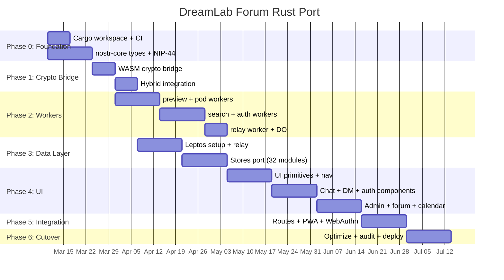

# PRD: DreamLab Community Forum — Full Rust Port

## 1. Executive Summary

Port the DreamLab community forum from TypeScript/SvelteKit to Rust/Leptos with
WebAssembly, targeting 10x cryptographic throughput, 70% memory reduction, and
elimination of GC pauses that degrade chat UX under load. The 5 Cloudflare Workers
backend services port from TypeScript to Rust via the `worker` crate.

**Scope**: `community-forum/` (68,037 lines across 257 files) + `workers/` (2,508
lines across 5 services). The React main site (`src/`) is explicitly excluded.

**Quality Baseline** (AQE v3 assessment, 2026-03-08):

| Metric | Current | Target |
|--------|---------|--------|
| Quality Score | 42/100 | 80+ |
| Cyclomatic Complexity | 3,465 | <500 |
| Maintainability Index | 47.22 | 75+ |
| Test Coverage | 70% | 90%+ |
| Security Score | 85/100 | 95+ |

## 2. Problem Statement

### 2.1 Performance Bottlenecks (Measured)

1. **NIP-44 Encryption**: JS `crypto.subtle` ECDH + AES-256-GCM blocks main thread.
   Current mitigation: Web Worker (`crypto.worker.ts`). Cost: message serialization
   overhead, 2-5ms per encrypt/decrypt cycle, GC pressure from Uint8Array copies.

2. **Event Processing**: Parsing thousands of Nostr JSON events causes V8 GC spikes
   (50-200ms pauses). Each `NDKEvent` object carries hidden class overhead (~400 bytes
   per event beyond payload). At 10K cached events = ~4MB wasted on object headers.

3. **Relay Connection Management**: `relay.ts` implements custom reconnect, timeout,
   NIP-42 AUTH — 800+ lines of fragile state machine logic that `rust-nostr` handles
   natively with proper backoff and connection pooling.

4. **Semantic Search**: ONNX WASM embedder (7.4MB) loaded via JS bridge. Each
   `embedOne()` call crosses JS↔WASM boundary with Float32Array copy overhead.

5. **Store Complexity**: 32 Svelte stores with circular reactive dependencies. The
   `channels.ts` store alone has cyclomatic complexity >50. No formal state machine
   (the `authMachine.ts` XState attempt was abandoned).

### 2.2 Architectural Debt

- 3 NDK singletons (`ndk.ts`, `relay.ts`, inline) with divergent relay sets
- `as ChannelSection` casts throughout (type safety theater)
- Hardcoded section/cohort IDs across 15+ files
- Mixed auth paradigms: passkey PRF + NIP-07 + nsec with 7 blind spots
- No compile-time query verification (D1/KV operations are stringly typed)

## 3. Goals and Non-Goals

### Goals
- G1: Port all community forum functionality to Rust/Leptos + WASM
- G2: Port all 5 Cloudflare Workers to Rust via `worker` crate
- G3: Achieve <1ms NIP-44 encrypt/decrypt (vs current 2-5ms)
- G4: Eliminate GC pauses entirely (zero-cost abstractions)
- G5: Reduce client memory footprint by 70% for 10K cached events
- G6: Shared `nostr-core` crate between client (WASM) and Workers (WASM)
- G7: Compile-time type safety for all Nostr event kinds and D1 queries
- G8: Maintain 100% feature parity with TypeScript version
- G9: Keep TailwindCSS + DaisyUI (scan `.rs` files instead of `.svelte`)
- G10: 90%+ test coverage with property-based testing (`proptest`)

### Non-Goals
- NG1: Port the React main site (`src/`) — stays TypeScript
- NG2: Change the Nostr protocol or relay NIP support
- NG3: Replace Cloudflare infrastructure (D1, KV, R2, DO stay)
- NG4: Rewrite the Service Worker in Rust (stays JS — minimal WASM benefit)
- NG5: Change the WebAuthn PRF key derivation scheme
- NG6: Migrate away from GitHub Pages hosting for the static site

## 4. Technology Stack

### 4.1 Stack Mapping

| Current (TypeScript) | Rust Replacement | Crate | Rationale |
|---------------------|------------------|-------|-----------|
| SvelteKit 2.49 | **Leptos 0.7** | `leptos` | Fine-grained signals ≈ Svelte runes; SSR/CSR/hydration |
| NDK 2.13 | **rust-nostr** | `nostr-sdk` | Native WASM, NIP-44/59, relay pool, NIP-42 auto-auth |
| Dexie (IndexedDB) | **rexie** | `rexie` | Rust IndexedDB; or `nostr-sdk` built-in storage |
| TailwindCSS 3.4 | **TailwindCSS 3.4** | (unchanged) | Scan `*.rs` instead of `*.svelte` |
| DaisyUI 4.x | **DaisyUI 4.x** | (unchanged) | CSS-only, framework-agnostic |
| Express / Hono | **Axum** (via `worker`) | `worker`, `axum` | `worker` crate compiles Rust to CF WASM Workers |
| @simplewebauthn | **webauthn-rs** | `webauthn-rs` | Mature, strict typing, FIDO2 compliant |
| crypto.subtle | **k256 + chacha20poly1305** | `k256`, `chacha20poly1305` | Native speed, no Web Worker needed |
| Zod validation | **serde + validator** | `serde`, `validator` | Compile-time (de)serialization, runtime validation |
| sqlx (none currently) | **sqlx** | `sqlx` | Compile-time verified D1 SQL queries |
| Vitest | **cargo test + proptest** | `proptest` | Property-based testing, deterministic shrinking |
| Playwright | **playwright-rs** or JS | | E2E stays JS or thin Rust wrapper |

### 4.2 Workspace Structure

```
community-forum-rs/
├── Cargo.toml              # Workspace root
├── crates/
│   ├── nostr-core/         # Shared: event types, NIP-44, NIP-98, validation
│   │   ├── src/lib.rs
│   │   └── Cargo.toml      # targets: wasm32-unknown-unknown + native
│   ├── forum-client/       # Leptos CSR app (compiles to WASM)
│   │   ├── src/
│   │   │   ├── main.rs
│   │   │   ├── app.rs      # Root component + router
│   │   │   ├── pages/      # 14 route pages
│   │   │   ├── components/ # 102 UI components
│   │   │   ├── stores/     # 32 reactive signal groups
│   │   │   ├── nostr/      # relay, subscriptions, pipeline
│   │   │   ├── auth/       # passkey, NIP-98, session
│   │   │   ├── search/     # RuVector, ONNX, IndexedDB cache
│   │   │   └── config/     # environment, zones, types
│   │   └── Cargo.toml
│   ├── auth-worker/        # CF Worker: WebAuthn + NIP-98
│   ├── pod-worker/         # CF Worker: Solid pods + R2
│   ├── search-worker/      # CF Worker: RuVector WASM
│   ├── relay-worker/       # CF Worker: Nostr relay + DO
│   └── preview-worker/     # CF Worker: Link preview
├── tailwind.config.js      # content: ["crates/**/*.rs"]
├── index.html              # Leptos trunk entry
└── tests/
    ├── unit/               # cargo test
    ├── integration/        # cross-crate tests
    └── e2e/                # Playwright (JS)
```

## 5. Phased Migration Plan

### Phase 0: Foundation (Week 1-2)

**Objective**: Rust workspace, CI/CD, shared types

| Task | Input | Output | Acceptance |
|------|-------|--------|------------|
| P0.1 Initialize Cargo workspace | — | `Cargo.toml` with 7 crates | `cargo check` passes |
| P0.2 Create `nostr-core` crate | `community-forum/src/lib/nostr/types.ts` | Rust types for all 12 event kinds | Types compile for both `wasm32` and native |
| P0.3 Port NIP-44 encryption | `encryption.ts` (280 lines) | `nostr_core::nip44` module | Property tests: encrypt→decrypt roundtrip for 10K random payloads |
| P0.4 Port NIP-98 signing | `nip98-client.ts` + `workers/shared/nip98.ts` | `nostr_core::nip98` module | Verify against current server with test vectors |
| P0.5 Port NIP-01 event serialization | `events.ts` | `nostr_core::event` module | Canonical JSON matches TypeScript output bit-for-bit |
| P0.6 CI pipeline | — | GitHub Actions: `cargo test`, `cargo clippy`, `wasm-pack test` | Green on push |
| P0.7 Benchmark harness | — | `criterion` benchmarks for NIP-44, event parsing | Baseline numbers documented |

**Quality Gate**: All `nostr-core` tests pass on both native and `wasm32-unknown-unknown`.

### Phase 1: Crypto & Core Logic (Week 3-4)

**Objective**: Replace JS crypto hot path with WASM, validate in production hybrid

| Task | Input | Output | Acceptance |
|------|-------|--------|------------|
| P1.1 Port key derivation (HKDF) | `passkey.ts` HKDF section | `nostr_core::keys::derive_from_prf()` | Same output as JS for test vectors |
| P1.2 Port secp256k1 operations | `keys.ts`, NDK signer | `nostr_core::keys` module | Schnorr sign/verify matches nostr-tools |
| P1.3 `wasm-bindgen` JS bridge | — | `nostr_core_wasm` npm package | Drop-in replacement for `crypto.worker.ts` |
| P1.4 Hybrid integration test | SvelteKit app + WASM bridge | Forum works with Rust crypto | Login, post message, encrypt DM — all via WASM |
| P1.5 Benchmark comparison | JS vs WASM encrypt | Performance report | Document speedup factor |

**Quality Gate**: Existing SvelteKit forum runs with Rust WASM crypto. No functionality regression.

### Phase 2: Workers Port (Week 5-8)

**Objective**: Port all 5 CF Workers from TypeScript to Rust

| Worker | Lines | Key Crates | Complexity |
|--------|-------|-----------|-----------|
| auth-worker | ~600 | `worker`, `webauthn-rs`, `nostr-core` | HIGH: WebAuthn + PRF + D1 + KV + R2 |
| relay-worker | ~430+420 | `worker`, `nostr-core`, D1, DO bindings | HIGH: WebSocket + Durable Objects |
| search-worker | ~430 | `worker`, `rvf-wasm` (already Rust) | MEDIUM: WASM-in-WASM eliminated |
| pod-worker | ~350 | `worker`, R2 bindings, WAC | MEDIUM: CRUD + ACL |
| preview-worker | ~200 | `worker`, HTML parser | LOW: HTTP fetch + parse |

| Task | Input | Output | Acceptance |
|------|-------|--------|------------|
| P2.1 Port preview-worker | `workers/link-preview-api/` | `preview-worker` crate | Health check + OG parse matches TS |
| P2.2 Port pod-worker | `workers/pod-api/` | `pod-worker` crate | CRUD + ACL tests pass |
| P2.3 Port search-worker | `workers/search-api/` | `search-worker` crate | rvf_wasm native integration (no JS bridge) |
| P2.4 Port auth-worker | `workers/auth-api/` | `auth-worker` crate | WebAuthn registration + login e2e |
| P2.5 Port relay-worker + DO | `workers/nostr-relay/` | `relay-worker` crate | WebSocket + NIP-42 + whitelist API |
| P2.6 Workers deploy pipeline | `.github/workflows/workers-deploy.yml` | Rust Workers CI/CD | All 5 deploy via `wrangler` |
| P2.7 Parallel deployment | — | TS Workers (canary) + Rust Workers (prod) | Zero-downtime cutover |

**Quality Gate**: All 5 Rust Workers pass health checks. `/api/check-whitelist`, `/search`, `/ingest`, WebSocket relay — all functional.

**Key advantage for search-worker**: The current architecture loads `rvf_wasm_bg.wasm`
via JS WebAssembly API inside a CF Worker. In Rust, the rvf functions compile directly
into the Worker binary — eliminating the JS↔WASM bridge entirely.

### Phase 3: Client Data Layer (Week 9-12)

**Objective**: Replace NDK + Svelte stores with rust-nostr + Leptos signals

| Task | Input | Output | Acceptance |
|------|-------|--------|------------|
| P3.1 Setup Leptos CSR project | — | `forum-client` crate, trunk build | Hello World renders |
| P3.2 Port relay connection | `relay.ts` (800 lines) | `nostr-sdk` RelayPool | Auto-reconnect, NIP-42, connection health |
| P3.3 Port subscription manager | `subscriptionManager.ts` | `nostr-sdk` subscriptions | REQ/CLOSE lifecycle matches TS |
| P3.4 Port auth store | `stores/auth.ts` | Leptos `create_signal` + `nostr-core` | Login/logout/session persistence |
| P3.5 Port user store | `stores/user.ts` | Leptos derived signals | Admin detection, cohorts, profile |
| P3.6 Port channel store | `stores/channels.ts` | Leptos resource + signals | Channel list, section filtering, zone access |
| P3.7 Port message store | `stores/messages.ts` | Leptos signals + event stream | Message CRUD, reactions, replies |
| P3.8 Port DM store | `stores/dm.ts` | Leptos signals + NIP-44 decrypt | Encrypted DM list, conversation threads |
| P3.9 Port IndexedDB layer | `db.ts` (Dexie) | `rexie` or `nostr-sdk` storage | Offline cache, search index |
| P3.10 Port semantic search | `semantic/ruvector-search.ts` | Direct WASM integration | ONNX embedder without JS bridge |
| P3.11 Port event pipeline | `pipeline/eventPipeline.ts` | Rust event processor | Kind routing, validation, indexing |

**Quality Gate**: Data layer tests pass. Relay connects, events flow, stores update.

### Phase 4: UI Components (Week 13-18)

**Objective**: Port all 102 Svelte components to Leptos

#### Component Groups (by dependency order)

| Group | Count | Examples | Complexity |
|-------|-------|---------|-----------|
| UI Primitives | 20 | Button, Modal, Input, Avatar, Badge | LOW |
| Navigation | 8 | Sidebar, TopBar, ChannelList, ZoneNav | MEDIUM |
| Chat | 15 | MessageItem, MessageInput, VirtualList, ThreadView | HIGH |
| Auth | 8 | AuthFlow, Login, Signup, NicknameSetup, NsecBackup | HIGH |
| Admin | 10 | UserManagement, WhitelistPanel, CohortEditor | MEDIUM |
| Forum | 12 | ForumPost, ForumThread, ForumCategory, ModeratorTeam | MEDIUM |
| DM | 8 | DMList, DMConversation, DMCompose, ContactList | HIGH |
| Calendar | 6 | EventCalendar, EventDetail, EventCreate | MEDIUM |
| User | 8 | ProfileCard, ProfileEdit, UserList, AvatarUpload | MEDIUM |
| Sections/Zones | 7 | ZoneGate, SectionView, AccessControl | MEDIUM |

| Task | Input | Output | Acceptance |
|------|-------|--------|------------|
| P4.1 Tailwind + DaisyUI setup | `tailwind.config.ts` | Config scanning `.rs` files | Styles render correctly |
| P4.2 Port UI primitives | `components/ui/` | Leptos components | Visual parity |
| P4.3 Port navigation | `components/navigation/` | Leptos components | Route transitions work |
| P4.4 Port auth flow | `components/auth/` | Leptos components | Passkey login e2e |
| P4.5 Port chat components | `components/chat/` | Leptos components | Send/receive/scroll/react |
| P4.6 Port DM components | `components/dm/` | Leptos components | Encrypted DM e2e |
| P4.7 Port admin panel | `components/admin/` | Leptos components | Whitelist management |
| P4.8 Port forum components | `components/forum/` | Leptos components | Thread create/reply |
| P4.9 Port calendar components | `components/calendar/` | Leptos components | Event CRUD |
| P4.10 Port remaining | `components/user/`, `sections/`, `zones/` | Leptos components | Full UI parity |

**Quality Gate**: All 14 routes render. Playwright e2e tests pass against Rust frontend.

### Phase 5: Routes & Integration (Week 19-20)

**Objective**: Wire all pages, router, PWA, Service Worker integration

| Task | Input | Output | Acceptance |
|------|-------|--------|------------|
| P5.1 Port Leptos router | `src/routes/` (14 routes) | Leptos router config | All routes navigate correctly |
| P5.2 Port layout components | `+layout.svelte` | Leptos layout | Sidebar + content + topbar |
| P5.3 PWA manifest + SW bridge | `service-worker.ts` | JS SW + WASM imports | Offline works, push notifications |
| P5.4 WebAuthn PRF integration | `passkey.ts` | `web-sys` + `nostr-core` | Passkey register + login |
| P5.5 Full integration test | — | All features working | Feature parity checklist 100% |

### Phase 6: Optimization & Cutover (Week 21-22)

| Task | Input | Output | Acceptance |
|------|-------|--------|------------|
| P6.1 WASM size optimization | `forum-client` binary | `wasm-opt -Oz`, code splitting | <2MB gzipped initial load |
| P6.2 Performance benchmarks | criterion + browser profiling | Performance report | Meets all targets in §7 |
| P6.3 Security audit | Full codebase | Audit report | No CRITICAL/HIGH findings |
| P6.4 Canary deployment | — | 10% traffic to Rust frontend | Error rate <0.1% |
| P6.5 Full cutover | — | 100% traffic to Rust | SvelteKit version archived |

## 6. Module-by-Module Porting Reference

### 6.1 Stores → Signals (32 modules)

| Svelte Store | Leptos Signal | Key Change |
|-------------|---------------|------------|
| `auth.ts` (closure privkey) | `RwSignal<AuthState>` + `StoredValue<[u8;32]>` | Privkey in `StoredValue` (no reactive leak) |
| `channels.ts` (complex derived) | `Resource` + `Memo` | Async channel fetch → `create_resource` |
| `messages.ts` (event stream) | `Signal` + `use_interval` | NDK subscription → `nostr-sdk` stream |
| `dm.ts` (NIP-44 decrypt) | `Resource` with decrypt | Decrypt in same WASM context (no worker) |
| `ndk.ts` (3 singletons) | Single `RelayPool` in context | Eliminates relay set divergence |
| `user.ts` (whitelist verify) | `Resource<WhitelistStatus>` | Server call → typed response |
| `reactions.ts` | `Signal<HashMap<EventId, Vec<Reaction>>>` | O(1) lookup vs O(n) filter |
| `pinnedMessages.ts` | `Signal<BTreeSet<EventId>>` | Sorted, deduplicated by default |

### 6.2 Nostr Modules → nostr-core (24 modules)

| TS Module | Rust Module | Lines | Notes |
|-----------|------------|-------|-------|
| `encryption.ts` | `nostr_core::nip44` | 280 | `k256` + `chacha20poly1305` |
| `keys.ts` | `nostr_core::keys` | 150 | `k256::SecretKey`, `schnorr` |
| `events.ts` | `nostr_core::event` | 200 | `serde_json` canonical |
| `relay.ts` | `nostr_sdk::RelayPool` | 800→0 | Deleted — handled by SDK |
| `subscriptionManager.ts` | `nostr_sdk::Subscription` | 300→0 | Deleted — handled by SDK |
| `channels.ts` | `nostr_core::channel` | 400 | Typed channel events |
| `groups.ts` | `nostr_core::group` | 350 | NIP-29 group management |
| `dm.ts` | `nostr_core::dm` | 250 | NIP-17/59 gift wrap |
| `whitelist.ts` | `nostr_core::whitelist` | 200 | Typed API client |
| `admin-security.ts` | `nostr_core::admin` | 300 | Signature verification |
| `sections.ts` | `nostr_core::section` | 500 | Zone-based access control |
| `nip07.ts` | `nostr_core::nip07` | 100 | `web-sys` bridge to extension |

### 6.3 Workers → Rust Workers (5 services)

| Worker | TS Lines | Key Dependencies | Rust Crates |
|--------|----------|-----------------|-------------|
| auth-api | 600 | webauthn, D1, KV, R2 | `worker`, `webauthn-rs`, `nostr-core`, `serde` |
| relay | 430+420 | D1, DO, WebSocket | `worker`, `nostr-core`, `serde` |
| search-api | 430 | rvf_wasm, R2, KV | `worker`, `rvf-wasm` (direct link), `nostr-core` |
| pod-api | 350 | R2, KV, WAC | `worker`, `serde` |
| link-preview | 200 | fetch, HTML parse | `worker`, `scraper` |

## 7. Performance Targets

| Metric | Current (TS) | Target (Rust) | Method |
|--------|-------------|--------------|--------|
| NIP-44 encrypt | 2-5ms | <0.5ms | `k256` + `chacha20poly1305` native |
| NIP-44 decrypt | 2-5ms | <0.5ms | Same |
| Event parse (1K) | 15-30ms + GC | <2ms, zero GC | `serde_json` + arena allocation |
| Event parse (10K) | 150-300ms + GC | <20ms, zero GC | Same |
| Memory per event | ~400 bytes overhead | ~0 overhead | Packed structs in linear memory |
| Memory (10K events) | ~8MB (4MB overhead) | ~2.4MB | 70% reduction |
| Initial WASM load | N/A (JS bundles) | <2MB gzipped | `wasm-opt -Oz` + code splitting |
| Relay reconnect | Custom (800 lines) | Built-in (0 lines) | `nostr-sdk` RelayPool |
| Search query | 0.47ms (WASM bridge) | 0.3ms (native) | Direct rvf_wasm link |
| Worker cold start | 10-50ms (JS parse) | 5-15ms (WASM instant) | Compiled WASM binary |

## 8. Risk Assessment

| Risk | Probability | Impact | Mitigation |
|------|------------|--------|------------|
| WASM binary too large (>3MB) | MEDIUM | HIGH | Code splitting, lazy module loading, `wasm-opt -Oz` |
| Leptos ecosystem gaps (PWA, i18n) | MEDIUM | MEDIUM | Thin JS wrapper for Service Worker, `leptos_i18n` |
| WebAuthn PRF `web-sys` bindings missing | LOW | HIGH | Manual `wasm-bindgen` bindings for extension outputs |
| Durable Objects Rust support | MEDIUM | HIGH | `worker` crate DO bindings, or thin JS DO wrapper |
| Team Rust learning curve | HIGH | MEDIUM | Phase 0-1 ramp-up period, pair programming |
| Feature regression during port | MEDIUM | HIGH | Parallel deploy, Playwright e2e against both versions |
| `nostr-sdk` WASM maturity | LOW | MEDIUM | Already used in production by several Nostr clients |

## 9. Testing Strategy

### 9.1 Test Pyramid

```
         ╱‾‾‾‾‾‾‾‾‾╲
        │  E2E (JS)  │  Playwright: 14 routes, auth flow, DM, admin
       ╱─────────────────╲
      │  Integration (Rust) │  Cross-crate: nostr-core + Workers
     ╱─────────────────────────╲
    │  Unit + Property (Rust)    │  proptest: crypto roundtrips, event parsing
   ╱─────────────────────────────────╲
  │  Static Analysis (cargo clippy)    │  Zero warnings, deny(unsafe_code)
 ╱─────────────────────────────────────────╲
│  Compile-Time (Rust type system)           │  Event kinds, D1 queries, NIP validation
╲─────────────────────────────────────────────╱
```

### 9.2 Critical Test Scenarios

| Scenario | Type | Crate | Priority |
|----------|------|-------|----------|
| NIP-44 encrypt→decrypt roundtrip (10K random) | Property | nostr-core | P0 |
| NIP-98 sign→verify with real server | Integration | nostr-core + auth-worker | P0 |
| WebAuthn PRF register→login | E2E | forum-client + auth-worker | P0 |
| Passkey cross-device blocked | E2E | forum-client | P0 |
| Relay reconnect after disconnect | Integration | forum-client | P1 |
| Admin whitelist check (env + D1 cohort) | Unit | relay-worker | P0 |
| Channel zone access control | Unit | nostr-core | P1 |
| DM encryption end-to-end | E2E | forum-client | P1 |
| Search ingest→query roundtrip | Integration | search-worker | P1 |
| 10K event parse benchmark | Benchmark | nostr-core | P1 |

### 9.3 Quality Gates per Phase

| Phase | Gate | Threshold |
|-------|------|-----------|
| P0 | `nostr-core` compiles for wasm32 + native | 100% tests pass |
| P1 | Hybrid SvelteKit + WASM crypto works | Zero regression |
| P2 | All 5 Rust Workers health checks pass | HTTP 200 |
| P3 | Data layer tests pass, relay connects | Events flow end-to-end |
| P4 | All 14 routes render, Playwright passes | Feature parity checklist |
| P5 | PWA offline works, full integration | Zero P0 bugs |
| P6 | Performance targets met, security audit clean | All metrics in §7 |

## 10. Dependencies & Prerequisites

### 10.1 Toolchain

```bash
# Rust toolchain
rustup target add wasm32-unknown-unknown
cargo install trunk            # Leptos build tool
cargo install wasm-bindgen-cli # JS bridge generator
cargo install worker-build     # CF Worker compiler
cargo install cargo-criterion  # Benchmarking
cargo install wasm-opt         # Binary optimizer

# Existing (unchanged)
npm install -D tailwindcss daisyui  # CSS (scans .rs files)
npx playwright install              # E2E testing
```

### 10.2 Key Crate Versions

| Crate | Version | Purpose |
|-------|---------|---------|
| `leptos` | 0.7.x | UI framework |
| `nostr-sdk` | 0.37.x | Nostr protocol + relay |
| `worker` | 0.4.x | Cloudflare Workers |
| `webauthn-rs` | 0.5.x | WebAuthn/FIDO2 |
| `k256` | 0.13.x | secp256k1 |
| `chacha20poly1305` | 0.10.x | NIP-44 AEAD |
| `serde` | 1.x | Serialization |
| `sqlx` | 0.8.x | D1 queries (compile-time verified) |
| `rexie` | 0.6.x | IndexedDB |
| `proptest` | 1.x | Property-based testing |
| `criterion` | 0.5.x | Benchmarking |

## 11. Success Criteria

The port is complete when:

1. All 14 forum routes work in the Rust/Leptos version
2. All 5 Rust Workers deployed and passing health checks
3. Passkey registration + login works end-to-end
4. NIP-44 encrypted DMs work end-to-end
5. Semantic search (ONNX + RuVector) works end-to-end
6. Admin panel with whitelist management works
7. Performance targets in §7 are met (verified by benchmarks)
8. Security audit returns no CRITICAL or HIGH findings
9. Playwright e2e test suite passes with >95% rate
10. WASM binary <2MB gzipped after optimization

## 12. Timeline Summary



**Total duration**: ~22 weeks (5.5 months)
**Parallel work possible**: Phases 2 and 3 can overlap after Phase 1

## 13. References

- [Leptos Book](https://book.leptos.dev/)
- [rust-nostr SDK](https://github.com/rust-nostr/nostr)
- [worker crate (CF)](https://github.com/cloudflare/workers-rs)
- [webauthn-rs](https://github.com/kanidm/webauthn-rs)
- [ADR-010: Return to Cloudflare](docs/adr/010-return-to-cloudflare.md)
- [ADR-012: Hardening Sprint](docs/adr/012-hardening-sprint.md)
- [RVF Runtime Architecture](docs/rvf-runtime-architecture.md)
- [Technical Debt Audit](docs/audit-technical-debt-2026-03-01.md)
- [Quality Assessment](community-forum/.agentic-qe/results/quality/)
