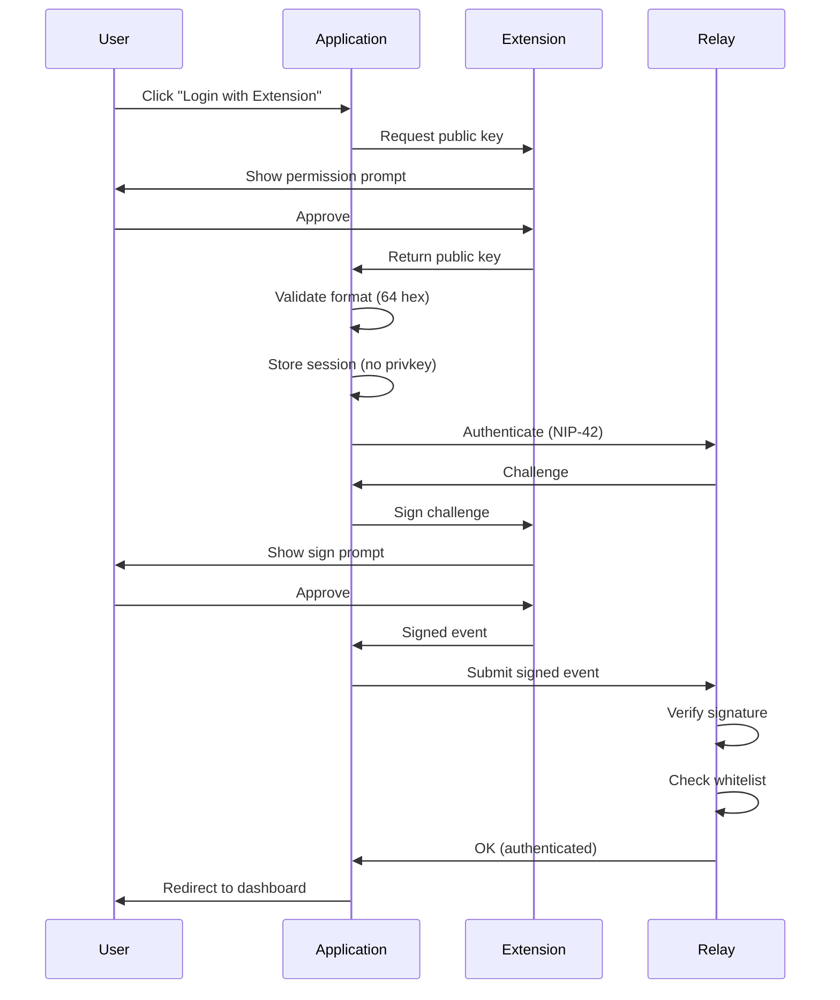

# Authentication & Identity

**Last Updated:** 2026-01-25

This document details the authentication mechanisms, identity management, and key handling in the Fairfield platform.

---

## Table of Contents

1. [Authentication Methods](#authentication-methods)
2. [NIP-07 Browser Extension Authentication](#nip-07-browser-extension-authentication)
3. [Key-Based Authentication](#key-based-authentication)
4. [NIP-42 Relay Authentication](#nip-42-relay-authentication)
5. [Session Management](#session-management)
6. [Key Recovery](#key-recovery)
7. [Security Considerations](#security-considerations)

---

## Authentication Methods

The platform supports two authentication methods:

| Method | Security Level | User Experience | Use Case |
|--------|----------------|-----------------|----------|
| **NIP-07 Extension** | Highest | Best | Primary (hardware key support) |
| **nsec Login** | High | Good | Fallback, mobile |

### Method Selection

```typescript
// src/lib/stores/auth.ts
export async function detectAuthMethod(): Promise<'nip07' | 'nsec' | 'none'> {
  // 1. Check for NIP-07 extension
  if (await waitForNip07(2000)) {
    return 'nip07';
  }

  // 2. Check for stored encrypted key
  const stored = localStorage.getItem(STORAGE_KEY);
  if (stored) {
    const data = JSON.parse(stored);
    if (data.encryptedPrivateKey || data.privateKey) {
      return 'nsec';
    }
  }

  return 'none';
}
```

---

## NIP-07 Browser Extension Authentication

### Overview

NIP-07 defines a standard interface for Nostr signing extensions. Private keys remain in the extension's secure storage and never touch the application code.

### Supported Extensions

| Extension | URL | Features |
|-----------|-----|----------|
| **Alby** | https://getalby.com | Lightning, hardware key support |
| **nos2x** | https://github.com/fiatjaf/nos2x | Lightweight, open source |
| **Nostore** | https://nostore.org | Mobile support |
| **Flamingo** | https://flamingo.me | Desktop integration |

### Extension Detection

```typescript
// src/lib/nostr/nip07.ts
export function hasNip07Extension(): boolean {
  return typeof window.nostr !== 'undefined';
}

export async function waitForNip07(timeout = 2000): Promise<boolean> {
  if (hasNip07Extension()) return true;

  return new Promise((resolve) => {
    const start = Date.now();

    const check = () => {
      if (hasNip07Extension()) {
        resolve(true);
      } else if (Date.now() - start > timeout) {
        resolve(false);
      } else {
        setTimeout(check, 100);
      }
    };

    check();
  });
}
```

### Login Flow



### Implementation

```typescript
// src/lib/stores/auth.ts
export async function loginWithExtension(): Promise<{ publicKey: string }> {
  // 1. Wait for extension to load
  const extensionReady = await waitForNip07(2000);
  if (!extensionReady) {
    throw new Error('No NIP-07 extension found. Please install Alby, nos2x, or another Nostr signer.');
  }

  // 2. Request public key (triggers user prompt)
  const publicKey = await getPublicKeyFromExtension();

  // 3. Get extension name for UI
  const extensionName = getExtensionName();

  // 4. Store session data (no private key)
  localStorage.setItem(STORAGE_KEY, JSON.stringify({
    publicKey,
    isNip07: true,
    extensionName,
    accountStatus: 'complete',
    nsecBackedUp: true // Extension manages keys
  }));

  // 5. Configure NDK to use extension signer
  setNip07Signer();

  // 6. Update auth store
  authStore.update(state => ({
    ...state,
    publicKey,
    privateKey: null,
    isAuthenticated: true,
    isNip07: true,
    extensionName
  }));

  return { publicKey };
}
```

### Extension Signing

```typescript
// src/lib/nostr/nip07.ts
export async function signEventWithExtension(event: {
  kind: number;
  content: string;
  tags: string[][];
  created_at: number;
  pubkey: string;
}): Promise<SignedEvent> {
  if (!window.nostr) {
    throw new Error('No NIP-07 extension available');
  }

  try {
    // Extension handles signing
    const signedEvent = await window.nostr.signEvent(event);
    return signedEvent;
  } catch (error) {
    if (error.message.includes('User rejected')) {
      throw new Error('Signing rejected by user');
    }
    throw error;
  }
}
```

### Security Benefits

1. **Private Key Isolation**: Key never leaves extension
2. **User Approval**: Each signing operation requires explicit approval
3. **Hardware Key Support**: Extensions like Alby support YubiKey, Ledger
4. **Audit Trail**: Extensions log all signing requests
5. **Revocable Access**: User can revoke app permissions in extension

---

## Key-Based Authentication

### Overview

When NIP-07 extension is unavailable, users can login directly with their nsec (private key). The private key is encrypted before storage.

### Key Generation

```typescript
// Generate new key pair
import { generatePrivateKey, getPublicKey } from 'nostr-tools/pure';

const privateKey = generatePrivateKey(); // 32 bytes random
const publicKey = getPublicKey(privateKey);
```

**With BIP-39 Recovery:**

```typescript
import { generateMnemonic, mnemonicToSeed } from '@scure/bip39';
import { HDKey } from '@scure/bip32';

// 1. Generate 12-word mnemonic
const mnemonic = generateMnemonic(wordlist, 128);

// 2. Derive seed
const seed = await mnemonicToSeed(mnemonic);

// 3. Derive key using NIP-06 path
const hdKey = HDKey.fromMasterSeed(seed);
const derived = hdKey.derive("m/44'/1237'/0'/0/0");

const privateKey = bytesToHex(derived.privateKey);
const publicKey = getPublicKey(privateKey);
```

### Session Key Encryption

Private keys are encrypted with a session-specific key before storage:

```typescript
// src/lib/stores/auth.ts
async function setKeys(
  publicKey: string,
  privateKey: string
): Promise<void> {
  // 1. Generate or retrieve session key
  const sessionKey = getSessionKey();

  // 2. Encrypt private key
  const encryptedPrivateKey = await encryptPrivateKey(
    privateKey,
    sessionKey
  );

  // 3. Store encrypted key
  localStorage.setItem(STORAGE_KEY, JSON.stringify({
    publicKey,
    encryptedPrivateKey,
    isEncrypted: true
  }));

  // 4. Update auth state
  authStore.update(state => ({
    ...state,
    publicKey,
    privateKey, // In-memory only
    isAuthenticated: true,
    isEncrypted: true
  }));
}
```

### Session Key Generation

```typescript
// src/lib/stores/auth.ts
function getSessionKey(): string {
  let sessionKey = sessionStorage.getItem(SESSION_KEY);

  if (!sessionKey) {
    // Generate random 32-byte key
    const array = new Uint8Array(32);
    crypto.getRandomValues(array);
    sessionKey = btoa(String.fromCharCode(...array));

    // Store in sessionStorage (cleared on tab close)
    sessionStorage.setItem(SESSION_KEY, sessionKey);
  }

  return sessionKey;
}
```

### Session Restoration

```typescript
// src/lib/stores/auth.ts
async function restoreSession(): Promise<void> {
  const stored = localStorage.getItem(STORAGE_KEY);
  if (!stored) {
    authStore.update(state => ({ ...state, isReady: true }));
    return;
  }

  const parsed = JSON.parse(stored);

  // Check for NIP-07 mode
  if (parsed.isNip07) {
    const extensionReady = await waitForNip07(1000);
    if (extensionReady) {
      const currentPubkey = await getPublicKeyFromExtension();
      if (currentPubkey === parsed.publicKey) {
        setNip07Signer();
        authStore.update(state => ({
          ...state,
          publicKey: parsed.publicKey,
          isAuthenticated: true,
          isNip07: true,
          isReady: true
        }));
        return;
      }
    }
  }

  // Check for encrypted private key
  if (parsed.encryptedPrivateKey) {
    const sessionKey = getSessionKey();
    try {
      const privateKey = await decryptPrivateKey(
        parsed.encryptedPrivateKey,
        sessionKey
      );

      authStore.update(state => ({
        ...state,
        publicKey: parsed.publicKey,
        privateKey,
        isAuthenticated: true,
        isEncrypted: true,
        isReady: true
      }));
    } catch {
      // Session key changed - need re-authentication
      authStore.update(state => ({
        ...state,
        publicKey: parsed.publicKey,
        isAuthenticated: false,
        error: 'Session expired. Please enter your password to unlock.',
        isReady: true
      }));
    }
  }
}
```

---

## NIP-42 Relay Authentication

### Overview

NIP-42 defines relay authentication using challenge-response protocol. The relay sends a random challenge string, and the client signs it to prove key ownership.

### Protocol Flow

```
Client                          Relay
   │                               │
   ├─── WebSocket Connect ────────>│
   │                               │
   │<────── AUTH challenge ─────────┤
   │        (random string)        │
   │                               │
   ├─ Sign challenge with privkey ─┤
   │                               │
   ├─── AUTH response ────────────>│
   │    (signed event kind 22242)  │
   │                               │
   │                               ├─ Verify signature
   │                               ├─ Check whitelist
   │                               │
   │<────── OK (authenticated) ─────┤
   │           OR                  │
   │<────── NOTICE (rejected) ──────┤
   │                               │
```

### Event Structure

```typescript
// AUTH challenge
["AUTH", "<random-challenge-string>"]

// AUTH response
{
  kind: 22242,
  pubkey: "<user-pubkey>",
  created_at: <unix-timestamp>,
  tags: [
    ["relay", "<relay-url>"],
    ["challenge", "<challenge-string>"]
  ],
  content: "",
  sig: "<schnorr-signature>"
}
```

### Implementation

```typescript
// src/lib/nostr/ndk.ts
import NDK, { type NDKAuthPolicy } from '@nostr-dev-kit/ndk';

const authPolicy: NDKAuthPolicy = async (relay, challenge) => {
  const $auth = get(authStore);

  if (!$auth.privateKey) {
    throw new Error('Not authenticated');
  }

  // Create auth event
  const event = {
    kind: 22242,
    created_at: Math.floor(Date.now() / 1000),
    tags: [
      ['relay', relay.url],
      ['challenge', challenge]
    ],
    content: ''
  };

  // Sign with private key
  const signedEvent = finalizeEvent(event, hexToBytes($auth.privateKey));

  return signedEvent;
};

// Configure NDK
const ndk = new NDK({
  explicitRelayUrls: RELAY_URLS,
  authPolicy
});
```

---

## Session Management

### Session Lifetime

| Storage | Lifetime | Security | Use Case |
|---------|----------|----------|----------|
| `sessionStorage` | Tab session | High | Session keys |
| `localStorage` | Persistent | Medium | Encrypted keys |
| Memory (variables) | Page lifetime | Highest | Decrypted keys |

### PWA Persistent Auth

For installed PWAs, authentication can persist across app restarts:

```typescript
// src/lib/stores/auth.ts
function isRunningAsPWA(): boolean {
  return (
    window.matchMedia('(display-mode: standalone)').matches ||
    localStorage.getItem('nostr_bbs_pwa_mode') === 'true'
  );
}

async function setKeys(publicKey: string, privateKey: string): Promise<void> {
  // Standard encryption for all users
  const sessionKey = getSessionKey();
  const encryptedPrivateKey = await encryptPrivateKey(privateKey, sessionKey);

  localStorage.setItem(STORAGE_KEY, JSON.stringify({
    publicKey,
    encryptedPrivateKey
  }));

  // For PWA: also store persistent auth
  if (isRunningAsPWA()) {
    localStorage.setItem(PWA_AUTH_KEY, JSON.stringify({
      publicKey,
      privateKey, // Encrypted by browser's origin-bound storage
      timestamp: Date.now()
    }));
  }

  authStore.update(state => ({
    ...state,
    publicKey,
    privateKey,
    isAuthenticated: true
  }));
}
```

### Logout

```typescript
// src/lib/stores/auth.ts
async function logout(): Promise<void> {
  // 1. Clear NDK signer
  clearSigner();

  // 2. Clear all storage
  localStorage.removeItem(STORAGE_KEY);
  localStorage.removeItem(PWA_AUTH_KEY);
  sessionStorage.removeItem(SESSION_KEY);
  deleteCookie(COOKIE_KEY);

  // 3. Reset auth state
  authStore.set({
    state: 'unauthenticated',
    pubkey: null,
    isAuthenticated: false,
    publicKey: null,
    privateKey: null,
    isNip07: false,
    isReady: true
  });

  // 4. Redirect to home
  goto('/');
}
```

---

## Key Recovery

### nsec Format (NIP-19)

Private keys can be encoded as bech32 strings for backup:

```typescript
import { nip19 } from 'nostr-tools';

// Encode private key
const nsec = nip19.nsecEncode(privateKeyHex);
// Result: nsec1qqqqqqqqqqqqqqqqqqqqqqqqqqqqqqqqqqqqqqqqqqqqqqqqqqqqqqq...

// Decode for recovery
const { type, data } = nip19.decode(nsec);
if (type === 'nsec') {
  const privateKey = data; // hex string
}
```

### BIP-39 Mnemonic Recovery

```typescript
import { mnemonicToSeed } from '@scure/bip39';
import { HDKey } from '@scure/bip32';

async function recoverFromMnemonic(mnemonic: string): Promise<{
  privateKey: string;
  publicKey: string;
}> {
  // 1. Validate mnemonic
  if (!validateMnemonic(mnemonic, wordlist)) {
    throw new Error('Invalid mnemonic phrase');
  }

  // 2. Derive seed
  const seed = await mnemonicToSeed(mnemonic);

  // 3. Derive keys using NIP-06 path
  const hdKey = HDKey.fromMasterSeed(seed);
  const derived = hdKey.derive("m/44'/1237'/0'/0/0");

  const privateKey = bytesToHex(derived.privateKey);
  const publicKey = getPublicKey(privateKey);

  return { privateKey, publicKey };
}
```

---

## Security Considerations

### Key Storage Security

1. **Never store plaintext keys in localStorage**
   ```typescript
   // ❌ WRONG
   localStorage.setItem('privkey', privateKey);

   // ✅ CORRECT
   const encrypted = await encryptPrivateKey(privateKey, sessionKey);
   localStorage.setItem('privkey', encrypted);
   ```

2. **Clear sensitive data from memory**
   ```typescript
   // After use, overwrite with zeros (best effort)
   let privateKey = '...';
   // ... use key ...
   privateKey = '0'.repeat(64);
   privateKey = null;
   ```

3. **Session-bound encryption**
   - Session keys in `sessionStorage` cleared on tab close
   - Requires re-authentication on new session
   - PWA mode can persist with user consent

### Extension Security

1. **Verify extension authenticity**
   - Install only from official browser stores
   - Check developer signatures
   - Read community reviews

2. **Permission management**
   - Review permissions before granting
   - Revoke unused app permissions
   - Monitor signing requests

### User Education

**Critical warnings shown to users:**

1. **nsec Backup Warning:**
   > Your nsec is your master key. Anyone with access can impersonate you and read your encrypted messages. Store it securely offline.

2. **Extension Permission:**
   > This extension will handle all cryptographic signing. Only approve if you trust this extension.

3. **Phishing Warning:**
   > Always verify the URL. Never enter your nsec on unfamiliar sites.

---

## Related Documentation

- [Security Overview](./SECURITY_OVERVIEW.md)
- [Data Protection](./DATA_PROTECTION.md)
- [Key Encryption Implementation](../../community-forum/src/lib/utils/key-encryption.ts)
- [NIP-07 Implementation](../../community-forum/src/lib/nostr/nip07.ts)

---

**Security Note**: This authentication system provides strong security when used correctly. Users must protect their nsec/mnemonic like a master password.
