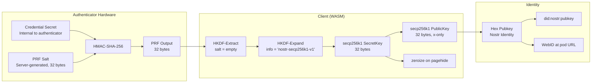
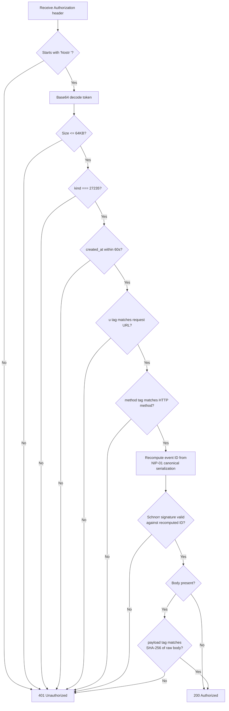
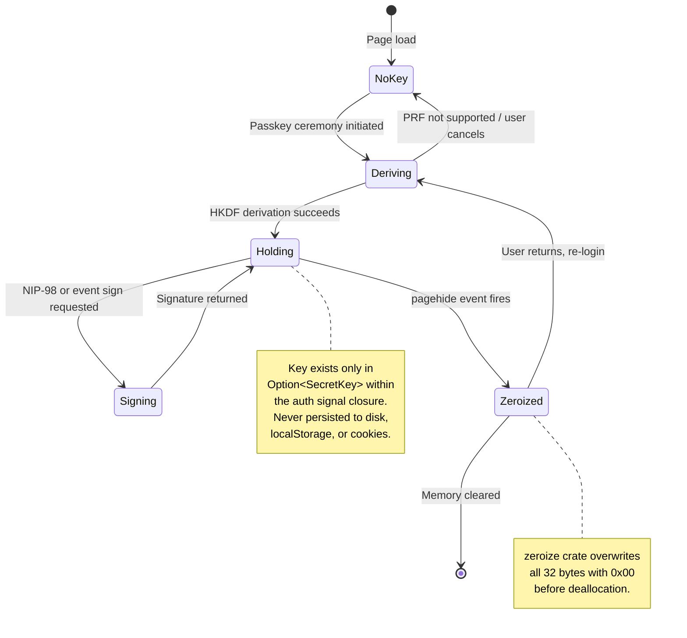

# Authentication -- DreamLab Community Forum (Rust Port)

**Last updated:** 2026-03-08 | [Back to Documentation Index](../README.md)

---

## Table of Contents

- [Auth Methods](#auth-methods)
- [Registration Flow](#registration-flow)
- [Login Flow](#login-flow)
- [PRF Key Derivation](#prf-key-derivation)
- [Platform Restrictions](#platform-restrictions)
- [NIP-98 HTTP Authentication](#nip-98-http-authentication)
- [Private Key Lifecycle](#private-key-lifecycle)
- [Session Management](#session-management)
- [Related Documents](#related-documents)

---

## Auth Methods

| Method | Priority | Key Source | NIP-98 Capable | Key Storage |
|--------|----------|-----------|----------------|-------------|
| Passkey PRF | Primary | WebAuthn PRF + HKDF | Yes | In-memory `Option<SecretKey>`, zeroized on unload |
| NIP-07 | Extension | Browser extension (nos2x, Alby) | Yes (extension signs) | Extension-managed |
| nsec | Advanced | User-provided hex private key | Yes | In-memory only |

Passkey PRF is the only method that derives a key deterministically from the authenticator hardware. NIP-07 and nsec users have `privateKey: None` in the Rust auth state -- the extension or user-provided key handles signing directly.

---

## Registration Flow

```mermaid
sequenceDiagram
    actor User
    participant Client as Leptos Client<br/>(WASM)
    participant Auth as auth-worker<br/>(Rust)
    participant D1 as D1: dreamlab-auth
    participant R2 as R2: dreamlab-pods
    participant KV as KV: POD_META

    User->>Client: Click "Create Account"
    Client->>Auth: POST /auth/register/options<br/>{ displayName: "Alice" }
    Auth->>Auth: Generate challenge (32 bytes)<br/>Generate PRF salt (32 bytes)
    Auth->>D1: Store challenge with 5-min TTL
    Auth-->>Client: PublicKeyCredentialCreationOptions<br/>+ prfSalt (base64url)

    Client->>User: Browser WebAuthn prompt
    User->>Client: Touch authenticator

    Note over Client: PRF extension returns<br/>HMAC-SHA-256(credential_secret, prf_salt)

    Client->>Client: HKDF(PRF output) -> secp256k1 privkey
    Client->>Client: Derive pubkey from privkey
    Client->>Auth: POST /auth/register/verify<br/>{ pubkey, response, prfSalt }

    Auth->>Auth: Verify attestation<br/>(type, challenge, origin, flags)
    Auth->>D1: Store credential<br/>(pubkey, credential_id, prf_salt, counter)
    Auth->>D1: Consume challenge

    Note over Auth: Pod Provisioning

    Auth->>R2: Create profile card<br/>(JSON-LD at /pods/{pubkey}/profile/card)
    Auth->>KV: Create default ACL<br/>(owner: RWC, public: R on profile + public media)
    Auth->>KV: Store pod metadata

    Auth-->>Client: { verified: true, pubkey, didNostr,<br/>webId, podUrl }
    Client->>Client: Store pubkey in auth signal<br/>Hold privkey in Option&lt;SecretKey&gt;
    Client-->>User: Registration complete
```

---

## Login Flow

```mermaid
sequenceDiagram
    actor User
    participant Client as Leptos Client<br/>(WASM)
    participant Auth as auth-worker<br/>(Rust)
    participant D1 as D1: dreamlab-auth

    Client->>Auth: POST /auth/login/options<br/>{ pubkey: "64-char hex" }
    Auth->>D1: Look up credential by pubkey
    Auth->>Auth: Generate challenge (32 bytes)
    Auth->>D1: Store challenge with 5-min TTL
    Auth-->>Client: PublicKeyCredentialRequestOptions<br/>+ stored prfSalt

    Client->>User: Browser WebAuthn prompt
    User->>Client: Touch authenticator

    Note over Client: Same PRF salt + same credential<br/>= same PRF output (deterministic)

    Client->>Client: HKDF(PRF output) -> same privkey
    Client->>Client: Sign NIP-98 token with privkey

    Client->>Auth: POST /auth/login/verify<br/>Authorization: Nostr &lt;token&gt;<br/>{ response: assertion }

    Auth->>Auth: Verify NIP-98 token<br/>(kind, timestamp, URL, method, signature)
    Auth->>Auth: Verify assertion<br/>(rpIdHash, UP/UV flags, counter)
    Auth->>D1: Verify counter advanced<br/>Update counter
    Auth->>D1: Consume challenge

    Auth-->>Client: { verified: true, pubkey, didNostr }
    Client->>Client: Store pubkey + privkey in auth signal
    Client-->>User: Login complete

    Note over Client: Discoverable credentials allow<br/>login on new devices without<br/>remembering which credential was used
```

### Credential Discovery (Lookup)

For discoverable credential flows where the client does not know which pubkey to request options for:

```
POST /auth/lookup { credentialId: "..." } -> { pubkey: "64-char hex" }
```

The client uses the returned pubkey to proceed with the standard login flow.

---

## PRF Key Derivation


```mermaid
graph LR
    subgraph "Authenticator Hardware"
        CRED_SECRET[Credential Secret<br/>Internal to authenticator]
        PRF_SALT[PRF Salt<br/>Server-generated, 32 bytes]
        HMAC[HMAC-SHA-256]
        CRED_SECRET --> HMAC
        PRF_SALT --> HMAC
        HMAC --> PRF_OUT[PRF Output<br/>32 bytes]
    end

    subgraph "Client (WASM)"
        PRF_OUT --> HKDF_EXTRACT[HKDF-Extract<br/>salt = empty]
        HKDF_EXTRACT --> HKDF_EXPAND[HKDF-Expand<br/>info = 'nostr-secp256k1-v1']
        HKDF_EXPAND --> PRIV_KEY[secp256k1 SecretKey<br/>32 bytes]
        PRIV_KEY --> PUB_KEY[secp256k1 PublicKey<br/>32 bytes, x-only]
        PRIV_KEY --> ZEROIZE[zeroize on pagehide]
    end

    subgraph "Identity"
        PUB_KEY --> HEX_PK[Hex Pubkey<br/>Nostr Identity]
        HEX_PK --> DID[did:nostr:pubkey]
        HEX_PK --> WEBID[WebID at pod URL]
    end
```

### Rust Implementation

```rust
pub fn derive_from_prf(prf_output: &[u8; 32]) -> Result<SecretKey, KeyError> {
    let hk = Hkdf::<Sha256>::new(Some(&[]), prf_output);
    let mut okm = [0u8; 32];
    hk.expand(b"nostr-secp256k1-v1", &mut okm)?;
    let key = SecretKey::from_bytes((&okm).into())?;
    okm.zeroize();
    Ok(key)
}
```

### Determinism Guarantee

Same PRF salt + same credential always produces the same private key. The server stores `(credential_id, prf_salt, counter, pubkey)` in D1 and returns the stored PRF salt during login. This is what makes passkey login work without ever persisting the private key.

### PasskeyCredential Struct

```rust
pub struct PasskeyCredential {
    pub credential_id: String,  // Base64url credential ID
    pub prf_salt: String,       // Server-generated 32-byte salt (base64url)
    pub counter: u32,           // Signature counter for replay detection
    pub pubkey: String,         // Hex secp256k1 public key (Nostr identity)
    pub public_key: String,     // Base64url COSE public key from attestation
    pub created_at: u64,        // Unix timestamp (ms)
}
```

---

## Platform Restrictions

| Platform | Supported | Reason |
|----------|-----------|--------|
| macOS / iOS (Touch ID, Face ID) | Yes | Full PRF extension support |
| Android (Fingerprint, PIN) | Yes | Full PRF extension support |
| YubiKey / USB security keys | Yes | Consistent PRF output across sessions |
| Cross-device QR authentication | Blocked | Remote authenticators produce different PRF output; derived key would not match registered pubkey |
| Windows Hello | Blocked | No PRF extension support (`prf.enabled === false`); user receives error message |
| Browser NIP-07 extensions | Yes (alternate path) | Extension handles signing; no PRF derivation needed |

The client checks `extensions.prf.enabled` during registration and aborts with a descriptive error if the authenticator does not support PRF. During login, `transport: "hybrid"` is blocked to prevent cross-device QR flows, while `transport: "usb"` is explicitly allowed for security keys.

---

## NIP-98 HTTP Authentication

### Token Creation (Client)

```mermaid
sequenceDiagram
    participant App as Application Code
    participant NIP98 as NIP-98 Module
    participant Signer as SecretKey Signer
    participant Server as Worker Endpoint

    App->>NIP98: create_token(url, method, body)
    NIP98->>NIP98: Build kind 27235 event<br/>tags: [u, url], [method, METHOD]

    alt Body present
        NIP98->>NIP98: SHA-256(raw body bytes)
        NIP98->>NIP98: Add [payload, hex_hash] tag
    end

    NIP98->>NIP98: Set created_at = now()
    NIP98->>NIP98: Compute event ID<br/>(SHA-256 of NIP-01 canonical form)
    NIP98->>Signer: Sign event ID (BIP340 Schnorr)
    Signer-->>NIP98: 64-byte signature

    NIP98->>NIP98: base64(JSON(event))
    NIP98-->>App: "Nostr &lt;base64&gt;"
    App->>Server: HTTP request<br/>Authorization: Nostr &lt;base64&gt;
```

### Token Verification (Server)


```mermaid
flowchart TD
    A[Receive Authorization header] --> B{Starts with 'Nostr '?}
    B -- No --> REJECT[401 Unauthorized]
    B -- Yes --> C[Base64 decode token]
    C --> D{Size <= 64KB?}
    D -- No --> REJECT
    D -- Yes --> E{kind === 27235?}
    E -- No --> REJECT
    E -- Yes --> F{created_at within 60s?}
    F -- No --> REJECT
    F -- Yes --> G{u tag matches request URL?}
    G -- No --> REJECT
    G -- Yes --> H{method tag matches HTTP method?}
    H -- No --> REJECT
    H -- Yes --> I[Recompute event ID from<br/>NIP-01 canonical serialization]
    I --> J{Schnorr signature valid<br/>against recomputed ID?}
    J -- No --> REJECT
    J -- Yes --> K{Body present?}
    K -- No --> ACCEPT[200 Authorized]
    K -- Yes --> L{payload tag matches<br/>SHA-256 of raw body?}
    L -- No --> REJECT
    L -- Yes --> ACCEPT
```

The server **always** recomputes the event ID from the NIP-01 canonical form `[0, pubkey, created_at, kind, tags, content]` rather than trusting the `id` field in the token. This prevents ID spoofing attacks.

---

## Private Key Lifecycle


```mermaid
stateDiagram-v2
    [*] --> NoKey: Page load

    NoKey --> Deriving: Passkey ceremony initiated
    Deriving --> Holding: HKDF derivation succeeds
    Deriving --> NoKey: PRF not supported / user cancels

    Holding --> Signing: NIP-98 or event sign requested
    Signing --> Holding: Signature returned
    Holding --> Zeroized: pagehide event fires

    Zeroized --> [*]: Memory cleared

    Zeroized --> Deriving: User returns, re-login

    note right of Holding
        Key exists only in
        Option&lt;SecretKey&gt; within
        the auth signal closure.
        Never persisted to disk,
        localStorage, or cookies.
    end note

    note right of Zeroized
        zeroize crate overwrites
        all 32 bytes with 0x00
        before deallocation.
    end note
```

| Phase | State | Key Location |
|-------|-------|-------------|
| Page load | `None` | Nowhere |
| After passkey ceremony | `Some(SecretKey)` | Auth signal closure (WASM linear memory) |
| Signing a token/event | `Some(SecretKey)` | Temporarily accessed, not copied |
| Page unload (`pagehide`) | `None` | Zeroized via `zeroize` crate |
| After browser close | Gone | WASM linear memory released by OS |

---

## Session Management

- Sessions stored in Cloudflare KV (`SESSIONS` namespace), keyed by pubkey
- Default TTL: 7 days
- No server-side cookies are issued
- The client derives fresh NIP-98 tokens per request using the in-memory private key
- Session existence is checked by Workers to fast-path authorization (avoids full NIP-98 verification on every request)
- Session is invalidated on explicit logout or TTL expiry

---

## Related Documents

| Document | Description |
|----------|-------------|
| [Security Overview](SECURITY_OVERVIEW.md) | Threat model, crypto stack, zone access, CORS |
| [Auth API](../api/AUTH_API.md) | WebAuthn + NIP-98 endpoints (Rust Worker) |
| [Pod API](../api/POD_API.md) | Solid pod storage + WAC ACL |
| [Deployment Overview](../deployment/README.md) | CI/CD, environments, DNS |
