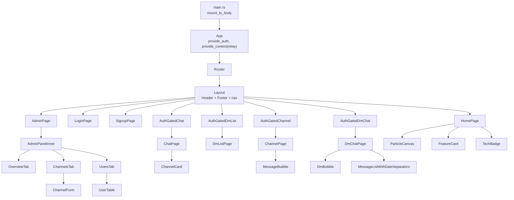
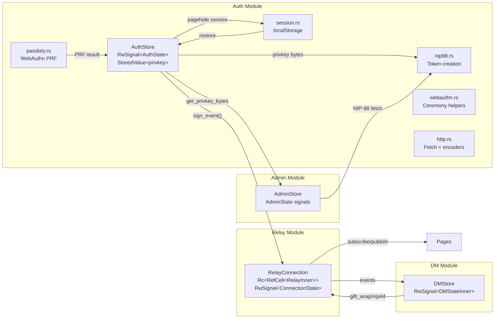
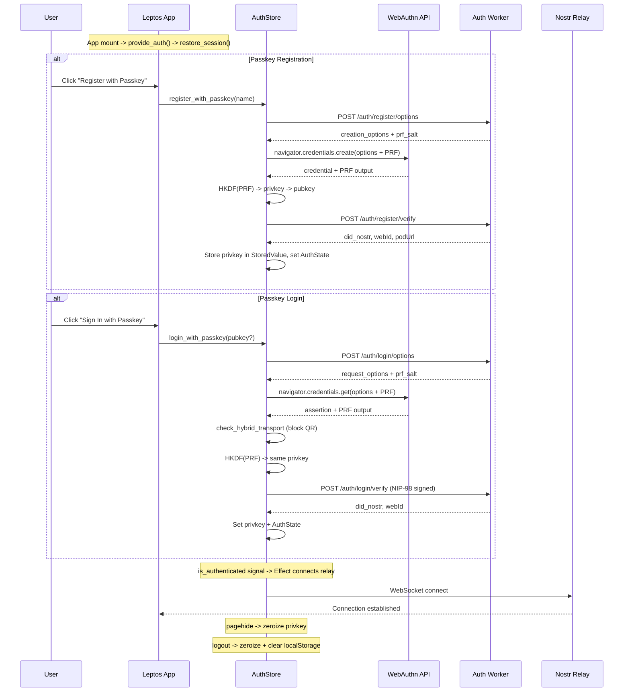
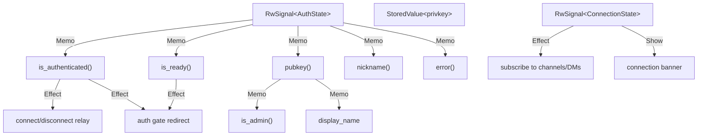

# QE Audit: DreamLab Forum Client (Leptos WASM)

[Back to Documentation Index](../README.md)

**Date**: 2026-03-08
**Scope**: `community-forum-rs/crates/forum-client/src/` -- all 29 source files
**Target**: `wasm32-unknown-unknown` (Leptos 0.7 CSR, single-threaded WASM)
**Auditor**: Agentic QE v3 Code Reviewer

---

## Executive Summary

The DreamLab forum client is a well-structured Leptos 0.7 CSR application implementing a Nostr-based encrypted community forum with WebAuthn passkey authentication, NIP-44 encrypted DMs, NIP-59 Gift Wrap, and NIP-98 HTTP auth. The codebase demonstrates strong security fundamentals: private keys are zeroized on drop, never persisted to storage, and signing operations are confined to the auth module. The relay connection manager handles reconnection with exponential backoff and properly manages WebSocket lifecycle.

However, the audit identified **4 critical**, **7 high**, **9 medium**, and **6 low** priority findings spanning security, reactivity, architecture, and accessibility concerns. The most severe issues are: (1) the admin route lacks a server-enforced auth gate, relying solely on client-side pubkey checks; (2) the `private_key` hex string is held in `AuthState` signal memory and participates in reactive diffing; (3) `unsafe impl Send/Sync` on `DMStore` bypasses `SendWrapper` safety guarantees; and (4) chat message content is rendered as raw text without XSS sanitization.

**Verdict**: The application demonstrates above-average quality for an early-stage Nostr client. The auth module is the strongest area. The main risks are client-side-only admin authorization, privkey exposure in reactive state, and missing content sanitization. Resolving the 4 critical and 7 high issues is recommended before production deployment.

---

## Critical Issues

### CRIT-01: Admin Route Has No Server-Side Auth Gate

**File**: `/home/devuser/workspace/project2/community-forum-rs/crates/forum-client/src/pages/admin.rs` (lines 19-71)
**File**: `/home/devuser/workspace/project2/community-forum-rs/crates/forum-client/src/admin/mod.rs` (line 109)

The admin page checks `AdminStore::is_admin(&pk)` which compares the user's pubkey against a hardcoded constant (`ADMIN_PUBKEY`). This check is entirely client-side. Any user can:

1. Modify the WASM memory or JS interop to override `is_admin()` return value.
2. Directly call the admin API endpoints if the server does not independently verify admin status.

The admin API calls (`fetch_whitelist`, `add_to_whitelist`, `update_cohorts`) use NIP-98 auth, which verifies identity but not authorization. If the relay worker does not check admin pubkey independently, any authenticated user could modify the whitelist.

```rust
// admin/mod.rs:109 -- client-side only
pub fn is_admin(pubkey: &str) -> bool {
    pubkey == ADMIN_PUBKEY
}
```

**Recommendation**: Verify that the relay worker's `/api/whitelist/*` endpoints independently check that the NIP-98 signer is the admin pubkey. The client-side check should remain as a UX optimization but must never be the sole authorization barrier.

---

### CRIT-02: Private Key Hex String in Reactive Signal State

**File**: `/home/devuser/workspace/project2/community-forum-rs/crates/forum-client/src/auth/mod.rs` (lines 35, 391-411, 432-452)

The `AuthState` struct contains `pub private_key: Option<String>` which holds the hex-encoded private key. This field is set during `apply_passkey_result()`, `apply_passkey_auth_result()`, and `login_with_local_key()`. Because `AuthState` is stored in an `RwSignal`, every signal update causes Leptos to diff the entire struct, meaning the hex private key is:

1. Copied during every `.get()` call (the whole `AuthState` is cloned).
2. Compared character-by-character during reactivity diffing.
3. Held in multiple memory locations simultaneously (old value, new value, any closures that captured a `.get()` result).
4. Not zeroized when replaced during signal updates.

The raw bytes in `StoredValue<Option<Vec<u8>>>` are properly managed. But the hex string representation in the signal creates a parallel unzeroized copy.

```rust
// auth/mod.rs:35
pub private_key: Option<String>,  // Hex string -- not zeroized on drop

// auth/mod.rs:391 -- set in reactive signal, participates in diffing
private_key: Some(privkey_hex),
```

**Recommendation**: Remove the `private_key` field from `AuthState` entirely. Any component needing a "has key" check should derive it from `privkey: StoredValue<Option<Vec<u8>>>`. The `Display Name` from the signal is sufficient for UI; the hex key should never be in reactive state. If the SvelteKit parity requirement demands it, use a separate non-reactive `StoredValue<Option<String>>` and zeroize it manually.

---

### CRIT-03: Bare `unsafe impl Send/Sync` on `DMStore` Without `SendWrapper`

**File**: `/home/devuser/workspace/project2/community-forum-rs/crates/forum-client/src/dm/mod.rs` (lines 56-57)

```rust
unsafe impl Send for DMStore {}
unsafe impl Sync for DMStore {}
```

Unlike `RelayConnection` which wraps its non-Send inner state in `SendWrapper<Rc<RefCell<...>>>` (providing a runtime assertion that access is single-threaded), `DMStore` uses bare `unsafe impl Send/Sync` without `SendWrapper`. While this is technically safe in wasm32 (single-threaded), it bypasses the runtime safety net.

If Leptos ever introduces Web Workers for offloading work, or if this crate is inadvertently compiled for a multi-threaded target, the `RwSignal` and `Vec<String>` inside would be accessed across threads without synchronization.

**Recommendation**: Wrap the non-Send fields in `SendWrapper` consistent with `RelayConnection`'s pattern, or at minimum add a compile-time assertion `#[cfg(not(target_arch = "wasm32"))] compile_error!("DMStore Send/Sync is only safe on wasm32")`.

---

### CRIT-04: Chat Messages Rendered Without XSS Sanitization

**File**: `/home/devuser/workspace/project2/community-forum-rs/crates/forum-client/src/components/message_bubble.rs` (line 44)
**File**: `/home/devuser/workspace/project2/community-forum-rs/crates/forum-client/src/pages/dm_chat.rs` (line 356)

Message content from relay events is rendered directly into the DOM:

```rust
// message_bubble.rs:44
<p class="text-sm text-gray-200 break-words whitespace-pre-wrap mt-0.5 leading-relaxed">
    {message.content.clone()}
</p>
```

While Leptos escapes text content by default (unlike `inner_html`), the `comrak` dependency in `Cargo.toml` suggests markdown rendering is planned or partially used elsewhere. If any path uses `inner_html` or `comrak` output without DOMPurify sanitization, XSS is possible. Additionally, Nostr event content can contain URLs, mentions, and protocol-specific tags that may be parsed and rendered as HTML in future iterations.

**Recommendation**: Audit all rendering paths for `inner_html` usage. If markdown rendering is introduced, pipe through DOMPurify (available via `web_sys` JS interop). Add a content sanitization utility to `utils.rs` for any future rich-text rendering.

---

## High Priority Issues

### HIGH-01: Auth Gate Pattern Duplicated 4 Times

**File**: `/home/devuser/workspace/project2/community-forum-rs/crates/forum-client/src/app.rs` (lines 382-498)

The auth gate pattern (check `is_ready`, redirect to `/login`, show spinner/fallback) is copy-pasted identically for `AuthGatedChat`, `AuthGatedChannel`, `AuthGatedDmList`, and `AuthGatedDmChat`. Each uses `window.location().set_href("/login")` for navigation, which triggers a full page reload instead of client-side routing.

```rust
// Identical in 4 components -- 28 lines each
Effect::new(move |_| {
    if is_ready.get() && !is_authed.get() {
        if let Some(window) = web_sys::window() {
            let _ = window.location().set_href("/login");
        }
    }
});
```

**Recommendation**: Extract a generic `AuthGate` component:
```rust
#[component]
fn AuthGate<V: IntoView + 'static>(children: Box<dyn Fn() -> V>) -> impl IntoView
```
Use `leptos_router::hooks::use_navigate()` for client-side redirect instead of `set_href`.

---

### HIGH-02: `get_privkey_bytes()` Returns Unzeroized Copy

**File**: `/home/devuser/workspace/project2/community-forum-rs/crates/forum-client/src/auth/mod.rs` (lines 174-186)

`get_privkey_bytes()` returns `Option<[u8; 32]>` which the caller must manually zeroize. The docstring warns about this, but callers in `pages/admin.rs` (lines 94, 229, 326, 342, 352) never zeroize the returned bytes:

```rust
// pages/admin.rs:94 -- privkey leaked on stack
if let Some(privkey) = auth_for_init.get_privkey_bytes() {
    let admin_clone = admin_for_init.clone();
    spawn_local(async move {
        let _ = admin_clone.fetch_whitelist(&privkey).await;
        // privkey dropped here without zeroize
    });
}
```

**Recommendation**: Return a wrapper type that implements `Zeroize + Drop` instead of raw `[u8; 32]`:
```rust
pub struct PrivkeyGuard([u8; 32]);
impl Drop for PrivkeyGuard { fn drop(&mut self) { self.0.zeroize(); } }
```

---

### HIGH-03: Closure Leak in `auto_dismiss()` and `chat.rs` Loading Timeout

**File**: `/home/devuser/workspace/project2/community-forum-rs/crates/forum-client/src/pages/admin.rs` (lines 447-456)
**File**: `/home/devuser/workspace/project2/community-forum-rs/crates/forum-client/src/pages/chat.rs` (lines 126-137)

The `auto_dismiss()` function and the loading timeout in `chat.rs` use `Closure::once` + `cb.forget()`, which intentionally leaks the closure. The codebase already has `crate::utils::set_timeout_once()` which properly drops the closure after execution.

```rust
// pages/admin.rs:448 -- leaks closure
fn auto_dismiss(f: impl Fn() + 'static) {
    let cb = wasm_bindgen::closure::Closure::once(Box::new(f) as Box<dyn FnOnce()>);
    // ...
    cb.forget(); // LEAK
}

// pages/chat.rs:126 -- also leaks
let cb = wasm_bindgen::closure::Closure::once(move || { ... });
cb.forget(); // LEAK
```

**Recommendation**: Replace all `Closure::once` + `.forget()` patterns with `crate::utils::set_timeout_once()`. The utility already exists and handles lifecycle correctly.

---

### HIGH-04: DM Store Provided Multiple Times Without Deduplication

**File**: `/home/devuser/workspace/project2/community-forum-rs/crates/forum-client/src/pages/dm_list.rs` (line 25)
**File**: `/home/devuser/workspace/project2/community-forum-rs/crates/forum-client/src/pages/dm_chat.rs` (line 26)

Both `DmListPage` and `DmChatPage` call `provide_dm_store()` which creates a new `DMStore` each time. If a user navigates from `/dm` to `/dm/:pubkey`, the DM store from the list page is discarded and a new one is created, losing all conversation state and subscriptions.

```rust
// dm_list.rs:25
provide_dm_store();
let dm_store = use_dm_store();

// dm_chat.rs:26 -- creates a SECOND store when navigating here
provide_dm_store();
let dm_store = use_dm_store();
```

**Recommendation**: Move `provide_dm_store()` to the `App` component (or an auth-gated parent) so a single DM store persists across DM navigation. Use `use_dm_store()` in both pages.

---

### HIGH-05: No Content-Length or Rate Limiting on Message Send

**File**: `/home/devuser/workspace/project2/community-forum-rs/crates/forum-client/src/pages/channel.rs` (lines 153-208)

The message send handler does not validate content length before signing and publishing. A malicious user (or accidental paste) could publish arbitrarily large events to the relay, consuming bandwidth and storage.

```rust
// channel.rs:155-157 -- only checks empty, not max length
let content = message_input.get_untracked();
let content = content.trim().to_string();
if content.is_empty() || sending.get_untracked() { return; }
```

**Recommendation**: Add a `MAX_MESSAGE_LENGTH` constant (e.g., 4096 bytes) and validate before signing. Display remaining character count in the UI.

---

### HIGH-06: `truncate_message()` Slices on Byte Index, Not Char Boundary

**File**: `/home/devuser/workspace/project2/community-forum-rs/crates/forum-client/src/dm/mod.rs` (lines 469-472)

```rust
fn truncate_message(content: &str, max_len: usize) -> String {
    let t = content.trim();
    if t.len() <= max_len { t.to_string() } else { format!("{}...", &t[..max_len]) }
}
```

`&t[..max_len]` indexes by bytes, not characters. For UTF-8 messages containing emoji or non-ASCII characters, this will panic at runtime if `max_len` falls in the middle of a multi-byte character sequence.

**Recommendation**: Use `t.chars().take(max_len).collect::<String>()` or `t.char_indices().nth(max_len).map(|(i, _)| &t[..i])`.

---

### HIGH-07: Subscription Leak in Admin `fetch_stats()`

**File**: `/home/devuser/workspace/project2/community-forum-rs/crates/forum-client/src/admin/mod.rs` (lines 311-390)

`fetch_stats()` creates two relay subscriptions (kind 40 and kind 42) but never stores the subscription IDs. These subscriptions are never closed, even when the admin panel is unmounted or the tab is closed. Over time, the relay accumulates orphaned subscriptions.

```rust
// admin/mod.rs:362-370 -- subscription ID discarded
relay_for_channels.subscribe(
    vec![Filter { kinds: Some(vec![40]), ..Default::default() }],
    on_channel_event,
    Some(on_channel_eose),
);
// Return value (sub_id) is dropped
```

**Recommendation**: Store subscription IDs in `AdminState` and unsubscribe in an `on_cleanup` callback or in the admin page's cleanup logic.

---

## Medium Priority Issues

### MED-01: `parse_channel_content()` Duplicated in Three Files

**Files**:
- `/home/devuser/workspace/project2/community-forum-rs/crates/forum-client/src/pages/chat.rs` (lines 405-422)
- `/home/devuser/workspace/project2/community-forum-rs/crates/forum-client/src/pages/channel.rs` (lines 417-436)
- `/home/devuser/workspace/project2/community-forum-rs/crates/forum-client/src/admin/mod.rs` (lines 425-442)

Three near-identical functions parse kind-40 event content JSON. The one in `channel.rs` returns a `ChannelHeader` struct, while the other two return `(String, String)` tuples. Changes to the content schema would require updating all three.

**Recommendation**: Consolidate into a single function in `utils.rs` or a `nostr_types` module.

---

### MED-02: Hard-Reload Navigation Instead of Client-Side Routing

**Files**: `app.rs`, `login.rs`, `signup.rs`, `dm_list.rs`

All post-auth navigation uses `window.location().set_href()` which triggers a full WASM reload:

```rust
let _ = window.location().set_href("/chat");
```

This discards the entire Leptos reactive tree, WebSocket connection, auth state, and WASM memory. The user experiences a flash of white followed by re-initialization.

**Recommendation**: Use `leptos_router::hooks::use_navigate()` for client-side navigation that preserves the app state.

---

### MED-03: `connection_state()` Returns `RwSignal` Instead of `ReadSignal`

**File**: `/home/devuser/workspace/project2/community-forum-rs/crates/forum-client/src/relay.rs` (lines 145-147)

The public API exposes `RwSignal<ConnectionState>`, allowing any component to mutate the connection state:

```rust
pub fn connection_state(&self) -> RwSignal<ConnectionState> {
    self.state
}
```

**Recommendation**: Return `ReadSignal<ConnectionState>` or `Signal<ConnectionState>` to enforce read-only access from consumer components.

---

### MED-04: No Reconnection After Auth State Change Clears Subscriptions

When the user logs out, `relay.disconnect()` clears all subscriptions (line 263). When they log back in, `relay.connect()` is called, but the previous subscriptions from chat/DM pages are lost. If the user was on a channel page, they see stale messages with no subscription to receive new ones.

**Recommendation**: Pages should re-subscribe on connection state change, not just on initial mount. The `Effect` in `channel.rs` partially handles this with the `if sub_id.get_untracked().is_some() { return; }` guard, but after a disconnect-reconnect cycle, `sub_id` is still `Some(old_id)` even though the relay has cleared it.

---

### MED-05: `AtomicBool` with `Ordering::Relaxed` in Particle Canvas

**File**: `/home/devuser/workspace/project2/community-forum-rs/crates/forum-client/src/components/particle_canvas.rs` (lines 19, 263, 345, 379)

The `running` flag uses `Arc<AtomicBool>` with `Ordering::Relaxed`. In wasm32, there is only one thread, so ordering is irrelevant. However, `Arc` is an unnecessary overhead for single-threaded code; `Rc<Cell<bool>>` would be more idiomatic and avoid the atomic overhead.

**Recommendation**: Replace `Arc<AtomicBool>` with `Rc<Cell<bool>>` since the code is already `!Send` due to `Rc<RefCell<...>>` usage elsewhere in the same closure.

---

### MED-06: Section Filter Pills Not Reactive

**File**: `/home/devuser/workspace/project2/community-forum-rs/crates/forum-client/src/pages/chat.rs` (lines 258-280)

The section filter pills are rendered with `.iter().map().collect_view()` inside a non-reactive block. The `current` variable is computed once at render time, so the active pill highlighting does not update when the query parameter changes without a re-render.

```rust
let current = section_filter(); // captured once
```

**Recommendation**: Wrap in `move ||` to make the pill list reactive to query parameter changes.

---

### MED-07: Missing `aria-label` on Interactive Elements

Multiple interactive elements lack ARIA labels:

- Hamburger menu button (`app.rs` line 277-287): No `aria-label` or `aria-expanded`.
- Send message buttons (`channel.rs`, `dm_chat.rs`): Icon-only buttons without text labels.
- Connection status indicators: Visual-only, no screen reader support.
- Tab buttons in admin panel: No `role="tab"` or `aria-selected`.

**Recommendation**: Add `aria-label` attributes to all icon-only buttons and `role`/`aria-*` attributes to tab interfaces per WAI-ARIA Authoring Practices.

---

### MED-08: `comrak` Dependency Unused

**File**: `/home/devuser/workspace/project2/community-forum-rs/crates/forum-client/Cargo.toml` (line 60)

`comrak` is listed as a dependency but grep shows no usage in the source files. This adds unnecessary WASM binary size (comrak is a full CommonMark parser).

**Recommendation**: Remove the `comrak` dependency or add a `#[cfg(feature = "markdown")]` gate if it is planned for future use.

---

### MED-09: `nostr_sdk` Dependency Unused

**File**: `/home/devuser/workspace/project2/community-forum-rs/crates/forum-client/Cargo.toml` (line 13)

`nostr-sdk` is listed but the codebase uses `nostr_core` directly for all cryptographic and event operations. The SDK likely brings in additional dependencies.

**Recommendation**: Remove if unused to reduce WASM binary size.

---

## Low / Style Issues

### LOW-01: Inconsistent Error Handling in `on_send` Closures

The channel send handler (`channel.rs:154-208`) sets `error_msg` on failure but does not surface it to the user in the channel page's error banner (the error banner checks `error_msg` but the send error goes to `web_sys::console::error_1` first). The DM send handler (`dm_chat.rs:84-125`) correctly uses `send_error` signal.

---

### LOW-02: Magic String Constants

Relay URL, auth API URL, admin pubkey, and storage key are all string constants spread across multiple files. Consider a central `config.rs` module.

---

### LOW-03: `#[allow(dead_code)]` on Public Methods

Several `#[allow(dead_code)]` annotations on public methods (`set_pending`, `set_profile`, `complete_signup`, `confirm_nsec_backup`) suggest these are API surface for future features. This is acceptable but should be documented.

---

### LOW-04: `shorten_pubkey()` and `truncate_pubkey()` Are Duplicates

`utils::shorten_pubkey()` shows 6+4 chars. `user_table::truncate_pubkey()` shows 8+4 chars. Two near-identical functions with different formatting.

---

### LOW-05: Pagehide Listener Uses `.forget()` Intentionally

`session.rs:257,283` -- the pagehide/pageshow closures are intentionally leaked with `.forget()` because they must survive for the page lifetime. This is correct behavior but should be documented with a comment explaining why this is the one acceptable `.forget()` use case.

---

### LOW-06: `_breath` Variable Computed But Unused in `ParticleField::update()`

**File**: `/home/devuser/workspace/project2/community-forum-rs/crates/forum-client/src/components/particle_canvas.rs` (line 121)

```rust
let _breath = 0.85 + 0.15 * (self.time * 0.4).sin();
```

The `_breath` value is computed in `update()` but only used in `draw()`. The underscore prefix suppresses the warning but the computation is wasted.

---

## Architecture Assessment

### Component Hierarchy



### State Flow



### Auth Flow



### Signal Dependency Graph



---

## Test Coverage Gaps

The forum client has **zero test coverage**. There is no test framework configured in `Cargo.toml` and no `tests/` directory. The following areas are highest priority for testing:

| Priority | Area | Test Type | Description |
|----------|------|-----------|-------------|
| P0 | `auth/mod.rs` sign_event | Unit | Verify signing produces valid Schnorr signature, key zeroized after |
| P0 | `auth/session.rs` restore_session | Unit | Verify passkey session restores as unauthenticated, NIP-07 gets error message |
| P0 | `dm/mod.rs` process_dm_event | Unit | Verify NIP-59 unwrap, NIP-44 decrypt, deduplication |
| P0 | `dm/mod.rs` truncate_message | Unit | Verify UTF-8 boundary handling (currently broken) |
| P1 | `relay.rs` handle_relay_message | Unit | Verify EVENT/EOSE/OK/NOTICE routing, malformed JSON handling |
| P1 | `auth/passkey.rs` error handling | Unit | Verify all PasskeyError variants surface correctly |
| P1 | `utils.rs` format_relative_time | Unit | Boundary cases: 0, future timestamps, exact thresholds |
| P2 | Auth gate components | Integration | Verify redirect behavior for unauth/auth/admin states |
| P2 | Channel subscription lifecycle | Integration | Verify subscribe-on-connect, unsubscribe-on-cleanup |
| P3 | ParticleCanvas | Visual regression | Verify reduced-motion static render, cleanup on unmount |

**Recommendation**: Add `wasm-bindgen-test` as a dev dependency and create unit tests for the auth and DM modules. Use `#[cfg(test)]` modules within each source file. For integration tests, consider `leptos::test` utilities or headless browser testing with Playwright.

---

## Recommendations Summary

| ID | Severity | Effort | Description |
|----|----------|--------|-------------|
| CRIT-01 | Critical | Low | Verify server-side admin authorization on relay worker |
| CRIT-02 | Critical | Medium | Remove `private_key: Option<String>` from `AuthState` signal |
| CRIT-03 | Critical | Low | Add `SendWrapper` or compile-time guard to `DMStore` |
| CRIT-04 | Critical | Low | Audit for `inner_html` usage; add sanitization utility |
| HIGH-01 | High | Medium | Extract generic `AuthGate` component |
| HIGH-02 | High | Medium | Return `PrivkeyGuard` wrapper from `get_privkey_bytes()` |
| HIGH-03 | High | Low | Replace `cb.forget()` with `set_timeout_once()` |
| HIGH-04 | High | Medium | Move `provide_dm_store()` to app root |
| HIGH-05 | High | Low | Add `MAX_MESSAGE_LENGTH` validation |
| HIGH-06 | High | Low | Fix `truncate_message()` to use char boundaries |
| HIGH-07 | High | Low | Store and cleanup subscription IDs in `AdminStore` |
| MED-01 | Medium | Low | Consolidate `parse_channel_content()` |
| MED-02 | Medium | Medium | Use `use_navigate()` instead of `set_href()` |
| MED-03 | Medium | Low | Return `ReadSignal` from `connection_state()` |
| MED-04 | Medium | Medium | Re-subscribe on reconnect |
| MED-05 | Medium | Low | Replace `Arc<AtomicBool>` with `Rc<Cell<bool>>` |
| MED-06 | Medium | Low | Make section filter pills reactive |
| MED-07 | Medium | Medium | Add ARIA labels and roles |
| MED-08 | Medium | Low | Remove unused `comrak` dependency |
| MED-09 | Medium | Low | Remove unused `nostr-sdk` dependency |

### WASM Binary Size Considerations

- Remove `comrak` (estimated -200-400KB compressed)
- Remove `nostr-sdk` if unused (estimated -50-150KB compressed)
- The `k256` + `serde_json` + `web-sys` features are necessary and well-scoped
- Consider `wee_alloc` or `dlmalloc` for WASM allocator optimization
- The `send_wrapper` crate is minimal overhead (justified)
- SVG icons are inline; consider a sprite sheet or icon component library to reduce view code volume

### Positive Observations

1. **Excellent key lifecycle**: PRF output zeroized immediately after HKDF derivation. Signing key bytes zeroized after `sign_event()`. `Drop` impls on `PasskeyRegistrationResult` and `PasskeyAuthResult`.
2. **Proper WebSocket lifecycle**: `set_timeout_once()` utility prevents closure leaks on reconnect. `SendWrapper` enforces single-thread access. Reconnect with exponential backoff and max delay cap.
3. **Clean module boundaries**: Auth module encapsulates all key material. Relay module encapsulates WebSocket state. Pages are thin view layers.
4. **Hybrid transport blocking**: Cross-device QR auth correctly blocked since it produces different PRF outputs.
5. **NIP-59 Gift Wrap**: DM implementation correctly uses the three-layer wrap protocol with randomized timestamps on the outer wrap.
6. **Session restore correctness**: Passkey sessions restore as unauthenticated (requiring re-auth to re-derive key). Local key sessions also require re-entry.
