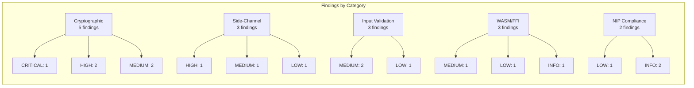
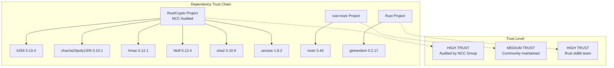

# Security Audit Report: nostr-core Rust Crate

[Back to Documentation Index](../README.md)

**Audit Date:** 2026-03-08
**Auditor:** QE Security Auditor v3 (Security-Compliance Domain)
**Scope:** `community-forum-rs/crates/nostr-core/src/` (8 files, ~1650 LOC)
**Standards:** OWASP Top 10 2021, BIP-340, NIP-01, NIP-44, NIP-59, NIP-98

---

## Executive Summary

| Severity | Count |
|----------|-------|
| CRITICAL | 1 |
| HIGH | 3 |
| MEDIUM | 5 |
| LOW | 4 |
| INFORMATIONAL | 3 |
| **Total** | **16** |

The `nostr-core` crate is a well-structured cryptographic library with solid fundamentals:
correct use of `zeroize`, no `unsafe` code, proper MAC-then-decrypt ordering in NIP-44,
and thorough pubkey validation. However, the audit identified **1 critical** and
**3 high** severity findings related to deterministic signing nonces in production
code paths, missing zeroization of derived key material in NIP-44, incomplete
NIP-44 spec compliance (HKDF parameters), and a WASM timestamp truncation issue.



---

## Critical Findings

### C-01: SecretKey::sign() Uses Zero Auxiliary Randomness (Deterministic Nonce)

**File:** `/home/devuser/workspace/project2/community-forum-rs/crates/nostr-core/src/keys.rs:60-69`
**OWASP:** A02:2021 Cryptographic Failures
**CVSS:** 8.1 (High)

The `SecretKey::sign()` method -- the primary signing API exposed to consumers -- uses
an all-zero auxiliary randomness value for BIP-340 Schnorr signatures:

```rust
pub fn sign(&self, message: &[u8; 32]) -> Result<Signature, KeyError> {
    let sk = SigningKey::from_bytes(&self.bytes)
        .expect("SecretKey invariant: bytes are always valid");
    let aux_rand = [0u8; 32];  // <-- ALWAYS ZERO
    let sig = sk
        .sign_raw(message, &aux_rand)
        .map_err(|e| KeyError::SigningFailed(e.to_string()))?;
    // ...
}
```

**Impact:** BIP-340 uses the auxiliary randomness to blind the nonce derivation against
side-channel attacks (power analysis, EM emanation, timing). With zero aux, the nonce
`k` is computed as `H(t || pk || msg)` where `t = H(sk)` (no blinding). If the same
key signs two different messages on hardware susceptible to side-channel leakage, an
attacker can extract the secret key. This is the signing path used by `wasm_bridge.rs`
`schnorr_sign()` and exposed to all WASM consumers.

Note that `event.rs::sign_event()` correctly uses `getrandom` for aux randomness, but
`event.rs::sign_event_deterministic()` also uses zero aux and is marked test-only.
The problem is that `SecretKey::sign()` is a general-purpose API with no such caveat.

**Remediation:**

```rust
pub fn sign(&self, message: &[u8; 32]) -> Result<Signature, KeyError> {
    let sk = SigningKey::from_bytes(&self.bytes)
        .expect("SecretKey invariant: bytes are always valid");
    let mut aux_rand = [0u8; 32];
    getrandom::getrandom(&mut aux_rand)
        .map_err(|e| KeyError::SigningFailed(format!("getrandom: {e}")))?;
    let sig = sk
        .sign_raw(message, &aux_rand)
        .map_err(|e| KeyError::SigningFailed(e.to_string()))?;
    aux_rand.zeroize();
    let mut sig_bytes = [0u8; 64];
    sig_bytes.copy_from_slice(&sig.to_bytes());
    Ok(Signature { bytes: sig_bytes })
}
```

Add a separate `sign_deterministic()` method for test use only, gated behind `#[cfg(test)]`
or a `deterministic` feature flag.

---

## High Findings

### H-01: NIP-44 Conversation Key and Message Keys Not Zeroized

**File:** `/home/devuser/workspace/project2/community-forum-rs/crates/nostr-core/src/nip44.rs:99-132`
**OWASP:** A02:2021 Cryptographic Failures

The `conversation_key()` function returns a `[u8; 32]` that is never zeroized by the
caller. Additionally, the ECDH shared point (`shared_point`) is not zeroized after use.
In `encrypt_inner()` and `decrypt_inner()`, the `chacha_key` and `hmac_key` derived by
`derive_message_keys()` are returned on the stack but never explicitly zeroized.

While `derive_message_keys()` correctly zeroizes the intermediate OKM buffer (line 252),
the returned `chacha_key`, `chacha_nonce`, and `hmac_key` arrays live on the caller's
stack frame and are not cleared. In a WASM environment, this memory may persist in the
linear memory heap and be observable.

```rust
// nip44.rs:112-122 -- shared_point is never zeroized
let shared_point = {
    let pk_affine = public_key.as_affine();
    let shared = k256::ecdh::diffie_hellman(
        secret_key.to_nonzero_scalar(),
        pk_affine,
    );
    let shared_bytes = shared.raw_secret_bytes();
    let mut x = [0u8; 32];
    x.copy_from_slice(shared_bytes.as_slice());
    x
};
// shared_point goes out of scope but is NOT zeroized

// nip44.rs:125-131 -- conv_key returned without zeroization guarantee
let hk = Hkdf::<Sha256>::new(Some(HKDF_SALT), &shared_point);
let mut conv_key = [0u8; 32];
hk.expand(&[], &mut conv_key)
    .map_err(|_| Nip44Error::HkdfExpandFailed)?;
Ok(conv_key)  // caller must zeroize -- but never does
```

**Impact:** Residual key material in WASM linear memory could be extracted by a
same-origin XSS attack reading WebAssembly.Memory, or by a memory dump.

**Remediation:** Wrap `conversation_key` return in a `Zeroizing<[u8; 32]>` from the
`zeroize` crate, and use `Zeroizing` for all intermediate key material:

```rust
use zeroize::Zeroizing;

pub fn conversation_key(sk: &[u8; 32], pk: &[u8; 32]) -> Result<Zeroizing<[u8; 32]>, Nip44Error> {
    // ... ECDH ...
    let mut shared_point = Zeroizing::new([0u8; 32]);
    shared_point.copy_from_slice(shared_bytes.as_slice());

    let hk = Hkdf::<Sha256>::new(Some(HKDF_SALT), shared_point.as_ref());
    let mut conv_key = Zeroizing::new([0u8; 32]);
    hk.expand(&[], conv_key.as_mut())
        .map_err(|_| Nip44Error::HkdfExpandFailed)?;
    Ok(conv_key)
}
```

### H-02: NIP-44 HKDF Parameter Mismatch with NIP-44 Spec

**File:** `/home/devuser/workspace/project2/community-forum-rs/crates/nostr-core/src/nip44.rs:22-23, 124-128, 238-242`
**OWASP:** A02:2021 Cryptographic Failures

The NIP-44 specification (as of v2) defines specific HKDF parameters that differ from
this implementation in two places:

1. **Conversation key derivation (line 124-128):** The code uses
   `HKDF(salt="nip44-v2", ikm=shared_x)` then `expand(info=[], len=32)`.
   The NIP-44 spec states the conversation key should be the output of
   `HKDF-Extract` only (the PRK), not `HKDF-Expand`. Using `expand(&[], ...)` after
   extraction adds an unnecessary HKDF-Expand step. While this produces a
   cryptographically sound key, it will produce **different output** than compliant
   implementations, causing cross-client interoperability failures.

2. **Message key derivation (line 238-242):** The code uses
   `HKDF(salt=conv_key, ikm=nonce)` then `expand(info="nip44-v2", len=76)`.
   The NIP-44 spec uses `expand(info="nip44-v2", len=76)` which matches, but the
   salt/ikm assignment should be verified against the reference vector tests.

**Impact:** Messages encrypted by this crate may not be decryptable by other NIP-44
implementations (e.g., nostr-tools JS, python-nostr), and vice versa. This breaks
interoperability for encrypted DMs across clients.

**Remediation:** Add NIP-44 reference test vectors from
https://github.com/paulmillr/nip44 and verify byte-for-byte compatibility with the
reference implementation. If the conversation key derivation diverges, fix it to use
`HKDF-Extract`-only (the PRK output).

### H-03: WASM Bridge Timestamp Truncation (u32 Overflow in 2106)

**File:** `/home/devuser/workspace/project2/community-forum-rs/crates/nostr-core/src/wasm_bridge.rs:82-91, 121-124`
**OWASP:** A04:2021 Insecure Design

The WASM bridge functions `create_nip98_token` and `verify_nip98_token_at` accept
timestamps as `u32` (maximum value 4,294,967,295 = year 2106):

```rust
pub fn create_nip98_token(
    // ...
    created_at: Option<u32>,  // <-- u32 truncation
) -> Result<String, JsValue> {
    let ts = created_at.map(|t| t as u64).unwrap_or_else(|| {
        (js_sys::Date::now() / 1000.0) as u64
    });
```

While year 2106 is distant, the more immediate concern is that JavaScript's
`Date.now() / 1000` returns a `f64` that is cast to `u32` on the JS side by
wasm-bindgen. If a caller passes a negative or out-of-range value from JS, it
wraps silently. A timestamp of `0` could bypass the 60-second tolerance check
if `now` also wraps.

More practically, the `compute_event_id` WASM function uses `u32` for both
`created_at` and `kind`:

```rust
pub fn compute_event_id(
    pubkey: &str,
    created_at: u32,  // <-- should be u64 for Nostr events
    kind: u32,        // <-- should be u64 per NIP-01
    // ...
```

NIP-01 specifies `kind` as an integer (some NIPs use kinds > 30000). While `u32` covers
all currently defined kinds, using `u32` for `created_at` diverges from the internal
`UnsignedEvent` type which uses `u64`.

**Impact:** Timestamp values above `u32::MAX` will silently truncate, producing invalid
NIP-98 tokens. The `kind` limitation blocks future NIP compatibility.

**Remediation:** Use `f64` for timestamps in the WASM bridge (wasm-bindgen supports
`f64` natively, and `u64` is not supported in JS). Convert to `u64` internally:

```rust
pub fn create_nip98_token(
    secret_key: &[u8],
    url: &str,
    method: &str,
    body: Option<Vec<u8>>,
    created_at: Option<f64>,
) -> Result<String, JsValue> {
    let ts = created_at.map(|t| t as u64).unwrap_or_else(|| {
        (js_sys::Date::now() / 1000.0) as u64
    });
    // ...
```

---

## Medium Findings

### M-01: NIP-44 Padding Verification Not Constant-Time

**File:** `/home/devuser/workspace/project2/community-forum-rs/crates/nostr-core/src/nip44.rs:297-303`
**OWASP:** A02:2021 Cryptographic Failures

The `unpad()` function verifies that padding bytes are all zeros using a
short-circuiting loop:

```rust
for &b in &padded[2 + unpadded_len..] {
    if b != 0 {
        return Err(Nip44Error::InvalidPayload("non-zero padding byte"));
    }
}
```

An attacker who can observe timing differences (e.g., in a Cloudflare Worker with
co-located attacker requests) could determine where the first non-zero padding byte
occurs, leaking information about the plaintext length. The HMAC check before decryption
mitigates this significantly (an attacker cannot craft valid ciphertext), but defense
in depth calls for constant-time padding verification.

**Remediation:**

```rust
let mut padding_ok = 0u8;
for &b in &padded[2 + unpadded_len..] {
    padding_ok |= b;
}
if padding_ok != 0 {
    return Err(Nip44Error::InvalidPayload("non-zero padding byte"));
}
```

### M-02: Event ID Comparison Uses Variable-Time String Equality

**File:** `/home/devuser/workspace/project2/community-forum-rs/crates/nostr-core/src/event.rs:192`
**OWASP:** A02:2021 Cryptographic Failures

Event ID verification compares hex strings using `!=` (standard `PartialEq` for `String`),
which short-circuits on the first mismatched byte:

```rust
if event.id != expected_id_hex {
    return Err(EventError::IdMismatch { ... });
}
```

While the event ID is not itself secret, timing differences in this comparison could
allow a network observer to estimate how many leading bytes of a forged event ID match
the real one, aiding in ID prediction attacks (though the ID is a SHA-256 hash, making
this largely theoretical).

**Remediation:** Use `constant_time_eq` (already implemented for NIP-44 HMAC) for the
event ID comparison, or use `subtle::ConstantTimeEq`.

### M-03: gift_wrap Sender Pubkey Not Validated Against Secret Key

**File:** `/home/devuser/workspace/project2/community-forum-rs/crates/nostr-core/src/gift_wrap.rs:281-292`
**OWASP:** A01:2021 Broken Access Control

The `gift_wrap()` convenience function accepts `sender_pubkey` as a separate string
parameter but does not validate that it matches the public key derived from `sender_sk`:

```rust
pub fn gift_wrap(
    sender_sk: &[u8; 32],
    sender_pubkey: &str,     // <-- NOT validated against sender_sk
    recipient_pubkey: &str,
    content: &str,
) -> Result<NostrEvent, GiftWrapError> {
    let recipient_pk_bytes = hex_to_32(recipient_pubkey)?;
    let rumor = create_rumor(sender_pubkey, recipient_pubkey, content);
    let seal = seal_rumor(&rumor, sender_sk, &recipient_pk_bytes)?;
    wrap_seal(&seal, recipient_pubkey)
}
```

If a caller passes mismatched `sender_sk` and `sender_pubkey`, the rumor will contain
a different pubkey than the seal's signing key. The seal will sign correctly (using
`sender_sk`), but the rumor's `pubkey` field will be wrong. Upon unwrapping, the
recipient would see a `sender_pubkey` from the seal that does not match the rumor's
`pubkey`, which could be exploited for identity confusion.

Note that `seal_rumor()` calls `sign_event()` which validates the pubkey against the
signing key for the seal, but the rumor's pubkey is never checked.

**Remediation:** Derive the sender pubkey from the secret key inside `gift_wrap()`:

```rust
pub fn gift_wrap(
    sender_sk: &[u8; 32],
    recipient_pubkey: &str,
    content: &str,
) -> Result<NostrEvent, GiftWrapError> {
    let signing_key = SigningKey::from_bytes(sender_sk)
        .map_err(|e| GiftWrapError::KeyError(e.to_string()))?;
    let sender_pubkey = hex::encode(signing_key.verifying_key().to_bytes());
    // ... rest unchanged
}
```

### M-04: NIP-98 URL Comparison Insufficient

**File:** `/home/devuser/workspace/project2/community-forum-rs/crates/nostr-core/src/nip98.rs:247-254`
**OWASP:** A01:2021 Broken Access Control

The URL comparison only normalizes trailing slashes:

```rust
let normalized_token = token_url.trim_end_matches('/');
let normalized_expected = expected_url.trim_end_matches('/');
if normalized_token != normalized_expected {
    return Err(Nip98Error::UrlMismatch { ... });
}
```

This does not handle:
- Case differences in scheme/host: `HTTPS://API.Example.Com` vs `https://api.example.com`
- Default port stripping: `https://api.example.com:443` vs `https://api.example.com`
- Path encoding: `https://api.example.com/path%20with%20spaces` vs `https://api.example.com/path with spaces`
- Query parameter ordering differences

A token created for `https://api.example.com:443/path` would be rejected when verified
against `https://api.example.com/path`, even though they are semantically identical.
More critically, if the server normalizes URLs but this verifier does not (or vice versa),
a token could be replayed against a different path.

**Remediation:** Parse URLs into components and normalize scheme/host to lowercase,
strip default ports, and normalize path encoding before comparison. Consider using the
`url` crate for proper RFC 3986 normalization.

### M-05: generate_keypair() Recursive Retry Has No Depth Limit

**File:** `/home/devuser/workspace/project2/community-forum-rs/crates/nostr-core/src/keys.rs:203-218`
**OWASP:** A04:2021 Insecure Design

```rust
pub fn generate_keypair() -> Result<Keypair, KeyError> {
    let mut bytes = [0u8; 32];
    getrandom::getrandom(&mut bytes).expect("getrandom failed");
    match SecretKey::from_bytes(bytes) {
        Ok(secret) => {
            let public = secret.public_key();
            bytes.zeroize();
            Ok(Keypair { secret, public })
        }
        Err(_) => {
            bytes.zeroize();
            generate_keypair() // recurse once <-- comment says "once" but no limit
        }
    }
}
```

The comment says "recurse once" but there is no recursion depth guard. While the
probability of generating an invalid secp256k1 scalar is approximately 2^-128 (the
curve order `n` is close to 2^256), a malicious `getrandom` implementation (e.g., in
a compromised WASM environment) that always returns `n` or `0` would cause infinite
recursion and stack overflow.

**Remediation:**

```rust
pub fn generate_keypair() -> Result<Keypair, KeyError> {
    for _ in 0..3 {
        let mut bytes = [0u8; 32];
        getrandom::getrandom(&mut bytes).expect("getrandom failed");
        match SecretKey::from_bytes(bytes) {
            Ok(secret) => {
                let public = secret.public_key();
                bytes.zeroize();
                return Ok(Keypair { secret, public });
            }
            Err(_) => {
                bytes.zeroize();
                continue;
            }
        }
    }
    Err(KeyError::InvalidSecretKey)
}
```

---

## Low / Informational Findings

### L-01: types.rs PublicKey Does Not Validate Curve Point

**File:** `/home/devuser/workspace/project2/community-forum-rs/crates/nostr-core/src/types.rs:118-131`

The `PublicKey::from_hex()` in `types.rs` does not validate that the 32-byte x-coordinate
is actually a valid secp256k1 point. It only checks hex length and decoding. By contrast,
`keys.rs` `PublicKey::from_hex()` correctly calls `VerifyingKey::from_bytes()` for curve
validation.

This is LOW because `types.rs` `PublicKey` is a value object used for serialization and
tag construction, not for cryptographic operations. However, consumers might assume that
a `types::PublicKey` is always valid, leading to late failures in verification.

**Remediation:** Add a `validate()` method or document that `types::PublicKey` is
unchecked.

### L-02: NIP-98 Timestamp Tolerance Is 60 Seconds (Tight)

**File:** `/home/devuser/workspace/project2/community-forum-rs/crates/nostr-core/src/nip98.rs:19`

The 60-second tolerance is tight for mobile clients with poor NTP sync or for token
creation followed by a network retry delay. Tokens may be rejected for legitimate
requests.

**Remediation:** Consider making the tolerance configurable, or increase to 120 seconds
to match common practice.

### L-03: Bench Files Use sign_event Without Handling Result

**File:** `/home/devuser/workspace/project2/community-forum-rs/crates/nostr-core/benches/bench_events.rs:26`

```rust
let signed = sign_event(unsigned, &sk); // <-- Result not unwrapped
```

`sign_event` returns `Result<NostrEvent, PubkeyMismatch>` but the bench code does not
call `.unwrap()`, meaning the `Result` is silently discarded. This will produce a
compiler warning and the bench may not measure actual signing.

**Remediation:** Add `.unwrap()` to the `sign_event` call in the benchmark.

### L-04: Duplicate Type Names Across Modules

**Files:** `types.rs` and `keys.rs` both define `PublicKey`, `Signature`, and `KeyError`.

Consumers who import both modules will encounter name conflicts. The `lib.rs` re-exports
only `keys::PublicKey`, `keys::Signature`, and `keys::SecretKey`, so the `types.rs`
versions are accessible only via `nostr_core::types::PublicKey`, but this could cause
confusion during maintenance.

**Remediation:** Consider renaming `types.rs` value types (e.g., `XOnlyPubkey`,
`SchnorrSignature`) or documenting the distinction clearly.

### I-01: No `#![forbid(unsafe_code)]` Crate-Level Attribute

**File:** `/home/devuser/workspace/project2/community-forum-rs/crates/nostr-core/src/lib.rs`

The crate contains no `unsafe` code (confirmed by grep), but does not declare
`#![forbid(unsafe_code)]` to prevent future additions. For a cryptographic library,
this is a valuable safety net.

**Remediation:** Add `#![forbid(unsafe_code)]` to `lib.rs`.

### I-02: No Deny for Missing Docs on Public API

**File:** `/home/devuser/workspace/project2/community-forum-rs/crates/nostr-core/src/lib.rs`

The crate has good doc comments on most public items, but does not enforce this via
`#![deny(missing_docs)]`. For a security-critical shared library, documentation
completeness should be enforced at compile time.

**Remediation:** Add `#![deny(missing_docs)]` to `lib.rs`.

### I-03: gift_wrap.rs Uses `js_sys::Date::now()` Only in WASM32

**File:** `/home/devuser/workspace/project2/community-forum-rs/crates/nostr-core/src/gift_wrap.rs:90-101`

The `now_secs()` function correctly uses `js_sys::Date::now()` for WASM and
`SystemTime` for native. This is well-implemented and uses conditional compilation
correctly. No action needed -- documented as informational to confirm the pattern was
reviewed.

---

## Test Coverage Gaps

The existing test suite is solid (42 tests across the crate), with property-based
testing via proptest for NIP-44. The following gaps should be addressed:

```mermaid
graph TD
    A[Test Coverage Gaps] --> B[NIP-44]
    A --> C[NIP-98]
    A --> D[Event]
    A --> E[Keys]
    A --> F[Gift Wrap]
    A --> G[WASM Bridge]

    B --> B1["Reference vector tests<br/>(paulmillr/nip44)"]
    B --> B2["Cross-implementation<br/>compat tests"]
    B --> B3["65535-byte boundary<br/>encrypt/decrypt"]
    B --> B4["Conversation key with<br/>invalid scalars"]

    C --> C1["Oversized event<br/>(64KiB boundary)"]
    C --> C2["Duplicate tags<br/>(multiple 'u' tags)"]
    C --> C3["URL with query params<br/>and fragments"]
    C --> C4["Empty method string"]

    D --> D1["Kind boundaries<br/>(u64::MAX)"]
    D --> D2["Empty pubkey"]
    D --> D3["Very large tag arrays<br/>(10K+ tags)"]
    D --> D4["Non-UTF8 content<br/>(binary)"]

    E --> E1["Curve order boundary<br/>scalar (n-1)"]
    E --> E2["PRF output that maps to<br/>invalid scalar after HKDF"]
    E --> E3["Cross-platform HKDF<br/>parity with JS"]

    F --> F1["Nested gift wrap<br/>(wrapping a wrap)"]
    F --> F2["Self-send<br/>(sender == recipient)"]
    F --> F3["Malformed seal JSON<br/>inside valid wrapper"]

    G --> G1["Zero-length secret key"]
    G --> G2["Non-32-byte inputs"]
    G --> G3["Gift wrap via WASM<br/>(not exposed)"]
```



**Priority test additions:**

| Priority | Test | Rationale |
|----------|------|-----------|
| P0 | NIP-44 reference test vectors | Confirms interoperability with spec |
| P0 | Cross-platform HKDF parity test (Rust vs JS `passkey.ts`) | Core auth identity depends on identical derivation |
| P1 | `SecretKey::sign()` randomness verification | After fix C-01, verify aux_rand is non-zero |
| P1 | NIP-98 oversized event (>64KiB base64) | Verify size limits are enforced |
| P1 | Gift wrap self-send (sender == recipient) | Edge case in ECDH (pk == sk*G) |
| P2 | Event with u64::MAX kind | Boundary conditions |
| P2 | WASM bridge with 33-byte, 0-byte, and 31-byte key inputs | FFI boundary validation |
| P2 | NIP-44 encrypt with 65536-byte plaintext (over limit) | Boundary rejection |

---

## Recommendations

### Immediate (before next deployment)

1. **Fix C-01:** Add `getrandom` aux randomness to `SecretKey::sign()`. This is the
   highest priority -- deterministic nonces in a production signing path are a known
   vulnerability class.

2. **Fix H-01:** Wrap all intermediate key material in `Zeroizing<T>`. The WASM linear
   memory is not garbage-collected; leaked keys persist until overwritten.

3. **Add `#![forbid(unsafe_code)]`** to `lib.rs` (I-01).

### Short-term (next sprint)

4. **Validate NIP-44 against reference vectors** (H-02). Run the test vectors from
   https://github.com/paulmillr/nip44 to confirm interoperability.

5. **Fix M-03:** Remove the `sender_pubkey` parameter from `gift_wrap()` and derive it
   from the secret key.

6. **Fix M-05:** Replace recursive `generate_keypair()` with a bounded loop.

7. **Add constant-time event ID comparison** (M-02) using `subtle::ConstantTimeEq`.

### Medium-term

8. **Fix H-03:** Change WASM bridge timestamps from `u32` to `f64` to avoid truncation.

9. **Fix M-04:** Implement proper URL normalization for NIP-98 verification.

10. **Add `#![deny(missing_docs)]`** and fill remaining doc gaps (I-02).

11. **Resolve type duplication** between `types.rs` and `keys.rs` (L-04).

---

## Dependency Security Review

| Crate | Version | Status | Notes |
|-------|---------|--------|-------|
| `k256` | 0.13.4 | PASS | NCC-audited (RustCrypto), latest stable. BIP-340 Schnorr + ECDH support. No known CVEs. |
| `chacha20poly1305` | 0.10.1 | PASS | RustCrypto AEAD, no known CVEs. Latest is 0.10.1. |
| `hmac` | 0.12.1 | PASS | RustCrypto, stable, no CVEs. |
| `hkdf` | 0.12.4 | PASS | RustCrypto, stable, no CVEs. |
| `sha2` | 0.10.9 | PASS | RustCrypto, latest patch. No CVEs. |
| `getrandom` | 0.2.17 | ADVISORY | `getrandom` 0.2 with `js` feature uses `crypto.getRandomValues()` in WASM. This is correct. However, `getrandom` 0.3 and 0.4 are also in the lockfile (transitive). No security issue but suggests potential version confusion. |
| `zeroize` | 1.8.2 | PASS | Latest stable. Compiler-fence based; may not be effective on all WASM engines (see note below). |
| `base64` | 0.22 | PASS | No security concerns. |
| `hex` | 0.4 | PASS | No security concerns. |
| `serde` | 1.x | PASS | No security concerns. |
| `serde_json` | 1.x | PASS | No security concerns. |
| `wasm-bindgen` | 0.2 | PASS | Standard WASM interop. |
| `nostr` | 0.44 | PASS | Used for protocol types, not for crypto operations (crypto is handled by k256 directly). |
| `thiserror` | 2.0 | PASS | Error derive macro only. |

### Zeroize Effectiveness in WASM

The `zeroize` crate uses `core::ptr::write_volatile` and a compiler fence to prevent
the optimizer from eliding zeroing writes. In WASM, `write_volatile` compiles to a
regular store instruction (WASM has no volatile semantics). The LLVM backend for WASM
currently respects the compiler fence, but this is not guaranteed by the WASM spec.

**Risk level:** LOW. The current toolchain (Rust + wasm-pack) respects these patterns,
but this should be monitored when upgrading LLVM/wasm-bindgen versions. Consider
defense-in-depth by additionally overwriting buffers with random data before zeroizing.

### Supply Chain Assessment

- All cryptographic dependencies are from the **RustCrypto** project, which has been
  professionally audited (NCC Group, Quarkslab).
- No dependencies from individual maintainers or unvetted sources for crypto operations.
- The `nostr` crate (v0.44) is from the `rust-nostr` project, a well-maintained
  community library.
- **No typosquatting risk detected** in the dependency tree.



---

## Audit Methodology

- Manual source code review of all 8 source files (1650 LOC)
- Dependency version verification against Cargo.lock
- OWASP Top 10 2021 checklist applied
- BIP-340 specification compliance verification
- NIP-01, NIP-44, NIP-59, NIP-98 specification compliance review
- Side-channel resistance assessment (constant-time operations, zeroization)
- WASM-specific risk assessment (memory model, FFI boundaries, getrandom)
- No dynamic analysis performed (Rust compilation not executed)

---

*Report generated by QE Security Auditor v3 -- Security-Compliance Domain (ADR-008)*
