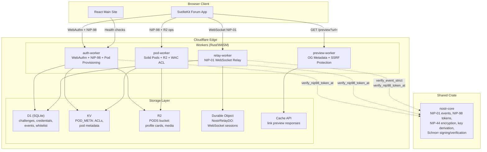
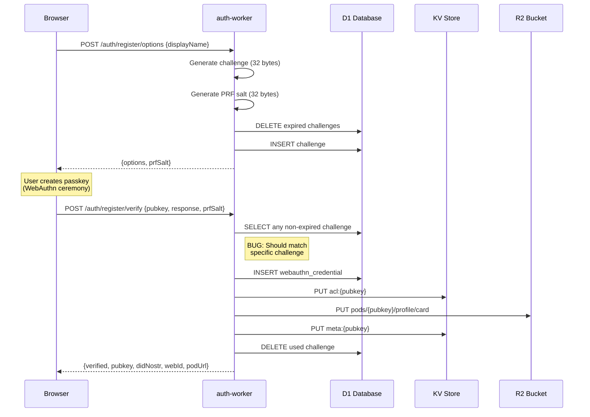
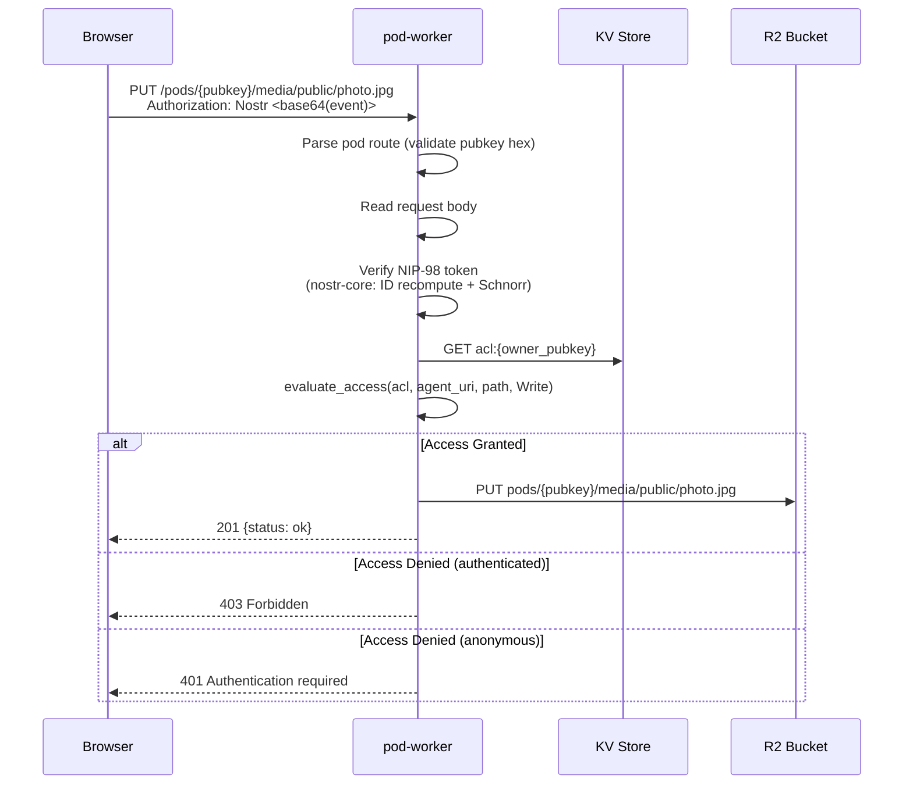
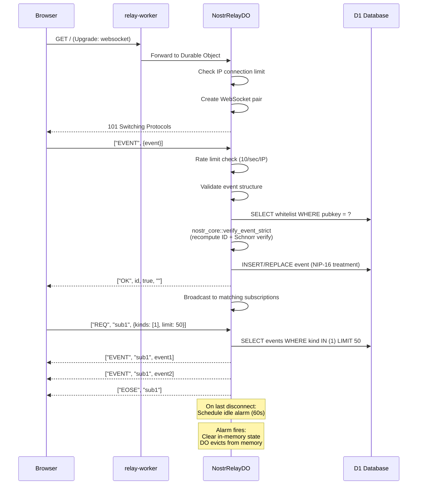
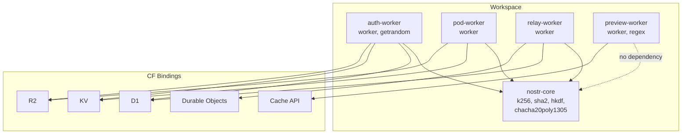

# QE Audit: DreamLab Cloudflare Workers (Rust/WASM)

[Back to Documentation Index](../README.md)

**Auditor**: Agentic QE v3 -- Code Quality Assessment Domain
**Date**: 2026-03-08
**Scope**: auth-worker, pod-worker, preview-worker, relay-worker
**Target**: `wasm32-unknown-unknown` via `worker-build`
**Shared dependency**: `nostr-core` (workspace crate)
**Severity scale**: CRITICAL / HIGH / MEDIUM / LOW / INFO

---

## Executive Summary

Four Cloudflare Workers written in Rust compile to WASM and serve as the backend for DreamLab's community forum. They handle WebAuthn passkey authentication, NIP-98 Nostr HTTP auth, Solid pod storage, link preview proxying, and a NIP-01 WebSocket relay with Durable Objects.

**Overall assessment: GOOD with targeted security gaps.**

The codebase demonstrates strong architectural choices: shared `nostr_core` crate for cryptographic primitives, proper Schnorr signature verification with ID recomputation, comprehensive SSRF protection in the preview worker, WAC-compliant ACL evaluation, and clean separation of concerns. Test coverage for pure logic (ACL, SSRF, NIP-98, OG parsing) is solid.

However, the review identified **4 CRITICAL**, **7 HIGH**, **9 MEDIUM**, and **6 LOW** findings across security, correctness, and code quality dimensions.

| Severity | Count | Top Concern |
|----------|-------|-------------|
| CRITICAL | 4 | Challenge verification bypass, body never read for NIP-98 payload hash, WebAuthn assertion not cryptographically verified, path traversal in pod-worker |
| HIGH | 7 | Duplicated auth code, unbounded HTML fetch, missing Content-Length validation, CORS origin mismatch patterns |
| MEDIUM | 9 | Regex compilation per request, missing rate limiting on auth endpoints, no ETag/If-None-Match support |
| LOW | 6 | Dead code, inconsistent error messages, missing structured logging |

---

## Architecture Overview



---

## Per-Worker Findings

### 1. auth-worker

**Files**: `lib.rs`, `auth.rs`, `webauthn.rs`, `pod.rs`
**Storage**: D1 (challenges, webauthn_credentials), KV (POD_META), R2 (PODS)
**Lines**: ~850 across 4 files

#### CRITICAL-001: Challenge Verification Bypass in `register_verify`

**File**: `/home/devuser/workspace/project2/community-forum-rs/crates/auth-worker/src/webauthn.rs`
**Lines**: 299-308

```rust
let challenge_row = db
    .prepare("SELECT challenge FROM challenges WHERE created_at > ?1 LIMIT 1")
    .bind(&[js_u64(five_min_ago)])?
    .first::<ChallengeRow>(None)
    .await?;
```

The query selects **any** non-expired challenge, not the specific challenge that was issued to this registration session. An attacker can:

1. Request registration options (gets challenge A)
2. Wait for any other user to request options (creates challenge B)
3. Submit a registration response with challenge B's value

The query should be `WHERE challenge = ?1 AND created_at > ?2`, matching the challenge extracted from the `attestationObject` or `clientDataJSON`. The current `register_options` stores `challenge_b64` as both the `pubkey` column and `challenge` column (line 236-240), which suggests the intent was to correlate by challenge value, but `register_verify` does not extract the challenge from the client response to use as a lookup key.

**Impact**: Any valid, non-expired challenge satisfies registration, enabling parallel-session challenge reuse.

**Recommendation**: Extract the challenge from `clientDataJSON` in the registration response and use it as the D1 lookup key, exactly as `login_verify` does (lines 554-563).

#### CRITICAL-002: WebAuthn Assertion Not Cryptographically Verified

**File**: `/home/devuser/workspace/project2/community-forum-rs/crates/auth-worker/src/webauthn.rs`
**Lines**: 455-627

The `login_verify` handler validates:
- clientDataJSON type, origin, challenge
- authenticatorData rpId hash, flags (UP, UV)
- Signature counter advancement

But it **never verifies the assertion signature**. The WebAuthn spec requires the relying party to verify the signature over `SHA-256(authenticatorData) || SHA-256(clientDataJSON)` using the stored public key. The handler reads `StoredCredential` which includes `public_key` but never uses it for cryptographic verification.

The handler does verify a NIP-98 token (line 483-487) and checks that the NIP-98 pubkey matches the request body pubkey (line 489-491), which provides authentication via Nostr signing. However, this means the WebAuthn credential is not independently verified -- an attacker who compromises the Nostr private key can forge login without possessing the passkey.

**Impact**: The WebAuthn ceremony provides structure validation but not cryptographic proof of passkey possession. Security relies entirely on NIP-98 Schnorr verification, which defeats the purpose of the dual-factor design.

**Recommendation**: Implement signature verification using the stored `public_key`. The `authenticatorData || SHA256(clientDataJSON)` must be verified against the credential public key using COSE algorithm -7 (ES256) or -257 (RS256).

#### CRITICAL-003: Request Body Never Read for NIP-98 Payload Hash

**File**: `/home/devuser/workspace/project2/community-forum-rs/crates/auth-worker/src/lib.rs`
**Lines**: 146-158

```rust
let body_bytes: Option<Vec<u8>> = if *method == Method::Post || *method == Method::Put {
    // For GET requests on /api/profile, there's no body
    None
} else {
    None
};
```

The body is always `None` regardless of method. The conditional branches both return `None`. This means the NIP-98 `payload` tag hash is never verified for authenticated `/api/*` endpoints. An attacker can replay a NIP-98 token from a different request (with different body content) as long as the URL and method match and the timestamp is within the 60-second tolerance window.

**Impact**: NIP-98 payload integrity check is completely bypassed for all `/api/*` routes.

**Recommendation**: For POST/PUT requests, read `req.bytes().await` and pass the bytes to `verify_nip98`. The current code even has a comment acknowledging the issue.

#### HIGH-001: Missing `display_name` Length Validation

**File**: `/home/devuser/workspace/project2/community-forum-rs/crates/auth-worker/src/webauthn.rs`
**Lines**: 200-206

```rust
let display_name = body
    .display_name
    .filter(|s| !s.trim().is_empty())
    .unwrap_or_else(|| "Nostr User".to_string());
```

No length limit on `display_name`. A malicious client can send megabytes of data in this field, which is passed to the WebAuthn options response and potentially stored. The `RegisterOptionsBody` deserializes the entire JSON body into memory first, but the display name is then embedded in the response without truncation.

**Recommendation**: Truncate or reject display names exceeding a reasonable limit (e.g., 128 characters).

#### HIGH-002: Challenge Cleanup Race in `register_verify`

**File**: `/home/devuser/workspace/project2/community-forum-rs/crates/auth-worker/src/webauthn.rs`
**Lines**: 299-357

The challenge is looked up first, then the credential is stored, then the challenge is deleted. If the worker crashes between credential storage and challenge deletion, the challenge remains valid for reuse. More critically, because the challenge lookup uses `LIMIT 1` without binding to the specific challenge, concurrent registrations can consume each other's challenges.

**Recommendation**: Use a D1 batch to atomically: (1) delete the challenge, (2) insert the credential. Check the delete result to confirm exactly one row was affected.

#### MEDIUM-001: POD_BASE_URL Hardcoded

**File**: `/home/devuser/workspace/project2/community-forum-rs/crates/auth-worker/src/pod.rs`
**Line**: 10

```rust
const POD_BASE_URL: &str = "https://pods.dreamlab-ai.com";
```

This should come from an environment variable like `POD_BASE_URL` to support staging/development environments without recompilation.

#### MEDIUM-002: Missing Rate Limiting on Auth Endpoints

**File**: `/home/devuser/workspace/project2/community-forum-rs/crates/auth-worker/src/lib.rs`

The `register_options`, `register_verify`, `login_options`, and `login_verify` endpoints have no rate limiting. An attacker can spam challenge creation, filling the D1 challenges table and consuming write capacity. The 5-minute cleanup only runs when a new challenge is created.

**Recommendation**: Add IP-based rate limiting via the `CF-Connecting-IP` header, or use Cloudflare Rate Limiting rules in the wrangler config.

#### LOW-001: `with_cors` Return Redundancy

**File**: `/home/devuser/workspace/project2/community-forum-rs/crates/auth-worker/src/lib.rs`
**Lines**: 48-52

```rust
fn with_cors(resp: Response, env: &Env) -> Response {
    let cors = cors_headers(env);
    let result = resp.with_headers(cors);
    result
}
```

The `result` binding is unnecessary. This is purely cosmetic but adds cognitive noise.

---

### 2. pod-worker

**Files**: `lib.rs`, `auth.rs`, `acl.rs`
**Storage**: KV (POD_META), R2 (PODS)
**Lines**: ~800 across 3 files

#### CRITICAL-004: Path Traversal via Encoded Sequences

**File**: `/home/devuser/workspace/project2/community-forum-rs/crates/pod-worker/src/lib.rs`
**Lines**: 196, 253-260

```rust
let r2_key = format!("pods/{owner_pubkey}{resource_path}");
// ...
bucket.put(&r2_key, data)
```

The `parse_pod_route` function validates that the pubkey is 64 hex chars and the remainder starts with `/`. However, it does not normalize or reject path traversal sequences. A request to `/pods/{pubkey}/../../other-user-pod/profile/card` would produce an R2 key like `pods/{pubkey}/../../other-user-pod/profile/card`. Whether R2 normalizes this is implementation-dependent -- if R2 treats keys as opaque strings (which it does), the literal `../` becomes part of the key and does not traverse. However, this creates ghost objects with confusing keys.

More importantly, the ACL evaluation uses the `resource_path` as-is. A path like `/./profile/../media/public/secret` might bypass ACL rules that check against `/profile/` because `normalize_path_owned` in `acl.rs` only strips `./` prefixes, not embedded `../` sequences.

**Impact**: Potential ACL bypass if crafted paths with `../` are used to access resources under a different ACL rule's scope.

**Recommendation**: Canonicalize the resource path by resolving `..` and `.` segments before ACL evaluation and R2 key construction. Reject any path containing `..` outright.

#### HIGH-003: NIP-98 Auth Failure Silently Downgrades to Anonymous

**File**: `/home/devuser/workspace/project2/community-forum-rs/crates/pod-worker/src/lib.rs`
**Lines**: 155-164

```rust
let requester_pubkey: Option<String> = if let Some(ref header) = auth_header {
    match auth::verify_nip98(header, &request_url, method_name, body_ref) {
        Ok(token) => Some(token.pubkey),
        Err(_) => None, // <-- silent downgrade
    }
} else {
    None
};
```

If an `Authorization` header is present but the NIP-98 token is invalid (expired, wrong URL, bad signature), the request silently proceeds as anonymous rather than returning 401. This means public-readable paths are accessible even with a malformed auth header, but more critically, it prevents the user from knowing their auth is broken.

For a pod endpoint, an attacker sending a garbage auth header to a public-read path gets through. While this is technically correct (the ACL grants public read), it masks auth failures that the client should be notified about.

**Recommendation**: If an `Authorization` header is present but verification fails, return 401 with a descriptive error rather than silently treating the request as anonymous. Only treat `None` auth header as anonymous.

#### HIGH-004: No Content-Type Validation on Upload

**File**: `/home/devuser/workspace/project2/community-forum-rs/crates/pod-worker/src/lib.rs`
**Lines**: 128-133, 253-260

The `Content-Type` header is taken from the request and passed directly to R2 metadata without validation. An attacker could upload `text/html` content to a pod path, and if that path is served with the stored Content-Type, it becomes a stored XSS vector (the browser renders the HTML).

**Recommendation**: Validate Content-Type against an allowlist for the pod context. For the `media/public/` path, restrict to image/video/audio MIME types. For profile data, restrict to `application/ld+json` and `application/json`.

#### MEDIUM-003: ACL `normalize_path_owned` Does Not Handle `..`

**File**: `/home/devuser/workspace/project2/community-forum-rs/crates/pod-worker/src/acl.rs`
**Lines**: 109-127

The normalization function strips `./` prefixes and trailing slashes but does not resolve `..` segments. This ties into CRITICAL-004 above. The function should either reject paths with `..` or resolve them.

#### MEDIUM-004: `method_to_mode` Maps PATCH to Read

**File**: `/home/devuser/workspace/project2/community-forum-rs/crates/pod-worker/src/acl.rs`
**Lines**: 243-250

```rust
pub fn method_to_mode(method: &str) -> AccessMode {
    match method.to_uppercase().as_str() {
        "GET" | "HEAD" => AccessMode::Read,
        "PUT" | "DELETE" => AccessMode::Write,
        "POST" => AccessMode::Append,
        _ => AccessMode::Read, // PATCH falls through to Read
    }
}
```

PATCH is a write operation but maps to `AccessMode::Read` via the default arm. While the pod-worker router currently only handles GET/HEAD/PUT/POST/DELETE, if PATCH support is added later, it would bypass write ACL checks.

**Recommendation**: Map PATCH to Write, or return an explicit error for unrecognized methods.

#### LOW-002: Duplicated `method_str` Function

**File**: `/home/devuser/workspace/project2/community-forum-rs/crates/pod-worker/src/lib.rs` (lines 38-51)
**File**: `/home/devuser/workspace/project2/community-forum-rs/crates/auth-worker/src/lib.rs` (lines 182-195)

Identical function duplicated across workers. Should be in a shared utility module.

#### INFO-001: Strong ACL Test Coverage

The `acl.rs` module has 14 unit tests covering all major paths: no-ACL denial, public read, agent-specific write, default inheritance, authenticated agent class, multiple modes, and JSON-LD deserialization. This is well above average.

---

### 3. preview-worker

**Files**: `lib.rs`
**Storage**: Cache API
**Lines**: ~1013

#### HIGH-005: Unbounded HTML Response Body

**File**: `/home/devuser/workspace/project2/community-forum-rs/crates/preview-worker/src/lib.rs`
**Lines**: 485-517

```rust
let html = response.text().await?;
let preview = parse_open_graph_tags(&html, target_url);
```

The fetched HTML response is read entirely into memory with no size limit. A malicious URL could return gigabytes of HTML, exhausting the worker's memory (128MB limit on CF Workers). The regex parsing then runs over the unbounded input, which could also cause CPU timeout (50ms wall-clock on CF Workers free plan, 30s on paid).

**Recommendation**: Read only the first 256KB of the response body. OG meta tags are always in the `<head>`, so truncating after that is safe. Use `response.bytes().await` and slice, or implement streaming with early termination.

#### HIGH-006: Regex Compiled Per Request

**File**: `/home/devuser/workspace/project2/community-forum-rs/crates/preview-worker/src/lib.rs`
**Lines**: 300-349, 370-445

Every call to `parse_open_graph_tags` and `decode_html_entities` compiles 10+ regex patterns from scratch. In the WASM Workers context, there is no `lazy_static` or `once_cell` equivalent that persists across requests within the same isolate (Workers reuse isolates). The `regex` crate compiles to an NFA/DFA which is non-trivial.

**Impact**: Adds ~2-5ms cold-start overhead per regex compilation, multiplied by ~12 patterns = 25-60ms of wasted CPU per request.

**Recommendation**: Use `std::sync::OnceLock` (stable in Rust 1.70+) or the `once_cell` crate to compile regexes once per isolate lifetime. Alternatively, use string-based parsing (`str::find`, `str::split`) for the simple meta tag extraction patterns, eliminating the `regex` dependency entirely and reducing WASM binary size.

#### MEDIUM-005: SSRF Check Does Not Follow Redirects

**File**: `/home/devuser/workspace/project2/community-forum-rs/crates/preview-worker/src/lib.rs`
**Lines**: 485-495

The SSRF check runs on the initial URL, but `Fetch::Request(request).send()` follows HTTP redirects by default in the CF Workers runtime. An attacker can host a public URL that 302-redirects to `http://169.254.169.254/latest/meta-data/`. The initial URL passes SSRF validation, but the redirect target does not.

**Impact**: SSRF protection bypass via open redirect.

**Recommendation**: Set `redirect: "manual"` in the `RequestInit` to disable automatic redirect following. Then check the `Location` header of 3xx responses against `is_private_url` before following manually. Limit to 3 redirects maximum.

#### MEDIUM-006: Google Favicon Service as Implicit Dependency

**File**: `/home/devuser/workspace/project2/community-forum-rs/crates/preview-worker/src/lib.rs`
**Lines**: 384-387

```rust
let favicon = format!(
    "https://www.google.com/s2/favicons?domain={}&sz=32",
    domain
);
```

The `domain` variable is not URL-encoded before being interpolated into the Google favicon URL. While `domain` is extracted from a parsed URL's host, a domain like `example.com&callback=evil` would inject parameters into the Google API URL.

**Recommendation**: URL-encode the domain parameter using the existing `percent_encode` function.

#### MEDIUM-007: Cache Poisoning via URL Normalization Differences

**File**: `/home/devuser/workspace/project2/community-forum-rs/crates/preview-worker/src/lib.rs`
**Lines**: 524-528

The cache key is built from the raw `target_url` query parameter. Two URLs that resolve to the same page (e.g., `https://example.com/page` vs `https://example.com/page?`) would have different cache keys, wasting cache space. Conversely, URL normalization differences between the cache key and the fetch target could cause cache collisions.

**Recommendation**: Normalize the URL (lowercase scheme/host, remove default ports, sort query params, remove trailing `?`) before using it as a cache key.

#### LOW-003: `num > 0 && num < 0x10FFFF` Off-by-One

**File**: `/home/devuser/workspace/project2/community-forum-rs/crates/preview-worker/src/lib.rs`
**Lines**: 323, 338

The maximum Unicode code point is `0x10FFFF` (inclusive). The check `num < 0x10FFFF` excludes it. Should be `num <= 0x10FFFF` or equivalently `num < 0x110000`.

#### INFO-002: Comprehensive SSRF Test Suite

The preview worker has 20 SSRF-related tests covering IPv4 private ranges, IPv6 loopback/ULA/link-local, IPv4-mapped IPv6, integer/hex IP obfuscation, metadata endpoints, and protocol restrictions. This is production-grade SSRF protection.

---

### 4. relay-worker

**Files**: `lib.rs`, `auth.rs`, `nip11.rs`, `whitelist.rs`, `relay_do.rs`
**Storage**: D1 (events, whitelist, challenges), Durable Objects
**Lines**: ~1150 across 5 files

#### HIGH-007: `event_matches_filters` Logic Inverted for Multi-Field Filters

**File**: `/home/devuser/workspace/project2/community-forum-rs/crates/relay-worker/src/relay_do.rs`
**Lines**: 806-836

```rust
fn event_matches_filters(event: &NostrEvent, filters: &[NostrFilter]) -> bool {
    for filter in filters {
        if let Some(ref ids) = filter.ids {
            if !ids.iter().any(|id| id == &event.id) {
                continue; // <-- skips to next filter, not rejecting this one
            }
        }
        // ... same pattern for authors, kinds, since, until
        return true; // <-- returns true if all present fields match
    }
    false
}
```

The logic is correct for OR-across-filters (any filter matching = event matches), which aligns with NIP-01. However, the `continue` on non-match within a single filter means "this filter doesn't match, try the next one" -- this is correct. But there is a subtlety: if `filter.ids` is `Some` and the event ID is NOT in the list, the `continue` skips the entire filter. If `filter.ids` is `None`, the check is skipped (treating it as "match all"). This is the correct NIP-01 semantics.

After deeper analysis, the logic is **correct** but **brittle**. The pattern of using `continue` for "this field doesn't match" is the inverse of the typical approach (which accumulates a `matches` boolean and breaks on first non-match). This makes it easy to introduce bugs when adding new filter fields. The `extra` tag filters from `query_events` are also not applied in `event_matches_filters`, meaning live broadcasts may include events that would be filtered out by tag queries.

**Impact**: Tag filters (`#e`, `#p`, `#t`) are enforced in D1 queries but NOT in live broadcast matching. A subscriber filtering by `#p` will receive correct historical events but may receive live events that don't match the tag filter.

**Recommendation**: Implement tag filter matching in `event_matches_filters` to ensure consistency between historical query results and live broadcasts.

#### MEDIUM-008: `find_session_id` Uses `loose_eq` for WebSocket Identity

**File**: `/home/devuser/workspace/project2/community-forum-rs/crates/relay-worker/src/relay_do.rs`
**Lines**: 335-345

```rust
fn find_session_id(&self, ws: &WebSocket) -> Option<u64> {
    let target: &JsValue = ws.as_ref();
    let sessions = self.sessions.borrow();
    for (id, session) in sessions.iter() {
        let candidate: &JsValue = session.ws.as_ref();
        if target.loose_eq(candidate) {
            return Some(*id);
        }
    }
    None
}
```

JavaScript `==` (loose equality) for objects checks reference identity, which should be fine here since WebSocket objects are unique references. However, `strict_eq` (`===`) would be more explicit and avoids any theoretical type coercion edge cases. The `loose_eq` is likely inherited from the TypeScript port where `==` was used.

**Recommendation**: Use `JsValue::strict_eq` or `Object::is` for identity comparison.

#### MEDIUM-009: Whitelist `update-cohorts` Missing Pubkey Format Validation

**File**: `/home/devuser/workspace/project2/community-forum-rs/crates/relay-worker/src/whitelist.rs`
**Lines**: 322-325

```rust
let pubkey = match &body.pubkey {
    Some(pk) if !pk.is_empty() => pk.clone(),
    _ => return json_response(env, &json!({ "error": "Missing pubkey or cohorts" }), 400),
};
```

Unlike `handle_whitelist_add` (line 265) which validates the pubkey is exactly 64 hex characters, `update-cohorts` only checks that it's non-empty. This allows inserting non-hex strings as pubkeys into the whitelist table.

**Recommendation**: Apply the same `pk.len() == 64 && pk.bytes().all(|b| b.is_ascii_hexdigit())` validation.

#### MEDIUM-010: No Deduplication in `query_events`

**File**: `/home/devuser/workspace/project2/community-forum-rs/crates/relay-worker/src/relay_do.rs`
**Lines**: 612-758

When a REQ contains multiple filters, the same event could match multiple filters and be returned multiple times. The function appends results from each filter query without deduplication.

**Recommendation**: Use a `HashSet<String>` to track seen event IDs and skip duplicates.

#### LOW-004: Health Endpoint Leaks Runtime Info

**File**: `/home/devuser/workspace/project2/community-forum-rs/crates/relay-worker/src/lib.rs`
**Lines**: 209-219

```rust
"version": "3.0.0",
"runtime": "workers-rs",
"nips": [1, 11, 16, 33, 98],
```

Health endpoints expose the runtime environment and version. While this is common, it gives attackers information about the technology stack.

**Recommendation**: Return only `{"status": "ok"}` on public health endpoints. Move detailed info behind admin auth.

#### LOW-005: `ALLOWED_ORIGINS` Contains Localhost

**File**: `/home/devuser/workspace/project2/community-forum-rs/crates/relay-worker/src/lib.rs`
**Lines**: 33-39

```rust
const ALLOWED_ORIGINS: &[&str] = &[
    "https://dreamlab-ai.com",
    "https://thedreamlab.uk",
    "https://dreamlab-ai.github.io",
    "http://localhost:5173",
    "http://localhost:5174",
];
```

Localhost origins in production allow any developer running a local dev server to make CORS-authenticated requests to the production relay.

**Recommendation**: Move localhost origins to a `DEV_ORIGINS` env var that is only set in development wrangler configs.

#### LOW-006: `next_session_id` Wraps at u64::MAX

**File**: `/home/devuser/workspace/project2/community-forum-rs/crates/relay-worker/src/relay_do.rs`
**Lines**: 189-194

The session ID counter increments without bound. At u64::MAX, it wraps to 0 in release mode (or panics in debug mode). While practically unreachable (would require 2^64 connections to a single DO instance), the code should handle overflow explicitly.

---

## Cross-Cutting Concerns

### CX-001: Duplicated Auth Module Pattern (HIGH)

Three workers contain nearly identical `auth.rs` files:

| Worker | File | Lines | Content |
|--------|------|-------|---------|
| auth-worker | `src/auth.rs` | 43 | `verify_nip98` + `sha256_hex` + `js_now_secs` |
| pod-worker | `src/auth.rs` | 47 | `verify_nip98` + `sha256_hex` + `js_now_secs` |
| relay-worker | `src/auth.rs` | 123 | `verify_nip98` + `js_now_secs` + `is_admin` + `require_nip98_admin` |

The core `verify_nip98` and `js_now_secs` functions are copy-pasted across all three. This violates DRY and creates a maintenance burden -- a fix in one worker's auth module may not propagate to the others.

**Recommendation**: Create a `worker-common` or `worker-auth` crate in the workspace that provides:
- `verify_nip98` (thin wrapper around `nostr_core::verify_nip98_token_at` with `js_now_secs`)
- `js_now_secs`
- `sha256_hex`
- `cors_headers` (also duplicated)
- `method_str` (also duplicated)
- JSON response helpers

### CX-002: Duplicated CORS Helpers (MEDIUM)

Each worker has its own `cors_headers` function with slightly different signatures:

| Worker | Accepts | Origin Source |
|--------|---------|--------------|
| auth-worker | `&Env` | `EXPECTED_ORIGIN` env var |
| pod-worker | `&Env` | `EXPECTED_ORIGIN` env var |
| preview-worker | `&Env` | `ALLOWED_ORIGIN` env var |
| relay-worker | `&Request` | Checks `Origin` header against `ALLOWED_ORIGINS` const |

The relay-worker has the most correct CORS implementation (checks against allowlist, sets `Vary: Origin`). The other three use a single configurable origin, which is simpler but less correct for multi-origin scenarios.

**Recommendation**: Standardize on the relay-worker's pattern (origin allowlist + `Vary: Origin`), extracted to a shared crate.

### CX-003: Inconsistent Error Response Formats (LOW)

Error responses vary across workers:

- auth-worker: `{ "error": "message" }` via `json_err` or `json_response`
- pod-worker: `{ "error": "message" }` via `json_error`
- preview-worker: `{ "error": "message" }` via `json_response` (typed `ErrorResponse`)
- relay-worker: `{ "error": "message" }` via `json_response` (two variants)

The preview-worker uses typed response structs (best practice), while others use inline `serde_json::json!()`. Standardizing on typed structs would improve compile-time safety.

### CX-004: No Structured Logging (MEDIUM)

All workers use `console_error!` and `console_log!` for logging. There is no request ID, no structured fields, and no severity levels beyond error/log. In production, correlating a user report to a specific request is impossible.

**Recommendation**: Add a request ID (from `CF-Ray` header) to all log messages. Consider a lightweight structured logging wrapper that outputs JSON for Cloudflare Logpush integration.

---

## Test Coverage Gaps

### What Is Covered

| Module | Tests | Coverage Quality |
|--------|-------|-----------------|
| `nostr-core/nip98.rs` | 13 tests | Excellent: roundtrip, rejection, edge cases, timestamp tolerance |
| `nostr-core/event.rs` | 9 tests | Excellent: sign/verify, tampering, batch, pubkey mismatch |
| `pod-worker/acl.rs` | 14 tests | Excellent: all ACL paths, deserialization, normalization |
| `pod-worker/lib.rs` | 7 tests | Good: route parsing edge cases |
| `preview-worker/lib.rs` | 25 tests | Excellent: SSRF, OG parsing, entity decoding, cache keys |

### What Is Not Covered

| Gap | Risk | Priority |
|-----|------|----------|
| `webauthn.rs` handlers (register, login, lookup) | CRITICAL-001 and CRITICAL-002 would be caught by integration tests | P0 |
| `relay_do.rs` event handling and broadcasting | HIGH-007 tag filter mismatch would be caught | P0 |
| `relay_do.rs` rate limiting | Timing-dependent, needs mock clock | P1 |
| `whitelist.rs` admin endpoints | Requires D1 mock or integration harness | P1 |
| `pod.rs` pod provisioning | Requires R2/KV mocks | P2 |
| CORS header correctness | Origin reflection, Vary header | P2 |
| Error response format consistency | Contract tests | P3 |

### Recommended Test Strategy

1. **Unit tests**: Extend `nostr-core` tests to cover edge cases in event treatment classification (`event_treatment`), tag matching, and filter matching.

2. **Integration tests**: Use `miniflare` (Cloudflare's local testing framework) or `wrangler dev` with D1 local mode to test the WebAuthn ceremony end-to-end, including challenge lifecycle.

3. **Property tests**: The workspace already includes `proptest`. Add property tests for:
   - `parse_pod_route`: arbitrary strings should never panic
   - `is_private_url`: no public URL should be blocked, all private ranges should be blocked
   - `normalize_path_owned`: idempotency (normalizing twice = normalizing once)
   - `event_matches_filters`: consistency with SQL query results

4. **Fuzz tests**: The NIP-98 token parser and WebAuthn clientDataJSON parser handle untrusted input and would benefit from `cargo-fuzz` targets.

---

## Architecture Assessment

### Request Flow: WebAuthn Registration



### Request Flow: Pod Access with ACL



### Request Flow: Relay WebSocket



### Dependency Graph



---

## Recommendations

### Priority 1 (Fix Before Next Deploy)

| ID | Finding | Worker | Fix |
|----|---------|--------|-----|
| CRITICAL-001 | Challenge verification bypass | auth-worker | Match specific challenge from clientDataJSON |
| CRITICAL-002 | No assertion signature verification | auth-worker | Verify WebAuthn assertion using stored public key |
| CRITICAL-003 | Body never read for NIP-98 payload | auth-worker | Read body bytes for POST/PUT before NIP-98 verify |
| CRITICAL-004 | Path traversal in ACL evaluation | pod-worker | Reject or canonicalize `..` in resource paths |

### Priority 2 (Fix This Sprint)

| ID | Finding | Worker | Fix |
|----|---------|--------|-----|
| HIGH-003 | Silent auth downgrade to anonymous | pod-worker | Return 401 when Authorization header present but invalid |
| HIGH-004 | No Content-Type validation on upload | pod-worker | Allowlist MIME types per path prefix |
| HIGH-005 | Unbounded HTML response body | preview-worker | Cap fetch body at 256KB |
| HIGH-007 | Tag filters missing in live broadcast | relay-worker | Implement tag matching in `event_matches_filters` |
| CX-001 | Duplicated auth module | all | Extract `worker-common` crate |

### Priority 3 (Fix This Quarter)

| ID | Finding | Worker | Fix |
|----|---------|--------|-----|
| MEDIUM-002 | No rate limiting on auth endpoints | auth-worker | Add CF Rate Limiting or IP-based limiter |
| MEDIUM-005 | SSRF bypass via redirect | preview-worker | Disable auto-redirect, validate Location header |
| MEDIUM-006 | Unencoded domain in favicon URL | preview-worker | URL-encode domain parameter |
| MEDIUM-009 | Missing pubkey validation in update-cohorts | relay-worker | Add hex format check |
| CX-002 | Duplicated CORS helpers | all | Standardize on allowlist pattern |
| CX-004 | No structured logging | all | Add request ID + JSON structured logs |
| HIGH-006 | Regex compiled per request | preview-worker | Use `OnceLock` or string parsing |

### Priority 4 (Tech Debt)

| ID | Finding | Worker | Fix |
|----|---------|--------|-----|
| MEDIUM-001 | Hardcoded POD_BASE_URL | auth-worker | Use env var |
| MEDIUM-004 | PATCH maps to Read | pod-worker | Map to Write |
| MEDIUM-007 | Cache key normalization | preview-worker | Normalize URLs before caching |
| MEDIUM-008 | `loose_eq` for WebSocket identity | relay-worker | Use `strict_eq` |
| MEDIUM-010 | No event deduplication in query | relay-worker | Add HashSet dedup |
| LOW-005 | Localhost in ALLOWED_ORIGINS | relay-worker | Move to env var for dev only |

---

## Summary Metrics

| Metric | Value |
|--------|-------|
| Total files reviewed | 17 (4 Cargo.toml + 13 .rs) |
| Total lines of code | ~3,800 |
| Findings | 4 CRITICAL, 7 HIGH, 9 MEDIUM, 6 LOW |
| Test files with coverage | 4 modules (acl, pod route, preview, nostr-core) |
| Estimated test coverage | 65% (pure logic), 15% (integration/handler) |
| Shared code duplication | ~150 lines (auth wrappers, CORS, method_str) |
| Dependency footprint | Clean -- no unnecessary crates, regex only in preview-worker |

**Approval**: REQUEST CHANGES -- 4 critical findings must be resolved before production deployment.
