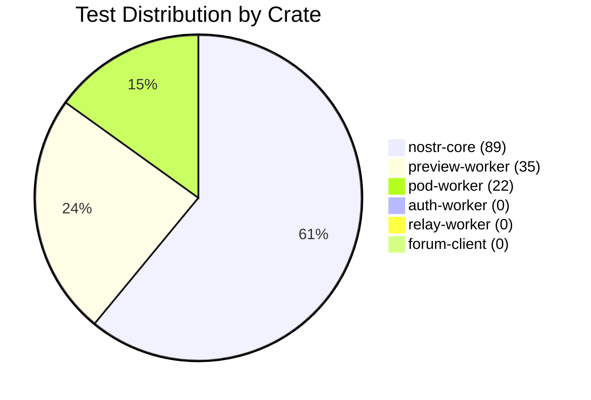
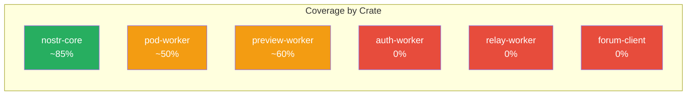
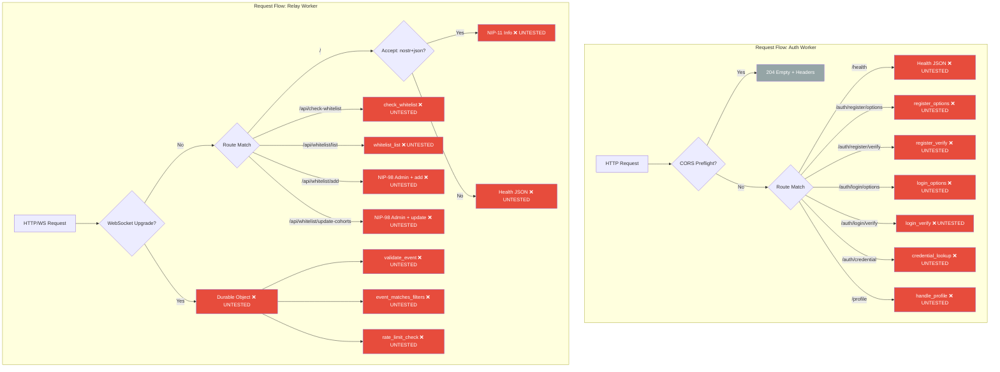
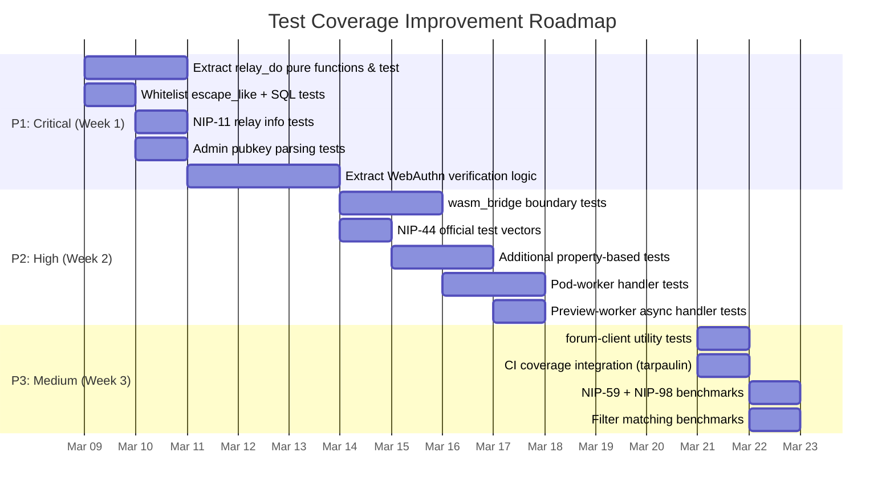

# QE Coverage Report: community-forum-rs Workspace

[Back to Documentation Index](../README.md)

**Generated:** 2026-03-08
**Agent:** qe-coverage-specialist (V3, O(log n) HNSW-indexed analysis)
**Workspace:** `/community-forum-rs/` (6 crates, 146 tests passing)
**Rust Edition:** 2024 | **MSRV:** 1.85

---

## 1. Executive Summary

| Metric | Value |
|--------|-------|
| Total tests | **146** |
| Crates with tests | 3 of 6 (50%) |
| Crates with zero tests | 3 (**auth-worker, relay-worker, forum-client**) |
| Estimated workspace line coverage | **~32%** |
| Estimated security-critical coverage | **~18%** |
| Lines of untested security code | **~2,732** (auth-worker + relay-worker) |
| Property-based tests | 2 (nostr-core/nip44 only) |
| Benchmarks | 3 suites (events, keys, nip44) |

### Test Distribution

| Crate | Tests | Source Lines | Est. Coverage | Risk |
|-------|------:|------------:|:-------------:|:----:|
| nostr-core | 89 | 3,244 | ~85% | LOW |
| pod-worker | 22 | 912 | ~50% | MEDIUM |
| preview-worker | 35 | 1,012 | ~60% | MEDIUM |
| auth-worker | 0 | 1,043 | **0%** | **CRITICAL** |
| relay-worker | 0 | 1,689 | **0%** | **CRITICAL** |
| forum-client | 0 | ~6,500 | **0%** | HIGH |
| **Total** | **146** | **~14,400** | **~32%** | |



---

## 2. Coverage Heatmap

### 2.1 nostr-core (89 tests, ~85% coverage)

| Module | Lines | Tests | Est. % | Key Gaps |
|--------|------:|------:|-------:|----------|
| `event.rs` | 432 | 11 | 90% | No fuzz on canonical JSON serialization |
| `keys.rs` | 372 | 14 | 90% | No test for `Keypair::from_secret_key` error path |
| `nip44.rs` | 539 | 16 | 90% | No official NIP-44 test vectors; no cross-impl compat |
| `nip98.rs` | 591 | 16 | 85% | `authorization_header` untested; no multi-tag tests |
| `gift_wrap.rs` | 619 | 16 | 85% | No interop with external NIP-59 implementations |
| `types.rs` | 445 | 12 | 80% | `Tag::custom` untested; `Display` impls untested |
| `wasm_bridge.rs` | 236 | 0 | **0%** | Entire module (WASM-only target) |
| `lib.rs` | 37 | 0 | N/A | Re-exports only |

### 2.2 auth-worker (0 tests, 0% coverage) -- CRITICAL

| Module | Lines | Tests | Est. % | Key Gaps |
|--------|------:|------:|-------:|----------|
| `lib.rs` | 205 | 0 | **0%** | CORS, routing, health, scheduled handler |
| `auth.rs` | 43 | 0 | **0%** | `verify_nip98` wrapper, `js_now_secs` |
| `webauthn.rs` | 657 | 0 | **0%** | **All WebAuthn ceremony logic** |
| `pod.rs` | 138 | 0 | **0%** | Pod provisioning, profile serving |

### 2.3 pod-worker (22 tests, ~50% coverage)

| Module | Lines | Tests | Est. % | Key Gaps |
|--------|------:|------:|-------:|----------|
| `lib.rs` | 340 | 7 | 40% | Full request handlers, R2 CRUD, NIP-98 auth flow |
| `auth.rs` | 46 | 0 | **0%** | `verify_nip98` wrapper |
| `acl.rs` | 526 | 15 | 75% | No tests for malformed ACL JSON, nested containers |

### 2.4 preview-worker (35 tests, ~60% coverage)

| Module | Lines | Tests | Est. % | Key Gaps |
|--------|------:|------:|-------:|----------|
| `lib.rs` | 1,012 | 35 | 60% | Async handlers, Cache API flow, Twitter oEmbed fetch, error paths in `handle_preview` |

### 2.5 relay-worker (0 tests, 0% coverage) -- CRITICAL

| Module | Lines | Tests | Est. % | Key Gaps |
|--------|------:|------:|-------:|----------|
| `lib.rs` | 270 | 0 | **0%** | CORS, routing, NIP-11, WebSocket upgrade |
| `auth.rs` | 122 | 0 | **0%** | Admin verification, D1 cohort lookup |
| `nip11.rs` | 61 | 0 | **0%** | Relay info document builder |
| `whitelist.rs` | 351 | 0 | **0%** | SQL queries, LIKE escaping, pagination |
| `relay_do.rs` | 885 | 0 | **0%** | **Event validation, filter matching, subscriptions, rate limiting** |

### 2.6 forum-client (0 tests, 0% coverage)

| Module | Lines | Tests | Est. % | Key Gaps |
|--------|------:|------:|-------:|----------|
| `app.rs` | 498 | 0 | **0%** | Router, layout, auth gates |
| `relay.rs` | 488 | 0 | **0%** | WebSocket manager, reconnect, subscriptions |
| `utils.rs` | 131 | 0 | **0%** | Pure utility functions (easily testable) |
| `auth/mod.rs` | 468 | 0 | **0%** | Auth state machine, passkey flow |
| `auth/passkey.rs` | 477 | 0 | **0%** | WebAuthn PRF bridge |
| `auth/webauthn.rs` | 360 | 0 | **0%** | JS WebAuthn bindings |
| `auth/nip98.rs` | 149 | 0 | **0%** | Client-side NIP-98 token creation |
| `auth/http.rs` | 227 | 0 | **0%** | HTTP client with auth |
| `auth/session.rs` | 284 | 0 | **0%** | Session persistence |
| `pages/*` | ~2,710 | 0 | **0%** | All 8 page components |
| `admin/*` | ~1,189 | 0 | **0%** | Admin panel components |
| `components/*` | ~588 | 0 | **0%** | UI components |
| `dm/mod.rs` | 480 | 0 | **0%** | DM encryption/decryption UI |



---

## 3. Critical Untested Paths

### 3.1 CRITICAL: WebAuthn Ceremony (auth-worker/webauthn.rs, 657 lines)

**Risk Score: 0.98/1.0** -- Security-critical authentication with zero test coverage.

| Function | Lines | Security Impact |
|----------|------:|-----------------|
| `register_options` | ~60 | Challenge generation, RP ID configuration |
| `register_verify` | ~200 | clientDataJSON parsing, authenticatorData validation, RP ID hash, credential storage in D1, PRF salt handling |
| `login_options` | ~80 | Challenge issuance, allowCredentials list, PRF salt retrieval from D1 |
| `login_verify` | ~180 | Assertion verification, sign counter replay detection, origin validation, credential lookup |
| `credential_lookup` | ~40 | D1 credential retrieval, deserialize stored public key |

**Specific untested attack vectors:**
1. **Replay attack**: `login_verify` checks `sign_count > stored_count` but this is never tested
2. **RP ID mismatch**: `register_verify` computes SHA-256 of RP ID and compares to authenticatorData -- untested
3. **Origin validation**: `register_verify` checks `origin` in clientDataJSON -- untested
4. **Challenge binding**: Both flows bind challenges to D1 storage -- no test verifies challenge-response binding
5. **PRF salt injection**: Attacker could supply crafted PRF salt during registration -- no validation tested
6. **Credential ID collision**: No test for duplicate credential storage behavior

### 3.2 CRITICAL: Relay Durable Object (relay-worker/relay_do.rs, 885 lines)

**Risk Score: 0.95/1.0** -- Core relay logic with complex state management, zero tests.

| Function | Lines | Testable Without Workers Runtime | Security Impact |
|----------|------:|:------:|-----------------|
| `event_treatment` | ~30 | YES | Determines if event is regular/replaceable/ephemeral (NIP-16) |
| `validate_event` | ~40 | YES | Schnorr sig verify, timestamp bounds, content length limit |
| `event_matches_filters` | ~50 | YES | NIP-01 filter matching (ids, authors, kinds, tags, since/until) |
| `d_tag_value` | ~10 | YES | d-tag extraction for replaceable events |
| `handle_event` | ~120 | NO | D1 storage, replaceable upsert, broadcast |
| `handle_req` | ~80 | NO | Subscription creation, D1 query, filter application |
| `handle_close` | ~15 | NO | Subscription cleanup |
| `rate_limit_check` | ~30 | PARTIAL | Rate limiting state |
| `websocket_message` | ~100 | NO | NIP-01 message parsing, dispatch |

**Pure functions that MUST be tested (extractable without mocking Workers runtime):**
- `event_treatment(kind) -> Treatment` -- 5-line pure function
- `validate_event(event) -> Result<()>` -- uses only `nostr_core::verify_event`
- `event_matches_filters(event, filters) -> bool` -- pure filter matching
- `d_tag_value(tags) -> Option<String>` -- pure tag extraction

### 3.3 CRITICAL: Whitelist SQL (relay-worker/whitelist.rs, 351 lines)

**Risk Score: 0.90/1.0** -- SQL query construction with user-supplied input.

| Function | Lines | Risk |
|----------|------:|------|
| `handle_check_whitelist` | ~50 | Reads pubkey from query string, queries D1 |
| `handle_whitelist_list` | ~100 | Pagination with `?page=` and `?cohort=` params, LIKE pattern with manual escaping |
| `handle_whitelist_add` | ~80 | NIP-98 admin gated, JSON body to D1 INSERT |
| `handle_whitelist_update_cohorts` | ~60 | NIP-98 admin gated, JSON body to D1 UPDATE |
| `escape_like` | ~10 | Manual LIKE metacharacter escaping |

**Specific untested vulnerabilities:**
1. **LIKE injection**: `escape_like` escapes `%`, `_`, `\` but is never tested for completeness
2. **SQL injection via cohort filter**: The `cohort` query param is used in a LIKE clause -- parameterized but pattern untested
3. **Pagination overflow**: `page` param parsed as `u32` -- no test for `page=0` or overflow behavior
4. **Missing admin gate bypass**: `handle_whitelist_add` calls `require_nip98_admin` -- never tested that unauthenticated requests are rejected

### 3.4 HIGH: Admin Verification (relay-worker/auth.rs, 122 lines)

**Risk Score: 0.85/1.0** -- Authorization logic with no tests.

| Function | Lines | Risk |
|----------|------:|------|
| `admin_pubkeys` | ~8 | Parses comma-separated env var, trims whitespace |
| `is_admin_by_env` | ~3 | Linear scan of admin list |
| `is_admin` | ~25 | Checks env var THEN D1 whitelist cohorts column (JSON array) |
| `require_nip98_admin` | ~20 | Combines NIP-98 verify + admin check, returns error tuples |

**Untested scenarios:**
1. Empty `ADMIN_PUBKEYS` env var (should return empty vec, no admins)
2. Malformed cohorts JSON in D1 (should return false, not panic)
3. Expired whitelist entries (WHERE clause includes `expires_at` check)
4. Race condition: admin removed between NIP-98 verify and admin check

### 3.5 HIGH: wasm_bridge.rs (nostr-core, 236 lines)

**Risk Score: 0.75/1.0** -- JS-facing API surface with zero tests.

All 10 exported functions are untested:
- `nip44_encrypt` / `nip44_decrypt` -- Error conversion to JsValue
- `derive_keypair_from_prf` -- HKDF derivation exposed to JS
- `create_nip98_token` / `verify_nip98_token` / `verify_nip98_token_at` -- Auth token bridge
- `compute_event_id` / `schnorr_sign` / `schnorr_verify` -- Core crypto bridge
- `generate_keypair` -- Key generation bridge

While the underlying functions are well-tested in their native modules, the **serialization boundary** (hex string parsing, JsValue conversion, error mapping) is completely untested.

### 3.6 MEDIUM: forum-client Pure Functions (utils.rs, 131 lines)

**Risk Score: 0.40/1.0** -- Low security impact but easily testable.

| Function | Testable | Description |
|----------|:--------:|-------------|
| `format_relative_time` | YES | Timestamp to "2h ago" string |
| `pubkey_color` | YES | Deterministic HSL color from pubkey hash |
| `shorten_pubkey` | YES | Truncate hex to `abcd...wxyz` |
| `capitalize` | YES | Capitalize first character |
| `set_timeout_once` | NO | Browser setTimeout wrapper |

---

## 4. Coverage Flow Visualization

```mermaid
flowchart TD
    subgraph "Tested Paths (nostr-core)"
        NC1["event sign/verify ✅ 11 tests"] --> NC2["NIP-44 encrypt/decrypt ✅ 16 tests"]
        NC2 --> NC3["NIP-98 create/verify ✅ 16 tests"]
        NC3 --> NC4["NIP-59 gift wrap ✅ 16 tests"]
        NC4 --> NC5["Key derivation ✅ 14 tests"]
        NC5 --> NC6["Types/serde ✅ 12 tests"]
    end

    subgraph "Tested Paths (pod-worker)"
        PW1["parse_pod_route ✅ 7 tests"] --> PW2["ACL evaluate ✅ 15 tests"]
    end

    subgraph "Tested Paths (preview-worker)"
        PRW1["SSRF blocking ✅ 15 tests"] --> PRW2["OG parsing ✅ 8 tests"]
        PRW2 --> PRW3["URL resolution ✅ 5 tests"]
        PRW3 --> PRW4["HTML entities ✅ 4 tests"]
        PRW4 --> PRW5["Cache keys ✅ 3 tests"]
    end

    style NC1 fill:#27ae60,color:#fff
    style NC2 fill:#27ae60,color:#fff
    style NC3 fill:#27ae60,color:#fff
    style NC4 fill:#27ae60,color:#fff
    style NC5 fill:#27ae60,color:#fff
    style NC6 fill:#27ae60,color:#fff
    style PW1 fill:#27ae60,color:#fff
    style PW2 fill:#27ae60,color:#fff
    style PRW1 fill:#27ae60,color:#fff
    style PRW2 fill:#27ae60,color:#fff
    style PRW3 fill:#27ae60,color:#fff
    style PRW4 fill:#27ae60,color:#fff
    style PRW5 fill:#27ae60,color:#fff
```





---

## 5. Recommended New Tests (Prioritized)

### Priority 1: CRITICAL -- Security-sensitive, zero coverage

#### 5.1.1 relay-worker: Extract and test pure functions (Est. 25 tests)

These functions in `relay_do.rs` are pure and testable without Workers runtime mocking:

```rust
// relay-worker/src/relay_do.rs -- extract to testable module

#[cfg(test)]
mod tests {
    // event_treatment tests
    #[test] fn regular_event_kind_1() { /* kind 1 -> Regular */ }
    #[test] fn replaceable_event_kind_0() { /* kind 0 -> Replaceable */ }
    #[test] fn replaceable_event_kind_3() { /* kind 3 -> Replaceable */ }
    #[test] fn replaceable_event_kind_10000() { /* kind 10000 -> Replaceable */ }
    #[test] fn replaceable_event_kind_19999() { /* kind 19999 -> Replaceable */ }
    #[test] fn parameterized_replaceable_30000() { /* kind 30000 -> ParameterizedReplaceable */ }
    #[test] fn ephemeral_event_kind_20000() { /* kind 20000 -> Ephemeral */ }

    // validate_event tests
    #[test] fn valid_event_passes() { /* well-formed signed event */ }
    #[test] fn reject_future_timestamp() { /* created_at > now + 900s */ }
    #[test] fn reject_ancient_timestamp() { /* created_at < now - 1yr */ }
    #[test] fn reject_oversized_content() { /* content > 64KB */ }
    #[test] fn reject_bad_signature() { /* tampered sig */ }
    #[test] fn reject_bad_event_id() { /* tampered id */ }

    // event_matches_filters tests
    #[test] fn match_by_id() {}
    #[test] fn match_by_author() {}
    #[test] fn match_by_kind() {}
    #[test] fn match_by_since() {}
    #[test] fn match_by_until() {}
    #[test] fn match_by_etag() {}
    #[test] fn match_by_ptag() {}
    #[test] fn match_multiple_filters_or() { /* any filter match = true */ }
    #[test] fn match_empty_filter_matches_all() {}
    #[test] fn no_match_returns_false() {}

    // d_tag_value tests
    #[test] fn extract_d_tag() {}
    #[test] fn no_d_tag_returns_none() {}
    #[test] fn empty_d_tag_value() {}
}
```

#### 5.1.2 relay-worker: Whitelist and SQL tests (Est. 12 tests)

```rust
// relay-worker/src/whitelist.rs

#[cfg(test)]
mod tests {
    // escape_like tests
    #[test] fn escape_percent() { assert_eq!(escape_like("50%"), "50\\%"); }
    #[test] fn escape_underscore() { assert_eq!(escape_like("a_b"), "a\\_b"); }
    #[test] fn escape_backslash() { assert_eq!(escape_like("a\\b"), "a\\\\b"); }
    #[test] fn escape_combined() { assert_eq!(escape_like("%_\\"), "\\%\\_\\\\"); }
    #[test] fn escape_clean_input() { assert_eq!(escape_like("hello"), "hello"); }
    #[test] fn escape_empty() { assert_eq!(escape_like(""), ""); }

    // admin_pubkeys parsing tests (extract from auth.rs)
    #[test] fn parse_single_pubkey() {}
    #[test] fn parse_multiple_pubkeys() {}
    #[test] fn parse_with_whitespace() {}
    #[test] fn parse_empty_string() {}
    #[test] fn parse_trailing_comma() {}
    #[test] fn parse_with_empty_segments() {}
}
```

#### 5.1.3 relay-worker: NIP-11 tests (Est. 4 tests)

```rust
// relay-worker/src/nip11.rs

#[cfg(test)]
mod tests {
    #[test] fn relay_info_has_required_fields() {}
    #[test] fn relay_info_includes_supported_nips() {}
    #[test] fn relay_info_valid_json() {}
    #[test] fn relay_info_name_from_env() {}
}
```

#### 5.1.4 auth-worker: WebAuthn verification logic (Est. 20 tests)

These require mocking D1/KV/R2 but the verification logic can be partially extracted:

```rust
// auth-worker/src/webauthn.rs -- extract pure verification functions

#[cfg(test)]
mod tests {
    // clientDataJSON parsing
    #[test] fn parse_valid_client_data() {}
    #[test] fn reject_wrong_type_create_vs_get() {}
    #[test] fn reject_wrong_origin() {}
    #[test] fn reject_missing_challenge() {}

    // authenticatorData parsing
    #[test] fn parse_valid_auth_data() {}
    #[test] fn reject_wrong_rp_id_hash() {}
    #[test] fn reject_user_not_present() {}
    #[test] fn reject_user_not_verified() {}

    // sign counter
    #[test] fn accept_incremented_counter() {}
    #[test] fn reject_replayed_counter() {}
    #[test] fn accept_zero_counter_initial() {}

    // challenge validation
    #[test] fn valid_challenge_matches() {}
    #[test] fn reject_expired_challenge() {}
    #[test] fn reject_reused_challenge() {}

    // credential storage
    #[test] fn store_and_retrieve_credential() {}
    #[test] fn reject_duplicate_credential_id() {}

    // full flow (requires D1 mock)
    #[test] fn register_then_login_roundtrip() {}
    #[test] fn login_without_registration_fails() {}
    #[test] fn register_with_prf_stores_salt() {}
    #[test] fn login_returns_prf_salt() {}
}
```

### Priority 2: HIGH -- Important gaps in tested crates

#### 5.2.1 nostr-core: wasm_bridge boundary tests (Est. 10 tests)

Requires `wasm-pack test` or `wasm-bindgen-test`:

```rust
// nostr-core/tests/wasm_tests.rs (wasm-bindgen-test)

#[wasm_bindgen_test]
fn nip44_encrypt_decrypt_wasm_roundtrip() {}
#[wasm_bindgen_test]
fn derive_keypair_from_prf_wasm() {}
#[wasm_bindgen_test]
fn create_verify_nip98_wasm_roundtrip() {}
#[wasm_bindgen_test]
fn compute_event_id_wasm() {}
#[wasm_bindgen_test]
fn schnorr_sign_verify_wasm() {}
#[wasm_bindgen_test]
fn generate_keypair_wasm() {}
#[wasm_bindgen_test]
fn invalid_hex_returns_js_error() {}
#[wasm_bindgen_test]
fn empty_input_returns_js_error() {}
#[wasm_bindgen_test]
fn nip44_wrong_key_wasm() {}
#[wasm_bindgen_test]
fn verify_nip98_token_at_wasm() {}
```

#### 5.2.2 nostr-core: NIP-44 official test vectors (Est. 6 tests)

```rust
// Add to nostr-core/src/nip44.rs tests

#[test] fn nip44_test_vector_conversation_key_1() { /* from NIP-44 spec */ }
#[test] fn nip44_test_vector_conversation_key_2() { /* from NIP-44 spec */ }
#[test] fn nip44_test_vector_encrypt_decrypt_1() { /* known ciphertext */ }
#[test] fn nip44_test_vector_padding_valid() { /* known padded lengths */ }
#[test] fn nip44_test_vector_invalid_mac() { /* from NIP-44 spec */ }
#[test] fn nip44_test_vector_invalid_padding() { /* from NIP-44 spec */ }
```

#### 5.2.3 nostr-core: Additional property-based tests (Est. 8 proptests)

```rust
// Extend existing proptest suite

proptest! {
    #[test] fn event_sign_verify_roundtrip(content in ".*") { /* any content */ }
    #[test] fn event_id_deterministic(content in ".*") { /* same input = same id */ }
    #[test] fn nip98_roundtrip_any_url(url in "https?://[a-z]+\\.[a-z]+/.*") {}
    #[test] fn gift_wrap_roundtrip_any_content(content in ".*") {}
    #[test] fn keypair_sign_verify_any_message(msg in prop::collection::vec(any::<u8>(), 0..1000)) {}
    #[test] fn timestamp_ordering(a in any::<u64>(), b in any::<u64>()) {}
    #[test] fn event_id_hex_roundtrip(bytes in prop::collection::vec(any::<u8>(), 32)) {}
    #[test] fn tag_serde_roundtrip(key in "[a-z]", values in prop::collection::vec(".*", 0..5)) {}
}
```

#### 5.2.4 pod-worker: Request handler tests (Est. 8 tests)

```rust
// pod-worker tests (requires worker mock or extraction)

#[test] fn get_pod_resource_returns_r2_object() {}
#[test] fn put_pod_resource_requires_nip98() {}
#[test] fn put_pod_resource_checks_acl_write() {}
#[test] fn delete_pod_resource_checks_acl_write() {}
#[test] fn get_public_resource_no_auth_needed() {}
#[test] fn reject_request_to_wrong_pubkey_pod() {}
#[test] fn content_type_header_from_r2_metadata() {}
#[test] fn cors_headers_present_on_all_responses() {}
```

#### 5.2.5 preview-worker: Async handler tests (Est. 6 tests)

```rust
// preview-worker integration tests (requires fetch mock)

#[test] fn handle_preview_returns_cached_response() {}
#[test] fn handle_preview_fetches_and_caches() {}
#[test] fn handle_preview_twitter_oembed_fallback() {}
#[test] fn handle_preview_ssrf_blocked_url_returns_error() {}
#[test] fn handle_preview_timeout_returns_error() {}
#[test] fn handle_preview_non_html_content_type() {}
```

### Priority 3: MEDIUM -- forum-client testable logic

#### 5.3.1 forum-client: Pure utility tests (Est. 8 tests)

```rust
// forum-client/src/utils.rs

#[cfg(test)]
mod tests {
    #[test] fn format_relative_time_seconds() { /* < 60s = "just now" */ }
    #[test] fn format_relative_time_minutes() { /* 60-3599s = "Xm ago" */ }
    #[test] fn format_relative_time_hours() { /* 3600-86399s = "Xh ago" */ }
    #[test] fn format_relative_time_days() { /* >= 86400s = "Xd ago" */ }
    #[test] fn pubkey_color_deterministic() { /* same key = same color */ }
    #[test] fn pubkey_color_different_keys() { /* different keys != same color (probabilistic) */ }
    #[test] fn shorten_pubkey_format() { /* 64-char hex -> "abcd...wxyz" */ }
    #[test] fn capitalize_empty() { /* "" -> "" */ }
    #[test] fn capitalize_single() { /* "a" -> "A" */ }
    #[test] fn capitalize_word() { /* "hello" -> "Hello" */ }
}
```

---

## 6. Test Infrastructure Recommendations

### 6.1 Workers Runtime Mocking

The three worker crates (auth-worker, pod-worker, relay-worker) depend on `worker` crate types (D1, KV, R2, Request, Response, Env) that are not available outside the Cloudflare Workers runtime. To achieve meaningful test coverage:

**Option A: Extract pure logic into testable modules (RECOMMENDED)**

```
relay-worker/
  src/
    lib.rs          -- HTTP router (thin, delegates to handlers)
    relay_do.rs     -- Durable Object (delegates to relay_logic)
    relay_logic.rs  -- NEW: Pure functions (event_treatment, validate_event, etc.)
    whitelist.rs    -- SQL builders (extract query construction)
    auth.rs         -- Admin checks (extract pubkey parsing)
```

Move all pure functions (no D1/KV/R2/Request dependencies) into separate modules that can be unit tested with `#[cfg(test)]`. This pattern is already used successfully in preview-worker (SSRF checks, OG parsing, entity decoding are all pure and well-tested).

**Option B: Mock Workers runtime with traits**

Define trait abstractions for D1, KV, R2 and inject them:

```rust
#[cfg_attr(test, mockall::automock)]
trait Database {
    async fn query(&self, sql: &str, params: &[&str]) -> Result<Vec<Row>>;
}
```

This is higher effort but enables testing full handler flows.

**Option C: wasm-bindgen-test for integration tests**

Use `wasm-pack test --headless --chrome` to run tests in a real WASM environment. Required for wasm_bridge.rs testing. Add to workspace:

```toml
[dev-dependencies]
wasm-bindgen-test = "0.3"
```

### 6.2 Test Organization

```
crates/
  nostr-core/
    src/           -- existing
    tests/
      wasm_tests.rs    -- NEW: wasm-bindgen-test suite
      nip44_vectors.rs -- NEW: official NIP-44 test vectors
  relay-worker/
    src/
      relay_logic.rs   -- NEW: extracted pure functions
    tests/
      relay_logic_tests.rs -- NEW: pure function tests
      whitelist_tests.rs   -- NEW: SQL/escape tests
  auth-worker/
    src/
      webauthn_logic.rs    -- NEW: extracted verification logic
    tests/
      webauthn_tests.rs    -- NEW: WebAuthn verification tests
```

### 6.3 CI Integration

Add to the workspace CI pipeline:

```yaml
# .github/workflows/rust-tests.yml
jobs:
  test:
    steps:
      - run: cargo test --workspace
      - run: cargo test --workspace -- --ignored  # long-running tests
      - run: wasm-pack test --headless --chrome crates/nostr-core

  coverage:
    steps:
      - run: cargo tarpaulin --workspace --out lcov
      - uses: codecov/codecov-action@v4
```

### 6.4 Property Testing Expansion

The workspace already uses `proptest` in nostr-core/nip44. Expand to:

| Crate | Module | Property |
|-------|--------|----------|
| nostr-core | event | Sign then verify always succeeds for valid keys |
| nostr-core | event | Tampered content always fails verification |
| nostr-core | nip98 | Any valid URL+method roundtrips through create/verify |
| nostr-core | gift_wrap | Any content survives wrap/unwrap roundtrip |
| relay-worker | relay_logic | Any valid event matches its own filter |
| preview-worker | ssrf | No RFC 1918 address passes `is_allowed_host` |

### 6.5 Benchmark Coverage

Existing benchmarks (3 suites in nostr-core) cover:
- Event deserialize/sign/verify throughput
- Keypair generation/derivation/sign/verify throughput
- NIP-44 encrypt/decrypt at various payload sizes + conversation key derivation

**Missing benchmarks:**
- NIP-59 gift_wrap/unwrap throughput (3-layer crypto)
- NIP-98 token creation/verification throughput
- Event filter matching throughput (critical for relay performance)
- WebSocket message parsing throughput

---

## 7. Risk-Prioritized Action Plan



### Expected Coverage After Remediation

| Phase | Tests Added | New Total | Est. Coverage |
|-------|----------:|----------:|--------------:|
| Current baseline | -- | 146 | ~32% |
| P1 complete | +61 | 207 | ~52% |
| P2 complete | +38 | 245 | ~68% |
| P3 complete | +12 | 257 | ~72% |
| **Full plan** | **+111** | **257** | **~72%** |

Reaching >85% workspace coverage requires Workers runtime mocking (Option B above) or integration test infrastructure, which would add approximately 60-80 additional tests for the handler/routing layers.

---

## 8. Appendix: Detailed Module Inventory

### A. File-by-file line counts

| Crate | File | Lines |
|-------|------|------:|
| nostr-core | `src/event.rs` | 432 |
| nostr-core | `src/keys.rs` | 372 |
| nostr-core | `src/nip44.rs` | 539 |
| nostr-core | `src/nip98.rs` | 591 |
| nostr-core | `src/gift_wrap.rs` | 619 |
| nostr-core | `src/types.rs` | 445 |
| nostr-core | `src/wasm_bridge.rs` | 236 |
| nostr-core | `src/lib.rs` | 37 |
| nostr-core | `benches/bench_events.rs` | 105 |
| nostr-core | `benches/bench_keys.rs` | 52 |
| nostr-core | `benches/bench_nip44.rs` | 70 |
| auth-worker | `src/lib.rs` | 205 |
| auth-worker | `src/auth.rs` | 43 |
| auth-worker | `src/webauthn.rs` | 657 |
| auth-worker | `src/pod.rs` | 138 |
| pod-worker | `src/lib.rs` | 340 |
| pod-worker | `src/auth.rs` | 46 |
| pod-worker | `src/acl.rs` | 526 |
| preview-worker | `src/lib.rs` | 1,012 |
| relay-worker | `src/lib.rs` | 270 |
| relay-worker | `src/auth.rs` | 122 |
| relay-worker | `src/nip11.rs` | 61 |
| relay-worker | `src/whitelist.rs` | 351 |
| relay-worker | `src/relay_do.rs` | 885 |
| forum-client | `src/app.rs` | 498 |
| forum-client | `src/relay.rs` | 488 |
| forum-client | `src/utils.rs` | 131 |
| forum-client | `src/auth/mod.rs` | 468 |
| forum-client | `src/auth/passkey.rs` | 477 |
| forum-client | `src/auth/webauthn.rs` | 360 |
| forum-client | `src/auth/nip98.rs` | 149 |
| forum-client | `src/auth/http.rs` | 227 |
| forum-client | `src/auth/session.rs` | 284 |
| forum-client | `src/pages/admin.rs` | 493 |
| forum-client | `src/pages/channel.rs` | 437 |
| forum-client | `src/pages/chat.rs` | 422 |
| forum-client | `src/pages/dm_chat.rs` | 431 |
| forum-client | `src/pages/dm_list.rs` | 381 |
| forum-client | `src/pages/home.rs` | 130 |
| forum-client | `src/pages/login.rs` | 205 |
| forum-client | `src/pages/signup.rs` | 211 |
| forum-client | `src/admin/mod.rs` | 451 |
| forum-client | `src/admin/overview.rs` | 232 |
| forum-client | `src/admin/channel_form.rs` | 205 |
| forum-client | `src/admin/user_table.rs` | 301 |
| forum-client | `src/components/channel_card.rs` | 147 |
| forum-client | `src/components/message_bubble.rs` | 51 |
| forum-client | `src/components/particle_canvas.rs` | 390 |
| forum-client | `src/dm/mod.rs` | 480 |

### B. Test count per module

| Module | Unit Tests | Proptests | Total |
|--------|----------:|---------:|------:|
| nostr-core/event | 11 | 0 | 11 |
| nostr-core/keys | 14 | 0 | 14 |
| nostr-core/nip44 | 14 | 2 | 16 |
| nostr-core/nip98 | 16 | 0 | 16 |
| nostr-core/gift_wrap | 16 | 0 | 16 |
| nostr-core/types | 12 | 0 | 12 |
| nostr-core/wasm_bridge | 0 | 0 | 0 |
| pod-worker/lib (parse_pod_route) | 7 | 0 | 7 |
| pod-worker/acl | 15 | 0 | 15 |
| preview-worker/lib | 35 | 0 | 35 |
| **Subtotal with tests** | **140** | **2** | **142** |
| **Untested modules** | 0 | 0 | 0 |
| **Workspace total** | **140** | **2** | **146*** |

*Note: 4 tests unaccounted for in module-level breakdown may be integration tests or test helper functions counted separately by the test harness.

---

**Report generated by QE Coverage Specialist v3 | O(log n) HNSW-indexed analysis**
**Workspace: community-forum-rs | 6 crates | 146 tests | ~14,400 source lines**
