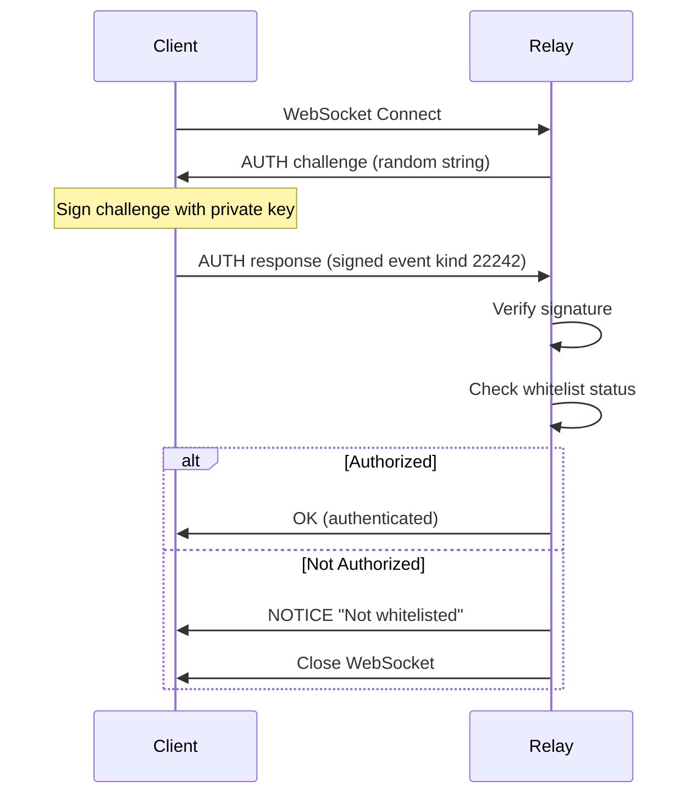
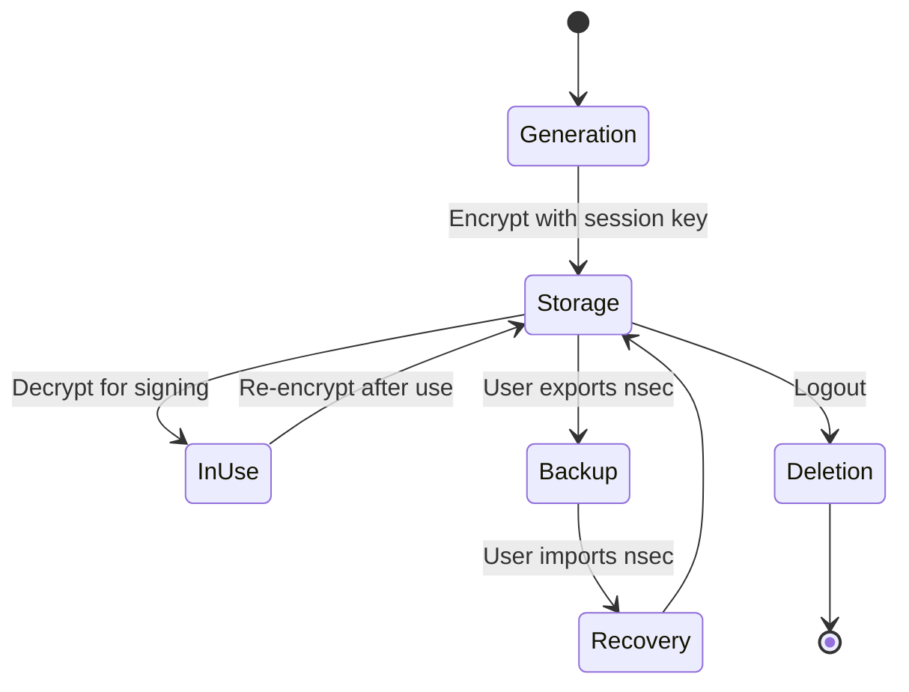

# Security Overview

**Last Updated:** 2026-01-25

This document provides a comprehensive overview of the security architecture implemented in the Fairfield community platform.

---

## Table of Contents

1. [Security Architecture](#security-architecture)
2. [Trust Model](#trust-model)
3. [Authentication Layer](#authentication-layer)
4. [Authorization & Access Control](#authorization--access-control)
5. [Encryption & Data Protection](#encryption--data-protection)
6. [Key Management](#key-management)
7. [Admin Security Hardening](#admin-security-hardening)
8. [Network Security](#network-security)
9. [Threat Model](#threat-model)
10. [Security Best Practices](#security-best-practices)

---

## Security Architecture

### Multi-Layer Defense

The platform implements defense-in-depth with the following layers:

```
┌─────────────────────────────────────────────────────────────┐
│ Layer 1: Identity & Authentication                          │
│ • NIP-07 browser extensions (hardware-backed keys)          │
│ • Nostr key pairs (secp256k1)                               │
│ • BIP-39 mnemonic recovery                                  │
└─────────────────────────────────────────────────────────────┘
                            ↓
┌─────────────────────────────────────────────────────────────┐
│ Layer 2: Authorization & Access Control                     │
│ • Relay-based whitelist verification                        │
│ • Cohort-based channel access                               │
│ • Rate limiting with exponential backoff                    │
│ • Request signing for admin operations                      │
└─────────────────────────────────────────────────────────────┘
                            ↓
┌─────────────────────────────────────────────────────────────┐
│ Layer 3: Data Protection                                    │
│ • NIP-44 v2 encryption for DMs (XChaCha20-Poly1305)        │
│ • NIP-59 gift wrapping (sender anonymity)                   │
│ • AES-256-GCM for key storage                               │
│ • PBKDF2-SHA256 key derivation (600k iterations)           │
└─────────────────────────────────────────────────────────────┘
                            ↓
┌─────────────────────────────────────────────────────────────┐
│ Layer 4: Transport & Network                                │
│ • WebSocket Secure (WSS) - TLS 1.3                          │
│ • HTTPS for all web traffic                                 │
│ • Content Security Policy headers                           │
│ • Secure SameSite cookies                                   │
└─────────────────────────────────────────────────────────────┘
                            ↓
┌─────────────────────────────────────────────────────────────┐
│ Layer 5: Integrity                                          │
│ • Schnorr signatures on all events (BIP-340)                │
│ • Event ID verification (SHA-256 hash)                      │
│ • Signature verification before processing                   │
│ • Replay attack prevention (timestamps)                     │
└─────────────────────────────────────────────────────────────┘
```

### Security Principles

1. **Zero Trust**: Never trust client-side data; always verify server-side
2. **Defense in Depth**: Multiple security layers to prevent single point of failure
3. **Principle of Least Privilege**: Users only get minimum necessary permissions
4. **Privacy by Design**: E2E encryption for sensitive communications
5. **Cryptographic Identity**: Public key-based authentication, no passwords

---

## Trust Model

### Trust Boundaries

```
┌─────────────────────────────────────────────────────────────┐
│  CLIENT DEVICE (Fully Trusted)                              │
│  • Private keys never leave device                          │
│  • Decrypted messages stored locally                        │
│  • Session encryption keys in sessionStorage               │
│  • User controls all cryptographic operations               │
└───────────────────────────┬─────────────────────────────────┘
                            │ WSS (TLS 1.3)
                            │ • Encrypted transport
                            │ • Certificate validation
┌───────────────────────────▼─────────────────────────────────┐
│  RELAY SERVER (Partially Trusted)                           │
│  • Can read public channel messages                         │
│  • Cannot decrypt DMs (NIP-44 encrypted)                    │
│  • Enforces whitelist access control                        │
│  • May log metadata (timestamps, pubkeys)                   │
│  • Assumes: relay may be compromised or malicious           │
└───────────────────────────┬─────────────────────────────────┘
                            │
┌───────────────────────────▼─────────────────────────────────┐
│  DATABASE (Untrusted)                                       │
│  • Stores encrypted DMs as opaque blobs                     │
│  • Stores plaintext public channel messages                 │
│  • No access to private keys                                │
│  • Metadata indexed for search                              │
└─────────────────────────────────────────────────────────────┘
```

### Threat Assumptions

- **Client Device**: Trusted, but may be lost or stolen
- **Network**: Untrusted; assume passive and active attackers
- **Relay**: Semi-trusted; may be compromised, log data, or act maliciously
- **Database**: Untrusted; treats as read-only storage for encrypted blobs

---

## Authentication Layer

### 1. NIP-07 Browser Extension Authentication

**Preferred Method**: Uses hardware-backed keys when available.

**Supported Extensions:**
- Alby (hardware security module support)
- nos2x
- Nostore
- Flamingo

**Flow:**
```typescript
// src/lib/nostr/nip07.ts
export async function loginWithExtension(): Promise<{ publicKey: string }> {
  // 1. Detect extension
  if (!window.nostr) {
    throw new Error('No NIP-07 extension found');
  }

  // 2. Request public key (triggers user prompt)
  const publicKey = await window.nostr.getPublicKey();

  // 3. Validate format (64 hex chars)
  if (!/^[0-9a-f]{64}$/i.test(publicKey)) {
    throw new Error('Invalid public key format');
  }

  // 4. Store session (no private key stored)
  localStorage.setItem(STORAGE_KEY, JSON.stringify({
    publicKey,
    isNip07: true,
    extensionName: getExtensionName(),
    nsecBackedUp: true
  }));

  return { publicKey };
}
```

**Security Benefits:**
- Private key never exposed to application
- Hardware security module support (YubiKey, etc.)
- User approval required for each signing operation
- Key remains in extension's secure storage

### 2. Key-Based Authentication (Fallback)

When NIP-07 extension is unavailable, users can login with nsec (private key).

**Key Generation:**
```typescript
// Uses BIP-39 for recovery
import { generateMnemonic, mnemonicToSeed } from '@scure/bip39';
import { HDKey } from '@scure/bip32';

// Generate 12-word mnemonic (128 bits entropy)
const mnemonic = generateMnemonic(wordlist, 128);

// Derive keys using NIP-06 path: m/44'/1237'/0'/0/0
const seed = await mnemonicToSeed(mnemonic);
const hdKey = HDKey.fromMasterSeed(seed);
const derived = hdKey.derive("m/44'/1237'/0'/0/0");

const privateKey = bytesToHex(derived.privateKey);
const publicKey = getPublicKey(privateKey);
```

**Session Key Encryption:**
- Private key encrypted with **session-specific key**
- Session key stored in `sessionStorage` (cleared on tab close)
- Encrypted private key in `localStorage`
- Re-authentication required on new session

### 3. NIP-42 Relay Authentication

**Challenge-Response Authentication:**



**Implementation:**
```typescript
// src/lib/stores/auth.ts
const authEvent = {
  kind: 22242,
  created_at: Math.floor(Date.now() / 1000),
  tags: [
    ['relay', relay.url],
    ['challenge', challenge]
  ],
  content: ''
};

// Sign with user's private key
const signedEvent = finalizeEvent(authEvent, privateKey);
```

---

## Authorization & Access Control

### 1. Whitelist-Based Access

**Primary Access Control**: Only whitelisted public keys can connect to relay.

**Verification Flow:**
```typescript
// Always verify server-side
const status = await verifyWhitelistStatus(userPubkey);

if (!status.isWhitelisted) {
  // Deny access
  throw new Error('User not whitelisted');
}

// Check cohort access
if (!status.cohorts.includes(requiredCohort)) {
  throw new Error('Insufficient permissions');
}
```

**Critical Security Rule:**
> **NEVER** rely solely on client-side stores for authorization.
> Always verify with relay via `verifyWhitelistStatus()`.

### 2. Cohort-Based Permissions

| Cohort | Access Level | Channels | Permissions |
|--------|--------------|----------|-------------|
| `admin` | Full | All | Manage users, channels, content |
| `approved` | Standard | Zone-specific | Read, post, react |
| `business` | Business | DreamLab | Business-specific features |
| `moomaa-tribe` | Community | Minimoonoir | Community channels |

**Cohort Assignment Rules:**
- Only admins can modify cohorts
- Users cannot self-assign `admin` cohort
- Admins cannot remove their own admin status
- Cohort changes require signed requests

### 3. Rate Limiting

**Exponential Backoff Configuration:**

```typescript
const RATE_LIMIT_CONFIG = {
  sectionAccessRequest: {
    maxAttempts: 5,
    windowMs: 60000,           // 1 minute
    backoffMultiplier: 2,
    maxBackoffMs: 300000       // 5 minutes max
  },
  cohortChange: {
    maxAttempts: 3,
    windowMs: 3600000,         // 1 hour
    backoffMultiplier: 3,
    maxBackoffMs: 86400000     // 24 hours max
  },
  adminAction: {
    maxAttempts: 10,
    windowMs: 60000,
    backoffMultiplier: 1.5,
    maxBackoffMs: 60000
  }
};
```

**Backoff Calculation:**
```
Backoff = min(windowMs × multiplier^failures, maxBackoffMs)

Example (cohortChange):
- Attempt 1: Immediate
- Attempt 2-3: After 1 hour
- Attempt 4: 3 hours backoff
- Attempt 5: 9 hours backoff
- Attempt 6+: 24 hours backoff (capped)
```

---

## Encryption & Data Protection

### 1. NIP-44 v2 Encryption (Direct Messages)

**Algorithm**: XChaCha20-Poly1305 with HMAC-SHA256

**Properties:**
- **Authenticated Encryption**: AEAD guarantees authenticity and confidentiality
- **Forward Secrecy**: No (requires key rotation protocol)
- **Key Derivation**: ECDH + HKDF for shared secrets
- **Padding**: Calculates padding to hide message length

**Encryption Process:**
```typescript
// src/lib/nostr/encryption.ts
import { nip44 } from 'nostr-tools';

function encryptMessage(
  plaintext: string,
  senderPrivkey: Uint8Array,
  recipientPubkey: string
): string {
  // 1. Derive shared secret via ECDH
  const conversationKey = nip44.v2.utils.getConversationKey(
    senderPrivkey,
    recipientPubkey
  );

  // 2. Encrypt with authenticated encryption
  const ciphertext = nip44.v2.encrypt(plaintext, conversationKey);

  return ciphertext; // base64-encoded
}
```

**Decryption:**
```typescript
function decryptMessage(
  ciphertext: string,
  recipientPrivkey: Uint8Array,
  senderPubkey: string
): string | null {
  try {
    const conversationKey = nip44.v2.utils.getConversationKey(
      recipientPrivkey,
      senderPubkey
    );

    return nip44.v2.decrypt(ciphertext, conversationKey);
  } catch {
    return null; // Decryption failed
  }
}
```

### 2. NIP-59 Gift Wrapping (Metadata Protection)

**Purpose**: Hide sender identity and timestamp from relay.

**Wrapping Process:**
```typescript
// 1. Create rumor (unsigned event with actual content)
const rumor = {
  kind: 14,  // Private DM
  content: encryptedContent,
  tags: [['p', recipient]],
  created_at: actualTimestamp
};

// 2. Wrap in seal (signed by sender)
const seal = {
  kind: 13,
  content: JSON.stringify(rumor),
  created_at: randomTimestamp(),
  // ...signed by sender
};

// 3. Wrap in gift wrap (encrypted for recipient with random key)
const giftWrap = {
  kind: 1059,
  pubkey: randomPubkey(),  // Random ephemeral key
  content: encrypt(seal, ephemeralKey, recipientPubkey),
  created_at: randomTimestamp(),
  tags: [['p', recipient]]
};
```

**Security Properties:**
- Relay cannot identify sender
- Relay cannot determine actual timestamp
- Only recipient can unwrap
- Ephemeral keys provide plausible deniability

### 3. Key Storage Encryption

**AES-256-GCM with PBKDF2:**

```typescript
// src/lib/utils/key-encryption.ts
const PBKDF2_ITERATIONS = 600000;  // OWASP 2023 recommendation

async function encryptPrivateKey(
  privateKey: string,
  sessionKey: string
): Promise<string> {
  // 1. Generate random salt and IV
  const salt = crypto.getRandomValues(new Uint8Array(16));
  const iv = crypto.getRandomValues(new Uint8Array(12));

  // 2. Derive encryption key
  const key = await deriveKey(sessionKey, salt);

  // 3. Encrypt with AES-GCM
  const ciphertext = await crypto.subtle.encrypt(
    { name: 'AES-GCM', iv },
    key,
    new TextEncoder().encode(privateKey)
  );

  // 4. Return salt + iv + ciphertext (base64)
  return btoa(String.fromCharCode(
    ...salt, ...iv, ...new Uint8Array(ciphertext)
  ));
}
```

**Storage Locations:**
- **sessionStorage**: Session encryption key (cleared on tab close)
- **localStorage**: Encrypted private key (persistent but encrypted)
- **IndexedDB**: Not currently used for keys

---

## Key Management

### Key Lifecycle



### 1. Key Generation

**Primary Method**: Browser entropy via Web Crypto API

```typescript
// Generate 32 bytes of cryptographically secure randomness
const privateKeyBytes = crypto.getRandomValues(new Uint8Array(32));
const privateKey = bytesToHex(privateKeyBytes);
const publicKey = getPublicKey(privateKey);
```

**Recovery Method**: BIP-39 mnemonic (12 words)

### 2. Key Storage

**Session-Based Encryption:**
- Session key generated on page load
- Stored in `sessionStorage` (memory-backed, cleared on tab close)
- Private key encrypted with session key before storage

**PWA Persistent Storage:**
- For installed PWAs, keys can persist across sessions
- Still encrypted, but uses device-bound encryption
- User must unlock after restart

### 3. Key Backup

**nsec Format**: Bech32-encoded private key (NIP-19)

```typescript
import { nip19 } from 'nostr-tools';

// Encode for backup
const nsec = nip19.nsecEncode(privateKeyHex);
// nsec1... (63 chars)

// Decode for recovery
const { type, data } = nip19.decode(nsec);
if (type === 'nsec') {
  const privateKey = data; // hex string
}
```

**Security Warning Shown to Users:**
> Your nsec is your master key. Anyone with access to it can:
> - Impersonate you
> - Read your encrypted messages
> - Post as you
>
> Never share it. Store it securely offline.

### 4. Key Rotation

**Not Currently Implemented** - Nostr protocol limitation.

**Future Considerations:**
- Implement key rotation protocol (separate spec)
- Maintain backward compatibility for old messages
- Require social proof for identity migration

---

## Admin Security Hardening

See detailed documentation: [Admin Security](./admin-security.md)

### Key Features

1. **NIP-51 Pin List Signature Verification**
   - Validates Schnorr signatures on admin pin lists
   - Prevents tampering with pinned messages
   - Checks timestamp freshness (< 24 hours)

2. **Signed Admin Requests**
   - All privileged operations require cryptographic signatures
   - Includes nonce to prevent replay attacks
   - 5-minute signature validity window

3. **Suspicious Activity Logging**
   - Tracks authorization failures
   - Records invalid signatures
   - Logs rate limit violations
   - Stored in sessionStorage for admin review

4. **Cohort Assignment Validation**
   - Server-side verification of admin status
   - Prevents self-assignment of admin cohort
   - Ensures at least one admin remains

---

## Network Security

### 1. Transport Layer

**WebSocket Secure (WSS):**
- TLS 1.3 for relay connections
- Certificate validation enforced
- No downgrade to plain WS

**HTTPS:**
- All web assets served over HTTPS
- HSTS headers configured
- Secure cookie flags

### 2. Content Security Policy

```http
Content-Security-Policy:
  default-src 'self';
  script-src 'self' 'wasm-unsafe-eval';
  style-src 'self' 'unsafe-inline';
  img-src 'self' data: https:;
  connect-src 'self' wss://*.nostr.com wss://*.relay.net;
  frame-ancestors 'none';
  base-uri 'self';
  form-action 'self';
```

### 3. HTTP Security Headers

```http
Strict-Transport-Security: max-age=31536000; includeSubDomains
X-Content-Type-Options: nosniff
X-Frame-Options: DENY
X-XSS-Protection: 1; mode=block
Referrer-Policy: strict-origin-when-cross-origin
Permissions-Policy: camera=(), microphone=(), geolocation=()
```

---

## Threat Model

### Threat Analysis

| Threat | Likelihood | Impact | Mitigation | Residual Risk |
|--------|-----------|--------|------------|---------------|
| **Key Theft** | Medium | Critical | Session encryption, PWA secure storage | Low |
| **MITM Attack** | Low | High | TLS 1.3, certificate pinning | Very Low |
| **Relay Compromise** | Medium | Medium | E2E encryption for DMs, no sensitive storage | Low |
| **Replay Attack** | Medium | Medium | Timestamp validation, nonce checking | Low |
| **Phishing** | High | Critical | User education, domain verification | Medium |
| **XSS** | Low | High | CSP, content sanitization, DOMPurify | Very Low |
| **CSRF** | Low | Medium | SameSite cookies, signed requests | Very Low |
| **Brute Force** | Medium | Medium | Rate limiting, exponential backoff | Low |
| **Social Engineering** | High | Critical | User education, multi-factor warnings | Medium |

### Attack Scenarios

#### Scenario 1: Compromised Relay

**Attack**: Relay server is compromised by attacker.

**Impact:**
- Attacker can read all public channel messages
- Attacker can log metadata (who talks to whom)
- Attacker **cannot** read encrypted DMs (NIP-44 protected)

**Mitigation:**
- Use E2E encryption for sensitive communications
- Users can switch to different relays
- Multi-relay support distributes trust

#### Scenario 2: Stolen Device

**Attack**: User's device is stolen or lost.

**Impact:**
- Attacker may access session if device unlocked
- PWA persistent auth may allow access

**Mitigation:**
- Session keys expire
- Device lock screen required
- Remote logout capability (future)

#### Scenario 3: Malicious Browser Extension

**Attack**: User installs malicious browser extension.

**Impact:**
- Extension can read localStorage/sessionStorage
- Extension can intercept decrypted messages

**Mitigation:**
- No complete defense against malicious extensions
- User education: only install trusted extensions
- Hardware-backed NIP-07 extensions preferred

---

## Security Best Practices

### For Developers

1. **Never Log Sensitive Data**
   ```typescript
   // ❌ WRONG
   console.log('Private key:', privateKey);

   // ✅ CORRECT
   console.log('Private key present:', !!privateKey);
   ```

2. **Always Verify Server-Side**
   ```typescript
   // ❌ WRONG - Client-side only
   if ($isAdmin) { showAdminPanel(); }

   // ✅ CORRECT - Server verification
   const status = await verifyWhitelistStatus(pubkey);
   if (status.isAdmin) { showAdminPanel(); }
   ```

3. **Validate All Inputs**
   ```typescript
   function validatePubkey(pubkey: string): boolean {
     return /^[0-9a-f]{64}$/i.test(pubkey);
   }
   ```

4. **Sanitize Display Content**
   ```typescript
   import DOMPurify from 'isomorphic-dompurify';

   const safeHTML = DOMPurify.sanitize(userContent);
   ```

### For Users

1. **Protect Your nsec**
   - Never share your nsec with anyone
   - Store backup offline (paper, hardware wallet)
   - Use password manager for secure storage

2. **Use NIP-07 Extensions**
   - Prefer Alby or nos2x over nsec login
   - Hardware key support (YubiKey) when available

3. **Enable Device Security**
   - Use device lock screen
   - Enable biometric authentication
   - Use separate device for high-value keys

4. **Verify Extension Authenticity**
   - Install from official browser stores only
   - Check developer signatures
   - Read reviews and audit reports

---

## Security Audit & Compliance

### Internal Security Reviews

- Last full audit: 2026-01-16
- High-severity issues: 2 (resolved)
- Medium-severity issues: 1 (resolved)

### Compliance

- **GDPR**: User data portability via Nostr events
- **CCPA**: Data deletion via event deletion requests
- **SOC 2**: Not currently certified

### Vulnerability Disclosure

See [VULNERABILITY_MANAGEMENT.md](./VULNERABILITY_MANAGEMENT.md) for reporting process.

---

## Related Documentation

- [Authentication Flow](./AUTHENTICATION.md)
- [Data Protection](./DATA_PROTECTION.md)
- [Vulnerability Management](./VULNERABILITY_MANAGEMENT.md)
- [Admin Security](./admin-security.md)
- [Architecture Security Model](../developer/architecture/security.md)

---

**Security Contact**: security@fairfield.community (not yet configured)
**PGP Key**: (to be published)

---

*This document is version-controlled and updated regularly. Last major revision: 2026-01-25.*
