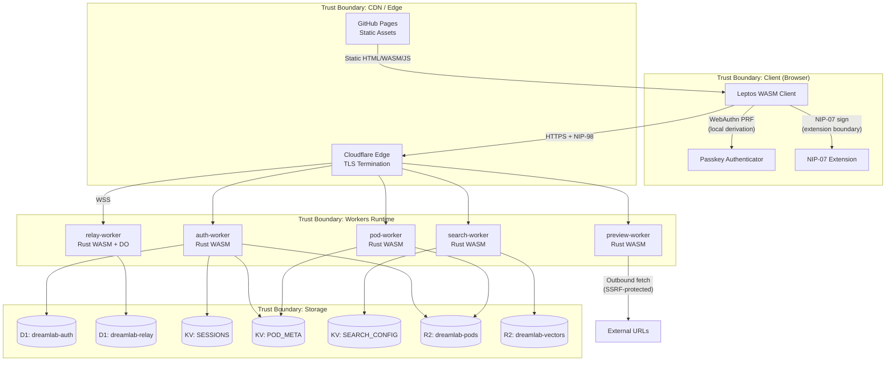
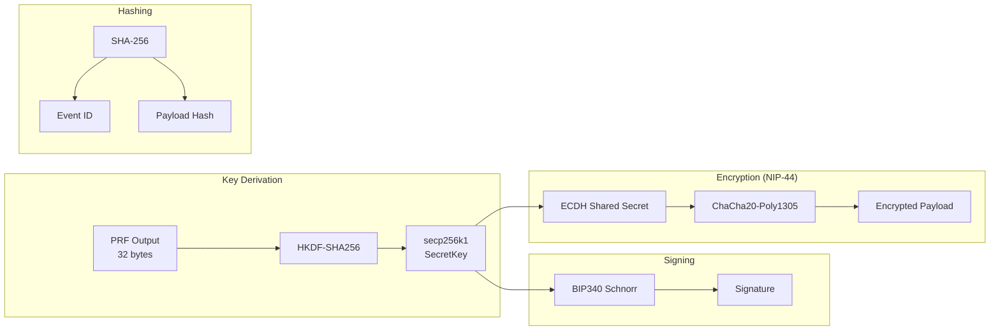
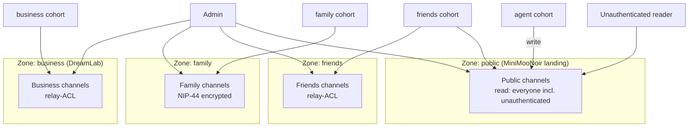

# Security Overview -- DreamLab Community Forum (Rust Port)

**Last updated:** 2026-03-16 | [Back to Documentation Index](../README.md)

---

## Table of Contents

- [Threat Model](#threat-model)
- [Compile-Time Safety](#compile-time-safety)
- [Cryptographic Stack](#cryptographic-stack)
- [Zone-Based Access Control](#zone-based-access-control)
- [CORS Configuration](#cors-configuration)
- [Input Validation Limits](#input-validation-limits)
- [SSRF Protection](#ssrf-protection)
- [Dependency Policy](#dependency-policy)
- [Admin Identity](#admin-identity)
- [Related Documents](#related-documents)

---

## Threat Model

The following diagram shows the trust boundaries, data flows, and attack surfaces across the DreamLab forum architecture. Every arrow crossing a trust boundary is a point where authentication, authorization, or validation must occur.


```mermaid
graph TB
    subgraph "Trust Boundary: Client (Browser)"
        CLIENT[Leptos WASM Client]
        PASSKEY[Passkey Authenticator]
        NIP07[NIP-07 Extension]
    end

    subgraph "Trust Boundary: CDN / Edge"
        PAGES[GitHub Pages<br/>Static Assets]
        CF_EDGE[Cloudflare Edge<br/>TLS Termination]
    end

    subgraph "Trust Boundary: Workers Runtime"
        AUTH_W[auth-worker<br/>Rust WASM]
        POD_W[pod-worker<br/>Rust WASM]
        PREVIEW_W[preview-worker<br/>Rust WASM]
        RELAY_W[relay-worker<br/>Rust WASM + DO]
        SEARCH_W[search-worker<br/>Rust WASM]
    end

    subgraph "Trust Boundary: Storage"
        D1_AUTH[(D1: dreamlab-auth)]
        D1_RELAY[(D1: dreamlab-relay)]
        KV_SESSIONS[(KV: SESSIONS)]
        KV_POD_META[(KV: POD_META)]
        KV_SEARCH[(KV: SEARCH_CONFIG)]
        R2_PODS[(R2: dreamlab-pods)]
        R2_VECTORS[(R2: dreamlab-vectors)]
    end

    CLIENT -- "WebAuthn PRF\n(local derivation)" --> PASSKEY
    CLIENT -- "NIP-07 sign\n(extension boundary)" --> NIP07
    CLIENT -- "HTTPS + NIP-98" --> CF_EDGE
    CF_EDGE --> AUTH_W
    CF_EDGE --> POD_W
    CF_EDGE --> PREVIEW_W
    CF_EDGE -- "WSS" --> RELAY_W
    CF_EDGE --> SEARCH_W
    AUTH_W --> D1_AUTH
    AUTH_W --> KV_SESSIONS
    AUTH_W --> KV_POD_META
    AUTH_W --> R2_PODS
    POD_W --> R2_PODS
    POD_W --> KV_POD_META
    RELAY_W --> D1_RELAY
    SEARCH_W --> R2_VECTORS
    SEARCH_W --> KV_SEARCH
    PREVIEW_W -- "Outbound fetch\n(SSRF-protected)" --> EXTERNAL[External URLs]
    PAGES -- "Static HTML/WASM/JS" --> CLIENT
```

### Key Threats and Mitigations

| Threat | Attack Surface | Mitigation |
|--------|---------------|------------|
| Key theft | Client memory | PRF-derived key held in `Option<SecretKey>`, zeroized on `pagehide` |
| Event ID spoofing | Relay ingestion | Server recomputes ID from NIP-01 canonical form |
| Signature forgery | NIP-98 headers | Schnorr verification via `k256` (NCC-audited) |
| Replay attacks | All Workers | Timestamp drift check (60s for NIP-98, 7d for events) |
| SSRF | preview-worker | Private/loopback/metadata IP blocklist |
| Unauthorized writes | Relay, pod-worker | Whitelist check (relay), WAC ACL check (pod) |
| Cross-site request | All Workers | Per-request origin validation, no wildcards |

---

## Compile-Time Safety

All crates enforce `#![deny(unsafe_code)]` at the crate root. The Rust ownership model eliminates use-after-free, double-free, and data races at compile time. No `unsafe` blocks are permitted; any required FFI boundary (e.g., `wasm-bindgen`) uses safe wrapper types generated by the bindgen toolchain.

---

## Cryptographic Stack


```mermaid
graph LR
    subgraph "Key Derivation"
        PRF[PRF Output<br/>32 bytes] --> HKDF_OP[HKDF-SHA256]
        HKDF_OP --> SK[secp256k1<br/>SecretKey]
    end

    subgraph "Signing"
        SK --> SCHNORR[BIP340 Schnorr]
        SCHNORR --> SIG[Signature]
    end

    subgraph "Encryption (NIP-44)"
        SK --> ECDH[ECDH Shared Secret]
        ECDH --> CHACHA[ChaCha20-Poly1305]
        CHACHA --> CIPHERTEXT[Encrypted Payload]
    end

    subgraph "Hashing"
        SHA[SHA-256] --> EVENT_ID[Event ID]
        SHA --> PAYLOAD_HASH[Payload Hash]
    end
```

| Operation | Crate | Version | Audit Status | Notes |
|-----------|-------|---------|-------------|-------|
| secp256k1 / BIP340 Schnorr | `k256` | 0.13.x | NCC Group audited | ECDH for NIP-44 key agreement |
| NIP-44 AEAD cipher | `chacha20poly1305` | 0.10.x | NCC Group audited (RustCrypto) | XChaCha20-Poly1305 variant |
| HKDF key derivation | `hkdf` | 0.12.x | RustCrypto, pure Rust | PRF output to secp256k1 key |
| HMAC | `hmac` | 0.12.x | RustCrypto, pure Rust | Used by HKDF internally |
| SHA-256 hashing | `sha2` | 0.10.x | RustCrypto, pure Rust | Event IDs, payload hashes |
| CSPRNG for WASM | `getrandom` | 0.2.x | Delegates to Web Crypto | **Must** enable `js` feature flag |
| Secret zeroization | `zeroize` | 1.x | RustCrypto, pure Rust | Zeroes key material on drop |

The `getrandom` crate requires `features = ["js"]` in every crate's `Cargo.toml` that targets `wasm32-unknown-unknown`. Without this feature, any call to `getrandom::getrandom()` panics at runtime in the browser or Workers environment. This is enforced by a CI check that greps all workspace `Cargo.toml` files.

---

## Zone-Based Access Control

The forum implements 4 access zones, authored in `forum-config/dreamlab.toml` `[[zones]]` and enforced at two layers: the relay (`ZONE_CONFIG` cohort gates in `trust.rs::has_zone_access` / `has_zone_write_access`, deny-by-default) and the client (zone tiles from `window.__ENV__.ZONE_CONFIG`; locked zones render as visible-but-locked tiles).


```mermaid
graph TB
    subgraph "Zone: public (MiniMooNoir landing)"
        PL["Public channels<br/>read: everyone incl. unauthenticated"]
    end

    subgraph "Zone: friends"
        FR["Friends channels<br/>relay-ACL"]
    end

    subgraph "Zone: family"
        FA["Family channels<br/>NIP-44 encrypted"]
    end

    subgraph "Zone: business (DreamLab)"
        BU["Business channels<br/>relay-ACL"]
    end

    ANON[Unauthenticated reader] --> PL
    USER_FR[friends cohort] --> PL
    USER_FR --> FR
    USER_FA[family cohort] --> FA
    USER_BU[business cohort] --> BU
    USER_AG[agent cohort] -- write --> PL
    USER_ADMIN[Admin] --> PL
    USER_ADMIN --> FR
    USER_ADMIN --> FA
    USER_ADMIN --> BU
```

| Zone | Visibility | Write Access | Enforcement Layer |
|------|-----------|-------------|-------------------|
| public | Everyone (incl. unauthenticated) | `friends`, `agent`, admin | Relay `ZONE_CONFIG` write gate + client |
| friends | `friends` cohort, admin | `friends`, admin | Relay `ZONE_CONFIG` + client locked tile |
| family | `family` cohort, admin | `family`, admin | Relay `ZONE_CONFIG` + NIP-44 + client locked tile |
| business | `business` cohort, admin | `business`, admin | Relay `ZONE_CONFIG` + client locked tile |

---

## CORS Configuration

Allowed origins for all Workers, validated per-request. Wildcard origins are never used.

| Origin | Environment |
|--------|-------------|
| `https://dreamlab-ai.com` | Production |
| `https://thedreamlab.uk` | Alternate domain |
| `https://dreamlab-ai.github.io` | GitHub Pages |
| `http://localhost:5173` | Vite dev server |
| `http://localhost:5174` | Alternate dev port |
| `http://localhost:8080` | Trunk dev server (Leptos) |

---

## Input Validation Limits

All Worker request boundaries use `serde` for deserialization (compile-time schema enforcement) and `validator` for runtime constraint checking (string length, regex patterns, numeric ranges). Invalid input is rejected with structured JSON error responses before any business logic executes.

### Relay Limits

| Parameter | Limit |
|-----------|-------|
| Max content size | 64 KB (8 KB for registration events) |
| Max tag count | 2,000 |
| Max tag value size | 1,024 bytes |
| Max timestamp drift | 7 days |
| Rate limit | 10 events/second per IP |
| Max connections | 20 per IP |
| Max subscriptions | 20 per WebSocket |

### Auth Worker Limits

| Parameter | Limit |
|-----------|-------|
| Display name length | 1--64 characters |
| Pubkey format | Exactly 64 hex characters |
| Challenge TTL | 5 minutes |
| NIP-98 token max size | 64 KB |
| NIP-98 timestamp drift | 60 seconds |

### Pod Worker Limits

| Parameter | Limit |
|-----------|-------|
| Max upload size | 50 MB |
| Path depth | 10 segments |
| Path character set | Alphanumeric, `-`, `_`, `.`, `/` |

---

## SSRF Protection

The preview-worker (link-preview) validates all target URLs before fetching:

- **Protocol whitelist**: Only `http:` and `https:` schemes allowed
- **IP blocklist**: Private (RFC 1918), loopback (127.0.0.0/8), link-local (169.254.0.0/16), and cloud metadata (169.254.169.254) ranges
- **Obfuscation detection**: Integer and hex IP encoding formats are explicitly blocked
- **Redirect following**: Limited to 3 hops; each hop re-validated against the blocklist
- **Response size**: Capped at 1 MB to prevent memory exhaustion
- **Timeout**: 5-second fetch timeout per request

---

## Dependency Policy

- All crate versions are pinned in `Cargo.lock` (committed to repository)
- `nostr-sdk` 0.44.x is alpha -- pinned to exact patch versions
- `cargo audit` runs in CI on every push
- `cargo clippy -- -D warnings` must pass with zero warnings
- No `unsafe` code permitted in any workspace crate
- `getrandom` must have `features = ["js"]` in all WASM-targeting crates (CI-enforced)

---

## Admin Identity

Admin status resolves as **static (`ADMIN_PUBKEYS`) ∪ D1** in the deployed kit (`nostr-bbs-auth-worker/src/admin.rs::is_admin`). The first-user-is-admin bootstrap remains for fresh D1 state (`GET /api/setup-status` reports `needsSetup` when no `is_admin=1` row exists), and `workers-deploy.yml` blocks the auth-worker deploy if the `ADMIN_PUBKEYS` secret is unset. The primary admin pubkey is:

```
11ed64225dd5e2c5e18f61ad43d5ad9272d08739d3a20dd25886197b0738663c
```

Admin status is checked in three layers:
1. **Static set**: `ADMIN_PUBKEYS` env (mirrors `dreamlab.toml [admin].static_pubkeys`; deploy-gated, checked first)
2. **D1 path**: `whitelist.is_admin` (relay D1 via `RELAY_DB`), then `members.is_admin` (auth D1)
3. **Promotion**: `/api/whitelist/set-admin` endpoint for admin promotion/demotion (last-admin demotion is blocked)

Note: the search-worker honours only its own `ADMIN_PUBKEYS` `[vars]` value — D1-promoted admins are not visible to it (known gap; see the forum-flow cartography Gap 2).

---

## Related Documents

| Document | Description |
|----------|-------------|
| [Authentication](AUTHENTICATION.md) | Passkey PRF flow, NIP-98, session management |
| [Auth API](../api/AUTH_API.md) | WebAuthn + NIP-98 endpoints |
| [Pod API](../api/POD_API.md) | Solid pod storage + WAC ACL |
| [Nostr Relay](../api/NOSTR_RELAY.md) | WebSocket relay protocol |
| [Deployment Overview](../deployment/README.md) | CI/CD, environments, DNS |
