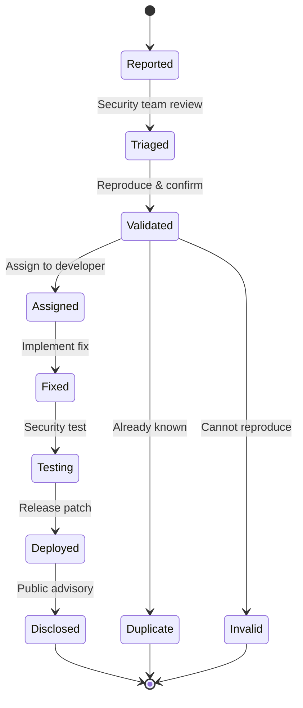
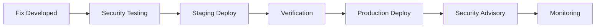
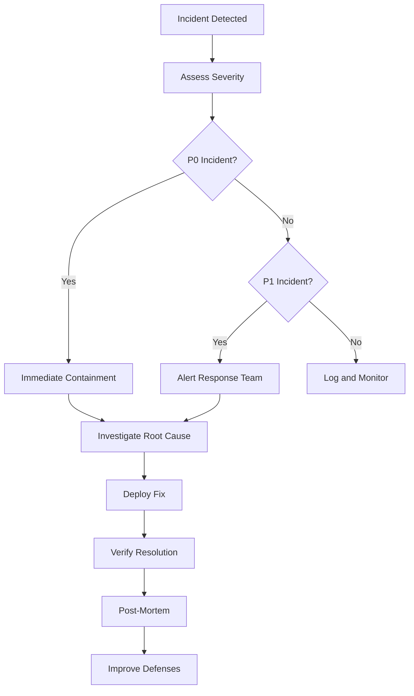

# Vulnerability Management & Disclosure

**Last Updated:** 2026-01-25

This document outlines the vulnerability reporting process, patch management, and security incident response procedures for the DreamLab platform.

---

## Table of Contents

1. [Reporting Vulnerabilities](#reporting-vulnerabilities)
2. [Severity Classification](#severity-classification)
3. [Response Timeline](#response-timeline)
4. [Patch Management](#patch-management)
5. [Security Advisories](#security-advisories)
6. [Bug Bounty Program](#bug-bounty-program)
7. [Incident Response](#incident-response)
8. [Known Vulnerabilities](#known-vulnerabilities)

---

## Reporting Vulnerabilities

### How to Report

**Preferred Method**: Email encrypted report to security team.

```
Email: security@dreamlab-ai.com (to be configured)
PGP Key: [Key ID to be published]
Subject: [SECURITY] Brief description
```

**Alternative Methods**:
- GitHub Security Advisories (private disclosure)
- Direct message to core maintainers on Nostr

### What to Include

1. **Description**: Clear explanation of the vulnerability
2. **Impact**: Potential security impact and affected systems
3. **Reproduction**: Step-by-step instructions to reproduce
4. **Proof of Concept**: Code or screenshots (if applicable)
5. **Suggested Fix**: Proposed remediation (optional)
6. **Contact**: How we can reach you for updates

### Example Report

```markdown
## Vulnerability Report

**Type**: Authentication Bypass
**Severity**: High
**Affected Component**: Admin dashboard authorization

### Description
The admin statistics page uses client-side `$isAdmin` check without
server-side verification, allowing non-admin users to access admin
data by manipulating client-side state.

### Reproduction Steps
1. Login as non-admin user
2. Open browser DevTools
3. Execute: `localStorage.setItem('isAdmin', 'true')`
4. Navigate to /admin/stats
5. Admin statistics are visible

### Impact
Non-admin users can view sensitive statistics including:
- User registration data
- Message counts per channel
- Admin activity logs

### Suggested Fix
Replace client-side check with server-side verification:
```typescript
const status = await verifyWhitelistStatus(userPubkey);
if (!status.isAdmin) {
  goto('/events');
  return;
}
```

### Contact
researcher@example.com
```

---

## Severity Classification

### CVSS v3.1 Scale

We use Common Vulnerability Scoring System v3.1 for severity classification.

| Severity | CVSS Score | Response Time | Example |
|----------|-----------|---------------|---------|
| **Critical** | 9.0 - 10.0 | 24 hours | Remote code execution, private key exposure |
| **High** | 7.0 - 8.9 | 7 days | Authentication bypass, SQL injection |
| **Medium** | 4.0 - 6.9 | 30 days | XSS, information disclosure |
| **Low** | 0.1 - 3.9 | 90 days | Minor information leak, UI bugs |

### Severity Factors

**Attack Vector (AV)**:
- Network (N): Exploitable remotely
- Adjacent (A): Requires local network access
- Local (L): Requires local access
- Physical (P): Requires physical access

**Attack Complexity (AC)**:
- Low (L): Easy to exploit
- High (H): Requires specific conditions

**Privileges Required (PR)**:
- None (N): No authentication needed
- Low (L): Basic user account required
- High (H): Admin privileges required

**User Interaction (UI)**:
- None (N): Automatic exploitation
- Required (R): Requires user action

**Impact (CIA)**:
- Confidentiality: Data exposure
- Integrity: Data modification
- Availability: Service disruption

### Example Classifications

#### Critical: Private Key Exposure

```
CVSS:3.1/AV:N/AC:L/PR:N/UI:N/S:C/C:H/I:H/A:N
Score: 10.0

Description: Private keys stored unencrypted in localStorage
Impact: Complete account takeover, message decryption
```

#### High: Admin Authorization Bypass

```
CVSS:3.1/AV:N/AC:L/PR:L/UI:N/S:U/C:H/I:L/A:N
Score: 7.1

Description: Client-side admin check without server verification
Impact: Unauthorized access to admin functionality
```

#### Medium: XSS in Profile Display

```
CVSS:3.1/AV:N/AC:L/PR:L/UI:R/S:C/C:L/I:L/A:N
Score: 5.4

Description: Unsanitized user input in profile bio
Impact: Session hijacking, phishing
```

---

## Response Timeline

### SLA by Severity

| Severity | Acknowledge | Triage | Fix | Deploy | Public Disclosure |
|----------|-------------|--------|-----|--------|------------------|
| **Critical** | 4 hours | 8 hours | 24 hours | 48 hours | After patch + 7 days |
| **High** | 24 hours | 48 hours | 7 days | 14 days | After patch + 30 days |
| **Medium** | 3 days | 7 days | 30 days | 45 days | After patch + 60 days |
| **Low** | 7 days | 14 days | 90 days | Next release | After patch + 90 days |

### Response Workflow



---

## Patch Management

### Versioning

We follow Semantic Versioning with security indicators:

```
MAJOR.MINOR.PATCH-SECURITY

Examples:
- 1.2.3-sec1: First security patch for v1.2.3
- 1.2.4: Regular release
- 2.0.0: Major version (breaking changes)
```

### Backporting Policy

Security fixes are backported to:
- Current stable release
- Previous stable release (if within 6 months)
- LTS releases (if applicable)

### Patch Distribution



### Example Patch Release

```bash
# v1.2.3-sec1: Fix admin authorization bypass
git tag -a v1.2.3-sec1 -m "Security: Fix admin auth bypass (HIGH-002)"
git push origin v1.2.3-sec1

# Changelog
## [1.2.3-sec1] - 2026-01-16

### Security
- **HIGH-002**: Fixed admin authorization bypass in statistics page
  - Replaced client-side `$isAdmin` with server-side verification
  - Added `verifyWhitelistStatus()` to all admin routes
  - Users: Update immediately

### Changed
- All admin routes now verify authorization via relay
```

---

## Security Advisories

### Advisory Format

```markdown
# Security Advisory: [ID] - [Title]

**Published**: YYYY-MM-DD
**Severity**: [Critical/High/Medium/Low]
**CVSS Score**: X.X
**Affected Versions**: X.X.X - X.X.X
**Fixed Versions**: X.X.X

## Summary
Brief description of the vulnerability.

## Impact
What an attacker can do and what data/systems are at risk.

## Affected Components
- Component 1
- Component 2

## Mitigation
Immediate steps users can take before patching.

## Fix
Description of the implemented fix.

## Credits
- Reporter Name (@handle) - Responsible disclosure
- Patcher Name - Fix implementation

## Timeline
- YYYY-MM-DD: Reported
- YYYY-MM-DD: Confirmed
- YYYY-MM-DD: Fix deployed
- YYYY-MM-DD: Public disclosure

## References
- CVE-YYYY-XXXXX
- Commit: <hash>
- Pull Request: #XXX
```

### Distribution Channels

1. **GitHub Security Advisories**
2. **Project Documentation** (`/docs/security/advisories/`)
3. **Nostr Announcement** (kind 1 event with 'security' tag)
4. **Email Notification** (if user opted in)

---

## Bug Bounty Program

**Status**: Not yet implemented

### Planned Rewards

| Severity | Reward Range | Notes |
|----------|-------------|-------|
| **Critical** | $500 - $2000 | Private key exposure, RCE |
| **High** | $200 - $500 | Auth bypass, injection |
| **Medium** | $50 - $200 | XSS, CSRF |
| **Low** | Recognition | Minor issues |

### Eligibility

**In Scope**:
- Authentication and authorization
- Encryption implementation
- Admin security
- Client-side security (XSS, CSRF)
- API vulnerabilities

**Out of Scope**:
- Denial of Service (DoS)
- Social engineering
- Physical attacks
- Third-party relay issues
- Self-XSS requiring user interaction

### Rules

1. **No Harm**: Do not exploit vulnerabilities beyond proof-of-concept
2. **No Data Access**: Do not access other users' data
3. **Responsible Disclosure**: Report privately before public disclosure
4. **Legal Compliance**: Only test on systems you're authorized to test

---

## Incident Response

### Incident Classification

| Level | Description | Response Team | Escalation |
|-------|-------------|---------------|-----------|
| **P0** | Active exploitation, data breach | Full team | Immediate |
| **P1** | Critical vulnerability discovered | Security + DevOps | 1 hour |
| **P2** | High severity, no active exploit | Security team | 4 hours |
| **P3** | Medium severity | On-call engineer | 24 hours |

### Response Process



### P0 Incident Playbook

**Immediate Actions (first 15 minutes):**
1. Alert full response team
2. Enable incident logging
3. Preserve forensic evidence
4. Implement emergency containment

**Investigation (first hour):**
1. Identify affected systems
2. Determine exploit vector
3. Assess data exposure
4. Document timeline

**Resolution (first 24 hours):**
1. Deploy hotfix
2. Verify exploitation stopped
3. Notify affected users
4. Prepare public statement

**Post-Incident (first week):**
1. Complete post-mortem
2. Implement preventive measures
3. Update security documentation
4. Conduct team retrospective

---

## Known Vulnerabilities

### Currently Tracked

**None** (as of 2026-01-25)

### Resolved Vulnerabilities

#### HIGH-001: Admin Stats Authorization Bypass
- **Discovered**: 2026-01-15
- **Fixed**: 2026-01-16 (v1.2.3-sec1)
- **CVSS**: 7.1
- **Description**: Client-side `$isAdmin` check without server verification
- **Fix**: Implemented `verifyWhitelistStatus()` server-side validation

#### HIGH-002: Admin Calendar Authorization Bypass
- **Discovered**: 2026-01-15
- **Fixed**: 2026-01-16 (v1.2.3-sec1)
- **CVSS**: 7.1
- **Description**: Same issue as HIGH-001, different component
- **Fix**: Implemented `verifyWhitelistStatus()` server-side validation

#### MED-001: URL Injection in Whitelist API
- **Discovered**: 2026-01-15
- **Fixed**: 2026-01-16 (v1.2.3-sec1)
- **CVSS**: 5.3
- **Description**: Direct string interpolation in URL without validation
- **Fix**: Added input validation and `encodeURIComponent()`

---

## Security Testing

### Automated Testing

```typescript
// tests/security/auth-security.test.ts
describe('Admin Authorization', () => {
  it('should prevent non-admin access to admin pages', async () => {
    const nonAdminUser = await createTestUser({ isAdmin: false });

    const response = await request
      .get('/admin/stats')
      .set('Authorization', nonAdminUser.token);

    expect(response.status).toBe(403);
    expect(response.body.error).toContain('Admin access required');
  });
});
```

### Manual Security Checklist

- [ ] Authentication bypass testing
- [ ] Authorization privilege escalation
- [ ] SQL injection testing
- [ ] XSS vulnerability scanning
- [ ] CSRF token validation
- [ ] Rate limiting verification
- [ ] Input validation testing
- [ ] Output encoding verification
- [ ] Cryptographic implementation review
- [ ] Secure storage verification

---

## Compliance & Audits

### Internal Audits

- **Frequency**: Quarterly
- **Scope**: Full security review
- **Last Audit**: 2026-01-16
- **Next Audit**: 2026-04-16

### External Audits

**Status**: Not yet conducted

**Planned**: Annual third-party security audit

---

## Contact Information

### Security Team

```
Primary: security@fairfield.community (to be configured)
PGP: [Key ID to be published]
Response SLA: 24 hours for critical, 48 hours for others
```

### Emergency Contact

For active exploitation or data breach:
```
Phone: [To be configured]
Signal: [To be configured]
Available: 24/7
```

---

## Related Documentation

- [Security Overview](./SECURITY_OVERVIEW.md)
- [Authentication](./AUTHENTICATION.md)
- [Data Protection](./DATA_PROTECTION.md)
- [Admin Security](./admin-security.md)
- [Security Audit Report](./security-audit-report.md)

---

**Responsible Disclosure**: We follow a 90-day disclosure timeline after patch deployment, or shorter if the vulnerability is actively exploited.

**Hall of Fame**: Security researchers who responsibly disclose vulnerabilities will be credited in advisories and listed in our security acknowledgments (with permission).
