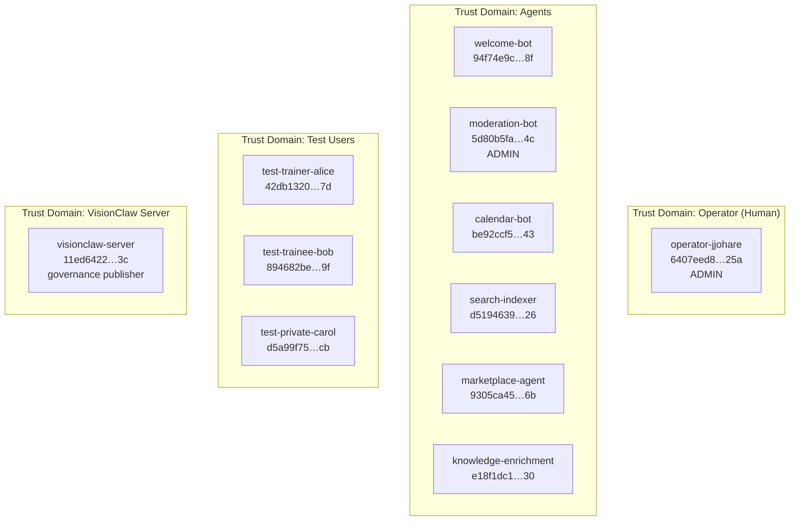
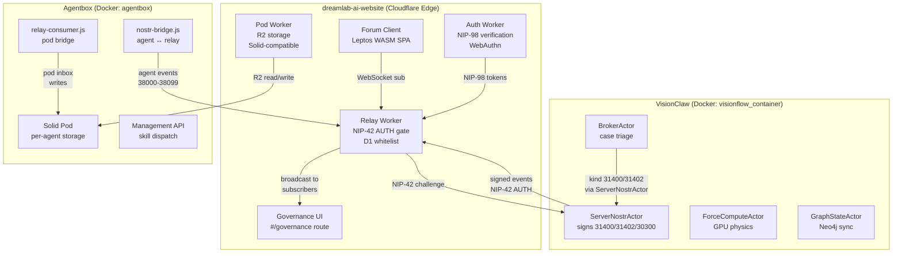
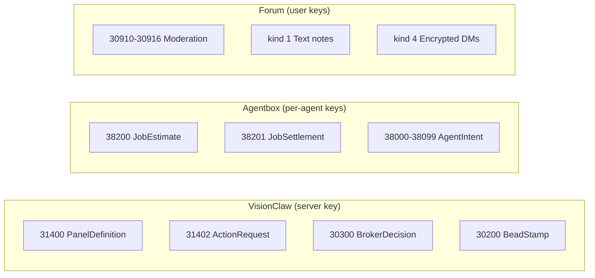

# DreamLab Forum Operator Overlay

This package is the **operator-specific overlay** sitting on top of the
generic `nostr-bbs-*` kit crates living in the `nostr-rust-forum` repo.

## What's here

| Path                                | Purpose                                                              |
|-------------------------------------|----------------------------------------------------------------------|
| `Cargo.toml`                        | Path-deps to `nostr-bbs-{core,config,mesh}` (kit crates)             |
| `dreamlab.toml`                     | Operator-supplied config consumed by `nostr_bbs_config::load_from_*` |
| `src/branding.rs`                   | DreamLab `BrandingConfig` populator (theme, logos, copy, zones)      |
| `src/workers.rs`                    | Per-worker entry shims (kit `dispatch` API not yet available)        |
| `deploy/<worker>.wrangler.toml`     | Preserved CF resource IDs for D2 zero-downtime route handover        |

## Identity roster

Three trust domains with distinct key material — no key is shared across domains.



### Agent identities

| Label | Pubkey (hex) | Role | Cohorts | Admin | Trust |
|-------|-------------|------|---------|-------|-------|
| `operator-jjohare` | `6407eed8…425a` | Human admin (Dr John O'Hare) | home, dreamlab, minimoonoir, approved | yes | 3 |
| `moderation-bot` | `5d80b5fa…4c4c` | Enforces zone rules, auto-hides spam | home, dreamlab, minimoonoir, agent | yes | 3 |
| `welcome-bot` | `94f74e9c…df8f` | Greets new members, issues invite credits | home, dreamlab, minimoonoir, agent | no | 3 |
| `calendar-bot` | `be92ccf5…f243` | NIP-52 event scheduling and reminders | home, dreamlab, agent | no | 2 |
| `search-indexer` | `d5194639…da26` | Indexes relay events for full-text search | home, dreamlab, minimoonoir, agent | no | 2 |
| `marketplace-agent` | `9305ca45…496b` | NIP-90 job broker, cost estimation | dreamlab, agent | no | 2 |
| `knowledge-enrichment-agent` | `e18f1dc1…0d30` | Proposes KG updates via governance | dreamlab, agent | no | 2 |

### Test users

| Label | Pubkey (hex) | Cohorts | Trust |
|-------|-------------|---------|-------|
| `test-trainer-alice` | `42db1320…a27d` | home, dreamlab, members, trainers | 1 |
| `test-trainee-bob` | `894682be…7b9f` | home, dreamlab, members, trainees | 0 |
| `test-private-carol` | `d5a99f75…c9cb` | home, dreamlab, minimoonoir, private, members | 1 |

### External system identity

| Label | Pubkey (hex) | Role |
|-------|-------------|------|
| `visionclaw-server` | `11ed6422…663c` | BrokerActor publishes governance panels (31400) and action requests (31402) |

### Key management

Private keys live in `.nostr-identities.env` (git-ignored, never committed).
Each identity has `LABEL_PUBKEY`, `LABEL_NSEC`, and `LABEL_PRIVKEY_HEX` entries.
At deploy time, inject via `DREAMLAB_GOVERNANCE_AGENT_PUBKEYS` env-override or
Cloudflare Workers Secrets.

## Ecosystem authority map



### Event kind ownership



## Feature flags

Feature flags live in `dreamlab.toml` under `[features]`:

| Flag | Default | Description |
|------|---------|-------------|
| `marketplace` | `true` | NIP-90 agent job marketplace |
| `calendar` | `true` | NIP-52 calendar events |
| `dms` | `true` | NIP-59 encrypted direct messages |
| `governance` | `true` | Agent Control Surface dashboard at `/governance` (kinds 31400-31405) |

## Governance configuration

The `[governance]` section in `dreamlab.toml` controls the Agent Control Surface:

```toml
[governance]
enabled       = true
route         = "/governance"
kinds_lo      = 31400
kinds_hi      = 31405
relay_url     = "wss://dreamlab-nostr-relay.solitary-paper-764d.workers.dev"
agent_pubkeys = [
  "11ed64225dd5e2c5e18f61ad43d5ad9272d08739d3a20dd25886197b0738663c",
  "e18f1dc1d0bdf06aa5d9f9834f50077e550770eba8ce4435e83cf016647a0d30",
]
```

- `agent_pubkeys` -- Pre-registered agent pubkeys authorised to publish governance
  control panel events. Replace placeholders with real agent pubkeys at deploy time
  via `DREAMLAB_GOVERNANCE_AGENT_PUBKEYS` env-override.
- `relay_url` -- Relay endpoint for governance events. Uses the main relay by default;
  set to a separate endpoint to isolate governance traffic.
- `kinds_lo`/`kinds_hi` -- Nostr event kind range for governance events (31400-31405).

## JSS Phase 1 features

Three additive operator-overlay blocks gate the JSS v0.0.190 Phase 1 surface.
All defaults are conservative (opt-in only) so DreamLab inherits Phase 1
behaviour only when the upstream `solid-pod-rs` v0.4.0-alpha.11 features land.
These blocks are parsed locally by `src/phase1.rs` via `toml::Value` rather than
through the upstream `nostr-bbs-config` typed schema, so the overlay stays
additive — no upstream crate bump is required.

### `[provision]` — key provisioning at signup

```toml
[provision]
enabled           = false                  # opt-in until alpha.11 ships
keys_at_signup    = true                   # when enabled=true, default to autogenerate
private_dir       = "/private/"             # WAC-locked container path
privkey_filename  = "privkey.jsonld"        # NIP-19 bech32 keypair filename
```

| Field | Default | Operational implication |
|-------|---------|-------------------------|
| `enabled` | `false` | When `true`, auth-worker generates a Schnorr secp256k1 keypair at `POST /.pods` signup. Requires `solid-pod-rs` provision-keys feature. |
| `keys_at_signup` | `true` | When the feature is enabled, auto-generate at signup rather than waiting for an explicit user request. |
| `private_dir` | `/private/` | WAC-locked container path on the pod; the keypair is written here. |
| `privkey_filename` | `privkey.jsonld` | NIP-19 bech32-encoded keypair filename. |

### `[nip05]` — NIP-05 resolution mode

```toml
[nip05]
resolver_mode = "d1"                       # safe default until alpha.11 ships
pod_base_url  = "https://pods.dreamlab-ai.com"
```

| Field | Default | Operational implication |
|-------|---------|-------------------------|
| `resolver_mode` | `"d1"` | `"d1"` — central registry only (legacy `POD_META.nip05:{user}` → pubkey). `"federated"` — D1 cache first, fall through to pod-resident `/.well-known/nostr.json` on miss. Federated mode requires the `solid-pod-rs` nip05-endpoint feature. |
| `pod_base_url` | `https://pods.dreamlab-ai.com` | Base URL used to build fallback NIP-05 lookups when in federated mode. |

### `[export]` — `/api/exports/*` opt-in

```toml
[export]
enabled                  = false
include_private_default  = false           # owner WAC always required for /private/*
rate_limit_per_min       = 6                # per-IP; export is bandwidth-heavy
```

| Field | Default | Operational implication |
|-------|---------|-------------------------|
| `enabled` | `false` | When `true`, exposes the JSS Phase 1 `/api/exports/*` surface. Disabled by default because the rate-limit budget is non-trivial. |
| `include_private_default` | `false` | Default for whether `/private/*` is included when the caller omits an explicit query parameter. Owner WAC is always required for private inclusion regardless of this default. |
| `rate_limit_per_min` | `6` | Per-IP cap mirrored into `[ratelimit].export_per_min`; export responses are bandwidth-heavy. |

The matching `[ratelimit].export_per_min = 6` entry is what `RateLimitConfig::limit_for_path`
actually consults when gating `/api/exports/*` requests at the worker edge.

## Zone layout

Three zones with cohort-based access control:

| Zone | Display Name | Required Cohorts |
|------|-------------|-----------------|
| `home` | Lobby | home, lobby, approved |
| `members` | DreamLab | members, trainers, trainees, ai-agents, agent, business, business-only |
| `private` | MiniMooNoir | private, private-only, private-business |

## Status

**Phase X3** per [PRD-012] — overlay exists; the legacy
`community-forum-rs/` has been renamed to `community-forum-rs.frozen/` and is
pending deletion. No D2 cutover yet.

**Phase X4** (Sprint v12+) — D2 cutover happens once the kit's
`nostr-bbs-*-worker::dispatch` extension API is available. At that point:

1. Switch CF Routes from legacy workers to forum-config/ workers.
2. Run regression suite + canary.
3. Delete `community-forum-rs.frozen/` once stable.

## Usage at deploy time

Operators run something like:

```bash
# Provision Cloudflare resources (one-time)
wrangler kv:namespace create dreamlab-admin-kv
wrangler kv:namespace create dreamlab-nip98-replay

# Update deploy/*.wrangler.toml with the returned IDs

# Build + deploy each worker
cd ../nostr-rust-forum
for w in auth pod relay preview search; do
  worker-build --release \
    --wrangler ../dreamlab-ai-website/forum-config/deploy/$w-worker.wrangler.toml \
    -p nostr-bbs-$w-worker
  wrangler deploy --config ../dreamlab-ai-website/forum-config/deploy/$w-worker.wrangler.toml
done

# Build the forum-client with branding overlay baked in
NOSTR_BBS_NIP05_DOMAIN=dreamlab-ai.com \
  trunk build --release --config ../dreamlab-ai-website/forum-config/Trunk.toml
```

## Migration plan summary (PRD-012)

```
   Phase X3 (now)                    Phase X4 (Sprint v12+)
   ──────────────                    ──────────────────────
   community-forum-rs.frozen/        forum-config/
   (frozen, pending deletion)        (production)

   forum-config/                     [community-forum-rs.frozen/
   (overlay only; not deployed)      deleted]
```

[PRD-012]: ../docs/PRD-012.md
