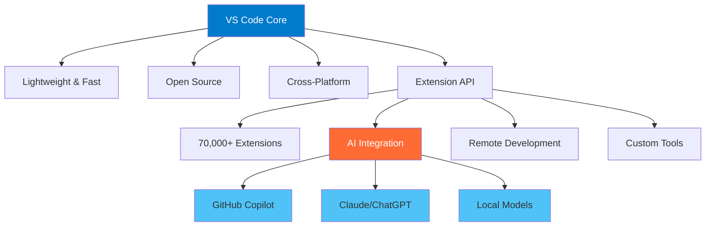
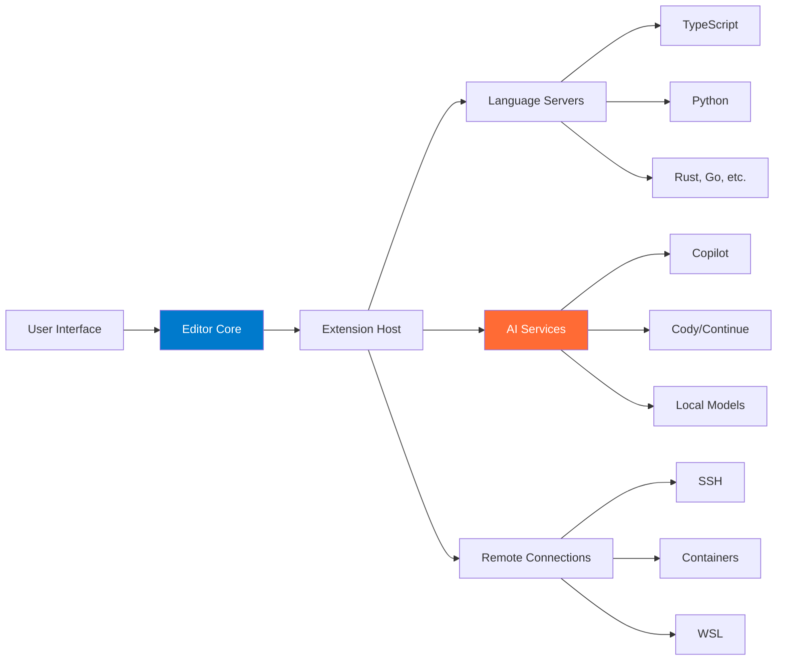
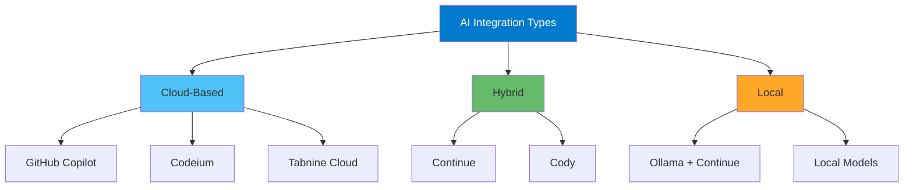

# Introduction to VS Code as an AI-Powered IDE

## Learning Objectives

By the end of this module, you will:
- Understand VS Code's architecture and why it's become the universal development platform
- Install and configure VS Code for optimal performance
- Navigate the interface confidently using both mouse and keyboard
- Understand how AI extensions transform VS Code into an intelligent coding partner
- Set up your first AI-enhanced development environment

## Why VS Code in 2025?

Visual Studio Code has evolved from a code editor into the **universal platform for knowledge work**. Here's why it dominates:



### Market Dominance (2025 Stats)
- **73.7%** of professional developers use VS Code
- **50+ million** active users globally
- **2.5+ million** extension downloads daily
- **#1 rated** editor on Stack Overflow for 7 consecutive years

## Core Concepts

### 1. The VS Code Philosophy

VS Code follows three core principles:

**Principle 1: Extensibility First**
```
Core Editor (20 MB) + Extensions (Your Choice) = Perfect Tool
```
Unlike traditional IDEs that bundle everything, VS Code lets you build exactly what you need.

**Principle 2: Remote-First Architecture**
Your code can live anywhere—local machine, remote server, container, cloud VM—while you edit seamlessly.

**Principle 3: AI-Native Design**
Modern VS Code is built for AI collaboration, not just text editing.

### 2. Architecture Overview



### 3. Key Components

| Component | Purpose | Why It Matters |
|-----------|---------|----------------|
| **Editor** | Text editing with IntelliSense | Where you write code |
| **Explorer** | File/folder navigation | Project organization |
| **Source Control** | Git integration | Version control without CLI |
| **Extensions** | Add functionality | Customize everything |
| **Terminal** | Command line access | No context switching |
| **Remote** | Code anywhere | Consistent environment |

## Hands-On: Installation and Setup

### Exercise 1: Install VS Code

**Windows:**
```bash
# Using winget
winget install Microsoft.VisualStudioCode

# Or download from https://code.visualstudio.com
```

**macOS:**
```bash
# Using Homebrew
brew install --cask visual-studio-code

# Or download from https://code.visualstudio.com
```

**Linux (Ubuntu/Debian):**
```bash
sudo apt update
sudo apt install wget gpg
wget -qO- https://packages.microsoft.com/keys/microsoft.asc | gpg --dearmor > packages.microsoft.gpg
sudo install -D -o root -g root -m 644 packages.microsoft.gpg /etc/apt/keyrings/packages.microsoft.gpg
sudo sh -c 'echo "deb [arch=amd64,arm64,armhf signed-by=/etc/apt/keyrings/packages.microsoft.gpg] https://packages.microsoft.com/repos/code stable main" > /etc/apt/sources.list.d/vscode.list'
rm -f packages.microsoft.gpg
sudo apt update
sudo apt install code
```

**✅ Verification:**
```bash
code --version
# Should output: 1.96.x or higher
```

### Exercise 2: First Launch and Interface Tour

**Launch VS Code:**
```bash
# From terminal
code

# Open specific folder
code /path/to/your/project

# Open current directory
code .
```

**Interface Layout:**

```
┌─────────────────────────────────────────────────────────────┐
│ Menu Bar                                           [- □ ×]  │
├──┬──────────────────────────────────────────────────────────┤
│  │ Tab Bar                                                  │
│A │──────────────────────────────────────────────────────────│
│c │                                                          │
│t │                                                          │
│i │             Editor Area                                  │
│v │           (Your code here)                              │
│i │                                                          │
│t │                                                          │
│y │                                                          │
│  │──────────────────────────────────────────────────────────│
│B │             Panel (Terminal/Output/Debug)               │
│a │                                                          │
│r │──────────────────────────────────────────────────────────│
│  │ Status Bar                                              │
└──┴──────────────────────────────────────────────────────────┘
```

**Key UI Elements:**

1. **Activity Bar** (Left edge):
   - Explorer: Files and folders
   - Search: Find across files
   - Source Control: Git operations
   - Run & Debug: Debugging tools
   - Extensions: Install add-ons

2. **Side Bar** (Dynamic based on Activity Bar selection)

3. **Editor Area** (Center):
   - Tabbed interface
   - Split editors
   - Code editing

4. **Panel** (Bottom):
   - Integrated terminal
   - Output logs
   - Problems list
   - Debug console

5. **Status Bar** (Bottom edge):
   - Git branch
   - Errors/warnings
   - Line/column position
   - Language mode
   - Encoding

### Exercise 3: Essential First Settings

**Access Settings:**
- Menu: `File > Preferences > Settings` (Windows/Linux)
- Menu: `Code > Preferences > Settings` (macOS)
- Keyboard: `Ctrl+,` (Windows/Linux) or `Cmd+,` (macOS)

**Recommended Initial Settings (settings.json):**

```json
{
  // Editor
  "editor.fontSize": 14,
  "editor.fontFamily": "'Fira Code', 'Cascadia Code', Consolas, monospace",
  "editor.fontLigatures": true,
  "editor.lineHeight": 22,
  "editor.tabSize": 2,
  "editor.insertSpaces": true,
  "editor.wordWrap": "on",
  "editor.minimap.enabled": true,
  "editor.rulers": [80, 120],

  // AI-friendly settings
  "editor.inlineSuggest.enabled": true,
  "editor.suggestSelection": "first",
  "editor.quickSuggestions": {
    "other": true,
    "comments": true,
    "strings": true
  },

  // Files
  "files.autoSave": "onFocusChange",
  "files.trimTrailingWhitespace": true,
  "files.insertFinalNewline": true,

  // Terminal
  "terminal.integrated.fontSize": 13,
  "terminal.integrated.fontFamily": "monospace",

  // Appearance
  "workbench.colorTheme": "Dark+ (default dark)",
  "workbench.iconTheme": "vs-seti",
  "workbench.startupEditor": "welcomePage"
}
```

**To edit settings.json directly:**
1. Open Command Palette: `Ctrl+Shift+P` / `Cmd+Shift+P`
2. Type: `Preferences: Open User Settings (JSON)`
3. Paste configuration above

### Exercise 4: Install Essential Extensions

**Method 1: Via UI**
1. Click Extensions icon in Activity Bar (`Ctrl+Shift+X`)
2. Search for extension name
3. Click "Install"

**Method 2: Via Command Line**
```bash
# Install multiple extensions at once
code --install-extension ms-vscode.vscode-typescript-next
code --install-extension dbaeumer.vscode-eslint
code --install-extension esbenp.prettier-vscode
code --install-extension eamodio.gitlens
code --install-extension ms-python.python
code --install-extension ms-vscode-remote.remote-ssh
```

**Starter Extension Pack:**

| Extension | Purpose | Why Install |
|-----------|---------|-------------|
| GitLens | Enhanced Git | See blame, history inline |
| Prettier | Code formatter | Consistent style |
| ESLint | JavaScript linter | Catch errors early |
| Python | Python support | Essential for Python |
| Remote - SSH | Remote editing | Code on servers |
| Path Intellisense | Path autocomplete | Faster file references |
| Bracket Pair Colorizer | Colorize brackets | Visual nesting |
| Error Lens | Inline errors | See issues immediately |

## AI Integration Basics

### Exercise 5: Understanding AI in VS Code

Modern VS Code supports three types of AI integration:



**Cloud-Based AI:**
- **Pros**: Most powerful models, always up-to-date, no local resources
- **Cons**: Requires internet, subscription costs, privacy concerns
- **Examples**: GitHub Copilot ($10/month), Codeium (free tier)

**Hybrid AI:**
- **Pros**: Choose your model, flexible pricing, some offline capability
- **Cons**: Setup complexity, may need API keys
- **Examples**: Continue.dev, Cody

**Local AI:**
- **Pros**: Complete privacy, no subscription, works offline
- **Cons**: Requires GPU, slower than cloud, limited models
- **Examples**: Ollama + Continue

### Exercise 6: Quick AI Setup (GitHub Copilot)

**Step 1: Install GitHub Copilot**
```bash
code --install-extension GitHub.copilot
code --install-extension GitHub.copilot-chat
```

**Step 2: Authenticate**
1. Click Copilot icon in status bar
2. Sign in with GitHub account
3. Authorize VS Code

**Step 3: Test It**

Create a new file `test.js`:
```javascript
// Type this comment and wait:
// Function to calculate fibonacci sequence

// Copilot should suggest the implementation!
```

**Copilot Features:**
- **Inline suggestions**: As you type (press `Tab` to accept)
- **Chat**: Ask questions (`Ctrl+I` or sidebar)
- **Explain code**: Highlight code, right-click > "Copilot: Explain This"
- **Generate tests**: Right-click > "Copilot: Generate Tests"

## Pro Tips and Shortcuts

### Essential Keyboard Shortcuts

**Must-Know Shortcuts:**

| Action | Windows/Linux | macOS | Purpose |
|--------|---------------|-------|---------|
| Command Palette | `Ctrl+Shift+P` | `Cmd+Shift+P` | Access all commands |
| Quick Open | `Ctrl+P` | `Cmd+P` | Open files by name |
| Toggle Terminal | `Ctrl+`` | `Cmd+`` | Show/hide terminal |
| Settings | `Ctrl+,` | `Cmd+,` | Open settings |
| Extensions | `Ctrl+Shift+X` | `Cmd+Shift+X` | Manage extensions |
| Find | `Ctrl+F` | `Cmd+F` | Find in file |
| Replace | `Ctrl+H` | `Cmd+H` | Find and replace |
| Save All | `Ctrl+K S` | `Cmd+K S` | Save all files |

### Pro Tips

**Tip 1: Command Palette is Your Friend**
```
Ctrl+Shift+P → Type what you want to do
Examples:
- "reload" → Reload window
- "theme" → Change color theme
- "format" → Format document
```

**Tip 2: Zen Mode for Focus**
```
View > Appearance > Zen Mode (or Ctrl+K Z)
Removes ALL UI distractions
```

**Tip 3: Quick File Navigation**
```
Ctrl+P → Start typing filename
  - Add ":" for line number: "file.js:42"
  - Add "@" for symbols: "@functionName"
  - Add "#" for workspace search
```

**Tip 4: Multi-Cursor Editing**
```
Alt+Click → Add cursor
Ctrl+Alt+↑/↓ → Add cursor above/below
Ctrl+D → Select next occurrence
```

## Common Pitfalls to Avoid

### Pitfall 1: Not Using Workspaces
**Problem**: Opening individual files loses context
**Solution**: Always open folders/workspaces
```bash
# Don't do this:
code file1.js file2.js

# Do this:
code /path/to/project
```

### Pitfall 2: Ignoring Settings Sync
**Problem**: Losing configuration when switching machines
**Solution**: Enable Settings Sync early
```
File > Preferences > Turn on Settings Sync
Sign in with GitHub/Microsoft account
```

### Pitfall 3: Installing Too Many Extensions
**Problem**: Slow startup, conflicts
**Solution**: Use profiles for different workflows (covered in Module 10)

### Pitfall 4: Not Learning Keyboard Shortcuts
**Problem**: Inefficient mouse-heavy workflow
**Solution**: Learn 3 new shortcuts per week
```
Help > Keyboard Shortcuts Reference
Print it, keep it visible
```

### Pitfall 5: Ignoring the Integrated Terminal
**Problem**: Context switching to external terminal
**Solution**: Use built-in terminal (`Ctrl+``)
```bash
# Multiple terminals
Ctrl+Shift+` → New terminal
Ctrl+PageDown/PageUp → Switch terminals
```

## Assessment Questions

### Knowledge Check

**Question 1: Architecture Understanding**
Which component allows VS Code to support remote development?
- A) The editor core
- B) The extension host
- C) The language server protocol
- D) The remote development extensions

<details>
<summary>Answer</summary>
D) The remote development extensions. While the extension host enables extensibility, the actual remote development capability comes from specific extensions (Remote-SSH, Remote-Containers, etc.) that leverage VS Code's architecture.
</details>

**Question 2: AI Integration**
What are the three types of AI integration in VS Code?
<details>
<summary>Answer</summary>
1. Cloud-based (GitHub Copilot, Codeium)
2. Hybrid (Continue, Cody with choice of models)
3. Local (Ollama + Continue, local models)
</details>

**Question 3: Settings Management**
Where are user settings stored in VS Code?
- A) In the VS Code installation directory
- B) In the workspace folder
- C) In your user profile directory
- D) In the cloud only

<details>
<summary>Answer</summary>
C) In your user profile directory
- Windows: `%APPDATA%\Code\User\settings.json`
- macOS: `~/Library/Application Support/Code/User/settings.json`
- Linux: `~/.config/Code/User/settings.json`
</details>

### Practical Exercise

**Exercise: Set Up Your Development Environment**

1. Install VS Code
2. Install these extensions:
   - GitLens
   - Prettier
   - Error Lens
   - One AI assistant (Copilot or Cody)
3. Configure your settings.json with:
   - Font size you prefer
   - Auto-save enabled
   - Tab size of 2 spaces
4. Create a test project folder
5. Open integrated terminal and run: `git init`
6. Create a README.md file
7. Test AI suggestions by writing a comment describing a function

**Success Criteria:**
- [ ] VS Code launches without errors
- [ ] All extensions installed and active
- [ ] Terminal works and shows correct directory
- [ ] AI suggestions appear when typing
- [ ] File explorer shows your project structure

## Next Steps

You've completed the foundation! Next modules will cover:

- **Module 2**: Essential keyboard shortcuts for 10x productivity
- **Module 3**: Extension ecosystem deep dive
- **Module 4**: Advanced settings and customization

## Additional Resources

**Official Documentation:**
- [VS Code Docs](https://code.visualstudio.com/docs) - Comprehensive official docs
- [VS Code Tips and Tricks](https://code.visualstudio.com/docs/getstarted/tips-and-tricks) - Official tips
- [Keyboard Shortcuts PDF](https://code.visualstudio.com/shortcuts/keyboard-shortcuts-windows.pdf) - Printable reference

**Video Tutorials:**
- [VS Code Crash Course (YouTube)](https://www.youtube.com/results?search_query=vscode+crash+course) - Visual learners
- [VS Code Can Do That?](https://vscodecandothat.com/) - Feature highlights

**Community:**
- [VS Code Reddit](https://reddit.com/r/vscode) - Community discussions
- [VS Code GitHub](https://github.com/microsoft/vscode) - Source code and issues
- [Stack Overflow Tag](https://stackoverflow.com/questions/tagged/visual-studio-code) - Q&A

---

**Estimated Time to Complete**: 2-3 hours
**Difficulty**: Beginner
**Prerequisites**: None
