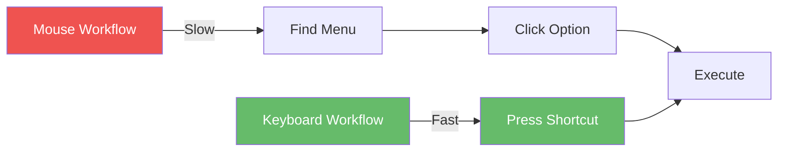

# Essential Keyboard Shortcuts and Productivity

## Learning Objectives

By the end of this module, you will:
- Master the 20 most important VS Code keyboard shortcuts
- Understand the keyboard shortcut philosophy and patterns
- Customize shortcuts for your workflow
- Achieve 3-5x faster editing through keyboard mastery
- Eliminate unnecessary mouse usage

## Why Keyboard Shortcuts Matter



**Time Savings Example:**
- Mouse: Find → Click → Execute = **~5 seconds**
- Keyboard: Press shortcut = **~0.5 seconds**
- **10x faster** per operation
- 100+ operations/day = **~7.5 minutes saved/day**
- **~30 hours saved/year**

## Core Concepts

### The VS Code Shortcut Philosophy

VS Code shortcuts follow three principles:

**1. Command Palette First**
```
Ctrl+Shift+P (or Cmd+Shift+P on Mac)
→ Every action accessible via search
→ No need to memorize everything
```

**2. Multi-Key Chords**
```
Ctrl+K → Release → Then another key
Example: Ctrl+K Ctrl+S = Open Keyboard Shortcuts
```

**3. Context-Aware**
```
Same shortcut, different action based on context
Example: F2
  - In Explorer: Rename file
  - In Editor: Rename symbol
  - In Debug: Rename variable
```

### Shortcut Patterns to Learn

| Pattern | Example | Meaning |
|---------|---------|---------|
| `Ctrl+Something` | `Ctrl+S` | Basic action |
| `Ctrl+Shift+Something` | `Ctrl+Shift+P` | Enhanced/opposite action |
| `Ctrl+K Ctrl+Something` | `Ctrl+K Ctrl+S` | Settings/special actions |
| `Alt+Something` | `Alt+↑/↓` | Move/modify |

## The Essential 20 Shortcuts

### Tier 1: Must Master First (Use 50+ times/day)

#### 1. Command Palette
```
Windows/Linux: Ctrl+Shift+P
macOS: Cmd+Shift+P
```
**Why**: Access every VS Code command by typing. Your escape hatch when you forget shortcuts.

**Practice**:
```
Ctrl+Shift+P → Type "reload" → Reload Window
Ctrl+Shift+P → Type "theme" → Change Color Theme
Ctrl+Shift+P → Type "format" → Format Document
```

#### 2. Quick Open (Go to File)
```
Windows/Linux: Ctrl+P
macOS: Cmd+P
```
**Why**: Instant file switching without touching the mouse.

**Advanced Usage**:
```
Ctrl+P → filename → Open file
Ctrl+P → filename:42 → Go to line 42
Ctrl+P → @symbol → Jump to symbol in file
Ctrl+P → #search → Search workspace symbols
Ctrl+P → > → Command palette (same as Ctrl+Shift+P)
```

**Practice**:
```
1. Press Ctrl+P
2. Type first few letters of a file
3. Press Enter to open
4. Repeat until muscle memory
```

#### 3. Toggle Integrated Terminal
```
Windows/Linux: Ctrl+`
macOS: Cmd+`
```
**Why**: Instant terminal access without context switching.

**Related Shortcuts**:
```
Ctrl+Shift+` → Create new terminal
Ctrl+PageUp/PageDown → Switch between terminals
```

#### 4. Save & Save All
```
Save: Ctrl+S / Cmd+S
Save All: Ctrl+K S / Cmd+K S
```
**Why**: Muscle memory for saving work.

**Tip**: Enable auto-save to never worry about this:
```json
"files.autoSave": "onFocusChange"
```

#### 5. Find and Replace
```
Find: Ctrl+F / Cmd+F
Replace: Ctrl+H / Cmd+H
Find in Files: Ctrl+Shift+F / Cmd+Shift+F
Replace in Files: Ctrl+Shift+H / Cmd+Shift+H
```

**Advanced Find**:
```
While in find box:
- Alt+C → Toggle case sensitive
- Alt+W → Toggle whole word
- Alt+R → Toggle regex
- Ctrl+Enter → Replace all
```

### Tier 2: Daily Power Shortcuts (Use 20+ times/day)

#### 6. Multi-Cursor Editing
```
Add cursor at position: Alt+Click
Add cursor above/below: Ctrl+Alt+↑/↓ (Cmd+Option+↑/↓ on Mac)
Select next occurrence: Ctrl+D / Cmd+D
Select all occurrences: Ctrl+Shift+L / Cmd+Shift+L
Undo last cursor: Ctrl+U / Cmd+U
```

**Practice Exercise**:
```javascript
// Change all occurrences of "foo" to "bar"
const foo = 1;
const fooBar = 2;
const isFoo = true;

// Method 1: Select and Ctrl+D
1. Select "foo"
2. Press Ctrl+D three times (selects each occurrence)
3. Type "bar"

// Method 2: Select all occurrences
1. Select "foo"
2. Press Ctrl+Shift+L
3. Type "bar"
```

#### 7. Line Manipulation
```
Move line up/down: Alt+↑/↓ (Option+↑/↓ on Mac)
Copy line up/down: Shift+Alt+↑/↓ (Shift+Option+↑/↓ on Mac)
Delete line: Ctrl+Shift+K / Cmd+Shift+K
Insert line above: Ctrl+Shift+Enter / Cmd+Shift+Enter
Insert line below: Ctrl+Enter / Cmd+Enter
```

**Practice**:
```javascript
// Start with this:
const a = 1;
const b = 2;

// 1. Put cursor on line with "a"
// 2. Press Alt+↓ to move it below "b"
// 3. Press Shift+Alt+↓ to duplicate
// Result:
const b = 2;
const a = 1;
const a = 1;
```

#### 8. Code Navigation
```
Go to Definition: F12
Peek Definition: Alt+F12
Go to References: Shift+F12
Go Back: Alt+← / Ctrl+- (Cmd+- on Mac)
Go Forward: Alt+→ / Ctrl+Shift+- (Cmd+Shift+- on Mac)
```

#### 9. Code Editing
```
Format Document: Shift+Alt+F / Shift+Option+F
Format Selection: Ctrl+K Ctrl+F / Cmd+K Cmd+F
Toggle Comment: Ctrl+/ / Cmd+/
Toggle Block Comment: Shift+Alt+A / Shift+Option+A
```

#### 10. Fold/Unfold Code
```
Fold: Ctrl+Shift+[ / Cmd+Option+[
Unfold: Ctrl+Shift+] / Cmd+Option+]
Fold All: Ctrl+K Ctrl+0 / Cmd+K Cmd+0
Unfold All: Ctrl+K Ctrl+J / Cmd+K Cmd+J
Fold Level 1-7: Ctrl+K Ctrl+1-7 / Cmd+K Cmd+1-7
```

### Tier 3: Advanced Productivity (Use 10+ times/day)

#### 11. Split Editor
```
Split Editor: Ctrl+\ / Cmd+\
Switch Editor Group: Ctrl+1, Ctrl+2, Ctrl+3 / Cmd+1, Cmd+2, Cmd+3
Move Editor to Group: Ctrl+Alt+→/← / Cmd+Option+→/←
```

**Practice**:
```
1. Open a file
2. Press Ctrl+\
3. Split view appears
4. Press Ctrl+P to open another file in split
5. Press Ctrl+1 to focus left, Ctrl+2 for right
```

#### 12. Sidebar and Panel Toggles
```
Toggle Sidebar: Ctrl+B / Cmd+B
Toggle Panel: Ctrl+J / Cmd+J
Toggle Activity Bar: Ctrl+K Ctrl+B / Cmd+K Cmd+B
Zen Mode: Ctrl+K Z / Cmd+K Z
```

#### 13. Symbol Navigation
```
Go to Symbol in File: Ctrl+Shift+O / Cmd+Shift+O
Go to Symbol in Workspace: Ctrl+T / Cmd+T
Breadcrumbs: Ctrl+Shift+. / Cmd+Shift+.
```

**Practice**:
```javascript
// In a large file with many functions
function calculateTotal() { }
function processOrder() { }
function validateInput() { }

// Press Ctrl+Shift+O
// Type "process"
// Press Enter to jump to processOrder()
```

#### 14. Selection Shortcuts
```
Select All: Ctrl+A / Cmd+A
Expand Selection: Shift+Alt+→ / Shift+Option+→
Shrink Selection: Shift+Alt+← / Shift+Option+←
Select Line: Ctrl+L / Cmd+L
Select to End of Line: Shift+End
Select to Start of Line: Shift+Home
```

#### 15. Rename Symbol
```
Rename: F2
```
**Why**: Renames all references to a variable/function across all files.

**Practice**:
```javascript
const userName = "John";
console.log(userName);

// 1. Put cursor on "userName"
// 2. Press F2
// 3. Type new name
// 4. Press Enter
// All references renamed!
```

### Tier 4: Workflow Optimization (Situational)

#### 16. Git Shortcuts
```
Source Control View: Ctrl+Shift+G / Cmd+Shift+G
Toggle Git Output: Ctrl+Shift+U / Cmd+Shift+U
```

#### 17. Problems and Output
```
Show Problems: Ctrl+Shift+M / Cmd+Shift+M
Show Output: Ctrl+Shift+U / Cmd+Shift+U
```

#### 18. Extensions and Settings
```
Extensions: Ctrl+Shift+X / Cmd+Shift+X
Settings: Ctrl+, / Cmd+,
Keyboard Shortcuts: Ctrl+K Ctrl+S / Cmd+K Cmd+S
```

#### 19. Debugging
```
Start Debugging: F5
Step Over: F10
Step Into: F11
Step Out: Shift+F11
Continue: F5
Stop: Shift+F5
Toggle Breakpoint: F9
```

#### 20. Miscellaneous Power Moves
```
Close Editor: Ctrl+W / Cmd+W
Close All Editors: Ctrl+K W / Cmd+K W
Reopen Closed Editor: Ctrl+Shift+T / Cmd+Shift+T
New File: Ctrl+N / Cmd+N
New Window: Ctrl+Shift+N / Cmd+Shift+N
```

## Complete Shortcut Reference Table

### Windows/Linux Shortcuts

| Action | Shortcut | Category |
|--------|----------|----------|
| **General** |
| Command Palette | `Ctrl+Shift+P` | Essential |
| Quick Open | `Ctrl+P` | Essential |
| Settings | `Ctrl+,` | Essential |
| Keyboard Shortcuts | `Ctrl+K Ctrl+S` | Essential |
| **Editing** |
| Cut Line | `Ctrl+X` | Basic |
| Copy Line | `Ctrl+C` | Basic |
| Move Line Up/Down | `Alt+↑/↓` | Power |
| Copy Line Up/Down | `Shift+Alt+↑/↓` | Power |
| Delete Line | `Ctrl+Shift+K` | Power |
| Insert Line Below | `Ctrl+Enter` | Power |
| Insert Line Above | `Ctrl+Shift+Enter` | Power |
| **Multi-Cursor** |
| Add Cursor | `Alt+Click` | Power |
| Add Cursor Above/Below | `Ctrl+Alt+↑/↓` | Power |
| Select Next Occurrence | `Ctrl+D` | Power |
| Select All Occurrences | `Ctrl+Shift+L` | Power |
| **Navigation** |
| Go to Line | `Ctrl+G` | Basic |
| Go to File | `Ctrl+P` | Essential |
| Go to Symbol | `Ctrl+Shift+O` | Power |
| Go to Definition | `F12` | Power |
| Go Back | `Alt+←` | Power |
| Go Forward | `Alt+→` | Power |
| **Search** |
| Find | `Ctrl+F` | Essential |
| Replace | `Ctrl+H` | Essential |
| Find in Files | `Ctrl+Shift+F` | Essential |
| **Display** |
| Toggle Sidebar | `Ctrl+B` | Power |
| Toggle Panel | `Ctrl+J` | Power |
| Toggle Terminal | `Ctrl+`` | Essential |
| Zen Mode | `Ctrl+K Z` | Power |
| Split Editor | `Ctrl+\` | Power |
| **Code** |
| Format Document | `Shift+Alt+F` | Power |
| Toggle Comment | `Ctrl+/` | Power |
| Rename Symbol | `F2` | Power |
| **Debug** |
| Start/Continue | `F5` | Debug |
| Step Over | `F10` | Debug |
| Step Into | `F11` | Debug |
| Toggle Breakpoint | `F9` | Debug |

### macOS Shortcuts

| Action | Shortcut | Category |
|--------|----------|----------|
| **General** |
| Command Palette | `Cmd+Shift+P` | Essential |
| Quick Open | `Cmd+P` | Essential |
| Settings | `Cmd+,` | Essential |
| Keyboard Shortcuts | `Cmd+K Cmd+S` | Essential |
| **Editing** |
| Cut Line | `Cmd+X` | Basic |
| Copy Line | `Cmd+C` | Basic |
| Move Line Up/Down | `Option+↑/↓` | Power |
| Copy Line Up/Down | `Shift+Option+↑/↓` | Power |
| Delete Line | `Cmd+Shift+K` | Power |
| Insert Line Below | `Cmd+Enter` | Power |
| Insert Line Above | `Cmd+Shift+Enter` | Power |
| **Multi-Cursor** |
| Add Cursor | `Option+Click` | Power |
| Add Cursor Above/Below | `Cmd+Option+↑/↓` | Power |
| Select Next Occurrence | `Cmd+D` | Power |
| Select All Occurrences | `Cmd+Shift+L` | Power |
| **Navigation** |
| Go to Line | `Cmd+G` | Basic |
| Go to File | `Cmd+P` | Essential |
| Go to Symbol | `Cmd+Shift+O` | Power |
| Go to Definition | `F12` | Power |
| Go Back | `Cmd+-` | Power |
| Go Forward | `Cmd+Shift+-` | Power |
| **Display** |
| Toggle Sidebar | `Cmd+B` | Power |
| Toggle Panel | `Cmd+J` | Power |
| Toggle Terminal | `Cmd+`` | Essential |
| Zen Mode | `Cmd+K Z` | Power |
| Split Editor | `Cmd+\` | Power |

## Hands-On Exercises

### Exercise 1: The 10-Minute Shortcut Challenge

**Goal**: Perform these tasks using ONLY keyboard shortcuts (no mouse).

```javascript
// Starting code:
function hello() {
  console.log("Hello World");
}

// Tasks:
// 1. Duplicate this function 5 times
// 2. Rename each function: hello1, hello2, hello3, hello4, hello5
// 3. Change "Hello World" to "Hello User" in all functions
// 4. Add comments above each function
// 5. Format the entire document
// 6. Save the file
```

**Solution Steps**:
```
1. Ctrl+L (select line), Shift+Alt+↓ (x4) to duplicate
2. F2 on each "hello", type new name, Enter
3. Select "World", Ctrl+Shift+L, type "User"
4. Ctrl+Shift+Enter above each function, type comment
5. Shift+Alt+F to format
6. Ctrl+S to save
```

**Time Goals**:
- Beginner: < 5 minutes
- Intermediate: < 3 minutes
- Expert: < 2 minutes

### Exercise 2: Multi-Cursor Mastery

**Task**: Convert this array into individual variables

```javascript
// Start:
const colors = ['red', 'blue', 'green', 'yellow', 'purple'];

// Goal:
const color1 = 'red';
const color2 = 'blue';
const color3 = 'green';
const color4 = 'yellow';
const color5 = 'purple';
```

**Solution**:
```
1. Select 'red'
2. Ctrl+D four times (selects all color strings)
3. Ctrl+← to move cursors to start of words
4. Type: const color
5. Press End key
6. Type: =
7. Press End again
8. Type: ;
9. Now manually number them (or use another multi-cursor trick)
```

### Exercise 3: Navigation Speed Test

**Task**: Given a large file with 20 functions, jump between them as fast as possible.

```
1. Open a large JavaScript file
2. Press Ctrl+Shift+O (symbol search)
3. Type function name
4. Press Enter
5. Repeat 10 times
6. Goal: < 2 seconds per jump
```

## Customizing Shortcuts

### How to Customize

**Method 1: Via UI**
```
1. Ctrl+K Ctrl+S (open keyboard shortcuts)
2. Search for command
3. Double-click on shortcut
4. Press new key combination
5. Enter to save
```

**Method 2: Via keybindings.json**
```
1. Ctrl+K Ctrl+S
2. Click {} icon (top right) to open keybindings.json
3. Add custom bindings
```

**Example keybindings.json**:
```json
[
  {
    "key": "ctrl+shift+c",
    "command": "editor.action.commentLine",
    "when": "editorTextFocus && !editorReadonly"
  },
  {
    "key": "ctrl+shift+d",
    "command": "editor.action.duplicateSelection"
  },
  {
    "key": "ctrl+k ctrl+c",
    "command": "workbench.action.terminal.clear"
  }
]
```

### Recommended Custom Shortcuts

```json
[
  // Clear terminal (ergonomic)
  {
    "key": "ctrl+l",
    "command": "workbench.action.terminal.clear",
    "when": "terminalFocus"
  },

  // Close all editors (quick)
  {
    "key": "ctrl+shift+w",
    "command": "workbench.action.closeAllEditors"
  },

  // Toggle maximize editor group
  {
    "key": "ctrl+m",
    "command": "workbench.action.toggleMaximizedPanel"
  },

  // Open file in new window
  {
    "key": "ctrl+k o",
    "command": "workbench.action.files.openFileInNewWindow"
  }
]
```

## Pro Tips

### Tip 1: Learn Shortcuts in Context
Don't memorize all shortcuts at once. Instead:
```
Week 1: Master Command Palette (Ctrl+Shift+P) and Quick Open (Ctrl+P)
Week 2: Add multi-cursor (Ctrl+D, Alt+Click)
Week 3: Add line manipulation (Alt+↑/↓)
Week 4: Add code navigation (F12, Alt+←/→)
```

### Tip 2: Use Chord Shortcuts
VS Code supports two-key chords:
```
Ctrl+K → Release → Then another key
Examples:
- Ctrl+K Ctrl+S → Keyboard shortcuts
- Ctrl+K Ctrl+T → Theme picker
- Ctrl+K Z → Zen mode
- Ctrl+K Ctrl+F → Format selection
```

### Tip 3: Context-Aware Shortcuts
Same key, different actions:
```
Delete (Del key):
- In Editor → Delete character
- In Explorer → Move file to trash
- In Terminal → Delete character

F2:
- In Editor → Rename symbol
- In Explorer → Rename file
```

### Tip 4: Shortcut Discovery
VS Code shows shortcuts in menus:
```
1. Click any menu item
2. Look at right side of menu
3. Shortcut is displayed
4. Use it next time instead of menu
```

### Tip 5: Reduce Mouse Dependency Gradually
Track your mouse usage:
```
Week 1: 80% mouse, 20% keyboard
Week 2: 60% mouse, 40% keyboard
Week 3: 40% mouse, 60% keyboard
Week 4: 20% mouse, 80% keyboard
```

## Common Pitfalls

### Pitfall 1: Trying to Learn Too Many at Once
**Problem**: Overwhelming, forget everything
**Solution**: Master 3 new shortcuts per week
```
Week 1: Ctrl+P, Ctrl+Shift+P, Ctrl+`
Week 2: Ctrl+D, Alt+↑/↓, Ctrl+/
Week 3: F12, Alt+←, Ctrl+B
```

### Pitfall 2: Not Practicing Regularly
**Problem**: Learn but don't retain
**Solution**: Daily challenge
```
Each morning, use ONE shortcut 10 times
Example: Monday = Ctrl+D day
Force yourself to use it 10 times during work
```

### Pitfall 3: Ignoring Command Palette
**Problem**: Trying to memorize rare shortcuts
**Solution**: Use Ctrl+Shift+P for infrequent tasks
```
Don't memorize: "Toggle Breadcrumbs"
Just Ctrl+Shift+P → "breadcrumb" → Enter
```

### Pitfall 4: Platform Confusion
**Problem**: Switching between Windows/Mac
**Solution**: Learn the pattern, not the key
```
Pattern: "Quick Open"
Windows: Ctrl+P
Mac: Cmd+P

Pattern is same: "Primary modifier + P"
```

### Pitfall 5: Conflicting Extensions
**Problem**: Extensions override default shortcuts
**Solution**: Check shortcut conflicts
```
Ctrl+K Ctrl+S → Search for shortcut
Look for "conflicts" icon (⚠️)
Resolve by removing or remapping
```

## Assessment

### Knowledge Check

**Question 1**: What's the fastest way to access any VS Code command?
<details>
<summary>Answer</summary>
Command Palette: `Ctrl+Shift+P` (Windows/Linux) or `Cmd+Shift+P` (Mac)
</details>

**Question 2**: How do you select all occurrences of a word for simultaneous editing?
<details>
<summary>Answer</summary>
1. Select the word
2. Press `Ctrl+Shift+L` (Windows/Linux) or `Cmd+Shift+L` (Mac)
Or: Select word, then press `Ctrl+D` / `Cmd+D` repeatedly to add each occurrence
</details>

**Question 3**: What's the shortcut to jump to a specific line number?
<details>
<summary>Answer</summary>
`Ctrl+G` (Windows/Linux) or `Cmd+G` (Mac), then type line number
Or: `Ctrl+P` then type `:42` to go to line 42
</details>

### Practical Challenge

**30-Second File Challenge**:
```
Task: Starting from empty editor, create a new file with this content:

function greet(name) {
  console.log(`Hello, ${name}!`);
}

greet("World");
greet("Universe");
greet("VS Code");

Requirements:
- Use ONLY keyboard shortcuts
- Complete in < 30 seconds
- No mouse allowed
```

**Solution**:
```
1. Ctrl+N (new file)
2. Type first function
3. Alt+↓ x2 (move to bottom)
4. Type first greet call
5. Shift+Alt+↓ x2 (duplicate)
6. Change parameter in duplicates
7. Ctrl+S (save)
```

## Next Steps

Master these shortcuts, and you're ready for:
- **Module 3**: Extension ecosystem
- **Module 4**: Advanced settings
- **Module 9**: AI-powered editing shortcuts

## Additional Resources

**Cheat Sheets**:
- [Windows Shortcuts PDF](https://code.visualstudio.com/shortcuts/keyboard-shortcuts-windows.pdf)
- [macOS Shortcuts PDF](https://code.visualstudio.com/shortcuts/keyboard-shortcuts-macos.pdf)
- [Linux Shortcuts PDF](https://code.visualstudio.com/shortcuts/keyboard-shortcuts-linux.pdf)

**Practice Tools**:
- [Shortcut Foo](https://www.shortcutfoo.com/app/dojos/vscode-win) - Gamified practice
- [VS Code Shortcuts Practice Extension](https://marketplace.visualstudio.com/items?itemName=usernamehw.vscode-learn-shortcuts)

**Video Tutorials**:
- [VS Code Keyboard Shortcuts (YouTube)](https://www.youtube.com/results?search_query=vscode+keyboard+shortcuts)

---

**Estimated Time to Complete**: 3-4 hours
**Difficulty**: Beginner to Intermediate
**Practice Time**: 2 weeks to build muscle memory
