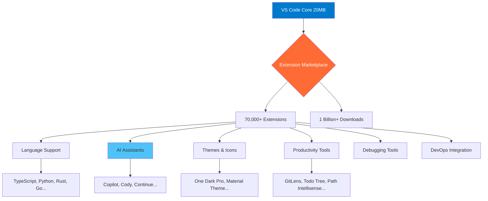
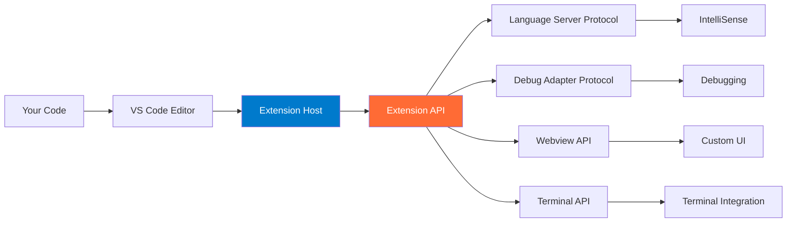
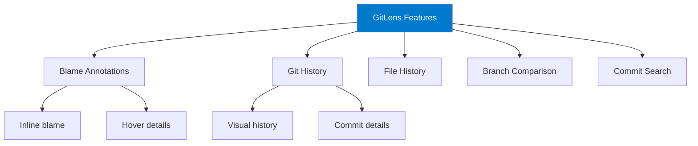

# Extension Ecosystem Mastery

## Learning Objectives

By the end of this module, you will:
- Understand the VS Code extension architecture
- Master finding, installing, and managing extensions
- Build curated extension sets for different workflows
- Avoid extension bloat and performance issues
- Create custom extension configurations
- Understand when to build vs. install extensions

## The Extension Revolution

VS Code's power comes from its extension ecosystem:



## Core Concepts

### Extension Types

| Type | Purpose | Examples |
|------|---------|----------|
| **Language** | Language support & IntelliSense | Python, Go, Rust |
| **Formatter** | Code formatting | Prettier, Black, rustfmt |
| **Linter** | Code quality checks | ESLint, Pylint, Clippy |
| **Debugger** | Debug support | Python Debugger, Chrome Debugger |
| **Theme** | Visual customization | One Dark Pro, Dracula |
| **Icon Theme** | File icon customization | Material Icon Theme, vscode-icons |
| **Git** | Version control enhancement | GitLens, Git Graph |
| **AI** | AI-powered assistance | Copilot, Cody, Continue |
| **Remote** | Remote development | Remote-SSH, Dev Containers |
| **Productivity** | Workflow enhancement | Todo Tree, Bookmarks |

### Extension Architecture



## Essential Extension Categories

### 1. Language Support Extensions

**Must-Have for Each Language:**

**Python:**
```bash
code --install-extension ms-python.python
code --install-extension ms-python.vscode-pylance
code --install-extension ms-python.debugpy
```

**JavaScript/TypeScript:**
```bash
code --install-extension dbaeumer.vscode-eslint
code --install-extension esbenp.prettier-vscode
```

**Rust:**
```bash
code --install-extension rust-lang.rust-analyzer
```

**Go:**
```bash
code --install-extension golang.go
```

**Configuration:**
```json
{
  "python.languageServer": "Pylance",
  "python.analysis.typeCheckingMode": "basic",
  "eslint.enable": true,
  "prettier.requireConfig": true
}
```

### 2. AI Coding Assistants (Deep Dive)

**Option 1: GitHub Copilot (Cloud, Paid)**
```bash
code --install-extension GitHub.copilot
code --install-extension GitHub.copilot-chat
```

**Features:**
- Inline code completion
- Chat interface
- Code explanation
- Test generation
- Documentation generation

**Configuration:**
```json
{
  "github.copilot.enable": {
    "*": true,
    "yaml": false,
    "plaintext": false
  },
  "github.copilot.editor.enableAutoCompletions": true
}
```

**Option 2: Continue (Hybrid, Free/Paid)**
```bash
code --install-extension Continue.continue
```

**Features:**
- Multiple model support (OpenAI, Anthropic, Local)
- Custom model configuration
- Full code context awareness
- Privacy-focused options

**Configuration (config.json):**
```json
{
  "models": [
    {
      "title": "GPT-4",
      "provider": "openai",
      "model": "gpt-4-turbo-preview",
      "apiKey": "YOUR_OPENAI_KEY"
    },
    {
      "title": "Claude",
      "provider": "anthropic",
      "model": "claude-3-opus-20240229",
      "apiKey": "YOUR_ANTHROPIC_KEY"
    },
    {
      "title": "Local Llama",
      "provider": "ollama",
      "model": "codellama:13b"
    }
  ]
}
```

**Option 3: Cody (Sourcegraph)**
```bash
code --install-extension sourcegraph.cody-ai
```

**Features:**
- Free tier available
- Enterprise-ready
- Code search integration
- Multiple LLM support

### 3. Git & Version Control Extensions

**GitLens (Essential)**
```bash
code --install-extension eamodio.gitlens
```

**Key Features:**


**Configuration:**
```json
{
  "gitlens.currentLine.enabled": true,
  "gitlens.hovers.currentLine.over": "line",
  "gitlens.codeLens.enabled": false,
  "gitlens.statusBar.enabled": true
}
```

**Git Graph:**
```bash
code --install-extension mhutchie.git-graph
```
**Use Case**: Visual commit history, branch management

### 4. Code Quality Extensions

**ESLint (JavaScript/TypeScript):**
```bash
code --install-extension dbaeumer.vscode-eslint
```

**Configuration:**
```json
{
  "eslint.enable": true,
  "eslint.autoFixOnSave": true,
  "eslint.validate": [
    "javascript",
    "javascriptreact",
    "typescript",
    "typescriptreact"
  ]
}
```

**Error Lens (Visual Error Display):**
```bash
code --install-extension usernamehw.errorlens
```
Shows errors inline in the editor—game changer for catching issues.

**SonarLint (Multi-Language Quality):**
```bash
code --install-extension SonarSource.sonarlint-vscode
```

### 5. Productivity Boosters

**Path Intellisense:**
```bash
code --install-extension christian-kohler.path-intellisense
```
Autocompletes file paths—saves tons of time.

**Auto Rename Tag:**
```bash
code --install-extension formulahendry.auto-rename-tag
```
Automatically rename paired HTML/XML tags.

**Bracket Pair Colorizer (Built-in Now!):**
VS Code now has this built-in:
```json
{
  "editor.bracketPairColorization.enabled": true,
  "editor.guides.bracketPairs": "active"
}
```

**TODO Tree:**
```bash
code --install-extension Gruntfuggly.todo-tree
```
Highlights TODO, FIXME, etc. comments in sidebar tree.

**Better Comments:**
```bash
code --install-extension aaron-bond.better-comments
```
Color-codes comments by type:
```javascript
// ! Critical issue
// ? Question or uncertainty
// TODO: Something to do
// * Highlighted information
```

### 6. Theme & Visual Extensions

**Popular Themes:**
```bash
# One Dark Pro (Atom-inspired)
code --install-extension zhuangtongfa.material-theme

# Dracula Official
code --install-extension dracula-theme.theme-dracula

# Night Owl
code --install-extension sdras.night-owl

# GitHub Theme
code --install-extension GitHub.github-vscode-theme
```

**Icon Themes:**
```bash
# Material Icon Theme
code --install-extension PKief.material-icon-theme

# VSCode Icons
code --install-extension vscode-icons-team.vscode-icons
```

**Configuration:**
```json
{
  "workbench.colorTheme": "One Dark Pro",
  "workbench.iconTheme": "material-icon-theme",
  "material-icon-theme.folders.color": "#90a4ae",
  "material-icon-theme.folders.theme": "specific"
}
```

### 7. Remote Development

**Remote - SSH:**
```bash
code --install-extension ms-vscode-remote.remote-ssh
```

**Dev Containers:**
```bash
code --install-extension ms-vscode-remote.remote-containers
```

**WSL:**
```bash
code --install-extension ms-vscode-remote.remote-wsl
```

More in Module 6!

## Hands-On Exercises

### Exercise 1: Build Your Extension Set

**Create extension sets for different workflows:**

**Web Development Stack:**
```bash
#!/bin/bash
# install-web-dev-extensions.sh

# Core
code --install-extension dbaeumer.vscode-eslint
code --install-extension esbenp.prettier-vscode
code --install-extension formulahendry.auto-rename-tag
code --install-extension christian-kohler.path-intellisense

# Framework-specific
code --install-extension dsznajder.es7-react-js-snippets # React
code --install-extension Vue.volar # Vue
code --install-extension svelte.svelte-vscode # Svelte

# CSS
code --install-extension bradlc.vscode-tailwindcss
code --install-extension stylelint.vscode-stylelint

# Tools
code --install-extension ritwickdey.LiveServer
code --install-extension ms-vscode.live-server
```

**Python Data Science Stack:**
```bash
#!/bin/bash

code --install-extension ms-python.python
code --install-extension ms-toolsai.jupyter
code --install-extension ms-toolsai.vscode-jupyter-cell-tags
code --install-extension ms-toolsai.vscode-jupyter-slideshow
code --install-extension ms-python.vscode-pylance
code --install-extension KevinRose.vsc-python-indent
```

**DevOps/Infrastructure Stack:**
```bash
#!/bin/bash

code --install-extension ms-vscode-remote.remote-ssh
code --install-extension ms-vscode-remote.remote-containers
code --install-extension ms-azuretools.vscode-docker
code --install-extension ms-kubernetes-tools.vscode-kubernetes-tools
code --install-extension hashicorp.terraform
code --install-extension redhat.vscode-yaml
```

### Exercise 2: Configure Extension Workspace

**Create a `.vscode/extensions.json` for your project:**

```json
{
  "recommendations": [
    "dbaeumer.vscode-eslint",
    "esbenp.prettier-vscode",
    "eamodio.gitlens",
    "GitHub.copilot"
  ],
  "unwantedRecommendations": [
    "ms-vscode.vscode-typescript-tslint-plugin"
  ]
}
```

When teammates open the project, VS Code suggests these extensions.

### Exercise 3: Extension Performance Audit

**Check extension impact:**

```
1. Ctrl+Shift+P
2. Type: "Developer: Show Running Extensions"
3. Sort by "Activation Time" or "Runtime"
4. Disable slow extensions
```

**Example Output:**
```
Extension                    Activation Time   Runtime
─────────────────────────────────────────────────────
GitLens                      450ms            12ms
Copilot                      230ms            45ms
Python                       180ms            8ms
ESLint                       120ms            25ms
Theme                        50ms             2ms
```

**Rule of Thumb:**
- Activation > 500ms: Consider alternatives
- Runtime > 50ms: Check if constantly active

## Pro Tips

### Tip 1: Use Extension Packs

Extension Packs bundle related extensions:

**Create Your Own Pack:**
```json
// package.json for custom extension pack
{
  "name": "my-dev-pack",
  "displayName": "My Dev Essentials",
  "description": "All my essential extensions",
  "version": "1.0.0",
  "engines": {
    "vscode": "^1.80.0"
  },
  "categories": ["Extension Packs"],
  "extensionPack": [
    "eamodio.gitlens",
    "esbenp.prettier-vscode",
    "dbaeumer.vscode-eslint",
    "GitHub.copilot"
  ]
}
```

### Tip 2: Disable Extensions Per Workspace

**Right-click extension → "Disable (Workspace)"**

**Use Case:**
- Disable Python extensions in JavaScript projects
- Disable formatters in read-only projects

### Tip 3: Sync Extensions Across Machines

**Enable Settings Sync:**
```
1. Ctrl+Shift+P
2. "Settings Sync: Turn On"
3. Sign in with GitHub/Microsoft
4. Check "Extensions" checkbox
```

All your extensions sync automatically!

### Tip 4: Extension Keyboard Shortcuts

**Assign shortcuts to extension commands:**

```json
// keybindings.json
[
  {
    "key": "ctrl+shift+g g",
    "command": "gitlens.showQuickCommitFileDetails"
  },
  {
    "key": "ctrl+shift+a",
    "command": "github.copilot.generate"
  }
]
```

### Tip 5: Use Pre-Release Extensions

**For cutting-edge features:**
```
1. Go to extension page
2. Click "Switch to Pre-Release Version"
3. Get latest features before stable release
```

**Caution**: May have bugs, but often worth it for new AI features.

## Extension Recommendations by Role

### For Web Developers

```bash
# Core
code --install-extension dbaeumer.vscode-eslint
code --install-extension esbenp.prettier-vscode

# Productivity
code --install-extension formulahendry.auto-close-tag
code --install-extension formulahendry.auto-rename-tag
code --install-extension christian-kohler.path-intellisense
code --install-extension zignd.html-css-class-completion

# Frameworks
code --install-extension dsznajder.es7-react-js-snippets
code --install-extension bradlc.vscode-tailwindcss

# Testing
code --install-extension Orta.vscode-jest

# AI
code --install-extension GitHub.copilot
```

### For Python Developers

```bash
# Core
code --install-extension ms-python.python
code --install-extension ms-python.vscode-pylance

# Formatting & Linting
code --install-extension ms-python.black-formatter
code --install-extension charliermarsh.ruff

# Jupyter
code --install-extension ms-toolsai.jupyter

# Productivity
code --install-extension KevinRose.vsc-python-indent
code --install-extension njpwerner.autodocstring

# AI
code --install-extension Continue.continue
```

### For DevOps Engineers

```bash
# Remote & Containers
code --install-extension ms-vscode-remote.remote-ssh
code --install-extension ms-vscode-remote.remote-containers
code --install-extension ms-azuretools.vscode-docker

# Infrastructure
code --install-extension hashicorp.terraform
code --install-extension ms-kubernetes-tools.vscode-kubernetes-tools
code --install-extension redhat.vscode-yaml

# CI/CD
code --install-extension github.vscode-github-actions
code --install-extension ms-azure-devops.azure-pipelines

# Monitoring
code --install-extension humao.rest-client
```

### For Data Scientists

```bash
# Core
code --install-extension ms-python.python
code --install-extension ms-toolsai.jupyter

# Visualization
code --install-extension RandomFractalsInc.vscode-data-preview
code --install-extension mechatroner.rainbow-csv

# Databases
code --install-extension mtxr.sqltools
code --install-extension mtxr.sqltools-driver-pg

# AI
code --install-extension GitHub.copilot
```

## Common Pitfalls

### Pitfall 1: Extension Overload
**Problem**: 50+ extensions, slow startup
**Solution**: Audit regularly, disable unused

```
1. Check extension count: Extensions sidebar
2. Goal: < 20 extensions for most workflows
3. Use profiles for different project types (Module 10)
```

### Pitfall 2: Conflicting Formatters
**Problem**: Multiple formatters fight over files
**Solution**: One formatter per language

```json
{
  "[javascript]": {
    "editor.defaultFormatter": "esbenp.prettier-vscode"
  },
  "[python]": {
    "editor.defaultFormatter": "ms-python.black-formatter"
  }
}
```

### Pitfall 3: Not Reading Extension READMEs
**Problem**: Missing powerful features
**Solution**: Read README after installing

```
1. Click extension in sidebar
2. Read "Features" section
3. Check "Configuration" options
```

### Pitfall 4: Outdated Extensions
**Problem**: Missing features, bugs
**Solution**: Auto-update enabled

```json
{
  "extensions.autoUpdate": true,
  "extensions.autoCheckUpdates": true
}
```

### Pitfall 5: Trusting All Extensions
**Problem**: Security/privacy risks
**Solution**: Check before installing

```
✅ Check:
- Number of installs (> 100k = safer)
- Rating (> 4 stars)
- Publisher (Verified publishers)
- Last update (< 6 months ago)
- Reviews (read negative ones)

❌ Avoid:
- Low installs + requests permissions
- No updates in 1+ years
- Unverified publishers for sensitive tools
```

## Assessment

### Knowledge Check

**Question 1**: What's the difference between an Extension Pack and installing multiple extensions individually?

<details>
<summary>Answer</summary>
An Extension Pack is a meta-extension that bundles multiple extensions together. Installing a pack installs all its included extensions at once. Benefit: Easier to share/install curated sets. Downside: You get all extensions, even ones you may not want.
</details>

**Question 2**: How do you recommend project-specific extensions to teammates?

<details>
<summary>Answer</summary>
Create a `.vscode/extensions.json` file in your project:
```json
{
  "recommendations": [
    "dbaeumer.vscode-eslint",
    "esbenp.prettier-vscode"
  ]
}
```
When teammates open the project, VS Code prompts them to install recommended extensions.
</details>

**Question 3**: An extension is slowing down VS Code. How do you identify it?

<details>
<summary>Answer</summary>
1. `Ctrl+Shift+P` → "Developer: Show Running Extensions"
2. Sort by "Activation Time" or check "Runtime"
3. Look for extensions with high activation times (> 500ms) or runtime overhead
4. Disable the culprit, reload window, confirm improvement
</details>

### Practical Exercise

**Build Your Perfect Stack:**

1. **Audit Current Extensions:**
   - List all installed extensions
   - Categorize: Essential, Nice-to-have, Unused
   - Disable/uninstall unused

2. **Create Your Stack:**
   - Choose one AI assistant
   - Install language-specific extensions
   - Add 3-5 productivity extensions
   - Add one theme you love

3. **Configure & Test:**
   - Set up extension settings
   - Create `.vscode/extensions.json`
   - Test all features
   - Document your choices

**Target**: 10-15 extensions total for optimal performance

## Next Steps

You now have extension mastery! Next:
- **Module 4**: Settings and customization
- **Module 6**: Remote development extensions deep dive
- **Module 9**: Advanced AI integration

## Additional Resources

**Extension Discovery:**
- [VS Code Marketplace](https://marketplace.visualstudio.com/vscode)
- [Open VSX Registry](https://open-vsx.org/) - Open source alternative
- [Awesome VS Code](https://github.com/viatsko/awesome-vscode) - Curated list

**Extension Development:**
- [Extension API Docs](https://code.visualstudio.com/api)
- [Extension Samples](https://github.com/microsoft/vscode-extension-samples)
- [Your First Extension](https://code.visualstudio.com/api/get-started/your-first-extension)

---

**Estimated Time to Complete**: 3-4 hours
**Difficulty**: Intermediate
**Prerequisites**: Module 1, Module 2
