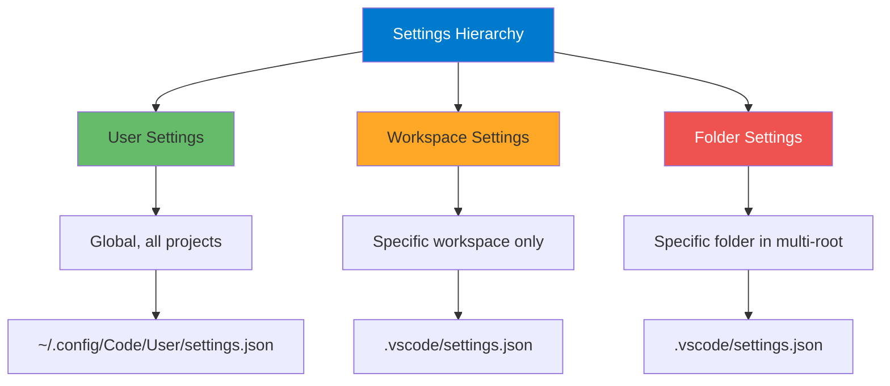

# Settings and Customization

## Learning Objectives

By the end of this module, you will:
- Master VS Code's three-tier settings system (User, Workspace, Folder)
- Configure settings via UI and JSON
- Create custom snippets for rapid code generation
- Set up language-specific configurations
- Optimize editor behavior for your workflow
- Understand settings sync and portability

## Core Concepts

### The Three-Tier Settings System



**Priority Order** (last wins):
1. Default Settings (VS Code built-in)
2. User Settings (your global preferences)
3. Workspace Settings (project-specific)
4. Folder Settings (multi-root workspace folders)

### Accessing Settings

**Method 1: UI**
```
Ctrl+, (Cmd+, on Mac)
```

**Method 2: JSON**
```
Ctrl+Shift+P → "Preferences: Open User Settings (JSON)"
Ctrl+Shift+P → "Preferences: Open Workspace Settings (JSON)"
```

**Method 3: Settings Search**
```
Ctrl+, → Type setting name in search
```

## Essential Settings Categories

### 1. Editor Configuration

**Complete Editor Settings Example:**

```json
{
  // Font & Typography
  "editor.fontFamily": "'Fira Code', 'Cascadia Code', 'JetBrains Mono', Consolas, monospace",
  "editor.fontSize": 14,
  "editor.fontLigatures": true,
  "editor.lineHeight": 22,
  "editor.letterSpacing": 0.5,

  // Visual Guides
  "editor.rulers": [80, 120],
  "editor.renderWhitespace": "boundary",
  "editor.renderControlCharacters": true,
  "editor.guides.bracketPairs": "active",
  "editor.bracketPairColorization.enabled": true,

  // Behavior
  "editor.tabSize": 2,
  "editor.insertSpaces": true,
  "editor.detectIndentation": true,
  "editor.wordWrap": "on",
  "editor.wordWrapColumn": 120,

  // Code Actions
  "editor.formatOnSave": true,
  "editor.formatOnPaste": false,
  "editor.codeActionsOnSave": {
    "source.fixAll": "explicit",
    "source.organizeImports": "explicit"
  },

  // IntelliSense
  "editor.quickSuggestions": {
    "other": true,
    "comments": true,
    "strings": true
  },
  "editor.suggestSelection": "first",
  "editor.inlineSuggest.enabled": true,
  "editor.acceptSuggestionOnCommitCharacter": true,

  // Minimap
  "editor.minimap.enabled": true,
  "editor.minimap.maxColumn": 120,
  "editor.minimap.renderCharacters": false,

  // Cursor & Selection
  "editor.cursorBlinking": "smooth",
  "editor.cursorSmoothCaretAnimation": "on",
  "editor.multiCursorModifier": "alt",
  "editor.selectionHighlight": true
}
```

### 2. Files & Auto-Save

```json
{
  // Auto-Save
  "files.autoSave": "onFocusChange", // Options: off, afterDelay, onFocusChange, onWindowChange
  "files.autoSaveDelay": 1000,

  // File Handling
  "files.trimTrailingWhitespace": true,
  "files.trimFinalNewlines": true,
  "files.insertFinalNewline": true,
  "files.eol": "\n", // Use LF on all platforms

  // File Associations
  "files.associations": {
    "*.jsx": "javascriptreact",
    "*.tsx": "typescriptreact",
    ".env.*": "dotenv",
    "Dockerfile.*": "dockerfile"
  },

  // Exclude from Explorer
  "files.exclude": {
    "**/.git": true,
    "**/.DS_Store": true,
    "**/node_modules": true,
    "**/__pycache__": true,
    "**/.pytest_cache": true,
    "**/dist": false, // false = can toggle visibility
    "**/build": false
  }
}
```

### 3. Workbench Appearance

```json
{
  // Theme
  "workbench.colorTheme": "One Dark Pro",
  "workbench.iconTheme": "material-icon-theme",
  "workbench.productIconTheme": "material-product-icons",

  // Layout
  "workbench.activityBar.location": "default", // or "top", "bottom", "hidden"
  "workbench.sideBar.location": "left",
  "workbench.panel.defaultLocation": "bottom",
  "workbench.editor.showTabs": "multiple",
  "workbench.editor.wrapTabs": true,

  // Behavior
  "workbench.startupEditor": "newUntitledFile",
  "workbench.editor.enablePreview": false, // Disable preview mode
  "workbench.editor.closeEmptyGroups": true,

  // Tree View
  "workbench.tree.indent": 12,
  "workbench.tree.renderIndentGuides": "always"
}
```

### 4. Terminal Configuration

```json
{
  "terminal.integrated.fontSize": 13,
  "terminal.integrated.fontFamily": "MesloLGS NF, Consolas, monospace",
  "terminal.integrated.lineHeight": 1.2,

  // Behavior
  "terminal.integrated.cursorBlinking": true,
  "terminal.integrated.cursorStyle": "line",
  "terminal.integrated.scrollback": 10000,

  // Shell Selection (per platform)
  "terminal.integrated.defaultProfile.windows": "PowerShell",
  "terminal.integrated.defaultProfile.osx": "zsh",
  "terminal.integrated.defaultProfile.linux": "bash",

  // Copy/Paste
  "terminal.integrated.copyOnSelection": true,
  "terminal.integrated.rightClickBehavior": "default"
}
```

### 5. Language-Specific Settings

**JavaScript/TypeScript:**
```json
{
  "[javascript]": {
    "editor.defaultFormatter": "esbenp.prettier-vscode",
    "editor.formatOnSave": true,
    "editor.codeActionsOnSave": {
      "source.fixAll.eslint": "explicit"
    }
  },
  "[typescript]": {
    "editor.defaultFormatter": "esbenp.prettier-vscode",
    "editor.formatOnSave": true
  },
  "[typescriptreact]": {
    "editor.defaultFormatter": "esbenp.prettier-vscode"
  },

  "javascript.updateImportsOnFileMove.enabled": "always",
  "typescript.updateImportsOnFileMove.enabled": "always",
  "javascript.suggest.autoImports": true,
  "typescript.suggest.autoImports": true
}
```

**Python:**
```json
{
  "[python]": {
    "editor.defaultFormatter": "ms-python.black-formatter",
    "editor.formatOnSave": true,
    "editor.codeActionsOnSave": {
      "source.organizeImports": "explicit"
    },
    "editor.rulers": [88, 120]
  },

  "python.languageServer": "Pylance",
  "python.analysis.typeCheckingMode": "basic",
  "python.analysis.autoImportCompletions": true,
  "python.linting.enabled": true,
  "python.linting.pylintEnabled": false,
  "python.linting.flake8Enabled": true,
  "python.formatting.provider": "none" // Use black-formatter extension
}
```

**Markdown:**
```json
{
  "[markdown]": {
    "editor.wordWrap": "on",
    "editor.quickSuggestions": {
      "comments": "on",
      "strings": "on",
      "other": "on"
    },
    "editor.formatOnSave": false,
    "editor.rulers": []
  },

  "markdown.preview.fontSize": 14,
  "markdown.preview.lineHeight": 1.6
}
```

## Custom Snippets

### Creating Snippets

**Access Snippets:**
```
Ctrl+Shift+P → "Configure User Snippets"
Select language or "New Global Snippets file"
```

### Example Snippets

**JavaScript/TypeScript Snippets:**

```json
{
  "Console Log": {
    "prefix": "clg",
    "body": [
      "console.log('$1:', $1);"
    ],
    "description": "Console log with label"
  },

  "Arrow Function": {
    "prefix": "af",
    "body": [
      "const ${1:functionName} = (${2:params}) => {",
      "  ${3:// function body}",
      "};"
    ],
    "description": "Arrow function"
  },

  "React Functional Component": {
    "prefix": "rfc",
    "body": [
      "import React from 'react';",
      "",
      "interface ${1:ComponentName}Props {",
      "  ${2:// props}",
      "}",
      "",
      "const ${1:ComponentName}: React.FC<${1:ComponentName}Props> = ({${3:props}}) => {",
      "  return (",
      "    <div>",
      "      ${4:// JSX}",
      "    </div>",
      "  );",
      "};",
      "",
      "export default ${1:ComponentName};"
    ],
    "description": "React functional component with TypeScript"
  },

  "Try-Catch Block": {
    "prefix": "try",
    "body": [
      "try {",
      "  ${1:// code}",
      "} catch (error) {",
      "  console.error('${2:Error message}:', error);",
      "  ${3:// error handling}",
      "}"
    ],
    "description": "Try-catch block"
  }
}
```

**Python Snippets:**

```json
{
  "Main Function": {
    "prefix": "main",
    "body": [
      "def main():",
      "    ${1:pass}",
      "",
      "",
      "if __name__ == '__main__':",
      "    main()"
    ],
    "description": "Python main function"
  },

  "Class Definition": {
    "prefix": "class",
    "body": [
      "class ${1:ClassName}:",
      "    \"\"\"${2:Class description}\"\"\"",
      "    ",
      "    def __init__(self${3:, args}):",
      "        \"\"\"Initialize ${1:ClassName}.\"\"\"",
      "        ${4:pass}",
      "    ",
      "    def ${5:method_name}(self${6:, args}):",
      "        \"\"\"${7:Method description}.\"\"\"",
      "        ${8:pass}"
    ],
    "description": "Python class with docstrings"
  },

  "Pytest Function": {
    "prefix": "test",
    "body": [
      "def test_${1:function_name}():",
      "    \"\"\"Test ${2:description}.\"\"\"",
      "    # Arrange",
      "    ${3:pass}",
      "    ",
      "    # Act",
      "    ${4:pass}",
      "    ",
      "    # Assert",
      "    assert ${5:condition}"
    ],
    "description": "Pytest test function"
  }
}
```

**Markdown Snippets:**

```json
{
  "Code Block": {
    "prefix": "code",
    "body": [
      "```${1:language}",
      "${2:code}",
      "```"
    ],
    "description": "Markdown code block"
  },

  "Mermaid Diagram": {
    "prefix": "mermaid",
    "body": [
      "```mermaid",
      "graph TD",
      "    A[${1:Start}] --> B[${2:Process}]",
      "    B --> C[${3:End}]",
      "```"
    ],
    "description": "Mermaid flowchart"
  },

  "Table": {
    "prefix": "table",
    "body": [
      "| ${1:Header 1} | ${2:Header 2} | ${3:Header 3} |",
      "|--------------|--------------|--------------|",
      "| ${4:Row 1 Col 1} | ${5:Row 1 Col 2} | ${6:Row 1 Col 3} |"
    ],
    "description": "Markdown table"
  }
}
```

### Snippet Variables

**Available Variables:**

| Variable | Description |
|----------|-------------|
| `$1`, `$2`, etc. | Tab stops |
| `$0` | Final cursor position |
| `${1:default}` | Tab stop with default value |
| `${1|option1,option2|}` | Tab stop with choices |
| `$TM_FILENAME` | Current filename |
| `$TM_FILENAME_BASE` | Filename without extension |
| `$TM_DIRECTORY` | Current directory |
| `$TM_FILEPATH` | Full file path |
| `$CLIPBOARD` | Clipboard contents |
| `$CURRENT_YEAR` | Current year |
| `$CURRENT_DATE` | Current date (YYYY-MM-DD) |

**Example with Variables:**

```json
{
  "File Header": {
    "prefix": "header",
    "body": [
      "/**",
      " * @file $TM_FILENAME",
      " * @description ${1:Description}",
      " * @author ${2:Your Name}",
      " * @date $CURRENT_DATE",
      " */"
    ],
    "description": "File header comment"
  }
}
```

## Workspace-Specific Configuration

### Creating a Workspace

**Method 1: Save Current Folder as Workspace**
```
File → Save Workspace As...
```

**Method 2: Multi-Root Workspace**
```json
// myproject.code-workspace
{
  "folders": [
    {
      "path": "./frontend",
      "name": "Frontend"
    },
    {
      "path": "./backend",
      "name": "Backend"
    },
    {
      "path": "./shared",
      "name": "Shared"
    }
  ],
  "settings": {
    "files.exclude": {
      "**/node_modules": true
    },
    "search.exclude": {
      "**/dist": true
    }
  },
  "extensions": {
    "recommendations": [
      "dbaeumer.vscode-eslint",
      "esbenp.prettier-vscode"
    ]
  }
}
```

### Project-Specific Settings Example

**Full-Stack Project (.vscode/settings.json):**

```json
{
  // Global project settings
  "files.exclude": {
    "**/.git": true,
    "**/node_modules": true,
    "**/__pycache__": true,
    "**/dist": true,
    "**/build": true
  },

  // Search exclusions
  "search.exclude": {
    "**/node_modules": true,
    "**/dist": true,
    "**/.next": true
  },

  // Language-specific for this project
  "[typescript]": {
    "editor.defaultFormatter": "esbenp.prettier-vscode",
    "editor.formatOnSave": true,
    "editor.codeActionsOnSave": {
      "source.organizeImports": "explicit",
      "source.fixAll.eslint": "explicit"
    }
  },

  "[python]": {
    "editor.defaultFormatter": "ms-python.black-formatter",
    "editor.rulers": [88]
  },

  // ESLint
  "eslint.workingDirectories": [
    "./frontend",
    "./backend"
  ],

  // Python
  "python.defaultInterpreterPath": "${workspaceFolder}/.venv/bin/python",
  "python.envFile": "${workspaceFolder}/.env",

  // Recommended extensions
  "extensions.recommendations": [
    "dbaeumer.vscode-eslint",
    "esbenp.prettier-vscode",
    "ms-python.python",
    "eamodio.gitlens"
  ]
}
```

## Advanced Customization

### Custom Color Theme Tweaks

**Override theme colors:**

```json
{
  "workbench.colorCustomizations": {
    // General UI
    "editor.background": "#1e1e1e",
    "editor.foreground": "#d4d4d4",
    "editorLineNumber.foreground": "#858585",
    "editorLineNumber.activeForeground": "#c6c6c6",

    // Syntax highlighting
    "editor.selectionBackground": "#264f78",
    "editor.inactiveSelectionBackground": "#3a3d41",

    // Git colors
    "gitDecoration.modifiedResourceForeground": "#e2c08d",
    "gitDecoration.deletedResourceForeground": "#c74e39",
    "gitDecoration.untrackedResourceForeground": "#73c991",

    // Terminal
    "terminal.background": "#1e1e1e",
    "terminal.foreground": "#d4d4d4",

    // Specific to theme
    "[One Dark Pro]": {
      "editor.background": "#21252b"
    }
  },

  "editor.tokenColorCustomizations": {
    "comments": "#6A9955",
    "strings": "#CE9178",
    "keywords": "#C586C0",
    "functions": "#DCDCAA"
  }
}
```

### Task Configurations

**Create tasks.json for custom commands:**

```json
// .vscode/tasks.json
{
  "version": "2.0.0",
  "tasks": [
    {
      "label": "Build Project",
      "type": "shell",
      "command": "npm run build",
      "group": {
        "kind": "build",
        "isDefault": true
      },
      "problemMatcher": ["$tsc"]
    },
    {
      "label": "Run Tests",
      "type": "shell",
      "command": "npm test",
      "group": {
        "kind": "test",
        "isDefault": true
      }
    },
    {
      "label": "Start Dev Server",
      "type": "shell",
      "command": "npm run dev",
      "isBackground": true,
      "problemMatcher": {
        "pattern": {
          "regexp": "^.*$",
          "file": 1,
          "location": 2,
          "message": 3
        },
        "background": {
          "activeOnStart": true,
          "beginsPattern": ".*starting.*",
          "endsPattern": ".*ready.*"
        }
      }
    }
  ]
}
```

**Run tasks:**
```
Ctrl+Shift+P → "Tasks: Run Task"
Or: Ctrl+Shift+B (default build task)
```

## Pro Tips

### Tip 1: Settings Search is Powerful

```
Ctrl+, → Type: "font" → See all font-related settings
Ctrl+, → Type: "@modified" → See only settings you've changed
Ctrl+, → Type: "@ext:eamodio.gitlens" → See extension-specific settings
```

### Tip 2: Sync Settings Across Machines

**Enable Settings Sync:**
```
Ctrl+Shift+P → "Settings Sync: Turn On"
Choose what to sync:
  ✅ Settings
  ✅ Keyboard Shortcuts
  ✅ Extensions
  ✅ Snippets
  ✅ UI State
```

### Tip 3: Export/Import Settings

**Export all settings:**
```bash
# Copy settings file
cp ~/.config/Code/User/settings.json ~/my-vscode-settings.json

# Or on Windows
copy %APPDATA%\Code\User\settings.json my-vscode-settings.json
```

**Share with team:**
```bash
# In project root
cp ~/my-vscode-settings.json .vscode/settings.json
git add .vscode/settings.json
git commit -m "Add team VS Code settings"
```

### Tip 4: Use Profiles (VS Code 1.75+)

**Create profiles for different workflows:**

```
1. Ctrl+Shift+P → "Profiles: Create Profile"
2. Name: "Web Development"
3. Choose settings/extensions to include
4. Switch profiles: Bottom left icon
```

**Example Profiles:**
- **Web Dev**: React, ESLint, Prettier, GitLens
- **Python**: Python, Jupyter, Black, Pylance
- **Writing**: Markdown extensions, Grammarly, minimal UI
- **Minimal**: No extensions, fast startup

### Tip 5: Keybinding for Quick Settings

```json
// keybindings.json
[
  {
    "key": "ctrl+shift+,",
    "command": "workbench.action.openSettingsJson"
  }
]
```

## Common Pitfalls

### Pitfall 1: Workspace Settings Override User Settings

**Problem**: Changes not applying
**Solution**: Check workspace settings

```
1. Ctrl+Shift+P → "Preferences: Open Workspace Settings (JSON)"
2. Look for conflicting settings
3. Remove from workspace if should be user-level
```

### Pitfall 2: Extensions Fighting Over Formatting

**Problem**: Inconsistent formatting
**Solution**: Explicit formatter per language

```json
{
  "[javascript]": {
    "editor.defaultFormatter": "esbenp.prettier-vscode"
  },
  // Not this:
  "editor.defaultFormatter": "esbenp.prettier-vscode"
}
```

### Pitfall 3: Sync Issues Between Platforms

**Problem**: Settings don't work on different OS
**Solution**: Platform-specific settings

```json
{
  "terminal.integrated.defaultProfile.windows": "PowerShell",
  "terminal.integrated.defaultProfile.osx": "zsh",
  "terminal.integrated.defaultProfile.linux": "bash",

  "editor.fontFamily": "Fira Code",
  // Override on Windows if needed
  "[windows]": {
    "editor.fontFamily": "Consolas"
  }
}
```

### Pitfall 4: Too Many Custom Colors

**Problem**: Unreadable theme
**Solution**: Minimal customization

```json
// Instead of 50 color overrides, just tweak key ones:
{
  "workbench.colorCustomizations": {
    "editor.background": "#1e1e1e",
    "terminal.background": "#1e1e1e"
    // That's it!
  }
}
```

### Pitfall 5: Not Using .editorconfig

**Problem**: Team has different indentation
**Solution**: Use .editorconfig

```ini
# .editorconfig
root = true

[*]
charset = utf-8
end_of_line = lf
insert_final_newline = true
trim_trailing_whitespace = true

[*.{js,ts,jsx,tsx}]
indent_style = space
indent_size = 2

[*.py]
indent_style = space
indent_size = 4

[*.md]
trim_trailing_whitespace = false
```

VS Code respects .editorconfig automatically!

## Assessment

### Knowledge Check

**Question 1**: What's the priority order of settings?

<details>
<summary>Answer</summary>
1. Default (lowest priority)
2. User Settings
3. Workspace Settings
4. Folder Settings (highest priority)

Last setting wins!
</details>

**Question 2**: How do you make a snippet available in all file types?

<details>
<summary>Answer</summary>
Create a global snippets file:
`Ctrl+Shift+P → "Configure User Snippets" → "New Global Snippets file"`
</details>

**Question 3**: What's the difference between workspace and folder settings?

<details>
<summary>Answer</summary>
- **Workspace**: Settings for entire workspace (can be multi-root), stored in .code-workspace file
- **Folder**: Settings for specific folder in multi-root workspace, stored in folder's .vscode/settings.json
</details>

### Practical Exercise

**Create Your Perfect Environment:**

1. **Configure Editor:**
   - Choose font and size
   - Enable ligatures
   - Set rulers at 80 and 120
   - Enable bracket colorization

2. **Set Up Auto-Save:**
   - Enable auto-save on focus change
   - Trim trailing whitespace
   - Insert final newline

3. **Create Snippets:**
   - Create 5 snippets for your most common patterns
   - Use tab stops and variables
   - Test each snippet

4. **Project Settings:**
   - Create .vscode/settings.json
   - Configure language-specific formatters
   - Add file exclusions
   - List recommended extensions

**Success Criteria:**
- [ ] Settings synced across machines
- [ ] Snippets work and save time
- [ ] Formatters configured per language
- [ ] Team settings documented

## Next Steps

You've mastered VS Code settings! Next:
- **Module 5**: Git integration
- **Module 10**: Profiles for workflow-specific configurations

## Additional Resources

- [VS Code Settings Reference](https://code.visualstudio.com/docs/getstarted/settings)
- [Snippet Syntax Guide](https://code.visualstudio.com/docs/editor/userdefinedsnippets)
- [EditorConfig](https://editorconfig.org/)

---

**Estimated Time to Complete**: 3-4 hours
**Difficulty**: Intermediate
**Prerequisites**: Modules 1-3
