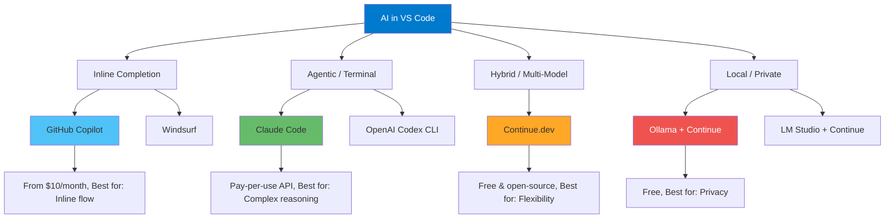

# AI Coding Assistants Integration

## Learning Objectives

- Master multiple AI coding assistants in VS Code
- Understand when to use each AI tool and why
- Configure Claude Code, GitHub Copilot, and Continue.dev for maximum productivity
- Implement privacy-conscious AI workflows
- Build custom AI-powered development environments
- Integrate local and cloud AI models

## The AI Landscape in VS Code (2026)


```mermaid
graph TD
    A[AI in VS Code] --> B[Inline Completion]
    A --> C[Agentic / Terminal]
    A --> D[Hybrid / Multi-Model]
    A --> E[Local / Private]

    B --> F[GitHub Copilot]
    B --> G[Windsurf]

    C --> H[Claude Code]
    C --> I[OpenAI Codex CLI]

    D --> J[Continue.dev]

    E --> K[Ollama + Continue]
    E --> L[LM Studio + Continue]

    F --> M[From $10/month, Best for: Inline flow]
    H --> N[Pay-per-use API, Best for: Complex reasoning]
    J --> O[Free & open-source, Best for: Flexibility]
    K --> P[Free, Best for: Privacy]

    style A fill:#007acc,color:#fff
    style F fill:#4fc3f7
    style H fill:#66bb6a
    style J fill:#ffa726
    style K fill:#ef5350,color:#fff
```

## GitHub Copilot (Inline Completion Standard)

### Installation & Setup

```bash
code --install-extension GitHub.copilot
code --install-extension GitHub.copilot-chat
```

**Authentication:**
```
1. Click Copilot icon in status bar
2. Sign in with GitHub account
3. Authorise VS Code
4. Subscription required (from $10/month, free for students/OSS maintainers)
5. Check github.com/features/copilot for current plans
```

### Core Features

#### 1. Inline Code Completion

**How it works:**
```javascript
// Start typing or write a comment:
// Function to calculate fibonacci sequence

// Copilot suggests:
function fibonacci(n) {
  if (n <= 1) return n;
  return fibonacci(n - 1) + fibonacci(n - 2);
}

// Press Tab to accept
// Or Ctrl+→ to accept word-by-word
```

**Trigger Suggestions:**
```
- Type function name → Suggestions appear
- Write comment → Implementation suggested
- Start pattern → Continuation suggested
```

**Navigate Suggestions:**
```
Alt+] → Next suggestion
Alt+[ → Previous suggestion
Tab → Accept suggestion
Ctrl+→ → Accept next word
Esc → Dismiss
```

#### 2. Copilot Chat

**Open Chat:**
```
Ctrl+I → Inline chat
Or: Sidebar → Copilot Chat icon
```

**Chat Commands:**
```
@workspace → Include workspace context
/explain → Explain selected code
/fix → Fix problems in code
/tests → Generate tests
/doc → Generate documentation
/clear → Clear chat history
```

**Example Workflow:**
```
1. Select complex function
2. Ctrl+I
3. Type: "/explain in simple terms"
4. Copilot explains the code
5. Type: "/tests with edge cases"
6. Copilot generates tests
```

#### 3. Generate Tests

```javascript
// Select this function:
function validateEmail(email) {
  const regex = /^[^\s@]+@[^\s@]+\.[^\s@]+$/;
  return regex.test(email);
}

// Right-click → "Copilot: Generate Tests"
// Or: Ctrl+I → "/tests"

// Copilot generates:
describe('validateEmail', () => {
  it('should return true for valid email', () => {
    expect(validateEmail('test@example.com')).toBe(true);
  });

  it('should return false for invalid email', () => {
    expect(validateEmail('invalid')).toBe(false);
  });

  it('should handle email with subdomain', () => {
    expect(validateEmail('user@mail.company.com')).toBe(true);
  });
});
```

#### 4. Documentation Generation

```python
# Select function:
def calculate_discount(price, discount_percent, is_member):
    if is_member:
        discount_percent += 5
    return price * (1 - discount_percent / 100)

# Ctrl+I → "/doc"

# Copilot adds:
def calculate_discount(price, discount_percent, is_member):
    """
    Calculate the final price after applying a discount.

    Args:
        price (float): The original price of the item
        discount_percent (float): The discount percentage to apply
        is_member (bool): Whether the customer is a member (adds 5% extra discount)

    Returns:
        float: The final price after discount

    Example:
        >>> calculate_discount(100, 10, True)
        85.0
    """
    if is_member:
        discount_percent += 5
    return price * (1 - discount_percent / 100)
```

### Copilot Configuration

```json
{
  // Enable/disable Copilot
  "github.copilot.enable": {
    "*": true,
    "yaml": false,
    "plaintext": false,
    "markdown": false
  },

  // Inline suggestions
  "github.copilot.editor.enableAutoCompletions": true,

  // Advanced
  "github.copilot.advanced": {
    "debug.overrideEngine": "default",
    "debug.testOverrideProxyUrl": "",
    "debug.overrideProxyUrl": ""
  }
}
```

## Claude Code (Agentic Terminal Assistant)

### What is Claude Code?

Claude Code is Anthropic's agentic coding tool. Unlike traditional editor extensions, it runs in your terminal and operates on your entire codebase — reading files, making edits, running commands, and reasoning through complex multi-step tasks. It works brilliantly inside VS Code's integrated terminal.

### Installation & Setup

```bash
# Install globally
npm install -g @anthropic-ai/claude-code

# Set your API key
export ANTHROPIC_API_KEY="sk-ant-..."   # from console.anthropic.com

# Start a session in your project
cd your-project
claude
```

**Also available as:** desktop app (Mac/Windows), web app (claude.ai/code), and IDE extensions (VS Code, JetBrains).

### Core Features

#### 1. Agentic Codebase Interaction

Claude Code reads your project structure, understands context, and makes changes directly:

```
You: "Add input validation to all API endpoints in src/routes/"

Claude Code:
1. Scans src/routes/ to find all endpoint files
2. Analyses existing patterns
3. Adds Zod validation schemas
4. Updates each route handler
5. Shows you a diff of every change
```

#### 2. Terminal Integration

```
# Run Claude Code in VS Code terminal (Ctrl+`)
claude

# Or give it a one-shot task
claude "explain the authentication flow in this project"
claude "find and fix the bug causing test failures"
```

#### 3. Project Configuration (CLAUDE.md)

Create a `CLAUDE.md` file in your project root to give Claude Code persistent context:

```markdown
# Project Context
This is a React + Express application.
Use TypeScript strict mode. Follow ESLint rules.
Tests use Vitest. Run `npm test` to verify changes.
```

#### 4. Slash Commands and Workflows

```
/fast         → Switch to faster model for quick tasks
/compact      → Summarise conversation to save context
/init         → Generate a CLAUDE.md for your project
/review       → Review code changes
```

#### 5. MCP Server Integration

Claude Code supports the Model Context Protocol (MCP), allowing it to connect to external tools, databases, and services as context sources.

#### 6. Subagents

For complex tasks, Claude Code can spawn focused subagents that work on specific subtasks in parallel, then synthesise the results.

### When to Use Claude Code

```
Complex refactoring across many files    → Claude Code
Understanding unfamiliar codebase        → Claude Code
Multi-step tasks (build feature + tests) → Claude Code
Quick inline completion while typing     → Use Copilot instead
```

### Configuration

**Cost:** Pay-per-use via the Anthropic API. Powered by Claude Opus by default; use `/fast` for quicker, cheaper responses with Claude Sonnet. Also included with the Max subscription plan. Check [console.anthropic.com](https://console.anthropic.com) for current rates.

---

## Continue.dev (Flexible & Open Source)

### Installation

```bash
code --install-extension Continue.continue
```

### Why Continue?

**Advantages:**
- Free and fully open-source
- Connect any model: Claude, GPT, Gemini, Ollama (local), and more
- Tab autocomplete with configurable models
- Full code context awareness with `@` references
- Local model support for complete privacy
- Customisable system prompts and slash commands

### Configuration

**Access Config:**
```
Ctrl+Shift+P → "Continue: Open config.json"
```

**Multi-Model Setup (2026):**
```json
{
  "models": [
    {
      "title": "Claude Sonnet 4.6",
      "provider": "anthropic",
      "model": "claude-sonnet-4-6",
      "apiKey": "sk-ant-..."
    },
    {
      "title": "GPT-4o",
      "provider": "openai",
      "model": "gpt-4o",
      "apiKey": "sk-..."
    },
    {
      "title": "Gemini 2.5 Flash",
      "provider": "gemini",
      "model": "gemini-2.5-flash",
      "apiKey": "AIza..."
    },
    {
      "title": "Local Llama 3",
      "provider": "ollama",
      "model": "llama3:8b"
    }
  ],
  "tabAutocompleteModel": {
    "title": "Codestral",
    "provider": "ollama",
    "model": "codestral:latest"
  },
  "embeddingsProvider": {
    "provider": "ollama",
    "model": "nomic-embed-text"
  }
}
```

### Features

#### 1. Chat with Context

**Open Chat:**
```
Ctrl+L → Open Continue chat
```

**Add Context:**
```
@file → Reference specific file
@folder → Reference entire folder
@code → Reference selected code
@docs → Search documentation
@web → Search web
```

**Example:**
```
You: "Refactor @file UserController.ts to use async/await instead of promises"

Continue: Shows refactored code with explanations
```

#### 2. Inline Editing

**Quick Edit:**
```
1. Select code
2. Ctrl+I
3. Type instruction
4. Continue modifies code inline
```

**Example:**
```javascript
// Select this:
function getUserData(userId) {
  return fetch(`/api/users/${userId}`)
    .then(res => res.json())
    .catch(err => console.error(err));
}

// Ctrl+I → "Convert to async/await with error handling"

// Result:
async function getUserData(userId) {
  try {
    const res = await fetch(`/api/users/${userId}`);
    return await res.json();
  } catch (err) {
    console.error('Failed to fetch user data:', err);
    throw err;
  }
}
```

#### 3. Model Selection

**Switch Models Mid-Chat:**
```
1. In chat, click model dropdown
2. Select different model
3. Previous context maintained
```

**When to use which model:**
```
Claude Sonnet/Opus: Complex reasoning, refactoring, documentation
GPT-4o: General coding, analysis
Gemini: Research, large context windows
Local (Ollama): Privacy, offline work, cost-free iteration
```

#### 4. Slash Commands

```
/edit → Edit selected code
/comment → Add comments
/share → Share chat
/cmd → Generate shell command
```

## Local AI with Ollama

### Setup Ollama

**Install Ollama:**
```bash
# macOS/Linux
curl -fsSL https://ollama.com/install.sh | sh

# Windows
# Download from ollama.com
```

**Install Models:**
```bash
# Code completion
ollama pull codestral
ollama pull qwen2.5-coder:7b

# Chat
ollama pull llama3:8b
ollama pull mistral:7b

# Embeddings (for context)
ollama pull nomic-embed-text
```

**Verify:**
```bash
ollama list
# Should show installed models
```

### Configure Continue for Ollama

```json
{
  "models": [
    {
      "title": "Llama 3 8B",
      "provider": "ollama",
      "model": "llama3:8b"
    },
    {
      "title": "Qwen 2.5 Coder",
      "provider": "ollama",
      "model": "qwen2.5-coder:7b"
    }
  ],
  "tabAutocompleteModel": {
    "title": "Codestral",
    "provider": "ollama",
    "model": "codestral:latest"
  }
}
```

**Benefits:**
- ✅ Complete privacy (no data leaves your machine)
- ✅ Works offline
- ✅ No usage costs
- ✅ Customizable models

**Requirements:**
- 16GB+ RAM
- GPU recommended (NVIDIA, Apple Silicon)
- ~10GB disk space per model

## Other Notable AI Tools (2026)

### Cursor AI

A VS Code fork with AI deeply integrated into every interaction. If you want AI built into the editor itself rather than added via extensions, Cursor is worth evaluating.

```
Type: Standalone editor (VS Code fork)
Cost: From $20/month
Best for: Developers who want AI-native editing
Website: cursor.com
```

### Windsurf (formerly Codeium)

AI coding assistant with inline completions and chat, positioned as a more affordable Copilot alternative.

```
Type: VS Code extension + standalone editor
Cost: From $10-15/month (free tier available)
Best for: Budget-conscious developers wanting inline AI
```

### Aider

Free, open-source terminal-based AI pair programmer. Like Claude Code, it runs in the terminal and makes direct edits to your files.

```
Type: Terminal tool (open-source)
Cost: Free (bring your own API key)
Best for: Open-source enthusiasts, terminal-first developers
Website: aider.chat
```

### OpenAI Codex CLI

OpenAI's open-source terminal coding agent, similar in concept to Claude Code.

```
Type: Terminal tool (open-source)
Cost: Free (uses OpenAI API)
Best for: Developers already using OpenAI APIs
Repository: github.com/openai/codex
```

### Choosing Your AI Stack

There is no single "best" tool — the strongest approach combines complementary tools:

| Need | Recommended Tool |
|------|-----------------|
| Inline completions while typing | GitHub Copilot |
| Complex multi-file tasks | Claude Code |
| Flexible model switching | Continue.dev |
| Complete privacy (offline) | Ollama + Continue |
| AI-native editor experience | Cursor |

## AI-Powered Workflows

### Workflow 1: Feature Development


```mermaid
graph LR
    A[Write Comment] --> B[Copilot Suggests Implementation]
    B --> C[Review & Refine]
    C --> D[Generate Tests]
    D --> E[Add Documentation]
    E --> F[Commit]

    style A fill:#42a5f5
    style D fill:#66bb6a
    style F fill:#ffa726
```

**Steps:**
```
1. Write function signature + comment
   // Function to validate user registration data

2. Accept Copilot inline suggestion (Tab)

3. Refine with Claude Code (in terminal):
   claude "add phone number validation to the registration function"

4. Generate tests with Copilot Chat:
   Ctrl+I → "/tests with edge cases"

5. Add docs:
   Ctrl+I → "/doc in JSDoc format"

6. Commit with AI-generated message:
   In Source Control, click the sparkle icon for Copilot commit message
```

### Workflow 2: Code Review

```
1. Select unfamiliar code
2. Ctrl+I → "/explain"
3. Ask follow-ups in chat
4. Request improvements: "How can this be optimized?"
5. Apply suggestions
```

### Workflow 3: Bug Fixing

```
1. In Claude Code terminal: paste the error message or describe the bug
2. Claude Code reads the relevant files and diagnoses the issue
3. It proposes and applies a fix directly
4. Or use Continue chat: Ctrl+L → "Why am I getting this error? @file ErrorComponent.tsx"
5. Generate test to prevent regression
```

### Workflow 4: Learning New Technology

```
1. Continue chat: "How do I use React hooks for state management?"
2. Get explanation
3. "Show me an example with @code MyComponent"
4. Modify example for your use case
5. "Add error handling"
6. Iterate until working
```

## Privacy & Security

### Data Handling by Provider

| Provider | Data Sent | Retained | Training | Privacy |
|----------|-----------|----------|----------|---------|
| **GitHub Copilot** | Code snippets | For debugging only | No* | Medium |
| **Claude Code (API)** | Code + prompts | Not used for training by default | No (see data policy) | Medium-High |
| **Continue (Cloud)** | Code + prompts | Varies by model provider | Depends on API provider | Medium |
| **Continue (Ollama)** | Nothing | All local | Optional | High |

*GitHub states they do not train on your code for Copilot Business/Enterprise plans. Check current policies for individual plans.

### Best Practices

**For Sensitive Code:**
```json
// Disable AI for specific files/folders
{
  "github.copilot.enable": {
    "*": true,
    "**/.env": false,
    "**/secrets/**": false,
    "**/config/credentials.ts": false
  }
}
```

**Use .copilotignore:**
```
# .copilotignore
.env
.env.*
secrets/
config/api-keys.json
```

**Local-First Setup:**
```json
// Use Ollama for maximum privacy
{
  "models": [
    {
      "title": "Local Only",
      "provider": "ollama",
      "model": "codellama:13b"
    }
  ]
}
```

## Pro Tips

### Tip 1: Context is Everything

```
Bad: "Fix this function"
Good: "Refactor @file UserService.ts to use dependency injection pattern, ensuring compatibility with @file DIContainer.ts"
```

### Tip 2: Iterative Refinement

```
Don't expect perfect code first time:
1. Get initial suggestion
2. Refine: "Add error handling"
3. Refine: "Add logging"
4. Refine: "Add type safety"
5. Now it's production-ready
```

### Tip 3: Use Multiple AI Tools Together

```
Copilot: Quick inline completions while typing
Claude Code: Complex multi-file tasks, agentic workflows
Continue: Flexible model switching, inline chat
Local (Ollama): Sensitive code, offline work
```

### Tip 4: Custom Instructions

**Create .continuerc.json in project:**
```json
{
  "systemMessage": "You are an expert in React, TypeScript, and Node.js. Always provide type-safe solutions with error handling. Follow the project's ESLint config."
}
```

### Tip 5: Keyboard Shortcuts

```json
// keybindings.json
[
  {
    "key": "ctrl+shift+a",
    "command": "github.copilot.generate"
  },
  {
    "key": "ctrl+shift+c",
    "command": "continue.continueGUIView.focus"
  },
  {
    "key": "ctrl+shift+e",
    "command": "continue.sendMainUserInput",
    "args": "/explain"
  }
]
```

## Common Pitfalls

### Pitfall 1: Blindly Accepting Suggestions

**Problem**: AI suggestions may have bugs or security issues
**Solution**: Always review AI-generated code

```
✅ Do:
- Read every line
- Test thoroughly
- Check for security issues
- Verify logic

❌ Don't:
- Tab through without reading
- Trust AI for security-critical code
- Skip testing
```

### Pitfall 2: Over-Reliance on AI

**Problem**: Not learning fundamentals
**Solution**: Use AI as a teacher, not a crutch

```
Instead of: "Write entire authentication system"
Do: "Explain JWT authentication flow"
Then: Implement yourself, using AI for specific parts
```

### Pitfall 3: Privacy Leaks

**Problem**: Sending API keys/secrets to AI
**Solution**: Disable AI in sensitive files

```json
{
  "github.copilot.enable": {
    "**/.env": false,
    "**/secrets": false
  }
}
```

### Pitfall 4: Conflicting AI Tools

**Problem**: Multiple autocomplete tools fighting
**Solution**: Choose one primary autocomplete

```
Either: Copilot autocomplete
Or: Continue autocomplete
Or: Cody autocomplete
Not all three at once!
```

### Pitfall 5: Not Providing Context

**Problem**: Generic, unhelpful responses
**Solution**: Use @ mentions and context

```
Bad: "How do I handle errors?"
Good: "How should I handle errors in @file PaymentService.ts following the pattern in @file ErrorHandler.ts?"
```

## Assessment

### Knowledge Check

**Question 1**: What is the difference between GitHub Copilot, Claude Code, and Continue.dev?

<details>
<summary>Answer</summary>
- **Copilot**: Closed-source extension, from $10/month, best inline code completion, deep GitHub integration
- **Claude Code**: Standalone terminal agent, pay-per-use API, best for complex multi-file reasoning and agentic tasks
- **Continue.dev**: Open-source extension, free, supports multiple models (including local via Ollama), most flexible and customisable
</details>

**Question 2**: How do you prevent AI from seeing sensitive code?

<details>
<summary>Answer</summary>
1. Disable AI for specific patterns in settings
2. Create .copilotignore file
3. Use local AI (Ollama) for sensitive projects
4. Review settings: `github.copilot.enable` with file patterns
</details>

**Question 3**: When should you use local AI vs cloud AI?

<details>
<summary>Answer</summary>
**Local (Ollama):**
- Sensitive/proprietary code
- Offline work
- No ongoing costs
- Have GPU/16GB+ RAM

**Cloud:**
- Need latest/best models
- Limited hardware
- Quick setup
- Collaborative work
</details>

### Practical Exercise

**Build an AI-Enhanced Feature:**

1. **Setup:**
   - Install Copilot or Continue
   - Configure for your language

2. **Develop Feature:**
   - Write comment describing feature
   - Accept AI suggestion
   - Refine with chat

3. **Generate Tests:**
   - Use `/tests` command
   - Add edge cases manually

4. **Document:**
   - Generate docs with `/doc`
   - Review and improve

5. **Review:**
   - Explain code to yourself
   - Ask AI to review
   - Apply suggestions

**Success Criteria:**
- [ ] Working, tested feature
- [ ] Complete documentation
- [ ] No security issues
- [ ] You understand every line

## Next Steps

Master AI integration! Next:
- **Module 12**: Advanced editing with AI
- **Module 6**: Remote AI workflows

## Additional Resources

- [GitHub Copilot Docs](https://docs.github.com/en/copilot)
- [Claude Code Documentation](https://docs.anthropic.com/en/docs/claude-code)
- [Continue.dev Documentation](https://continue.dev/docs)
- [Ollama Models](https://ollama.com/library)
- [Aider Documentation](https://aider.chat/)
- [Cursor AI](https://cursor.com)

---

**Estimated Time**: 4-5 hours
**Difficulty**: Intermediate to Advanced
**Prerequisites**: Modules 1-4, coding experience
