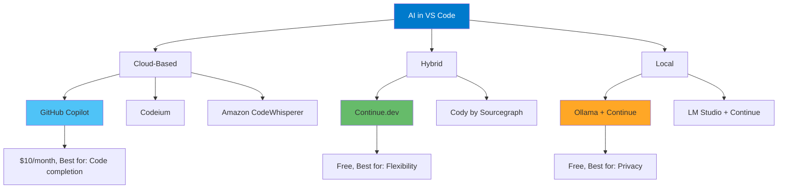

# AI Coding Assistants Integration

## Learning Objectives

- Master multiple AI coding assistants in VS Code
- Understand when to use each AI tool
- Configure AI assistants for maximum productivity
- Implement privacy-conscious AI workflows
- Build custom AI-powered development environments
- Integrate local and cloud AI models

## The AI Revolution in VS Code



## GitHub Copilot (Industry Standard)

### Installation & Setup

```bash
code --install-extension GitHub.copilot
code --install-extension GitHub.copilot-chat
```

**Authentication:**
```
1. Click Copilot icon in status bar
2. Sign in with GitHub account
3. Authorize VS Code
4. Subscription required ($10/month, $100/year, or free for students/open-source)
```

### Core Features

#### 1. Inline Code Completion

**How it works:**
```javascript
// Start typing or write a comment:
// Function to calculate fibonacci sequence

// Copilot suggests:
function fibonacci(n) {
  if (n <= 1) return n;
  return fibonacci(n - 1) + fibonacci(n - 2);
}

// Press Tab to accept
// Or Ctrl+→ to accept word-by-word
```

**Trigger Suggestions:**
```
- Type function name → Suggestions appear
- Write comment → Implementation suggested
- Start pattern → Continuation suggested
```

**Navigate Suggestions:**
```
Alt+] → Next suggestion
Alt+[ → Previous suggestion
Tab → Accept suggestion
Ctrl+→ → Accept next word
Esc → Dismiss
```

#### 2. Copilot Chat

**Open Chat:**
```
Ctrl+I → Inline chat
Or: Sidebar → Copilot Chat icon
```

**Chat Commands:**
```
@workspace → Include workspace context
/explain → Explain selected code
/fix → Fix problems in code
/tests → Generate tests
/doc → Generate documentation
/clear → Clear chat history
```

**Example Workflow:**
```
1. Select complex function
2. Ctrl+I
3. Type: "/explain in simple terms"
4. Copilot explains the code
5. Type: "/tests with edge cases"
6. Copilot generates tests
```

#### 3. Generate Tests

```javascript
// Select this function:
function validateEmail(email) {
  const regex = /^[^\s@]+@[^\s@]+\.[^\s@]+$/;
  return regex.test(email);
}

// Right-click → "Copilot: Generate Tests"
// Or: Ctrl+I → "/tests"

// Copilot generates:
describe('validateEmail', () => {
  it('should return true for valid email', () => {
    expect(validateEmail('test@example.com')).toBe(true);
  });

  it('should return false for invalid email', () => {
    expect(validateEmail('invalid')).toBe(false);
  });

  it('should handle email with subdomain', () => {
    expect(validateEmail('user@mail.company.com')).toBe(true);
  });
});
```

#### 4. Documentation Generation

```python
# Select function:
def calculate_discount(price, discount_percent, is_member):
    if is_member:
        discount_percent += 5
    return price * (1 - discount_percent / 100)

# Ctrl+I → "/doc"

# Copilot adds:
def calculate_discount(price, discount_percent, is_member):
    """
    Calculate the final price after applying a discount.

    Args:
        price (float): The original price of the item
        discount_percent (float): The discount percentage to apply
        is_member (bool): Whether the customer is a member (adds 5% extra discount)

    Returns:
        float: The final price after discount

    Example:
        >>> calculate_discount(100, 10, True)
        85.0
    """
    if is_member:
        discount_percent += 5
    return price * (1 - discount_percent / 100)
```

### Copilot Configuration

```json
{
  // Enable/disable Copilot
  "github.copilot.enable": {
    "*": true,
    "yaml": false,
    "plaintext": false,
    "markdown": false
  },

  // Inline suggestions
  "github.copilot.editor.enableAutoCompletions": true,

  // Advanced
  "github.copilot.advanced": {
    "debug.overrideEngine": "default",
    "debug.testOverrideProxyUrl": "",
    "debug.overrideProxyUrl": ""
  }
}
```

## Continue.dev (Flexible & Powerful)

### Installation

```bash
code --install-extension Continue.continue
```

### Why Continue?

**Advantages:**
- Multiple model support (OpenAI, Anthropic, Ollama, etc.)
- Free and open-source
- Full code context awareness
- Local model support
- Customizable

### Configuration

**Access Config:**
```
Ctrl+Shift+P → "Continue: Open config.json"
```

**Multi-Model Setup:**
```json
{
  "models": [
    {
      "title": "GPT-4 Turbo",
      "provider": "openai",
      "model": "gpt-4-turbo-preview",
      "apiKey": "sk-..."
    },
    {
      "title": "Claude Opus",
      "provider": "anthropic",
      "model": "claude-3-opus-20240229",
      "apiKey": "sk-ant-..."
    },
    {
      "title": "Gemini Pro",
      "provider": "gemini",
      "model": "gemini-pro",
      "apiKey": "AIza..."
    },
    {
      "title": "Local Llama",
      "provider": "ollama",
      "model": "codellama:13b"
    }
  ],
  "tabAutocompleteModel": {
    "title": "Codestral",
    "provider": "ollama",
    "model": "codestral:latest"
  },
  "embeddingsProvider": {
    "provider": "ollama",
    "model": "nomic-embed-text"
  }
}
```

### Features

#### 1. Chat with Context

**Open Chat:**
```
Ctrl+L → Open Continue chat
```

**Add Context:**
```
@file → Reference specific file
@folder → Reference entire folder
@code → Reference selected code
@docs → Search documentation
@web → Search web
```

**Example:**
```
You: "Refactor @file UserController.ts to use async/await instead of promises"

Continue: Shows refactored code with explanations
```

#### 2. Inline Editing

**Quick Edit:**
```
1. Select code
2. Ctrl+I
3. Type instruction
4. Continue modifies code inline
```

**Example:**
```javascript
// Select this:
function getUserData(userId) {
  return fetch(`/api/users/${userId}`)
    .then(res => res.json())
    .catch(err => console.error(err));
}

// Ctrl+I → "Convert to async/await with error handling"

// Result:
async function getUserData(userId) {
  try {
    const res = await fetch(`/api/users/${userId}`);
    return await res.json();
  } catch (err) {
    console.error('Failed to fetch user data:', err);
    throw err;
  }
}
```

#### 3. Model Selection

**Switch Models Mid-Chat:**
```
1. In chat, click model dropdown
2. Select different model
3. Previous context maintained
```

**When to use which:**
```
GPT-4: Complex refactoring, architecture
Claude: Writing docs, explanations
Gemini: Research, analysis
Local: Privacy, offline work
```

#### 4. Slash Commands

```
/edit → Edit selected code
/comment → Add comments
/share → Share chat
/cmd → Generate shell command
```

## Local AI with Ollama

### Setup Ollama

**Install Ollama:**
```bash
# macOS/Linux
curl -fsSL https://ollama.com/install.sh | sh

# Windows
# Download from ollama.com
```

**Install Models:**
```bash
# Code completion
ollama pull codellama:13b
ollama pull codestral

# Chat
ollama pull llama3:8b
ollama pull mixtral:8x7b

# Embeddings (for context)
ollama pull nomic-embed-text
```

**Verify:**
```bash
ollama list
# Should show installed models
```

### Configure Continue for Ollama

```json
{
  "models": [
    {
      "title": "CodeLlama 13B",
      "provider": "ollama",
      "model": "codellama:13b"
    },
    {
      "title": "Mixtral 8x7B",
      "provider": "ollama",
      "model": "mixtral:8x7b"
    }
  ],
  "tabAutocompleteModel": {
    "title": "Codestral",
    "provider": "ollama",
    "model": "codestral:latest"
  }
}
```

**Benefits:**
- ✅ Complete privacy (no data leaves your machine)
- ✅ Works offline
- ✅ No usage costs
- ✅ Customizable models

**Requirements:**
- 16GB+ RAM
- GPU recommended (NVIDIA, Apple Silicon)
- ~10GB disk space per model

## Cody by Sourcegraph

### Installation

```bash
code --install-extension sourcegraph.cody-ai
```

### Features

**Autocomplete:**
```
Free tier: 500 completions/month
Pro: Unlimited ($9/month)
```

**Chat:**
```
Free tier: 20 messages/month
Pro: Unlimited
```

**Context Awareness:**
```
Cody indexes entire codebase
Understands project structure
Provides contextual suggestions
```

**Configuration:**
```json
{
  "cody.enabled": true,
  "cody.autocomplete.enabled": true,
  "cody.autocomplete.languages": {
    "*": true
  }
}
```

## AI-Powered Workflows

### Workflow 1: Feature Development


**Steps:**
```
1. Write function signature + comment
   // Function to validate user registration data

2. Accept Copilot suggestion

3. Refine with Continue:
   Ctrl+L → "Add validation for phone number format"

4. Generate tests:
   Ctrl+I → "/tests with edge cases"

5. Add docs:
   Ctrl+I → "/doc in JSDoc format"

6. Commit with AI-generated message:
   Continue chat → "Generate commit message for these changes"
```

### Workflow 2: Code Review

```
1. Select unfamiliar code
2. Ctrl+I → "/explain"
3. Ask follow-ups in chat
4. Request improvements: "How can this be optimized?"
5. Apply suggestions
```

### Workflow 3: Bug Fixing

```
1. Paste error message in Continue chat
2. Ctrl+L → "Why am I getting this error? @file ErrorComponent.tsx"
3. Continue analyzes and suggests fixes
4. Apply fix inline
5. Generate test to prevent regression
```

### Workflow 4: Learning New Technology

```
1. Continue chat: "How do I use React hooks for state management?"
2. Get explanation
3. "Show me an example with @code MyComponent"
4. Modify example for your use case
5. "Add error handling"
6. Iterate until working
```

## Privacy & Security

### Data Handling by Provider

| Provider | Data Sent | Retained | Training | Privacy |
|----------|-----------|----------|----------|---------|
| **GitHub Copilot** | Code snippets | For debugging only | No* | Medium |
| **Continue (Cloud)** | Code + prompts | Varies by model | Depends on API | Medium |
| **Continue (Ollama)** | Nothing | All local | Optional | High |
| **Cody** | Code snippets | For service | No | Medium |

*GitHub states they don't train on your code, but snippets are sent to servers.

### Best Practices

**For Sensitive Code:**
```json
// Disable AI for specific files/folders
{
  "github.copilot.enable": {
    "*": true,
    "**/.env": false,
    "**/secrets/**": false,
    "**/config/credentials.ts": false
  }
}
```

**Use .copilotignore:**
```
# .copilotignore
.env
.env.*
secrets/
config/api-keys.json
```

**Local-First Setup:**
```json
// Use Ollama for maximum privacy
{
  "models": [
    {
      "title": "Local Only",
      "provider": "ollama",
      "model": "codellama:13b"
    }
  ]
}
```

## Pro Tips

### Tip 1: Context is Everything

```
Bad: "Fix this function"
Good: "Refactor @file UserService.ts to use dependency injection pattern, ensuring compatibility with @file DIContainer.ts"
```

### Tip 2: Iterative Refinement

```
Don't expect perfect code first time:
1. Get initial suggestion
2. Refine: "Add error handling"
3. Refine: "Add logging"
4. Refine: "Add type safety"
5. Now it's production-ready
```

### Tip 3: Use Multiple AI Tools

```
Copilot: Quick completions while coding
Continue: Complex refactoring, explanations
Local: Sensitive code, offline work
```

### Tip 4: Custom Instructions

**Create .continuerc.json in project:**
```json
{
  "systemMessage": "You are an expert in React, TypeScript, and Node.js. Always provide type-safe solutions with error handling. Follow the project's ESLint config."
}
```

### Tip 5: Keyboard Shortcuts

```json
// keybindings.json
[
  {
    "key": "ctrl+shift+a",
    "command": "github.copilot.generate"
  },
  {
    "key": "ctrl+shift+c",
    "command": "continue.continueGUIView.focus"
  },
  {
    "key": "ctrl+shift+e",
    "command": "continue.sendMainUserInput",
    "args": "/explain"
  }
]
```

## Common Pitfalls

### Pitfall 1: Blindly Accepting Suggestions

**Problem**: AI suggestions may have bugs or security issues
**Solution**: Always review AI-generated code

```
✅ Do:
- Read every line
- Test thoroughly
- Check for security issues
- Verify logic

❌ Don't:
- Tab through without reading
- Trust AI for security-critical code
- Skip testing
```

### Pitfall 2: Over-Reliance on AI

**Problem**: Not learning fundamentals
**Solution**: Use AI as a teacher, not a crutch

```
Instead of: "Write entire authentication system"
Do: "Explain JWT authentication flow"
Then: Implement yourself, using AI for specific parts
```

### Pitfall 3: Privacy Leaks

**Problem**: Sending API keys/secrets to AI
**Solution**: Disable AI in sensitive files

```json
{
  "github.copilot.enable": {
    "**/.env": false,
    "**/secrets": false
  }
}
```

### Pitfall 4: Conflicting AI Tools

**Problem**: Multiple autocomplete tools fighting
**Solution**: Choose one primary autocomplete

```
Either: Copilot autocomplete
Or: Continue autocomplete
Or: Cody autocomplete
Not all three at once!
```

### Pitfall 5: Not Providing Context

**Problem**: Generic, unhelpful responses
**Solution**: Use @ mentions and context

```
Bad: "How do I handle errors?"
Good: "How should I handle errors in @file PaymentService.ts following the pattern in @file ErrorHandler.ts?"
```

## Assessment

### Knowledge Check

**Question 1**: What's the difference between GitHub Copilot and Continue?

<details>
<summary>Answer</summary>
- **Copilot**: Closed-source, $10/month, best inline completion, GitHub integration
- **Continue**: Open-source, free, supports multiple models (including local), more flexibility
</details>

**Question 2**: How do you prevent AI from seeing sensitive code?

<details>
<summary>Answer</summary>
1. Disable AI for specific patterns in settings
2. Create .copilotignore file
3. Use local AI (Ollama) for sensitive projects
4. Review settings: `github.copilot.enable` with file patterns
</details>

**Question 3**: When should you use local AI vs cloud AI?

<details>
<summary>Answer</summary>
**Local (Ollama):**
- Sensitive/proprietary code
- Offline work
- No ongoing costs
- Have GPU/16GB+ RAM

**Cloud:**
- Need latest/best models
- Limited hardware
- Quick setup
- Collaborative work
</details>

### Practical Exercise

**Build an AI-Enhanced Feature:**

1. **Setup:**
   - Install Copilot or Continue
   - Configure for your language

2. **Develop Feature:**
   - Write comment describing feature
   - Accept AI suggestion
   - Refine with chat

3. **Generate Tests:**
   - Use `/tests` command
   - Add edge cases manually

4. **Document:**
   - Generate docs with `/doc`
   - Review and improve

5. **Review:**
   - Explain code to yourself
   - Ask AI to review
   - Apply suggestions

**Success Criteria:**
- [ ] Working, tested feature
- [ ] Complete documentation
- [ ] No security issues
- [ ] You understand every line

## Next Steps

Master AI integration! Next:
- **Module 12**: Advanced editing with AI
- **Module 6**: Remote AI workflows

## Additional Resources

- [GitHub Copilot Docs](https://docs.github.com/en/copilot)
- [Continue.dev Documentation](https://continue.dev/docs)
- [Ollama Models](https://ollama.com/library)
- [Cody Documentation](https://sourcegraph.com/docs/cody)

---

**Estimated Time**: 4-5 hours
**Difficulty**: Intermediate to Advanced
**Prerequisites**: Modules 1-4, coding experience
