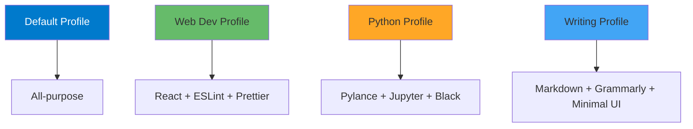

# Profile Management and Settings Sync

## Learning Objectives

- Create and manage VS Code profiles for different workflows
- Sync settings, extensions, and keybindings across devices
- Share profiles with teams
- Optimize profile performance
- Troubleshoot sync issues

## What are Profiles?

**Profiles = Complete VS Code Configurations**

Each profile contains:
- Settings
- Extensions
- Keybindings
- UI state
- Snippets



## Creating Profiles

### Method 1: UI

```
1. Click gear icon (bottom left)
2. "Profiles" → "Create Profile"
3. Choose:
   - Empty Profile
   - Copy from current
   - Profile template
4. Name it (e.g., "Web Development")
5. Select what to include
```

### Method 2: Command Palette

```
Ctrl+Shift+P → "Profiles: Create Profile"
```

## Profile Templates

### Web Development

**Extensions:**
- ESLint
- Prettier
- GitLens
- Auto Rename Tag
- Live Server
- Copilot

**Settings:**
```json
{
  "editor.formatOnSave": true,
  "editor.defaultFormatter": "esbenp.prettier-vscode",
  "eslint.autoFixOnSave": true
}
```

### Python Data Science

**Extensions:**
- Python
- Pylance
- Jupyter
- Black Formatter
- autoDocstring

**Settings:**
```json
{
  "[python]": {
    "editor.defaultFormatter": "ms-python.black-formatter",
    "editor.rulers": [88]
  },
  "jupyter.askForKernelRestart": false
}
```

### Writing & Documentation

**Extensions:**
- Markdown All in One
- Grammarly
- Code Spell Checker
- Paste Image

**Settings:**
```json
{
  "workbench.activityBar.visible": false,
  "workbench.statusBar.visible": false,
  "editor.minimap.enabled": false,
  "zenMode.centerLayout": true
}
```

### Minimal Performance

**Extensions:**
- None or essential only (GitLens, language support)

**Settings:**
```json
{
  "editor.minimap.enabled": false,
  "editor.suggest.enabled": false,
  "extensions.autoUpdate": false,
  "telemetry.telemetryLevel": "off"
}
```

## Switching Profiles

**Quick Switch:**
```
Click gear icon → Profiles → Select profile
Or: Ctrl+Shift+P → "Profiles: Switch Profile"
```

**Status Bar Indicator:**
```
Bottom left shows current profile name
```

## Profile Export & Import

### Export Profile

```
1. Gear icon → Profiles
2. Select profile → "Export Profile"
3. Choose what to include
4. Save as .code-profile file
```

### Import Profile

```
1. Gear icon → Profiles → "Import Profile"
2. Select .code-profile file
3. Review contents
4. Import
```

### Share with Team

**Create .code-profile:**
```json
{
  "name": "Company Standard",
  "settings": "{...}",
  "extensions": [
    "dbaeumer.vscode-eslint",
    "esbenp.prettier-vscode"
  ],
  "keybindings": "[...]"
}
```

**Distribute:**
```
1. Save to shared location (Git repo, Google Drive)
2. Team imports profile
3. Everyone has same setup
```

## Settings Sync

### Enable Sync

```
1. Click gear icon → "Turn on Settings Sync"
2. Sign in (GitHub or Microsoft)
3. Select what to sync:
   ✅ Settings
   ✅ Keyboard Shortcuts
   ✅ Extensions
   ✅ User Snippets
   ✅ UI State
   ✅ Profiles
```

### What Gets Synced

**Synced:**
- User settings.json
- Keybindings.json
- Extensions list
- Snippets
- UI state (sidebar, panel positions)
- Profiles

**NOT Synced:**
- Workspace settings
- Extension data (varies by extension)
- Local files

### Manual Sync

```
Ctrl+Shift+P:
- "Settings Sync: Show Synced Data"
- "Settings Sync: Turn Off"
- "Settings Sync: Configure"
```

### Sync Across Devices

**Scenario:** Work desktop → Home laptop → Cloud VM

```
1. Enable sync on work desktop
2. Install VS Code on laptop
3. Sign in with same account
4. Sync downloads automatically
5. Repeat for cloud VM
```

**Updates propagate:**
- Change extension on desktop → Syncs to laptop
- Add snippet on laptop → Syncs to VM
- Install extension on VM → Syncs everywhere

## Profile-Specific Settings

### Override Settings per Profile

```json
// User settings.json (applies to all profiles unless overridden)
{
  "editor.fontSize": 14
}

// Web Dev profile settings
{
  "editor.fontSize": 12,  // Override
  "editor.formatOnSave": true  // Profile-specific
}
```

### Profile Icons

**Customize profile appearance:**
```
1. Click profile name
2. "Edit Icon"
3. Choose emoji or upload image
```

## Advanced Profile Management

### Profile Templates

**Create template for team:**

```json
// company-profile.json
{
  "name": "Company Standard",
  "settings": {
    "editor.tabSize": 2,
    "files.eol": "\n",
    "editor.formatOnSave": true,
    "editor.codeActionsOnSave": {
      "source.fixAll.eslint": "explicit"
    }
  },
  "extensions": [
    "dbaeumer.vscode-eslint@2.4.0",
    "esbenp.prettier-vscode@10.0.0",
    "eamodio.gitlens@14.0.0"
  ]
}
```

### Conditional Extensions

**Extensions per profile:**
```
Web Dev: Install ESLint, Prettier
Python: Install Python, Jupyter (NOT ESLint)
Writing: Install Markdown, Grammarly (NOTHING else)
```

**Result:** Faster startup, less clutter

## Troubleshooting

### Sync Not Working

**Check:**
```
1. Signed in? (gear icon → account name shown)
2. Internet connection
3. Sync enabled? (gear icon → Settings Sync: ON)
4. Conflicts? (Ctrl+Shift+P → "Settings Sync: Show Synced Data")
```

**Reset Sync:**
```
Ctrl+Shift+P → "Settings Sync: Reset Local"
Beware: Overwrites local with cloud
```

### Profile Not Switching

**Solution:**
```
1. Reload window (Ctrl+Shift+P → "Reload Window")
2. Verify profile selected (bottom left)
3. Check for extension conflicts
```

### Extensions Missing After Profile Switch

**Cause:** Extensions installed locally, not in profile

**Solution:**
```
1. Switch to correct profile
2. Install extension
3. It's now part of that profile
```

## Pro Tips

### Tip 1: Auto-Switch Profiles

**Use workspace settings:**
```json
// project/.vscode/settings.json
{
  "extensions.profileName": "Web Development"
}
```

VS Code suggests switching when opening workspace.

### Tip 2: Backup Profiles

**Export regularly:**
```
1. Export each profile monthly
2. Save to Git repo or cloud storage
3. Version control for rollback
```

### Tip 3: Minimal Profile for Performance

**Use when:**
- Low-powered device
- Large project
- Remote connection slow

**Settings:**
```json
{
  "extensions.autoUpdate": false,
  "files.watcherExclude": {
    "**/node_modules": true
  },
  "search.followSymlinks": false
}
```

### Tip 4: Share Profiles via Git

**Workflow:**
```bash
# Export profile
code --export-profile "Web Dev" > web-dev-profile.code-profile

# Commit to repo
git add web-dev-profile.code-profile
git commit -m "Add Web Dev profile"

# Team imports
code --import-profile web-dev-profile.code-profile
```

### Tip 5: Profile Per Project Type

**Structure:**
```
Default → General use
Frontend → React, Vue, Angular
Backend → Node.js, Python, Rust
DevOps → Docker, Kubernetes, Terraform
Data → Python, Jupyter, R
```

## Assessment

**Create Your Profile System:**

1. Identify 3-5 workflows you have
2. Create profile for each
3. Configure extensions and settings
4. Export profiles
5. Enable Settings Sync
6. Test switching between profiles

**Success Criteria:**
- [ ] Multiple functional profiles
- [ ] Settings sync working
- [ ] Profiles exported/backed up
- [ ] Faster workflow with right profile

## Resources

- [Profiles Documentation](https://code.visualstudio.com/docs/editor/profiles)
- [Settings Sync](https://code.visualstudio.com/docs/editor/settings-sync)

---

**Time**: 2 hours
**Difficulty**: Beginner to Intermediate
