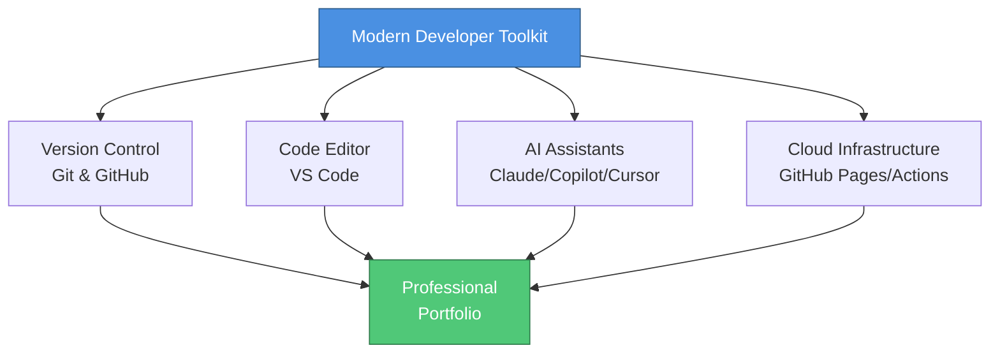
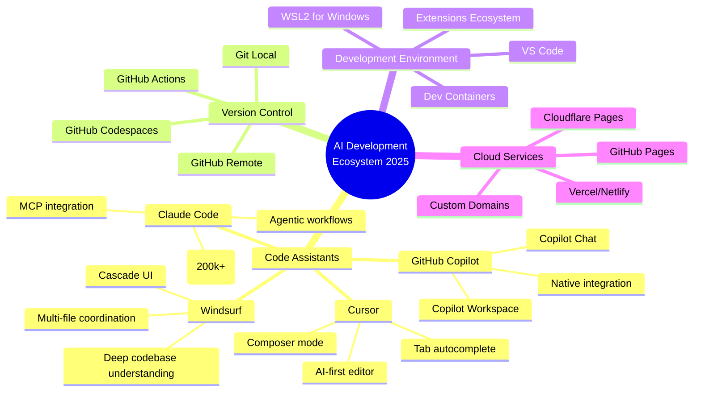
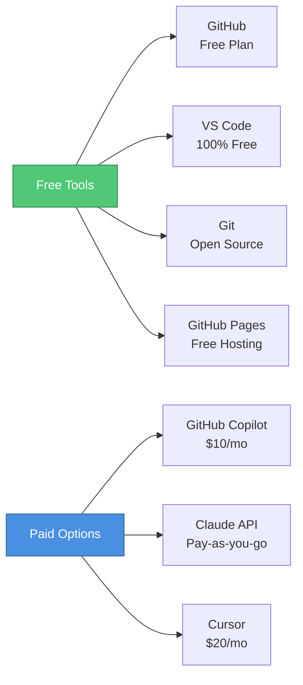

# Chapter 0: Introduction & Workshop Overview

⏱️ **Time:** 15 minutes | 🎯 **Difficulty:** 🟢 Beginner

## Welcome to Modern Development Infrastructure

Welcome to the cutting edge of creative technology! This comprehensive workshop equips you with a world-class development toolchain that combines traditional version control, modern code editors, and revolutionary AI-powered development tools.

In 2025, the landscape of software development has been transformed by AI assistants like **Claude Code**, **GitHub Copilot**, **Cursor**, and **Windsurf**. However, these powerful tools are only as effective as the foundation they're built upon. This workshop establishes that foundation.



## What You'll Build

By completing this workshop, you'll establish:

- **Robust Version Control**: Track every change, experiment fearlessly, and collaborate effectively
- **Seamless Collaboration**: Work with teams using industry-standard workflows
- **Free Web Hosting**: Showcase projects via GitHub Pages with custom domains
- **AI-Powered Development**: Leverage cutting-edge AI to generate, explain, and refactor code
- **Context Management**: Master advanced techniques for working with AI assistants
- **Professional Presence**: Build a portfolio that demonstrates modern development practices

## The 2025 AI Development Landscape



## Workshop Structure

| Time | Session | Modern Tools Covered |
|:----:|---------|---------------------|
| **00:00–00:15** | Introduction & Setup | Git, GitHub, VS Code, WSL2 |
| **00:15–00:45** | Version Control Fundamentals | Git workflows, conventional commits, GitHub CLI |
| **00:45–01:00** | **☕ Break 1** | |
| **01:00–01:50** | AI Development Environment | Claude Code, Copilot, Cursor setup & best practices |
| **01:50–02:00** | **☕ Break 2** | |
| **02:00–02:50** | Modern Git Workflows | Pull requests, GitHub Actions, branch protection |
| **02:50–03:00** | **☕ Break 3** | |
| **03:00–03:50** | Cloud Deployment & AI Integration | GitHub Pages, custom domains, advanced AI workflows |
| **03:50–04:00** | Wrap-up & Resources | Next steps, community resources |

## Why This Foundation Matters

### The Modern Development Trinity

```
┌─────────────────────────────────────────────────────────┐
│                                                         │
│  ┌──────────┐      ┌──────────┐      ┌──────────┐     │
│  │          │      │          │      │          │     │
│  │   Git    │◄────►│ VS Code  │◄────►│    AI    │     │
│  │  GitHub  │      │   WSL2   │      │ Assistants│     │
│  │          │      │          │      │          │     │
│  └──────────┘      └──────────┘      └──────────┘     │
│       ▲                  ▲                  ▲          │
│       │                  │                  │          │
│       └──────────────────┴──────────────────┘          │
│              All Working Together                      │
│                                                         │
└─────────────────────────────────────────────────────────┘
```

**1. Git & GitHub: Your Safety Net and Portfolio**
- Create unlimited public and private repositories
- Build a professional portfolio that recruiters actually look at
- Collaborate on open-source projects
- Host websites for free with GitHub Pages
- Automate workflows with GitHub Actions

**2. VS Code: Your Command Center**
- Industry-standard editor with millions of extensions
- Seamless Git integration
- Remote development via WSL2
- Integrated terminal and debugging
- AI assistant integration

**3. AI Assistants: Your Development Multiplier**

Modern options include:

| Tool | Best For | Pricing Model | Key Features 2025 |
|------|----------|---------------|--------------|
| **Claude Code** | Agentic workflows, complex refactoring | Usage-based (Anthropic) | 200k context, MCP servers, autonomous agents |
| **GitHub Copilot** | Real-time suggestions, GitHub integration | $10/month or free for students | Copilot Chat, Workspace, inline suggestions |
| **Cursor** | AI-first development | $20/month | Composer mode, Tab autocomplete, multi-file edits |
| **Windsurf** | Deep code understanding | $10-15/month | Cascade UI, context-aware editing |
| **Continue** | Open-source AI integration | Free (bring your own API) | Model flexibility, customizable |

> **💡 Tip:** Start with GitHub Copilot if you're a student (it's free!), or use Continue with free API tiers from Anthropic, Google, or OpenAI.

## Pro Tips for Success

> **🎯 Start Simple:** Master basic Git workflows before diving into AI-assisted development.

> **💡 Commit Often:** Small, frequent commits are your time machine—make liberal use of them.

> **🤖 Learn AI Limitations:** AI assistants are powerful but not infallible. Always review generated code.

> **🔐 Security First:** Never commit API keys or secrets. Use environment variables and `.gitignore`.

> **📚 Read the Docs:** Official documentation is always more reliable than AI-generated answers for edge cases.

## Common Pitfalls to Avoid

```
❌ AVOID                          ✅ DO INSTEAD
━━━━━━━━━━━━━━━━━━━━━━━━━━━━━━━━━━━━━━━━━━━━━━━━━━━━━━
Committing without messages    →  Write descriptive commit messages
Ignoring .gitignore             →  Exclude node_modules, .env files
Pushing directly to main        →  Use feature branches & PRs
Trusting AI blindly             →  Review and test all generated code
Working without backups         →  Push to GitHub regularly
Hardcoding secrets              →  Use environment variables
Large binary files in Git       →  Use Git LFS or external storage
```

## What Makes This Workshop Different

Unlike basic Git tutorials, this workshop focuses on:

1. **Modern AI Integration**: Learn to work effectively with Claude Code, Copilot, and other AI assistants
2. **Real-World Workflows**: Industry-standard practices used by professional teams in 2025
3. **Context Management**: Advanced techniques for maximizing AI assistant effectiveness
4. **Professional Practices**: Conventional commits, semantic versioning, automated testing
5. **Cloud-First Mindset**: Deploy from day one using GitHub Pages and Actions

## Initial Setup Investment

Yes, this initial configuration requires effort:
- Creating accounts (GitHub, potentially API providers)
- Installing software (Git, VS Code, optional WSL2)
- Configuring integrations
- Learning new workflows

**But consider this**: You're building a foundation that will:
- Serve you for your entire development career
- Cost essentially nothing ongoing (free tiers are generous)
- Make you significantly more productive
- Provide a professional portfolio
- Enable collaboration at scale

## The Free (or Nearly Free) Ecosystem



Most of what you'll use is **completely free**:
- GitHub Free Plan: Unlimited repos, Actions minutes, Pages hosting
- VS Code: Free, open source
- Git: Free, open source
- Continue: Free (with your API keys)
- Generous free tiers: Anthropic Claude (limited), Google Gemini, OpenAI

Optional paid tools offer enhanced features but aren't required.

## Looking Ahead: The Future of Development in 2025

As we progress through 2025, several trends are reshaping development:

**🤖 Agentic AI**: Tools like Claude Code that can autonomously complete complex tasks with MCP servers

**🔗 Integrated Workflows**: Seamless connections between version control, CI/CD, and deployment

**☁️ Cloud-Native Development**: Editing, testing, and deploying entirely in the cloud (GitHub Codespaces)

**🧠 Context-Aware AI**: Assistants that understand your entire codebase and development history

This workshop positions you at the forefront of these changes.

> **📝 Note:** The field is evolving rapidly. What's cutting-edge today may be standard tomorrow. Focus on fundamentals that transfer across tools.

## Ready to Begin?

This tutorial will transform you from a hesitant beginner into a confident developer with:
- Professional version control skills
- Modern development workflows
- AI-assisted coding capabilities
- A deployed portfolio website
- Industry-standard best practices

The journey ahead is challenging but rewarding. Let's build something amazing together.

<details>
<summary>🎯 Knowledge Check</summary>

Before moving forward, ensure you understand:
1. What is the "Modern Development Trinity"?
2. Name three AI coding assistants available in 2025
3. What's the difference between Git and GitHub?
4. Why is version control important when working with AI?

</details>

---

**Next**: [Chapter 1: Why Git? Understanding Modern Version Control](./01_why_git.md)
