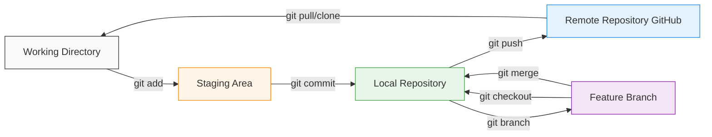
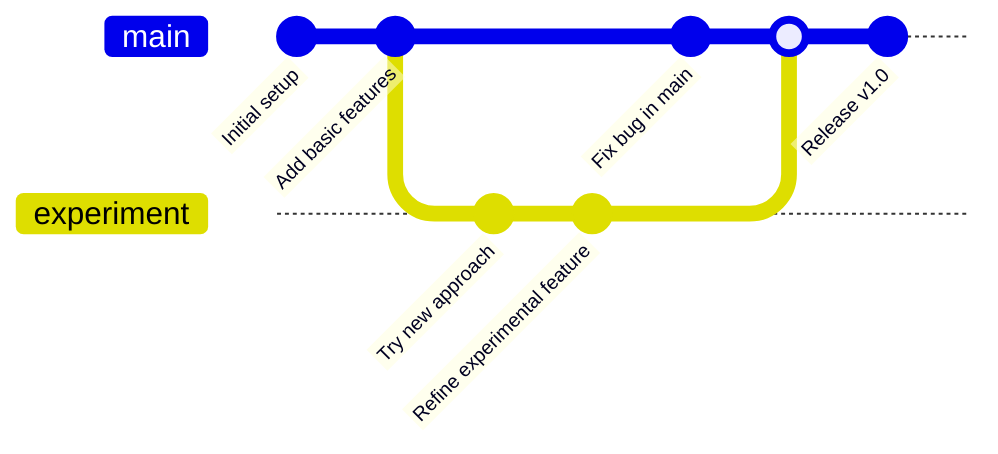

# Chapter 1: Why Git? Understanding Version Control

⏱️ **Time:** 10 minutes | 🎯 **Difficulty:** 🟢 Beginner

Before exploring the practicalities of Git, it's essential to understand its purpose. This chapter introduces [Git](https://git-scm.com/) and [GitHub](https://github.com/), explaining their roles and the specific problems they solve, particularly for creative technologists in 2025.

## 1.1 Problems Solved by Git

When working on complex projects—such as software development, interactive installations, detailed designs, or extensive documentation—you may encounter common challenges:

- Experimenting with new ideas without risking existing work
- Accidentally deleting or overwriting important files and needing to revert changes
- Collaborating with others and managing multiple versions of the same project
- Sharing your work efficiently without relying on cumbersome file transfers
- Understanding what changed, when, and why

> **💡 Real-World Example:** Imagine you're building an interactive installation for a gallery. You have a working prototype, but you want to experiment with a new interaction model. Without version control, you'd need to duplicate your entire project folder (maybe calling it `project-v2-backup-final-REAL`). With Git, you simply create a branch, experiment freely, and can switch back instantly if things don't work out.

Git is a **version control system** designed specifically to address these issues. It enables you to:

- **Experiment Safely:** Create separate "branches" to test new ideas without affecting your main project. Unsuccessful experiments can be discarded easily.
- **Track and Revert Changes:** Record incremental "commits" (snapshots) of your project, each with a clear description. This detailed history allows you to revert to any previous state quickly.
- **Collaborate Efficiently:** Manage contributions from multiple collaborators, simplifying the merging of changes and clearly attributing each modification.
- **Showcase Your Work:** Host your repositories online using platforms like GitHub, creating professional and accessible portfolios.
- **Engage with Open Source:** Participate in open-source projects, find collaborators, and build a visible presence within the creative technology community.

## 1.2 Core Git Concepts Explained

Below are the fundamental Git concepts explained clearly:

| Concept        | Explanation                                                | Real-World Analogy |
| -------------- | ---------------------------------------------------------- | ------------------ |
| **Repository** | A directory that tracks every change made to its contents. Often abbreviated as "repo." | A project folder with superpowers |
| **Commit**     | A recorded snapshot of your project at a specific point in time, accompanied by a descriptive message. | A saved game checkpoint |
| **Branch**     | A parallel version of your project, allowing independent development of features or experiments. | A parallel timeline |
| **Remote**     | A cloud-hosted copy of your repository, typically on platforms like [GitHub](https://github.com/), used for sharing and backup. | Your project in the cloud |
| **Staging Area** | A preparatory space where you select which changes to include in your next commit. | A packing area before shipping |

The following Mermaid diagram illustrates the typical Git workflow clearly:



## 1.3 Git vs. GitHub: Clarifying the Difference

A common source of confusion is the distinction between Git and GitHub:

- **Git:** The underlying version control software, originally developed by Linus Torvalds for managing Linux kernel development. Git operates locally on your computer and can function entirely offline.
- **GitHub:** A web-based platform that hosts Git repositories, providing additional features such as a graphical interface, collaboration tools (e.g., pull requests, issue tracking), user management, and services like [GitHub Pages](./05_github_pages.md).

```
┌─────────────────────────────────────────────────────────┐
│                                                         │
│  GIT (Local)              GITHUB (Cloud)                │
│  ┌──────────────┐        ┌──────────────┐              │
│  │              │        │              │              │
│  │  Version     │  push  │  Remote      │              │
│  │  Control     │───────>│  Hosting     │              │
│  │  System      │  pull  │  + Features  │              │
│  │              │<───────│              │              │
│  └──────────────┘        └──────────────┘              │
│                                                         │
│  Runs on your             Runs in cloud                │
│  computer                 Provides:                     │
│                           • Collaboration               │
│                           • GitHub Pages                │
│                           • Actions (CI/CD)             │
│                           • Issue tracking              │
│                                                         │
└─────────────────────────────────────────────────────────┘
```

> **📝 Note:** In simple terms, Git is the core technology, while GitHub is one popular platform built upon Git. Although alternatives like GitLab and Bitbucket exist, GitHub remains the most widely used, particularly within the open-source community.

Throughout this tutorial, you will install and use Git locally, but your primary interaction with remote repositories will be through GitHub.

## 1.4 Why Version Control Matters for AI-Assisted Development

In 2025, AI coding assistants are commonplace, but they make version control even MORE important:

> **⚠️ Warning:** AI tools can generate large amounts of code quickly. Without version control, a single bad AI suggestion could overwrite hours of work with no way to recover.

**Version control is essential when working with AI because:**

1. **AI Makes Mistakes:** AI-generated code isn't always correct. Version control lets you revert bad suggestions instantly.
2. **Experimentation is Safe:** Try multiple AI-generated solutions in different branches and compare them.
3. **Audit Trail:** See exactly what the AI changed and when, making debugging easier.
4. **Collaboration:** Work alongside AI assistants while preserving your ability to review and approve changes.

## 1.5 GitHub's Modern Features (2025)

GitHub has evolved far beyond simple code hosting:

<details>
<summary><strong>GitHub Copilot Integration</strong></summary>

- **Copilot Chat**: Ask questions about your code directly in VS Code
- **Copilot Workspace**: AI-powered development environments
- **Copilot CLI**: AI assistance in your terminal

</details>

<details>
<summary><strong>GitHub Actions</strong></summary>

- Automate testing, building, and deployment
- Free CI/CD for public repositories
- Extensive marketplace of pre-built actions

</details>

<details>
<summary><strong>GitHub Codespaces</strong></summary>

- Full development environment in the browser
- Pre-configured with your project's dependencies
- Access your code from anywhere

</details>

<details>
<summary><strong>GitHub Pages</strong></summary>

- Free static site hosting
- Custom domains supported
- Automatic builds from your repository

</details>

## 1.6 The Git Advantage: Time Travel for Code

Think of Git as a time machine for your project. Every commit is a snapshot you can return to:



This becomes incredibly powerful when combined with AI assistants:
- Let AI refactor your code on a branch
- If it works, merge it
- If it breaks things, delete the branch
- Your main code is always safe

<details>
<summary>🎯 Knowledge Check</summary>

Before moving forward, ensure you can answer:
1. What is the difference between Git and GitHub?
2. Name three problems that Git solves for developers
3. What is a "commit" and why is it important?
4. Why is version control especially important when using AI assistants?
5. Can you use Git without GitHub? Can you use GitHub without Git?

**Answers:**
1. Git is the version control software (runs locally), GitHub is the cloud hosting platform
2. Safe experimentation, tracking changes, collaboration, recovery from mistakes
3. A commit is a snapshot of your project at a point in time; it creates a history you can navigate
4. AI can make mistakes or generate large changes quickly; version control provides safety and audit trails
5. Yes, Git works offline; No, GitHub is built on Git

</details>

---

**Next**: [Chapter 2: Essential Setup: Accounts & Installations](./02_setup_overview.md)
