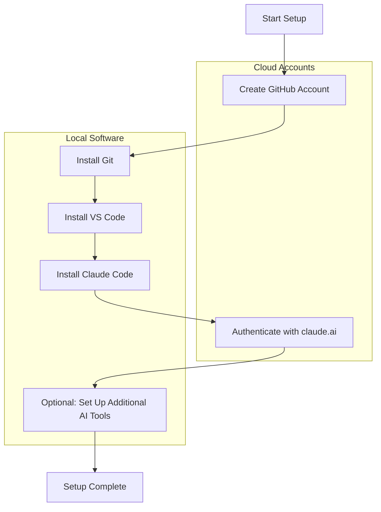

# Chapter 2: Essential Setup: Accounts & Installations

This chapter guides you through the essential setup required to establish your digital toolkit. Although the initial configuration involves several steps, it is primarily a one-time process. Completing this setup provides a robust, free, and powerful environment for your creative technology projects.

The setup process includes:

1. **[Creating Your GitHub Account](./02_a_github_account.md):**
   - Establish your presence on GitHub, the central platform for collaborative development and open-source contributions.

2. **[Installing Git & VS Code](./02_b_install_git_vscode.md):**
   - Install Git, the core version control system, and Visual Studio Code, your primary code editor.

3. **[Setting Up AI API Keys (2026 Edition)](./02_c_gcp_api_key.md):**
   - Set up access to AI coding tools. Claude Code works with your free claude.ai account (no API key needed), or you can obtain API keys from Anthropic, Google, or OpenAI for advanced use.

4. **[Configuring AI Coding Assistants in VS Code (2026 Edition)](./02_d_roo_code_config.md):**
   - Set up Claude Code and other AI tools to work with your development environment.

The following Mermaid diagram summarises the setup workflow clearly:

Take your time with each step. Once completed, you will have a fully functional development environment ready for productive work.

---

First up: [Chapter 2a: Creating Your GitHub Account](./02_a_github_account.md)
