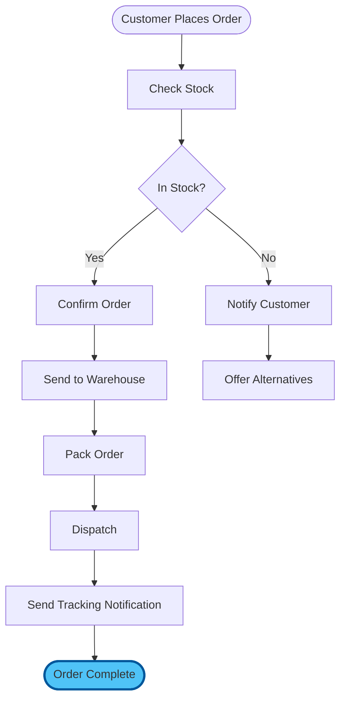
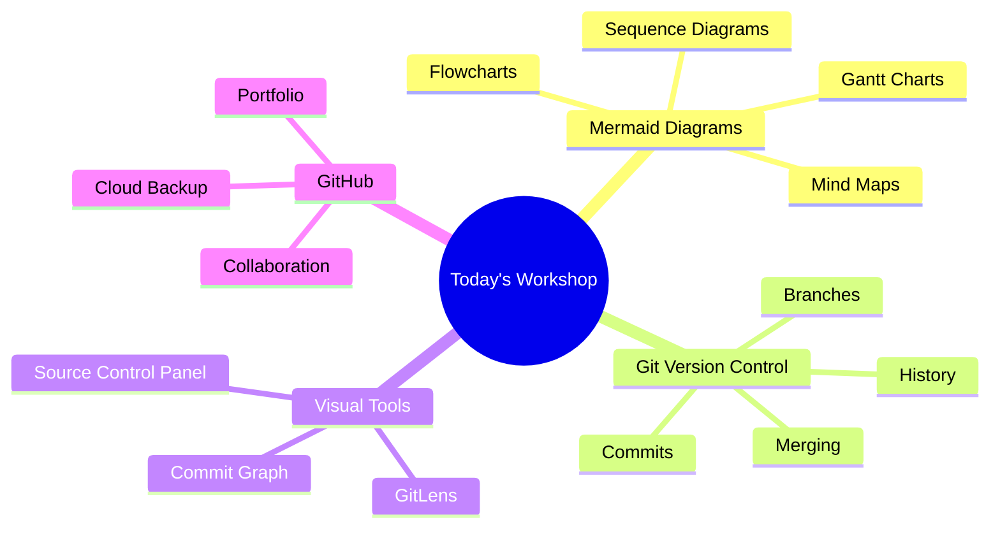

# Chapter 5: Assessment — Validating Your Visual Version Control Mastery

## Introduction: Proving Your New Skills

This assessment validates that you've mastered Mermaid diagramming, Git version control, and visual documentation workflows. It combines knowledge checks with practical demonstrations.

**Time:** 10 minutes
**Passing Score:** 80% (24/30 points)
**Format:** Multiple choice, practical tasks, and reflection

---

## Part 1: Knowledge Check (10 points)

### Question 1: Mermaid Fundamentals (2 points)

What is the primary advantage of Mermaid diagrams over traditional diagramming tools like Visio or Lucidchart?

A) They produce higher resolution images
B) They are text-based, making them versionable, editable, and AI-generatable
C) They support more colours and styles
D) They require specialised software to view

**Answer:** B

---

### Question 2: Git Core Concepts (2 points)

What does a Git "commit" represent?

A) Uploading a file to the internet
B) Deleting old versions of a file
C) A named snapshot of your project at a specific point in time
D) A copy of someone else's work

**Answer:** C

---

### Question 3: Branching Strategy (2 points)

Why would you create a Git branch before making significant changes?

A) It's required by VS Code
B) It lets you experiment without affecting the stable main version
C) It makes files load faster
D) It's only useful for software developers

**Answer:** B

---

### Question 4: GitLens Features (2 points)

What does GitLens "inline blame" show you?

A) A list of bugs in your code
B) Who last changed each line, when, and why (from the commit message)
C) The file size and creation date
D) A list of all files in the project

**Answer:** B

---

### Question 5: Diagram Selection (2 points)

Which Mermaid diagram type is most appropriate for showing a project timeline with task dependencies?

A) Flowchart
B) Sequence diagram
C) Gantt chart
D) Mind map

**Answer:** C

---

## Part 2: Practical Skills (15 points)

### Task 1: Create a Mermaid Diagram from Description (4 points)

**Instructions:** Read the following description and create a Mermaid flowchart in a new file called `assessment/task1-diagram.md`.

> "A customer places an order online. The system checks stock availability. If in stock, the order is confirmed and sent to the warehouse for packing. If out of stock, the customer is notified and offered alternatives. Once packed, the order is dispatched and the customer receives a tracking notification."

**Evaluation Criteria:**
- Correct Mermaid syntax that renders without errors (1 point)
- All steps from the description are included (1 point)
- Decision point (in stock/out of stock) uses a diamond shape (1 point)
- Diagram flows logically from start to finish (1 point)

<details>
<summary><strong>Reference Solution</strong></summary>



</details>

---

### Task 2: Execute a Git Workflow (4 points)

**Instructions:** Demonstrate a complete Git workflow:

1. Create a new file `assessment/task2-notes.md` with a paragraph about what you learned today
2. Stage the file using VS Code Source Control panel
3. Write a proper conventional commit message
4. View your commit in GitLens (commit graph or file history)

**Evaluation Criteria:**
- File created with meaningful content (1 point)
- File staged correctly (visible in "Staged Changes") (1 point)
- Commit message follows conventional format, e.g., `docs: add workshop reflection notes` (1 point)
- Can locate the commit in GitLens history (1 point)

---

### Task 3: Investigate File History with GitLens (3 points)

**Instructions:**

1. Open any file in your project that has at least 2 commits
2. Use GitLens to view the file's history
3. Compare two different versions of the file (side-by-side diff)

**Evaluation Criteria:**
- Successfully opened file history view (1 point)
- Identified at least 2 commits for the file (1 point)
- Opened a diff comparison between two versions (1 point)

---

### Task 4: Branch, Edit, and Merge (4 points)

**Instructions:**

1. Create a new branch called `assessment/add-summary`
2. Create a file `assessment/workshop-summary.md` with a Mermaid mind map of today's key topics
3. Commit the file on the branch
4. Switch back to `main` and merge the branch

**Evaluation Criteria:**
- Branch created with a descriptive name (1 point)
- File contains a valid Mermaid mind map (1 point)
- Commit made on the correct branch (not on main) (1 point)
- Successfully merged back to main (1 point)

<details>
<summary><strong>Hint: Mind Map Structure</strong></summary>



</details>

---

## Part 3: Reflection & Application (5 points)

### Question 1: Real-World Application (2 points)

**Describe one specific document or process from your work that would benefit from Mermaid diagrams and Git version control. Be specific about:**

- What the document/process is
- Which diagram type you would use and why
- How version control would improve how you manage it
- What the current pain point is

**Evaluation:**
- Specific, realistic example from your own work (1 point)
- Clear explanation of how diagrams and version control address the problem (1 point)

---

### Question 2: Teaching Back (3 points)

**A colleague asks: "Why should I bother learning Mermaid and Git when I already have Word and Dropbox?"**

Write your response (3-5 sentences) explaining the key advantages.

**Evaluation Criteria:**
- Mentions version history and trackability advantages over Dropbox (1 point)
- Explains that Mermaid diagrams update instantly from text (no manual redrawing) (1 point)
- Notes collaboration benefits (branching, pull requests, no email attachments) (1 point)

---

## Scoring Guide

### Total Points: 30

**Scoring Breakdown:**

- **27-30 points (90-100%):** Master Level
  - Full command of visual documentation and version control
  - Ready to teach others and lead team adoption
  - Can implement advanced workflows independently

- **24-26 points (80-89%):** Proficient Level
  - Strong understanding of all core concepts
  - Can work independently with visual Git tools
  - Minor areas to refine with practice

- **18-23 points (60-79%):** Developing Level
  - Basic skills established but need reinforcement
  - Review exercises and repeat hands-on sections
  - Focus on areas where tasks were incomplete

- **Below 18 points (<60%):** Needs Review
  - Revisit core concepts (Chapter 1)
  - Complete the hands-on section again (Chapter 2)
  - Schedule additional practice time

## Self-Assessment Checklist

Beyond the formal assessment, can you confidently say:

**Mermaid Diagrams:**
- [ ] I can create a flowchart from a written process description
- [ ] I can build a Gantt chart for project planning
- [ ] I can write a sequence diagram for interaction flows
- [ ] I can generate a mind map for brainstorming sessions
- [ ] I know how to preview and debug Mermaid diagrams

**Git Version Control:**
- [ ] I can initialise a repository and make commits
- [ ] I understand the stage-commit-push workflow
- [ ] I can create and merge branches
- [ ] I write meaningful conventional commit messages
- [ ] I can use GitLens to view file history

**Professional Workflow:**
- [ ] I can combine diagrams and version control in a single project
- [ ] I can push work to GitHub for backup and sharing
- [ ] I know when to create a branch vs. commit directly
- [ ] I can resolve a basic merge conflict
- [ ] I can explain these tools' value to a colleague

## Areas for Improvement

Based on your assessment results, identify 2-3 areas to focus on:

1. **Area to Improve:** _____________
   **Action Plan:** _____________
   **Target Date:** _____________

2. **Area to Improve:** _____________
   **Action Plan:** _____________
   **Target Date:** _____________

3. **Area to Improve:** _____________
   **Action Plan:** _____________
   **Target Date:** _____________

## Certification Statement

Upon achieving 80% or higher:

```
+----------------------------------------------+
|                                              |
|   CERTIFICATE OF COMPLETION                  |
|                                              |
|   This certifies that                        |
|                                              |
|   [Your Name]                                |
|                                              |
|   has successfully completed                 |
|   Visual Tools & Version Control Workshop    |
|                                              |
|   and demonstrated mastery of:               |
|   - Mermaid diagram creation                 |
|   - Git version control workflows            |
|   - Visual documentation with GitLens        |
|   - GitHub integration and collaboration     |
|                                              |
|   Score: ____ / 30                           |
|   Date: ___________                          |
|                                              |
+----------------------------------------------+
```

## Next Steps Based on Performance

### If You Scored 90%+

**You're Ready For:**
- Leading visual documentation adoption in your team
- Advanced Git workflows (rebasing, cherry-picking, bisect)
- Building team templates and documentation standards
- Contributing to open-source projects

**Recommended Actions:**
1. Push your workshop project to GitHub today
2. Create a Mermaid diagram for a real meeting this week
3. Commit daily for the next 7 days
4. Teach one colleague the basics

### If You Scored 80-89%

**You're Ready For:**
- Daily use of Mermaid diagrams in your documentation
- Independent Git workflow for all your projects
- Continued practice with more complex diagrams
- Tomorrow's workshop sessions

**Recommended Actions:**
1. Repeat exercises 3-5 from Chapter 3 this evening
2. Create one Mermaid diagram per day for a week
3. Set up Git for your most important current project
4. Explore the Mermaid Live Editor for new diagram types

### If You Scored Below 80%

**You Should:**
- Review Chapters 1 and 2 carefully
- Repeat all exercises from Chapter 3
- Focus specifically on the areas where tasks were incomplete
- Seek help through office hours

**Recommended Actions:**
1. Revisit the hands-on section (Chapter 2) step by step
2. Practice creating one flowchart and one Gantt chart from scratch
3. Complete the Git workflow exercise (Exercise 3) until it feels natural
4. Use the Mermaid Live Editor (https://mermaid.live/) for instant feedback

## Reassessment Policy

If you scored below 80%:
- You may retake after completing additional practice
- Review the recommended materials and exercises
- Schedule a 1:1 help session if needed
- No penalty for retaking — learning is the goal

## Continuous Improvement

### 7-Day Challenge

- [ ] Day 1: Push today's workshop project to GitHub
- [ ] Day 2: Create a Mermaid flowchart for a real process
- [ ] Day 3: Make 3 meaningful commits on a project
- [ ] Day 4: Create a Gantt chart for an upcoming project
- [ ] Day 5: Use GitLens to review your week's commit history
- [ ] Day 6: Create a sequence diagram for a work interaction
- [ ] Day 7: Build a mind map for your next brainstorming session

### 30-Day Goals

- [ ] All important documents under version control
- [ ] Mermaid diagrams standard in your reports and proposals
- [ ] GitHub profile reflects active, professional use
- [ ] At least one colleague introduced to these tools
- [ ] 5+ hours per week saved on documentation tasks

## Congratulations!

Whether you achieved a perfect score or identified areas for growth, you've taken a significant step toward professional documentation mastery. The combination of visual diagrams and version control is a force multiplier that compounds over time.

**Remember:**
- Every professional diagram you create saves future hours
- Every commit protects your work and tells your story
- Practice makes these tools feel as natural as saving a file
- The real assessment is how you apply these skills tomorrow

---

Next: [Chapter 6: Resources & Continued Learning](./06_resources.md)

[Back to Project](./04_project.md) | [Back to Module Overview](README.md)
